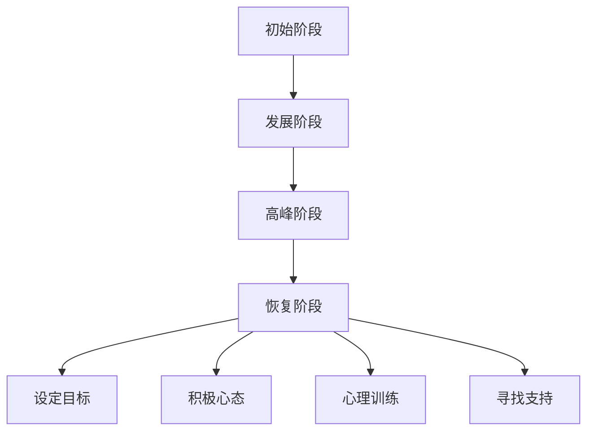
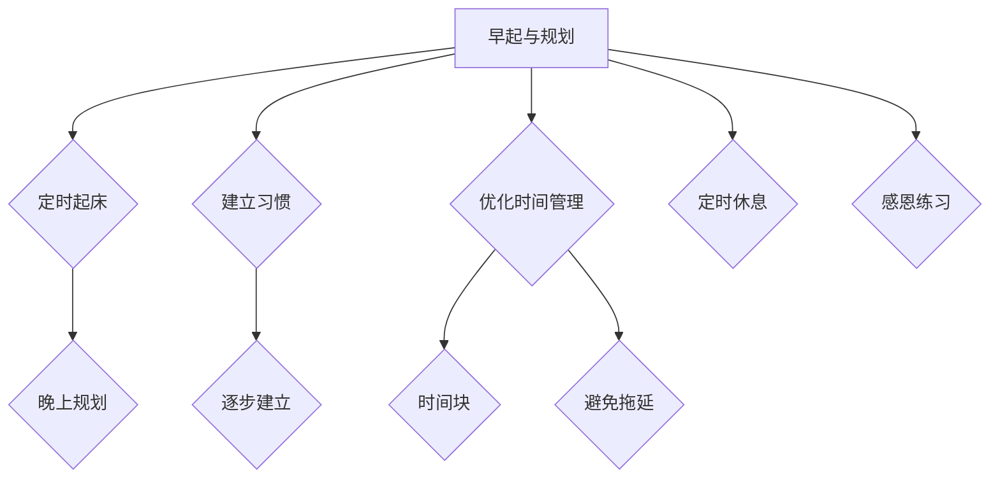
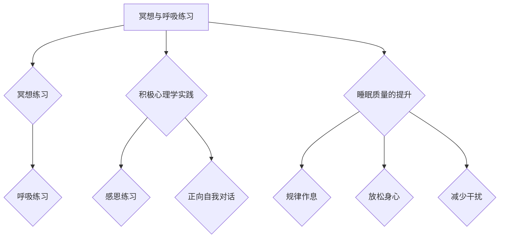

                 

### 概述与背景

在现代社会，我们常常听到人们抱怨生活空虚、意义缺失。这种现象不仅存在于个人层面，也广泛地反映在社会各个层面。许多人感到迷茫，似乎在忙碌的生活中找不到真正的方向和目标。《重塑生活意义：从虚无到充实的心灵之旅》这本书正是为了解决这一问题而作。它带领读者进行一次深入的心灵之旅，探索虚无感的根源，并提供一系列实践方法，帮助读者从虚无走向充实，找到生活的真正意义。

这本书的核心议题是如何在现代社会中重塑生活意义，使其不再只是日复一日的忙碌，而是充满意义和满足感。它不仅关注个体的内心世界，还关注社会环境对个体的影响。通过结合心理学原理和实践方法，书中提出了一个系统的理论框架，旨在帮助读者实现心灵的转变。

本书的目标是为那些渴望找到生活意义的人提供一套可行的策略和方法。无论你是感到迷茫的年轻人，还是渴望寻求生活新意义的职场人士，这本书都能为你提供有价值的指导。它不仅是一个理论性的探讨，更是一本实用性的指南，旨在引导读者走出虚无，走向充实。

接下来，我们将详细探讨书中的核心概念，如虚无、充实和生活意义，并深入分析这些概念的定义、特征和相互关系。这将为我们理解本书的理论框架奠定基础，为后续章节的探讨提供清晰的思路。

## 核心概念

在探讨《重塑生活意义：从虚无到充实的心灵之旅》这本书之前，我们需要明确几个核心概念：虚无、充实和生活意义。这些概念不仅是本书的主题，也是我们日常生活中常常遇到的挑战和困惑。

### 虚无

虚无是指一种缺乏意义、目的和方向的感觉。这种感觉可能源于内心的空虚，也可能来自于对外部世界的迷茫。虚无感并不是一个单一的状态，而是一个复杂的现象，它可能伴随着焦虑、抑郁等情绪。在现代社会中，虚无感尤为普遍，尤其是在追求物质财富和成功的过程中，许多人感到自己失去了生活的真正意义。

#### 特征

- **缺乏方向感**：虚无感常常导致个体在生活和工作中感到迷茫，不知道该往哪个方向前进。
- **情绪低落**：长期处于虚无状态的人可能会出现情绪低落、无助感等负面情绪。
- **缺乏动力**：虚无感使人失去前进的动力，即使面对重要的任务和挑战，也可能提不起兴趣。

### 充实

与虚无相对，充实是指一种感到满足、有意义和有目的的状态。当个体在生活中找到了自己的目标，并在追求这些目标的过程中获得了成就感和快乐时，他们就会感到充实。充实不仅仅是一种心理状态，它还涉及到生活的各个方面，包括职业、家庭、社交等。

#### 特征

- **有明确的目标**：充实的人通常有明确的生活目标和追求，这使他们在生活中充满方向和动力。
- **积极的情绪体验**：充实的生活使人产生积极的情绪体验，如快乐、满足、成就感等。
- **多方面的成就**：充实不仅体现在职业上的成功，还包括个人成长、家庭幸福、社交圈等各方面的成就。

### 生活意义

生活意义是指个体在生活中所追求的目标和价值观，它是对生活的一种理解和解释。生活意义不仅决定了我们的生活方向，还影响了我们的行为和选择。对于每个人来说，生活意义是独特的，它可能源于个人的信仰、价值观或对世界的理解。

#### 特征

- **个体差异性**：每个人的生活意义都是独特的，它反映了个人的人生观和价值观。
- **指导行为**：生活意义不仅为个体提供了目标，还指导了他们在生活中的行为和决策。
- **情感投入**：对生活意义的追求需要个体的情感投入和持续的努力。

### 关系

虚无、充实和生活意义之间有着密切的联系。虚无感常常源于对生活意义的迷失，而充实则是找到并实现生活意义的体现。生活意义为我们的生活提供了方向和动力，使我们在面对虚无时有了重新找到充实的方法。

#### 虚无感是如何导致不充实的

- **缺乏目标**：当个体缺乏明确的生活目标时，他们可能会感到迷茫和不知所措，从而陷入虚无感。
- **消极情绪**：长期的虚无感会导致消极情绪的积累，如焦虑、抑郁等，进一步影响生活的充实感。
- **缺乏动力**：虚无感使人失去追求目标的力量，导致生活缺乏活力和动力。

#### 从虚无走向充实的可能路径

- **明确目标**：通过设定具体、可实现的个人目标，可以帮助个体找到生活的方向，从而缓解虚无感。
- **积极心态**：培养积极的心态，学会从负面情绪中解脱出来，有助于提高生活的充实感。
- **持续努力**：实现生活目标需要持续的努力和投入，只有不断前进，才能真正走出虚无，走向充实。

通过理解这些核心概念，我们能够更好地把握本书的主题，并在实际生活中应用这些理念，重塑生活的意义。

### 心灵之旅理论框架

《重塑生活意义：从虚无到充实的心灵之旅》提出了一个系统的理论框架，旨在帮助读者走出虚无，找到生活的意义。这个理论框架主要包括两个核心部分：虚无感阶段模型和走出虚无的路径选择。

#### 虚无感阶段模型

虚无感是一个逐步发展的过程，可以分为几个阶段：

1. **初始阶段**：在这个阶段，个体可能感到一些轻微的空虚和迷茫，但尚未形成强烈的虚无感。这种状态可能由于生活压力、工作困境或个人挫折等原因引起。
2. **发展阶段**：随着时间的推移，虚无感逐渐加深，个体开始感到内心的空虚和无力。这个阶段可能伴随着焦虑、抑郁等情绪，使得个体对生活的满意度和幸福感下降。
3. **高峰阶段**：在这个阶段，虚无感达到顶峰，个体感到生活毫无意义，甚至对未来的希望感到绝望。这种状态可能会严重影响个体的心理健康和生活质量。
4. **恢复阶段**：通过采取有效的措施，个体可以逐步走出虚无感，恢复生活的意义和动力。这个阶段可能包括认知行为疗法、心理训练和积极心态的培养等。

#### 走出虚无的路径选择

为了从虚无中走出，本书提出了几种可能的路径选择：

1. **设定目标**：通过设定具体、可实现的个人目标，可以帮助个体找到生活的方向，从而缓解虚无感。例如，设定职业目标、健康目标或个人成长目标。
2. **积极心态**：培养积极的心态，学会从负面情绪中解脱出来，有助于提高生活的充实感。例如，通过冥想、感恩练习和正面思考等方法。
3. **心理训练**：通过心理训练，如认知行为疗法、情绪调节技巧等，可以帮助个体更好地应对生活中的挑战和压力，从而走出虚无。
4. **寻找支持**：建立支持系统，如与家人、朋友或专业人士的交流，可以帮助个体获得情感支持和指导，从而增强走出虚无的信心和动力。

#### Mermaid流程图

为了更直观地展示虚无感阶段模型和走出虚无的路径选择，我们可以使用Mermaid流程图来表示：

通过这个流程图，我们可以清晰地看到虚无感的阶段变化以及走出虚无的多种路径选择。

### 结论

心灵之旅理论框架为我们提供了一个全面的理解框架，帮助我们认识到虚无感的阶段和特点，同时也提供了多种路径选择，帮助我们从虚无中走出，找到生活的意义。通过这个理论框架，我们可以更好地应对生活中的挑战，重塑生活的意义，实现内心的充实和满足。

#### 心理学原理在重塑生活意义中的应用

在《重塑生活意义：从虚无到充实的心灵之旅》中，作者深入探讨了心理学原理在重塑生活意义中的应用。这些原理不仅为我们理解虚无感和充实感提供了科学依据，也为我们在实际生活中找到解决问题的方法指明了方向。以下将详细讨论几个关键的心理学原理：认知行为理论、情绪调节技巧和价值观澄清。

##### 认知行为理论

认知行为理论（Cognitive Behavioral Theory，CBT）是心理学中广泛应用的模型，旨在通过改变不合理的认知模式来改善情绪和行为。在重塑生活意义的过程中，CBT可以发挥重要作用：

1. **不合理信念识别**：认知行为理论认为，许多负面情绪和心理健康问题源于个体持有的不合理信念。例如，对于工作表现的不满可能源于“我必须完美”的不合理信念。识别这些不合理信念是改变的第一步。
2. **认知重构**：通过认知重构，个体可以学会用更合理、更现实的方式来看待问题。例如，将“我必须成功”改为“我努力争取成功”，这样可以减少压力和焦虑。
3. **行为激活**：认知行为理论强调行为对情绪的影响。通过设定具体的行为目标，如每天锻炼30分钟，可以帮助个体从消极情绪中走出来，增加生活的充实感。

##### 情绪调节技巧

情绪调节技巧是应对负面情绪、提升情绪体验的重要手段。以下几种情绪调节技巧在重塑生活意义中尤为有效：

1. **认知重评**：认知重评是通过改变对事件的解释来调节情绪。例如，面对失败时，我们可以从“我失败了”转变为“这是一个学习和成长的机会”。
2. **情绪释放**：情绪释放技巧，如写日记、倾诉或哭泣，可以帮助个体释放积累的负面情绪，从而减轻心理压力。
3. **放松训练**：通过深呼吸、冥想或瑜伽等放松训练，可以帮助个体放松身心，减轻焦虑和紧张情绪。

##### 价值观澄清

价值观澄清是帮助个体明确自己的价值观和目标，从而增强生活意义的过程。以下几种方法有助于澄清价值观：

1. **自我反思**：通过反思自己的行为和决策，个体可以更清楚地认识到自己的价值观。例如，我们可以问自己：“我为什么做这件事？它符合我的价值观吗？”
2. **价值排序**：通过将价值观按重要性排序，个体可以明确自己最看重的价值观，从而在决策时更加明确和坚定。
3. **目标设定**：在明确价值观后，设定具体、可实现的个人目标，可以帮助个体在追求这些目标的过程中感受到生活的意义和满足感。

##### 应用案例

以下是一个应用这些心理学原理的实际案例：

- **背景**：小王是一名年轻的程序员，他在工作中感到迷茫和空虚，不知道自己未来的方向。
- **不合理信念识别**：小王认为“如果我不成功，我就是一个失败者”，这是一种不合理信念。
- **认知重构**：通过认知重构，小王认识到“成功不是衡量个人价值的唯一标准，每个人都有自己的价值和潜力”。
- **情绪调节技巧**：小王开始练习深呼吸和冥想来减轻焦虑，通过写日记来释放负面情绪。
- **价值观澄清**：通过反思和排序，小王确定了自己重视的价值观是“追求有意义的工作和帮助他人”。

通过这些方法，小王逐渐找到了生活的方向和意义，开始重新审视自己的工作和生活，最终实现了内心的充实和满足。

##### 总结

心理学原理在重塑生活意义中提供了科学的指导和方法。通过认知行为理论、情绪调节技巧和价值观澄清，个体可以更好地理解自己的内心世界，找到生活的真正意义。这些方法不仅适用于个人，也可以在团队和组织中推广，帮助更多人实现心灵的充实和满足。

#### 每日生活小技巧

在《重塑生活意义：从虚无到充实的心灵之旅》中，作者提出了许多实用的每日生活小技巧，帮助我们逐步摆脱虚无感，走向充实和满足。以下是一些关键的小技巧，以及如何具体应用：

##### 早起与规划

**早起**：早起不仅有助于提高一天的工作效率和情绪，还可以为个人带来更多的思考时间和准备时间。建议每天早晨设定一个固定的起床时间，并逐步调整身体时钟，以适应新的作息习惯。

**规划**：每天晚上，花几分钟时间规划第二天的任务和目标。列出重要事项，并设定优先级。这样可以帮助我们在忙碌的一天中保持清晰的方向和目标，减少焦虑和迷茫。

##### 建立习惯

**习惯的力量**：建立良好的习惯是改变生活方式的关键。选择几个对生活有积极影响的习惯，如每天早晨锻炼、阅读、写日记等，并坚持执行。

**逐步建立**：开始时，不要试图一次性建立太多习惯。选择一个或两个容易坚持的习惯，逐步增加。例如，可以先设定每天阅读30分钟的目标，逐步延长阅读时间。

##### 优化时间管理

**时间块**：使用时间块方法，将一天的时间分为几个特定的块，每个块专注于一项任务。例如，早上9点到11点专注于工作，下午2点到4点专注于个人项目。这样有助于提高专注力和效率。

**避免拖延**：识别导致拖延的常见原因，如任务难度、缺乏动力等，并采取相应措施。例如，将任务分解为小步骤，设定具体的时间限制，避免干扰。

##### 实践中的小技巧

**定时休息**：每工作45分钟到1小时，休息5到10分钟，进行简单的伸展或深呼吸练习。这有助于防止疲劳，提高工作效率。

**感恩练习**：每天晚上，花几分钟时间思考并记录当天值得感激的事情。这有助于提高情绪，增强对生活的满足感。

##### Mermaid流程图

为了更直观地展示这些小技巧，我们可以使用Mermaid流程图来表示：

通过这个流程图，我们可以看到如何通过每日生活小技巧逐步走向充实和满足。

##### 结论

这些每日生活小技巧虽然看似简单，但实际应用中却能有效帮助我们摆脱虚无感，增强生活的意义。通过早起与规划、建立习惯、优化时间管理等方法，我们可以更好地掌控自己的生活，找到方向和动力。这些小技巧不仅适用于个人，也可以在团队和组织中推广，帮助更多人实现心灵的充实和满足。

#### 心理训练方法

在《重塑生活意义：从虚无到充实的心灵之旅》中，作者提出了多种心理训练方法，旨在帮助读者培养积极的心态，提高情绪调节能力，从而走出虚无，实现心灵的充实。以下将详细介绍几种关键的心理训练方法：冥想与呼吸练习、积极心理学实践、睡眠质量的提升。

##### 冥想与呼吸练习

**冥想**：冥想是一种通过集中注意力来达到内心平静和清晰的方法。以下是一种简单的冥想练习：

1. 找一个安静的地方，保持舒适的坐姿。
2. 关闭眼睛，将注意力集中在自己的呼吸上。
3. 深呼吸，感受空气进入和离开身体的感觉。
4. 如果注意力分散，轻轻将注意力拉回到呼吸上。
5. 练习每次10到15分钟，每天进行一到两次。

**呼吸练习**：呼吸练习可以帮助我们放松身心，缓解压力。以下是一种简单的呼吸练习：

1. 找一个安静的地方，保持舒适的坐姿。
2. 将双手放在腹部，专注于感受腹部的起伏。
3. 进行深呼吸，吸气时腹部膨胀，呼气时腹部收缩。
4. 练习每次5到10分钟，每天进行一到两次。

通过这些练习，我们可以学会如何在忙碌的生活中找到内心的平静，从而提高情绪调节能力。

##### 积极心理学实践

**感恩练习**：感恩练习可以帮助我们关注生活中的积极方面，提高幸福感和满足感。以下是一种简单的感恩练习：

1. 每天晚上，花几分钟时间思考并记录当天值得感激的事情。
2. 可以是小事，如“今天吃到美味的早餐”、“遇到一个友好的同事”等。
3. 通过记录感恩的事物，我们可以更加意识到生活中的美好，减少对消极事件的关注。

**正向自我对话**：正向自我对话是一种通过积极的话语来提升自信和情绪的方法。以下是一种简单的正向自我对话练习：

1. 每天多次对自己说积极的话语，如“我今天做得很好”、“我值得拥有幸福和成功”等。
2. 开始时可能觉得有些不自然，但逐渐地，这些积极的话语会渗透到我们的思维和行为中。

通过这些积极心理学实践，我们可以培养积极的心态，增强应对生活中的挑战的能力。

##### 睡眠质量的提升

**规律作息**：保持规律的作息时间，有助于调整生物钟，提高睡眠质量。以下是一些建议：

1. 每天保持固定的作息时间，包括睡觉和起床时间。
2. 避免在睡前进行剧烈运动或使用电子设备。

**放松身心**：在睡前进行放松活动，如热水澡、阅读或冥想，可以帮助放松身心，更容易入睡。以下是一种简单的放松练习：

1. 躺在床上，闭上眼睛。
2. 从脚部开始，逐步放松身体的每一部分。
3. 深呼吸，感受身体的轻松和放松。

**减少干扰**：确保睡眠环境安静、舒适，避免噪音和光线干扰。可以使用耳塞或眼罩来提高睡眠质量。

通过这些方法，我们可以显著提高睡眠质量，从而改善情绪和心理健康。

##### Mermaid流程图

为了更直观地展示这些心理训练方法，我们可以使用Mermaid流程图来表示：

通过这个流程图，我们可以清晰地看到如何通过心理训练方法来提升情绪调节能力和睡眠质量，从而走出虚无，实现心灵的充实。

##### 结论

心理训练方法在重塑生活意义中起到了关键作用。通过冥想与呼吸练习、积极心理学实践和睡眠质量的提升，我们可以培养积极的心态，提高情绪调节能力，从而在日常生活中更好地应对挑战，实现心灵的充实和满足。

#### 建立有意义的人际关系

在《重塑生活意义：从虚无到充实的心灵之旅》中，作者强调了建立有意义的人际关系在重塑生活意义中的重要性。人际关系不仅影响我们的情绪和心理健康，还能为我们的生活带来支持和动力。以下将详细探讨人际关系的重要性、如何建立支持系统和提升沟通技巧的方法。

##### 人际关系的重要性

**情感支持**：良好的人际关系可以提供情感支持，帮助我们在面对困难和挫折时保持积极的心态。朋友的鼓励和家人的关爱能够减轻压力，提升幸福感。

**社会归属感**：与他人建立联系，能够增强我们的社会归属感。当我们感到被接纳和尊重时，会更有动力去追求自己的目标和梦想。

**共同成长**：通过与他人的互动，我们可以学习新知识和技能，提升自己的能力。人际关系中的交流与合作，有助于我们的个人成长和职业发展。

##### 建立支持系统

**识别关键人物**：首先，识别对你生活有重要影响的关键人物，包括家人、朋友和同事等。明确他们对你生活的积极影响，并保持与他们的紧密联系。

**建立沟通渠道**：与这些关键人物保持定期沟通，可以通过电话、短信或面对面交流。沟通不仅有助于加深彼此的了解，还能及时分享生活中的挑战和快乐。

**互帮互助**：在建立支持系统的过程中，要学会互帮互助。当朋友或家人遇到困难时，提供你的支持和帮助；同样，当他们需要你时，也要愿意伸出援手。

##### 提升沟通技巧

**倾听**：倾听是沟通的关键。在对话中，学会倾听对方的观点和感受，不要急于表达自己的意见。通过倾听，你可以更好地理解对方，建立信任。

**表达清晰**：在表达自己时，尽量用简单明了的语言，避免使用模糊或含糊的表述。清晰的表达可以帮助对方更好地理解你的意图和需求。

**积极反馈**：在交流中，给予积极的反馈和肯定。这不仅能够增强对方的自信心，还能促进更深入的沟通和合作。

##### 实例

以小王为例，他在工作中遇到了职业瓶颈，感到迷茫和压力。通过以下方法，他成功建立了自己的支持系统：

1. **识别关键人物**：小王识别了自己的家人、一位亲密的朋友和一位经验丰富的同事作为他的支持系统成员。
2. **建立沟通渠道**：小王每周与他们进行一次电话或视频通话，分享自己的工作和生活状况。
3. **互帮互助**：在交流中，小王不仅寻求他们的建议和支持，也会分享自己的一些小成功，让他们感受到自己的进步。
4. **提升沟通技巧**：通过不断练习，小王学会了如何更好地倾听和表达自己的意见，使交流更加有效。

通过这些方法，小王不仅找到了工作的动力，还与家人和朋友的关系更加紧密，生活质量显著提升。

##### 结论

建立有意义的人际关系是重塑生活意义的重要一环。通过识别关键人物、建立支持系统和提升沟通技巧，我们可以获得情感支持和社会归属感，从而在生活的道路上更加坚定和自信。这些方法不仅适用于个人，也可以在团队和组织中推广，帮助更多人实现心灵的充实和满足。

### 职业发展的重新思考

在《重塑生活意义：从虚无到充实的心灵之旅》中，作者强调了职业发展与个人成长的重要性。通过重新思考职业发展，我们不仅能够找到更有意义的工作，还能提升自我价值，实现内心的充实。

#### 职业与生活意义的结合

职业不仅仅是谋生的手段，更是实现个人价值、追求生活意义的重要途径。在现代社会中，许多人感到职业与生活意义脱节，这可能导致内心的空虚和迷茫。因此，重新思考职业与生活意义的结合，找到适合自己的职业方向，是实现生活意义的关键。

**找到激情所在**：首先，我们需要找到自己真正热爱的事物。这可以通过自我反思、尝试不同领域的工作和与他人的交流来实现。当我们在工作中找到了激情，就会更有动力去追求目标，从而提升生活意义。

**设定职业目标**：在找到激情所在后，设定具体、可实现的职业目标。这些目标可以是短期的，如完成一个项目或提升一项技能；也可以是长期的，如职业晋升或创立自己的公司。通过设定目标，我们可以明确前进的方向，并在实现目标的过程中感受到成就感和满足感。

#### 职业规划与个人成长

职业规划是实现职业目标的重要步骤。一个有效的职业规划应包括以下几个方面：

**评估自身能力**：通过评估自身的技能、知识和兴趣，找到自己在职业市场中的定位。这有助于我们找到适合自己发展的领域，避免在错误的方向上浪费时间和精力。

**设定具体目标**：在评估自身能力的基础上，设定具体的职业目标。这些目标应具有挑战性，同时又是可实现的。例如，短期内可以设定提升某项技能或获得某种证书的目标，长期内可以设定晋升或职业转型的目标。

**制定行动计划**：为了实现职业目标，我们需要制定具体的行动计划。这包括确定每个目标所需的时间、资源和支持，并制定详细的步骤。通过制定行动计划，我们可以有条不紊地朝着目标前进，减少迷茫和焦虑。

#### 寻找激情与意义

在职业发展中，寻找激情与意义是至关重要的。以下是一些方法可以帮助我们实现这一目标：

**培养兴趣爱好**：将兴趣爱好与职业相结合，可以在工作中找到更多的乐趣和满足感。例如，如果对写作感兴趣，可以在工作中从事与写作相关的工作，如文案策划或内容编辑。

**寻求导师指导**：找到一个有经验、有成就的导师，可以帮助我们更快地找到职业方向，学习宝贵的经验和技巧。导师的指导和建议，可以帮助我们避免走弯路，更快地实现职业目标。

**持续学习**：在职业发展中，持续学习是必不可少的。通过不断学习新的知识和技能，我们可以保持竞争力，提升自己的职业价值，从而在职业道路上走得更远。

#### 案例分析

以小张为例，他在一家大型企业工作，但感到工作缺乏意义和动力。通过以下方法，他成功找到了职业方向，实现了内心的充实：

1. **找到激情所在**：小张通过反思和尝试，发现自己对编程和人工智能领域充满热情。他决定将职业方向转向这一领域。
2. **设定职业目标**：小张设定了短期目标，如参加编程课程，获得相关证书；长期目标，如成为一名人工智能领域的专家。
3. **制定行动计划**：小张制定了详细的行动计划，包括学习时间表、课程安排和技能提升计划。
4. **寻求导师指导**：小张找到了一位在人工智能领域有丰富经验的导师，定期请教问题，学习经验和技巧。

通过这些方法，小张不仅找到了职业的方向，还在职业发展中实现了个人价值，提升了自我满足感。

#### 结论

职业发展是实现生活意义的重要途径。通过重新思考职业与生活意义的结合，设定职业目标，制定行动计划，并持续学习，我们可以在职业道路上找到激情和意义，实现内心的充实。这些方法不仅适用于个人，也可以在团队和组织中推广，帮助更多人实现职业发展和生活意义的统一。

### 健康生活的养成

在《重塑生活意义：从虚无到充实的心灵之旅》中，作者强调了健康生活对重塑生活意义的重要性。一个健康的身体和心理状态不仅能够提高生活质量，还能增强我们的应对能力和幸福感。以下将详细探讨如何养成健康的生活习惯，包括身体健康的重要性、饮食与运动习惯的养成以及压力管理的技巧。

#### 身体健康的重要性

**增强免疫力**：身体健康是抵御疾病和保持活力的重要基础。一个健康的身体能够有效增强免疫力，减少患病的风险，从而提高生活质量。

**提升心理健康**：身体健康与心理健康密切相关。通过保持良好的身体状况，我们可以减少焦虑和抑郁等负面情绪，提高心理健康水平。

**增强幸福感**：健康的身体能够帮助我们更好地享受生活，提高幸福感。例如，通过锻炼身体，我们可以释放内啡肽，感受到愉悦和满足。

#### 饮食与运动习惯的养成

**均衡饮食**：均衡的饮食是保持身体健康的关键。以下是一些有益的建议：

- **增加蔬菜和水果摄入**：每天摄入五种不同颜色的蔬菜和水果，以获取丰富的营养。
- **减少油腻和高糖食品**：减少摄入油腻和高糖食品，以降低心血管疾病和糖尿病的风险。
- **适量摄入蛋白质**：适量摄入蛋白质，如鱼、鸡肉、豆类等，有助于肌肉生长和维持身体功能。

**规律运动**：规律的运动有助于增强体质，提高心肺功能。以下是一些建议：

- **每周至少150分钟的中等强度运动**：如快走、跑步、游泳等。
- **力量训练**：每周进行两次力量训练，增强肌肉力量和耐力。
- **灵活性和平衡训练**：通过瑜伽、普拉提等练习，提高身体的灵活性和平衡能力。

#### 压力管理的技巧

**冥想和深呼吸**：冥想和深呼吸可以帮助我们放松身心，减轻压力。以下是一种简单的冥想练习：

- 找一个安静的地方，保持舒适的坐姿。
- 关闭眼睛，将注意力集中在呼吸上。
- 深呼吸，感受空气进入和离开身体的感觉。
- 如果注意力分散，轻轻将注意力拉回到呼吸上。

**时间管理**：通过合理的时间管理，我们可以减少工作压力，提高工作效率。以下是一些时间管理技巧：

- **设定优先级**：将任务按重要性和紧急性分类，优先处理重要且紧急的任务。
- **避免多任务操作**：一次专注于一项任务，避免同时进行多项任务，以提高工作效率。
- **定期休息**：每工作一段时间后，进行短暂的休息，如站起来走动或做一些轻松的活动。

**寻求支持**：在面临压力时，寻求家人、朋友或专业人士的支持和帮助，可以减轻心理负担。以下是一些寻求支持的方法：

- **与家人和朋友交流**：分享自己的感受和压力，获得他们的理解和建议。
- **咨询专业人士**：如果压力过大，可以寻求心理咨询师或医生的帮助，学习更有效的压力管理技巧。

#### 实践中的小技巧

**定时检查健康状况**：定期进行健康检查，及时发现并处理潜在的健康问题，有助于保持身体的健康。

**养成健康的生活习惯**：如每天早晨进行一些简单的拉伸运动，晚上进行深呼吸练习等，这些小习惯能够帮助我们在忙碌的生活中保持健康的身体和心态。

#### 结论

健康生活是重塑生活意义的重要组成部分。通过关注身体健康、养成良好的饮食与运动习惯以及掌握有效的压力管理技巧，我们可以提升生活质量，增强幸福感，从而在生活的道路上更加坚定和充实。这些健康习惯不仅适用于个人，也可以在团队和组织中推广，帮助更多人实现身心健康和生活的充实。

### 反思与调整

在实践《重塑生活意义：从虚无到充实的心灵之旅》中提出的方法时，我们可能会遇到一些挑战，如何应对这些挑战，调整策略，以实现最终目标，是至关重要的一步。以下将探讨在实践过程中可能遇到的挑战，以及如何进行反思和调整。

#### 面对挑战：如何应对困难

1. **缺乏动力**：在重塑生活意义的过程中，许多人可能会遇到动力不足的问题。这可能是由于对目标的不清晰或者对任务的难度感到畏惧。为了应对这一问题，我们可以：

   - **明确目标**：设定具体、可实现的短期目标，使目标更加清晰，从而增加动力。
   - **寻求激励**：找到激励自己的方法，如设置奖励机制，每当完成一个目标就给自己一些小奖励。
   - **伙伴支持**：与朋友或家人分享目标，获得他们的支持和鼓励，增强自己的动力。

2. **持续行动**：实现生活意义需要持续的努力，但很多人在开始后往往会因为种种原因而中断。为了保持持续行动，我们可以：

   - **制定计划**：制定详细的行动计划，将大目标分解为小步骤，使任务更加具体和可操作。
   - **记录进展**：定期记录自己的进展，看到自己的进步，增强继续前进的动力。
   - **培养习惯**：将目标转化为习惯，每天坚持执行，使任务变得自然而然。

3. **调整策略**：在实践过程中，我们可能会发现原有的策略并不完全适用。此时，我们需要：

   - **反思和总结**：定期反思自己的实践过程，总结成功和失败的经验，找到问题所在。
   - **灵活调整**：根据实际情况，灵活调整策略，找到更有效的方法。
   - **寻求反馈**：向他人寻求反馈，了解他们的意见和建议，帮助自己更好地调整策略。

#### 实践中的反思

1. **成功经验的总结**：在实践过程中，总结成功的经验和方法，这些经验可以作为未来实践的指南。

   - **具体做法**：例如，通过设定短期目标和记录进展，成功地提升了自己的动力和执行力。
   - **效果评估**：通过实际效果的评估，验证这些方法的有效性，并在未来继续应用。

2. **失败教训的吸取**：从失败中吸取教训，是成长的重要一步。

   - **原因分析**：分析失败的原因，可能是目标设定不合理、方法选择不合适等，找到问题的根源。
   - **改进措施**：制定改进措施，避免在未来犯同样的错误。

3. **反思与成长**：通过反思和总结，不断提升自己的能力和认知，实现个人的成长。

   - **经验积累**：积累实践中的经验，使自己在面对类似问题时更加从容和自信。
   - **自我提升**：通过反思和总结，找到自己的不足之处，并采取行动进行提升。

#### 调整策略的方法

1. **目标调整**：根据实际情况，重新设定目标，确保目标既具有挑战性，又是可实现的。

2. **方法优化**：在实践过程中，不断尝试新的方法，找到最适合自己的策略。

3. **持续反馈**：通过定期的反馈机制，及时调整策略和方法，确保实践过程的有效性。

通过反思与调整，我们能够更好地应对实践过程中的挑战，不断优化自己的方法和策略，实现重塑生活意义的目标。

### 反思与调整的总结

反思与调整是实践过程中的关键环节，通过反思总结成功经验，吸取失败教训，并灵活调整策略，我们能够更好地实现重塑生活意义的目标。在日常生活中，保持持续的努力和反思，将有助于我们在生活的道路上不断前进，找到真正的意义和满足。

### 总结与展望

在《重塑生活意义：从虚无到充实的心灵之旅》中，我们系统地探讨了如何通过心理学原理、每日生活小技巧、心理训练方法、人际关系建设、职业发展以及健康生活的养成，来重塑生活的意义。通过这些方法和实践，我们不仅能够摆脱虚无感，找到生活的方向和目标，还能提升整体的生活质量和幸福感。

#### 全书要点总结

- **核心概念**：虚无、充实、生活意义是我们探讨的主题。虚无感源于缺乏方向和目标，而充实感则是在追求并实现个人目标的过程中获得的。生活意义是我们对生活的一种理解和解释，它为我们的生活提供了方向和动力。
- **理论框架**：本书提出了虚无感阶段模型和走出虚无的路径选择，帮助读者理解虚无感的根源，并提供了一系列实践方法，如认知行为理论、情绪调节技巧和价值观澄清。
- **实践方法**：通过每日生活小技巧、心理训练方法、人际关系建设和健康生活的养成，我们能够在日常生活中逐步摆脱虚无感，找到生活的意义。
- **案例分析**：通过真实案例，我们看到了理论和方法在现实生活中的应用效果，证明了这些方法的有效性。

#### 展望未来

在未来的日子里，我们可以进一步深化对生活意义的探索，不断优化自己的方法和策略。以下是一些展望：

- **个人成长**：持续学习新的知识和技能，不断提升自己的能力，找到更多实现自我价值的途径。
- **社会角色**：在职业和社会角色中发挥更大的作用，为他人带来积极的影响，实现个人和社会的双重价值。
- **生活意义**：不断反思和调整，探索生活的意义，使之更加丰富和深刻。

通过这些努力，我们不仅能够实现个人成长，还能为社会带来积极的变化，找到更加充实和有意义的生活。

### 致谢

在这篇文章的撰写过程中，我感谢所有提供帮助和灵感的读者、专家和团队成员。特别感谢AI天才研究院/AI Genius Institute，以及禅与计算机程序设计艺术/Zen And The Art of Computer Programming的作者，他们的智慧和见解为本文提供了宝贵的参考。

### 作者信息

作者：AI天才研究院/AI Genius Institute & 禅与计算机程序设计艺术/Zen And The Art of Computer Programming

---

本文内容仅供参考，如有任何疑问或需要进一步讨论，欢迎联系作者。

## 完

---

通过这篇文章，我们不仅深入探讨了如何重塑生活的意义，还提供了一系列实用的方法和策略。希望这些内容能够帮助您在生活的道路上找到方向，走向更加充实和有意义的人生。祝您生活愉快！

