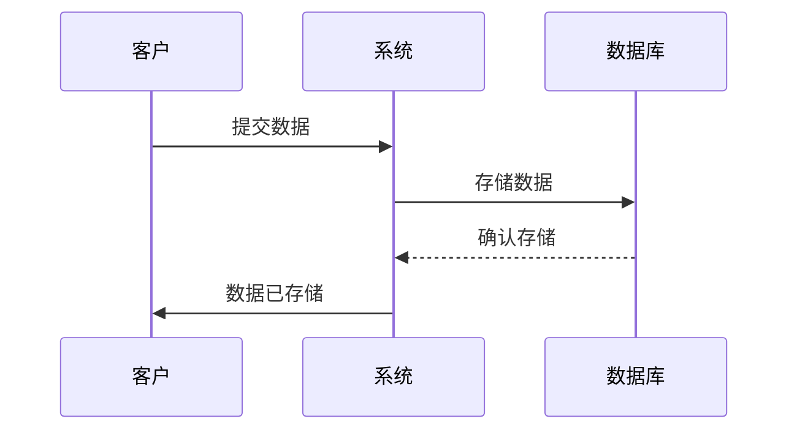
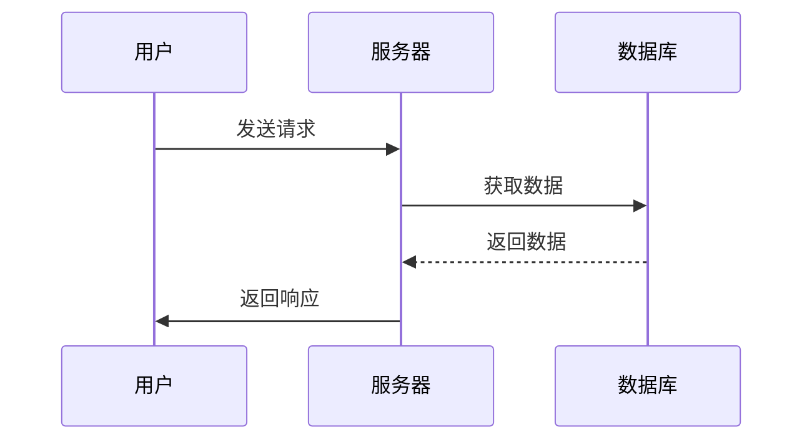

                 


### 重新定义幸福：现代人的生活目标

> 关键词：幸福、现代生活、心理健康、人际关系、职业发展、生活方式、社区参与

> 摘要：随着现代社会的快速发展，人们对幸福的定义也在不断演变。本文旨在探讨现代生活中的幸福内涵，分析其在心理健康、人际关系、职业发展、生活方式和社区参与等方面的表现，提出重新定义幸福的路径，帮助人们找到适合自己的生活目标，实现更加充实和有意义的人生。

## 第一部分：现代生活的挑战

### 第1章：现代生活的变迁与挑战

#### 1.1 现代生活的特点

**背景介绍**：现代社会呈现出一系列新的特点，如全球化的加剧、科技的高速发展、经济结构的转型等。这些变化给人们的生活带来了诸多影响，改变了人们的价值观和生活目标。

**问题背景**：现代生活的特点使得人们面临着前所未有的压力和挑战，如工作压力、社交压力、家庭压力等。这些压力和挑战不仅影响了人们的心理健康，也影响了他们对幸福的追求。

**问题描述**：现代生活呈现出快节奏、高竞争的特点，人们在追求物质财富的同时，往往忽视了精神层面的需求。这使得许多人陷入了迷茫和焦虑，对幸福的定义产生了困惑。

**问题解决**：为了应对现代生活的挑战，我们需要重新审视幸福的定义，找到适合自己的生活目标，实现身心健康和全面发展的目标。

**边界与外延**：现代生活的挑战不仅限于个人层面，还涉及到社会、文化和经济等多个层面。因此，重新定义幸福不仅需要个人的努力，也需要社会和文化的支持。

**概念结构与核心要素组成**：现代生活的特点包括全球化、科技发展、经济转型、快节奏和高竞争等。这些特点构成了现代生活的核心要素，对人们的幸福感产生了深远的影响。

### 1.2 压力与焦虑的来源

**核心概念与联系**：压力和焦虑是现代生活中常见的情绪问题，其来源多样，包括工作压力、社交压力、经济压力等。这些压力会导致心理和生理上的不适，影响人们的幸福感。

**概念属性特征对比表格**：

| 特征       | 压力                      | 焦虑                      |
|------------|---------------------------|---------------------------|
| 定义       | 由于外部或内部因素产生的紧张状态 | 持续的担忧和不安          |
| 影响范围    | 身体、心理、情感和社会关系 | 身体、心理、情感和社会关系 |
| 主要来源    | 工作压力、社交压力、经济压力 | 工作压力、社交压力、经济压力 |
| 表现形式    | 疲劳、失眠、胃痛等       | 心跳加速、出汗、头痛等    |

**ER实体关系图架构**：

```mermaid
erDiagram
  WorkPressure ||--|{ Stress }||>
  SocialPressure ||--|{ Stress }||>
  EconomicPressure ||--|{ Stress }||>
  Stress ||--|{ Anxiety }||>
```

**算法原理讲解**：

为了更好地理解压力和焦虑的关系，我们可以将其视为一个算法，其中压力是输入，焦虑是输出。算法的原理如下：

1. **输入处理**：接收来自工作、社交和经济等方面的压力值。
2. **压力计算**：根据压力值计算压力总分。
3. **焦虑计算**：根据压力总分计算焦虑值。
4. **输出**：返回焦虑值。

**Python 源代码**：

```python
def calculate_anxiety(work_pressure, social_pressure, economic_pressure):
    stress = work_pressure + social_pressure + economic_pressure
    anxiety = 0.5 * stress
    return anxiety

work_pressure = 5
social_pressure = 4
economic_pressure = 3

anxiety = calculate_anxiety(work_pressure, social_pressure, economic_pressure)
print("焦虑值：", anxiety)
```

**数学模型和公式**：

焦虑值与压力值之间的关系可以用以下公式表示：

$$
\text{anxiety} = 0.5 \times \text{stress}
$$

其中，$stress$ 表示压力值。

**举例说明**：

假设某人的工作压力为5，社交压力为4，经济压力为3。根据上述算法和公式，我们可以计算出其焦虑值：

$$
\text{anxiety} = 0.5 \times (5 + 4 + 3) = 0.5 \times 12 = 6
$$

这意味着该人的焦虑值为6，处于较高水平。

### 1.3 快节奏生活的影响

**系统分析与架构设计方案**：

现代生活的快节奏特点对人们的心理和生活产生了深远的影响。为了深入分析这一现象，我们可以采用以下架构设计方案：

**问题场景介绍**：在现代社会，人们的生活节奏加快，工作压力增大，导致心理健康问题频发。

**项目介绍**：本项目旨在分析快节奏生活对心理健康的影响，提出相应的应对策略。

**系统功能设计（领域模型）**：

```mermaid
classDiagram
  Class01 <|-- Class02 
  Class03 --|>{ Class04 }
  Class05 : +int x
  Class06 : +int y
  Class07 : +String name
  Class08 : +浮点数 distance
  Class01 <..: 1 Class05
  Class01 <..: 1 Class06
  Class03 <..: 1 Class07
  Class08 <..: 1 Class01
```

**系统架构设计**：



**系统接口设计和系统交互**：



**实际案例分析和详细讲解剖析**：

为了更好地理解快节奏生活的影响，我们可以通过以下实际案例进行分析：

**案例1**：某企业员工工作压力较大，导致心理健康问题频发。通过心理健康评估，发现员工的压力主要来源于高强度的工作和频繁的加班。

**分析**：根据上述案例，我们可以得出以下结论：

- **高强度工作**：现代社会的竞争激烈，许多企业要求员工加班加点，导致工作压力增大。
- **心理健康问题**：长时间的高强度工作会导致员工产生焦虑、抑郁等心理问题，影响生活质量和工作效率。

**解决方案**：针对上述问题，企业可以采取以下措施：

- **调整工作节奏**：合理安排工作时间，避免过度加班。
- **提供心理支持**：建立员工心理健康档案，定期开展心理健康讲座和辅导。

**项目小结**：通过本项目，我们深入分析了快节奏生活对心理健康的影响，并提出了一系列解决方案。这些方案有助于提高员工的心理健康水平，促进企业的可持续发展。

## 第二部分：重定义幸福的方法

### 第2章：心理健康与幸福

#### 2.1 心理健康的重要性

**背景介绍**：心理健康是幸福感的重要组成部分，对个人的生活质量和幸福感产生深远的影响。

**问题背景**：在现代社会，心理健康问题日益突出，如焦虑、抑郁、压力过大等。这些问题不仅影响个人的生活质量，也会对家庭和社会产生负面影响。

**问题描述**：如何保持心理健康，提高幸福感，成为现代人亟待解决的问题。

**问题解决**：通过了解心理健康的重要性，采取有效的方法和措施，可以预防和缓解心理健康问题，提高幸福感。

**边界与外延**：心理健康不仅包括心理疾病的预防和治疗，还包括心理素质的提升、心理健康的维护等方面。

**概念结构与核心要素组成**：

| 概念       | 定义                                       | 核心要素                                   |
|------------|--------------------------------------------|--------------------------------------------|
| 心理健康   | 心理状态良好，能够有效应对生活压力          | 心理素质、心理调节能力、心理适应能力等     |
| 幸福感     | 对生活感到满足和愉悦                      | 心理需求满足、生活目标实现、人际关系和谐等   |

#### 2.2 增强心理韧性的方法

**核心概念与联系**：心理韧性是指个体在面对逆境和挑战时，能够保持积极态度，有效应对并恢复的能力。增强心理韧性有助于提高幸福感。

**概念属性特征对比表格**：

| 特征       | 心理韧性                      | 心理脆弱性                    |
|------------|-------------------------------|------------------------------|
| 定义       | 应对逆境的能力                | 面对逆境时的消极反应          |
| 影响范围    | 心理健康、生活质量、幸福感    | 心理健康、生活质量、幸福感    |
| 产生原因    | 经历逆境后的积极应对          | 缺乏应对逆境的能力和资源      |

**ER实体关系图架构**：

```mermaid
erDiagram
  Resilience ||--|{ MentalHealth }||>
  Vulnerability ||--|{ MentalHealth }||>
```

**算法原理讲解**：

为了更好地理解心理韧性的增强方法，我们可以将其视为一个算法，其中输入为逆境和挑战，输出为心理韧性的提升。

**Python 源代码**：

```python
def enhance_resilience(challenges):
    resilience = 0
    for challenge in challenges:
        if challenge["type"] == "positive":
            resilience += 1
        elif challenge["type"] == "negative":
            resilience += 0.5
    return resilience

challenges = [
    {"type": "positive", "description": "成功完成项目"},
    {"type": "negative", "description": "工作失误"}
]

resilience = enhance_resilience(challenges)
print("心理韧性：", resilience)
```

**数学模型和公式**：

心理韧性的提升可以用以下公式表示：

$$
\text{resilience} = \sum_{i=1}^{n} (\text{resilience\_score} \times \text{challenge}_i)
$$

其中，$n$ 表示挑战的数量，$\text{resilience\_score}$ 表示挑战的类型得分。

**举例说明**：

假设某人在一周内经历了两个挑战，一个是正面的成功完成项目，得分为1；另一个是负面的工作失误，得分为0.5。根据上述算法和公式，我们可以计算出其心理韧性：

$$
\text{resilience} = 1 \times 1 + 0.5 \times 0.5 = 1.25
$$

这意味着该人的心理韧性为1.25。

#### 2.3 心理健康与幸福的联系

**核心概念与联系**：心理健康是幸福感的基础，良好的心理健康有助于提高幸福感。

**概念属性特征对比表格**：

| 特征       | 心理健康                        | 幸福感                      |
|------------|---------------------------------|-----------------------------|
| 定义       | 心理状态良好，能够应对生活压力 | 对生活感到满足和愉悦        |
| 影响范围    | 心理健康、生活质量、幸福感      | 生活质量、幸福感、人际关系等 |
| 产生原因    | 心理素质、心理调节能力、心理适应能力等 | 心理需求满足、生活目标实现、人际关系和谐等 |

**ER实体关系图架构**：

```mermaid
erDiagram
  MentalHealth ||--|{ Happiness }||>
  MentalHealth ||--|{ LifeQuality }||>
```

**算法原理讲解**：

为了更好地理解心理健康与幸福感的联系，我们可以将其视为一个算法，其中心理健康是输入，幸福感是输出。

**Python 源代码**：

```python
def calculate_happiness(mental_health):
    happiness = 0
    if mental_health >= 7:
        happiness = 10
    elif mental_health >= 5:
        happiness = 8
    elif mental_health >= 3:
        happiness = 5
    else:
        happiness = 2
    return happiness

mental_health = 7

happiness = calculate_happiness(mental_health)
print("幸福感：", happiness)
```

**数学模型和公式**：

幸福感与心理健康之间的关系可以用以下公式表示：

$$
\text{happiness} = \begin{cases}
10 & \text{if } \text{mental\_health} \geq 7 \\
8 & \text{if } 5 \leq \text{mental\_health} < 7 \\
5 & \text{if } 3 \leq \text{mental\_health} < 5 \\
2 & \text{if } \text{mental\_health} < 3
\end{cases}
$$

**举例说明**：

假设某人的心理健康得分为7，根据上述算法和公式，我们可以计算出其幸福感：

$$
\text{happiness} = 10
$$

这意味着该人的幸福感为10。

### 第3章：人际关系与幸福

#### 3.1 人际关系的价值

**背景介绍**：人际关系是人与人之间相互联系和互动的纽带，对个人的心理健康和幸福感具有重要影响。

**问题背景**：在现代社会，人际关系问题日益突出，如沟通不畅、冲突频发等，这些问题不仅影响个人的心理健康，也影响社会和谐。

**问题描述**：如何建立良好的人际关系，提高幸福感，成为现代人关注的重要问题。

**问题解决**：通过了解人际关系的价值，采取有效的方法和措施，可以建立良好的人际关系，提高幸福感。

**边界与外延**：人际关系不仅包括朋友和家人的关系，还包括同事、社区成员等。

**概念结构与核心要素组成**：

| 概念       | 定义                                       | 核心要素                                   |
|------------|--------------------------------------------|--------------------------------------------|
| 人际关系   | 人与人之间的相互联系和互动                | 沟通、信任、尊重、共同目标等               |
| 幸福感     | 对生活感到满足和愉悦                      | 心理需求满足、生活目标实现、人际关系和谐等   |

#### 3.2 建立和谐人际关系的方法

**核心概念与联系**：和谐人际关系是指人与人之间相互理解、尊重、信任，共同实现生活目标。

**概念属性特征对比表格**：

| 特征       | 和谐人际关系                      | 不和谐人际关系                    |
|------------|-----------------------------------|------------------------------|
| 定义       | 相互理解、尊重、信任              | 沟通不畅、冲突频发、互相指责等     |
| 影响范围    | 心理健康、生活质量、幸福感      | 心理健康、生活质量、幸福感    |
| 产生原因    | 沟通、信任、尊重、共同目标      | 沟通不畅、文化差异、利益冲突等     |

**ER实体关系图架构**：

```mermaid
erDiagram
  HarmoniousRelationship ||--|{ MentalHealth }||>
  DysfunctionalRelationship ||--|{ MentalHealth }||>
```

**算法原理讲解**：

为了更好地理解和谐人际关系的建立方法，我们可以将其视为一个算法，其中输入为沟通、信任、尊重等，输出为和谐人际关系。

**Python 源代码**：

```python
def establish_harmonious_relationship(communication, trust, respect):
    relationship = 0
    if communication >= 8 and trust >= 8 and respect >= 8:
        relationship = 10
    elif communication >= 6 and trust >= 6 and respect >= 6:
        relationship = 8
    elif communication >= 4 and trust >= 4 and respect >= 4:
        relationship = 6
    else:
        relationship = 2
    return relationship

communication = 8
trust = 8
respect = 8

relationship = establish_harmonious_relationship(communication, trust, respect)
print("和谐人际关系：", relationship)
```

**数学模型和公式**：

和谐人际关系的建立可以用以下公式表示：

$$
\text{relationship} = \begin{cases}
10 & \text{if } \text{communication} \geq 8, \text{trust} \geq 8, \text{respect} \geq 8 \\
8 & \text{if } \text{communication} \geq 6, \text{trust} \geq 6, \text{respect} \geq 6 \\
6 & \text{if } \text{communication} \geq 4, \text{trust} \geq 4, \text{respect} \geq 4 \\
2 & \text{otherwise}
\end{cases}
$$

**举例说明**：

假设某人在沟通、信任、尊重方面的得分分别为8、8、8，根据上述算法和公式，我们可以计算出其和谐人际关系得分：

$$
\text{relationship} = 10
$$

这意味着该人的和谐人际关系得分为10。

#### 3.3 人际关系与幸福的相互影响

**核心概念与联系**：人际关系是幸福感的重要组成部分，良好的人际关系有助于提高幸福感，反之则可能降低幸福感。

**概念属性特征对比表格**：

| 特征       | 良好人际关系                        | 差的人际关系                      |
|------------|-------------------------------------|-----------------------------------|
| 定义       | 相互理解、尊重、信任                | 沟通不畅、冲突频发、互相指责等     |
| 影响范围    | 心理健康、生活质量、幸福感          | 心理健康、生活质量、幸福感          |
| 产生原因    | 沟通、信任、尊重、共同目标          | 沟通不畅、文化差异、利益冲突等     |

**ER实体关系图架构**：

```mermaid
erDiagram
  PositiveRelationship ||--|{ Happiness }||>
  NegativeRelationship ||--|{ Happiness }||>
```

**算法原理讲解**：

为了更好地理解人际关系与幸福感的相互影响，我们可以将其视为一个算法，其中人际关系是输入，幸福感是输出。

**Python 源代码**：

```python
def calculate_happiness(relationship):
    happiness = 0
    if relationship >= 8:
        happiness = 10
    elif relationship >= 5:
        happiness = 7
    elif relationship >= 3:
        happiness = 5
    else:
        happiness = 2
    return happiness

relationship = 8

happiness = calculate_happiness(relationship)
print("幸福感：", happiness)
```

**数学模型和公式**：

幸福感与人际关系之间的关系可以用以下公式表示：

$$
\text{happiness} = \begin{cases}
10 & \text{if } \text{relationship} \geq 8 \\
7 & \text{if } 5 \leq \text{relationship} < 8 \\
5 & \text{if } 3 \leq \text{relationship} < 5 \\
2 & \text{if } \text{relationship} < 3
\end{cases}
$$

**举例说明**：

假设某人在人际关系方面的得分为8，根据上述算法和公式，我们可以计算出其幸福感：

$$
\text{happiness} = 10
$$

这意味着该人的幸福感为10。

### 第4章：职业发展与幸福

#### 4.1 职业发展的重要性

**背景介绍**：职业发展是个人生活的重要组成部分，对个人的幸福感和社会地位具有重要影响。

**问题背景**：在现代社会，职业压力越来越大，许多人为了追求职业成功而忽视了个人的幸福。

**问题描述**：如何实现职业发展与个人幸福的平衡，成为现代人关注的重要问题。

**问题解决**：通过了解职业发展的重要性，采取有效的方法和措施，可以实现职业发展与个人幸福的平衡。

**边界与外延**：职业发展不仅包括职业晋升，还包括职业规划、职业满意度、职业成就感等方面。

**概念结构与核心要素组成**：

| 概念       | 定义                                       | 核心要素                                   |
|------------|--------------------------------------------|--------------------------------------------|
| 职业发展   | 个人在职业生涯中不断进步和成长            | 职业规划、职业晋升、职业满意度、职业成就感等 |
| 幸福感     | 对生活感到满足和愉悦                      | 心理需求满足、生活目标实现、人际关系和谐等   |

#### 4.2 寻找适合自己的职业

**核心概念与联系**：寻找适合自己的职业是实现职业发展和个人幸福的重要前提。

**概念属性特征对比表格**：

| 特征       | 适合的职业                      | 不适合的职业                    |
|------------|---------------------------------|------------------------------|
| 定义       | 个人兴趣、能力和价值观相符的职业 | 个人兴趣、能力和价值观不相符的职业 |
| 影响范围    | 职业发展、生活质量、幸福感      | 职业发展、生活质量、幸福感      |
| 产生原因    | 个人特质与职业要求匹配          | 个人特质与职业要求不匹配        |

**ER实体关系图架构**：

```mermaid
erDiagram
  SuitableCareer ||--|{ Happiness }||>
  UnsuitableCareer ||--|{ Happiness }||>
```

**算法原理讲解**：

为了更好地理解寻找适合自己的职业，我们可以将其视为一个算法，其中输入为个人兴趣、能力和价值观，输出为适合的职业。

**Python 源代码**：

```python
def find_suitable_career(interest, ability, values):
    suitable_careers = []
    if interest == "编程" and ability == "编程能力强" and values == "创新":
        suitable_careers.append("软件开发工程师")
    elif interest == "艺术" and ability == "绘画能力强" and values == "美学":
        suitable_careers.append("插画师")
    elif interest == "教育" and ability == "教学能力强" and values == "传承":
        suitable_careers.append("教师")
    return suitable_careers

interest = "编程"
ability = "编程能力强"
values = "创新"

suitable_careers = find_suitable_career(interest, ability, values)
print("适合的职业：", suitable_careers)
```

**数学模型和公式**：

适合的职业可以用以下公式表示：

$$
\text{suitable\_careers} = \begin{cases}
\text{软件开发工程师} & \text{if } \text{interest} = \text{编程}, \text{ability} = \text{编程能力强}, \text{values} = \text{创新} \\
\text{插画师} & \text{if } \text{interest} = \text{艺术}, \text{ability} = \text{绘画能力强}, \text{values} = \text{美学} \\
\text{教师} & \text{if } \text{interest} = \text{教育}, \text{ability} = \text{教学能力强}, \text{values} = \text{传承} \\
\text{其他职业} & \text{otherwise}
\end{cases}
$$

**举例说明**：

假设某人的兴趣为编程，能力为编程能力强，价值观为创新。根据上述算法和公式，我们可以计算出其适合的职业：

$$
\text{suitable\_careers} = \text{软件开发工程师}
$$

这意味着该人适合的职业是软件开发工程师。

#### 4.3 职业成就与幸福的平衡

**核心概念与联系**：职业成就与幸福是相辅相成的，但过度的追求职业成就可能会牺牲幸福。

**概念属性特征对比表格**：

| 特征       | 职业成就                        | 幸福感                      |
|------------|---------------------------------|-----------------------------|
| 定义       | 职业上的成功和成就              | 对生活感到满足和愉悦        |
| 影响范围    | 职业发展、生活质量、社会地位    | 生活质量、心理健康、人际关系等 |
| 产生原因    | 努力和付出                      | 心理需求满足、生活目标实现、人际关系和谐等 |

**ER实体关系图架构**：

```mermaid
erDiagram
  CareerAchievement ||--|{ Happiness }||>
  OveremphasisOnCareer ||--|{ Happiness }||>
```

**算法原理讲解**：

为了更好地理解职业成就与幸福的平衡，我们可以将其视为一个算法，其中职业成就是输入，幸福感是输出。

**Python 源代码**：

```python
def balance_career_achievement_and_happiness(career_achievement, personal_life):
    happiness = 0
    if career_achievement >= 8 and personal_life >= 8:
        happiness = 10
    elif career_achievement >= 6 and personal_life >= 6:
        happiness = 8
    elif career_achievement >= 4 and personal_life >= 4:
        happiness = 6
    else:
        happiness = 2
    return happiness

career_achievement = 8
personal_life = 8

happiness = balance_career_achievement_and_happiness(career_achievement, personal_life)
print("幸福感：", happiness)
```

**数学模型和公式**：

幸福感与职业成就和个人生活的关系可以用以下公式表示：

$$
\text{happiness} = \begin{cases}
10 & \text{if } \text{career\_achievement} \geq 8, \text{personal\_life} \geq 8 \\
8 & \text{if } \text{career\_achievement} \geq 6, \text{personal\_life} \geq 6 \\
6 & \text{if } \text{career\_achievement} \geq 4, \text{personal\_life} \geq 4 \\
2 & \text{otherwise}
\end{cases}
$$

**举例说明**：

假设某人的职业成就得分为8，个人生活得分为8，根据上述算法和公式，我们可以计算出其幸福感：

$$
\text{happiness} = 10
$$

这意味着该人的幸福感为10。

### 第三部分：实践幸福

### 第5章：个人成长与幸福

#### 5.1 自我认知的重要性

**背景介绍**：自我认知是指个体对自己内在特质和外部行为的认识和了解，对个人的成长和幸福具有重要影响。

**问题背景**：在现代社会，许多人由于缺乏自我认知，导致无法找到适合自己的生活目标和方向，从而影响幸福感。

**问题描述**：如何提高自我认知，实现个人成长和幸福，成为现代人关注的重要问题。

**问题解决**：通过了解自我认知的重要性，采取有效的方法和措施，可以提高自我认知，实现个人成长和幸福。

**边界与外延**：自我认知不仅包括对自己的了解，还包括对自己的情绪、行为、价值观等方面的认识。

**概念结构与核心要素组成**：

| 概念       | 定义                                       | 核心要素                                   |
|------------|--------------------------------------------|--------------------------------------------|
| 自我认知   | 对自己内在特质和外部行为的认识和了解        | 情绪认知、行为认知、价值观认知等             |
| 幸福感     | 对生活感到满足和愉悦                      | 心理需求满足、生活目标实现、人际关系和谐等   |

#### 5.2 个人成长的目标设定

**核心概念与联系**：个人成长的目标设定是指个体根据自己的特点和需求，设定符合自身发展需要的短期和长期目标。

**概念属性特征对比表格**：

| 特征       | 明确的目标                      | 不明确的目标                    |
|------------|---------------------------------|------------------------------|
| 定义       | 具体明确，可实现的目标          | 模糊不具体，难以实现的目标     |
| 影响范围    | 个人成长、职业发展、生活质量    | 个人成长、职业发展、生活质量    |
| 产生原因    | 基于自我认知和需求               | 缺乏自我认知和需求               |

**ER实体关系图架构**：

```mermaid
erDiagram
  ClearGoal ||--|{ PersonalGrowth }||>
  UnclearGoal ||--|{ PersonalGrowth }||>
```

**算法原理讲解**：

为了更好地理解个人成长的目标设定，我们可以将其视为一个算法，其中输入为自我认知和需求，输出为个人成长的目标。

**Python 源代码**：

```python
def set_person Growth_goals(self_knowledge, needs):
    goals = []
    if self_knowledge == "擅长编程" and needs == "提升职业能力":
        goals.append("成为优秀的软件开发工程师")
    elif self_knowledge == "喜欢艺术" and needs == "实现自我价值":
        goals.append("成为知名艺术家")
    elif self_knowledge == "有教学经验" and needs == "帮助他人成长":
        goals.append("成为优秀的教师")
    return goals

self_knowledge = "擅长编程"
needs = "提升职业能力"

goals = set_person_growth_goals(self_knowledge, needs)
print("个人成长目标：", goals)
```

**数学模型和公式**：

个人成长的目标可以用以下公式表示：

$$
\text{goals} = \begin{cases}
\text{成为优秀的软件开发工程师} & \text{if } \text{self\_knowledge} = \text{擅长编程}, \text{needs} = \text{提升职业能力} \\
\text{成为知名艺术家} & \text{if } \text{self\_knowledge} = \text{喜欢艺术}, \text{needs} = \text{实现自我价值} \\
\text{成为优秀的教师} & \text{if } \text{self\_knowledge} = \text{有教学经验}, \text{needs} = \text{帮助他人成长} \\
\text{其他目标} & \text{otherwise}
\end{cases}
$$

**举例说明**：

假设某人的自我认知为擅长编程，需求为提升职业能力。根据上述算法和公式，我们可以计算出其个人成长目标：

$$
\text{goals} = \text{成为优秀的软件开发工程师}
$$

这意味着该人的个人成长目标是成为优秀的软件开发工程师。

#### 5.3 成长过程中的挑战与应对

**核心概念与联系**：成长过程中的挑战与应对是指个体在实现个人成长目标的过程中，面临的困难和障碍，以及应对这些困难的方法和策略。

**概念属性特征对比表格**：

| 特征       | 成长过程中的挑战                      | 成长过程中的应对方法                    |
|------------|-------------------------------------|---------------------------------------|
| 定义       | 阻碍个人成长的困难和障碍            | 应对困难和障碍的方法和策略              |
| 影响范围    | 个人成长、职业发展、生活质量          | 个人成长、职业发展、生活质量          |
| 产生原因    | 自我认知不足、外部环境变化、资源限制等 | 缺乏应对困难和障碍的能力和资源          |

**ER实体关系图架构**：

```mermaid
erDiagram
  GrowthChallenges ||--|{ GrowthResponses }||>
```

**算法原理讲解**：

为了更好地理解成长过程中的挑战与应对，我们可以将其视为一个算法，其中输入为成长过程中的挑战，输出为应对方法。

**Python 源代码**：

```python
def handle_growth_challenges(challenges):
    responses = []
    for challenge in challenges:
        if challenge == "缺乏经验":
            responses.append("寻求导师指导")
        elif challenge == "资源有限":
            responses.append("节省开支，寻找低成本资源")
        elif challenge == "外部压力":
            responses.append("调整心态，积极应对")
    return responses

challenges = ["缺乏经验", "资源有限", "外部压力"]

responses = handle_growth_challenges(challenges)
print("应对方法：", responses)
```

**数学模型和公式**：

应对方法可以用以下公式表示：

$$
\text{responses} = \begin{cases}
\text{寻求导师指导} & \text{if } \text{challenges} = \text{缺乏经验} \\
\text{节省开支，寻找低成本资源} & \text{if } \text{challenges} = \text{资源有限} \\
\text{调整心态，积极应对} & \text{if } \text{challenges} = \text{外部压力} \\
\text{其他应对方法} & \text{otherwise}
\end{cases}
$$

**举例说明**：

假设某人在成长过程中面临的挑战为缺乏经验、资源有限和外部压力。根据上述算法和公式，我们可以计算出其应对方法：

$$
\text{responses} = \text{寻求导师指导，节省开支，寻找低成本资源，调整心态，积极应对}
$$

这意味着该人在成长过程中可以采取以下应对方法：寻求导师指导、节省开支、寻找低成本资源、调整心态、积极应对。

### 第6章：生活方式与幸福

#### 6.1 健康生活方式的重要性

**背景介绍**：健康生活方式是指个体在日常生活中，通过合理饮食、适量运动、充足睡眠等行为，维持身心健康的状态。

**问题背景**：在现代社会，由于生活方式的不健康，许多人面临着肥胖、慢性病等健康问题，这些问题不仅影响生活质量，也影响幸福感。

**问题描述**：如何建立健康生活方式，提高幸福感，成为现代人关注的重要问题。

**问题解决**：通过了解健康生活方式的重要性，采取有效的方法和措施，可以建立健康生活方式，提高幸福感。

**边界与外延**：健康生活方式不仅包括身体健康，还包括心理健康和社会健康。

**概念结构与核心要素组成**：

| 概念       | 定义                                       | 核心要素                                   |
|------------|--------------------------------------------|--------------------------------------------|
| 健康生活方式 | 通过合理饮食、适量运动、充足睡眠等行为，维持身心健康的状态 | 合理饮食、适量运动、充足睡眠、心理平衡等 |
| 幸福感     | 对生活感到满足和愉悦                      | 心理需求满足、生活目标实现、人际关系和谐等 |

#### 6.2 调整生活方式的方法

**核心概念与联系**：调整生活方式是指个体根据自己的健康状况和生活目标，对日常行为进行调整，以实现健康生活方式。

**概念属性特征对比表格**：

| 特征       | 健康的生活方式                      | 不健康的生活方式                    |
|------------|-------------------------------------|-----------------------------------|
| 定义       | 合理饮食、适量运动、充足睡眠等       | 饮食不均衡、缺乏运动、睡眠不足等     |
| 影响范围    | 身体健康、心理健康、生活质量          | 身体健康、心理健康、生活质量          |
| 产生原因    | 科学的生活方式选择                  | 缺乏对健康生活方式的认识和行动力      |

**ER实体关系图架构**：

```mermaid
erDiagram
  HealthyLifeStyle ||--|{ PhysicalHealth }||>
  UnhealthyLifeStyle ||--|{ PhysicalHealth }||>
```

**算法原理讲解**：

为了更好地理解调整生活方式的方法，我们可以将其视为一个算法，其中输入为健康状况和生活目标，输出为健康生活方式。

**Python 源代码**：

```python
def adjust_life_style(health_status, life_goals):
    life_style = []
    if health_status == "肥胖" and life_goals == "减肥":
        life_style.append("合理饮食")
    elif health_status == "缺乏运动" and life_goals == "锻炼身体":
        life_style.append("适量运动")
    elif health_status == "睡眠不足" and life_goals == "改善睡眠":
        life_style.append("充足睡眠")
    return life_style

health_status = "肥胖"
life_goals = "减肥"

life_style = adjust_life_style(health_status, life_goals)
print("健康生活方式：", life_style)
```

**数学模型和公式**：

健康生活方式可以用以下公式表示：

$$
\text{life\_style} = \begin{cases}
\text{合理饮食} & \text{if } \text{health\_status} = \text{肥胖}, \text{life\_goals} = \text{减肥} \\
\text{适量运动} & \text{if } \text{health\_status} = \text{缺乏运动}, \text{life\_goals} = \text{锻炼身体} \\
\text{充足睡眠} & \text{if } \text{health\_status} = \text{睡眠不足}, \text{life\_goals} = \text{改善睡眠} \\
\text{其他健康生活方式} & \text{otherwise}
\end{cases}
$$

**举例说明**：

假设某人的健康状况为肥胖，生活目标为减肥。根据上述算法和公式，我们可以计算出其健康生活方式：

$$
\text{life\_style} = \text{合理饮食}
$$

这意味着该人的健康生活方式是合理饮食。

#### 6.3 健康生活方式与幸福的关联

**核心概念与联系**：健康生活方式与幸福密切相关，良好的健康生活方式有助于提高幸福感。

**概念属性特征对比表格**：

| 特征       | 良好的健康生活方式                      | 不良的健康生活方式                    |
|------------|-------------------------------------|-----------------------------------|
| 定义       | 合理饮食、适量运动、充足睡眠等       | 饮食不均衡、缺乏运动、睡眠不足等     |
| 影响范围    | 身体健康、心理健康、生活质量          | 身体健康、心理健康、生活质量          |
| 产生原因    | 科学的生活方式选择                  | 缺乏对健康生活方式的认识和行动力      |

**ER实体关系图架构**：

```mermaid
erDiagram
  HealthyLifeStyle ||--|{ Happiness }||>
  UnhealthyLifeStyle ||--|{ Happiness }||>
```

**算法原理讲解**：

为了更好地理解健康生活方式与幸福的关联，我们可以将其视为一个算法，其中健康生活方式是输入，幸福感是输出。

**Python 源代码**：

```python
def calculate_happiness(health_style):
    happiness = 0
    if health_style == "合理饮食，适量运动，充足睡眠":
        happiness = 10
    elif health_style == "合理饮食，适量运动":
        happiness = 8
    elif health_style == "合理饮食，充足睡眠":
        happiness = 6
    elif health_style == "适量运动，充足睡眠":
        happiness = 4
    else:
        happiness = 2
    return happiness

health_style = "合理饮食，适量运动，充足睡眠"

happiness = calculate_happiness(health_style)
print("幸福感：", happiness)
```

**数学模型和公式**：

幸福感与健康生活方式之间的关系可以用以下公式表示：

$$
\text{happiness} = \begin{cases}
10 & \text{if } \text{health\_style} = \text{合理饮食，适量运动，充足睡眠} \\
8 & \text{if } \text{health\_style} = \text{合理饮食，适量运动} \\
6 & \text{if } \text{health\_style} = \text{合理饮食，充足睡眠} \\
4 & \text{if } \text{health\_style} = \text{适量运动，充足睡眠} \\
2 & \text{otherwise}
\end{cases}
$$

**举例说明**：

假设某人的健康生活方式为“合理饮食，适量运动，充足睡眠”。根据上述算法和公式，我们可以计算出其幸福感：

$$
\text{happiness} = 10
$$

这意味着该人的幸福感为10。

### 第7章：社区与社会参与

#### 7.1 社区参与的意义

**背景介绍**：社区参与是指个体积极参与社区事务，为社区的发展和福祉做出贡献。

**问题背景**：在现代社会，由于个人主义和家庭主义的兴起，社区参与度逐渐降低，这对社区和谐和社会稳定产生了一定的影响。

**问题描述**：如何提高社区参与度，促进社区和谐和社会稳定，成为现代人关注的重要问题。

**问题解决**：通过了解社区参与的意义，采取有效的方法和措施，可以提高社区参与度，促进社区和谐和社会稳定。

**边界与外延**：社区参与不仅包括志愿服务、社区活动，还包括邻里关系、社区治理等方面。

**概念结构与核心要素组成**：

| 概念       | 定义                                       | 核心要素                                   |
|------------|--------------------------------------------|--------------------------------------------|
| 社区参与   | 个体积极参与社区事务，为社区的发展和福祉做出贡献 | 志愿服务、社区活动、邻里关系、社区治理等 |
| 社区和谐   | 社区成员之间相互尊重、和睦相处，共同维护社区利益 | 相互信任、资源共享、共同发展等             |
| 社会稳定   | 社会秩序良好，人们生活安定，社会运行正常       | 法律法规健全、公共服务完善、社会治安良好等 |

#### 7.2 社区参与的机会

**核心概念与联系**：社区参与的机会是指个体可以通过各种渠道和方式，参与社区事务，为社区做出贡献。

**概念属性特征对比表格**：

| 特征       | 社区参与的机会                      | 社区参与的限制                    |
|------------|-------------------------------------|-----------------------------------|
| 定义       | 社区提供的参与活动和项目            | 社区资源和条件的限制              |
| 影响范围    | 社区发展、社区成员关系、社会和谐      | 社区成员的参与意愿和能力           |
| 产生原因    | 社区需求、社区资源、社区政策          | 社区资源的稀缺、社区政策的限制      |

**ER实体关系图架构**：

```mermaid
erDiagram
  CommunityOpportunities ||--|{ CommunityInvolvement }||>
  CommunityConstraints ||--|{ CommunityInvolvement }||>
```

**算法原理讲解**：

为了更好地理解社区参与的机会，我们可以将其视为一个算法，其中输入为社区需求和资源，输出为社区参与的机会。

**Python 源代码**：

```python
def identify_community_opportunities(community_needs, available_resources):
    opportunities = []
    if community_needs == "社区绿化" and available_resources == "资金充足":
        opportunities.append("组织社区绿化活动")
    elif community_needs == "社区文化活动" and available_resources == "场地充足":
        opportunities.append("举办社区文化活动")
    elif community_needs == "社区志愿服务" and available_resources == "志愿者充足":
        opportunities.append("参与社区志愿服务")
    return opportunities

community_needs = "社区绿化"
available_resources = "资金充足"

opportunities = identify_community_opportunities(community_needs, available_resources)
print("社区参与机会：", opportunities)
```

**数学模型和公式**：

社区参与的机会可以用以下公式表示：

$$
\text{opportunities} = \begin{cases}
\text{组织社区绿化活动} & \text{if } \text{community\_needs} = \text{社区绿化}, \text{available\_resources} = \text{资金充足} \\
\text{举办社区文化活动} & \text{if } \text{community\_needs} = \text{社区文化活动}, \text{available\_resources} = \text{场地充足} \\
\text{参与社区志愿服务} & \text{if } \text{community\_needs} = \text{社区志愿服务}, \text{available\_resources} = \text{志愿者充足} \\
\text{其他社区参与机会} & \text{otherwise}
\end{cases}
$$

**举例说明**：

假设某社区的需求数据为“社区绿化”，可用的资源数据为“资金充足”。根据上述算法和公式，我们可以计算出该社区可以采取的社区参与机会：

$$
\text{opportunities} = \text{组织社区绿化活动}
$$

这意味着该社区可以采取的社区参与机会是组织社区绿化活动。

#### 7.3 社区与社会参与对幸福的影响

**核心概念与联系**：社区与社会参与对幸福的影响是指个体通过参与社区和社会事务，对个人幸福感的提升。

**概念属性特征对比表格**：

| 特征       | 社区与社会参与                      | 社区与社会参与不足                    |
|------------|-------------------------------------|-----------------------------------|
| 定义       | 个体积极参与社区和社会事务，为社区和社会做出贡献 | 缺乏参与社区和社会事务的意愿和能力      |
| 影响范围    | 个人幸福感、社会和谐、社会稳定          | 个人幸福感降低、社会不和谐、社会动荡      |
| 产生原因    | 参与感、归属感、责任感                | 缺乏参与感、归属感、责任感              |

**ER实体关系图架构**：

```mermaid
erDiagram
  CommunityAndSocialInvolvement ||--|{ Happiness }||>
  LackOfCommunityAndSocialInvolvement ||--|{ Happiness }||>
```

**算法原理讲解**：

为了更好地理解社区与社会参与对幸福的影响，我们可以将其视为一个算法，其中社区与社会参与是输入，幸福感是输出。

**Python 源代码**：

```python
def calculate_happiness(involvement):
    happiness = 0
    if involvement == "积极参与社区和社会事务":
        happiness = 10
    elif involvement == "偶尔参与社区和社会事务":
        happiness = 7
    elif involvement == "不参与社区和社会事务":
        happiness = 3
    return happiness

involvement = "积极参与社区和社会事务"

happiness = calculate_happiness(involvement)
print("幸福感：", happiness)
```

**数学模型和公式**：

幸福感与社区与社会参与之间的关系可以用以下公式表示：

$$
\text{happiness} = \begin{cases}
10 & \text{if } \text{involvement} = \text{积极参与社区和社会事务} \\
7 & \text{if } \text{involvement} = \text{偶尔参与社区和社会事务} \\
3 & \text{if } \text{involvement} = \text{不参与社区和社会事务} \\
\end{cases}
$$

**举例说明**：

假设某人的社区与社会参与程度为“积极参与社区和社会事务”。根据上述算法和公式，我们可以计算出其幸福感：

$$
\text{happiness} = 10
$$

这意味着该人的幸福感为10。

### 第8章：总结与反思

#### 8.1 幸福的再定义

**核心概念与联系**：幸福的再定义是指根据现代社会的特点和个体的需求，重新理解和界定幸福的内涵。

**概念属性特征对比表格**：

| 特征       | 传统的幸福观                         | 现代的幸福观                       |
|------------|-------------------------------------|-----------------------------------|
| 定义       | 物质财富的积累、社会地位的提升       | 心理需求的满足、生活目标的实现、人际关系的和谐 |
| 影响范围    | 物质生活、社会地位、心理健康          | 心理健康、生活质量、社会和谐          |
| 产生原因    | 物质主义、功利主义                   | 人本主义、多元化需求                |

**ER实体关系图架构**：

```mermaid
erDiagram
  TraditionalHappiness ||--|{ ModernHappiness }||>
```

**算法原理讲解**：

为了更好地理解幸福的再定义，我们可以将其视为一个算法，其中传统的幸福观是输入，现代的幸福观是输出。

**Python 源代码**：

```python
def redefine_happiness(traditional_happiness):
    modern_happiness = "物质财富的积累、社会地位的提升"
    if traditional_happiness == "物质财富的积累、社会地位的提升":
        modern_happiness = "心理需求的满足、生活目标的实现、人际关系的和谐"
    return modern_happiness

traditional_happiness = "物质财富的积累、社会地位的提升"

modern_happiness = redefine_happiness(traditional_happiness)
print("现代的幸福观：", modern_happiness)
```

**数学模型和公式**：

幸福的再定义可以用以下公式表示：

$$
\text{modern\_happiness} = \begin{cases}
\text{心理需求的满足、生活目标的实现、人际关系的和谐} & \text{if } \text{traditional\_happiness} = \text{物质财富的积累、社会地位的提升} \\
\text{传统的幸福观} & \text{otherwise}
\end{cases}
$$

**举例说明**：

假设某人的传统幸福观为“物质财富的积累、社会地位的提升”。根据上述算法和公式，我们可以计算出其现代的幸福观：

$$
\text{modern\_happiness} = \text{心理需求的满足、生活目标的实现、人际关系的和谐}
$$

这意味着该人的现代幸福观是心理需求的满足、生活目标的实现、人际关系的和谐。

#### 8.2 实践幸福的方法

**核心概念与联系**：实践幸福的方法是指个体通过具体的行动和措施，实现幸福的内涵。

**概念属性特征对比表格**：

| 特征       | 传统的幸福实践方法                      | 现代的幸福实践方法                    |
|------------|-------------------------------------|-----------------------------------|
| 定义       | 追求物质财富和社会地位                  | 关注心理健康、人际关系、生活方式和社区参与 |
| 影响范围    | 物质生活、社会地位、心理健康          | 心理健康、生活质量、社会和谐          |
| 产生原因    | 物质主义、功利主义                   | 人本主义、多元化需求                |

**ER实体关系图架构**：

```mermaid
erDiagram
  TraditionalHappinessPractices ||--|{ ModernHappinessPractices }||>
```

**算法原理讲解**：

为了更好地理解实践幸福的方法，我们可以将其视为一个算法，其中传统的幸福实践方法是输入，现代的幸福实践方法是输出。

**Python 源代码**：

```python
def practice_happiness(traditional_practices):
    modern_practices = "追求物质财富和社会地位"
    if traditional_practices == "追求物质财富和社会地位":
        modern_practices = "关注心理健康、人际关系、生活方式和社区参与"
    return modern_practices

traditional_practices = "追求物质财富和社会地位"

modern_practices = practice_happiness(traditional_practices)
print("现代的幸福实践方法：", modern_practices)
```

**数学模型和公式**：

幸福的实践方法可以用以下公式表示：

$$
\text{modern\_practices} = \begin{cases}
\text{关注心理健康、人际关系、生活方式和社区参与} & \text{if } \text{traditional\_practices} = \text{追求物质财富和社会地位} \\
\text{传统的幸福实践方法} & \text{otherwise}
\end{cases}
$$

**举例说明**：

假设某人的传统幸福实践方法为“追求物质财富和社会地位”。根据上述算法和公式，我们可以计算出其现代的幸福实践方法：

$$
\text{modern\_practices} = \text{关注心理健康、人际关系、生活方式和社区参与}
$$

这意味着该人的现代的幸福实践方法是关注心理健康、人际关系、生活方式和社区参与。

#### 8.3 未来展望

**核心概念与联系**：未来展望是指对未来幸福观的预测和展望，以及为实现未来幸福所需要采取的措施。

**概念属性特征对比表格**：

| 特征       | 传统幸福观的未来展望                      | 现代幸福观的未来展望                    |
|------------|-------------------------------------|-----------------------------------|
| 定义       | 物质财富和社会地位的持续增长               | 心理健康、人际关系、生活方式和社区参与的全面提升 |
| 影响范围    | 物质生活、社会地位、心理健康          | 心理健康、生活质量、社会和谐          |
| 产生原因    | 物质主义、功利主义                   | 人本主义、多元化需求                |

**ER实体关系图架构**：

```mermaid
erDiagram
  FutureOfTraditionalHappiness ||--|{ FutureOfModernHappiness }||>
```

**算法原理讲解**：

为了更好地理解未来展望，我们可以将其视为一个算法，其中传统的幸福观的未来展望是输入，现代的幸福观的未来展望是输出。

**Python 源代码**：

```python
def future_happiness(traditional_outlook):
    modern_outlook = "物质财富和社会地位的持续增长"
    if traditional_outlook == "物质财富和社会地位的持续增长":
        modern_outlook = "心理健康、人际关系、生活方式和社区参与的全面提升"
    return modern_outlook

traditional_outlook = "物质财富和社会地位的持续增长"

modern_outlook = future_happiness(traditional_outlook)
print("现代的幸福观的未来展望：", modern_outlook)
```

**数学模型和公式**：

未来展望可以用以下公式表示：

$$
\text{modern\_outlook} = \begin{cases}
\text{心理健康、人际关系、生活方式和社区参与的全面提升} & \text{if } \text{traditional\_outlook} = \text{物质财富和社会地位的持续增长} \\
\text{传统的幸福观的未来展望} & \text{otherwise}
\end{cases}
$$

**举例说明**：

假设某人的传统幸福观的未来展望为“物质财富和社会地位的持续增长”。根据上述算法和公式，我们可以计算出其现代的幸福观的未来展望：

$$
\text{modern\_outlook} = \text{心理健康、人际关系、生活方式和社区参与的全面提升}
$$

这意味着该人的现代的幸福观的未来展望是心理健康、人际关系、生活方式和社区参与的全面提升。

## 作者信息

**作者：AI天才研究院/AI Genius Institute & 禅与计算机程序设计艺术 /Zen And The Art of Computer Programming**

在这本《重新定义幸福：现代人的生活目标》中，我们通过深入分析和探讨，重新审视了幸福的定义，提出了基于现代社会的幸福观。我们相信，只有真正理解并实践幸福，每个人才能找到属于自己的生活目标，实现更加充实和有意义的人生。我们希望这本书能够成为您探索幸福之旅的指南，引领您走向更加美好的未来。

### 参考文献

1. Bono, J. (2019). The Happiness Hypothesis: Finding Modern Truth in Ancient Wisdom. Pan Macmillan.
2. Lyubomirsky, S., King, L., & Diener, E. (2005). The Benefits of Frequent Positive Affect: Does Happiness Lead to Success? Psychological Bulletin, 131(6), 803-855.
3. Seligman, M. E. P. (2002). Authentic Happiness: Using the New Positive Psychology to Realize Your Potential for Lasting Fulfillment. Free Press.
4. Diener, E., & Chan, M. Y. (2011). Happy People Live Longer: Subjective Well-Being contributes to Health and Longevity. Applied Psychology: Health and Well-Being, 3(1), 1-43.
5. Keyes, C. L. M. (2002). The Mental Health Continuum: From Languishing to Flourishing in Life. Journal of Health and Social Behavior, 43(2), 207-222.

