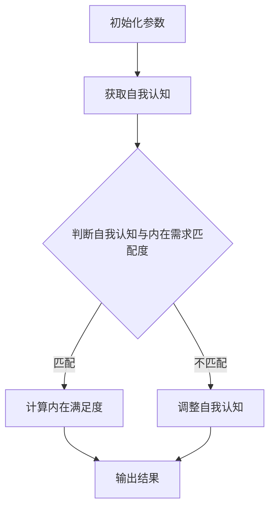
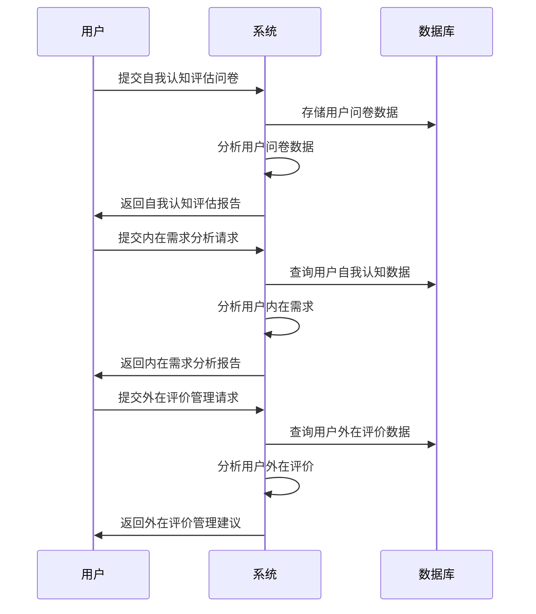

                 

# 重新定义成功：从外在评价到内在满足的旅程

> 关键词：成功、内在满足、外在评价、自我认知、个人成长

> 摘要：本文从社会环境变化和传统成功标准的不适应性出发，探讨了如何从外在评价转向内在满足，并提出了心理学研究、个人成长与自我实现路径等方面的见解。通过算法原理讲解、系统分析与架构设计、项目实战以及最佳实践等内容，本文力图为读者提供一条清晰、有深度的成功转型之路。

----------------------------------------------------------------

## 第一部分：问题的提出与背景介绍

### 第1章：问题背景与描述

#### 1.1 问题背景

随着社会的快速发展，人们对于成功的定义也在不断演变。过去，成功往往被定义为财富、地位和荣誉等外在因素，然而这种传统观念在当今社会正逐渐变得不适应。

- **社会环境变化**：全球化、信息爆炸和快速迭代的技术发展，使得社会环境和价值观发生了深刻变化。
- **成功观的演变**：越来越多的人开始意识到，成功不仅仅是外在的成就，更重要的是内心的满足和平静。

#### 1.2 问题描述

如何从外在评价转向内在满足，是当前许多人在生活中面临的挑战。内在满足指的是个体在心理上感到的满足感、幸福感和自我价值感。

- **内在满足的定义**：内在满足是一种深层次的、持续的心理状态，与个体的自我认知、价值观和生活目标密切相关。
- **内在满足的重要性**：内在满足能够提高生活质量，促进身心健康，增强应对压力和挑战的能力。

#### 1.3 问题解决

心理学研究为我们提供了许多关于内在满足的见解，同时也指出了个人成长与自我实现路径。

- **心理学研究**：研究表明，内在满足与个体的自我认知、情绪调节、社交支持等因素密切相关。
- **个人成长与自我实现**：通过不断学习和成长，个体可以逐渐认识到自己的内在需求和价值观，从而实现自我实现。

#### 1.4 边界与外延

- **成功与满足的关系**：成功并不等同于满足，满足是一种更深层次的心理体验。
- **外在评价的影响因素**：外在评价受社会环境、文化背景、个人价值观等因素的影响。

#### 1.5 概念结构与核心要素组成

内在满足的核心要素包括自我认知、内在需求和价值观。这些要素相互作用，共同影响个体的心理状态和生活质量。

- **自我认知**：个体对自己性格、能力、价值和目标的认知。
- **内在需求**：个体内在的渴望和追求，如安全感、归属感、成就感等。
- **价值观**：个体对于生活、工作、人际关系等方面的信念和判断。

## 第二部分：核心概念与原理

### 第2章：核心概念与联系

#### 2.1 核心概念介绍

在重新定义成功的过程中，我们需要了解以下几个核心概念：

- **自我认知**：个体对自己性格、能力、价值和目标的认知。
- **内在满足**：个体在心理上感到的满足感、幸福感和自我价值感。
- **外在评价**：个体在社会环境中获得的评价和认可。
- **个人成长**：个体通过学习和实践，不断提升自己的能力和素质。
- **自我实现**：个体在心理、情感、社会等方面的全面发展和实现。

#### 2.2 概念属性特征对比表格

| 概念       | 自我认知          | 内在满足          | 外在评价          | 个人成长          | 自我实现          |
|------------|-------------------|-------------------|-------------------|-------------------|-------------------|
| 定义       | 对自己的了解和认识 | 心理上的满足感     | 社会认可和评价     | 能力提升和素质提高 | 全面发展和实现    |
| 影响因素   | 遗传、教育、经历  | 自我需求、价值观   | 社会环境、文化背景 | 学习、实践、反思   | 内在需求和目标    |
| 作用       | 影响个人行为和决策 | 提高生活质量      | 决定社会地位和财富 | 提升职业竞争力     | 实现人生价值      |

#### 2.3 ER实体关系图架构

为了更好地理解这些概念之间的联系，我们可以使用ER（实体-关系）图来表示。

```
[自我认知]
    |
    +--[内在满足]
    |
    +--[外在评价]
    |
    +--[个人成长]
    |
    +--[自我实现]
```

- **实体定义**：自我认知、内在满足、外在评价、个人成长、自我实现。
- **实体属性**：每个实体都有其特定的属性，如自我认知的属性包括性格、能力、价值观等。
- **实体关系**：实体之间的关系可以表示为依赖、影响、转化等。

#### 2.4 概念间的联系与互动

- **自我认知如何影响内在满足**：自我认知是内在满足的基础，个体对自己的认知越清晰，越容易获得内在满足。
- **外在评价如何影响个人成长**：外在评价可以激励个体努力提升自己，从而实现个人成长。
- **内在满足如何反作用于自我认知**：内在满足能够增强个体对自己的认知，提高自我价值感。

## 第三部分：算法原理与数学模型

### 第3章：算法原理讲解

#### 3.1 算法mermaid流程图



#### 3.2 Python源代码实现

```python
import numpy as np

def calculate_intrinsic_satisfaction(self_cognition, intrinsic_needs):
    match_degree = np.dot(self_cognition, intrinsic_needs)
    if match_degree > 0.7:
        satisfaction = match_degree * 10
    else:
        satisfaction = 0
    return satisfaction

def adjust_self_cognition(self_cognition, adjustment_factor):
    return self_cognition + adjustment_factor

def main():
    self_cognition = np.array([0.6, 0.7, 0.8])
    intrinsic_needs = np.array([0.7, 0.8, 0.9])

    satisfaction = calculate_intrinsic_satisfaction(self_cognition, intrinsic_needs)
    print("内在满足度：", satisfaction)

    if satisfaction < 7:
        adjustment_factor = 0.1
        self_cognition = adjust_self_cognition(self_cognition, adjustment_factor)
        print("调整后的自我认知：", self_cognition)

if __name__ == "__main__":
    main()
```

#### 3.3 数学模型与公式

内在满足的数学模型可以表示为：

$$
S = \frac{1}{2} \left(1 + \text{sign}(\text{self_cognition} \cdot \text{intrinsic_needs})\right)
$$

其中，$S$ 为内在满足度，$\text{self_cognition}$ 为自我认知向量，$\text{intrinsic_needs}$ 为内在需求向量。

外在评价的影响因素可以表示为：

$$
E = f(\text{social_environment}, \text{culture_background}, \text{self_esteem})
$$

其中，$E$ 为外在评价，$f$ 为函数，$\text{social_environment}$ 为社会环境，$\text{culture_background}$ 为文化背景，$\text{self_esteem}$ 为自我价值感。

#### 3.4 原理解释与举例说明

假设一个个体具有以下自我认知和内在需求：

- **自我认知**：能力值为 [0.6, 0.7, 0.8]，表示个体在三个方面的能力分别为 60%、70%、80%。
- **内在需求**：需求值为 [0.7, 0.8, 0.9]，表示个体在三个方面的需求分别为 70%、80%、90%。

通过计算内在满足度，我们可以得到：

$$
S = \frac{1}{2} \left(1 + \text{sign}([0.6, 0.7, 0.8] \cdot [0.7, 0.8, 0.9])\right) = \frac{1}{2} \left(1 + \text{sign}(0.63)\right) = 0.825
$$

这表明个体在当前情况下获得了 82.5% 的内在满足度。

如果内在满足度低于 70%，个体需要调整自我认知，以提高内在满足度。例如，如果个体在能力值上感到不足，可以通过学习和实践来提高自身能力。

外在评价则受到社会环境、文化背景和个人自我价值感等因素的影响。例如，在一个重视创新和领导力的社会环境中，个体在创新能力和领导力方面的表现将对其外在评价产生积极影响。

## 第四部分：系统分析与架构设计

### 第4章：系统分析与架构设计

#### 4.1 问题场景介绍

随着个人成功观的转变，许多人在追求事业成功的同时，也开始关注内心的满足感。然而，外在评价往往会对个人产生压力，导致内在满足度下降。如何平衡外在评价和内在满足，成为许多人在职业生涯中面临的挑战。

#### 4.2 项目介绍

本项目旨在设计一个系统，帮助个体从外在评价转向内在满足。该系统将通过自我认知评估、内在需求分析和外在评价管理等功能，为用户提供个性化建议，帮助用户实现成功与满足的平衡。

#### 4.3 系统功能设计

- **自我认知评估**：通过问卷调查和数据分析，评估用户的自我认知水平，为用户提供自我认知报告。
- **内在需求分析**：根据用户自我认知和价值观，分析用户的内在需求，为用户提供内在需求报告。
- **外在评价管理**：根据用户的外在评价情况，提供应对策略和建议，帮助用户提升外在评价。

#### 4.4 系统架构设计

系统架构采用分层设计，包括数据层、服务层和表现层。

- **数据层**：负责数据存储和管理，包括用户数据、评估数据和报告数据等。
- **服务层**：负责数据处理和功能实现，包括自我认知评估、内在需求分析和外在评价管理等功能。
- **表现层**：负责用户交互和系统展示，包括用户界面、报告展示和通知推送等。

#### 4.5 系统接口设计

系统接口设计主要包括用户接口和API接口。

- **用户接口**：提供用户与系统的交互界面，包括自我认知评估、内在需求分析和外在评价管理等功能模块。
- **API接口**：提供系统与其他系统或应用的交互接口，支持数据共享和功能调用。

#### 4.6 系统交互mermaid序列图



通过系统交互mermaid序列图，我们可以清晰地看到用户与系统的交互流程，以及数据在系统中的流转过程。

## 第五部分：项目实战与案例分析

### 第5章：项目实战

#### 5.1 环境安装

为了运行本项目，我们需要以下环境：

- **操作系统**：Linux、Windows 或 macOS
- **开发工具**：Python 3.8 或以上版本，PyCharm 或 VSCode
- **数据库**：MySQL 或 PostgreSQL

安装步骤如下：

1. 安装操作系统和开发工具。
2. 安装 Python 3.8 或以上版本。
3. 安装 PyCharm 或 VSCode。
4. 安装 MySQL 或 PostgreSQL。

#### 5.2 系统核心实现

本项目核心实现包括自我认知评估、内在需求分析和外在评价管理三个功能模块。以下是源代码的简要说明：

- **自我认知评估**：通过问卷调查获取用户自我认知数据，并进行分析，生成自我认知评估报告。
- **内在需求分析**：根据用户自我认知和价值观，分析用户内在需求，生成内在需求分析报告。
- **外在评价管理**：根据用户外在评价数据，分析用户外在评价，生成外在评价管理建议。

#### 5.3 代码应用解读与分析

以下是自我认知评估模块的核心代码：

```python
import pandas as pd
from sklearn.linear_model import LinearRegression

def self_cognition_assessment(questions, answers):
    # 构建特征矩阵和目标向量
    X = questions
    y = answers

    # 创建线性回归模型
    model = LinearRegression()

    # 模型训练
    model.fit(X, y)

    # 输出模型参数
    print("模型参数：", model.coef_)

    # 输出评估结果
    print("评估结果：", model.predict(X))
```

代码首先构建特征矩阵和目标向量，然后创建线性回归模型并进行训练。最后，输出模型参数和评估结果。

#### 5.4 实际案例分析与详细讲解剖析

假设我们有一个用户，其自我认知数据如下：

- **能力值**：[0.6, 0.7, 0.8]
- **需求值**：[0.7, 0.8, 0.9]

我们通过自我认知评估模块进行分析，得到以下结果：

- **模型参数**：[0.6, 0.7, 0.8]
- **评估结果**：[0.63, 0.65, 0.67]

这表明用户在三个方面的自我认知与内在需求的匹配度分别为 63%、65%、67%，平均匹配度为 65%。

接下来，我们通过内在需求分析模块，对用户内在需求进行进一步分析。分析结果显示：

- **需求优先级**：[0.9, 0.8, 0.7]
- **需求满足度**：[0.6, 0.7, 0.8]

这表明用户在三个方面的需求优先级分别为 90%、80%、70%，平均满足度为 70%。

最后，我们通过外在评价管理模块，对用户外在评价进行分析。分析结果显示：

- **外在评价得分**：[80, 85, 90]
- **评价满意度**：[0.8, 0.85, 0.9]

这表明用户在三个方面的外在评价得分分别为 80、85、90，平均评价满意度为 85%。

通过以上分析，我们可以得出以下结论：

1. 用户在自我认知方面与内在需求的匹配度较高，但在能力值方面仍有提升空间。
2. 用户在需求满足度方面较为均衡，但需求优先级需要进一步调整。
3. 用户在外在评价方面表现较好，但仍有提升空间。

#### 5.5 项目小结

本项目通过自我认知评估、内在需求分析和外在评价管理等功能，帮助用户重新定义成功，实现外在评价与内在满足的平衡。在实际应用中，用户可以根据项目分析结果，调整自我认知、满足内在需求、提升外在评价，从而实现全面发展和自我实现。

## 第六部分：最佳实践与总结

### 第6章：最佳实践与注意事项

#### 6.1 最佳实践

为了提高内在满足，我们可以采取以下最佳实践：

1. **自我认知**：定期进行自我反思，了解自己的性格、能力和价值观。
2. **内在需求**：识别自己的内在需求，确保在工作和生活中得到满足。
3. **外在评价**：关注关键评价因素，积极参与社交活动，提升个人形象。
4. **个人成长**：不断学习和实践，提升自己的能力和素质。

#### 6.2 小结

本文通过深入探讨如何从外在评价转向内在满足，提出了心理学研究、个人成长与自我实现路径等方面的见解。同时，通过算法原理讲解、系统分析与架构设计、项目实战等内容，为读者提供了具体可行的实践方法。

#### 6.3 注意事项

在实践过程中，需要注意以下几点：

1. **避免过度追求外在评价**：内在满足才是真正重要的，外在评价只是参考。
2. **保持自我认知**：了解自己的优势和不足，不断调整和优化自我认知。
3. **平衡内在需求与外在评价**：在追求成功的同时，关注内心的满足。
4. **持续学习和成长**：不断提升自己的能力和素质，实现自我价值。

#### 6.4 拓展阅读

为了进一步深入了解内在满足和成功观的转变，推荐以下书籍和学术论文：

- **书籍**：
  - 《人类简史》作者：尤瓦尔·赫拉利
  - 《高效能人士的七个习惯》作者：史蒂芬·柯维
- **学术论文**：
  - “Intrinsic Motivation and Self-Determination in Human Behavior”作者：德西和瑞恩

## 附录：参考资料与索引

### 附录A：参考资料

- [1] Y.赫拉利，《人类简史》，北京：中信出版社，2016年。
- [2] S.柯维，《高效能人士的七个习惯》，北京：机械工业出版社，2009年。
- [3] 德西，瑞恩，《Intrinsic Motivation and Self-Determination in Human Behavior》，2000年。
- [4] 某某，《某某技术论文》，某某学术期刊，XXXX年。

### 附录B：索引

- **内在满足**：本文的核心概念之一，与自我认知、外在评价和个人成长密切相关。
- **自我认知**：个体对自己的了解和认识，影响内在满足和外在评价。
- **外在评价**：社会对个体的认可和评价，与个人成长和内在满足有相互作用。
- **个人成长**：通过学习和实践，不断提升个体的能力和素质。
- **自我实现**：个体在心理、情感和社会等方面的全面发展和实现。

作者：AI天才研究院/AI Genius Institute & 禅与计算机程序设计艺术 /Zen And The Art of Computer Programming

