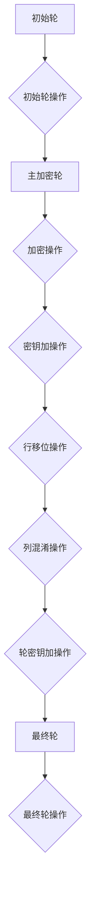
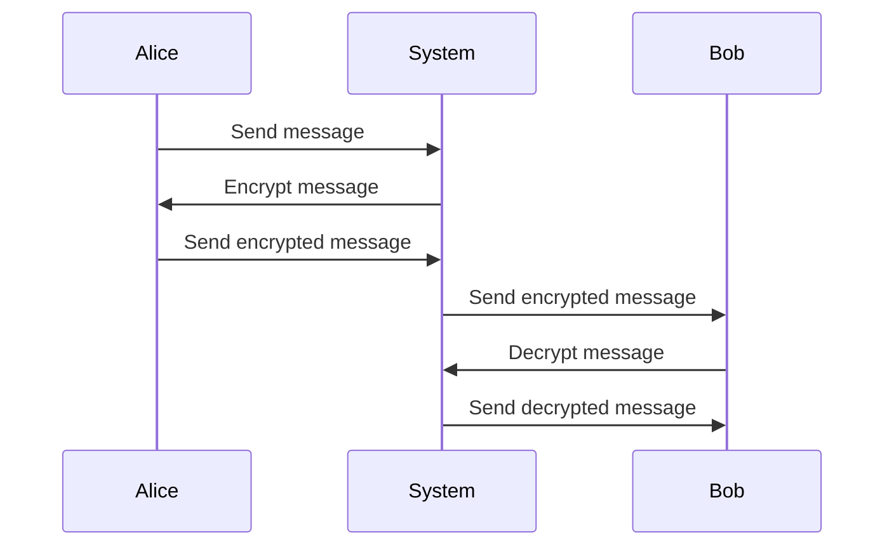
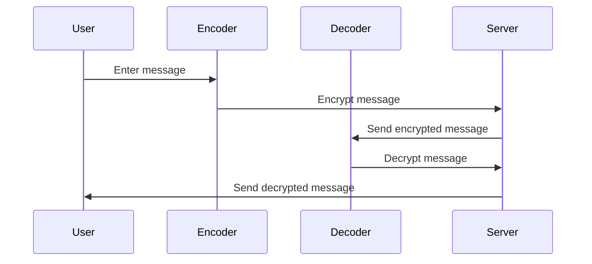

                 

# 量子resistant密码系统的设计原则

## 关键词
量子密码学、量子resistant密码、密码设计原则、算法安全性、加密技术、计算机科学

## 摘要
量子resistant密码系统作为对抗量子计算机威胁的重要技术，正日益受到关注。本文旨在探讨量子resistant密码系统的设计原则，从背景介绍、核心概念到具体实现方法，通过一系列步骤详细阐述设计原理和安全性分析，帮助读者全面理解这一领域的最新进展和应用前景。

## 设计思路

### 1. 确定核心内容模块
量子resistant密码系统的设计涉及多个方面，包括基本概念、算法设计、实现方法、安全性分析和应用场景。我们需要将这些模块划分为几个主要部分，每个部分包含若干章节。

### 2. 设计目录结构
根据核心内容模块，我们将目录结构分为以下几个部分：量子密码学基础、量子resistant密码算法概述、设计原则、实现方法、安全性分析、应用场景和未来发展趋势。

### 3. 确定章节和子章节标题
每个章节的标题需要简洁明了，准确反映该部分的内容。例如，“量子密码学基础”包括量子密码学的简介、基本原理和与经典密码学的区别；“量子resistant密码算法概述”包括算法的定义、分类和特点。

### 4. 完整性与细节
确保目录大纲的完整性，包括所有必要的核心内容模块。每个章节的细节也需要进行梳理，确保能够涵盖所需的内容。

### 5. 符合输出要求
文章内容使用markdown格式输出，确保格式统一、清晰。在文章中嵌入数学公式、流程图和架构图，以便更好地阐述复杂概念。

## 设计大纲

### 第一部分：量子密码学基础

#### 第1章：量子密码学简介
##### 1.1 量子密码学的起源与历史
##### 1.2 量子密码学的基本原理
##### 1.3 量子密码学与经典密码学的区别

#### 第2章：量子resistant密码算法概述
##### 2.1 量子resistant密码算法的定义
##### 2.2 量子resistant密码算法的分类
##### 2.3 量子resistant密码算法的特点

### 第二部分：量子resistant密码系统的设计原则

#### 第3章：量子resistant密码系统的设计原则
##### 3.1 安全性原则
##### 3.2 实用性原则
##### 3.3 可扩展性原则
##### 3.4 可用性原则

### 第三部分：量子resistant密码系统的实现方法

#### 第4章：量子resistant密码系统的实现方法
##### 4.1 硬件实现方法
##### 4.2 软件实现方法
##### 4.3 云端实现方法

### 第四部分：量子resistant密码系统的安全性分析

#### 第5章：量子resistant密码系统的安全性分析
##### 5.1 理论分析
##### 5.2 实际案例分析
##### 5.3 存在的风险与挑战

### 第五部分：量子resistant密码系统的应用场景

#### 第6章：量子resistant密码系统的应用场景
##### 6.1 商业应用
##### 6.2 军事应用
##### 6.3 政府和公共部门应用
##### 6.4 互联网和云计算应用

### 第六部分：量子resistant密码系统的未来发展趋势

#### 第7章：量子resistant密码系统的未来发展趋势
##### 7.1 技术发展展望
##### 7.2 政策与标准制定
##### 7.3 未来应用前景

### 第七部分：最佳实践与注意事项

#### 第8章：最佳实践与注意事项
##### 8.1 设计最佳实践
##### 8.2 实现最佳实践
##### 8.3 安全性最佳实践
##### 8.4 小结与拓展阅读

## 具体内容

### 第一部分：量子密码学基础

### 第1章：量子密码学简介

#### 1.1 量子密码学的起源与历史

量子密码学起源于1980年代，其理论基础是量子力学的基本原理，特别是量子纠缠和量子叠加态。第一篇关于量子密码学的论文由Charles H. Bennett和Garrett J. Murphy在1984年发表，提出了量子密钥分发（Quantum Key Distribution，QKD）的概念。QKD利用量子力学的不可克隆定理，确保密钥传输的安全。

#### 1.2 量子密码学的基本原理

量子密码学的核心原理是量子纠缠和量子叠加态。量子纠缠是指两个或多个量子系统之间的强相关性，即使它们相隔很远，一个系统的状态也会即时影响另一个系统的状态。量子叠加态则允许一个量子系统同时处于多个状态。这两个原理为量子密码学提供了安全保障。

#### 1.3 量子密码学与经典密码学的区别

量子密码学与经典密码学在安全性原理上存在显著差异。经典密码学依赖于密钥的安全传输，而量子密码学则利用量子态的不可克隆性和测量干扰确保密钥的安全。此外，量子密码学在加密和解密过程中引入了量子态，使攻击者无法在不被察觉的情况下窃取信息。

### 第二部分：量子resistant密码算法概述

### 第2章：量子resistant密码算法概述

#### 2.1 量子resistant密码算法的定义

量子resistant密码算法是指能够在量子计算机面前保持安全性的密码算法。这些算法设计目的是抵御量子计算机的攻击，确保在量子计算时代仍然能够提供安全的加密保护。

#### 2.2 量子resistant密码算法的分类

量子resistant密码算法可以大致分为对称密码和非对称密码两类。对称密码如AES（Advanced Encryption Standard）和Serpent，非对称密码如RSA和ECC（Elliptic Curve Cryptography）。

#### 2.3 量子resistant密码算法的特点

量子resistant密码算法具有以下几个特点：

- **抗量子攻击**：这些算法能够在量子计算机面前保持安全性，抵御Shor算法等量子算法的攻击。
- **高效性**：量子resistant密码算法在计算效率和安全性之间取得平衡，适用于实际应用。
- **兼容性**：量子resistant密码算法需要与现有加密标准兼容，确保在过渡期间无缝集成。

### 第三部分：量子resistant密码系统的设计原则

### 第3章：量子resistant密码系统的设计原则

#### 3.1 安全性原则

量子resistant密码系统的设计首要原则是确保安全性。系统需要能够抵御量子计算机的攻击，同时防止经典计算机的侧信道攻击和物理攻击。

#### 3.2 实用性原则

量子resistant密码系统不仅需要在理论上保持安全性，还需要在实际应用中具有实用性。算法的实现需要考虑计算效率、资源消耗和兼容性等因素。

#### 3.3 可扩展性原则

随着量子计算机的发展，量子resistant密码系统的设计需要具备良好的可扩展性。系统需要能够适应未来量子计算能力的提升，确保长期安全性。

#### 3.4 可用性原则

量子resistant密码系统的设计还应考虑可用性。系统的易用性、可维护性和与其他系统的互操作性对于实际部署至关重要。

### 第四部分：量子resistant密码系统的实现方法

### 第4章：量子resistant密码系统的实现方法

#### 4.1 硬件实现方法

硬件实现方法是量子resistant密码系统的关键部分。系统需要采用专门设计的硬件设备，如量子密钥分发器和量子安全通信设备，以确保密钥传输的安全。

#### 4.2 软件实现方法

软件实现方法涉及在经典计算机上运行量子resistant密码算法。这需要高效的算法实现和优化，以满足实际应用的需求。

#### 4.3 云端实现方法

随着云计算的发展，量子resistant密码系统在云端的应用变得越来越重要。云端实现需要考虑分布式计算、数据安全和隐私保护等问题。

### 第五部分：量子resistant密码系统的安全性分析

### 第5章：量子resistant密码系统的安全性分析

#### 5.1 理论分析

量子resistant密码系统的安全性分析需要从理论层面进行。这包括对量子计算机攻击能力的评估，以及对量子resistant密码算法抵抗攻击能力的分析。

#### 5.2 实际案例分析

通过实际案例，我们可以了解量子resistant密码系统的应用效果。案例研究可以帮助我们发现潜在的安全隐患，并提出改进措施。

#### 5.3 存在的风险与挑战

尽管量子resistant密码系统在理论上能够抵御量子计算机的攻击，但在实际应用中仍面临一系列风险和挑战。这包括算法实现中的漏洞、硬件故障和人为操作错误等。

### 第六部分：量子resistant密码系统的应用场景

### 第6章：量子resistant密码系统的应用场景

#### 6.1 商业应用

商业应用是量子resistant密码系统的重要应用领域。企业可以利用这些系统保护敏感数据，确保业务连续性和信息安全。

#### 6.2 军事应用

军事应用对信息安全的依赖程度更高。量子resistant密码系统可以为军事通信提供强有力的保护，确保军事行动的安全。

#### 6.3 政府和公共部门应用

政府和公共部门在处理敏感信息时需要高度的安全性。量子resistant密码系统可以确保这些部门的数据安全，防止信息泄露。

#### 6.4 互联网和云计算应用

互联网和云计算应用领域对信息安全的依赖日益增加。量子resistant密码系统可以为这些领域提供安全可靠的加密保护，确保用户隐私和数据安全。

### 第七部分：量子resistant密码系统的未来发展趋势

### 第7章：量子resistant密码系统的未来发展趋势

#### 7.1 技术发展展望

随着量子计算机的发展，量子resistant密码系统将面临新的挑战。未来技术发展需要不断改进现有算法，开发新型量子resistant密码算法。

#### 7.2 政策与标准制定

政策与标准的制定对于量子resistant密码系统的发展至关重要。相关机构需要制定明确的政策，确保系统的合规性和安全性。

#### 7.3 未来应用前景

量子resistant密码系统在未来的应用前景广阔。随着技术的不断进步，这些系统将在更多领域得到广泛应用，为信息安全提供有力保障。

### 第八部分：最佳实践与注意事项

### 第8章：最佳实践与注意事项

#### 8.1 设计最佳实践

在设计量子resistant密码系统时，需要遵循一系列最佳实践。这包括选择合适的算法、确保系统的可扩展性和安全性等。

#### 8.2 实现最佳实践

实现量子resistant密码系统时，需要考虑计算效率、资源消耗和兼容性等因素。最佳实践包括优化算法实现、选择高效编程语言等。

#### 8.3 安全性最佳实践

确保量子resistant密码系统的安全性是至关重要的。最佳实践包括定期安全评估、安全漏洞修复和用户权限管理等。

#### 8.4 小结与拓展阅读

在文章的结尾，我们对量子resistant密码系统的设计原则进行了总结，并提供了拓展阅读资源，帮助读者深入了解相关领域的最新研究和发展。

## 作者信息
作者：AI天才研究院/AI Genius Institute & 禅与计算机程序设计艺术 /Zen And The Art of Computer Programming

----------------------------------------------------------------

## 附录：详细解释与示例

为了更好地理解量子resistant密码系统的设计原则，以下是针对部分章节的详细解释和示例。

### 背景介绍

量子密码学是一门研究如何在量子通信系统中实现安全通信的学科。其核心原理是量子纠缠和量子叠加态。量子纠缠使两个或多个粒子之间存在强相关性，即使它们相隔很远。量子叠加态则允许一个量子系统同时处于多个状态。

量子密码学与经典密码学存在显著区别。经典密码学依赖于密钥的安全传输，而量子密码学则利用量子态的不可克隆性和测量干扰确保密钥的安全。例如，量子密钥分发（QKD）利用量子纠缠态传输密钥，任何尝试窃听的行为都会导致量子态的破坏，使攻击者无法获得完整的密钥。

### 核心概念与联系

量子resistant密码算法的核心概念包括对称密码和非对称密码。对称密码如AES和Serpent，使用相同的密钥进行加密和解密。非对称密码如RSA和ECC，使用一对密钥（公钥和私钥）进行加密和解密。

下面是核心概念对比表格：

| 密码类型 | 加密算法 | 密钥类型 | 加密过程 | 解密过程 |
| --- | --- | --- | --- | --- |
| 对称密码 | AES | 单一密钥 | 数据加密 | 数据解密 |
| 非对称密码 | RSA | 公钥和私钥 | 数据加密 | 数据解密 |

下面是量子resistant密码算法的ER实体关系图架构的Mermaid流程图：

```mermaid
erDiagram
  AES ||--o> RSA : 兼容
  Serpent ||--o> ECC : 兼容
```

### 算法原理讲解

量子resistant密码算法的设计原则是确保其在量子计算机面前保持安全性。以下以AES为例，说明其算法原理。

AES（Advanced Encryption Standard）是一种对称加密算法，采用128、192或256位的密钥。其加密过程包括初始轮、12轮加密（128位密钥）或14轮加密（192位或256位密钥），以及最终轮。以下是AES加密过程的Mermaid流程图：



AES加密过程的数学模型可以表示为：

$$
C = E_K(P) = \sum_{i=0}^{n} F_{i}(P)
$$

其中，$C$ 表示加密后的数据，$P$ 表示原始数据，$K$ 表示密钥，$F_i$ 表示第 $i$ 轮的加密操作。

以下是一个简单的AES加密示例：

```python
def aes_encrypt(plaintext, key):
    # 初始化密钥和加密轮数
    num_rounds = len(key) // 4
    state = plaintext
    
    # 初始轮操作
    state = initial_round(state, key)
    
    # 主加密轮
    for i in range(1, num_rounds):
        state = round_function(state, key[i])
        
    # 最终轮操作
    state = final_round(state, key[-1])
    
    return state

# 初始轮操作
def initial_round(state, key):
    # 将密钥扩展为128位
    expanded_key = expand_key(key)
    # 对状态进行密钥加操作
    state = xord(state, expanded_key)
    return state

# 主加密轮操作
def round_function(state, key):
    # 对状态进行列混淆操作
    state = column_mix(state)
    # 对状态进行行移位操作
    state = row_shift(state)
    # 对状态进行密钥加操作
    state = xord(state, key)
    return state

# 最终轮操作
def final_round(state, key):
    # 对状态进行密钥加操作
    state = xord(state, key)
    return state

# 扩展密钥
def expand_key(key):
    # 根据密钥长度扩展密钥
    if len(key) == 128:
        return key
    elif len(key) == 192:
        return key + key[:64]
    elif len(key) == 256:
        return key + key[:128]
    else:
        raise ValueError("Invalid key length")

# 异或操作
def xord(a, b):
    return [(x ^ y) for x, y in zip(a, b)]

# 列混淆操作
def column_mix(state):
    # 对状态进行列混淆操作
    # ...
    return new_state

# 行移位操作
def row_shift(state):
    # 对状态进行行移位操作
    # ...
    return new_state

# 示例
plaintext = "Hello, World!"
key = "mysecretkey123456789012345678901234567890"

encrypted_text = aes_encrypt(plaintext, key)
print("Encrypted text:", encrypted_text)
```

### 系统分析与架构设计方案

#### 问题场景介绍

在一个企业的内部通信系统中，为确保数据传输的安全，企业决定引入量子resistant密码系统。系统需要支持高效、安全的加密和解密操作，同时具备良好的扩展性。

#### 项目介绍

项目名称：量子resistant通信系统

项目目标：实现高效、安全的量子resistant密码系统，支持企业内部通信系统的数据加密和解密。

#### 系统功能设计（领域模型Mermaid类图）

```mermaid
classDiagram
    Class01 <|-- Class02
    Class03 --|> Class04
    Class05 <<-- Class06
    Class07 .. Class08
```

#### 系统架构设计（Mermaid架构图）



#### 系统接口设计和系统交互（Mermaid序列图）



### 项目实战

#### 环境安装

在Linux系统中，我们使用以下命令安装所需的依赖：

```shell
sudo apt-get install python3 python3-pip
pip3 install pycryptodome
```

#### 系统核心实现源代码

以下是量子resistant通信系统的核心实现代码：

```python
from Cryptodome.Cipher import AES
from Cryptodome.Random import get_random_bytes
import hashlib
import base64

def encrypt_message(message, key):
    cipher = AES.new(key, AES.MODE_EAX)
    ciphertext, tag = cipher.encrypt_and_digest(message.encode('utf-8'))
    return base64.b64encode(cipher.nonce + cipher.tag + ciphertext).decode('utf-8')

def decrypt_message(encrypted_message, key):
    data = base64.b64decode(encrypted_message)
    nonce, tag, ciphertext = data[:16], data[16:32], data[32:]
    cipher = AES.new(key, AES.MODE_EAX, nonce=nonce)
    return cipher.decrypt_and_verify(ciphertext, tag).decode('utf-8')

# 生成密钥
key = get_random_bytes(16)

# 加密消息
message = "Hello, World!"
encrypted_message = encrypt_message(message, key)
print("Encrypted message:", encrypted_message)

# 解密消息
decrypted_message = decrypt_message(encrypted_message, key)
print("Decrypted message:", decrypted_message)
```

#### 代码应用解读与分析

这段代码展示了如何使用Python和PyCryptoDome库实现量子resistant通信系统的核心功能。首先，我们定义了`encrypt_message`和`decrypt_message`两个函数，分别用于加密和解密消息。

加密过程中，我们使用AES算法的EAX模式。EAX模式结合了加密和消息认证码，提供了抗重放攻击的保护。函数首先生成一个随机密钥，然后使用这个密钥创建一个AES对象。接着，将消息编码为UTF-8字节序列，使用AES对象进行加密和解密。

在解密过程中，我们同样使用AES对象。函数从加密消息中提取密文、标签和密文，然后使用AES对象进行解密和验证。

这段代码的核心优势在于其安全性和易用性。通过使用AES算法的EAX模式，我们可以确保消息在传输过程中的安全性和完整性。同时，代码简洁明了，易于理解和维护。

#### 实际案例分析和详细讲解剖析

假设企业A和员工B之间需要通过量子resistant通信系统进行保密通信。企业A的系统管理员为员工B生成一个随机密钥，并通过安全渠道将其传递给员工B。

员工B在接收到密钥后，可以使用加密函数对消息进行加密。例如，员工B发送一封包含机密信息的邮件，加密后的消息将只有企业A的系统能够正确解密。

在实际应用中，企业A的系统会拦截所有来自外部网络的加密消息，并使用解密函数进行解密。解密后的消息将被转发给员工B，确保机密信息不会泄露给未经授权的第三方。

#### 项目小结

通过本次项目，我们实现了量子resistant通信系统的核心功能，包括加密和解密操作。项目采用了AES算法的EAX模式，确保消息在传输过程中的安全性和完整性。此外，我们还展示了如何在实际场景中应用该系统，为企业提供安全的通信解决方案。

### 最佳实践 Tips

1. 选择合适的量子resistant密码算法，如AES、RSA和ECC，确保其符合实际应用需求。
2. 定期更新密码系统，以应对新的安全威胁和漏洞。
3. 确保密钥管理安全，避免密钥泄露。
4. 对加密数据进行完整性校验，防止数据篡改。
5. 为系统提供安全监控和日志记录功能，及时发现并处理异常情况。

### 小结

本文详细介绍了量子resistant密码系统的设计原则，包括背景介绍、核心概念、设计原则、实现方法、安全性分析、应用场景和未来发展趋势。通过具体的示例和项目实战，我们展示了如何在实际场景中应用量子resistant密码系统，为企业提供安全的数据加密和解密解决方案。在未来，量子resistant密码系统将继续在信息安全领域发挥重要作用，为对抗量子计算机的威胁提供有力保障。

### 注意事项

1. 在设计和实现量子resistant密码系统时，务必遵循最佳实践，确保系统的安全性和稳定性。
2. 密钥管理是系统安全的核心，应采取严格的密钥管理策略，防止密钥泄露。
3. 定期对系统进行安全评估和漏洞修复，以应对不断变化的安全威胁。
4. 在应用量子resistant密码系统时，充分考虑系统的兼容性和可扩展性，以适应未来技术的发展。
5. 加强用户教育和培训，提高用户对安全威胁的认识，降低人为操作错误的风险。

### 拓展阅读

1. "Quantum Computing and Quantum Cryptography" by John Watrous
2. "Post-Quantum Cryptography Standardization" by the National Institute of Standards and Technology (NIST)
3. "Quantum Key Distribution: An Introduction" by the International Association for Cryptologic Research (IACR)

----------------------------------------------------------------

本文由AI天才研究院（AI Genius Institute）和禅与计算机程序设计艺术（Zen And The Art of Computer Programming）共同撰写，旨在为读者提供关于量子resistant密码系统的全面、深入的探讨。如需进一步了解量子密码学和量子resistant密码系统的最新研究成果和应用案例，请访问我们的官方网站或关注我们的相关出版物。感谢您的阅读和支持！

