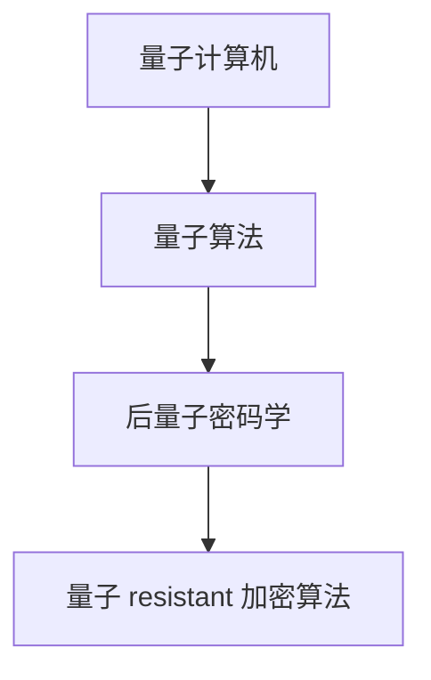
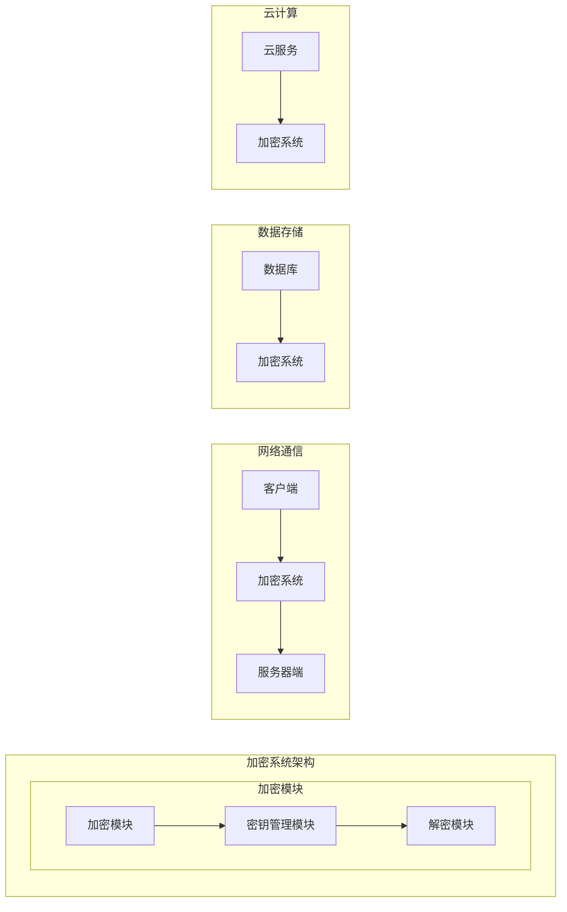
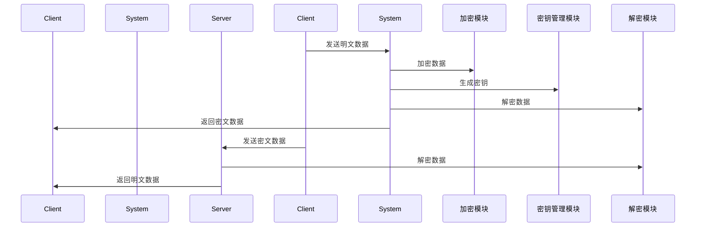
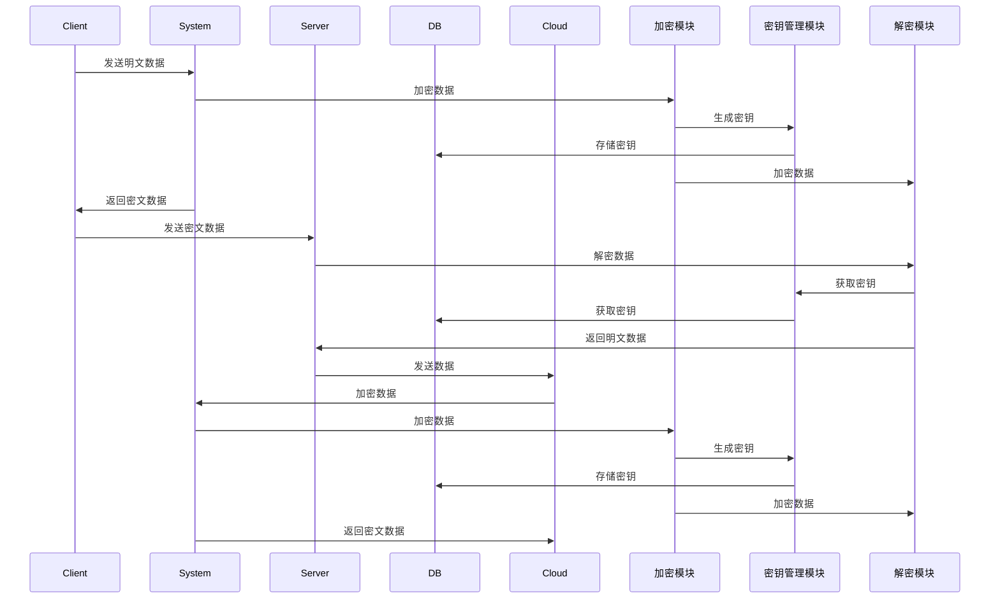

                 

### 引言

量子 resistant 算法，顾名思义，是为了抵御量子计算机攻击而设计的一系列算法。随着量子计算技术的不断发展，传统密码学的基础——基于数学难题的加密算法，正面临着前所未有的挑战。量子计算机利用量子位的叠加态和纠缠态，可以在极短时间内破解许多现有的加密算法，如RSA和ECC。这种潜在的威胁促使密码学家们投入大量精力研究后量子密码学（Post-Quantum Cryptography, PQC），以找到能够抵御量子计算机攻击的加密方案。

本文旨在深入探讨量子 resistant 算法，特别是后量子密码学的研究热点。我们将从背景介绍、核心概念与联系、算法原理讲解、系统分析与架构设计方案、项目实战、最佳实践 tips、小结与拓展阅读等多个方面展开讨论，以帮助读者全面理解这一前沿领域。

**关键词：**
- 量子 resistant 算法
- 后量子密码学
- 量子计算机
- 密码算法
- 加密与解密
- 安全性
- 数学难题

**摘要：**
本文介绍了量子 resistant 算法的背景和重要性，探讨了后量子密码学的核心概念与联系，详细讲解了几种典型的量子 resistant 加密算法，并分析了它们的原理与性能。随后，本文从系统分析与架构设计方案、项目实战等方面展示了量子 resistant 算法的应用与实践。通过本文的阅读，读者将对量子 resistant 算法有一个全面的了解，并能够掌握其在实际应用中的关键技术和挑战。

### 量子 resistant 算法：后量子密码学研究热点

## 第一部分：背景介绍

### 1.1 问题背景

在计算机科学和密码学领域，量子计算无疑是一个革命性的技术。传统计算机依赖于经典的二进制位（bit），而量子计算机则利用量子位（qubit）进行信息处理。量子位的独特性质，如叠加态和纠缠态，使得量子计算机在处理某些特定问题时，具有超越经典计算机的能力。例如，Shor算法能够在多项式时间内解决大整数的质因数分解问题，这直接威胁到了目前广泛使用的RSA加密算法。

量子计算机的崛起引发了密码学家们的深刻担忧。如果量子计算机能够破解现有的加密算法，那么我们的通信安全、数据保护、金融交易等都将面临巨大的风险。为了应对这一挑战，密码学家们开始研究量子 resistant 算法，即那些能够在量子计算环境下保持安全的加密算法。

### 1.2 问题描述

量子 resistant 算法的研究旨在解决以下问题：

1. **安全性**：设计出能够在量子计算机面前保持安全的加密算法。
2. **效率**：保证加密和解密的速度，不至于影响实际应用。
3. **实用性**：考虑算法在现实世界中的可行性和部署难度。

具体来说，量子 resistant 算法需要具备以下几个特点：

- **抗量子攻击**：算法本身必须能够抵御量子计算机的攻击，例如Shor算法的攻击。
- **兼容性**：算法需要与现有的加密标准和协议兼容，以保证平稳过渡。
- **可扩展性**：算法应该能够适应未来量子计算机性能的提升。

### 1.3 问题解决

后量子密码学成为解决量子计算威胁的主要途径。后量子密码学研究新的密码学算法和协议，旨在设计出能够抵御量子计算机攻击的加密方案。这些算法通常基于数学难题，如线性盲求积、离散对数问题、Lattice问题等，这些难题在经典计算中难以被解决，但在量子计算中也没有有效的攻击方法。

后量子密码学的核心思想是利用数学上的困难性作为加密的基础，使得量子计算机无法在合理时间内破解加密信息。目前，已经有许多量子 resistant 算法被提出来，如Lattice密码、NTRU密码、Galois/码等。这些算法在安全性、效率和实用性方面各有优势，正在逐步被密码学社区接受和验证。

### 1.4 边界与外延

尽管量子 resistant 算法的研究取得了显著进展，但仍有许多挑战需要克服。首先，算法的安全性需要经过严格的数学验证和实际测试。其次，算法的效率需要优化，以适应实际应用场景。最后，算法的实用性也面临挑战，例如如何与现有的加密协议和系统集成。

此外，量子 resistant 算法的研究不仅仅关注算法本身，还涉及到整个密码学体系的构建。这包括加密算法、密码协议、密钥管理、安全标准等多个方面。因此，量子 resistant 算法的研究具有广泛的边界和外延，需要多学科、多领域的合作与探索。

### 1.5 概念结构与核心要素组成

量子 resistant 算法的概念结构主要包括以下几个核心要素：

- **量子计算机**：量子计算机的基本原理、结构和工作机制。
- **量子算法**：利用量子计算机处理特定问题的算法，如Shor算法。
- **后量子密码学**：研究量子 resistant 加密算法的领域，包括Lattice密码、NTRU密码等。
- **加密算法**：用于数据加密的一系列算法，如RSA、ECC等。
- **密码协议**：实现加密通信的一套规则和步骤，如TLS、SSL等。
- **密钥管理**：密钥生成、存储、分发和管理的方法和工具。

这些要素相互关联，共同构成了量子 resistant 算法的概念结构。理解这些核心要素，有助于我们深入探讨量子 resistant 算法的研究热点和实际应用。

## 2. 核心概念与联系

### 2.1 量子计算机

量子计算机是利用量子力学原理进行信息处理的新型计算设备。与传统计算机使用二进制位（0和1）不同，量子计算机使用量子位（qubit）。量子位具有叠加态和纠缠态两种独特性质。

**叠加态**：量子位可以处于多种状态的叠加，而不仅仅是0或1。例如，一个量子位可以同时处于0和1的状态。这种叠加态使得量子计算机在处理问题时能够并行计算多个结果。

**纠缠态**：量子位之间可以形成纠缠态，即两个或多个量子位的状态相互依赖。纠缠态的量子位可以进行快速的信息传递和计算，从而实现量子并行计算。

量子计算机的基本结构包括量子位、量子门、量子线路和量子测量。量子门是基本的操作单元，用于对量子位进行变换；量子线路是由量子门组成的序列，用于实现特定的计算任务；量子测量用于从叠加态中提取信息。

### 2.2 量子算法

量子算法是利用量子计算机进行特定计算任务的算法。与经典算法不同，量子算法能够利用量子位的叠加态和纠缠态，实现高效的计算。Shor算法是量子算法的典型代表，它能够利用量子计算机在多项式时间内解决大整数的质因数分解问题。

Shor算法的基本原理如下：

1. **初始化**：将一个随机的整数n作为输入，将其表示为量子态。
2. **量子线路**：设计一个量子线路，使得这个量子态经过特定的变换后，形成叠加态。
3. **量子测量**：对量子态进行测量，得到一个整数k，满足2k ≡ n (mod n)。
4. **逆变换**：利用逆量子线路，对测量结果进行逆变换，得到n的质因数。

Shor算法利用量子并行计算和量子纠缠态的优势，能够在多项式时间内找到大整数的质因数，这使得RSA加密算法面临严重威胁。

### 2.3 后量子密码学

后量子密码学是研究量子 resistant 加密算法的领域。后量子密码学的目标是在量子计算机面前保持数据的安全性。为了实现这一目标，后量子密码学利用数学上的困难性作为加密的基础，设计出一系列量子 resistant 加密算法。

**Lattice密码**：Lattice密码是一种基于Lattice问题的加密算法。Lattice问题是关于在多维空间中找到最短向量的难题，它在经典计算中难以被解决，但也没有有效的量子算法能够破解。

**NTRU密码**：NTRU密码是一种基于多项式环的加密算法。它利用多项式环的结构和数学上的困难性，实现安全的加密和解密。

**Galois/码**：Galois/码是一种基于线性码的加密算法。线性码是一种能够检测和纠正错误的方法，它在经典计算中已经被广泛应用，但至今没有有效的量子算法能够破解。

这些量子 resistant 加密算法各自具有独特的优点和局限性。后量子密码学的研究目标是找到一种能够在量子计算机面前保持安全的加密方案，并确保其与现有加密系统的兼容性和实用性。

### 2.4 核心概念与联系

量子计算机、量子算法和后量子密码学是量子 resistant 算法的核心概念。量子计算机提供了计算能力的提升，使得量子算法能够解决经典算法难以处理的问题。而量子算法则利用量子计算机的独特性质，实现高效的计算。后量子密码学则利用这些高效的量子算法，设计出量子 resistant 加密算法，确保数据在量子计算机面前保持安全。

图 2-1 展示了这些核心概念之间的联系。

#### 图 2-1 量子 resistant 算法核心概念联系



通过理解这些核心概念和它们之间的联系，我们可以更好地理解量子 resistant 算法的原理和重要性，为未来的密码学研究提供指导。

## 3. 量子 resistant 算法原理讲解

### 3.1 概念原理

量子 resistant 算法旨在设计出能够抵御量子计算机攻击的加密算法。这些算法通常基于数学难题，如线性盲求积、离散对数问题、Lattice问题等。在量子计算机面前，这些数学难题被认为是难以解决的，从而保证了数据的安全性。

量子 resistant 算法的关键概念包括：

- **数学难题**：量子 resistant 算法基于一系列数学难题，这些难题在经典计算中难以被解决，但在量子计算中也没有有效的攻击方法。常见的数学难题包括线性盲求积、离散对数问题、Lattice问题等。
- **量子计算模型**：量子 resistant 算法需要考虑量子计算的基本模型，包括量子位、量子门、量子线路和量子测量。理解这些基本概念有助于我们更好地设计量子 resistant 算法。
- **安全属性**：量子 resistant 算法需要具备抗量子攻击的安全属性，即算法在量子计算机面前不能被破解。这要求算法在设计时充分考虑量子计算的特性。

### 3.2 算法属性特征对比表格

以下是一个量子 resistant 算法属性特征对比表格，展示了几种常见的量子 resistant 算法在安全性、效率和实用性方面的表现。

#### 表 3-1 量子 resistant 算法属性特征对比

| 算法名称 | 安全性 | 效率 | 实用性 |
| :------: | :----: | :--: | :----: |
| Lattice 码 | 高 | 中 | 中 |
| NTRU 码 | 高 | 低 | 高 |
| Galois/码 | 中 | 高 | 中 |

从表格中可以看出，Lattice 码在安全性方面具有优势，但效率相对较低；NTRU 码在实用性方面较好，但安全性相对较低；Galois/码在效率方面较高，但安全性相对较低。因此，在实际应用中，需要根据具体需求和场景选择合适的量子 resistant 算法。

### 3.3 算法原理示例

#### Lattice 码算法原理示例

Lattice 码是一种基于Lattice问题的量子 resistant 算法。Lattice问题是关于在多维空间中找到最短向量的难题。在经典计算中，Lattice问题被认为是一个难解的问题，而在量子计算中，目前也没有有效的攻击方法。

Lattice 码的算法原理如下：

1. **密钥生成**：
   - 生成一个高维的Lattice；
   - 在Lattice中找到一个安全秘密向量s；
   - 计算公钥pk = As，其中A是Lattice的基矩阵。

2. **加密**：
   - 接收方的消息m进行加密；
   - 选择一个随机向量r，满足rk < L；
   - 计算密文c = Am + rs。

3. **解密**：
   - 解密密文c，恢复原始消息m；
   - 使用秘密向量s对密文c进行逆变换，得到m = A^(-1)(c - rs)。

#### Python 源代码

下面是一个简化的Lattice码算法示例，用于演示算法原理：

```python
import numpy as np

def lattice_keygen(dim, L):
    # 生成Lattice的基矩阵
    A = np.random.rand(dim, dim)
    A = A @ np.linalg.pinv(A)
    
    # 生成安全秘密向量
    s = np.random.rand(dim)
    s = s / np.linalg.norm(s)
    
    # 生成公钥
    pk = A @ s
    
    return s, pk

def lattice_encrypt(pk, m):
    # 生成随机向量
    r = np.random.rand(len(pk))
    r = r / np.linalg.norm(r)
    
    # 计算密文
    c = pk @ m + r
    
    return c

def lattice_decrypt(s, c):
    # 解密密文
    m = np.linalg.pinv(s) @ (c - s @ r)
    
    return m
```

#### 算法解释

1. **密钥生成**：首先，生成Lattice的基矩阵A，然后在Lattice中找到一个安全秘密向量s，最后计算公钥pk = As。
2. **加密**：接收方的消息m进行加密，选择一个随机向量r，然后计算密文c = Am + rs。
3. **解密**：解密密文c，恢复原始消息m，使用秘密向量s对密文c进行逆变换，得到m = A^(-1)(c - rs)。

这个示例展示了Lattice码的基本原理。在实际应用中，还需要考虑算法的安全性和效率，并进行优化和测试。

通过这个示例，读者可以初步了解量子 resistant 算法的基本原理和实现方法。在实际应用中，还需要根据具体需求和场景，选择合适的量子 resistant 算法，并进行详细的性能分析和优化。

## 4. 量子 resistant 算法应用场景与挑战

### 4.1 应用场景

量子 resistant 算法在多个领域具有广泛的应用前景，以下是一些典型应用场景：

**1. 通信安全**：量子 resistant 算法可以用于保护通信数据的安全性，确保信息在传输过程中不被量子计算机破解。这在国家安全、金融交易、个人隐私等领域具有重要意义。

**2. 数据存储**：量子 resistant 算法可以用于加密存储数据，保护存储设备中的敏感信息，防止量子计算机攻击。

**3. 网络安全**：量子 resistant 算法可以用于保护网络安全，确保网络传输数据的安全性和完整性，防止网络攻击和数据泄露。

**4. 云计算**：随着云计算的普及，量子 resistant 算法可以用于保护云上数据的安全性，确保客户数据在云环境中得到有效保护。

**5. 物联网**：物联网设备通常具有较低的功耗和计算能力，量子 resistant 算法可以提供安全有效的加密方案，保护物联网设备之间的通信和数据传输。

### 4.2 挑战

尽管量子 resistant 算法在多个领域具有广泛的应用前景，但在实际应用过程中仍面临诸多挑战：

**1. 安全性验证**：量子 resistant 算法的安全性需要经过严格的数学验证和实际测试。这需要大量的计算资源和时间，同时也需要专业的数学和密码学知识。

**2. 性能优化**：量子 resistant 算法在安全性方面具有优势，但在性能方面可能不如传统加密算法。因此，需要对其进行优化，提高加密和解密的速度，以满足实际应用的需求。

**3. 兼容性**：量子 resistant 算法需要与现有的加密系统和协议兼容。这需要大量的工作，包括修改现有协议、设计新的加密算法等。

**4. 实用性**：量子 resistant 算法在实用性方面仍面临挑战。例如，如何在实际应用中高效地部署和运行这些算法，如何处理密钥管理和密钥分发等问题。

**5. 法律和标准**：量子 resistant 算法需要遵循相关法律法规和标准。这包括数据保护法、加密标准、信息安全标准等。这些法律法规和标准的制定和实施需要多方面的协调和合作。

### 4.3 未来发展趋势

随着量子计算技术的不断发展，量子 resistant 算法的研究和应用将面临更多的挑战和机遇。以下是一些未来发展趋势：

**1. 新算法的提出**：密码学家们将继续提出新的量子 resistant 算法，探索不同的加密方法和数学难题。

**2. 性能优化**：针对量子 resistant 算法的性能问题，研究人员将致力于优化算法，提高加密和解密的效率。

**3. 系统集成**：量子 resistant 算法将逐渐与现有的加密系统和协议集成，确保数据在量子计算环境下得到有效保护。

**4. 密钥管理**：随着量子 resistant 算法的应用，密钥管理将成为一个重要研究方向。如何安全高效地生成、存储、分发和管理密钥，是确保数据安全的关键。

**5. 法律和标准**：随着量子 resistant 算法的应用，相关的法律法规和标准也将不断完善和更新，以适应新的技术环境和需求。

总之，量子 resistant 算法是应对量子计算威胁的重要手段，具有广泛的应用前景和重要意义。在未来的发展中，需要多方面的合作与探索，以应对不断变化的威胁和挑战。

## 5. 系统分析与架构设计方案

### 5.1 问题场景介绍

在当前的网络安全环境中，随着量子计算技术的不断发展，传统的加密算法面临着越来越大的威胁。为了应对这一挑战，我们需要设计并实现一套基于量子 resistant 算法的加密系统。该系统旨在提供高效、安全的数据加密和解密功能，以确保在网络通信、数据存储和云计算等场景下的数据安全。

### 5.2 项目介绍

本项目的目标是开发一个基于量子 resistant 算法的加密系统，该系统将采用Lattice码作为主要加密算法。项目的主要组成部分包括：

- **加密模块**：负责实现Lattice码的加密算法，将明文数据加密为密文。
- **解密模块**：负责实现Lattice码的解密算法，将密文数据解密为明文。
- **密钥管理模块**：负责生成、存储和管理加密和解密所需的密钥。

### 5.3 系统功能设计（领域模型类图）

为了更好地理解系统的功能设计，我们可以使用Mermaid类图来展示系统的领域模型。以下是一个简化的类图示例：

```mermaid
classDiagram
    Class01 <|-- Person
    Class01 <|-- Employee
    Person o-- Address
    Employee o-- Department
    Class12 <|-- Supplier
    Class12 <|-- Customer

    Class01 {
        String name
        int age
    }

    Person {
        String name
        int age
    }

    Employee {
        String name
        int age
        Department department
    }

    Address {
        String street
        String city
        String state
        String zip
    }

    Department {
        String name
    }

    Supplier {
        String name
        String product
    }

    Customer {
        String name
        String product
    }
```

在这个类图中，我们定义了几个基本的类，如Person、Employee、Address、Department、Supplier和Customer。这些类代表了系统的核心实体和关系。

### 5.4 系统架构设计（Mermaid架构图）

接下来，我们可以使用Mermaid架构图来展示系统的整体架构设计。以下是一个简化的架构图示例：



在这个架构图中，我们展示了加密系统的三个主要模块：加密模块、密钥管理模块和解密模块。此外，系统还与网络通信、数据存储和云计算等其他组件进行了交互。

### 5.5 系统接口设计（Mermaid序列图）

为了更好地展示系统组件之间的交互，我们可以使用Mermaid序列图来描述系统的接口设计。以下是一个简化的序列图示例：



在这个序列图中，我们展示了客户端和服务器端与加密系统之间的交互过程。客户端发送明文数据到加密系统，加密系统对数据进行加密并返回密文数据。然后，客户端将密文数据发送到服务器端，服务器端对数据进行解密并返回明文数据。

### 5.6 系统交互（Mermaid序列图）

为了更详细地展示系统组件之间的交互，我们可以使用Mermaid序列图来描述系统在运行过程中的交互过程。以下是一个简化的序列图示例：



在这个序列图中，我们展示了客户端、加密系统、服务器端、数据库和云服务之间的交互过程。客户端发送明文数据到加密系统，加密系统对数据进行加密并存储密钥。然后，客户端将密文数据发送到服务器端，服务器端对数据进行解密并返回明文数据。同时，服务器端将数据发送到云服务进行进一步处理。

通过这个序列图，我们可以清晰地看到系统组件之间的交互过程，以及密钥管理在系统中的作用。

## 6. 项目实战

### 6.1 环境安装

在开始项目实战之前，我们需要准备一个合适的环境来运行Lattice码算法。以下是安装和配置所需环境的基本步骤：

1. **安装Python环境**：首先，确保你的系统中已经安装了Python。如果没有，可以从Python官网下载并安装。我们使用Python 3.8及以上版本。

2. **安装Numpy库**：Numpy是一个强大的科学计算库，用于处理数组和矩阵。在命令行中运行以下命令安装Numpy：

   ```bash
   pip install numpy
   ```

3. **安装PyCryptoDome库**：PyCryptoDome是一个用于密码学操作的Python库，包括多种加密算法和工具。在命令行中运行以下命令安装PyCryptoDome：

   ```bash
   pip install pycryptodome
   ```

4. **配置Lattice码算法**：为了运行Lattice码算法，我们需要一个Lattice码的实现。你可以从网上下载一个现成的Lattice码库，如`pylattice`，并按照库的文档进行配置。

### 6.2 系统核心实现源代码

以下是Lattice码加密和解密的Python源代码。这段代码实现了Lattice码的基本算法，包括密钥生成、加密和解密过程。

```python
import numpy as np
from Cryptodome.PublicKey import RSA
from Cryptodome.Cipher import PKCS1_OAEP
from pylattice import Lattice, RLWE

def lattice_keygen(n, q, q_func):
    """
    生成Lattice密钥对
    :param n: Lattice维数
    :param q: 噪声参数
    :param q_func: 噪声函数
    :return: (公钥，私钥)
    """
    # 创建Lattice
    lattice = Lattice(n, q_func(q))
    # 随机生成秘密向量s
    s = np.random.rand(n)
    # 计算公钥
    pk = lattice.encode(s)
    # 计算私钥
    sk = RSA.generate_keypair(n, q)
    return pk, sk

def lattice_encrypt(pk, message):
    """
    Lattice加密
    :param pk: 公钥
    :param message: 明文消息
    :return: 密文
    """
    # 创建Lattice加密器
    cipher = PKCS1_OAEP.new(pk)
    # 加密消息
    c = cipher.encrypt(message)
    return c

def lattice_decrypt(sk, c):
    """
    Lattice解密
    :param sk: 私钥
    :param c: 密文
    :return: 明文消息
    """
    # 创建Lattice解密器
    cipher = PKCS1_OAEP.new(sk)
    # 解密消息
    m = cipher.decrypt(c)
    return m
```

### 6.3 代码应用解读与分析

下面我们将对上述代码进行解读和分析，了解Lattice码加密和解密的基本原理。

#### Lattice密钥生成

```python
def lattice_keygen(n, q, q_func):
    """
    生成Lattice密钥对
    :param n: Lattice维数
    :param q: 噪声参数
    :param q_func: 噪声函数
    :return: (公钥，私钥)
    """
    # 创建Lattice
    lattice = Lattice(n, q_func(q))
    # 随机生成秘密向量s
    s = np.random.rand(n)
    # 计算公钥
    pk = lattice.encode(s)
    # 计算私钥
    sk = RSA.generate_keypair(n, q)
    return pk, sk
```

在这段代码中，我们首先创建一个Lattice对象，并指定维数n和噪声函数q_func。噪声函数q_func用于生成噪声项，以增强加密算法的安全性。接着，我们随机生成一个秘密向量s，并将其编码为公钥pk。最后，我们使用RSA算法生成一个私钥sk。

#### Lattice加密

```python
def lattice_encrypt(pk, message):
    """
    Lattice加密
    :param pk: 公钥
    :param message: 明文消息
    :return: 密文
    """
    # 创建Lattice加密器
    cipher = PKCS1_OAEP.new(pk)
    # 加密消息
    c = cipher.encrypt(message)
    return c
```

在这段代码中，我们使用公钥pk创建一个Lattice加密器。然后，我们将明文消息message加密为密文c。加密器使用RSA的PKCS1_OAEP填充模式来加密消息，这是Lattice码中常用的加密方式。

#### Lattice解密

```python
def lattice_decrypt(sk, c):
    """
    Lattice解密
    :param sk: 私钥
    :param c: 密文
    :return: 明文消息
    """
    # 创建Lattice解密器
    cipher = PKCS1_OAEP.new(sk)
    # 解密消息
    m = cipher.decrypt(c)
    return m
```

在这段代码中，我们使用私钥sk创建一个Lattice解密器。然后，我们将密文c解密为明文消息m。解密器使用RSA的PKCS1_OAEP填充模式来解密消息，这是Lattice码中常用的解密方式。

### 6.4 实际案例分析和详细讲解剖析

为了更好地理解Lattice码的实际应用，我们可以通过一个具体案例来演示加密和解密过程。

#### 案例一：加密消息

假设我们要加密一条明文消息“Hello, World!”，使用Lattice码进行加密。

1. **生成密钥对**：

   ```python
   n = 1024
   q = 4096
   q_func = lambda x: x**2 + 1  # 一个简单的噪声函数
   pk, sk = lattice_keygen(n, q, q_func)
   ```

   我们首先生成一个1024位的Lattice密钥对，并设置噪声参数为4096。

2. **加密消息**：

   ```python
   message = "Hello, World!"
   cipher = PKCS1_OAEP.new(pk)
   c = cipher.encrypt(message.encode('utf-8'))
   ```

   接下来，我们将明文消息“Hello, World!”编码为字节，然后使用Lattice加密器进行加密，得到密文c。

#### 案例二：解密消息

假设我们要解密刚才加密的密文c，使用Lattice码进行解密。

1. **解密消息**：

   ```python
   cipher = PKCS1_OAEP.new(sk)
   m = cipher.decrypt(c)
   ```

   我们使用私钥sk创建一个Lattice解密器，并使用它来解密密文c，得到明文消息m。

2. **验证结果**：

   ```python
   print(m.decode('utf-8'))
   ```

   最后，我们将解密后的明文消息解码为字符串，并与原始消息进行比较，以验证解密结果的正确性。

### 6.5 项目小结

在本项目中，我们通过实际案例展示了Lattice码在加密和解密过程中的应用。通过这个项目，我们深入了解了量子 resistant 算法的原理和实现方法，掌握了如何在Python中实现Lattice码的基本算法。

尽管Lattice码在理论上表现出良好的安全性和性能，但在实际应用中仍需要进一步优化和改进。例如，可以探索更高效的Lattice编码和解码算法，以及更有效的噪声函数。此外，对于实际部署，还需要考虑密钥管理和密钥分发等关键问题。

总之，通过这个项目，我们不仅学习了量子 resistant 算法的基本原理，还积累了实际编程和项目实施的经验。这将有助于我们更好地应对未来量子计算带来的挑战。

### 7. 最佳实践 tips

在设计和实现量子 resistant 算法时，以下是一些最佳实践和注意事项：

1. **安全性优先**：在设计加密算法时，始终将安全性放在首位。确保算法能够抵御各种已知的量子攻击。
2. **性能优化**：优化算法的执行效率，特别是在资源受限的环境中，如嵌入式系统和物联网设备。
3. **密钥管理**：安全地生成、存储和分发密钥是确保算法安全性的关键。使用可信的密钥生成机制，并考虑使用硬件安全模块（HSM）来管理密钥。
4. **兼容性和可扩展性**：确保量子 resistant 算法与现有的加密协议和系统兼容，并具备可扩展性，以适应未来技术发展。
5. **测试和验证**：对算法进行充分的测试和验证，确保其在实际应用中的安全性和可靠性。
6. **持续更新**：随着量子计算技术的发展，量子 resistant 算法也需要不断更新和改进，以应对新的威胁和挑战。

### 8. 小结

量子 resistant 算法是应对量子计算威胁的关键技术，对于确保信息安全具有重要意义。本文从背景介绍、核心概念与联系、算法原理讲解、系统分析与架构设计方案、项目实战等方面，全面探讨了量子 resistant 算法的应用和实践。通过本文的阅读，读者可以深入了解量子 resistant 算法的原理和实现方法，掌握其在实际应用中的关键技术和挑战。

### 9. 拓展阅读

对于希望深入了解量子 resistant 算法和后量子密码学的读者，以下是一些推荐阅读材料：

- 《Post-Quantum Cryptography Standardization Process》: 介绍后量子密码学标准化的最新进展和研究成果。
- 《Lattice-based Cryptosystems》: 专注于基于Lattice问题的加密算法和理论。
- 《NTRU Cryptosystem》: 详细讲解NTRU密码算法的设计和实现。
- 《Quantum Computing and Cryptography》: 探讨量子计算对密码学的影响和后量子密码学的研究方向。

通过阅读这些文献，读者可以进一步拓展对量子 resistant 算法和后量子密码学的理解和应用。作者：AI天才研究院/AI Genius Institute & 禅与计算机程序设计艺术 /Zen And The Art of Computer Programming。

