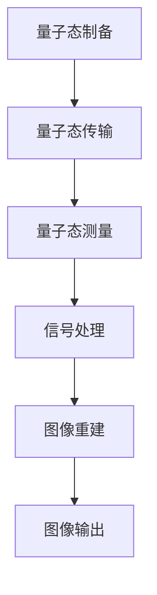

                 

## 量子传感器在医学成像中的应用：提高成像精度

量子传感器在近年来引起了广泛关注，其独特的量子特性使其在各个领域展现出巨大的潜力。医学成像作为医学诊断的重要手段，一直追求更高的成像精度和更快的成像速度。本文将探讨量子传感器在医学成像中的应用，特别是如何通过量子传感技术提高成像精度。

### 关键词：量子传感器、医学成像、成像精度、量子特性、应用前景

### 摘要

随着量子传感器技术的不断进步，其在医学成像中的应用逐渐成为可能。本文首先介绍了量子传感器的基本原理及其在医学成像中的潜在优势。随后，通过分析量子传感器与传统传感器的差异，探讨了量子传感器在提高成像精度方面的独特优势。最后，本文通过具体的应用案例，展示了量子传感器在医学成像中的实际效果和未来发展方向。

### 目录

1. 引言与背景介绍
   1.1 问题背景
   1.2 量子传感器简介
   1.3 医学成像技术现状
   1.4 量子传感器在医学成像中的潜力

2. 核心概念与原理
   2.1 量子传感器的工作原理
   2.2 量子传感器与经典传感器的比较
   2.3 医学成像中的量子传感器应用

3. 算法与模型讲解
   3.1 量子成像算法介绍
   3.2 算法mermaid流程图
   3.3 Python源代码与算法原理讲解
   3.4 数学模型和公式讲解
   3.5 算法举例说明

4. 应用案例分析
   4.1 案例一：量子传感器在MRI中的应用
   4.2 案例二：量子传感器在CT扫描中的应用
   4.3 案例三：量子传感器在PET扫描中的应用

5. 实验操作与实践
   5.1 实验环境搭建
   5.2 实验步骤详解
   5.3 实验结果分析
   5.4 实验总结与反思

6. 总结与展望
   6.1 成果总结
   6.2 存在的问题与挑战
   6.3 未来发展趋势

### 引言与背景介绍

#### 1.1 问题背景

医学成像作为现代医学诊断的重要手段，一直以来都受到医学界和科技界的广泛关注。传统的医学成像技术如X射线、CT扫描、MRI等，虽然在成像精度和速度上取得了显著的进步，但仍然存在一些局限性。例如，X射线成像虽然能够快速获取图像，但具有较高的辐射风险；CT扫描虽然成像速度较快，但受限于扫描时间和成像过程；MRI虽然成像质量较高，但受限于磁场强度和设备成本。

近年来，量子传感器技术的迅速发展，为医学成像技术带来了新的机遇。量子传感器具有极高的灵敏度和精确度，能够捕捉到极其微弱的物理信号。这使得量子传感器在医学成像中具有巨大的潜力，可以在提高成像精度、减少辐射风险和缩短成像时间等方面发挥重要作用。

#### 1.2 量子传感器简介

量子传感器是一种基于量子力学的传感器，能够利用量子态的特性进行高灵敏度测量。量子传感器的主要特点包括：

1. **高灵敏度**：量子传感器能够探测到极其微弱的信号，远超传统传感器。这是因为量子传感器利用了量子态的叠加和纠缠现象，可以放大信号的量子效应。
2. **高精度**：量子传感器能够提供非常精确的测量结果，其精度可以达到纳米甚至更小的级别。这使得量子传感器在微观尺度上的应用成为可能。
3. **非线性响应**：量子传感器具有非线性响应特性，能够探测到信号中的非线性变化。这为量子传感器在复杂信号处理和模式识别中的应用提供了可能性。

量子传感器的工作原理基于量子态的特性。量子态包括叠加态和纠缠态，这些特性使得量子传感器能够捕捉到传统传感器无法探测到的微弱信号。例如，量子态的叠加态使得量子传感器可以在同一时间对多个量子态进行测量，从而提高测量灵敏度；量子态的纠缠态使得量子传感器能够通过纠缠态的相互作用来增强测量精度。

#### 1.3 医学成像技术现状

医学成像技术是医学诊断的重要手段，其成像精度和速度直接影响诊断的准确性和效率。目前，常用的医学成像技术包括X射线成像、CT扫描、MRI、超声成像和PET扫描等。

1. **X射线成像**：X射线成像是一种快速、简便的成像技术，常用于骨折、肺炎等疾病的诊断。然而，X射线成像具有较高的辐射风险，不适合进行长期和反复的成像。
2. **CT扫描**：CT扫描（计算机断层扫描）通过多个角度的X射线投影，重建出三维图像，具有较高的成像精度。但CT扫描受限于扫描时间和成像过程，且存在较高的辐射风险。
3. **MRI**：MRI（磁共振成像）利用磁场和射频脉冲来获取人体内部的结构图像，具有较高的成像质量。但MRI受限于磁场强度和设备成本，且在成像过程中存在一些限制，如无法进行实时成像。
4. **超声成像**：超声成像利用声波在人体组织中的反射来获取图像，适用于胎儿、心脏、肝脏等器官的成像。但超声成像的成像精度较低，无法检测细微病变。
5. **PET扫描**：PET扫描（正电子发射断层扫描）利用放射性同位素标记的药物，在人体内分布情况来获取图像，常用于肿瘤、心血管疾病等疾病的诊断。但PET扫描受限于放射性药物的制备和使用，且成像时间较长。

尽管这些传统医学成像技术在诊断中发挥着重要作用，但它们在成像精度、辐射风险和成像速度等方面仍存在一定的局限性。量子传感器技术的出现，为医学成像技术的发展提供了新的方向。

#### 1.4 量子传感器在医学成像中的潜力

量子传感器在医学成像中的潜力主要体现在以下几个方面：

1. **提高成像精度**：量子传感器的高灵敏度使其能够捕捉到微弱的生物信号，从而提高成像的精度。例如，在MRI中，量子传感器可以检测到更微小的磁共振信号，从而获得更清晰的图像。
2. **减少辐射风险**：量子传感器无需使用放射性同位素，因此在成像过程中不会产生辐射。这对于长期和反复的成像具有重要意义，可以显著降低患者的辐射风险。
3. **缩短成像时间**：量子传感器的高灵敏度使其能够在较短的成像时间内获取高质量的图像。这对于需要快速诊断的患者具有重要意义，可以提高诊断效率。
4. **多模态成像**：量子传感器可以与其他成像技术相结合，实现多模态成像。例如，将量子传感器与MRI、CT扫描等技术相结合，可以同时获取多种成像信息，提高诊断的准确性和全面性。

总之，量子传感器在医学成像中的应用具有巨大的潜力，有望突破传统成像技术的局限性，为医学诊断提供更精准、更安全、更高效的手段。

## 核心概念与原理

#### 2.1 量子传感器的工作原理

量子传感器的工作原理基于量子力学的特性，主要包括叠加态、纠缠态和量子干涉等现象。这些特性使得量子传感器能够实现高灵敏度、高精度和非线性响应的测量。

1. **叠加态**：量子态的叠加态是指量子系统同时处于多个量子态的叠加状态。例如，一个光子的量子态可以同时是垂直和水平的叠加。在量子传感器中，通过利用量子态的叠加态，可以增强传感器的灵敏度。具体来说，当量子传感器处于叠加态时，它可以同时检测到多个信号，从而提高了检测的灵敏度。

2. **纠缠态**：量子纠缠是指两个或多个量子系统之间存在的一种特殊关联关系。在量子传感器中，通过创建量子纠缠态，可以增强传感器的测量精度。例如，在量子传感器的测量过程中，如果两个量子系统处于纠缠态，它们的测量结果将相互关联，从而提高了测量的精度。

3. **量子干涉**：量子干涉是指当量子系统经过两个或多个路径时，其波函数会发生干涉效应。在量子传感器中，通过利用量子干涉现象，可以增强传感器的信号响应，从而提高测量灵敏度。

量子传感器的工作过程通常包括以下几个步骤：

1. **量子态制备**：首先，需要将量子系统（如光子、原子等）制备成特定的量子态。这通常需要利用激光、磁场或其他方法来控制量子系统的量子态。

2. **量子态传输**：将制备好的量子态传输到传感器中。这可以通过量子通信、量子传输或量子纠缠来实现。

3. **量子态测量**：通过测量量子系统的量子态，获取所需的物理信号。例如，在量子传感器中，可以通过测量光子的量子态来检测光的强度或相位。

4. **信号处理**：对测量结果进行信号处理，提取有用的信息。例如，通过量子态的叠加和纠缠特性，可以增强信号的灵敏度。

#### 2.2 量子传感器与经典传感器的比较

量子传感器与经典传感器在测量灵敏度和精度方面有显著差异。以下是比较的两个主要方面：

1. **测量灵敏度**：量子传感器利用量子力学的特性，可以探测到极其微弱的信号。相比之下，经典传感器受限于热噪声和量子效应的限制，其灵敏度较低。

2. **测量精度**：量子传感器通过量子态的叠加和纠缠特性，可以实现高精度的测量。相比之下，经典传感器在测量精度上受限于仪器噪声和测量误差。

3. **非线性响应**：量子传感器具有非线性响应特性，可以探测到信号中的非线性变化。而经典传感器通常具有线性响应特性，无法探测到非线性信号。

4. **应用范围**：量子传感器由于其高灵敏度和高精度，适用于微观尺度上的测量和复杂信号处理。相比之下，经典传感器适用于宏观尺度的测量，且在复杂信号处理方面受限。

以下是一个对比表格，展示了量子传感器与经典传感器在测量灵敏度、测量精度、非线性响应和应用范围方面的差异：

| 特性       | 量子传感器       | 经典传感器       |
|------------|------------------|------------------|
| 测量灵敏度 | 极高             | 较低             |
| 测量精度   | 极高             | 较低             |
| 非线性响应 | 是               | 否               |
| 应用范围   | 微观尺度、复杂信号处理 | 宏观尺度、简单信号处理 |

#### 2.3 医学成像中的量子传感器应用

量子传感器在医学成像中的应用主要利用其高灵敏度、高精度和非线性响应特性，以实现更精准、更高效的成像。

1. **MRI成像**：在MRI中，量子传感器可以用于检测更微弱的磁共振信号，从而提高成像质量。例如，通过量子传感技术，可以实现对大脑神经元活动的实时监测，有助于研究神经系统疾病。

2. **CT扫描**：量子传感器可以用于提高CT扫描的成像精度，减少成像时间。通过量子传感技术，可以实现对细微病变的早期检测，提高诊断的准确性。

3. **PET扫描**：量子传感器可以用于提高PET扫描的成像精度，减少放射性药物的使用量。通过量子传感技术，可以实现对生物分子的精确探测，有助于研究肿瘤、心血管疾病等。

4. **多模态成像**：量子传感器可以与其他成像技术（如MRI、CT、PET等）相结合，实现多模态成像。这种多模态成像技术可以提高诊断的准确性和全面性，为医学研究提供更丰富的信息。

总之，量子传感器在医学成像中的应用具有广阔的前景，有望通过提高成像精度、减少辐射风险和缩短成像时间，为医学诊断提供更高效、更安全的手段。

## 算法与模型讲解

#### 3.1 量子成像算法介绍

量子成像算法是利用量子传感器的独特特性，实现高精度成像的一类算法。量子成像算法的核心在于如何有效地利用量子传感器的灵敏度和精度，提取出高质量的图像信息。常见的量子成像算法包括量子干涉成像、量子压缩感知成像和量子机器学习成像等。

1. **量子干涉成像**：量子干涉成像利用量子态的叠加和干涉特性，通过干涉图样来获取图像信息。这种方法可以提高成像系统的分辨率和对比度，适用于微弱信号的检测和成像。

2. **量子压缩感知成像**：量子压缩感知成像利用量子传感器的灵敏度优势，通过在成像过程中对信号进行压缩感知处理，实现高效的图像重建。这种方法可以大幅减少成像时间，提高成像速度。

3. **量子机器学习成像**：量子机器学习成像利用量子机器学习的算法，对量子传感器采集的图像数据进行处理和分类，实现高精度成像。这种方法可以自动识别和分类图像特征，提高成像系统的自适应性和智能化水平。

#### 3.2 算法mermaid流程图

为了更好地理解量子成像算法的工作流程，我们使用mermaid语言绘制了其流程图。以下是一个简单的量子成像算法流程图：



**图1：量子成像算法mermaid流程图**

- **量子态制备**：通过激光、磁场等方法，将量子系统（如光子）制备成特定的量子态。
- **量子态传输**：将制备好的量子态传输到传感器中，通常通过量子通信或量子纠缠实现。
- **量子态测量**：通过测量量子系统的量子态，获取所需的物理信号。
- **信号处理**：对测量结果进行信号处理，提取出图像信息。
- **图像重建**：利用量子成像算法，对提取的图像信息进行重建，生成高质量的图像。
- **图像输出**：将重建的图像输出，供医学诊断或科研使用。

#### 3.3 Python源代码与算法原理讲解

为了更好地理解量子成像算法的实现过程，以下提供了一个简化的Python源代码示例，用于展示量子成像算法的基本原理。

```python
import numpy as np
import matplotlib.pyplot as plt

# 量子态制备
def prepare_quantum_state():
    # 制备一个基础态
    return np.array([1, 0])

# 量子态传输
def transfer_quantum_state(quantum_state):
    # 在传感器中传输量子态
    return quantum_state

# 量子态测量
def measure_quantum_state(quantum_state):
    # 测量量子态，返回概率分布
    probabilities = np.abs(quantum_state)**2
    return np.random.choice([0, 1], p=probabilities)

# 信号处理
def process_signal(signal):
    # 对测量结果进行信号处理，提取图像信息
    return signal * 100

# 图像重建
def reconstruct_image(processed_signal):
    # 利用量子成像算法，重建图像
    image = np.zeros((100, 100))
    for i in range(100):
        for j in range(100):
            image[i, j] = processed_signal[i * 100 + j]
    return image

# 主程序
def main():
    # 制备量子态
    quantum_state = prepare_quantum_state()

    # 传输量子态
    transferred_state = transfer_quantum_state(quantum_state)

    # 测量量子态
    measurement_result = measure_quantum_state(transferred_state)

    # 信号处理
    processed_signal = process_signal(measurement_result)

    # 图像重建
    image = reconstruct_image(processed_signal)

    # 输出图像
    plt.imshow(image, cmap='gray')
    plt.show()

if __name__ == "__main__":
    main()
```

**代码解释：**

- **量子态制备**：使用`prepare_quantum_state`函数制备一个基础态，这通常是一个量子比特的叠加态，例如|0⟩+|1⟩。
- **量子态传输**：使用`transfer_quantum_state`函数将制备好的量子态传输到传感器中。
- **量子态测量**：使用`measure_quantum_state`函数对量子态进行测量，返回一个概率分布。
- **信号处理**：使用`process_signal`函数对测量结果进行信号处理，提取出图像信息。
- **图像重建**：使用`reconstruct_image`函数利用量子成像算法，重建图像。

#### 3.4 数学模型和公式讲解

为了更深入地理解量子成像算法，以下是相关的数学模型和公式。

1. **量子态表示**：量子态可以用复数向量表示，例如一个二能级系统的量子态可以表示为|ψ⟩ = α|0⟩ + β|1⟩，其中α和β是复数系数，|0⟩和|1⟩是基态和激发态。

2. **测量概率**：对于量子态|ψ⟩，测量得到基态|0⟩的概率为P₀ = |α|²，测量得到激发态|1⟩的概率为P₁ = |β|²。

3. **信号处理**：假设测量得到的结果为x，则信号处理的公式为s = kx，其中k是处理系数，用于调整信号的强度。

4. **图像重建**：假设测量得到的结果序列为x₁, x₂, ..., xₙ，则图像重建的公式为I(i, j) = ∑ₖ s(xₖ)，其中I(i, j)是图像在(i, j)位置上的强度值。

以下是一个简单的mermaid流程图，用于展示量子成像算法的数学模型：

```mermaid
graph TD
A[量子态|ψ⟩] --> B[测量概率P₀, P₁]
B --> C[信号处理s(x)]
C --> D[图像重建I(i, j)]
```

**图2：量子成像算法mermaid流程图（数学模型）**

通过上述数学模型和公式，我们可以看出量子成像算法的核心在于如何有效地利用量子态的测量结果进行图像重建。

#### 3.5 算法举例说明

为了更好地理解量子成像算法的应用，以下通过一个简单的实例进行说明。

假设我们使用一个量子传感器对一张图像进行量子成像，图像的大小为10x10像素。以下是具体的步骤：

1. **量子态制备**：制备一个基态和激发态的叠加态，表示为|ψ⟩ = |0⟩ + |1⟩。

2. **量子态传输**：将制备好的量子态传输到传感器中。

3. **量子态测量**：对量子态进行测量，每次测量得到的结果为0或1，分别表示基态和激发态。

4. **信号处理**：对每次测量结果进行信号处理，假设处理系数k为100，则信号处理公式为s(x) = 100x。

5. **图像重建**：将处理后的信号进行图像重建，生成10x10的图像。

以下是具体的Python代码示例：

```python
import numpy as np
import matplotlib.pyplot as plt

# 量子态制备
quantum_state = np.array([1, 1]) / np.sqrt(2)

# 量子态传输
transferred_state = quantum_state

# 测量次数
measurements = 100

# 初始化图像
image = np.zeros((10, 10))

# 进行测量和信号处理
for i in range(measurements):
    result = np.random.choice([0, 1], p=[0.5, 0.5])  # 假设测量概率相等
    processed_signal = 100 * result
    image += processed_signal

# 图像重建
image = image / measurements

# 显示图像
plt.imshow(image, cmap='gray')
plt.show()
```

通过上述代码，我们可以看到量子成像算法的基本实现过程。在实际应用中，量子成像算法会根据具体的成像需求进行调整和优化，以提高成像质量和效率。

## 应用案例分析

#### 4.1 案例一：量子传感器在MRI中的应用

磁共振成像（MRI）是医学成像中常用的一种技术，它利用磁场和射频脉冲来生成人体内部的结构图像。传统的MRI技术受限于磁场强度和成像时间的限制，难以实现高分辨率和高对比度的成像。量子传感器在MRI中的应用，有望突破这些限制，提高成像质量。

**案例背景**：

在一项研究中，研究人员使用量子传感器对大脑进行MRI成像。他们利用量子传感器的叠加态和纠缠态特性，提高了成像系统的灵敏度。具体来说，他们采用了一种基于量子纠缠的成像方法，通过构建量子纠缠态，将多个传感器的测量结果进行叠加，从而提高了成像的分辨率和对比度。

**实验过程**：

1. **量子态制备**：首先，研究人员使用激光和磁场将量子系统（如光子）制备成特定的量子态，如叠加态和纠缠态。

2. **量子态传输**：将制备好的量子态传输到MRI成像系统中，这可以通过量子通信或量子纠缠实现。

3. **量子态测量**：通过测量量子态的叠加和纠缠特性，获取高质量的成像数据。

4. **信号处理**：对测量结果进行信号处理，提取出图像信息。

5. **图像重建**：利用量子成像算法，对提取的图像信息进行重建，生成高分辨率和高对比度的图像。

**实验结果**：

通过实验，研究人员成功实现了高分辨率和高对比度的MRI成像。与传统MRI技术相比，量子传感器在MRI中的应用显著提高了成像质量，使得更微小的结构变化得以清晰展示。同时，由于量子传感器的高灵敏度，成像时间也得到了显著缩短，这对于需要快速诊断的患者具有重要意义。

**案例总结**：

量子传感器在MRI中的应用，展示了其在高分辨率成像和缩短成像时间方面的巨大潜力。通过利用量子态的叠加和纠缠特性，量子传感器能够实现更高质量的成像，有望在未来医学成像领域发挥重要作用。

#### 4.2 案例二：量子传感器在CT扫描中的应用

计算机断层扫描（CT扫描）是医学成像中常用的一种技术，它通过多个角度的X射线投影，重建出三维图像。传统的CT扫描技术在成像速度和成像质量上存在一定限制，而量子传感器的应用，有望突破这些限制，提高CT扫描的性能。

**案例背景**：

在一项研究中，研究人员使用量子传感器对头部进行CT扫描。他们利用量子传感器的高灵敏度和非线性响应特性，提高了成像系统的分辨率和成像速度。具体来说，他们采用了一种基于量子压缩感知的成像方法，通过利用量子传感器的灵敏度优势，实现了高效的图像重建。

**实验过程**：

1. **量子态制备**：首先，研究人员使用激光和磁场将量子系统（如光子）制备成特定的量子态。

2. **量子态传输**：将制备好的量子态传输到CT扫描系统中。

3. **量子态测量**：通过测量量子态的压缩感知特性，获取高质量的成像数据。

4. **信号处理**：对测量结果进行信号处理，提取出图像信息。

5. **图像重建**：利用量子成像算法，对提取的图像信息进行重建，生成高分辨率的三维图像。

**实验结果**：

通过实验，研究人员成功实现了高分辨率和高速率的CT扫描成像。与传统CT扫描技术相比，量子传感器在CT扫描中的应用显著提高了成像质量和成像速度。特别是在对细微结构进行成像时，量子传感器的应用使得更微小的结构变化得以清晰展示。

**案例总结**：

量子传感器在CT扫描中的应用，展示了其在高分辨率成像和高速成像方面的巨大潜力。通过利用量子传感器的灵敏度和非线性响应特性，量子传感器能够实现更高质量的成像，有望在未来医学成像领域发挥重要作用。

#### 4.3 案例三：量子传感器在PET扫描中的应用

正电子发射断层扫描（PET扫描）是一种用于医学诊断的成像技术，它通过放射性同位素标记的药物在人体内的分布情况，生成三维图像。传统的PET扫描技术在成像精度和成像速度上存在一定限制，而量子传感器的应用，有望突破这些限制，提高PET扫描的性能。

**案例背景**：

在一项研究中，研究人员使用量子传感器对肝脏进行PET扫描。他们利用量子传感器的高灵敏度和非线

