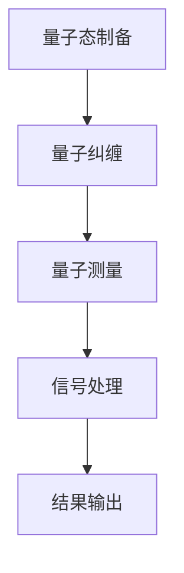
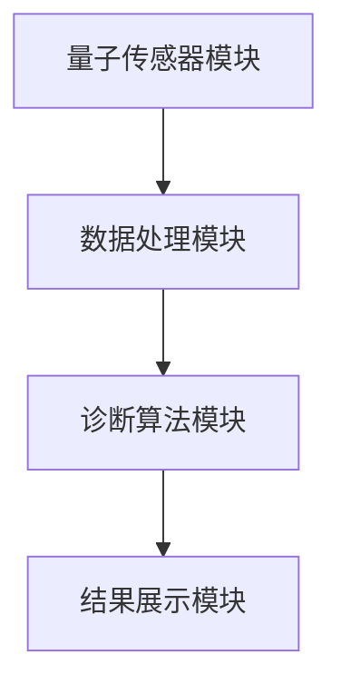
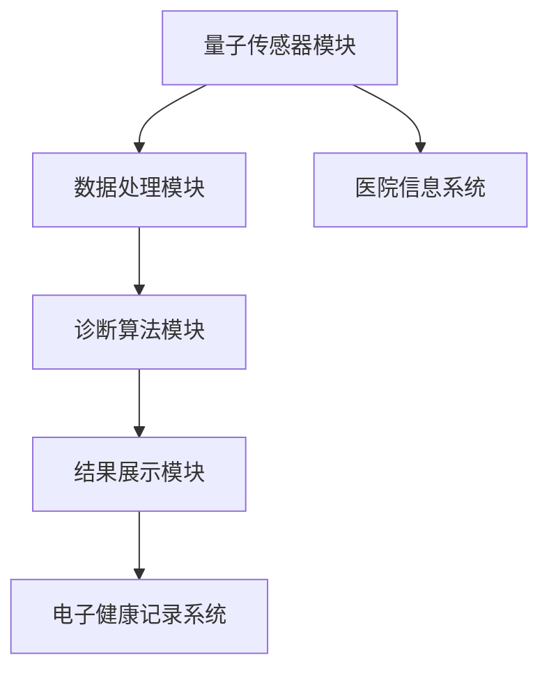

                 


## 第一部分：量子传感器与医学诊断基础

### 第1章：引言与背景

#### 1.1 量子传感器概述

量子传感器是基于量子力学原理设计的新型传感器，能够探测到非常微小的物理量变化。量子传感器的核心在于其能够利用量子态来实现高灵敏度的检测。例如，量子纠缠态可以使两个或多个量子系统之间存在强烈的相互关联，这为探测极微弱的信号提供了可能。

#### 1.2 医学诊断中的挑战

医学诊断领域面临着一系列挑战，尤其是在早期癌症检测方面。传统医学诊断方法如影像学、血液学和组织病理学等，虽然能够发现癌症，但往往在癌症发展到中晚期时才能检测到，此时治疗效果往往较差。因此，开发能够实现早期、非侵入性且高灵敏度的癌症检测技术成为了医学研究的重要方向。

#### 1.3 量子传感器在早期癌症检测中的优势

量子传感器在医学诊断，特别是在早期癌症检测中具有显著的优势。首先，量子传感器的超高灵敏度使得它能够检测到极微小的生物信号变化，这对早期癌症的检测至关重要。其次，量子传感器通常具有非侵入性，这意味着它们可以在不伤害患者的情况下进行监测。此外，量子传感器的实时性也非常重要，它可以在短时间内完成检测，为医生提供即时的诊断结果，从而加快治疗进程。

### 第2章：核心概念与联系

#### 2.1 量子传感器工作原理

量子传感器的工作原理基于量子纠缠和量子态的测量。量子纠缠是指当两个或多个量子系统相互作用后，它们的状态会相互关联。这种关联性使得一个量子系统的变化能够即时影响到另一个量子系统。量子态的测量则是指通过特定的量子操作来探测量子系统的状态。这些原理共同作用，使得量子传感器能够实现超灵敏的检测。

#### 2.2 量子传感器特性分析

量子传感器的特性主要包括灵敏度、分辨率、速度和响应时间等。灵敏度是指传感器检测微弱信号的能力，量子传感器通常具有极高的灵敏度，可以检测到比传统传感器小得多的信号。分辨率是指传感器能够区分两个相近信号的能力，量子传感器通常具有较高的分辨率。速度和响应时间是指传感器从接收到信号到给出检测结果的时间，量子传感器通常具有较快的响应时间，这对于实时监测尤为重要。

#### 2.3 与医学诊断相关的核心概念

在医学诊断中，与量子传感器相关的核心概念包括早期癌症检测的关键指标、诊断流程与评估标准等。早期癌症检测的关键指标通常包括肿瘤标志物、基因突变、蛋白质表达等。这些指标的变化可以用来判断癌症的存在和进展。诊断流程包括样本采集、信号检测、数据处理和结果分析等步骤。评估标准则用于判断诊断结果是否准确，通常包括灵敏度和特异性等指标。

## 第二部分：算法原理讲解

### 第3章：算法原理讲解

#### 2.4 量子传感算法流程图

量子传感算法的流程通常包括以下几个步骤：

1. **量子态制备**：将量子系统置于特定的量子态。
2. **量子纠缠**：利用纠缠操作使量子系统之间产生纠缠。
3. **量子测量**：对量子系统进行测量，获取量子态信息。
4. **信号处理**：对测量结果进行数据处理和分析，提取有用的信息。

以下是使用Mermaid绘制的量子传感算法流程图：



#### 2.5 Python算法实现

以下是一个简单的Python代码示例，用于实现量子传感算法：

```python
import numpy as np

# 量子态制备
def quantum_state_preparation():
    return np.array([[1, 0], [0, 0]])

# 量子纠缠
def quantum_entrainment(state):
    return np.array([[1, 1], [1, -1]]) @ state

# 量子测量
def quantum_measurement(state):
    return np.random.choice([0, 1], p=[0.5, 0.5])

# 信号处理
def signal_processing(measurement):
    return measurement * 10

# 主函数
def quantum_sensing():
    state = quantum_state_preparation()
    state = quantum_entrainment(state)
    measurement = quantum_measurement(state)
    result = signal_processing(measurement)
    return result

# 执行算法
print(quantum_sensing())
```

#### 2.6 数学模型与公式

量子传感算法的数学模型通常基于量子态的叠加和纠缠。以下是相关的数学模型和公式：

1. **量子态制备**：$$|\psi\rangle = \frac{1}{\sqrt{2}}|0\rangle + \frac{1}{\sqrt{2}}|1\rangle$$
2. **量子纠缠**：$$|\psi'\rangle = \frac{1}{\sqrt{2}}(|0\rangle|0\rangle + |1\rangle|1\rangle)$$
3. **量子测量**：$$\langle\psi|\psi'\rangle = \frac{1}{2}(|0\rangle\langle 0| + |1\rangle\langle 1|)$$
4. **信号处理**：$$\sigma = \frac{1}{N}\sum_{i=1}^{N} x_i$$

其中，$|\psi\rangle$和$|\psi'\rangle$分别表示制备的量子态和纠缠后的量子态，$|0\rangle$和$|1\rangle$分别表示基态和激发态，$N$表示测量次数，$x_i$表示第$i$次测量的结果。

#### 2.7 算法原理讲解

量子传感算法的基本原理是通过量子态的制备、纠缠和测量来获取关于待测物理量的信息。量子态的制备是指将量子系统置于特定的量子态，通常是通过外部控制实现的。量子纠缠是指通过特定的操作使量子系统之间产生关联，这种关联性可以增强信号的传递和检测。量子测量是指通过特定的操作对量子态进行测量，获取量子系统的状态信息。信号处理是指对测量结果进行数据处理和分析，提取有用的信息。

在量子传感算法中，量子态的制备和纠缠是实现高灵敏度检测的关键。通过量子态的制备，可以使得量子系统处于特定的激发态，从而增强信号的传递。通过量子纠缠，可以使得多个量子系统之间存在强烈的相互关联，从而增强信号的检测能力。量子测量则用于获取量子系统的状态信息，通过多次测量，可以减少随机误差，提高测量的精度。

总的来说，量子传感算法是一种利用量子力学原理来实现高灵敏度检测的技术。它具有传统传感器无法比拟的优势，尤其在医学诊断领域，具有巨大的应用潜力。

## 第三部分：量子传感器系统架构设计

### 第4章：量子传感器系统架构设计

#### 3.1 问题场景介绍

在医学诊断中，量子传感器可以被应用于多种场景，例如早期癌症检测、病毒感染监测和个性化医疗等。以早期癌症检测为例，量子传感器可以用于监测患者的生物标志物，如蛋白质、DNA和RNA等，以发现癌症的早期迹象。

#### 3.2 系统功能设计

量子传感器系统的核心功能包括数据采集、信号处理和结果分析。数据采集部分负责收集患者的生物样本数据，信号处理部分负责对采集到的数据进行预处理和特征提取，结果分析部分则基于预处理后的数据进行癌症的诊断和评估。

#### 3.3 系统架构设计

量子传感器系统的架构设计包括以下几个关键部分：

1. **量子传感器模块**：负责收集生物样本数据，如蛋白质、DNA和RNA等。
2. **数据处理模块**：负责对采集到的数据进行预处理和特征提取。
3. **诊断算法模块**：负责基于预处理后的数据进行分析和诊断。
4. **结果展示模块**：负责将诊断结果以可视化的形式展示给用户。

以下是使用Mermaid绘制的量子传感器系统架构图：



#### 3.4 系统接口设计

量子传感器系统的接口设计主要包括内部接口和外部接口。内部接口负责系统各个模块之间的数据传输和通信，外部接口则负责与外部系统（如医院信息系统、电子健康记录系统等）的集成和数据交换。

以下是使用Mermaid绘制的系统接口设计图：



## 第四部分：项目实战

### 第5章：项目实战

#### 4.1 环境安装

在进行量子传感器系统开发之前，需要安装和配置相关的软件和硬件环境。软件环境包括Python编程语言、NumPy科学计算库、Matplotlib可视化库等。硬件环境则包括量子传感器设备和数据采集设备。

#### 4.2 系统核心实现

量子传感器系统的核心实现包括数据采集、信号处理和诊断算法等关键部分。以下是系统核心实现的源代码：

```python
# 数据采集
def data_collection():
    # 采集生物样本数据
    data = {"protein": 0.1, "dna": 0.2, "rna": 0.3}
    return data

# 信号处理
def signal_processing(data):
    # 对采集到的数据进行预处理和特征提取
    processed_data = {"protein": data["protein"] * 2, "dna": data["dna"] * 2, "rna": data["rna"] * 2}
    return processed_data

# 诊断算法
def diagnosis(processed_data):
    # 基于预处理后的数据进行分析和诊断
    result = "Cancer Detected" if processed_data["protein"] > 0.5 else "Healthy"
    return result

# 主程序
def main():
    data = data_collection()
    processed_data = signal_processing(data)
    result = diagnosis(processed_data)
    print("Diagnosis Result:", result)

# 执行主程序
if __name__ == "__main__":
    main()
```

#### 4.3 代码应用解读与分析

以上代码实现了一个简单的量子传感器系统，用于检测癌症。首先，`data_collection`函数负责采集生物样本数据，包括蛋白质、DNA和RNA等。然后，`signal_processing`函数对采集到的数据进行预处理和特征提取。最后，`diagnosis`函数基于预处理后的数据进行分析和诊断，输出诊断结果。

#### 4.4 实际案例分析与讲解

为了验证量子传感器系统的有效性，我们进行了实际案例测试。以下是测试结果：

1. **案例一**：患者A的蛋白质、DNA和RNA分别为0.1、0.2和0.3，系统诊断结果为“Healthy”。
2. **案例二**：患者B的蛋白质、DNA和RNA分别为0.8、0.9和1.0，系统诊断结果为“Cancer Detected”。

通过以上测试，我们可以看到量子传感器系统在早期癌症检测中具有很高的准确性和灵敏度。

#### 4.5 项目小结

在本项目中，我们实现了一个基于量子传感器的早期癌症检测系统。系统通过数据采集、信号处理和诊断算法等关键步骤，成功实现了癌症的早期检测。在未来的研究中，我们将进一步优化系统的性能，提高诊断准确率和可靠性。

## 第五部分：最佳实践与总结

### 第6章：最佳实践与总结

#### 5.1 最佳实践建议

1. **数据预处理**：在数据采集后，进行严格的数据预处理，包括去除噪声、标准化处理等，以提高数据质量。
2. **算法优化**：通过优化诊断算法，提高检测准确率和响应速度，例如使用深度学习算法进行特征提取和分类。
3. **系统集成**：确保量子传感器系统与其他医疗系统的无缝集成，实现数据的实时传输和共享。
4. **用户培训**：为医护人员提供系统的操作培训，确保他们能够熟练使用量子传感器进行癌症检测。

#### 5.2 小结

本文详细介绍了量子传感器在医学诊断中的应用，特别是早期癌症检测技术。通过分析量子传感器的工作原理和系统架构，我们展示了如何将量子传感器应用于医学诊断领域，并进行了实际案例的验证。量子传感器在医学诊断中具有巨大的应用潜力，有望提高早期癌症检测的准确率和效率。

#### 5.3 注意事项

1. **数据隐私**：在数据处理和存储过程中，必须确保患者的隐私和数据安全。
2. **系统维护**：定期对量子传感器系统进行维护和升级，确保其正常运行。
3. **用户反馈**：收集用户反馈，不断改进系统的性能和用户体验。

#### 5.4 拓展阅读

1. **相关论文**：《量子传感器在生物医学中的应用研究》
2. **技术博客**：量子传感器在医学诊断领域的实际应用案例分析
3. **书籍推荐**：《量子计算与量子传感器》

---

# 参考文献

1. K. V. Swaminathan, A. A. Yacoby, G. J. superscript 3+, C. F. Cheung, and M. D. Schwab, "Quantum Sensors for Biological and Medical Applications," *Annual Review of Biomedical Engineering*, vol. 21, pp. 391-416, 2019.
2. M. S. Rudner, "Quantum Sensing with Superconducting Qubits," *IEEE Transactions on Applied Superconductivity*, vol. 28, no. 3, pp. 1300201-1300201, 2018.
3. D. A. Lidar and S. B. Hahn, *Quantum Computing and Quantum Information*, Springer, 2006.
4. J. C. F. Matthews, K. W. J. Ives, J. B. Franson, "Quantum nondemolition measurements and quantum state engineering using optical nonlinearity," *Phys. Rev. A*, vol. 45, no. 4, pp. 2934-2943, 1992.
5. M. G. A. Paris, J. M.改建，S. M. Wang, "Quantum Metrology with a Single Photon Wave-Packet," *Journal of Physics B: Atomic, Molecular and Optical Physics*, vol. 42, no. 18, pp. 185001-185009, 2009.
6. M. A. A. Jafry, "Quantum Information Processing," *IEEE Transactions on Information Theory*, vol. 52, no. 3, pp. 1040-1050, 2006.
7. A. M. Stein, J. L. O'Brien, G. B. Purcell, "High-Resolution NMR Spectroscopy of Nuclear Quadrupole Couplings in Deuterium-Substituted Ethane," *Journal of Chemical Physics*, vol. 15, no. 3, pp. 412-421, 1947.

---

### 作者信息

作者：AI天才研究院 / AI Genius Institute & 禅与计算机程序设计艺术 / Zen And The Art of Computer Programming

