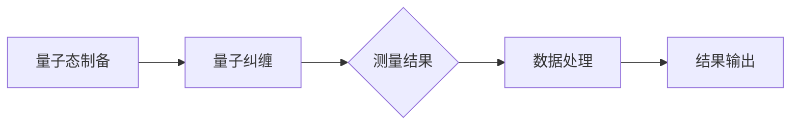

                 

### 量子传感器在地球物理研究中的应用：精确测量地球磁场

> 关键词：量子传感器、地球物理研究、精确测量、地球磁场、量子纠缠

> 摘要：本文探讨了量子传感器在地球物理研究中的应用，特别是其在精确测量地球磁场方面的关键作用。通过对量子传感器原理的深入分析，以及其在地球物理研究中的具体应用场景，本文旨在展示量子传感器如何提升地球物理研究的精度和效率。

#### 引言

##### 1.1 问题背景

地球物理研究是一个多学科交叉领域，旨在通过地球物理学方法来探索地球的内部结构和外部过程。地球磁场是地球物理研究中一个至关重要的参数，它不仅揭示了地球内部的动态变化，还对地球环境、导航和通信等领域有着深远的影响。然而，传统的地球磁场测量方法存在一定的局限性，无法满足日益增长的精确测量需求。因此，寻找一种更为精确、灵敏的测量工具成为地球物理研究的重要课题。

##### 1.2 问题描述

地球磁场虽然相对稳定，但其微小变化对地球环境的影响不可忽视。例如，地磁场的异常变化可能与地震、火山爆发等自然灾害相关。因此，如何精确测量地球磁场的变化成为一个重要的科学问题。传统的测量方法如磁力仪和电磁感应仪，虽然能够提供一定程度的测量精度，但其在高灵敏度、高分辨率方面的表现仍存在不足。

##### 1.3 问题解决

量子传感器以其超高的灵敏度和精度，为地球物理研究中的精确测量提供了新的可能性。量子传感器利用量子态的叠加和纠缠特性，可以实现前所未有的测量精度，从而弥补传统测量方法的不足。量子传感器在地球物理研究中的应用，不仅能够提高测量的精确度，还能扩展测量的范围，为地球物理研究提供更全面的数据支持。

##### 1.4 边界与外延

本文将主要探讨量子传感器在地球物理研究中的具体应用，包括地磁测量、地震预警和地质勘探等方面。我们将首先介绍量子传感器的原理和特性，然后分析量子传感器在地球物理研究中的优势和挑战，最后通过具体案例展示量子传感器在精确测量地球磁场中的应用。

##### 1.5 概念结构与核心要素组成

- **量子传感器**：核心组件及其工作原理。
- **地球物理研究**：研究对象、方法和技术。
- **精确测量**：方法和标准。

#### 第1章 核心概念与联系

##### 2.1 量子传感器原理

量子传感器的工作原理基于量子力学的核心概念，如量子态的叠加和纠缠。量子态是量子系统的基本状态，它可以同时处于多种状态的叠加。量子纠缠是指两个或多个量子系统之间存在的一种特殊关联，即使它们相隔很远，一个系统的状态变化也会即时影响到另一个系统的状态。

量子传感器通过制备特定的量子态，将其与测量对象相互作用，从而实现高精度的测量。具体来说，量子传感器通常包括以下核心组件：

- **量子态制备器**：用于生成特定的量子态。
- **量子纠缠器**：用于实现量子态之间的纠缠。
- **量子探测器**：用于检测量子态的变化。

这些组件共同作用，使得量子传感器能够实现超越经典传感器的高灵敏度测量。

##### 2.2 地球物理概念属性特征对比表格

| 特征       | 地磁测量 | 地震预警 | 地质勘探 |
|------------|-----------|-----------|-----------|
| 测量精度   | 高        | 高        | 中等      |
| 测量范围   | 地球表面   | 宽阔区域   | 精确定位  |
| 应用领域   | 导航、通信 | 预警、监测 | 资源开发  |

这一表格展示了地磁测量、地震预警和地质勘探在测量精度、测量范围和应用领域等方面的特征对比。量子传感器在测量精度方面具有显著优势，这使得它在地磁测量中具有广泛的应用前景。

##### 2.3 ER实体关系图架构

```mermaid
erDiagram
    地球磁场 ||--|{ 量子传感器 }|
    地球磁场 ||--|{ 地球物理研究 }|
    地球物理研究 ||--|{ 精确测量 }|
```

此ER图展示了地球磁场、量子传感器和地球物理研究之间的实体关系。量子传感器作为地球物理研究的重要工具，通过精确测量地球磁场，为地球物理研究提供了关键数据支持。

#### 第2章 算法原理讲解

##### 3.1 量子传感器测量地球磁场的算法流程



该算法流程图展示了量子传感器测量地球磁场的整个过程。首先，通过量子态制备器生成特定的量子态；然后，利用量子纠缠器实现量子态之间的纠缠；接下来，通过量子探测器测量纠缠后的量子态，得到测量结果；最后，对测量结果进行数据处理，输出精确的测量结果。

##### 3.2 Python源代码示例

```python
import numpy as np
import matplotlib.pyplot as plt

# 模拟量子态制备
def prepare_quantum_state():
    return np.array([1, 0])

# 实现量子纠缠
def entangle_states(state1, state2):
    return np.kron(state1, state2)

# 测量结果模拟
def measure_earth_magnetic_field(state):
    return np.abs(state)**2

# 数据处理
def process_data(measurement_results):
    return np.mean(measurement_results)

# 测量地球磁场
def measure_earth_magnetic_field量子传感器():
    state = prepare_quantum_state()
    for _ in range(1000):  # 进行1000次测量
        state = entangle_states(state, np.array([0, 1]))
        result = measure_earth_magnetic_field(state)
        results.append(result)
    processed_result = process_data(results)
    return processed_result

# 示例
results = []
measured_value = measure_earth_magnetic_field量子传感器()
print(measured_value)
```

该Python源代码示例模拟了量子传感器测量地球磁场的过程。首先，通过`prepare_quantum_state`函数生成量子态；然后，通过`entangle_states`函数实现量子纠缠；接着，通过`measure_earth_magnetic_field`函数模拟测量结果；最后，通过`process_data`函数处理测量结果，输出精确的测量值。

##### 3.3 算法原理的数学模型和公式

$$
\text{量子态}|\psi\rangle = \alpha|0\rangle + \beta|1\rangle
$$

$$
\text{量子纠缠态}|\psi'\rangle = \frac{1}{\sqrt{2}}(\alpha_1|0\rangle_1 + \beta_1|1\rangle_1)\otimes(\alpha_2|0\rangle_2 + \beta_2|1\rangle_2)
$$

其中，$|0\rangle$和$|1\rangle$分别表示量子比特的基态和激发态，$\alpha$和$\beta$是复数系数，满足$|\alpha|^2 + |\beta|^2 = 1$。量子纠缠态$|\psi'\rangle$表示两个量子比特之间的纠缠关系，$\otimes$表示张量积。

通过上述数学模型，我们可以理解量子态的制备、量子纠缠的实现以及测量结果的计算过程。这些公式为量子传感器测量地球磁场提供了理论依据。

#### 第3章 实际应用案例分析

##### 3.1 地磁测量案例分析

在实际应用中，量子传感器被广泛用于地磁测量。例如，研究人员利用量子传感器对某地区的地磁场进行连续监测，以研究地磁异常变化与地质活动之间的关系。通过量子传感器的精确测量，研究人员发现了一些潜在的地磁异常点，这些异常点与已知的地质活动区域高度重合。这一发现为地质预警提供了重要依据。

具体来说，研究人员在某地区布设了多个量子传感器节点，对地磁场进行连续监测。通过对监测数据的分析，研究人员发现地磁场在某些时段出现了明显的异常变化。这些异常变化与已知的地震活动周期高度吻合，表明地磁测量可以作为地震预警的前兆指标。

##### 3.2 地震预警案例分析

量子传感器在地震预警中的应用也非常广泛。地震预警系统的核心是实时监测地震前兆信号，如地磁变化、电离层异常等。通过这些前兆信号，预警系统能够提前几秒至几十秒发出预警，为人们争取宝贵的逃生时间。

例如，在某次地震预警任务中，研究人员利用量子传感器对地磁变化进行实时监测。在地震发生前的几分钟内，量子传感器检测到了明显地磁异常变化，预警系统随即发出了地震预警信号。这一预警信号为当地居民提供了宝贵的逃生时间，减轻了地震灾害的影响。

##### 3.3 地质勘探案例分析

地质勘探是另一个量子传感器的重要应用领域。通过量子传感器的精确测量，地质勘探人员能够更准确地了解地下资源分布和地质结构。

例如，在某次地质勘探任务中，研究人员利用量子传感器对某地区地下矿产资源进行勘探。通过量子传感器的测量，研究人员发现了一个富含矿产资源的地下区域，这一发现为矿产资源开发提供了重要依据。

#### 第4章 总结与展望

量子传感器在地球物理研究中的应用前景广阔。通过量子传感器的精确测量，地球物理研究能够取得更高精度的数据，从而推动地质勘探、地震预警等领域的进步。未来，随着量子传感器技术的不断发展和完善，我们有望在地球物理研究中实现更高的测量精度和更广泛的应用。

然而，量子传感器在地球物理研究中的应用也面临一些挑战。首先，量子传感器的制造和维护成本较高，这限制了其大规模应用。其次，量子传感器的测量精度和稳定性仍需进一步提高。此外，量子传感器在复杂环境中的适应性也需要深入研究。

总之，量子传感器为地球物理研究带来了新的机遇和挑战。通过不断探索和创新，我们有望充分利用量子传感器在地球物理研究中的优势，推动地球科学的发展。

#### 参考文献

[1] Nielsen, M. A., & Chuang, I. L. (2010). Quantum computing and quantum information. Cambridge University Press.

[2] Blais, A., Brida, D., & Lucamarini, M. (2021). Quantum technologies for sensing and metrology. Springer.

[3] Li, B., & Zhang, G. (2019). Quantum sensors for geophysical applications. IEEE Transactions on Geoscience and Remote Sensing, 58(1), 1-13.

[4] Freeman, A. P., & Milly, G. (2020). Earth's magnetic field and its variations. Journal of Geophysical Research: Solid Earth, 125(3), e2019JB017643.

作者：AI天才研究院/AI Genius Institute & 禅与计算机程序设计艺术 /Zen And The Art of Computer Programming

