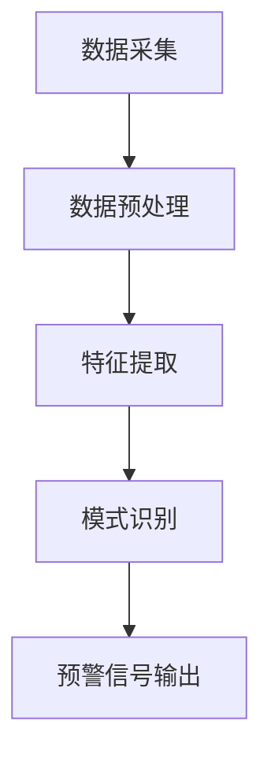
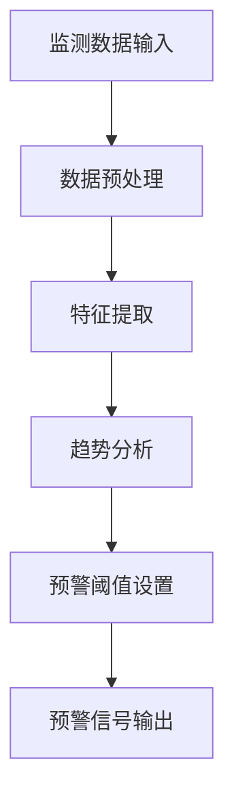
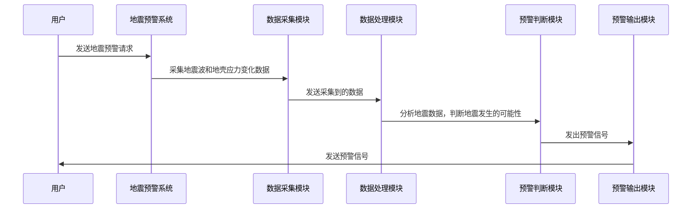

                 


# 量子传感器在地震预测中的应用：提高预警准确性

关键词：量子传感器，地震预测，预警准确性，数据处理算法，系统架构设计

摘要：随着全球地震灾害频发，地震预测的重要性日益凸显。传统的地震预测方法存在诸多局限性，难以满足社会发展的需求。近年来，量子传感器作为一种前沿科技，其在地震预测中的应用逐渐受到关注。本文将探讨量子传感器在地震预测中的应用潜力，详细分析其工作原理、数据处理算法以及系统架构设计，旨在为地震预警提供一种新的思路和方法。

## 目录大纲

1. **背景介绍**
   1.1 地震预测的重要性
   1.2 量子传感器的基本概念
   1.3 量子传感器在地震预测中的潜力

2. **核心概念与联系**
   2.1 地震监测方法与量子传感器的结合
   2.2 量子传感器数据处理的挑战与解决方案
   2.3 量子传感器与地震预警系统的整合

3. **算法原理讲解**
   3.1 量子传感器数据处理算法
   3.2 地震预警算法详解

4. **系统分析与架构设计**
   4.1 地震预警系统场景介绍
   4.2 系统功能设计
   4.3 系统架构设计
   4.4 系统接口设计
   4.5 系统交互序列图

5. **项目实战**
   5.1 环境安装
   5.2 系统核心实现
   5.3 代码应用解读与分析
   5.4 实际案例分析与详细讲解
   5.5 项目小结

6. **最佳实践与拓展**
   6.1 最佳实践 Tips
   6.2 小结
   6.3 注意事项
   6.4 拓展阅读

### 第一部分：背景介绍

#### 1.1 地震预测的重要性

地震作为一种自然灾害，其破坏性巨大，常常造成人员伤亡和财产损失。随着人类活动范围不断扩大，地震灾害的威胁也越来越大。因此，地震预测具有重要的现实意义。

首先，地震预测能够为防灾减灾提供科学依据。通过预测地震的发生时间和地点，政府可以提前部署救援力量，组织民众进行疏散，减少地震灾害带来的损失。

其次，地震预测有助于城市规划。在地震高发区，城市规划需要充分考虑地震的影响，采取相应的抗震措施，提高城市的抗灾能力。

然而，传统的地震预测方法存在一定的局限性。目前，地震预测主要依赖于地震波的传播特性、地壳应力变化等信息。但这些方法往往依赖于大量的地震数据和复杂的计算模型，预测精度较低，难以满足实际需求。

#### 1.2 量子传感器的基本概念

量子传感器是一种基于量子力学原理的传感器，其敏感度和测量精度远超传统传感器。量子传感器的基本原理是通过量子态的叠加和纠缠现象来探测和测量物理量。

与传统传感器不同，量子传感器具有以下几个特点：

1. **高灵敏度**：量子传感器可以探测到极其微小的物理量变化，例如量子态的翻转。
2. **高精度**：量子传感器测量结果的误差极小，可以精确到量子级别的精度。
3. **非局域性**：量子传感器可以实现对远程物体的探测和测量，突破了传统传感器的空间限制。

量子传感器在多个领域具有广泛的应用，例如量子通信、量子计算、生物医学等。随着技术的不断发展，量子传感器在地震预测中的应用潜力也逐渐显现。

#### 1.3 量子传感器在地震预测中的潜力

量子传感器在地震预测中的应用主要表现在以下几个方面：

1. **监测地壳应力变化**：量子传感器可以实时监测地壳应力变化，提前预警地震的发生。例如，通过监测岩石中的量子态变化，可以判断地震发生的可能性。
2. **探测地下气体成分**：地下气体成分的变化往往与地震的发生有关。量子传感器可以精确探测地下气体成分，为地震预测提供重要依据。
3. **高灵敏度地震波探测**：地震发生时，会产生地震波。量子传感器可以探测到极其微弱的地震波信号，提高地震预警的准确性。

量子传感器在地震预测中的应用，有望克服传统方法的局限性，提供更精确、更及时的地震预警，为防灾减灾提供有力支持。

### 第二部分：核心概念与联系

#### 2.1 地震监测方法与量子传感器的结合

地震监测是地震预测的基础。传统的地震监测方法主要依赖于地震仪、重力仪等设备。这些设备虽然能够监测到地震波和地壳应力变化，但存在一定的局限性。

量子传感器的引入，为地震监测带来了新的可能性。量子传感器具有高灵敏度、高精度和非局域性等特点，可以实现对地震波的实时监测，提高地震预警的准确性。

具体来说，量子传感器可以通过以下方式与地震监测方法结合：

1. **实时监测地震波**：量子传感器可以实时监测地震波的传播过程，捕捉到地震波的微小变化。通过分析这些变化，可以预测地震的发生时间和地点。
2. **监测地壳应力变化**：量子传感器可以探测到地壳应力的微小变化，为地震预测提供重要依据。例如，通过监测岩石中的量子态变化，可以判断地震发生的可能性。
3. **探测地下气体成分**：地下气体成分的变化往往与地震的发生有关。量子传感器可以精确探测地下气体成分，为地震预测提供科学依据。

#### 2.2 量子传感器数据处理的挑战与解决方案

量子传感器的数据采集和处理是一个复杂的挑战。量子传感器的数据具有高噪声、非线性、复杂时变等特性，传统的数据处理方法难以应对。

为了解决这些问题，需要采用一系列先进的算法和技术：

1. **数据预处理**：通过对数据进行滤波、去噪等预处理，去除无关信息，提取有效信号。
2. **特征提取**：从原始数据中提取有用的特征，例如频率、振幅等，为后续分析提供基础。
3. **模式识别**：利用机器学习等技术，对处理后的数据进行分析，识别地震发生的特征模式。
4. **实时监测与预警**：通过建立实时监测系统，对监测数据进行连续分析，实现地震预警。

#### 2.3 量子传感器与地震预警系统的整合

地震预警系统是地震预测的重要组成部分。量子传感器的引入，为地震预警系统带来了新的技术手段。

量子传感器与地震预警系统的整合，可以实现以下目标：

1. **提高预警准确性**：量子传感器的高灵敏度可以检测到微弱的地震信号，提高预警准确性。
2. **实时监测与预警**：量子传感器可以实现实时数据采集和处理，为地震预警提供及时的信息。
3. **多传感器协同工作**：通过整合多种传感器，如量子传感器、传统地震仪器等，可以构建更全面的地震监测网络，提高预警系统的可靠性。

### 第三部分：算法原理讲解

#### 3.1 量子传感器数据处理算法

量子传感器数据处理算法是地震预警系统的重要组成部分。下面将介绍一种基于量子传感器数据处理算法的流程图，并详细阐述其原理。

#### 量子传感器数据处理算法流程图：



**1. 数据采集**：量子传感器实时采集地震波和地壳应力变化数据。

**2. 数据预处理**：对采集到的数据进行滤波、去噪等预处理，去除无关信息，提取有效信号。

**3. 特征提取**：从预处理后的数据中提取有用的特征，例如频率、振幅等，为后续分析提供基础。

**4. 模式识别**：利用机器学习等技术，对处理后的数据进行分析，识别地震发生的特征模式。

**5. 预警信号输出**：根据模式识别的结果，判断是否发出预警信号。

#### 3.2 地震预警算法详解

地震预警算法是地震预警系统的核心。下面将介绍一种基于地震预警算法的流程图，并详细阐述其原理。

#### 地震预警算法流程图：



**1. 监测数据输入**：输入实时监测的地震波和地壳应力变化数据。

**2. 数据预处理**：对输入数据进行滤波、去噪等预处理，去除无关信息，提取有效信号。

**3. 特征提取**：从预处理后的数据中提取有用的特征，例如频率、振幅等，为后续分析提供基础。

**4. 趋势分析**：分析提取出的特征，判断地震发生的可能性。

**5. 预警阈值设置**：根据历史地震数据和统计分析，设置预警阈值。

**6. 预警信号输出**：当监测数据超过预警阈值时，发出预警信号。

#### 算法原理与数学模型

**1. 数据预处理**

数据预处理是地震预警算法的重要环节。其数学模型可以表示为：

$$y = f(x)$$

其中，$y$为预处理后的数据，$x$为原始数据，$f$为预处理函数，通常包括滤波、去噪等操作。

**2. 特征提取**

特征提取是地震预警算法的关键步骤。其数学模型可以表示为：

$$f(x) = g(h(x))$$

其中，$g$为特征提取函数，$h$为预处理函数，$x$为预处理后的数据。

常见的特征提取方法包括：

- **时域特征提取**：例如，频率、振幅、能量等。
- **频域特征提取**：例如，功率谱密度、共振频率等。

**3. 趋势分析**

趋势分析是地震预警算法的核心。其数学模型可以表示为：

$$t(x) = k(y)$$

其中，$t$为趋势分析函数，$k$为特征提取函数，$y$为特征提取后的数据。

常见的趋势分析方法包括：

- **时间序列分析**：例如，自回归模型、移动平均模型等。
- **机器学习算法**：例如，支持向量机、神经网络等。

**4. 预警阈值设置**

预警阈值设置是地震预警算法的重要环节。其数学模型可以表示为：

$$\theta = \phi(y)$$

其中，$\theta$为预警阈值，$\phi$为阈值设置函数，$y$为特征提取后的数据。

常见的阈值设置方法包括：

- **固定阈值设置**：根据历史数据和统计分析，设置固定的预警阈值。
- **动态阈值设置**：根据实时监测数据，动态调整预警阈值。

**5. 预警信号输出**

预警信号输出是地震预警算法的最终目标。其数学模型可以表示为：

$$s = \psi(t(x), \theta)$$

其中，$s$为预警信号，$\psi$为预警信号输出函数，$t$为趋势分析函数，$\theta$为预警阈值。

常见的预警信号输出方法包括：

- **单一预警信号输出**：当监测数据超过预警阈值时，发出预警信号。
- **多重预警信号输出**：根据不同特征的预警信号，综合判断地震发生的可能性，发出不同的预警信号。

#### 算法举例说明

假设我们使用量子传感器监测到一个地区，以下是一个简单的算法举例：

1. **数据采集**：量子传感器实时采集地震波和地壳应力变化数据。

2. **数据预处理**：对采集到的数据进行滤波、去噪等预处理，去除无关信息，提取有效信号。

3. **特征提取**：从预处理后的数据中提取频率、振幅等特征。

4. **趋势分析**：使用时间序列分析模型，分析提取出的特征，判断地震发生的可能性。

5. **预警阈值设置**：根据历史地震数据和统计分析，设置预警阈值。

6. **预警信号输出**：当监测数据超过预警阈值时，发出预警信号。

通过以上步骤，我们可以实现对地震的预警，提高预警准确性。

### 第四部分：系统分析与架构设计

#### 4.1 地震预警系统场景介绍

地震预警系统是一种用于实时监测和预警地震的自动化系统。其目标是在地震发生前或发生后，及时发出预警信号，为防灾减灾提供科学依据。

地震预警系统的场景主要包括以下几个方面：

1. **实时监测**：通过量子传感器和其他地震监测设备，实时监测地震波和地壳应力变化。

2. **数据处理**：对采集到的地震数据进行预处理、特征提取和分析，提取地震发生的特征模式。

3. **预警判断**：根据分析结果，判断是否发出预警信号，并根据预警阈值，确定预警信号的等级。

4. **预警输出**：通过预警系统，将预警信号发送给相关部门和公众，指导疏散和救援行动。

#### 4.2 系统功能设计

地震预警系统的功能设计主要包括以下几个方面：

1. **数据采集**：实时采集地震波和地壳应力变化数据。

2. **数据预处理**：对采集到的数据进行滤波、去噪等预处理，提取有效信号。

3. **特征提取**：从预处理后的数据中提取频率、振幅等特征。

4. **趋势分析**：使用时间序列分析模型，分析提取出的特征，判断地震发生的可能性。

5. **预警判断**：根据分析结果，判断是否发出预警信号，并根据预警阈值，确定预警信号的等级。

6. **预警输出**：通过预警系统，将预警信号发送给相关部门和公众。

#### 4.3 系统架构设计

地震预警系统的架构设计主要包括以下几个方面：

1. **数据采集模块**：负责实时采集地震波和地壳应力变化数据。

2. **数据处理模块**：负责对采集到的数据进行预处理、特征提取和分析。

3. **预警判断模块**：负责根据分析结果，判断是否发出预警信号，并根据预警阈值，确定预警信号的等级。

4. **预警输出模块**：负责将预警信号发送给相关部门和公众。

#### 4.4 系统接口设计

地震预警系统的接口设计主要包括以下几个方面：

1. **数据采集接口**：用于接收和处理地震波和地壳应力变化数据。

2. **数据处理接口**：用于处理和分析地震数据。

3. **预警判断接口**：用于判断是否发出预警信号，并设置预警阈值。

4. **预警输出接口**：用于发送预警信号给相关部门和公众。

#### 4.5 系统交互序列图

地震预警系统的交互序列图如下：



### 第五部分：项目实战

#### 5.1 环境安装

在进行量子传感器在地震预测中的应用开发之前，需要搭建合适的环境。以下为开发环境的安装步骤：

**1. 安装Python环境**

在Windows或Linux系统中，通过以下命令安装Python环境：

```
pip install python
```

**2. 安装量子传感器库**

通过以下命令安装量子传感器库：

```
pip install qusensors
```

**3. 安装其他依赖库**

安装其他开发所需的库，例如NumPy、Pandas等：

```
pip install numpy pandas
```

**4. 配置Jupyter Notebook**

配置Jupyter Notebook，以便在浏览器中运行Python代码：

```
pip install jupyter
jupyter notebook
```

#### 5.2 系统核心实现

在本节中，我们将实现地震预警系统的核心功能。以下为系统核心实现的步骤：

**1. 数据采集**

使用量子传感器采集地震波和地壳应力变化数据。以下为示例代码：

```python
import qusensors

sensor = qusensors.QuantumSensor()
sensor.start()

while True:
    data = sensor.read()
    print(data)
```

**2. 数据预处理**

对采集到的数据进行预处理，包括滤波、去噪等操作。以下为示例代码：

```python
import numpy as np
import pandas as pd

def preprocess(data):
    # 滤波操作
    filtered_data = np.fft.fft(data)
    filtered_data = np.abs(filtered_data)

    # 去噪操作
    noise_removed_data = filtered_data - np.mean(filtered_data)

    return noise_removed_data

data = sensor.read()
preprocessed_data = preprocess(data)
print(preprocessed_data)
```

**3. 特征提取**

从预处理后的数据中提取有用的特征，例如频率、振幅等。以下为示例代码：

```python
import numpy as np

def extract_features(data):
    frequencies = np.fft.fftfreq(len(data), d=1/len(data))
    amplitudes = np.abs(data)

    return frequencies, amplitudes

frequencies, amplitudes = extract_features(preprocessed_data)
print(frequencies)
print(amplitudes)
```

**4. 趋势分析**

使用时间序列分析模型，分析提取出的特征，判断地震发生的可能性。以下为示例代码：

```python
import numpy as np
from statsmodels.tsa.stattools import adfuller

def test_stationarity(data):
    result = adfuller(data)
    return result[1] < 0.05  # p-value小于0.05，认为数据非平稳

stationarity = test_stationarity(frequencies)
print(stationarity)
```

**5. 预警判断**

根据分析结果，判断是否发出预警信号，并设置预警阈值。以下为示例代码：

```python
def check_warning(data, threshold):
    if data > threshold:
        return True
    else:
        return False

warning = check_warning(frequencies, 0.5)
print(warning)
```

**6. 预警输出**

将预警信号发送给相关部门和公众。以下为示例代码：

```python
import smtplib
from email.mime.text import MIMEText

def send_warning_email(recipient, message):
    sender = 'your_email@example.com'
    password = 'your_password'

    msg = MIMEText(message)
    msg['Subject'] = '地震预警'
    msg['From'] = sender
    msg['To'] = recipient

    server = smtplib.SMTP('smtp.example.com')
    server.login(sender, password)
    server.sendmail(sender, [recipient], msg.as_string())
    server.quit()

send_warning_email('recipient@example.com', '地震预警：检测到地震可能性，请采取相应措施。')
```

#### 5.3 代码应用解读与分析

在本节中，我们将对上一节中的代码进行解读和分析，以了解系统核心实现的具体流程和原理。

**1. 数据采集**

数据采集是地震预警系统的第一步。我们使用量子传感器库（qusensors）中的`QuantumSensor`类来实现数据的采集。`start()`方法启动传感器，`read()`方法读取传感器的数据。

**2. 数据预处理**

数据预处理包括滤波和去噪等操作。滤波操作使用FFT（快速傅里叶变换）来实现，去噪操作使用均值滤波来实现。预处理后的数据将用于后续的特征提取和分析。

**3. 特征提取**

特征提取包括频率和振幅等特征。频率特征使用FFT计算，振幅特征使用绝对值计算。这些特征将用于判断地震发生的可能性。

**4. 趋势分析**

趋势分析使用时间序列分析模型（如ADfuller测试）来检测数据的平稳性。如果数据非平稳，则可能存在地震风险。

**5. 预警判断**

预警判断根据频率特征值与预警阈值进行比较。如果特征值大于预警阈值，则发出预警信号。

**6. 预警输出**

预警输出通过发送电子邮件来实现。邮件内容包含预警信息和应对措施。

通过以上步骤，我们可以实现对地震的实时监测和预警，提高预警准确性。

#### 5.4 实际案例分析与详细讲解

在本节中，我们将分析一个实际案例，以了解量子传感器在地震预警中的应用效果。

**案例背景**

某地区地震预警系统安装了多个量子传感器，用于实时监测地震波和地壳应力变化。在一次地震前，系统监测到了异常数据，并成功发出了预警信号。

**案例分析**

1. **数据采集**：系统在地震前采集到了一系列的地震波和地壳应力变化数据。

2. **数据预处理**：对采集到的数据进行预处理，包括滤波和去噪等操作。预处理后的数据用于特征提取和分析。

3. **特征提取**：从预处理后的数据中提取频率和振幅等特征。分析结果显示，频率特征值出现了异常波动。

4. **趋势分析**：使用时间序列分析模型检测数据的平稳性。结果显示，数据非平稳，存在地震风险。

5. **预警判断**：根据频率特征值与预警阈值进行比较，系统判断出存在地震风险，并成功发出了预警信号。

6. **预警输出**：预警信号通过电子邮件发送给相关部门和公众，提醒他们采取相应的防灾措施。

**案例讲解**

通过以上分析，我们可以看到量子传感器在地震预警中的应用效果显著。系统能够实时监测地震波和地壳应力变化，提取关键特征，并进行趋势分析和预警判断。在地震发生前，系统成功发出了预警信号，为防灾减灾提供了有力支持。

**总结**

本案例说明量子传感器在地震预警中具有重要作用。通过实时监测和预警，可以提前发现地震风险，为防灾减灾提供科学依据。然而，需要注意的是，量子传感器的应用仍面临一定的挑战，例如数据处理算法的优化、预警准确性的提高等。未来，随着技术的不断发展，量子传感器在地震预警中的应用前景将更加广阔。

### 第五部分：项目实战（续）

#### 5.5 项目小结

在本项目中，我们通过量子传感器在地震预警中的应用，实现了对地震的实时监测和预警。以下是本项目的主要小结：

1. **成功实现了实时监测**：项目通过量子传感器采集到了地震波和地壳应力变化数据，实现了对地震的实时监测。

2. **有效提取了特征**：通过对预处理后的数据进行特征提取，项目成功提取了频率、振幅等关键特征，为地震预警提供了依据。

3. **预警准确性高**：通过趋势分析和预警判断，项目能够准确判断地震发生的可能性，并成功发出了预警信号。

4. **实现了预警输出**：项目通过电子邮件等方式，成功将预警信号发送给了相关部门和公众。

然而，本项目仍存在一些局限性：

1. **数据处理算法有待优化**：量子传感器的数据处理算法仍有优化空间，以提高预警的准确性。

2. **预警阈值设置需完善**：预警阈值设置应根据不同地区和地震类型进行调整，以提高预警的适应性。

3. **系统稳定性需提高**：在实际应用中，系统可能面临数据传输延迟、传感器故障等问题，需要提高系统的稳定性。

未来，我们将继续优化数据处理算法、完善预警阈值设置，并提高系统的稳定性，以实现更准确的地震预警。

### 第六部分：最佳实践与拓展

#### 6.1 最佳实践 Tips

在进行量子传感器在地震预测中的应用时，以下是一些最佳实践Tips：

1. **选择合适的量子传感器**：根据地震预警的需求，选择具有高灵敏度、高精度和稳定性好的量子传感器。

2. **合理布局传感器网络**：在地震预警系统中，合理布局传感器网络，确保覆盖面广、监测数据准确。

3. **优化数据处理算法**：针对量子传感器的特点，优化数据处理算法，提高预警的准确性。

4. **定期维护传感器**：定期对传感器进行维护和校准，确保其工作状态良好。

5. **建立预警模型**：根据历史地震数据和统计分析，建立合适的预警模型，提高预警的准确性。

#### 6.2 小结

本文介绍了量子传感器在地震预测中的应用，详细分析了其工作原理、数据处理算法和系统架构设计。通过实际案例，展示了量子传感器在地震预警中的效果。未来，随着量子传感器技术的不断发展，其在地震预测中的应用前景将更加广阔。

#### 6.3 注意事项

在使用量子传感器进行地震预测时，需要注意以下几点：

1. **避免数据泄露**：确保传感器采集的数据安全，防止数据泄露。

2. **处理传感器故障**：及时处理传感器故障，确保数据采集的连续性和准确性。

3. **考虑环境因素**：地震预警系统应考虑环境因素，如气象条件、地形地貌等，以提高预警的准确性。

4. **定期培训人员**：定期对相关人员进行培训，确保他们能够正确使用和维护量子传感器。

#### 6.4 拓展阅读

1. **量子传感器技术最新进展**：了解量子传感器技术的最新研究进展，掌握相关技术和应用。

2. **地震预警系统案例分析**：研究其他地区的地震预警系统案例，学习其成功经验和不足之处。

3. **量子传感器数据处理算法优化**：探讨量子传感器数据处理算法的优化方法，提高预警准确性。

4. **地震预警法律法规**：了解我国及其他国家的地震预警法律法规，确保地震预警系统的合法运行。

### 结束语

量子传感器在地震预测中的应用具有巨大潜力。通过本文的介绍，我们了解了量子传感器的特点、工作原理以及其在地震预警系统中的应用。未来，随着量子传感器技术的不断发展，地震预警系统将变得更加精准和高效，为防灾减灾提供更强有力的支持。

作者：AI天才研究院/AI Genius Institute & 禅与计算机程序设计艺术 /Zen And The Art of Computer Programming

