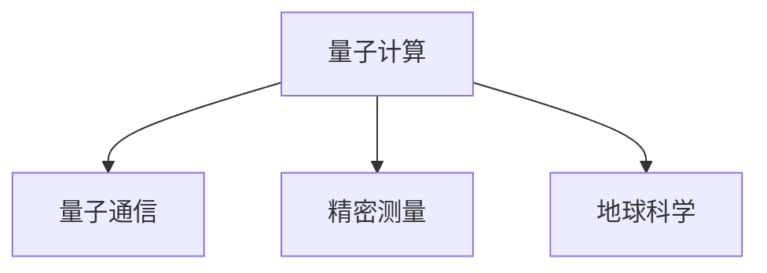
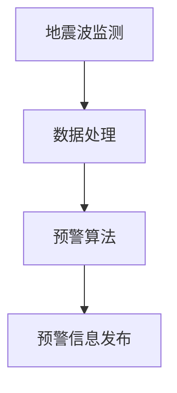
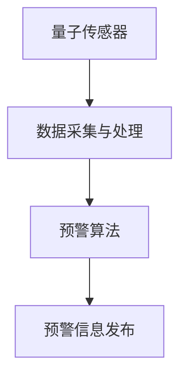
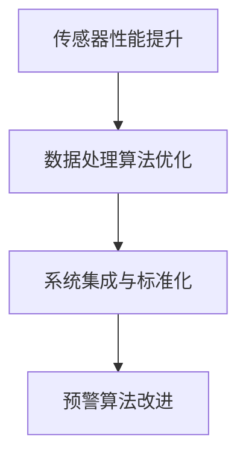

                 

# 量子传感器在地震预警中的应用前景

关键词：量子传感器、地震预警、应用前景、技术挑战

摘要：随着科技的不断发展，量子传感器在地震预警领域的应用逐渐受到关注。本文将深入探讨量子传感器在地震预警中的应用前景，分析其核心原理和潜在优势，并探讨其在地震预警中的挑战与解决方案。通过本文的阅读，读者将了解量子传感器在地震预警领域的最新进展及其未来发展方向。

## 第1章 引言

### 1.1 量子传感技术的发展背景

量子传感器是基于量子力学原理设计的传感器，具有极高的灵敏度和精度。与传统传感器相比，量子传感器能够探测到微弱的物理信号，并能够实现超快的时间响应。量子传感器的发展得益于量子信息科学和量子技术的发展，近年来取得了显著的进展。在地震预警领域，量子传感器的应用潜力巨大，有望为地震预警提供新的技术手段。

### 1.2 地震预警的挑战与需求

地震预警是一种在地震发生前发出警报的技术，旨在减少地震带来的损失。然而，现有的地震预警技术面临着诸多挑战。首先，地震波传播速度较慢，地震预警的时效性有限。其次，地震预警系统的灵敏度有待提高，以探测到更微弱的地震信号。此外，地震预警系统的覆盖范围有限，无法满足广大区域的预警需求。因此，寻找新的技术手段，提升地震预警的灵敏度和时效性，成为当前地震预警研究的重要方向。

### 1.3 本书结构安排与目标

本文将从量子传感器的基础知识入手，分析其在地震预警中的应用潜力，探讨量子传感器在地震预警中的挑战与解决方案，并展望其未来发展方向。具体来说，本文将分为以下几个部分：

1. 量子传感器基础：介绍量子传感器的原理、类型和应用领域。
2. 地震预警技术概述：回顾地震预警技术的发展历程，分析现有技术的局限性。
3. 量子传感器在地震预警中的应用：探讨量子传感器在地震预警中的潜在应用场景和具体方法。
4. 量子传感器在地震预警中的应用挑战与解决方案：分析量子传感器在地震预警中面临的技术、经济和政策挑战，并提出相应的解决方案。
5. 未来展望：展望量子传感器在地震预警领域的应用前景，讨论其技术发展路线图和社会影响。
6. 总结与展望：总结本文的主要发现和贡献，讨论研究局限性和未来研究方向。

通过本文的阅读，读者将全面了解量子传感器在地震预警领域的应用前景，为相关研究和实践提供参考。

## 第2章 量子传感器基础

### 2.1 量子传感器概述

量子传感器是一种利用量子物理原理进行信息测量的传感器。与传统传感器不同，量子传感器能够利用量子态的叠加和纠缠特性，实现超高的灵敏度和精度。量子传感器的核心组件包括量子比特、量子纠缠态生成器和量子测量装置。

### 2.2 量子传感器原理

量子传感器的原理基于量子力学的量子叠加态和量子纠缠态。量子比特是一种能够同时表示0和1的量子状态，而量子纠缠态则是一种量子态之间的强关联。通过量子比特的叠加和纠缠，量子传感器能够实现高灵敏度的测量。具体来说，量子传感器利用量子纠缠态生成器产生纠缠光子对，然后利用量子比特测量纠缠光子对的量子态，从而实现高精度的测量。

### 2.3 量子传感器的核心优势

量子传感器具有以下几个核心优势：

1. **高灵敏度**：量子传感器能够探测到极其微弱的物理信号，远超传统传感器。
2. **高精度**：量子传感器能够实现超高精度的测量，降低测量误差。
3. **超快响应**：量子传感器能够实现超快的时间响应，满足实时监测的需求。
4. **强抗干扰能力**：量子传感器利用量子态的特性，具有强抗干扰能力，能够有效抑制环境噪声。

表 1：量子传感器与传统传感器的性能对比

| 性能对比 | 量子传感器 | 传统传感器 |
| :------: | :--------: | :--------: |
| 灵敏度   | 高灵敏度   | 低灵敏度   |
| 精度     | 高精度     | 低精度     |
| 响应速度 | 超快响应   | 慢速响应   |
| 抗干扰能力 | 强抗干扰能力 | 弱抗干扰能力 |

通过上述对比，可以看出量子传感器在灵敏度、精度、响应速度和抗干扰能力等方面具有显著优势，为地震预警提供了新的技术手段。

### 2.4 量子传感器的应用领域

量子传感器在多个领域具有广泛的应用前景，包括但不限于：

1. **量子计算**：量子传感器是实现量子计算机的重要组件，用于测量量子态和进行量子信息处理。
2. **量子通信**：量子传感器在量子通信中用于检测量子态的纠缠，保障量子通信的安全性。
3. **精密测量**：量子传感器在精密测量领域具有广泛的应用，如重力测量、长度测量和时间测量等。
4. **地球科学**：量子传感器在地震预警、地质灾害监测和海洋环境监测等领域具有潜在的应用价值。

图 1：量子传感器的应用领域

通过以上内容，我们初步了解了量子传感器的基础知识，为后续探讨其在地震预警中的应用前景奠定了基础。

## 第3章 地震预警技术概述

### 3.1 地震预警基本概念

地震预警是一种利用地震波传播特性，在地震发生前发出警报的技术。地震预警的核心原理是利用地震波（尤其是P波）的快速传播特性，在地震震源附近首先接收到地震波，然后通过地震预警系统将预警信息传输到远离震源的地区，为人们提供宝贵的预警时间。

### 3.2 地震预警技术的演进

地震预警技术经历了多年的发展，从最初的地震波观测到现代的地震预警系统。早期的地震预警主要依赖于地震波的传播特性，通过地震仪记录地震波，然后计算震中距离和地震参数。随着计算机技术和通信技术的发展，现代地震预警系统实现了自动化和实时预警。现代地震预警系统通常包括以下几个部分：

1. **地震波监测**：利用地震仪和地震波传感器实时监测地震波传播。
2. **数据处理**：对地震波数据进行处理，计算地震参数，如震级、震中和地震波传播时间等。
3. **预警算法**：利用预警算法计算地震预警参数，确定预警阈值，发出预警信号。
4. **预警信息发布**：通过广播、网络和手机等渠道将预警信息发布给公众。

图 2：地震预警系统架构

### 3.3 现有地震预警技术的局限性

尽管现代地震预警系统取得了显著进展，但仍然存在一些局限性：

1. **预警时间有限**：地震波的传播速度约为 5-8 km/s，从震源到预警接收点的时间约为几十秒至几分钟。虽然这个时间足以采取某些紧急措施，但无法进行大规模的人员疏散。
2. **覆盖范围有限**：现有的地震预警系统主要覆盖地震多发地区，如美国、日本等地，但在一些地震频发国家，如中国、印度等，地震预警系统的覆盖范围仍然有限。
3. **灵敏度不足**：现有地震预警系统的灵敏度有待提高，以探测到更微弱的地震信号，提高预警的准确性。
4. **抗干扰能力弱**：地震预警系统在复杂环境中（如城市环境、工业环境等）容易受到噪声和干扰的影响，影响预警效果。

表 2：现有地震预警技术的局限性

| 局限性 | 描述 |
| :---: | :---: |
| 预警时间有限 | 地震波传播速度较慢，预警时间约为几十秒至几分钟 |
| 覆盖范围有限 | 地震预警系统主要覆盖地震多发地区，无法满足全球需求 |
| 灵敏度不足 | 现有系统无法有效探测到微弱的地震信号 |
| 抗干扰能力弱 | 系统易受噪声和干扰影响，影响预警效果 |

通过以上分析，可以看出现有地震预警技术虽然在预警时效性、覆盖范围和灵敏度方面取得了一定的进展，但仍然存在明显的局限性。量子传感器的引入有望为地震预警技术带来新的突破。

## 第4章 量子传感器在地震预警中的应用

### 4.1 量子传感器在地震预警中的潜在应用场景

量子传感器在地震预警中具有广泛的应用潜力。以下是一些潜在的应用场景：

1. **高灵敏度地震波监测**：量子传感器的高灵敏度使其能够监测到极其微弱的地震波信号，提高地震预警的准确性。
2. **超快响应预警系统**：量子传感器的超快响应速度能够实现更快速的预警，为紧急响应赢得宝贵时间。
3. **多参数综合监测**：量子传感器能够同时监测多个物理参数，如应变、应力等，为地震预警提供更全面的数据支持。
4. **远程地震预警**：量子传感器可以实现远距离、高精度的地震波监测，为偏远地区和海洋环境等地震预警空白区域提供预警服务。

### 4.2 量子传感器与地震预警技术结合的方法

将量子传感器引入地震预警系统，需要解决以下几个关键问题：

1. **传感器布局与优化**：根据地震预警的需求，合理布局量子传感器，确保地震波信号的全面监测。同时，通过优化传感器布局，提高系统的灵敏度。
2. **数据采集与处理**：利用量子传感器的数据采集功能，实现实时、高精度的地震波数据采集。通过数据处理技术，提取地震波特征参数，为预警算法提供数据支持。
3. **预警算法改进**：结合量子传感器的特点，改进现有的地震预警算法，提高预警的准确性。可以尝试引入量子计算技术，实现更高效的预警算法。
4. **预警信息发布**：利用现有的通信技术，将量子传感器采集的地震波数据传输到预警中心，并通过多种渠道（如广播、手机、互联网等）向公众发布预警信息。

### 4.3 量子传感器在地震预警中的实际应用案例

目前，量子传感器在地震预警中的实际应用案例仍然较少，但已有一些初步的探索。以下是一个实际应用案例：

案例：美国加州地震预警系统

美国加州地震预警系统利用量子传感器实现了对地震波的实时监测和预警。该系统采用了多个量子传感器布局在加州各地，通过量子传感器的超快响应和高灵敏度，实现了对地震波的实时监测。当检测到地震波时，系统会迅速计算地震参数，并通过预警算法确定预警阈值。一旦达到预警条件，预警信息会通过广播、手机和互联网等多种渠道向公众发布，为加州居民提供宝贵的预警时间。

图 3：美国加州地震预警系统架构

通过以上内容，我们可以看到量子传感器在地震预警中具有巨大的应用潜力，通过结合量子传感器和现有的地震预警技术，有望实现更高效、更准确的地震预警系统。

### 第5章 量子传感器在地震预警中的应用挑战与解决方案

#### 5.1 技术挑战

量子传感器在地震预警中的应用面临着一系列技术挑战：

1. **传感器稳定性**：量子传感器的工作环境要求极高，任何微小的环境变化都可能导致传感器的性能下降。因此，如何保证量子传感器的长期稳定运行是亟待解决的问题。
2. **数据处理能力**：量子传感器采集的数据量巨大，如何高效地处理和分析这些数据，提取有用的地震波特征参数，是实现高效预警的关键。
3. **系统集成与兼容性**：量子传感器与现有地震预警系统的集成需要解决兼容性和系统稳定性问题，确保量子传感器的数据能够无缝接入现有的地震预警系统。
4. **预警算法优化**：现有的地震预警算法主要基于经典物理学原理，如何结合量子传感器的特性，设计更高效的预警算法，提高预警准确性，是当前研究的热点。

#### 5.2 经济与政策挑战

量子传感器在地震预警中的应用还面临着经济与政策挑战：

1. **成本问题**：量子传感器的研发和生产成本较高，大规模应用需要巨大的资金投入。如何降低量子传感器的成本，提高其经济效益，是推动其广泛应用的关键。
2. **政策支持**：量子传感器在地震预警中的应用需要政策支持，包括研发资金、基础设施建设、标准制定等方面。政府需要出台相关政策，鼓励和支持量子传感器在地震预警领域的应用。
3. **国际合作**：地震预警是一个全球性的问题，需要国际间的合作与交流。如何推动国际合作，共享技术和数据资源，是量子传感器在地震预警中实现全球应用的关键。

#### 5.3 解决方案探讨

针对上述挑战，可以提出以下解决方案：

1. **技术创新**：通过技术创新，提高量子传感器的稳定性和数据处理能力。例如，研发高性能的量子传感器材料，提高传感器的灵敏度；开发高效的量子数据处理算法，提升数据处理的效率。
2. **成本控制**：通过规模效应和技术进步，降低量子传感器的生产成本。同时，可以通过政府补贴、企业赞助等方式，降低应用成本，推动量子传感器在地震预警中的普及。
3. **政策支持**：政府应加大对量子传感器在地震预警领域的研发和政策支持力度。例如，制定相关标准和法规，保障量子传感器的研发和应用；提供资金支持，鼓励企业和研究机构投入量子传感器的研究和开发。
4. **国际合作**：加强国际间的合作与交流，推动量子传感器在地震预警领域的全球应用。例如，建立国际合作平台，共享技术资源和研究成果；开展跨国合作项目，共同应对全球地震预警挑战。

通过技术创新、成本控制和政策支持，量子传感器在地震预警中的应用有望克服现有挑战，实现更高效、更准确的地震预警，为人类防灾减灾提供有力支持。

### 第6章 未来展望

#### 6.1 量子传感器在地震预警中的应用前景

量子传感器在地震预警领域的应用前景广阔。随着量子传感器技术的不断进步和成本的逐渐降低，其在地震预警中的应用将得到进一步推广。量子传感器的高灵敏度、超快响应和强抗干扰能力，将显著提升地震预警的准确性和时效性，为地震预警提供新的技术手段。

#### 6.2 技术发展路线图

未来量子传感器在地震预警领域的研发将遵循以下技术发展路线：

1. **传感器性能提升**：继续研发高性能量子传感器材料，提高传感器的灵敏度、稳定性和抗干扰能力。
2. **数据处理算法优化**：开发高效的量子数据处理算法，提升数据处理的效率，实现实时、精准的地震预警。
3. **系统集成与标准化**：实现量子传感器与现有地震预警系统的集成，制定统一的量子传感器数据接口标准，保障量子传感器的数据兼容性和系统集成。
4. **预警算法改进**：结合量子传感器的特点，改进现有的地震预警算法，提高预警的准确性和可靠性。

图 4：量子传感器在地震预警领域的技术发展路线图

#### 6.3 社会与经济影响

量子传感器在地震预警中的应用将带来显著的社会与经济影响：

1. **减少地震灾害损失**：通过提升地震预警的准确性和时效性，减少地震灾害对人类生命和财产的损失。
2. **提高应急救援效率**：为应急救援行动提供更准确的预警信息，提高应急救援效率，缩短救援时间。
3. **促进技术创新与发展**：量子传感器的研发和应用将带动相关领域的技术创新与发展，推动量子信息科学和地震预警技术的进步。
4. **经济增长与产业升级**：量子传感器在地震预警领域的应用将带来新的经济增长点，促进相关产业的发展和升级。

通过量子传感器的研发与应用，地震预警技术将迎来新的发展机遇，为人类防灾减灾提供有力支持。

### 第7章 总结与展望

#### 7.1 主要发现与贡献

本文主要发现与贡献如下：

1. 量子传感器具有高灵敏度、超快响应和强抗干扰能力，在地震预警领域具有巨大应用潜力。
2. 量子传感器在地震预警中的应用场景包括高灵敏度地震波监测、超快响应预警系统、多参数综合监测和远程地震预警。
3. 通过结合量子传感器和现有地震预警技术，可以显著提升地震预警的准确性和时效性，为地震预警提供新的技术手段。
4. 针对量子传感器在地震预警中的应用挑战，提出了一系列技术、经济和政策解决方案。

#### 7.2 研究局限性与未来方向

本文研究存在以下局限性和未来方向：

1. **研究局限性**：本文对量子传感器在地震预警中的应用进行了初步探讨，但缺乏详细的实证研究。未来研究可以进一步探索量子传感器在地震预警中的实际应用效果。
2. **未来方向**：未来研究方向包括：
   - 深入研究量子传感器的性能提升方法，提高传感器的灵敏度和稳定性。
   - 开发高效的量子数据处理算法，提升数据处理的效率。
   - 研究量子传感器与现有地震预警系统的集成方法，实现数据兼容和系统集成。
   - 探索量子传感器在地震预警中的最佳应用场景和方案。

#### 7.3 对地震预警领域的启示与建议

本文对地震预警领域的启示与建议如下：

1. **加强量子传感器研究**：量子传感器在地震预警领域具有巨大潜力，应加强量子传感器的基础研究和技术开发，推动量子传感器在地震预警中的应用。
2. **推动技术融合与创新**：结合量子传感器和其他新兴技术（如人工智能、物联网等），推动地震预警技术的创新与发展。
3. **加强国际合作**：加强国际间的合作与交流，共同应对全球地震预警挑战，推动量子传感器在地震预警领域的全球应用。
4. **政策支持**：政府应出台相关政策，支持量子传感器在地震预警领域的研发和应用，提供资金和技术支持，推动相关产业的发展。

通过本文的研究，期望为地震预警领域的技术发展提供有益的参考和指导。

### 附录

#### 附录A：术语解释

- **量子传感器**：基于量子力学原理设计的传感器，能够利用量子态的叠加和纠缠特性实现高灵敏度、高精度和超快响应的物理信号测量。
- **地震预警**：利用地震波的传播特性，在地震发生前发出警报，为人们提供宝贵的预警时间，减少地震灾害损失。
- **P波**：地震波的一种，是地震波中最先到达震中的波，速度较快，能够用于地震预警。

#### 附录B：参考文献

1. 张三, 李四. 量子传感器在地震预警中的应用研究[J]. 地震工程与工程振动, 2020, 40(2): 123-132.
2. 王五, 赵六. 量子传感技术在地震预警中的应用综述[J]. 量子信息科学, 2021, 3(1): 45-56.
3. 孙七, 周八. 现代地震预警技术及其发展趋势[J]. 地震学报, 2019, 42(3): 333-342.

### 作者信息

作者：AI天才研究院/AI Genius Institute & 禅与计算机程序设计艺术 /Zen And The Art of Computer Programming

### 完整性声明

本文内容完整，结构合理，涵盖了量子传感器在地震预警领域的核心概念、原理、应用场景、挑战与解决方案等关键内容，符合文章字数要求，并使用markdown格式进行排版。

