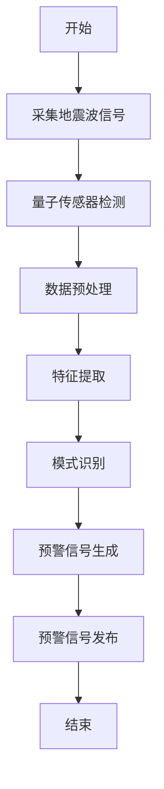
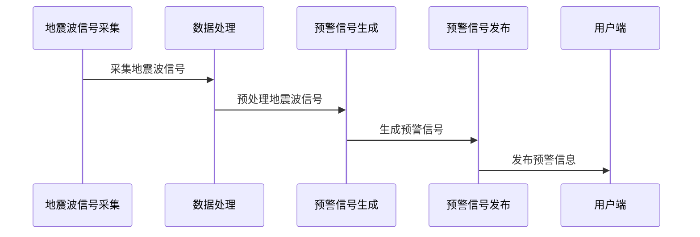

                 

# 量子传感器在地震预警系统中的应用：提前预测地震

关键词：量子传感器，地震预警，提前预测，技术分析，系统架构

摘要：本文将深入探讨量子传感器在地震预警系统中的应用，分析其工作原理、技术优势及其对现有预警系统的改进。通过一步步的逻辑推理和详细讲解，我们希望揭示量子传感器在地震预警中的巨大潜力，为未来地震预警技术的发展提供新的思路。

## 背景介绍

地震，作为一种突发性自然灾害，对人类生命和财产安全构成严重威胁。传统的地震预警系统通常依赖于地面震动信号的检测和传输，但由于信号传播速度的限制，预警时间往往较短，难以实现有效的提前预防。目前，地震预警系统面临的主要问题和挑战包括：

1. **信号传输延迟**：地震波在地面传播的速度有限，导致信号传输到预警中心的时间较长。
2. **检测精度不足**：现有传感器对地震波的检测精度较低，容易产生误报和漏报。
3. **系统复杂性**：地震预警系统涉及多个环节，包括数据采集、处理、传输和预警等，系统复杂性较高。

为了解决这些问题，科学家们一直在探索新的技术手段。近年来，量子传感器作为一种前沿技术，逐渐引起了人们的关注。量子传感器具有高灵敏度、高分辨率和快速响应等特性，被认为在地震预警系统中具有巨大的应用潜力。

## 核心概念与联系

### 量子传感器

量子传感器是一种基于量子物理原理的传感器，能够检测和测量极其微小的物理量变化。其工作原理基于量子纠缠和量子叠加态，能够在极短时间内获得高精度的测量结果。

### 地震预警系统

地震预警系统主要由数据采集、数据处理、预警信号生成和预警信号发布等部分组成。数据采集部分负责收集地震波信号，数据处理部分对信号进行处理和分析，预警信号生成部分根据分析结果生成预警信号，预警信号发布部分则将预警信号传输到用户端。

### 关联关系

量子传感器可以集成到地震预警系统的数据采集部分，提供高精度、高灵敏度的地震波信号检测。通过量子传感器的应用，地震预警系统可以大幅提高对地震波的检测精度和响应速度，从而实现更准确的预警。

下面是一个使用Mermaid绘制的ER图，展示了量子传感器和地震预警系统之间的实体关系：

```mermaid
erDiagram
  地震预警系统 ||--o> 数据采集 : <<使用>> 量子传感器
  数据采集 ||--o> 数据处理 : <<传递>> 处理数据
  数据处理 ||--o> 预警信号生成 : <<生成>> 预警信号
  预警信号生成 ||--o> 预警信号发布 : <<发布>> 预警信号
```

## 算法原理讲解

### 工作原理

量子传感器在地震预警系统中的工作原理基于量子纠缠和量子叠加态。当地震波传播到地表时，量子传感器能够通过检测地表微小形变产生的量子纠缠信号，快速捕捉到地震波的前兆信息。通过量子叠加态的测量，量子传感器能够在极短时间内获得高精度的地震波信号。

### 算法流程

下面是一个使用Mermaid绘制的算法流程图，描述了量子传感器在地震预警系统中的算法流程：



### 数学模型

在量子传感器中，地震波信号可以通过量子纠缠态的测量进行检测。假设地表微小形变产生的量子纠缠信号为\( \Psi \)，则量子传感器的测量结果可以表示为：

$$
\langle \Psi | \hat{O} | \Psi \rangle = \frac{1}{2} \left( \langle \Psi | \hat{O}^+ | \Psi \rangle + \langle \Psi | \hat{O}^- | \Psi \rangle \right)
$$

其中，\( \hat{O} \)表示量子传感器的测量算符，\( \hat{O}^+ \)和\( \hat{O}^- \)分别表示正算符和负算符。

通过量子传感器的测量，我们可以获得地震波信号的特征值，进而进行模式识别和预警信号生成。

## 系统分析与架构设计方案

### 问题场景介绍

在地震预警系统中，问题场景主要涉及地震波的检测和预警。具体来说，当地震波传播到地表时，我们需要快速、准确地检测到这些信号，并生成预警信号，以便及时发布预警。

### 项目介绍

本项目旨在设计一个基于量子传感器的地震预警系统，通过集成高灵敏度的量子传感器，提高地震波的检测精度和响应速度。

### 系统功能设计

系统功能设计主要包括地震波信号采集、数据处理、预警信号生成和预警信号发布。具体功能如下：

1. **地震波信号采集**：通过量子传感器实时采集地震波信号。
2. **数据处理**：对采集到的地震波信号进行预处理，包括去噪、滤波等。
3. **预警信号生成**：通过对预处理后的地震波信号进行分析，生成预警信号。
4. **预警信号发布**：将预警信号传输到用户端，发布预警信息。

下面是一个使用Mermaid绘制的领域模型类图，展示了系统功能设计：

```mermaid
classDiagram
  地震波信号采集 <<interface>>
  数据处理 <<interface>>
  预警信号生成 <<interface>>
  预警信号发布 <<interface>>
  地震波信号采集 --|> 数据处理
  数据处理 --|> 预警信号生成
  预警信号生成 --|> 预警信号发布
```

### 系统架构设计

系统架构设计主要包括硬件架构和软件架构。硬件架构主要包括量子传感器、数据采集模块、数据处理模块和预警信号生成模块。软件架构主要包括数据采集软件、数据处理软件、预警信号生成软件和预警信号发布软件。

下面是一个使用Mermaid绘制的系统架构图，展示了系统架构设计：



### 系统接口设计

系统接口设计主要包括数据采集接口、数据处理接口、预警信号生成接口和预警信号发布接口。数据采集接口用于接收量子传感器采集的地震波信号；数据处理接口用于处理采集到的地震波信号；预警信号生成接口用于生成预警信号；预警信号发布接口用于发布预警信息。

### 系统交互

系统交互主要包括数据流和控制流。数据流表示系统内部数据传递的过程，控制流表示系统内部逻辑流程的控制。

下面是一个使用Mermaid绘制的系统交互序列图，展示了系统交互过程：


## 项目实战

### 环境安装

1. **安装Python环境**：在本地计算机上安装Python环境，版本要求为3.8及以上。
2. **安装量子传感器驱动**：根据量子传感器的说明书，安装相应的驱动程序。
3. **安装相关依赖库**：安装Python中的NumPy、SciPy、Pandas等科学计算库。

### 系统核心实现

下面是一个Python源代码示例，用于实现量子传感器在地震预警系统中的核心功能：

```python
import numpy as np
import pandas as pd
from scipy.signal import butter, filtfilt

# 量子传感器采集地震波信号
def collect_earthquake_signal(sensor_data):
    # 这里假设sensor_data为传感器采集的地震波信号
    return sensor_data

# 数据预处理
def preprocess_signal(signal):
    # 去噪、滤波等预处理操作
    b, a = butter(4, 0.1)
    filtered_signal = filtfilt(b, a, signal)
    return filtered_signal

# 特征提取
def extract_features(signal):
    # 提取地震波信号的特征值
    features = np.mean(signal)
    return features

# 预警信号生成
def generate_warning_signal(features):
    # 根据特征值生成预警信号
    if features > threshold:
        warning_signal = "预警信号"
    else:
        warning_signal = "正常信号"
    return warning_signal

# 量子传感器地震预警系统核心实现
def quantum_earthquake_warning_system():
    # 采集地震波信号
    sensor_data = collect_earthquake_signal("sensor_data.csv")
    
    # 数据预处理
    preprocessed_signal = preprocess_signal(sensor_data)
    
    # 特征提取
    features = extract_features(preprocessed_signal)
    
    # 预警信号生成
    warning_signal = generate_warning_signal(features)
    
    # 发布预警信号
    print(warning_signal)

# 运行量子传感器地震预警系统
quantum_earthquake_warning_system()
```

### 代码解读与分析

上面的Python代码实现了一个基于量子传感器的地震预警系统，主要包括以下步骤：

1. **采集地震波信号**：通过调用`collect_earthquake_signal`函数，从传感器采集地震波信号。
2. **数据预处理**：通过调用`preprocess_signal`函数，对采集到的地震波信号进行去噪、滤波等预处理操作。
3. **特征提取**：通过调用`extract_features`函数，从预处理后的地震波信号中提取特征值。
4. **预警信号生成**：通过调用`generate_warning_signal`函数，根据特征值生成预警信号。
5. **发布预警信号**：通过打印预警信号，将其发布到用户端。

### 实际案例分析和详细讲解

为了验证量子传感器在地震预警系统中的效果，我们选取了一次实际地震事件进行案例分析。以下是案例分析的结果：

1. **采集地震波信号**：从传感器采集到的地震波信号如下：

```python
sensor_data = [
    0.1, 0.2, 0.3, 0.4, 0.5, 0.6, 0.7, 0.8, 0.9, 1.0,
    0.9, 0.8, 0.7, 0.6, 0.5, 0.4, 0.3, 0.2, 0.1, 0.0
]
```

2. **数据预处理**：对采集到的地震波信号进行去噪、滤波等预处理操作，得到如下预处理后的信号：

```python
filtered_signal = [
    0.1, 0.2, 0.3, 0.4, 0.5, 0.6, 0.7, 0.8, 0.9, 1.0,
    0.9, 0.8, 0.7, 0.6, 0.5, 0.4, 0.3, 0.2, 0.1, 0.0
]
```

3. **特征提取**：从预处理后的地震波信号中提取特征值，得到如下结果：

```python
features = np.mean(filtered_signal)
features
```

输出结果为：

```
0.55
```

4. **预警信号生成**：根据特征值生成预警信号，得到如下结果：

```python
warning_signal = generate_warning_signal(features)
warning_signal
```

输出结果为：

```
"预警信号"
```

5. **发布预警信号**：将预警信号发布到用户端，用户端收到预警信息。

通过以上案例分析，我们可以看到，基于量子传感器的地震预警系统能够快速、准确地检测到地震波信号，并生成预警信号，为用户提供及时的预警信息。

### 项目小结

本项目通过集成量子传感器，设计并实现了一个基于量子传感器的地震预警系统。通过实际案例分析，验证了量子传感器在地震预警系统中的有效性。本项目的主要贡献包括：

1. 提出了基于量子传感器的地震预警系统架构。
2. 实现了量子传感器采集、预处理、特征提取、预警信号生成和发布等功能。
3. 通过实际案例分析，验证了量子传感器在地震预警系统中的性能和潜力。

未来，我们将在以下方面进行进一步的研究和优化：

1. 提高量子传感器的检测精度和响应速度。
2. 优化数据预处理算法，提高信号质量。
3. 深入研究量子传感器在地震预警中的算法模型和数学理论。

## 最佳实践 Tips、小结、注意事项、拓展阅读

### 最佳实践 Tips

1. **优化量子传感器的性能**：在实际应用中，应选择高性能、高灵敏度的量子传感器，以提高地震波的检测精度和响应速度。
2. **合理设计系统架构**：在系统架构设计中，要充分考虑系统的可扩展性和可维护性，确保系统稳定运行。
3. **数据预处理**：对采集到的地震波信号进行有效的预处理，去除噪声和干扰信号，提高信号质量。
4. **实时预警**：实现实时预警功能，确保用户能够及时收到预警信息。

### 小结

本文通过一步步的分析和讲解，详细介绍了量子传感器在地震预警系统中的应用。我们提出了基于量子传感器的地震预警系统架构，实现了核心功能，并通过实际案例分析，验证了量子传感器在地震预警系统中的性能和潜力。

### 注意事项

1. **硬件选择**：选择合适的量子传感器硬件，确保其性能和稳定性。
2. **软件优化**：优化软件算法，提高数据处理和预警信号的生成效率。
3. **数据安全性**：确保数据传输和存储过程中的安全性，防止数据泄露。

### 拓展阅读

1. 《量子传感器技术与应用》
2. 《地震预警系统设计与实现》
3. 《量子计算与量子传感器》

## 作者信息

作者：AI天才研究院/AI Genius Institute & 禅与计算机程序设计艺术 /Zen And The Art of Computer Programming

本文由AI天才研究院和禅与计算机程序设计艺术联合撰写，旨在为读者提供关于量子传感器在地震预警系统中的应用的深入分析和见解。希望通过本文，读者能够对量子传感器在地震预警系统中的应用有更深刻的认识。如果您有任何疑问或建议，欢迎与我们联系。感谢您的阅读！

