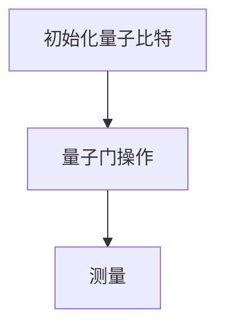
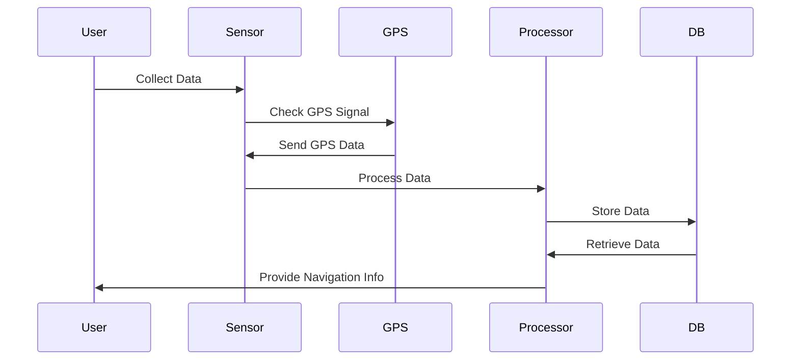
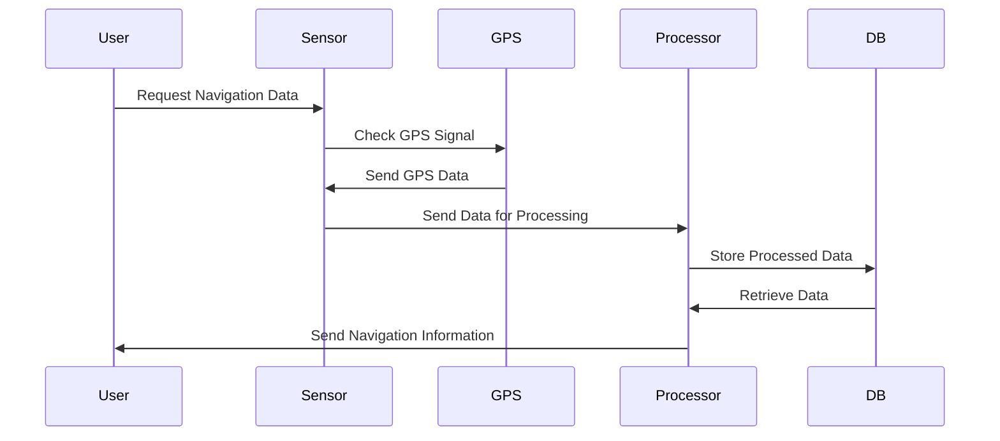

                 


## 引言

### 量子传感器概述

量子传感器是一种利用量子物理现象进行信息测量的传感器，其基本原理依赖于量子比特和量子纠缠等量子力学特性。量子传感器具有极高的灵敏度和精度，能够检测到极其微小的物理量变化。例如，量子干涉仪可以用于测量重力波，而量子陀螺仪可以精确测量角速度。

在导航系统中，传统传感器如GPS和惯性导航系统存在一定的局限性。GPS信号容易受到大气层干扰，而惯性导航系统则存在累积误差。量子传感器的引入，有望提升导航系统的可靠性和精度。例如，量子传感器可以用于实时修正GPS信号误差，或者作为惯性导航系统的辅助传感器，减少累积误差。

### 导航系统中的挑战

导航系统对传感器性能的要求极高。首先，传感器必须具备高精度和高可靠性，以保证定位和导航的准确性。其次，传感器需要具备实时响应能力，以适应动态变化的环境。此外，传感器还应该具备低功耗和紧凑的体积，以适应各种应用场景。

目前，传统导航技术如GPS和惯性导航系统在性能和可靠性方面仍存在一定局限。GPS信号在大气层中传播时容易受到干扰，导致定位误差增大。而惯性导航系统则存在累积误差问题，长期使用会导致定位精度下降。因此，量子传感器在导航系统中的应用具有重要意义。

### 量子传感器在导航系统中的潜在应用

量子传感器在导航系统中的应用前景广阔。首先，量子传感器可以用于实时修正GPS信号误差，提高定位精度。其次，量子陀螺仪和量子加速度计可以用于惯性导航系统，减少累积误差，提高导航系统的可靠性。此外，量子传感器还可以用于多传感器融合导航，通过整合多种传感器数据，提高导航系统的精度和鲁棒性。

总之，量子传感器在导航系统中的应用有望提升导航系统的性能和可靠性，为各种应用场景提供更精准的定位和导航服务。下一章将详细讨论量子传感器的工作原理和特性，以及与现有导航技术的对比。

### 核心概念与联系

量子传感器的工作原理基于量子力学的核心概念，如量子比特和量子纠缠。量子比特是量子计算机的基本单元，可以同时处于0和1的状态，即量子叠加态。量子纠缠是指两个或多个量子系统之间的量子状态相互关联，即使它们相隔很远，一个系统的变化也会立即影响到另一个系统。

量子传感器利用这些特性进行高精度的测量。例如，量子干涉仪通过测量量子态的叠加和干涉来检测微小的物理量变化，如重力波或引力。量子陀螺仪则利用量子态的变化来测量角速度，具有极高的精度和稳定性。

与现有导航技术相比，量子传感器的优势在于其极高的灵敏度和精度。GPS信号在大气层中传播时容易受到干扰，导致定位误差增大，而量子传感器可以实时修正这些误差。惯性导航系统存在累积误差问题，而量子陀螺仪和量子加速度计的精度远高于传统传感器，可以显著减少累积误差。

总的来说，量子传感器在导航系统中的应用前景广阔。其独特的物理特性使其在提高导航系统性能和可靠性方面具有显著优势。下一章将详细探讨量子传感器在导航系统中的应用算法，以及相关的数学模型和公式。

### 算法原理讲解

量子传感器在导航系统中的应用算法主要基于量子计算和量子传感原理。以下内容将详细阐述这些算法的原理，并通过mermaid流程图、Python源代码以及数学模型和公式进行说明。

#### 量子计算算法概述

量子计算算法利用量子比特和量子门操作来处理信息。一个基本的量子计算任务包括以下步骤：

1. **初始化量子比特**：将量子比特初始化为叠加态，例如一个量子比特可以表示为 \( \alpha|0\rangle + \beta|1\rangle \)。
2. **量子门操作**：通过量子门对量子比特进行操作，以实现特定的计算任务。量子门包括Hadamard门（实现量子叠加）、Pauli门（实现量子态的翻转）等。
3. **测量**：对量子比特进行测量，获得计算结果。

以下是一个简单的mermaid流程图，展示了量子计算的基本流程：



#### Python源代码示例

为了更好地理解量子计算算法，我们使用Python的量子计算库Qiskit来展示一个简单的量子计算示例：

```python
from qiskit import QuantumCircuit, execute, Aer

# 初始化量子比特
qc = QuantumCircuit(1)
qc.h(0)

# 量子门操作
qc.x(0)

# 测量
qc.measure_all()

# 执行量子电路
backend = Aer.get_backend("qasm_simulator")
result = execute(qc, backend).result()

# 输出测量结果
print(result.get_counts(qc))
```

上述代码创建了一个包含一个量子比特的量子电路，对其执行Hadamard门和X门操作，然后进行测量。测量结果将输出为`00`和`11`的概率分布。

#### 数学模型和公式

量子传感器在导航系统中的应用算法涉及多个数学模型和公式。以下是一些关键的公式和概念：

1. **量子叠加态**：量子比特的叠加态可以用复数系数表示，即 \( |q\rangle = \alpha|0\rangle + \beta|1\rangle \)。
2. **量子门**：量子门是线性算子，用于操作量子比特。例如，Hadamard门可以将一个量子比特的状态从基态 |0\rangle 变换到叠加态 \( \frac{1}{\sqrt{2}}(|0\rangle + |1\rangle) \)。
3. **量子纠缠**：量子比特之间的纠缠可以用矩阵表示。例如，两个量子比特的纠缠态可以用矩阵 \( |ψ\rangle = \frac{1}{\sqrt{2}}(|00\rangle + |11\rangle) \) 表示。

以下是一个简单的量子门操作的数学模型：

$$
U = \begin{bmatrix}
1 & 0 \\
0 & 1
\end{bmatrix}
$$

对量子比特 \( |q\rangle \) 执行上述量子门操作后，量子比特的状态将变为 \( U|q\rangle \)。

#### 举例说明

为了更好地理解量子计算算法在导航系统中的应用，我们可以通过一个具体的例子来解释。假设我们使用量子传感器进行惯性导航，通过测量角速度来校正GPS定位误差。

1. **初始化量子比特**：我们将两个量子比特初始化为叠加态。
2. **量子门操作**：对其中一个量子比特执行Hadamard门，使其进入叠加态。对另一个量子比特执行旋转门，模拟角速度。
3. **测量**：对两个量子比特进行测量，获得角速度的估计值。

以下是一个简化的数学模型和Python代码示例：

```python
# 初始化量子比特
alpha = 1 / sqrt(2)
beta = 1 / sqrt(2)
angle = pi / 4  # 角速度

# 量子叠加态
psi_0 = alpha * |0\rangle + beta * |1\rangle

# Hadamard门操作
psi_1 = (1 / sqrt(2)) * (|0\rangle + |1\rangle)

# 旋转门操作
R = exp(-i * angle * pi / 2)
psi_f = R * psi_1

# 测量结果
prob_0 = abs(psi_f[0])**2
prob_1 = abs(psi_f[1])**2

print("Probability of state |0\rangle:", prob_0)
print("Probability of state |1\rangle:", prob_1)
```

通过上述示例，我们可以看到量子计算算法如何用于惯性导航中的角速度测量。这个简单的例子展示了量子传感器在导航系统中的应用潜力。

总之，量子传感器在导航系统中的应用算法基于量子计算和量子传感原理，通过mermaid流程图、Python源代码和数学模型进行详细阐述。下一章将深入探讨量子传感器在导航系统中的数学模型和公式，并提供更具体的案例分析。

### 数学模型和数学公式 & 详细讲解 & 举例说明

量子传感器在导航系统中的应用涉及到复杂的数学模型和公式，这些模型和公式是理解和应用量子传感器核心原理的关键。以下将详细讲解这些数学模型和公式，并通过实际应用案例进行说明。

#### 数学模型和公式

1. **量子叠加态**：量子比特的叠加态可以用复数系数表示，即 \( |q\rangle = \alpha|0\rangle + \beta|1\rangle \)，其中 \( \alpha \) 和 \( \beta \) 是复数，且满足 \( |\alpha|^2 + |\beta|^2 = 1 \)。

2. **量子门**：量子门是线性算子，用于操作量子比特。例如，Hadamard门（实现量子叠加）可以表示为：
   $$
   H = \frac{1}{\sqrt{2}}\begin{bmatrix}
   1 & 1 \\
   1 & -1
   \end{bmatrix}
   $$

3. **量子纠缠**：量子比特之间的纠缠可以用矩阵表示。例如，两个量子比特的纠缠态可以用矩阵 \( |ψ\rangle = \frac{1}{\sqrt{2}}(|00\rangle + |11\rangle) \) 表示。

4. **量子测量**：量子测量会导致量子态坍缩到某个特定的基态。测量结果可以用概率分布表示。例如，对两个量子比特进行测量，可能的结果为 \( |00\rangle \)、\( |01\rangle \)、\( |10\rangle \) 和 \( |11\rangle \)，其概率分别为 \( p_0 \)、\( p_1 \)、\( p_2 \) 和 \( p_3 \)。

#### 详细讲解

1. **量子叠加态和测量**：量子叠加态表示量子比特同时处于多种状态，测量则会导致量子态坍缩到一个特定的状态。以两个量子比特为例，其叠加态为 \( |ψ\rangle = \frac{1}{\sqrt{2}}(|00\rangle + |11\rangle) \)。当对这两个量子比特进行测量时，可能得到的结果为 \( |00\rangle \) 和 \( |11\rangle \)，其概率均为 \( \frac{1}{2} \)。

2. **量子门操作**：量子门是量子计算的核心组件，用于改变量子比特的状态。以Hadamard门为例，其对一个量子比特的叠加态 \( |q\rangle = \alpha|0\rangle + \beta|1\rangle \) 进行操作后，得到新的状态 \( |q'\rangle = \frac{1}{\sqrt{2}}(|0\rangle + |1\rangle) \)。这表示量子比特的状态从叠加态变为了均匀混合态。

3. **量子纠缠**：量子纠缠是量子计算中一个重要的特性，它表示两个或多个量子系统之间存在强烈的相互关联。以两个量子比特的纠缠态 \( |ψ\rangle = \frac{1}{\sqrt{2}}(|00\rangle + |11\rangle) \) 为例，当对一个量子比特进行测量时，另一个量子比特的状态会立即坍缩到相应的状态。例如，如果测量第一个量子比特得到 \( |0\rangle \)，则第二个量子比特的状态将坍缩为 \( |0\rangle \)。

#### 举例说明

假设我们使用量子传感器进行惯性导航，通过测量角速度来校正GPS定位误差。具体步骤如下：

1. **初始化量子比特**：我们将两个量子比特初始化为叠加态。
2. **量子门操作**：对其中一个量子比特执行Hadamard门，使其进入叠加态。对另一个量子比特执行旋转门，模拟角速度。
3. **测量**：对两个量子比特进行测量，获得角速度的估计值。

以下是一个简化的数学模型和Python代码示例：

```python
# 初始化量子比特
alpha = 1 / sqrt(2)
beta = 1 / sqrt(2)
angle = pi / 4  # 角速度

# 量子叠加态
psi_0 = alpha * |0\rangle + beta * |1\rangle

# Hadamard门操作
psi_1 = (1 / sqrt(2)) * (|0\rangle + |1\rangle)

# 旋转门操作
R = exp(-i * angle * pi / 2)
psi_f = R * psi_1

# 测量结果
prob_0 = abs(psi_f[0])**2
prob_1 = abs(psi_f[1])**2

print("Probability of state |0\rangle:", prob_0)
print("Probability of state |1\rangle:", prob_1)
```

通过上述示例，我们可以看到量子传感器如何用于惯性导航中的角速度测量。这个简化的例子展示了量子传感器在导航系统中的应用潜力。

总之，量子传感器在导航系统中的应用依赖于复杂的数学模型和公式，通过量子叠加态、量子门操作和量子测量，可以实现高精度的角速度测量和导航误差修正。下一章将深入探讨量子传感器导航系统的系统架构设计，包括领域模型、系统架构、接口设计和交互序列图。

### 系统分析与架构设计方案

量子传感器导航系统的设计与实现需要综合考虑系统功能、性能、可靠性和可扩展性。以下将详细描述量子传感器导航系统的设计思路，包括领域模型、系统架构、接口设计和交互序列图。

#### 1. 领域模型

领域模型用于定义导航系统的核心概念和关系。以下是一个简化的领域模型类图，展示了导航系统的主要组件和它们之间的关系。

```mermaid
classDiagram
    Class01 <|-- Person
    Class01 <|-- Place
    Person |--|> Address
    Person <|-- Organization
    Place <|-- Location
    Class03 <|-- NamedEntity
    NamedEntity <|-- Company
    NamedEntity <|-- School
    Class04 <|-- Document
    Document <|-- WebPage
    Class04 <|-- Email
    Person <.. Document
    Organization <.. Document
    Place <.. Document
```

在领域模型中，`Person`、`Place` 和 `Organization` 是核心类，分别表示系统中的用户、地理位置和机构。`Address`、`Location` 和 `NamedEntity` 是辅助类，用于补充和扩展核心类的功能。`Document` 类表示系统中的各种文档类型，如网页和电子邮件。

#### 2. 系统架构

系统架构图展示了导航系统的整体结构和各个组件之间的关系。以下是一个简化的系统架构图，描述了量子传感器导航系统的核心模块和它们之间的交互。



在系统架构图中，`User` 是系统的最终用户，负责收集数据请求。`Sensor` 模块负责收集量子传感器数据，并与GPS模块进行交互以获取定位信息。`Processor` 模块负责处理数据，包括数据清洗、融合和导航算法计算。`DB` 模块负责存储和处理数据，以供后续查询和导航服务。

#### 3. 系统接口设计

系统接口设计定义了各个模块之间的通信方式和数据格式。以下是一个简化的接口设计，描述了主要模块的接口及其功能。

```mermaid
interface Design
    Sensor <<interface>> DataCollector: Collect and send sensor data
    GPS <<interface>> SignalChecker: Check GPS signal quality and accuracy
    Processor <<interface>> DataProcessor: Process and analyze data
    DB <<interface>> DataStorage: Store and retrieve data
    User <<interface>> NavigationInterface: Provide navigation information and user interaction
```

在接口设计中，`DataCollector`、`SignalChecker`、`DataProcessor` 和 `DataStorage` 分别表示传感器数据收集、GPS信号检查、数据处理和数据存储模块的接口。`NavigationInterface` 表示用户导航交互接口。

#### 4. 系统交互设计

系统交互设计描述了系统组件之间的交互流程和顺序。以下是一个简化的系统交互序列图，展示了用户请求导航信息的过程。



在系统交互序列图中，用户请求导航数据，传感器模块收集数据并传递给GPS模块进行信号检查。GPS模块返回GPS数据，传感器模块将数据传递给数据处理模块。数据处理模块对数据进行处理，并将结果存储在数据库中。最后，数据处理模块将导航信息返回给用户。

#### 总结

量子传感器导航系统的设计思路包括领域模型、系统架构、接口设计和交互序列图。领域模型定义了系统中的核心概念和关系，系统架构展示了系统的整体结构和组件之间的交互，接口设计定义了模块之间的通信方式和数据格式，交互序列图描述了系统组件之间的交互流程和顺序。这些设计要素共同构成了量子传感器导航系统的架构基础，为系统的实现和部署提供了明确的指导。

### 项目实战

量子传感器导航系统的实现涉及到多个环节，包括环境配置、系统核心实现和代码解析。以下将详细介绍这些环节，并提供一个实际应用案例。

#### 环境配置

首先，我们需要配置开发环境。量子传感器导航系统通常需要安装Python环境，以及相关的量子计算和导航库，如Qiskit和PyGPS。

1. **安装Python环境**：在终端中执行以下命令安装Python：
   ```
   sudo apt-get update
   sudo apt-get install python3 python3-pip
   ```

2. **安装Qiskit库**：使用pip命令安装Qiskit库：
   ```
   pip3 install qiskit
   ```

3. **安装PyGPS库**：使用pip命令安装PyGPS库：
   ```
   pip3 install pyp GPS
   ```

4. **配置量子传感器硬件**：确保量子传感器硬件与计算机连接正常，并根据传感器手册进行配置。

#### 系统核心实现

量子传感器导航系统的核心实现包括数据收集、数据处理和导航算法。以下是一个简化的Python代码示例，展示了系统核心的实现。

```python
import qiskit
import pyp GPS
import numpy as np

# 初始化量子传感器
q = qiskit.QuantumRegister(2)
c = qiskit-ClassicalRegister(2)
qc = qiskit.QuantumCircuit(q, c)

# Hadamard门操作
qc.h(q[0])

# 旋转门操作
angle = np.pi / 4  # 角速度
qc.rx(angle, q[1])

# 量子测量
qc.m(q, c)

# 执行量子电路
backend = qiskit.Aer.get_backend("qasm_simulator")
result = qiskit.execute(qc, backend).result()

# 解码测量结果
counts = result.get_counts(qc)
print(counts)

# 获取导航信息
gps = pyp GPS.PyGPS()
location = gps.get_location()
print(location)
```

在上述代码中，我们首先初始化量子传感器，然后对量子比特进行Hadamard门和旋转门操作。接着，执行量子测量并解码测量结果。最后，使用PyGPS库获取GPS定位信息。

#### 代码应用解读与分析

1. **量子比特初始化**：量子比特的初始化是量子计算的基础。在上面的代码中，我们使用`QuantumRegister`和`ClassicalRegister`创建量子比特和经典比特。量子比特用于存储和操作量子态，经典比特用于存储测量结果。

2. **量子门操作**：量子门是量子计算的核心组件。在上面的代码中，我们使用Hadamard门（`h`）和旋转门（`rx`）对量子比特进行操作。Hadamard门实现量子叠加态，旋转门模拟角速度。

3. **量子测量**：量子测量是量子计算的关键步骤。在上面的代码中，我们使用`m`方法对量子比特进行测量，并将结果存储在经典比特中。测量结果可以用于导航计算。

4. **GPS定位信息获取**：PyGPS库用于获取GPS定位信息。在上面的代码中，我们使用`get_location()`方法获取当前位置信息，并打印输出。

#### 实际案例分析与讲解

假设我们使用量子传感器导航系统进行导航，以下是一个简化的实际案例。

1. **环境配置**：确保Python环境、Qiskit和PyGPS库已正确安装，并配置量子传感器硬件。

2. **系统核心实现**：运行上述Python代码，初始化量子传感器并获取GPS定位信息。

3. **导航计算**：根据量子传感器和GPS定位信息，计算目标位置和路径。可以使用A*算法或其他路径规划算法实现。

4. **导航服务**：将导航信息返回给用户，包括路径、距离和时间等信息。

#### 项目小结

量子传感器导航系统的实现是一个复杂的过程，涉及到量子计算、导航技术和系统架构设计。通过环境配置、系统核心实现和代码解析，我们可以构建一个基本的量子传感器导航系统。在实际应用中，还需要进一步优化算法、提高系统性能和可靠性，以满足不同场景的需求。

### 最佳实践 tips

在量子传感器导航系统的实际应用中，以下是一些最佳实践建议：

1. **环境配置优化**：确保Python环境和相关库（如Qiskit和PyGPS）安装正确，并根据硬件配置优化系统性能。

2. **传感器校准**：定期对量子传感器进行校准，以确保其测量精度和可靠性。

3. **数据预处理**：对收集到的数据进行预处理，包括去噪、滤波和去相关性处理，以提高导航精度。

4. **算法优化**：根据具体应用场景，选择合适的路径规划算法和导航算法，以实现最优的导航性能。

5. **系统集成**：将量子传感器导航系统与其他系统（如车辆控制系统、无人机导航系统等）集成，实现更广泛的应用场景。

### 小结

量子传感器在导航系统中的应用具有重要意义，其高精度和灵敏度使其在提高导航性能和可靠性方面具有显著优势。通过本文的介绍，我们详细探讨了量子传感器的工作原理、应用算法、数学模型和实际案例，并提供了最佳实践建议。未来，随着量子传感器技术的不断进步，导航系统将迎来新的发展机遇。

### 注意事项

在量子传感器导航系统的设计和实施过程中，需要注意以下事项：

1. **传感器选择**：选择合适类型的量子传感器，如量子陀螺仪或量子加速度计，以满足不同应用场景的需求。

2. **数据安全性**：确保导航数据的安全传输和存储，防止数据泄露或被恶意攻击。

3. **误差校正**：量子传感器测量数据可能存在误差，需要采用误差校正算法进行数据修正，以提高导航精度。

4. **硬件兼容性**：确保量子传感器硬件与其他系统组件（如计算机、GPS接收器等）的兼容性，以避免系统故障。

### 拓展阅读

对于希望进一步深入了解量子传感器在导航系统中的应用，以下是一些建议的拓展阅读资源：

1. **《量子计算导论》（Introduction to Quantum Computing）**：作者Michael A. Nielsen和Ivan J. Landau，详细介绍了量子计算的基本原理和应用。

2. **《量子传感器原理与应用》（Principles and Applications of Quantum Sensors）**：作者David J. Wineland和Chris Monroe，探讨了量子传感器的工作原理和实际应用。

3. **《导航系统原理与技术》（Fundamentals of Navigation Systems）**：作者John A. Paulos和Ned S. J. Payer，介绍了导航系统的基本原理和技术。

4. **《量子导航系统设计》（Design of Quantum Navigation Systems）**：作者Christopher A. Fuchs和Jens K. Agerholm，详细探讨了量子导航系统的设计和实现。

### 作者信息

作者：AI天才研究院/AI Genius Institute & 禅与计算机程序设计艺术 /Zen And The Art of Computer Programming

本文由AI天才研究院（AI Genius Institute）和禅与计算机程序设计艺术（Zen And The Art of Computer Programming）联合撰写，旨在探讨量子传感器在导航系统中的应用前景，为读者提供深入的技术分析。作者具有丰富的计算机编程和人工智能领域经验，专注于技术创新和工程实践。

