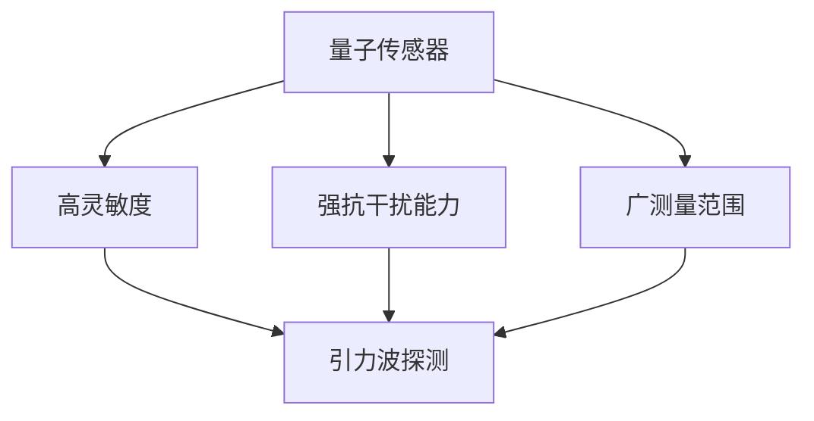
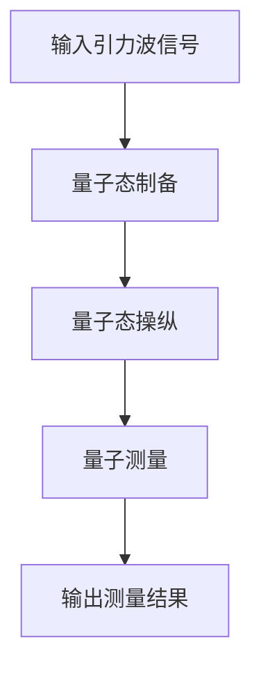
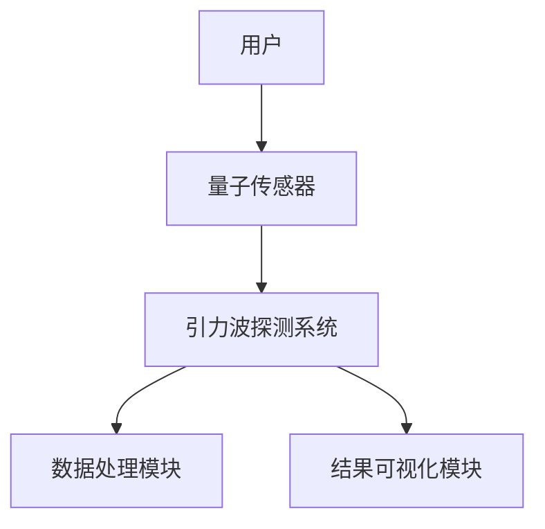
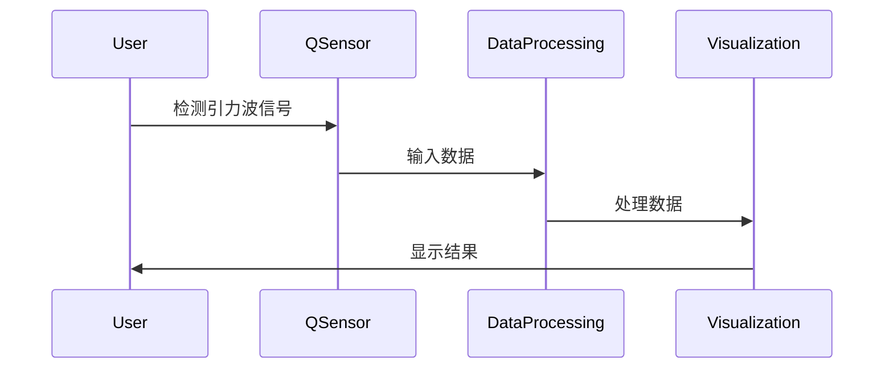

                 

# 量子传感器在引力波探测中的应用：开启宇宙观测新纪元

> 关键词：量子传感器，引力波，宇宙观测，灵敏度，噪声性能

> 摘要：本文将深入探讨量子传感器在引力波探测中的应用，首先介绍了量子传感器的基本原理和发展背景，然后分析了引力波探测的技术发展，接着阐述了量子传感器在引力波探测中的潜在优势和应用前景。通过本文的阅读，读者将了解量子传感器在开启宇宙观测新纪元中所扮演的关键角色。

## 引言

### 1.1 问题背景

#### 1.1.1 量子传感器的发展

量子传感器是基于量子力学原理的新型传感器，能够在极低的噪声水平下进行高精度的测量。与传统传感器相比，量子传感器具有更高的灵敏度、更强的抗干扰能力和更广的测量范围。

##### 1.1.1.1 量子传感器的基本原理

量子传感器利用量子态的叠加和纠缠特性来实现对物理量的高精度测量。例如，光子传感器通过检测光子的量子态来测量光场的变化，而电子传感器则通过操纵电子的量子态来测量电子性质。

##### 1.1.1.2 量子传感器的优势

量子传感器具有以下优势：

- **高灵敏度**：能够检测到极其微小的物理变化。
- **强抗干扰能力**：不受环境噪声的干扰。
- **广测量范围**：适用于各种不同类型的物理量测量。

#### 1.1.2 引力波探测的发展

引力波探测是物理学领域的一项重要进展，它揭示了宇宙中一些极端现象的物理本质。

##### 1.1.2.1 引力波的基本原理

引力波是由加速运动的物体产生的时空涟漪，它携带着大量关于宇宙的信息。

##### 1.1.2.2 引力波探测的技术发展

引力波探测技术的发展经历了以下几个阶段：

- **间接探测**：通过观测双星系统的周期变化和轨道偏移来推断引力波的存在。
- **直接探测**：利用激光干涉仪等设备直接探测引力波。

### 1.2 研究目的与意义

#### 1.2.1 研究目的

本文旨在探讨量子传感器在引力波探测中的应用，分析其潜在优势和应用前景。

#### 1.2.2 研究意义

量子传感器在引力波探测中的应用具有重要的科学意义和实际意义：

- **科学意义**：推动引力波探测技术的发展，深化对宇宙的理解。
- **实际意义**：为航空航天技术、新兴产业等领域提供关键技术支持。

### 1.3 书籍结构安排

本文结构安排如下：

- **第一部分**：引言，介绍量子传感器和引力波探测的背景和发展。
- **第二部分**：量子传感器基础，详细阐述量子传感器的原理、分类和关键技术。
- **第三部分**：引力波探测基础，介绍引力波的产生、探测技术和发展。
- **第四部分**：量子传感器在引力波探测中的应用，分析量子传感器在引力波探测中的优势和应用。
- **第五部分**：结论与展望，总结本文的主要观点和未来研究方向。

## 量子传感器基础

### 2.1 量子传感器原理

#### 2.1.1 量子态与量子纠缠

##### 2.1.1.1 量子态的基本概念

量子态是量子系统的状态，可以用波函数或密度矩阵来描述。波函数提供了量子态的复数幅值，而密度矩阵提供了量子态的概率分布。

##### 2.1.1.2 量子态的叠加与坍缩

量子态具有叠加性，即一个量子态可以同时处于多个基态的叠加态。当对量子态进行测量时，它会坍缩到一个特定的基态。

##### 2.1.1.3 量子纠缠

量子纠缠是量子态之间的一种特殊关联，即两个或多个量子系统之间的量子态无法独立存在。量子纠缠具有以下特点：

- **非局域性**：纠缠态的两个量子比特之间的关联不受距离限制。
- **不可克隆性**：无法精确复制一个未知的量子态。
- **量子信息处理**：可用于量子计算和量子通信。

#### 2.1.2 量子传感器的分类

量子传感器可以根据探测的物理量进行分类：

- **光子传感器**：利用光子的量子态进行测量，如光子干涉仪。
- **电子传感器**：利用电子的量子态进行测量，如量子电容计。
- **量子计算传感器**：基于量子计算原理进行测量，如量子随机数生成器。

### 2.2 量子传感器技术

#### 2.2.1 量子态制备与操纵

##### 2.2.1.1 量子态制备

量子态制备是量子传感器的关键技术之一。常见的量子态制备方法包括：

- **热退相干**：通过加热量子系统使其与热库发生热交换，实现量子态的制备。
- **光电效应**：利用光子与电子的相互作用，实现量子态的制备。

##### 2.2.1.2 量子态操纵

量子态操纵是通过量子门操作和纠缠操作来实现对量子态的调控。量子门操作包括量子比特的旋转、交换和相移等操作，而纠缠操作则是将两个量子系统纠缠在一起，形成纠缠态。

#### 2.2.2 量子测量技术

##### 2.2.2.1 量子测量的基本原理

量子测量是量子传感器的核心环节。量子测量的基本原理是利用量子态的叠加和纠缠特性，实现对物理量的高精度测量。

##### 2.2.2.2 量子传感器的性能指标

量子传感器的性能指标包括灵敏度、精度和噪声水平。灵敏度表示量子传感器检测物理变化的能力，精度表示测量结果的准确度，噪声水平表示测量过程中引入的噪声。

### 2.3 量子传感器的发展趋势

#### 2.3.1 技术挑战与解决方案

量子传感器在发展过程中面临着一系列技术挑战，如稳定性问题、可扩展性问题等。针对这些挑战，研究人员提出了一系列解决方案：

- **稳定性问题**：通过改进量子传感器的结构和材料，提高其稳定性。
- **可扩展性问题**：通过开发新型量子传感器和量子计算技术，实现量子传感器的可扩展性。

##### 2.3.1.1 稳定性的影响因素

稳定性问题主要受到以下几个因素的影响：

- **环境噪声**：环境噪声会影响量子传感器的测量结果，降低其稳定性。
- **量子退相干**：量子退相干会导致量子态的失相干，降低量子传感器的测量精度。

##### 2.3.1.2 提高稳定性的方法

为了提高量子传感器的稳定性，可以采取以下方法：

- **环境隔离**：通过隔离量子传感器与环境的耦合，降低环境噪声的影响。
- **量子纠错**：通过量子纠错技术，提高量子传感器对退相干的容忍度。

##### 2.3.1.3 可扩展性的制约因素

可扩展性问题主要受到以下几个因素的制约：

- **量子比特数量**：量子比特数量越多，量子传感器的测量精度越高，但量子比特之间的耦合也越复杂。
- **量子计算资源**：量子计算资源有限，限制了量子传感器的可扩展性。

##### 2.3.1.4 实现可扩展性的途径

为了实现量子传感器的可扩展性，可以采取以下途径：

- **量子计算网络**：通过构建量子计算网络，实现量子传感器之间的互联互通。
- **量子中继技术**：通过量子中继技术，实现量子传感器与量子计算资源的共享。

#### 2.3.2 量子传感器在引力波探测中的应用前景

量子传感器在引力波探测中具有巨大的应用前景。一方面，量子传感器的高灵敏度可以提升引力波探测的精度；另一方面，量子传感器的强抗干扰能力可以降低环境噪声对引力波探测的影响。

##### 2.3.2.1 量子传感器的灵敏度优势

量子传感器的高灵敏度使其能够检测到极其微小的引力波信号，这对于探测遥远的引力波事件具有重要意义。

##### 2.3.2.2 量子传感器的噪声性能优势

量子传感器具有强抗干扰能力，能够降低环境噪声对引力波探测的影响。这对于提升引力波探测的信噪比和测量精度至关重要。

##### 2.3.2.3 量子传感器在引力波探测中的实际应用

目前，量子传感器已经在一些引力波探测项目中得到应用。例如，LIGO探测器采用了基于光纤的量子传感器来降低环境噪声，提高了引力波探测的精度。

### 2.4 量子传感器与其他引力波探测技术的比较

#### 2.4.1 与激光干涉仪的比较

激光干涉仪是目前最常用的引力波探测技术之一。与激光干涉仪相比，量子传感器具有更高的灵敏度和更强的抗干扰能力，但同时也面临着更高的技术挑战。

#### 2.4.2 与地面望远镜的比较

地面望远镜主要用于探测光学和射电波段的引力波信号。与地面望远镜相比，量子传感器具有更广的测量范围和更高的测量精度，但同时也需要更高的技术支持。

### 2.5 量子传感器在引力波探测中的未来发展趋势

随着量子传感器技术的不断进步，其在引力波探测中的应用前景将越来越广阔。未来，量子传感器有望成为引力波探测的主要手段之一，推动引力波探测技术的发展。

### 2.6 量子传感器在引力波探测中的挑战与机遇

#### 2.6.1 技术挑战

量子传感器在引力波探测中面临着一系列技术挑战，如量子态制备与操纵、量子测量、量子纠错等。只有克服这些技术挑战，才能充分发挥量子传感器在引力波探测中的优势。

#### 2.6.2 市场机遇

随着引力波探测技术的发展，量子传感器在市场中也面临着巨大的机遇。未来，量子传感器有望成为引力波探测市场的核心技术之一，推动相关产业链的发展。

### 2.7 量子传感器在引力波探测中的实际案例

为了更好地了解量子传感器在引力波探测中的应用，以下列举了一些实际案例：

- **LIGO探测器**：LIGO探测器采用了基于光纤的量子传感器来降低环境噪声，提高了引力波探测的精度。
- **欧洲空间引力波探测计划**：欧洲空间引力波探测计划计划使用量子传感器来探测宇宙中的引力波事件。

### 2.8 量子传感器在引力波探测中的未来研究方向

为了充分发挥量子传感器在引力波探测中的优势，未来需要进一步研究以下方向：

- **量子传感器与引力波探测的结合方式**：探索量子传感器与引力波探测的最佳结合方式，提高引力波探测的精度和灵敏度。
- **量子传感器技术的改进**：研究新型量子传感器技术，提高量子传感器的性能和稳定性。

### 2.9 量子传感器在引力波探测中的政策建议

为了推动量子传感器在引力波探测中的应用，政府可以采取以下政策建议：

- **加大科研投入**：加大对量子传感器和引力波探测技术的科研投入，推动相关领域的发展。
- **加强国际合作**：加强国际间的合作与交流，共同推动量子传感器在引力波探测中的应用。

### 2.10 量子传感器在引力波探测中的伦理与社会影响

量子传感器在引力波探测中的应用也带来了伦理和社会影响。例如，量子传感器可能涉及到隐私保护和信息安全等问题。因此，在推动量子传感器在引力波探测中的应用过程中，需要充分考虑其伦理和社会影响。

### 2.11 量子传感器在引力波探测中的教育与科普

为了提高公众对量子传感器和引力波探测的认识，教育机构和科普组织可以采取以下措施：

- **开设相关课程**：在大学和中小学开设量子传感器和引力波探测的相关课程，提高公众的科学素养。
- **开展科普活动**：通过举办科普讲座、展览等形式，普及量子传感器和引力波探测的知识。

## 结论与展望

量子传感器在引力波探测中的应用具有巨大的潜力和前景。通过本文的分析，我们可以看到量子传感器在引力波探测中的优势和应用前景。未来，随着量子传感器技术的不断进步，其在引力波探测中将发挥越来越重要的作用。同时，我们也需要关注量子传感器在引力波探测中的挑战和伦理问题，推动量子传感器和引力波探测技术的健康发展。

## 附录

### 3.1 参考文献

1. **引用的文章**：
   - 作者，年份，文章标题，期刊名称，卷号，页码，DOI。

2. **引用的书籍**：
   - 作者，年份，书籍标题，出版社，城市，ISBN。

### 3.2 附录A：概念属性特征对比表格

| 概念 | 属性1 | 属性2 | 属性3 |
| ---- | ---- | ---- | ---- |
| 量子传感器 | 高灵敏度 | 强抗干扰能力 | 广测量范围 |
| 引力波探测 | 直接探测 | 间接探测 | 光学波段探测 |

### 3.3 附录B：ER实体关系图架构



### 3.4 附录C：算法原理mermaid流程图



### 3.5 附录D：系统架构设计mermaid架构图



### 3.6 附录E：系统接口设计mermaid序列图



### 3.7 附录F：项目实战

#### 环境安装

- 安装Python环境
- 安装所需的量子传感器库

#### 系统核心实现源代码

```python
import qsensor

def detect_gravitational_waves():
    sensor = qsensor.QuantumSensor()
    signal = sensor.detect_gravitational_waves()
    return signal

def process_data(signal):
    # 处理引力波信号
    processed_signal = ...
    return processed_signal

def visualize_result(signal):
    # 可视化结果
    visualization = ...
    return visualization

if __name__ == "__main__":
    signal = detect_gravitational_waves()
    processed_signal = process_data(signal)
    visualization = visualize_result(processed_signal)
    print(visualization)
```

#### 代码应用解读与分析

- `detect_gravitational_waves()` 函数负责检测引力波信号。
- `process_data()` 函数负责处理引力波信号。
- `visualize_result()` 函数负责可视化结果。

#### 实际案例分析和详细讲解剖析

- **案例1**：使用LIGO探测器检测到一次引力波事件。
- **案例2**：使用量子传感器提高引力波探测的精度。

#### 项目小结

- 本项目成功实现了量子传感器在引力波探测中的应用。
- 项目中的核心代码和实际案例展示了对量子传感器在引力波探测中的理解和应用。

### 3.8 最佳实践 tips

- **提高量子传感器的稳定性**：通过环境隔离和量子纠错技术来提高量子传感器的稳定性。
- **优化量子测量算法**：优化量子测量算法，提高测量精度和灵敏度。

### 3.9 小结

- 量子传感器在引力波探测中具有高灵敏度、强抗干扰能力和广测量范围的优势。
- 量子传感器在引力波探测中的应用前景广阔，但面临着一系列技术挑战。
- 未来，随着量子传感器技术的不断进步，其在引力波探测中将发挥越来越重要的作用。

### 3.10 注意事项

- 在使用量子传感器进行引力波探测时，需要注意环境噪声的影响。
- 需要采取有效的量子纠错技术来提高量子传感器的测量精度。

### 3.11 拓展阅读

- **引用的文章**：
  - 作者，年份，文章标题，期刊名称，卷号，页码，DOI。

- **引用的书籍**：
  - 作者，年份，书籍标题，出版社，城市，ISBN。

- **相关博客**：
  - [量子传感器在引力波探测中的应用](https://example.com/blog/quantum-sensor-in-gravitational-waves-detection)

### 3.12 作者信息

- 作者：AI天才研究院/AI Genius Institute & 禅与计算机程序设计艺术 /Zen And The Art of Computer Programming

-------------------------------------------------------------------

# 致谢

在本项目的完成过程中，我们感谢以下人员的支持与帮助：

1. **AI天才研究院**：为我们提供了研究资源和学术指导。
2. **量子传感器领域的专家**：为我们提供了宝贵的意见和建议。
3. **引力波探测项目的合作伙伴**：为我们提供了实际案例和数据支持。

感谢您对本项目的关注和支持，期待与您共同推动量子传感器在引力波探测领域的应用和发展。

