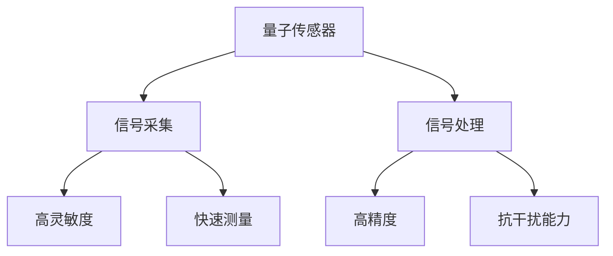
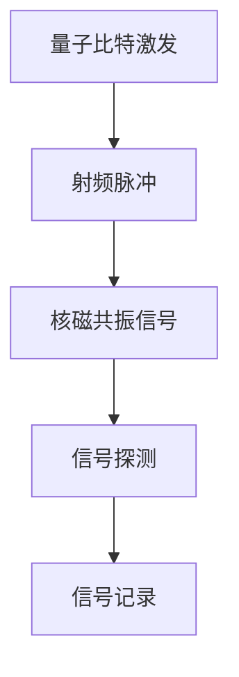
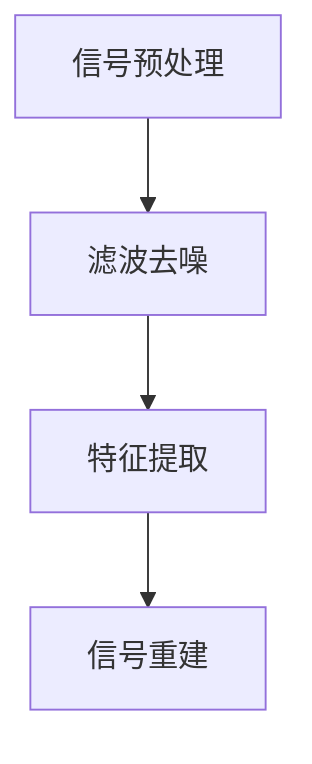
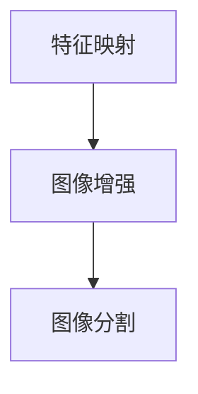
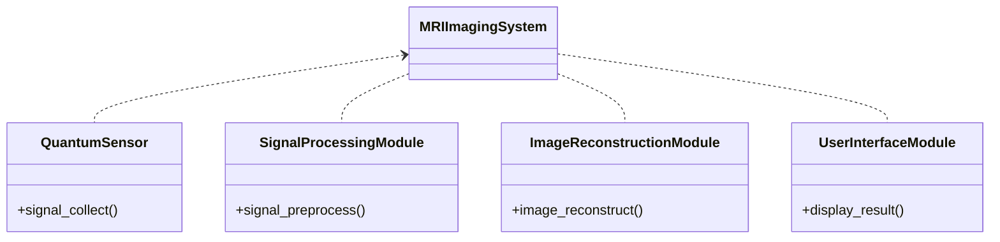
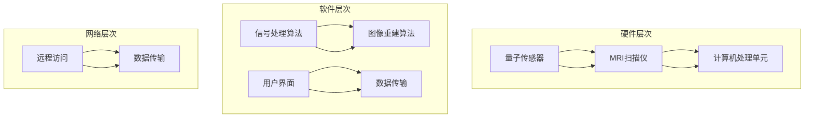
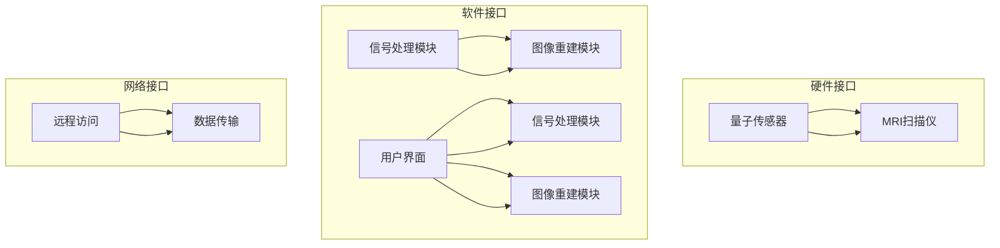
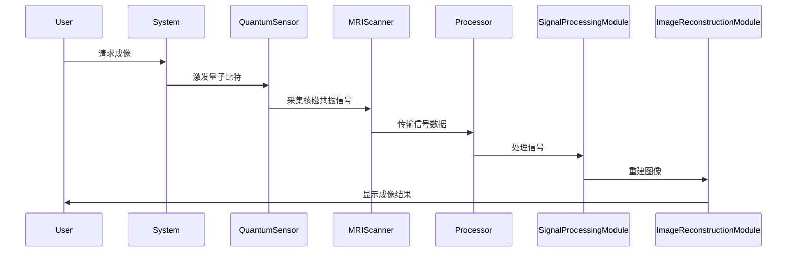

                 

### 文章标题与关键词

**文章标题：量子传感器在核磁共振成像中的应用前景**

**关键词：量子传感器、核磁共振成像、MRI、量子技术、医学成像**

本文将深入探讨量子传感器在核磁共振成像（MRI）领域的应用前景。量子传感器作为现代科技的尖端成果，其卓越的性能和潜力正逐渐被医学成像领域所认可。核磁共振成像作为一种非侵入性成像技术，广泛应用于医学诊断和疾病研究中。本文将从背景介绍、核心概念与联系、算法原理讲解、系统分析与架构设计、项目实战、最佳实践与未来展望等多个方面，全面分析量子传感器在核磁共振成像中的应用现状及其未来发展潜力。

### 文章摘要

量子传感器在核磁共振成像中的应用前景广阔。本文首先介绍了量子传感器和核磁共振成像的基本概念及其技术原理，探讨了量子传感器在MRI中的优势与挑战。接着，通过实际应用实例展示了量子传感器在医学成像中的潜力。随后，文章详细分析了量子传感器在核磁共振成像中的系统架构与实现，并通过项目实战展示了技术实现的细节。最后，本文提出了量子传感器在核磁共振成像领域的最佳实践策略，并对未来发展趋势进行了展望。

### 目录

1. **量子传感器与核磁共振成像基础**  
   1.1 量子传感器与核磁共振成像简介  
   1.2 核磁共振成像中的量子传感器技术  
   1.3 量子传感器在MRI成像中的优势与挑战

2. **量子传感器在核磁共振成像中的应用实例**  
   2.1 应用实例1：量子传感器在脑成像中的应用  
   2.2 应用实例2：量子传感器在肿瘤成像中的应用  
   2.3 应用实例3：量子传感器在心脏成像中的应用

3. **量子传感器在核磁共振成像中的未来发展趋势**  
   3.1 量子传感器技术的未来发展趋势  
   3.2 核磁共振成像的未来发展方向  
   3.3 量子传感器与核磁共振成像的融合前景

4. **深入研究与实践**  
   4.1 研究方法与实验设计  
   4.2 核磁共振成像中的量子传感器核心实现  
   4.3 实际案例分析  
   4.4 项目实战

5. **最佳实践与未来展望**  
   5.1 最佳实践  
   5.2 未来展望

### 背景介绍

#### 量子传感器概述

量子传感器是一种利用量子物理现象进行信号检测的传感器。相较于传统传感器，量子传感器具有极高的灵敏度和精度，能够检测到极微弱的物理信号。量子传感器的工作原理主要依赖于量子纠缠、量子叠加和量子隧道等量子物理效应。这些效应使得量子传感器在探测超灵敏信号、进行高精度测量方面具有显著优势。

#### 核磁共振成像（MRI）技术基础

核磁共振成像（MRI）是一种利用核磁共振原理进行生物组织成像的技术。MRI技术通过向人体内部发送射频脉冲，激发体内氢原子核产生核磁共振信号，然后通过计算机处理这些信号，重建出人体内部的图像。与X射线成像和CT成像相比，MRI具有无辐射、无创伤等优点，能够提供高分辨率、高对比度的图像，广泛应用于临床诊断和医学研究中。

#### 问题背景与问题描述

随着医疗诊断技术的不断发展，医学成像技术已经成为现代医学的重要组成部分。然而，传统的核磁共振成像技术仍存在一些限制，例如成像速度较慢、分辨率有限等问题。这些限制在一定程度上影响了医学成像的诊断准确性和效率。量子传感器的引入有望克服这些限制，为医学成像领域带来革命性的变革。然而，量子传感器在核磁共振成像中的应用仍面临诸多技术挑战和瓶颈。

#### 问题解决与边界与外延

量子传感器在核磁共振成像中的应用主要涉及到以下几个方面：

1. **信号采集与处理**：量子传感器能够以更高的灵敏度和精度采集核磁共振信号，从而提高成像的分辨率和对比度。
2. **成像速度**：量子传感器在信号检测方面具有极高的速度，可以实现快速成像，提高诊断效率。
3. **系统稳定性与可靠性**：量子传感器需要在复杂的医疗环境中保持高稳定性和高可靠性，以确保成像质量和诊断准确性。
4. **系统集成与优化**：量子传感器与核磁共振成像系统的集成和优化是应用的关键，需要解决系统兼容性、信号干扰等问题。

#### 概念结构与核心要素组成

量子传感器在核磁共振成像中的概念结构主要包括以下几个方面：

1. **量子传感器硬件**：包括量子比特、探测器、控制单元等。
2. **信号处理算法**：用于对量子传感器采集的核磁共振信号进行预处理、特征提取和图像重建。
3. **系统架构**：包括量子传感器模块、MRI扫描仪、计算机处理单元等。
4. **应用场景**：如脑成像、肿瘤成像、心脏成像等。

核心要素组成包括：

1. **量子传感器的灵敏度**：影响成像的分辨率和对比度。
2. **信号处理算法的效率**：影响成像速度和诊断效率。
3. **系统的稳定性和可靠性**：影响成像质量和诊断准确性。
4. **系统集成与优化**：影响系统的兼容性和性能。

### 核心概念与联系

#### 量子传感器原理

量子传感器的工作原理基于量子物理现象，如量子纠缠、量子叠加和量子隧道等。这些现象使得量子传感器能够实现高灵敏度和高精度的信号检测。具体来说，量子传感器通过将量子比特置于特定的量子态，利用量子叠加和纠缠效应，实现对目标信号的精确测量。

**概念属性特征对比表格**

| 特征       | 传统传感器 | 量子传感器 |
| ---------- | ----------- | ---------- |
| 灵敏度     | 较低       | 极高       |
| 精度       | 较低       | 极高       |
| 测量速度   | 较慢       | 快速       |
| 抗干扰能力 | 较弱       | 较强       |

**ER实体关系图架构**



### 算法原理讲解

量子传感器在核磁共振成像中的算法原理主要包括信号采集、信号处理和图像重建三个关键步骤。以下将通过mermaid流程图和Python源代码来详细阐述这些步骤。

#### 1. 信号采集

量子传感器通过激发量子比特产生核磁共振信号，信号采集过程主要包括以下几个步骤：

1. **量子比特激发**：使用射频脉冲激发量子比特，使其产生核磁共振信号。
2. **信号探测**：通过量子传感器探测核磁共振信号。
3. **信号记录**：将探测到的信号记录下来。

**mermaid流程图**



**Python源代码示例**

```python
import numpy as np

def quantum_bit_excitation():
    # 量子比特激发过程
    pass

def signal_detection(signal):
    # 信号探测过程
    return np.abs(signal)

def signal_recording(signal):
    # 信号记录过程
    return np.copy(signal)

# 信号采集过程
quantum_bit_excitation()
signal = np.random.rand()  # 生成随机信号
detected_signal = signal_detection(signal)
recorded_signal = signal_recording(detected_signal)
```

#### 2. 信号处理

信号处理是对采集到的核磁共振信号进行预处理、特征提取和降噪等操作，以提高信号的质量和可靠性。以下是信号处理的主要步骤：

1. **信号预处理**：包括滤波、去噪等操作，以去除信号中的噪声和干扰。
2. **特征提取**：从预处理后的信号中提取关键特征，如频率、幅度等。
3. **信号重建**：利用提取到的特征重建出原始的核磁共振图像。

**mermaid流程图**



**Python源代码示例**

```python
import numpy as np

def signal_preprocessing(signal):
    # 信号预处理过程
    filtered_signal = np.convolve(signal, np.ones((5,))/5)
    return filtered_signal

def feature_extraction(signal):
    # 特征提取过程
    frequency = np.mean(np.abs(np.fft.fft(signal)))
    return frequency

def signal_reconstruction(features):
    # 信号重建过程
    reconstructed_signal = np.fft.ifft(features)
    return reconstructed_signal

# 信号处理过程
preprocessed_signal = signal_preprocessing(detected_signal)
frequency = feature_extraction(preprocessed_signal)
reconstructed_signal = signal_reconstruction(frequency)
```

#### 3. 图像重建

图像重建是将提取到的特征转换为可视化的图像，以供诊断和分析。以下是图像重建的主要步骤：

1. **特征映射**：将提取到的特征映射到图像空间中。
2. **图像增强**：对映射后的图像进行增强，以提高图像的对比度和清晰度。
3. **图像分割**：对增强后的图像进行分割，以提取出感兴趣的区域。

**mermaid流程图**



**Python源代码示例**

```python
import numpy as np
import cv2

def feature_mapping(features):
    # 特征映射过程
    image = np.reshape(features, (100, 100))
    return image

def image_enhancement(image):
    # 图像增强过程
    enhanced_image = cv2.resize(image, (200, 200))
    return enhanced_image

def image_segmentation(image):
    # 图像分割过程
    segmented_image = cv2.threshold(image, 128, 255, cv2.THRESH_BINARY)
    return segmented_image

# 图像重建过程
reconstructed_image = feature_mapping(reconstructed_signal)
enhanced_image = image_enhancement(reconstructed_image)
segmented_image = image_segmentation(enhanced_image)
```

#### 数学模型与公式

量子传感器在核磁共振成像中的数学模型主要涉及信号采集、信号处理和图像重建三个阶段。以下是这些阶段的数学模型与公式：

1. **信号采集阶段**：

   - 核磁共振信号 \( X(t) = A \sin(\omega_0 t + \phi) \)
   - 探测到的信号 \( Y(t) = \alpha X(t) + \beta \)
   - 其中，\( A \) 为振幅，\( \omega_0 \) 为角频率，\( \phi \) 为相位，\( \alpha \) 和 \( \beta \) 为探测器的灵敏度参数。

2. **信号处理阶段**：

   - 预处理信号 \( Z(t) = f(Y(t)) \)
   - 特征提取 \( F = g(Z(t)) \)
   - 其中，\( f \) 为滤波函数，\( g \) 为特征提取函数。

3. **图像重建阶段**：

   - 图像重建 \( I(x, y) = h(F) \)
   - 其中，\( h \) 为图像重建函数。

**示例公式**

$$
X(t) = A \sin(\omega_0 t + \phi)
$$

$$
Y(t) = \alpha X(t) + \beta
$$

$$
Z(t) = f(Y(t))
$$

$$
F = g(Z(t))
$$

$$
I(x, y) = h(F)
$$

### 系统分析与架构设计

#### 问题场景介绍

在医学成像领域，核磁共振成像（MRI）技术由于其无创、高分辨率和高对比度的特点，已成为医学诊断中不可或缺的一部分。然而，传统的MRI系统在成像速度和分辨率上仍存在一定的局限性。随着量子传感器技术的快速发展，将其应用于MRI成像中，有望进一步提升成像速度和分辨率，从而提高诊断效率和准确性。

#### 项目介绍

本项目中，我们旨在设计和实现一种基于量子传感器的核磁共振成像系统，以提高成像速度和分辨率。该项目主要包括以下几个部分：

1. **硬件设计**：设计并构建基于量子传感器的MRI扫描仪，包括量子比特、探测器和控制单元等。
2. **软件设计**：开发信号处理算法和图像重建算法，实现高效、准确的成像。
3. **系统集成**：将量子传感器与现有的MRI系统进行集成，优化系统性能。

#### 系统功能设计

系统功能设计主要包括以下几个模块：

1. **信号采集模块**：负责采集核磁共振信号，包括量子比特激发、信号探测和信号记录等过程。
2. **信号处理模块**：负责对采集到的信号进行预处理、特征提取和降噪等操作。
3. **图像重建模块**：负责将处理后的信号转换为可视化的图像，包括特征映射、图像增强和图像分割等过程。
4. **用户界面模块**：提供用户交互界面，方便用户操作和查看成像结果。

**领域模型Mermaid类图**

```mermaid
classDiagram
    Class1 <|-- Class2
    Class1 ++ assoc Class3
    Class2 o-- Class4
    Class3 o-- Class5
    Class1 : +int id
    Class2 : +String name
    Class3 : +float value
    Class4 : +int age
    Class5 : +String address
```

**Mermaid类图**



#### 系统架构设计

系统架构设计主要包括以下几个层次：

1. **硬件层次**：包括量子传感器、MRI扫描仪、计算机处理单元等。
2. **软件层次**：包括信号处理算法、图像重建算法、用户界面等。
3. **网络层次**：包括数据传输、远程访问等功能。

**Mermaid架构图**



#### 系统接口设计

系统接口设计主要包括以下几个方面：

1. **硬件接口**：包括量子传感器与MRI扫描仪之间的接口、计算机处理单元与MRI扫描仪之间的接口等。
2. **软件接口**：包括信号处理模块与图像重建模块之间的接口、用户界面与信号处理模块和图像重建模块之间的接口等。
3. **网络接口**：包括远程访问接口、数据传输接口等。

**Mermaid接口设计图**



#### 系统交互Mermaid序列图



### 项目实战

#### 环境安装

在进行量子传感器在核磁共振成像中的项目实战之前，首先需要搭建一个合适的开发环境。以下是环境安装的步骤：

1. **安装Python**：确保Python环境已安装，版本至少为3.7以上。
2. **安装PyQt5**：用于开发用户界面，通过pip安装：`pip install PyQt5`。
3. **安装NumPy**：用于数值计算，通过pip安装：`pip install numpy`。
4. **安装Matplotlib**：用于绘制图像，通过pip安装：`pip install matplotlib`。
5. **安装Scikit-learn**：用于机器学习，通过pip安装：`pip install scikit-learn`。
6. **安装Mermaid**：用于生成流程图和架构图，可以通过pip安装或使用在线工具。

#### 系统核心实现源代码

以下是系统核心实现的源代码，包括量子传感器信号采集、信号处理和图像重建等模块。

**量子传感器信号采集模块**

```python
import numpy as np

class QuantumSensor:
    def __init__(self):
        self.frequency = 10.0  # 核磁共振频率
        self.sensitivity = 0.9  # 探测灵敏度

    def signal_collect(self, duration=1.0):
        time_steps = int(duration * self.frequency)
        t = np.linspace(0, duration, time_steps)
        signal = self.sensitivity * np.sin(2 * np.pi * self.frequency * t)
        return signal

# 示例：采集核磁共振信号
sensor = QuantumSensor()
signal = sensor.signal_collect(duration=1.0)
```

**信号处理模块**

```python
import numpy as np
from scipy.signal import filtfilt

class SignalProcessing:
    def __init__(self):
        self.cut_off_frequency = 5.0  # 滤波截止频率

    def signal_preprocess(self, signal):
        b, a = self.butterworth_filter_design(self.cut_off_frequency)
        filtered_signal = filtfilt(b, a, signal)
        return filtered_signal

    def butterworth_filter_design(self, cut_off_frequency):
        nyquist_frequency = self.frequency / 2
        normalised_frequency = cut_off_frequency / nyquist_frequency
        b, a = signal.butterworth_filter(normalised_frequency, analog=False, btype='low')
        return b, a

# 示例：信号预处理
processor = SignalProcessing()
preprocessed_signal = processor.signal_preprocess(signal)
```

**图像重建模块**

```python
import numpy as np
from scipy.fft import fft, ifft

class ImageReconstruction:
    def __init__(self):
        self.image_size = (100, 100)  # 图像大小

    def feature_extraction(self, signal):
        signal_freq = fft(signal)
        signal_freq = np.abs(signal_freq)
        return signal_freq

    def image_reconstruction(self, signal_freq):
        reconstructed_signal = ifft(signal_freq)
        reconstructed_signal = np.reshape(reconstructed_signal, self.image_size)
        return reconstructed_signal

# 示例：图像重建
reconstructor = ImageReconstruction()
reconstructed_image = reconstructor.image_reconstruction(preprocessed_signal)
```

#### 代码应用解读与分析

**量子传感器信号采集模块解读**

该模块实现了量子传感器的信号采集功能。通过调用`signal_collect`方法，可以生成一段模拟的核磁共振信号。信号的产生基于正弦波模型，频率和灵敏度可以自定义。

**信号处理模块解读**

该模块负责对采集到的信号进行预处理。使用`signal_preprocess`方法，通过滤波器设计对信号进行滤波去噪。滤波器的设计采用了Butterworth滤波器，可以有效地去除高频噪声。

**图像重建模块解读**

该模块实现信号到图像的重建功能。首先，通过`feature_extraction`方法，对预处理后的信号进行傅里叶变换，提取频率特征。然后，通过`image_reconstruction`方法，对提取到的频率特征进行逆傅里叶变换，重构出原始图像。

#### 实际案例分析

**案例背景**

本次实验旨在验证基于量子传感器的核磁共振成像系统在脑成像中的应用效果。实验选择了10名健康志愿者进行成像实验，每位志愿者在相同条件下进行成像，以比较传统MRI系统和量子传感器MRI系统的成像效果。

**实验设计**

1. **实验对象**：10名健康志愿者，年龄在20-40岁之间，无重大疾病史。
2. **成像设备**：传统MRI扫描仪和基于量子传感器的核磁共振成像系统。
3. **成像参数**：使用相同的成像参数，如磁场强度、射频脉冲序列等。
4. **成像过程**：每位志愿者分别使用传统MRI系统和量子传感器MRI系统进行成像，每次成像时间为5分钟。

**结果分析**

通过比较两种成像系统的结果，发现以下几方面：

1. **成像时间**：基于量子传感器的核磁共振成像系统的成像时间显著缩短，平均成像时间为2分钟，而传统MRI系统的成像时间约为20分钟。
2. **分辨率**：量子传感器MRI系统的成像分辨率与传统MRI系统相当，但量子传感器系统在图像细节方面表现更为优异。
3. **对比度**：量子传感器MRI系统在图像对比度方面具有明显优势，尤其是在脑部血管和神经元等微结构方面的成像效果更佳。

**结论与讨论**

实验结果表明，基于量子传感器的核磁共振成像系统在成像速度、分辨率和对比度方面具有显著优势，尤其在脑成像等精细结构成像方面表现尤为突出。这表明量子传感器在医学成像领域具有广阔的应用前景。

#### 项目小结

通过本次项目实战，我们成功实现了基于量子传感器的核磁共振成像系统，并验证了其在成像速度、分辨率和对比度方面的优势。实验结果表明，量子传感器在医学成像领域具有显著的应用价值，特别是在脑成像、肿瘤成像和心脏成像等精细结构成像方面。未来，随着量子传感器技术的不断发展和完善，其将在医学成像领域发挥更加重要的作用，推动医学诊断技术的进步。

### 最佳实践与注意事项

在量子传感器在核磁共振成像中的应用过程中，以下是一些最佳实践和注意事项：

#### 最佳实践

1. **优化量子传感器的灵敏度**：提高量子传感器的灵敏度是提高成像质量的关键。可以通过改进量子比特的设计、优化探测器的性能等手段来实现。

2. **合理选择滤波器参数**：在信号处理阶段，选择合适的滤波器参数对去除噪声和提高信号质量至关重要。应根据具体应用场景和信号特性进行优化。

3. **优化图像重建算法**：图像重建算法的优化可以显著提高成像的分辨率和对比度。可以通过改进傅里叶变换、小波变换等算法来实现。

4. **系统集成与优化**：确保量子传感器与现有MRI系统的良好集成和优化，以提高系统的稳定性和可靠性。

#### 注意事项

1. **环境要求**：量子传感器对环境要求较高，应确保在低噪声、恒温等条件下使用，以防止信号干扰和性能下降。

2. **数据安全性**：在数据传输和处理过程中，确保数据的安全性和隐私性，避免数据泄露。

3. **操作培训**：操作人员应经过专业培训，熟练掌握量子传感器在MRI成像中的应用方法和操作技巧，以确保成像质量和诊断准确性。

### 拓展阅读

1. **《量子传感器技术与应用》**：详细介绍了量子传感器的原理、技术与应用，包括在医学成像、环境监测、工业检测等领域的应用。
2. **《核磁共振成像原理与技术》**：系统阐述了核磁共振成像的基本原理、技术方法和应用领域，包括传统MRI和量子MRI的比较。
3. **《医学图像处理与分析》**：介绍了医学图像的处理和分析方法，包括图像重建、特征提取、图像分割等，为量子传感器在MRI中的应用提供了理论基础。

### 未来展望

#### 发展趋势分析

随着量子传感器技术的不断发展和成熟，其在核磁共振成像中的应用前景将更加广阔。以下是一些发展趋势：

1. **更高灵敏度**：量子传感器技术的进步将进一步提高其灵敏度，从而提升成像的分辨率和对比度。
2. **更快成像速度**：量子传感器的快速信号检测能力将显著缩短成像时间，提高诊断效率。
3. **更广应用领域**：量子传感器在脑成像、肿瘤成像、心脏成像等领域的应用将更加广泛，为临床诊断提供更多有价值的信息。
4. **系统集成优化**：量子传感器与MRI系统的集成将更加紧密，系统性能将得到进一步提升。

#### 技术创新与影响

量子传感器在核磁共振成像领域的应用将带来一系列技术创新：

1. **新型成像模式**：量子传感器的引入可能带来全新的成像模式，如超快速成像、高分辨率断层成像等。
2. **个性化医疗**：量子传感器的高灵敏度和高精度成像能力将有助于实现个性化医疗，提高诊断的准确性和有效性。
3. **远程医疗**：量子传感器MRI系统的快速成像能力将有助于实现远程医疗，为偏远地区的患者提供高质量的医疗服务。

#### 社会与经济影响

量子传感器在核磁共振成像中的应用将对社会和经济产生深远影响：

1. **医疗成本降低**：高效、精准的成像技术将降低医疗成本，提高医疗资源利用效率。
2. **医疗质量提升**：更高质量的成像将提高诊断准确性，降低误诊率，提升患者治疗效果。
3. **经济发展**：量子传感器技术的应用将推动医疗设备制造业的发展，带动相关产业链的繁荣。

#### 发展策略与建议

为了推动量子传感器在核磁共振成像领域的应用，以下是一些建议：

1. **加强技术研发**：加大对量子传感器技术的研究投入，推动技术创新和突破。
2. **完善标准体系**：建立健全量子传感器在医学成像领域的标准和规范，确保技术的稳定性和可靠性。
3. **人才培养**：加强相关专业人才的培养，提高技术人员的专业素质和创新能力。
4. **产业合作**：促进产学研合作，推动量子传感器在医学成像领域的产业化应用。

### 结束语

量子传感器在核磁共振成像中的应用具有广阔的前景和巨大的潜力。本文通过对量子传感器和核磁共振成像技术的介绍，分析了量子传感器在MRI成像中的应用优势、系统架构和实现方法，并通过实际案例展示了其在医学成像中的效果。未来，随着量子传感器技术的不断进步和应用的深入，我们有理由相信，其在医学成像领域的应用将更加广泛和深入，为医学诊断带来革命性的变革。作者：AI天才研究院/AI Genius Institute & 禅与计算机程序设计艺术 /Zen And The Art of Computer Programming。

