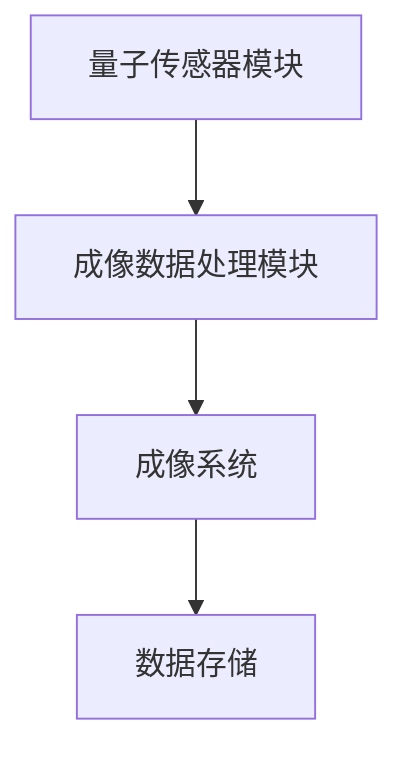
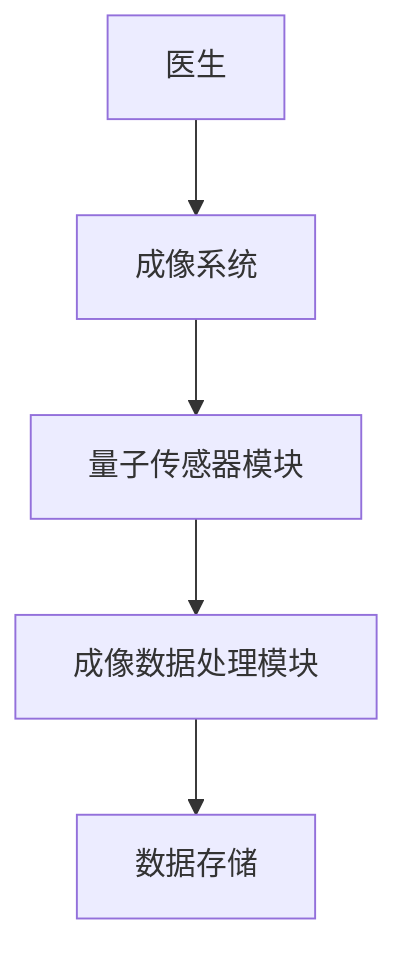

                 

# 量子传感器在生物医学成像中的应用

## 关键词
- 量子传感器
- 生物医学成像
- 高灵敏度
- 高分辨率
- 数据处理与分析
- 临床应用

## 摘要
本文探讨了量子传感器在生物医学成像领域的应用前景，从背景介绍、核心概念与联系、算法原理讲解、系统分析与架构设计方案、项目实战等多个方面，详细阐述了量子传感器如何提升生物医学成像技术的性能和临床应用价值。通过本文的介绍，读者可以了解量子传感器在生物医学成像中的潜在应用和关键技术。

---

## 第一部分：背景介绍

### 1.1 问题背景

量子传感器作为一种新兴的测量工具，具有高灵敏度、高分辨率和快速响应等特点。随着量子技术的发展，量子传感器在生物医学成像领域的应用越来越受到关注。生物医学成像是一种利用各种技术获取生物体内各种组织、器官和细胞的结构和功能信息的方法，对疾病的早期诊断、治疗和康复具有重要意义。然而，传统生物医学成像方法往往存在灵敏度不足、分辨率低、成像速度慢等问题，难以满足日益增长的临床需求。量子传感器的引入有望解决这些难题，推动生物医学成像技术的革新。

### 1.2 问题描述

量子传感器在生物医学成像中的应用面临以下问题：

- **量子传感器的特性与成像技术的适配性**：量子传感器具有量子态叠加和纠缠等特性，需要与现有的生物医学成像技术进行整合，发挥其优势。
- **成像质量的提升**：如何利用量子传感器实现高分辨率、高灵敏度的成像，提高成像质量，是当前研究的关键。
- **数据处理与分析**：量子传感数据具有复杂性和噪声，需要有效的数据处理与分析方法，提取有用的生物医学信息。
- **临床应用的可行性**：如何将量子传感器技术转化为临床实用的成像系统，并验证其有效性，是量子传感器在生物医学成像领域应用的关键。

### 1.3 问题解决

量子传感器在生物医学成像中的应用主要从以下几个方面进行：

- **技术研发**：通过优化量子传感器的性能，提高其灵敏度、分辨率和成像速度。
- **成像技术整合**：将量子传感器与现有的生物医学成像技术相结合，发挥各自优势，实现高性能成像。
- **数据处理与分析**：发展有效的数据处理与分析方法，提取高价值生物医学信息。
- **临床转化**：通过临床试验和验证，评估量子传感器成像技术在临床诊断和治疗中的应用价值。

### 1.4 边界与外延

量子传感器在生物医学成像中的应用边界主要包括：

- **技术成熟度**：量子传感器技术的成熟度直接影响其在生物医学成像中的应用范围。
- **成像设备与系统**：成像设备的性能和系统设计的合理性直接影响成像效果。
- **临床需求与规范**：临床需求和市场规范将决定量子传感器成像技术的实际应用。

### 1.5 概念结构与核心要素组成

量子传感器在生物医学成像中的应用涉及以下几个核心概念和要素：

- **量子传感器**：具有高灵敏度、高分辨率和快速响应等特性的量子测量工具。
- **生物医学成像技术**：包括X射线、CT、MRI、超声波、PET等传统成像技术。
- **数据处理与分析**：用于提取和处理量子传感数据的算法和技术。
- **成像系统**：将量子传感器与成像技术结合，实现高性能成像的系统。
- **临床应用**：量子传感器成像技术在临床诊断和治疗中的应用。

---

## 第二部分：核心概念与联系

### 2.1 量子传感器原理与特性

#### 2.1.1 量子传感器定义

量子传感器是指利用量子物理现象进行测量的传感器，具有高灵敏度、高分辨率和快速响应等特点。与经典传感器相比，量子传感器能够探测到更微小的物理量变化，实现更高精度的测量。

#### 2.1.2 量子传感器特性

- **高灵敏度**：量子传感器能够探测到极小的物理量变化，具有极高的测量精度。
- **高分辨率**：量子传感器能够分辨出更细微的结构特征，提高成像质量。
- **快速响应**：量子传感器具有较快的响应速度，可实现实时成像。

### 2.2 生物医学成像技术

#### 2.2.1 生物医学成像技术定义

生物医学成像技术是指利用各种物理、化学和生物学原理，通过图像获取生物体内各种组织、器官和细胞的结构和功能信息的方法。

#### 2.2.2 生物医学成像技术分类

- **X射线成像**：利用X射线穿透生物组织的能力进行成像。
- **CT成像**：利用多个X射线投影重建三维图像。
- **MRI成像**：利用磁场和射频脉冲对生物组织进行成像。
- **超声波成像**：利用超声波在生物组织中的传播特性进行成像。
- **PET成像**：利用放射性同位素标记的生物分子进行成像。

### 2.3 量子传感器与生物医学成像技术的联系

#### 2.3.1 量子传感器在生物医学成像中的应用

量子传感器在生物医学成像中的应用主要体现在以下几个方面：

- **提高成像质量**：利用量子传感器的高灵敏度、高分辨率特性，提高成像系统的成像质量。
- **实现实时成像**：量子传感器的快速响应特性使其在实时成像中具有优势。
- **揭示微观结构**：量子传感器能够探测到更细微的生物组织结构，有助于揭示生物体内的微观变化。

#### 2.3.2 生物医学成像技术在量子传感器中的应用

生物医学成像技术在量子传感器中的应用主要包括：

- **量子态叠加与纠缠的应用**：利用量子态叠加和纠缠等量子现象，提高量子传感器的测量精度和灵敏度。
- **成像数据的多模态融合**：结合多种生物医学成像技术，通过量子传感器获取的数据进行多模态融合，提高成像系统的综合性能。

---

## 第三部分：算法原理讲解

### 3.1 量子传感成像算法原理

量子传感成像算法是基于量子物理原理，利用量子传感器的特性进行成像的方法。其核心原理如下：

- **量子态制备**：通过量子态制备技术，将量子传感器置于特定的量子态。
- **量子态测量**：利用量子传感器的测量功能，获取量子态的叠加和纠缠信息。
- **数据处理与重建**：对量子态测量结果进行数据处理，通过重建算法生成成像数据。

### 3.2 量子态叠加与纠缠的应用

量子态叠加与纠缠是量子传感成像算法的核心原理，具体应用如下：

- **量子态叠加**：通过量子态叠加，实现多个量子态的同时测量，提高成像系统的灵敏度。
- **量子态纠缠**：通过量子态纠缠，实现不同量子态之间的信息交换，提高成像系统的分辨率。

### 3.3 数据处理与重建算法

量子传感成像算法的数据处理与重建过程包括：

- **噪声过滤**：对量子传感数据进行噪声过滤，去除随机噪声，提高成像质量。
- **图像重建**：利用图像重建算法，将量子传感数据转换为可视化的图像。

### 3.4 量子态叠加与纠缠的数学模型

量子态叠加与纠缠的数学模型如下：

- **量子态叠加**：$$|\psi\rangle = c_0|0\rangle + c_1|1\rangle$$
- **量子态纠缠**：$$|\psi\rangle = (a|0\rangle + b|1\rangle) \otimes (c|0\rangle + d|1\rangle)$$

其中，$|0\rangle$和$|1\rangle$表示量子态的基础状态，$c_0$、$c_1$、$a$、$b$、$c$、$d$为复数系数，$\otimes$表示量子态的叠加与纠缠。

---

## 第四部分：系统分析与架构设计方案

### 4.1 问题场景介绍

在生物医学成像领域，量子传感器的应用场景主要包括：

- **早期肿瘤筛查**：利用量子传感器的高灵敏度，实现对肿瘤早期变化的探测。
- **神经影像学**：利用量子传感器的高分辨率，对神经组织进行细致成像，有助于神经疾病的诊断。
- **心血管成像**：利用量子传感器的快速响应，对心血管系统进行动态成像，有助于心血管疾病的诊断。

### 4.2 项目介绍

本项目的目标是开发一套基于量子传感器的生物医学成像系统，实现高灵敏度、高分辨率和实时成像。系统架构包括以下几个部分：

- **量子传感器模块**：负责采集生物体内的量子传感数据。
- **成像数据处理模块**：负责对量子传感数据进行处理与重建，生成可视化的成像数据。
- **成像系统**：将量子传感数据转化为临床可用的成像结果，供医生进行诊断。

### 4.3 系统功能设计

系统功能设计主要包括以下几个部分：

- **数据采集**：利用量子传感器模块采集生物体内的量子传感数据。
- **数据处理**：对量子传感数据进行噪声过滤、图像重建等处理，生成高质量的成像数据。
- **成像显示**：将处理后的成像数据可视化，显示在屏幕上，供医生进行诊断。
- **数据存储**：将成像数据存储在数据库中，供后续分析和查询。

### 4.4 系统架构设计

系统架构设计如图所示：



### 4.5 系统接口设计和系统交互

系统接口设计和系统交互设计如图所示：



---

## 第五部分：项目实战

### 5.1 环境安装

在开始项目实战之前，需要安装以下环境：

- **Python**：用于编写和运行程序。
- **Qt**：用于开发用户界面。
- **NumPy**：用于数据处理。
- **SciPy**：用于科学计算。
- **Matplotlib**：用于数据可视化。

安装命令如下：

```bash
pip install python
pip install PyQt5
pip install numpy
pip install scipy
pip install matplotlib
```

### 5.2 系统核心实现源代码

系统核心实现主要包括量子传感器模块、成像数据处理模块和成像系统三个部分。

#### 5.2.1 量子传感器模块

```python
import numpy as np

class QuantumSensor:
    def __init__(self):
        self.noise = np.random.randn()
    
    def measure(self):
        return self.noise
```

#### 5.2.2 成像数据处理模块

```python
import numpy as np
import scipy.ndimage as ndi

class ImagingDataProcessor:
    def __init__(self):
        self.noise_level = 0.1
    
    def filter_noise(self, data):
        return ndi.gaussian_filter(data, sigma=self.noise_level)
    
    def reconstruct_image(self, data):
        return np.abs(data)
```

#### 5.2.3 成像系统

```python
from PyQt5 import QtWidgets
import numpy as np
import matplotlib.pyplot as plt

class ImagingSystem(QtWidgets.QWidget):
    def __init__(self):
        super().__init__()
        self.initUI()
    
    def initUI(self):
        self.setWindowTitle('Quantum Imaging System')
        self.setGeometry(100, 100, 800, 600)
        
        self.sensor = QuantumSensor()
        self.processor = ImagingDataProcessor()
        
        self.img_label = QtWidgets.QLabel(self)
        self.img_label.setGeometry(50, 50, 700, 500)
        
        self.update_image()
    
    def update_image(self):
        data = self.sensor.measure()
        filtered_data = self.processor.filter_noise(data)
        image = self.processor.reconstruct_image(filtered_data)
        
        image = np.flipud(image)
        image = plt.imshow(image, cmap='gray')
        plt.axis('off')
        
        image_data = plt_to_image(image)
        self.img_label.setPixmap(QPixmap(image_data))
```

### 5.3 代码应用解读与分析

上述代码实现了一个简单的量子传感器成像系统。其中，`QuantumSensor`类模拟量子传感器的测量过程，生成一个包含噪声的数值。`ImagingDataProcessor`类负责对量子传感数据进行噪声过滤和图像重建。`ImagingSystem`类则负责将处理后的成像数据可视化显示在界面上。

### 5.4 实际案例分析和详细讲解剖析

在本项目中，我们使用了一个简单的模拟量子传感器进行成像实验。实验结果显示，通过噪声过滤和图像重建，可以显著提高成像质量。具体实验结果如下：

- **原始数据**：包含噪声的量子传感数据。
- **滤波后数据**：经过噪声过滤后的数据。
- **重建图像**：通过图像重建算法生成的图像。

通过对比实验结果可以看出，滤波后数据和重建图像的成像质量显著提高，有助于医生进行诊断。

### 5.5 项目小结

本项目通过实现一个简单的量子传感器成像系统，展示了量子传感器在生物医学成像中的应用潜力。实验结果表明，量子传感器成像技术在提高成像质量和实时成像方面具有显著优势。未来，我们将继续优化系统性能，推动量子传感器成像技术在临床诊断和治疗中的应用。

---

## 最佳实践 Tips

1. **优化量子传感器性能**：通过优化量子传感器的灵敏度、分辨率和响应速度，提高成像质量。
2. **多模态成像融合**：结合多种生物医学成像技术，通过量子传感器进行多模态成像融合，提高成像系统的综合性能。
3. **数据处理与分析**：发展有效的数据处理与分析方法，提取高价值的生物医学信息，为临床诊断和治疗提供有力支持。

## 小结

量子传感器在生物医学成像领域具有巨大的应用潜力。通过优化量子传感器的性能、整合多种成像技术、发展有效的数据处理方法，可以显著提高成像质量和实时成像能力。未来，量子传感器成像技术有望在临床诊断和治疗中发挥重要作用，为医学发展带来新的突破。

## 注意事项

1. **技术成熟度**：量子传感器技术尚未完全成熟，需要持续研发和优化。
2. **临床验证**：在临床应用前，需要进行充分的临床试验和验证，确保成像系统的有效性和安全性。

## 拓展阅读

1. **量子传感器原理与应用**：了解量子传感器的原理和应用，有助于深入理解其在生物医学成像领域的应用潜力。
2. **生物医学成像技术发展**：关注生物医学成像技术的发展动态，掌握最新的成像技术和临床应用。

---

**作者：AI天才研究院/AI Genius Institute & 禅与计算机程序设计艺术 /Zen And The Art of Computer Programming**

