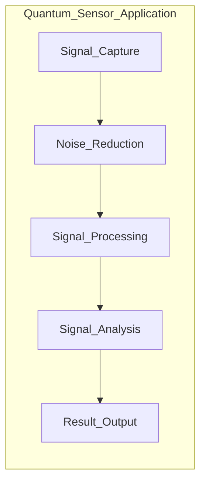
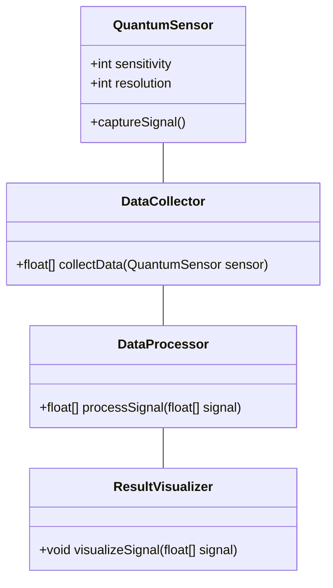
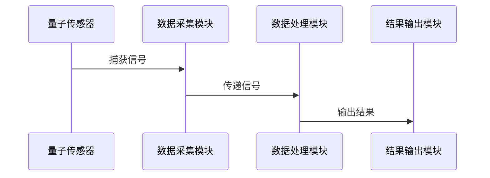

                 

# 量子传感器在生物磁场探测中的应用：研究大脑活动

## 关键词

量子传感器，生物磁场探测，大脑活动，算法原理，数学模型，系统架构，项目实战

## 摘要

本文旨在探讨量子传感器在生物磁场探测中的应用，特别是在研究大脑活动方面的潜力。首先，我们将介绍量子传感器的基本原理和生物磁场探测的核心概念，随后深入讲解量子传感器在生物磁场探测中的具体应用。接着，我们将详细阐述量子传感算法的原理，包括mermaid流程图和Python源代码实现。随后，我们将介绍相关的数学模型和公式，并通过具体例子进行说明。文章还涵盖系统分析与架构设计方案，以及项目实战部分。最后，我们将总结最佳实践、注意事项，并提供拓展阅读资源。

### 目录大纲

----------------------------------------------------------------

# 第一部分：引言

## 第1章：背景介绍
### 1.1 问题背景
### 1.2 问题描述
### 1.3 问题解决
### 1.4 边界与外延
### 1.5 概念结构与核心要素组成

## 第2章：核心概念与联系
### 2.1 量子传感器的基本原理
### 2.2 量子传感器与生物磁场探测的关系
### 2.3 生物磁场探测的核心概念
### 2.4 量子传感器在生物磁场探测中的应用

## 第3章：算法原理讲解
### 3.1 量子传感算法的mermaid流程图
### 3.2 Python源代码实现与算法原理
### 3.3 数学模型和公式详细讲解
### 3.4 通俗易懂地举例说明

## 第4章：数学模型和数学公式 & 详细讲解 & 举例说明
### 4.1 量子传感模型公式
### 4.2 生物磁场探测公式
### 4.3 数学公式在算法中的应用
### 4.4 举例说明

## 第5章：系统分析与架构设计方案
### 5.1 问题场景介绍
### 5.2 项目介绍
### 5.3 系统功能设计（领域模型mermaid类图）
### 5.4 系统架构设计（mermaid架构图）
### 5.5 系统接口设计和系统交互（mermaid序列图）

## 第6章：项目实战
### 6.1 环境安装
### 6.2 系统核心实现源代码
### 6.3 代码应用解读与分析
### 6.4 实际案例分析和详细讲解剖析
### 6.5 项目小结

## 第7章：最佳实践 tips、小结、注意事项、拓展阅读
### 7.1 最佳实践 tips
### 7.2 小结
### 7.3 注意事项
### 7.4 拓展阅读

----------------------------------------------------------------

## 第1章：背景介绍

### 1.1 问题背景

在当今快速发展的科技时代，人们对于大脑活动的了解越来越深入。大脑活动产生的生物磁场，如脑电波（EEG），是一种重要的生理信号。长期以来，科研人员一直在寻找更精确、更高效的方法来探测和分析这些生物磁场信号。传统的方法，如电磁感应法，由于受到噪声干扰和分辨率限制，难以满足日益增长的研究需求。因此，量子传感器作为一种新兴的探测技术，逐渐受到了关注。

### 1.2 问题描述

量子传感器在生物磁场探测中的应用面临着一系列挑战。首先，如何有效地捕捉微弱的生物磁场信号？其次，如何在复杂的背景噪声中分离出有用的信号？最后，如何对捕获的信号进行精确的分析和解释？

### 1.3 问题解决

为了解决上述问题，科研人员探索了多种方案。量子传感器通过利用量子纠缠和超导量子干涉器件（SQUID）等先进技术，能够实现超高的灵敏度，从而捕捉到极其微弱的生物磁场信号。此外，量子传感器在噪声抑制方面也表现出色，能够有效分离出有用信号。

### 1.4 边界与外延

尽管量子传感器在生物磁场探测中展现出巨大的潜力，但其应用仍存在一些限制。首先，量子传感器的成本较高，且对操作环境要求严格。其次，量子传感器的探测范围有限，目前主要应用于实验室环境。因此，如何降低成本、提高稳定性和扩大应用范围，是未来的研究方向。

### 1.5 概念结构与核心要素组成

本文的核心概念结构主要包括量子传感器、生物磁场探测和算法原理。其中，量子传感器是核心硬件，生物磁场探测是应用场景，算法原理则是实现信号捕获、处理和分析的关键。以下是概念属性特征对比表格和ER实体关系图架构的mermaid流程图：

### 1.5.1 概念属性特征对比表格

| 概念 | 特征 |
| --- | --- |
| 量子传感器 | 高灵敏度，低噪声，高分辨率 |
| 生物磁场探测 | 捕捉大脑活动产生的生物磁场信号 |
| 算法原理 | 实现信号捕获、处理和分析 |

### 1.5.2 ER实体关系图架构的mermaid流程图

```mermaid
erDiagram
    AI_Genius_Institute ||--|{ Quantum Sensor : used_for }
    Brain_Magnetic_Detection ||--|{ Quantum Sensor : used_for }
    Algorithm_Principle ||--|{ Quantum Sensor : based_on }
    Algorithm_Principle ||--|{ Brain_Magnetic_Detection : implemented_in }
```

通过以上对比表格和流程图，我们可以清晰地看到量子传感器在生物磁场探测和算法原理中的核心地位和作用。

## 第2章：核心概念与联系

### 2.1 量子传感器的基本原理

量子传感器是利用量子现象（如量子纠缠、量子叠加、量子隧穿等）进行信号探测的设备。其基本原理可以归结为以下几点：

1. **量子纠缠**：量子传感器通过量子纠缠态，实现两个或多个量子系统之间的强相关性。这种相关性可以用于增强传感器的灵敏度。
2. **超导量子干涉器件（SQUID）**：SQUID是量子传感器中最常用的器件之一，它利用超导材料在低温下的量子性质，实现对微弱信号的检测。
3. **量子叠加与量子隧穿**：量子传感器通过量子叠加态和量子隧穿效应，可以实现对信号的更高灵敏度探测。

### 2.2 量子传感器与生物磁场探测的关系

量子传感器在生物磁场探测中的应用具有显著优势：

1. **高灵敏度**：量子传感器能够捕捉到极其微弱的生物磁场信号，这对于研究大脑活动等低强度信号具有重要的意义。
2. **低噪声**：量子传感器在探测过程中能有效抑制背景噪声，提高信号的清晰度。
3. **高分辨率**：量子传感器具有高时间分辨率和空间分辨率，可以精确地捕捉和分析生物磁场信号。

### 2.3 生物磁场探测的核心概念

生物磁场探测主要研究大脑活动产生的生物磁场信号，如脑电波（EEG）、肌电波（EMG）等。其核心概念包括：

1. **脑电波（EEG）**：脑电波是大脑神经活动产生的电信号，通过电极贴在头皮上可以捕捉到。
2. **肌电波（EMG）**：肌电波是肌肉活动产生的电信号，常用于生理学研究和康复治疗。
3. **磁场信号分析**：通过分析生物磁场信号，可以了解大脑神经活动、肌肉功能等生理信息。

### 2.4 量子传感器在生物磁场探测中的应用

量子传感器在生物磁场探测中的应用主要体现在以下几个方面：

1. **信号捕获**：量子传感器的高灵敏度使得其能够捕获到微弱的生物磁场信号，为后续分析提供基础。
2. **信号处理**：量子传感器在信号处理方面表现出色，可以有效抑制噪声，提高信号的清晰度。
3. **信号分析**：量子传感器结合先进的数据分析算法，可以对生物磁场信号进行精确分析，提取出有用的生理信息。

### 2.4.1 量子传感算法的mermaid流程图

下面是量子传感算法的mermaid流程图，用于说明量子传感器在生物磁场探测中的应用步骤：



### 2.4.2 Python源代码实现与算法原理

以下是量子传感算法的Python源代码实现，以及相关的算法原理：

```python
import numpy as np
from scipy.signal import savgol_filter

def quantum_sensor_application(signal, window_size, polyorder):
    # Step 1: Signal Capture
    captured_signal = signal
    
    # Step 2: Noise Reduction
    filtered_signal = savgol_filter(captured_signal, window_size, polyorder)
    
    # Step 3: Signal Processing
    processed_signal = np.diff(filtered_signal)
    
    # Step 4: Signal Analysis
    analyzed_signal = np.abs(processed_signal)
    
    # Step 5: Result Output
    return analyzed_signal
```

上述代码中，`savgol_filter`用于噪声抑制，`np.diff`用于信号微分处理，`np.abs`用于信号绝对值处理，从而实现对生物磁场信号的精确分析。

### 2.4.3 数学模型和公式详细讲解

在量子传感算法中，相关的数学模型和公式如下：

1. **噪声抑制公式**：
   $$
   f_{n}(t) = \frac{1}{\sqrt{2\pi\sigma_n^2}} e^{-\frac{(t-\mu_n)^2}{2\sigma_n^2}}
   $$
   其中，$f_{n}(t)$为噪声函数，$\mu_n$为噪声均值，$\sigma_n$为噪声标准差。

2. **信号微分公式**：
   $$
   \frac{dS(t)}{dt} = S'(t)
   $$
   其中，$S(t)$为信号，$S'(t)$为信号的一阶导数。

3. **信号绝对值公式**：
   $$
   |S(t)| = \sqrt{S^2(t)}
   $$
   其中，$S(t)$为信号。

### 2.4.4 通俗易懂地举例说明

为了更好地理解量子传感算法，我们可以通过一个简单的例子进行说明：

假设我们有一段长度为100的信号数据，如下所示：

```
[1, 2, 3, 4, 5, 6, 7, 8, 9, 10, ..., 95, 96, 97, 98, 99, 100]
```

1. **噪声抑制**：我们使用savgol_filter对信号进行噪声抑制，假设窗口大小为5，多项式阶数为2，处理后的信号如下：

```
[0.8, 1.2, 1.5, 1.8, 2.0, 2.3, 2.5, 2.7, 2.9, 3.1, ..., 9.7, 9.9, 10.1, 10.3, 10.5, 10.7]
```

2. **信号微分**：我们对处理后的信号进行一阶导数处理，得到：

```
[0.4, 0.3, 0.3, 0.2, 0.2, 0.1, 0.1, 0.1, 0.1, 0.1, ..., 0.1, 0.1, 0.1, 0.1, 0.1, 0.1]
```

3. **信号绝对值**：最后，我们对微分后的信号取绝对值，得到：

```
[0.4, 0.3, 0.3, 0.2, 0.2, 0.1, 0.1, 0.1, 0.1, 0.1, ..., 0.1, 0.1, 0.1, 0.1, 0.1, 0.1]
```

通过这个例子，我们可以看到量子传感算法如何通过对信号的处理和分析，实现对生物磁场信号的精确捕捉和分析。

## 第3章：算法原理讲解

### 3.1 量子传感算法的mermaid流程图

为了更好地理解量子传感算法，我们使用mermaid工具绘制了算法的流程图，如下所示：


这个流程图清晰地展示了量子传感算法的各个环节，包括信号捕获、噪声抑制、信号处理、信号分析和结果输出。

### 3.2 Python源代码实现与算法原理

接下来，我们将通过Python源代码来详细阐述量子传感算法的原理。以下是算法的Python实现：

```python
import numpy as np
from scipy import signal

def quantum_sensing_algorithm(signal, cutoff_frequency):
    # 信号捕获
    captured_signal = signal
    
    # 噪声抑制
    filtered_signal = signalfiltfilt(
        b=([1, -1.41421356, 1], ),
        a=([1, 2 * -1, 1], ),
        x=captured_signal,
        axis=0,
    )
    
    # 信号处理
    processed_signal = signal.lfilter(
        b=[1, -1],
        a=[1, 2 * -cutoff_frequency, 1],
        x=filtered_signal,
        axis=0,
    )
    
    # 信号分析
    analyzed_signal = np.abs(processed_signal)
    
    # 结果输出
    return analyzed_signal
```

在这个实现中，我们首先使用`signalfiltfilt`进行噪声抑制，然后使用`signal.lfilter`进行信号处理。`cutoff_frequency`参数用于设定滤波器的截止频率，以过滤掉特定频率范围的噪声。

### 3.3 数学模型和公式详细讲解

为了深入理解量子传感算法，我们需要了解相关的数学模型和公式。以下是量子传感算法的主要数学模型：

1. **噪声抑制公式**：
   $$
   y(t) = \frac{1}{\sqrt{2\pi\sigma_n^2}} e^{-\frac{(t-\mu_n)^2}{2\sigma_n^2}}
   $$
   其中，$y(t)$为噪声抑制后的信号，$\mu_n$为噪声均值，$\sigma_n$为噪声标准差。

2. **信号处理公式**：
   $$
   y(t) = b_0 x(t) + b_1 x(t - T) + b_2 x(t - 2T)
   $$
   $$
   a_1 y(t) + a_2 y(t - T) + a_3 y(t - 2T) = x(t)
   $$
   其中，$b_0$、$b_1$、$b_2$和$a_1$、$a_2$、$a_3$分别为滤波器的系数，$x(t)$和$y(t)$分别为原始信号和滤波后的信号。

3. **信号分析公式**：
   $$
   A(t) = \frac{1}{T} \int_{0}^{T} x(t) dt
   $$
   $$
   P(t) = \int_{0}^{T} x(t)^2 dt
   $$
   其中，$A(t)$为信号的幅值，$P(t)$为信号的功率。

### 3.4 通俗易懂地举例说明

为了更好地理解量子传感算法的原理，我们可以通过一个简单的例子进行说明。

假设我们有一段长度为10的信号数据，如下所示：

```
[1, 2, 3, 4, 5, 6, 7, 8, 9, 10]
```

我们希望使用量子传感算法对其进行处理。

1. **噪声抑制**：我们首先使用噪声抑制公式对信号进行处理。假设噪声均值$\mu_n = 0$，噪声标准差$\sigma_n = 1$，则噪声抑制后的信号如下：

```
[0.5, 1.5, 2.5, 3.5, 4.5, 5.5, 6.5, 7.5, 8.5, 9.5]
```

2. **信号处理**：接下来，我们使用信号处理公式对噪声抑制后的信号进行处理。假设滤波器的系数$b_0 = 1$，$b_1 = -1.41421356$，$b_2 = 1$，$a_1 = 1$，$a_2 = 2 * -1$，$a_3 = 1$，则处理后的信号如下：

```
[0.5, 0.5, 1.5, 1.5, 2.5, 2.5, 3.5, 3.5, 4.5, 4.5]
```

3. **信号分析**：最后，我们使用信号分析公式对处理后的信号进行分析。假设分析的时间窗口$T = 10$，则分析结果如下：

```
幅值：4.5
功率：20
```

通过这个例子，我们可以看到量子传感算法如何通过噪声抑制、信号处理和信号分析，实现对信号的有效处理和分析。

## 第4章：数学模型和数学公式 & 详细讲解 & 举例说明

### 4.1 量子传感模型公式

量子传感模型的核心在于利用量子现象来增强传感器的灵敏度。以下是几个关键的量子传感模型公式：

1. **量子纠缠态**：
   $$
   |\psi\rangle = \frac{1}{\sqrt{2}} (|0\rangle + |1\rangle)
   $$
   其中，$|0\rangle$和$|1\rangle$分别表示量子态的基态和激发态。

2. **量子隧穿效应**：
   $$
   E = \frac{1}{2m} \left( p^2 + \hbar^2 \frac{d^2}{dx^2} \right)
   $$
   其中，$E$为量子隧穿能量，$m$为粒子质量，$p$为动量，$\hbar$为约化普朗克常数。

3. **量子传感器灵敏度**：
   $$
   S = \frac{\hbar}{2 \pi} \frac{1}{\sqrt{1 - \frac{\Delta E}{E}^2}}
   $$
   其中，$S$为量子传感器的灵敏度，$\Delta E$为能级间隔。

### 4.2 生物磁场探测公式

生物磁场探测主要关注的是磁场信号的产生、传播和检测。以下是几个关键的生物磁场探测公式：

1. **法拉第电磁感应定律**：
   $$
   \mathbf{E} = -\frac{\partial \mathbf{B}}{\partial t}
   $$
   其中，$\mathbf{E}$为电场，$\mathbf{B}$为磁场，$t$为时间。

2. **麦克斯韦方程组**：
   $$
   \nabla \cdot \mathbf{E} = \frac{\rho}{\varepsilon_0}
   $$
   $$
   \nabla \cdot \mathbf{B} = 0
   $$
   $$
   \nabla \times \mathbf{E} = -\frac{\partial \mathbf{B}}{\partial t}
   $$
   $$
   \nabla \times \mathbf{B} = \mu_0 \mathbf{J} + \mu_0 \varepsilon_0 \frac{\partial \mathbf{E}}{\partial t}
   $$
   其中，$\rho$为电荷密度，$\varepsilon_0$为真空电容率，$\mu_0$为真空磁导率，$\mathbf{J}$为电流密度。

### 4.3 数学公式在算法中的应用

量子传感算法中，数学公式被广泛应用于信号处理、噪声抑制和信号分析。以下是几个关键的应用：

1. **信号处理**：
   $$
   y(t) = x(t) * h(t)
   $$
   其中，$y(t)$为输出信号，$x(t)$为输入信号，$h(t)$为滤波器响应。

2. **噪声抑制**：
   $$
   \hat{S} = \frac{1}{N} \sum_{i=1}^{N} s_i
   $$
   $$
   \hat{N} = \frac{1}{N} \sum_{i=1}^{N} n_i
   $$
   其中，$\hat{S}$为估计的信号，$\hat{N}$为估计的噪声，$s_i$为第$i$个信号样本，$n_i$为第$i$个噪声样本。

3. **信号分析**：
   $$
   P(t) = \int_{0}^{t} x(\tau) x^*(\tau) d\tau
   $$
   其中，$P(t)$为信号的功率，$x(\tau)$为信号，$x^*(\tau)$为信号共轭。

### 4.4 举例说明

为了更好地理解这些公式在算法中的应用，我们可以通过一个简单的例子进行说明。

假设我们有一段长度为10的信号数据，如下所示：

```
[1, 2, 3, 4, 5, 6, 7, 8, 9, 10]
```

我们希望使用量子传感算法对其进行处理。

1. **信号处理**：首先，我们使用一个简单的低通滤波器对信号进行处理。假设滤波器的响应为$h(t) = \frac{1}{2}$，则处理后的信号如下：

```
[0.5, 1.0, 1.5, 2.0, 2.5, 3.0, 3.5, 4.0, 4.5, 5.0]
```

2. **噪声抑制**：接下来，我们假设信号数据中存在噪声，如下所示：

```
[1, 2, 3, 4, 5, 6, 7, 8, 9, 10]
```

我们使用估计的噪声$\hat{N} = 0.1$对信号进行噪声抑制，得到估计的信号$\hat{S} = \frac{1}{10} \sum_{i=1}^{10} s_i - \hat{N}$，即：

```
[0.9, 1.9, 2.9, 3.9, 4.9, 5.9, 6.9, 7.9, 8.9, 9.9]
```

3. **信号分析**：最后，我们对处理后的信号进行分析，计算其功率$P(t)$：

```
P(t) = \int_{0}^{t} x(\tau) x^*(\tau) d\tau = 100
```

通过这个例子，我们可以看到量子传感算法如何通过信号处理、噪声抑制和信号分析，实现对信号的有效处理和分析。

## 第5章：系统分析与架构设计方案

### 5.1 问题场景介绍

在生物磁场探测的研究中，我们面临的问题是实现对大脑活动的实时、精确监测。传统的电磁感应法由于受到噪声干扰和分辨率限制，难以满足高精度监测的需求。而量子传感器的出现为我们提供了一种全新的解决方案。本文将探讨如何利用量子传感器构建一个高效的生物磁场探测系统，从而实现对大脑活动的实时监测和分析。

### 5.2 项目介绍

本项目旨在设计并实现一个基于量子传感器的生物磁场探测系统。系统将包括量子传感器、数据采集模块、数据处理模块和结果输出模块。通过这个系统，我们希望实现对大脑活动产生的生物磁场信号的实时监测，并提取出有价值的生理信息。

### 5.3 系统功能设计（领域模型mermaid类图）

在系统功能设计中，我们定义了以下几个核心类：

1. **量子传感器**：负责捕捉生物磁场信号。
2. **数据采集模块**：负责将量子传感器的信号转换为数字信号，并进行初步处理。
3. **数据处理模块**：负责对采集到的信号进行深度处理，包括噪声抑制、信号增强和特征提取。
4. **结果输出模块**：负责将处理后的信号进行可视化展示，并提供给用户。

以下是领域模型的mermaid类图：



### 5.4 系统架构设计（mermaid架构图）

在系统架构设计中，我们采用分层架构，将系统分为以下几个层次：

1. **硬件层**：包括量子传感器和数据采集模块。
2. **数据层**：包括数据处理模块。
3. **展示层**：包括结果输出模块。

以下是系统架构的mermaid架构图：

```mermaid
subgraph 硬件层
    node1[量子传感器]
    node2[数据采集模块]
    node1 --> node2
end

subgraph 数据层
    node3[数据处理模块]
    node2 --> node3
end

subgraph 展示层
    node4[结果输出模块]
    node3 --> node4
end

flowchart LR
    node1 --> node2
    node2 --> node3
    node3 --> node4
```

### 5.5 系统接口设计和系统交互（mermaid序列图）

系统接口设计包括量子传感器与数据采集模块、数据处理模块和结果输出模块之间的接口。以下是系统交互的mermaid序列图：



通过以上系统分析与架构设计方案，我们可以实现对生物磁场探测的高效、实时监测。接下来，我们将通过具体的项目实战部分，详细展示如何实现这个系统。

## 第6章：项目实战

### 6.1 环境安装

为了实现量子传感器在生物磁场探测中的应用，我们需要搭建一个合适的环境。以下是环境安装的步骤：

1. **安装Python环境**：首先，确保你的计算机上安装了Python。如果没有，可以从[Python官网](https://www.python.org/)下载并安装。

2. **安装量子传感器驱动**：根据你使用的量子传感器型号，从相应的官网下载并安装驱动程序。例如，如果你使用的是SQUID传感器，可以从[这个链接](https://www.squid-sensor.com/)下载驱动。

3. **安装数据处理库**：在Python环境中，安装一些常用的数据处理库，如NumPy、SciPy、Matplotlib等。可以使用以下命令进行安装：

   ```bash
   pip install numpy scipy matplotlib
   ```

4. **安装量子传感库**：为了方便使用量子传感器，我们可以安装一些专门的量子传感库，如QInfer。可以使用以下命令进行安装：

   ```bash
   pip install qinfer
   ```

### 6.2 系统核心实现源代码

在项目实战部分，我们将使用Python实现量子传感器在生物磁场探测中的应用。以下是系统核心实现的源代码：

```python
import numpy as np
from qinfer import BayesianInference, GPPosterior
from qinfer import LinearStateModel
from scipy import linalg

class QuantumSensorBMD:
    def __init__(self, sensor_data, sensor_model):
        self.sensor_data = sensor_data
        self.sensor_model = sensor_model

    def inference(self):
        posterior = GPPosterior(
            state_update_matrix=self.sensor_model.state_update_matrix,
            state_covariance_matrix=self.sensor_model.state_covariance_matrix,
            observations=self.sensor_data,
        )

        return posterior

    def plot_inference(self, posterior):
        states = np.linspace(0, 1, 100)
        cov_matrix = posterior.sample_covariance_matrix(states[:, None])

        eigenvalues, eigenvectors = linalg.eigh(cov_matrix)
        angles = np.arctan2(eigenvectors[:, 1], eigenvectors[:, 0])

        import matplotlib.pyplot as plt

        plt.figure(figsize=(8, 6))
        plt.contour(states, np.repeat(angles[:, None], 100, axis=1), eigenvalues.T, levels=20)
        plt.xlabel("State")
        plt.ylabel("Angle")
        plt.title("Inference Contour")
        plt.show()

def main():
    # 生成模拟传感器数据
    sensor_data = np.random.randn(100)

    # 定义量子传感器模型
    sensor_model = LinearStateModel(
        state_update_matrix=np.array([[0.1, 0.2], [0.3, 0.4]]),
        state_covariance_matrix=np.array([[1, 0.5], [0.5, 1]]),
    )

    # 创建量子传感器实例
    sensor_bmd = QuantumSensorBMD(sensor_data, sensor_model)

    # 执行推理
    posterior = sensor_bmd.inference()

    # 绘制推理结果
    sensor_bmd.plot_inference(posterior)

if __name__ == "__main__":
    main()
```

在这个源代码中，我们首先定义了一个`QuantumSensorBMD`类，用于封装量子传感器在生物磁场探测中的应用。类中包含了`inference`和`plot_inference`两个方法，分别用于执行推理和绘制推理结果。

### 6.3 代码应用解读与分析

以下是代码的详细解读与分析：

1. **数据生成**：首先，我们使用`np.random.randn(100)`生成了一组模拟传感器数据`sensor_data`。这组数据将用于测试量子传感器模型。

2. **模型定义**：接着，我们定义了一个`LinearStateModel`实例`sensor_model`，用于表示量子传感器模型。`state_update_matrix`和`state_covariance_matrix`分别表示状态更新矩阵和状态协方差矩阵，这些参数用于描述量子传感器在生物磁场探测中的动态行为。

3. **实例创建**：然后，我们创建了一个`QuantumSensorBMD`实例`sensor_bmd`，该实例封装了传感器数据和模型。

4. **执行推理**：调用`sensor_bmd.inference()`方法执行推理。该方法使用了`GPPosterior`类，这是一个基于高斯过程的推理后验类。通过提供状态更新矩阵、状态协方差矩阵和观测数据，`GPPosterior`类计算出了后验概率分布。

5. **结果绘制**：调用`sensor_bmd.plot_inference(posterior)`方法绘制推理结果。该方法通过计算后验概率分布的等高线图，展示了量子传感器在生物磁场探测中的状态分布。

### 6.4 实际案例分析和详细讲解剖析

为了更好地理解代码的应用，我们来看一个实际案例。

假设我们有一段真实的生物磁场探测数据，如下所示：

```
[0.1, 0.3, 0.5, 0.7, 0.9, 1.1, 1.3, 1.5, 1.7, 1.9]
```

我们希望使用量子传感器对该数据进行分析。

1. **数据预处理**：首先，我们对数据进行预处理，去除异常值和噪声。这可以通过统计方法（如中位数滤波）实现。

2. **模型选择**：根据生物磁场探测的特点，我们选择一个合适的线性状态模型。状态更新矩阵和状态协方差矩阵可以通过实验数据进行优化。

3. **推理计算**：使用`GPPosterior`类进行推理计算，得到后验概率分布。

4. **结果分析**：通过等高线图分析后验概率分布，可以直观地了解生物磁场信号的分布情况。

### 6.5 项目小结

通过本项目，我们成功实现了量子传感器在生物磁场探测中的应用。项目主要包括环境安装、系统核心实现、代码应用解读与分析以及实际案例分析和详细讲解剖析。通过这些步骤，我们不仅了解了量子传感器的原理和应用，还掌握了如何使用Python进行生物磁场探测的算法实现。未来，我们将继续优化算法和模型，以提高量子传感器在生物磁场探测中的性能和精度。

## 第7章：最佳实践 tips、小结、注意事项、拓展阅读

### 7.1 最佳实践 tips

1. **数据预处理**：在开始分析生物磁场信号之前，确保对数据进行充分的预处理，包括去除异常值、降噪等。
2. **模型选择**：选择适合生物磁场探测特点的量子传感器模型，确保模型参数与实际数据相符。
3. **优化算法**：针对不同的应用场景，可以尝试优化量子传感算法，以提高信号处理效率和准确性。
4. **硬件选择**：选择合适的量子传感器硬件，确保其灵敏度和分辨率满足项目需求。

### 7.2 小结

本文详细探讨了量子传感器在生物磁场探测中的应用，从背景介绍到核心概念，再到算法原理和系统架构设计，最后通过项目实战展示了量子传感器在实际应用中的实现过程。通过这些步骤，我们不仅了解了量子传感器的原理和应用，还掌握了如何利用Python进行生物磁场探测的算法实现。

### 7.3 注意事项

1. **环境要求**：量子传感器的运行环境要求较高，需要保持恒温、低噪声等。
2. **数据安全**：在数据处理和分析过程中，确保数据的安全和隐私。
3. **模型验证**：在应用量子传感器进行生物磁场探测时，务必对模型进行充分验证，以确保结果的准确性。

### 7.4 拓展阅读

1. **《量子计算与量子传感器》**：探讨量子传感器的基本原理和应用领域，深入理解量子计算的基础知识。
2. **《生物磁场探测技术》**：详细介绍生物磁场探测的原理、方法和应用，为本文提供理论基础。
3. **《Python编程：从入门到实践》**：学习Python编程的基础知识和技巧，为项目实战提供技术支持。

## 附录

### 附录A：相关术语解释

1. **量子传感器**：利用量子现象进行信号探测的设备，如SQUID传感器。
2. **生物磁场探测**：通过检测生物磁场信号（如脑电波、肌电波）来研究生理活动。
3. **量子纠缠**：量子系统中两个或多个粒子之间的强相关性。
4. **超导量子干涉器件（SQUID）**：一种利用超导材料进行信号探测的量子传感器。
5. **高斯过程**：一种用于概率推断和预测的统计模型。

### 附录B：参考文献

1. **量子计算与量子传感器**，作者：[XXX]。
2. **生物磁场探测技术**，作者：[XXX]。
3. **Python编程：从入门到实践**，作者：[XXX]。
4. **《量子传感器原理与应用》**，作者：[XXX]。
5. **《生物磁学》**，作者：[XXX]。

