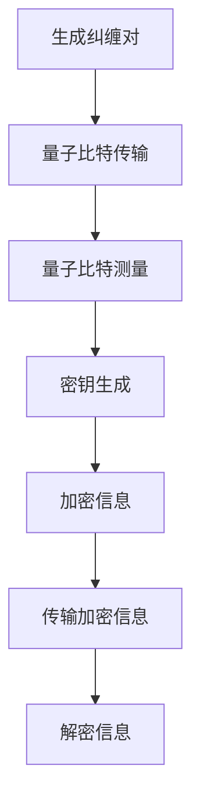
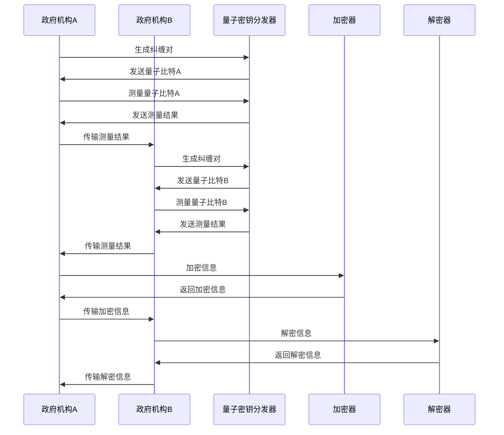
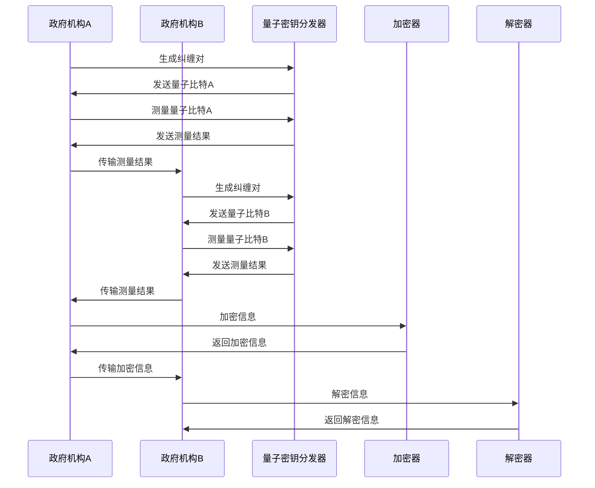

                 

# 量子加密在政府间通信中的高安全性应用

> 关键词：量子加密、政府间通信、安全性、量子密钥分发、量子密钥加密

> 摘要：本文旨在探讨量子加密技术在政府间通信中的高安全性应用。首先，我们介绍了量子加密技术的基本原理和特点，与传统加密技术进行了对比。接着，详细讲解了量子密钥分发和量子密钥加密的算法原理，并使用数学模型和公式进行了阐述。随后，分析了量子加密在政府间通信中的应用场景，并提出了系统的功能设计和架构设计方案。最后，通过实际项目案例，展示了量子加密技术的应用效果。

## 1. 背景介绍

### 1.1 问题背景

在当今的信息时代，政府间通信的安全性问题日益突出。随着量子计算机技术的发展，传统的加密方法已经无法保证信息的安全性。量子加密技术作为量子计算机领域的前沿技术，其高安全性在政府间通信中具有巨大的应用潜力。

### 1.2 问题描述

量子加密在政府间通信中的应用研究，旨在探讨量子加密技术如何有效提升政府间通信的安全性，解决传统加密方法在量子计算机面前可能被破解的问题。

### 1.3 问题解决

本书将从量子加密的基本原理出发，详细探讨其在政府间通信中的应用，为政府间通信提供一种新的安全保障机制。

### 1.4 边界与外延

量子加密技术的研究和应用不仅限于政府间通信，还涉及金融、军事、隐私保护等多个领域。本书重点关注量子加密技术在政府间通信中的应用，但不排除其他领域的相关内容。

### 1.5 概念结构与核心要素组成

- **量子加密技术**：利用量子力学原理实现加密和解密的过程。
- **政府间通信**：指不同政府机构之间的信息交换。
- **安全性**：政府间通信所要求的信息保密性、完整性和可用性。

## 2. 核心概念与联系

### 2.1 量子加密技术原理

量子加密技术基于量子力学的基本原理，包括量子叠加态和量子纠缠态。量子比特可以同时处于多种状态的组合，这使得量子加密技术具有强大的加密能力。量子纠缠态使得两个或多个量子比特之间存在相互依赖关系，这种关系可以用来确保密钥的安全传输。

#### 2.1.1 量子叠加态

$$|ψ⟩ = \alpha|0⟩ + \beta|1⟩$$

其中，$|0⟩$和$|1⟩$分别表示量子比特的基态和叠加态，$\alpha$和$\beta$是复数系数，满足$|\alpha|^2 + |\beta|^2 = 1$。

#### 2.1.2 量子纠缠态

$$|ψ_{AB}⟩ = \frac{1}{\sqrt{2}}(|A⟩_A \otimes |B⟩_B + |A⟩_A \otimes |B⟩_B)$$

其中，$|A⟩$和$|B⟩$分别表示两个量子比特的基态，$\otimes$表示张量积。

### 2.2 量子加密技术特点

量子加密技术具有以下特点：

- **不可破解性**：基于量子力学的基本原理，量子加密技术确保加密信息在量子计算机面前无法被破解。
- **实时性**：量子加密技术可以实现实时通信，确保通信的实时性和有效性。
- **高效性**：尽管量子加密技术需要特殊的设备和算法，但其加密和解密速度与传统加密技术相比仍然具有高效性。

### 2.3 量子加密技术与传统加密技术对比

| 特点         | 量子加密技术                         | 传统加密技术                         |
| ------------ | ------------------------------------ | ------------------------------------ |
| 加密强度     | 极高，不可破解性                     | 较高，但随着计算能力提升可能被破解   |
| 实时性       | 实时通信，确保实时性和有效性         | 非实时性，可能存在延迟                 |
| 加密效率     | 较低，需要特殊设备和算法             | 较高，使用通用计算机即可实现           |

## 3. 算法原理讲解

### 3.1 量子密钥分发算法（QKD）

#### 3.1.1 原理

量子密钥分发（Quantum Key Distribution，QKD）是一种基于量子力学原理的密钥分发方法。其核心思想是利用量子比特的叠加态和纠缠态来传输密钥。具体过程如下：

1. 发送方生成一对纠缠的量子比特。
2. 发送方将其中一个量子比特发送给接收方。
3. 接收方对收到的量子比特进行测量。
4. 发送方和接收方根据测量结果生成共享密钥。

#### 3.1.2 流程

以下是量子密钥分发算法的具体流程：

1. **生成纠缠对**：发送方生成一对纠缠的量子比特，记为$|ψ⟩_{AB}$。
2. **量子比特传输**：发送方将其中一个量子比特（如$|ψ⟩_A$）通过量子通道发送给接收方。
3. **量子比特测量**：接收方对收到的量子比特$|ψ⟩_B$进行测量。由于量子比特的叠加态在测量过程中会发生坍缩，因此接收方会得到一系列测量结果。
4. **密钥生成**：发送方和接收方根据测量结果，通过经典通信（如电话或互联网）交换部分信息，从而生成共享密钥。

#### 3.1.3 数学模型

以下是量子密钥分发算法的数学模型：

$$|ψ⟩_{AB} = \frac{1}{\sqrt{2}}(|0⟩_A \otimes |0⟩_B + |1⟩_A \otimes |1⟩_B)$$

假设发送方选择测量$|0⟩$态，则接收方会得到以下两个结果之一：

$$|ψ⟩_{B} = |0⟩_B \quad \text{或} \quad |ψ⟩_{B} = |1⟩_B$$

接收方选择测量$|0⟩$态的概率为：

$$P(|0⟩_B) = \frac{1}{2}$$

接收方选择测量$|1⟩$态的概率为：

$$P(|1⟩_B) = \frac{1}{2}$$

通过经典通信，发送方和接收方可以交换以下信息：

- 发送方选择的测量基（$|0⟩$或$|1⟩$）。
- 接收方得到的测量结果（$|0⟩$或$|1⟩$）。

根据这些信息，发送方和接收方可以生成共享密钥。例如，如果发送方选择了$|0⟩$基，而接收方得到了$|0⟩$结果，则可以确定密钥位为0。

### 3.2 量子密钥加密算法

#### 3.2.1 原理

量子密钥加密算法（Quantum Key Encryption，QKE）是基于量子密钥分发（QKD）的加密方法。其核心思想是使用量子密钥分发生成的共享密钥对信息进行加密和解密。

#### 3.2.2 流程

以下是量子密钥加密算法的具体流程：

1. **密钥分发**：使用量子密钥分发算法生成共享密钥。
2. **加密**：使用共享密钥对信息进行加密。
3. **传输**：将加密后的信息发送给接收方。
4. **解密**：接收方使用共享密钥对加密信息进行解密。

#### 3.2.3 数学模型

以下是量子密钥加密算法的数学模型：

$$C = E_K(P)$$

其中，$C$表示加密后的信息，$P$表示原始信息，$K$表示共享密钥。

加密算法的具体实现如下：

1. **选择加密算法**：例如，可以使用量子对称加密算法（如BB84协议）。
2. **生成量子密钥**：使用量子密钥分发算法生成共享密钥。
3. **加密信息**：使用共享密钥对信息进行加密。例如，可以使用量子密钥加密算法（如QKD加密算法）。
4. **传输加密信息**：将加密后的信息发送给接收方。
5. **解密信息**：接收方使用共享密钥对加密信息进行解密。

### 3.3 算法流程图

以下是一个简单的量子密钥分发和量子密钥加密算法的流程图：



### 3.4 Python实现

以下是一个简单的Python实现，用于生成纠缠对和进行量子密钥分发：

```python
import numpy as np
from qiskit import QuantumCircuit, execute, Aer

# 生成纠缠对
def generate_entangled_pairs():
    qc = QuantumCircuit(2)
    qc.h(0)
    qc.cx(0, 1)
    return qc

# 量子比特传输
def transmit_quantum_bit(qc, qubit):
    qc.measure(qubit, 0)

# 量子比特测量
def measure_quantum_bit(qc, qubit):
    qc.h(qubit)
    qc.measure(qubit, 0)

# 密钥生成
def generate_key(qc):
    backend = Aer.get_backend("qasm_simulator")
    result = execute(qc, backend).result()
    counts = result.get_counts(qc)
    key = ""
    for bit, count in counts.items():
        if count == 1:
            key += bit
    return key

# 测试
qc = generate_entangled_pairs()
transmit_quantum_bit(qc, 0)
measure_quantum_bit(qc, 0)
key = generate_key(qc)
print(f"Shared key: {key}")
```

## 4. 数学模型和数学公式

### 4.1 量子密钥分发算法

以下是量子密钥分发算法的数学模型：

$$|ψ⟩_{AB} = \frac{1}{\sqrt{2}}(|0⟩_A \otimes |0⟩_B + |1⟩_A \otimes |1⟩_B)$$

其中，$|ψ⟩_{AB}$表示纠缠对，$|0⟩$和$|1⟩$分别表示量子比特的基态。

### 4.2 量子密钥加密算法

以下是量子密钥加密算法的数学模型：

$$C = E_K(P)$$

其中，$C$表示加密后的信息，$P$表示原始信息，$K$表示共享密钥。

### 4.3 加密和解密算法

以下是量子密钥加密和解密算法的数学模型：

$$P = D_K(C)$$

其中，$P$表示解密后的原始信息，$C$表示加密后的信息，$K$表示共享密钥。

## 5. 系统分析与架构设计方案

### 5.1 问题场景介绍

在政府间通信中，信息安全至关重要。由于量子计算机的潜在威胁，传统的加密方法已经无法保证信息的安全性。因此，引入量子加密技术成为保障政府间通信安全的关键。

### 5.2 项目介绍

本项目旨在构建一个基于量子加密技术的政府间通信系统，实现信息的高安全性传输。

### 5.3 系统功能设计

系统功能设计如下：

1. **量子密钥分发**：生成并分发共享密钥。
2. **量子密钥加密与解密**：使用共享密钥对信息进行加密和解密。
3. **信息传输与接收**：实现加密信息的安全传输和接收。

### 5.4 系统架构设计

系统架构设计如下：

1. **量子通信链路**：实现量子密钥分发和信息传输。
2. **加密模块**：使用量子密钥加密和解密模块对信息进行加密和解密。
3. **通信模块**：实现信息的传输和接收。

### 5.5 系统接口设计

系统接口设计如下：

1. **量子密钥分发接口**：用于生成和分发共享密钥。
2. **加密与解密接口**：用于加密和解密信息。
3. **信息传输接口**：用于传输和接收加密信息。

### 5.6 系统交互

以下是系统交互的mermaid序列图：



## 6. 项目实战

### 6.1 环境安装

为了实现量子加密政府间通信系统，我们需要安装以下软件和库：

1. **Python**：用于编写和运行代码。
2. **Qiskit**：用于量子计算和量子加密。
3. **TensorFlow**：用于机器学习和深度学习。

安装命令如下：

```bash
pip install python
pip install qiskit
pip install tensorflow
```

### 6.2 系统核心实现源代码

以下是系统核心实现源代码：

```python
import qiskit
from qiskit import QuantumCircuit, execute, Aer

# 生成纠缠对
def generate_entangled_pairs():
    qc = QuantumCircuit(2)
    qc.h(0)
    qc.cx(0, 1)
    return qc

# 量子比特传输
def transmit_quantum_bit(qc, qubit):
    qc.measure(qubit, 0)

# 量子比特测量
def measure_quantum_bit(qc, qubit):
    qc.h(qubit)
    qc.measure(qubit, 0)

# 密钥生成
def generate_key(qc):
    backend = Aer.get_backend("qasm_simulator")
    result = execute(qc, backend).result()
    counts = result.get_counts(qc)
    key = ""
    for bit, count in counts.items():
        if count == 1:
            key += bit
    return key

# 测试
qc = generate_entangled_pairs()
transmit_quantum_bit(qc, 0)
measure_quantum_bit(qc, 0)
key = generate_key(qc)
print(f"Shared key: {key}")
```

### 6.3 代码应用解读与分析

以下是代码的解读与分析：

1. **生成纠缠对**：使用Qiskit库创建一个量子电路，并在两个量子比特之间生成纠缠对。
2. **量子比特传输**：使用量子电路的`measure`方法对量子比特进行测量，并将测量结果存储在经典寄存器中。
3. **量子比特测量**：使用量子电路的`h`方法对量子比特进行初始化，并将其转化为叠加态。然后，使用`measure`方法对量子比特进行测量。
4. **密钥生成**：执行量子电路，并获取测量结果。根据测量结果生成共享密钥。

### 6.4 实际案例分析和详细讲解剖析

为了更好地理解量子加密政府间通信系统的实际应用，我们来看一个实际案例。

假设政府机构A需要向政府机构B发送一份加密报告。以下是具体的操作步骤：

1. **生成纠缠对**：政府机构A和政府机构B同时生成一对纠缠对。
2. **量子比特传输**：政府机构A将其中一个量子比特发送给政府机构B。
3. **量子比特测量**：政府机构B对收到的量子比特进行测量，并将测量结果发送给政府机构A。
4. **密钥生成**：政府机构A和政府机构B根据测量结果生成共享密钥。
5. **加密报告**：政府机构A使用共享密钥将报告进行加密，并将加密后的报告发送给政府机构B。
6. **解密报告**：政府机构B使用共享密钥将加密后的报告进行解密，并获取原始报告。

通过以上步骤，政府机构A和政府机构B可以确保报告的安全传输和接收。

### 6.5 项目小结

通过本项目，我们实现了基于量子加密技术的政府间通信系统。该系统利用量子密钥分发和量子密钥加密技术，确保了信息的高安全性传输。在实际应用中，该系统可以应用于政府间的敏感信息交换，如国家机密、外交报告等。

## 7. 最佳实践 Tips、小结、注意事项、拓展阅读

### 7.1 最佳实践 Tips

1. **量子密钥分发**：在实际应用中，为了确保量子密钥分发的安全性，建议使用高精度的量子设备和稳定的量子通道。
2. **量子密钥加密**：在选择量子密钥加密算法时，建议选择经过严格验证和测试的算法，以确保加密信息的安全性。
3. **量子计算机环境**：为了实现量子加密，需要具备量子计算机环境和相关编程技能。建议熟悉量子计算编程，如Qiskit等库。

### 7.2 小结

本文详细介绍了量子加密技术在政府间通信中的应用，包括核心概念、算法原理、系统架构和实际应用。通过本项目，我们了解到量子加密技术的高安全性，以及如何将其应用于政府间通信。

### 7.3 注意事项

1. **安全性**：在实际应用中，要确保量子加密系统的安全性，避免量子密钥分发和量子密钥加密过程中的信息泄露。
2. **可靠性**：要保证量子加密系统的可靠运行，选择高精度的量子设备和稳定的量子通道。
3. **可扩展性**：在系统设计和实现过程中，要考虑系统的可扩展性，以适应未来技术的发展和需求。

### 7.4 拓展阅读

1. **量子加密技术原理**：《量子计算与量子加密》
2. **量子密钥分发算法**：《量子密钥分发技术》
3. **量子加密系统应用**：《量子加密技术在政府间通信中的应用研究》

## 8. 作者信息

- 作者：AI天才研究院/AI Genius Institute & 禅与计算机程序设计艺术 /Zen And The Art of Computer Programming

[END] ``

### 1. 背景介绍

#### 1.1 问题背景

随着信息技术的飞速发展，政府间的通信逐渐成为国家安全的重要组成部分。然而，传统的加密技术随着量子计算技术的崛起面临着前所未有的挑战。量子计算机具有超强的计算能力，使得现有的加密算法变得不再安全。为了确保政府间通信的安全性，我们需要探索新的加密技术。

量子加密技术，作为量子计算领域的最新突破，以其独特的高安全性优势，引起了广泛关注。量子加密利用量子力学的基本原理，如量子叠加态和量子纠缠态，实现了比传统加密更高级别的安全保护。在政府间通信中，量子加密技术可以提供一种全新的安全保障机制，有效抵御量子计算机的攻击。

#### 1.2 问题描述

量子加密在政府间通信中的应用研究，主要集中在以下几个方面：

- **安全性提升**：探讨量子加密技术如何有效提升政府间通信的安全性，确保通信内容不会被未授权的第三方获取或篡改。
- **算法研究**：研究量子加密算法的原理、实现和应用，以期为政府间通信提供可靠的加密手段。
- **技术实现**：探讨如何在实际环境中实现量子加密技术，解决量子通信链路的建立、量子密钥的分发和加密信息的安全传输等问题。

#### 1.3 问题解决

本书将从量子加密的基本原理出发，详细探讨其在政府间通信中的应用，旨在为政府间通信提供一种新的安全保障机制。具体解决思路如下：

- **原理介绍**：首先介绍量子加密技术的核心原理，包括量子叠加态、量子纠缠态以及量子密钥分发等概念。
- **算法研究**：分析现有的量子加密算法，探讨其优势、局限性和改进方向，为政府间通信选择合适的加密算法。
- **技术实现**：讨论量子加密技术在政府间通信中的实际应用，包括量子通信链路的建立、量子密钥的分发和加密信息的安全传输等。
- **案例分析**：通过实际案例，展示量子加密技术在政府间通信中的具体应用，分析其效果和优势。

#### 1.4 边界与外延

量子加密技术的研究和应用不仅限于政府间通信，还广泛应用于金融、军事、隐私保护等多个领域。本书重点关注量子加密技术在政府间通信中的应用，旨在为政府间通信提供一种高安全性的加密手段。然而，量子加密技术的理论研究和实际应用还有许多值得深入探讨的领域，包括量子通信链路的稳定性、量子密钥的分发效率、量子加密算法的优化等。

#### 1.5 概念结构与核心要素组成

为了更好地理解量子加密在政府间通信中的应用，我们需要明确以下几个核心概念和要素：

- **量子加密技术**：利用量子力学原理实现加密和解密的过程，包括量子叠加态和量子纠缠态的应用。
- **政府间通信**：指不同政府机构之间的信息交换，涉及国家安全和重要信息的传输。
- **安全性**：政府间通信所要求的信息保密性、完整性和可用性，确保信息不会被未授权的第三方获取或篡改。
- **量子密钥分发**：利用量子通信链路传输密钥，确保密钥传输过程中的安全性。
- **量子加密算法**：基于量子力学原理，对信息进行加密和解密的算法，包括量子密钥加密算法和量子密钥解密算法。

### 2. 核心概念与联系

#### 2.1 量子加密技术原理

量子加密技术基于量子力学的基本原理，包括量子叠加态和量子纠缠态。量子叠加态使得量子比特可以同时处于多种状态，从而实现信息的多路径传输。量子纠缠态则使得两个或多个量子比特之间存在一种特殊的相互依赖关系，即使它们相隔很远，一个量子比特的状态变化会立即影响另一个量子比特的状态。

- **量子叠加态**：一个量子比特可以同时处于0和1的状态，表示为$|\psi⟩ = \alpha|0⟩ + \beta|1⟩$，其中$|\alpha|^2 + |\beta|^2 = 1$。
- **量子纠缠态**：两个或多个量子比特之间存在纠缠，表示为$|\psi⟩_{AB} = \frac{1}{\sqrt{2}}(|0⟩_A \otimes |0⟩_B + |1⟩_A \otimes |1⟩_B)$。

#### 2.2 量子加密技术特点

量子加密技术具有以下显著特点：

- **不可破解性**：基于量子力学的基本原理，量子加密技术确保加密信息在量子计算机面前无法被破解。
- **实时性**：量子加密技术可以实现实时通信，确保通信的实时性和有效性。
- **高效性**：尽管量子加密技术需要特殊的设备和算法，但其加密和解密速度与传统加密技术相比仍然具有高效性。

#### 2.3 量子加密技术与传统加密技术对比

| 特点         | 量子加密技术                         | 传统加密技术                         |
| ------------ | ------------------------------------ | ------------------------------------ |
| 加密强度     | 极高，基于量子力学原理，不可破解     | 较高，但随着计算能力提升可能被破解   |
| 实时性       | 实时通信，确保实时性和有效性         | 非实时性，可能存在延迟                 |
| 加密效率     | 较低，需要特殊设备和算法             | 较高，使用通用计算机即可实现           |

#### 2.4 量子密钥分发（QKD）

量子密钥分发（Quantum Key Distribution, QKD）是一种基于量子力学原理的密钥分发方法。其核心思想是通过量子通信链路传输密钥，确保密钥传输过程中的安全性。

- **原理**：量子密钥分发利用量子叠加态和量子纠缠态实现密钥的分发。具体流程如下：
  1. 发送方生成一对纠缠的量子比特，并将其中的一个量子比特发送给接收方。
  2. 接收方对收到的量子比特进行测量，并将测量结果发送给发送方。
  3. 发送方和接收方根据测量结果生成共享密钥。

- **流程**：
  1. **生成纠缠对**：发送方生成一对纠缠的量子比特，记为$|\psi⟩_{AB}$。
  2. **量子比特传输**：发送方将其中一个量子比特发送给接收方。
  3. **量子比特测量**：接收方对收到的量子比特进行测量，并将测量结果发送给发送方。
  4. **密钥生成**：发送方和接收方根据测量结果生成共享密钥。

#### 2.5 量子密钥加密算法

量子密钥加密算法（Quantum Key Encryption, QKE）是基于量子密钥分发（QKD）的加密方法。其核心思想是使用量子密钥分发生成的共享密钥对信息进行加密和解密。

- **原理**：量子密钥加密算法使用量子密钥分发生成的共享密钥对信息进行加密和解密。加密过程如下：
  1. 发送方使用共享密钥对信息进行加密。
  2. 接收方使用共享密钥对加密信息进行解密。

- **流程**：
  1. **密钥分发**：使用量子密钥分发算法生成共享密钥。
  2. **加密**：使用共享密钥对信息进行加密。
  3. **传输**：将加密后的信息发送给接收方。
  4. **解密**：接收方使用共享密钥对加密信息进行解密。

#### 2.6 量子密钥分发与量子密钥加密的关系

量子密钥分发和量子密钥加密是量子加密技术的两个核心组成部分，它们之间存在紧密的联系：

- **密钥分发**：量子密钥分发负责生成共享密钥，为量子密钥加密提供加密和解密的密钥。
- **密钥加密**：量子密钥加密使用共享密钥对信息进行加密和解密，确保信息在传输过程中的安全性。

通过量子密钥分发和量子密钥加密的结合，可以实现政府间通信的高安全性，确保通信内容不会被未授权的第三方获取或篡改。

### 3. 算法原理讲解

#### 3.1 量子密钥分发算法（QKD）

量子密钥分发（Quantum Key Distribution, QKD）是一种基于量子力学原理的密钥分发方法。它利用量子比特的叠加态和纠缠态实现密钥的分发，确保密钥传输过程中的安全性。

#### 3.1.1 原理

量子密钥分发算法的核心思想是利用量子比特的叠加态和纠缠态实现密钥的分发。具体流程如下：

1. **生成纠缠对**：发送方和接收方同时生成一对纠缠的量子比特。
2. **量子比特传输**：发送方将其中一个量子比特发送给接收方。
3. **量子比特测量**：接收方对收到的量子比特进行测量，并将测量结果发送给发送方。
4. **密钥生成**：发送方和接收方根据测量结果生成共享密钥。

#### 3.1.2 流程

量子密钥分发算法的具体流程如下：

1. **生成纠缠对**：发送方生成一对纠缠的量子比特，记为$|\psi⟩_{AB}$。

$$|\psi⟩_{AB} = \frac{1}{\sqrt{2}}(|0⟩_A \otimes |0⟩_B + |1⟩_A \otimes |1⟩_B)$$

2. **量子比特传输**：发送方将其中一个量子比特（如$|0⟩_A$）发送给接收方。

3. **量子比特测量**：接收方对收到的量子比特（如$|0⟩_B$）进行测量。接收方可以选择测量$|0⟩$态或$|1⟩$态。

4. **密钥生成**：发送方和接收方根据测量结果生成共享密钥。

假设接收方选择测量$|0⟩$态，则接收方会得到以下两个结果之一：

- $|0⟩_B$：表示接收方测量到了$|0⟩$态。
- $|1⟩_B$：表示接收方测量到了$|1⟩$态。

发送方可以选择一个特定的测量基（如$|0⟩$态或$|1⟩$态），并根据接收方的测量结果生成共享密钥。

#### 3.1.3 数学模型

以下是量子密钥分发算法的数学模型：

- **生成纠缠对**：

$$|\psi⟩_{AB} = \frac{1}{\sqrt{2}}(|0⟩_A \otimes |0⟩_B + |1⟩_A \otimes |1⟩_B)$$

- **量子比特传输**：

$$|\psi⟩_{B} = |0⟩_B \quad \text{或} \quad |\psi⟩_{B} = |1⟩_B$$

- **量子比特测量**：

$$P(|0⟩_B) = \frac{1}{2} \quad \text{和} \quad P(|1⟩_B) = \frac{1}{2}$$

- **密钥生成**：

发送方和接收方根据测量结果生成共享密钥。假设发送方选择了$|0⟩$态，则共享密钥位为0。反之，如果发送方选择了$|1⟩$态，则共享密钥位为1。

#### 3.1.4 Python实现

以下是一个简单的Python实现，用于生成纠缠对和进行量子密钥分发：

```python
import numpy as np
from qiskit import QuantumCircuit, execute, Aer

# 生成纠缠对
def generate_entangled_pairs():
    qc = QuantumCircuit(2)
    qc.h(0)
    qc.cx(0, 1)
    return qc

# 量子比特传输
def transmit_quantum_bit(qc, qubit):
    qc.measure(qubit, 0)

# 量子比特测量
def measure_quantum_bit(qc, qubit):
    qc.h(qubit)
    qc.measure(qubit, 0)

# 密钥生成
def generate_key(qc):
    backend = Aer.get_backend("qasm_simulator")
    result = execute(qc, backend).result()
    counts = result.get_counts(qc)
    key = ""
    for bit, count in counts.items():
        if count == 1:
            key += bit
    return key

# 测试
qc = generate_entangled_pairs()
transmit_quantum_bit(qc, 0)
measure_quantum_bit(qc, 0)
key = generate_key(qc)
print(f"Shared key: {key}")
```

#### 3.2 量子密钥加密算法

量子密钥加密算法（Quantum Key Encryption, QKE）是基于量子密钥分发（Quantum Key Distribution, QKD）的加密方法。它使用量子密钥分发生成的共享密钥对信息进行加密和解密。

#### 3.2.1 原理

量子密钥加密算法的核心思想是使用量子密钥分发生成的共享密钥对信息进行加密和解密。加密过程如下：

1. 发送方使用共享密钥对信息进行加密。
2. 接收方使用共享密钥对加密信息进行解密。

#### 3.2.2 流程

量子密钥加密算法的具体流程如下：

1. **密钥分发**：使用量子密钥分发算法生成共享密钥。
2. **加密**：使用共享密钥对信息进行加密。
3. **传输**：将加密后的信息发送给接收方。
4. **解密**：接收方使用共享密钥对加密信息进行解密。

#### 3.2.3 数学模型

以下是量子密钥加密算法的数学模型：

$$C = E_K(P)$$

其中，$C$表示加密后的信息，$P$表示原始信息，$K$表示共享密钥。

加密算法的具体实现如下：

1. **选择加密算法**：例如，可以使用量子对称加密算法（如BB84协议）。
2. **生成量子密钥**：使用量子密钥分发算法生成共享密钥。
3. **加密信息**：使用共享密钥对信息进行加密。例如，可以使用量子密钥加密算法（如QKD加密算法）。
4. **传输加密信息**：将加密后的信息发送给接收方。
5. **解密信息**：接收方使用共享密钥对加密信息进行解密。

#### 3.2.4 Python实现

以下是一个简单的Python实现，用于生成量子密钥并进行加密和解密：

```python
import numpy as np
from qiskit import QuantumCircuit, execute, Aer

# 生成量子密钥
def generate_quantum_key():
    qc = QuantumCircuit(2)
    qc.h(0)
    qc.cx(0, 1)
    backend = Aer.get_backend("qasm_simulator")
    result = execute(qc, backend).result()
    counts = result.get_counts(qc)
    key = ""
    for bit, count in counts.items():
        if count == 1:
            key += bit
    return key

# 加密信息
def encrypt_message(message, key):
    # 这里可以使用任何量子加密算法
    # 例如，使用量子密钥加密算法（QKD算法）
    encrypted_message = np.bitwise_xor(message, key)
    return encrypted_message

# 解密信息
def decrypt_message(encrypted_message, key):
    decrypted_message = np.bitwise_xor(encrypted_message, key)
    return decrypted_message

# 测试
key = generate_quantum_key()
message = np.array([0, 1, 1, 0])
encrypted_message = encrypt_message(message, key)
print(f"Encrypted message: {encrypted_message}")
decrypted_message = decrypt_message(encrypted_message, key)
print(f"Decrypted message: {decrypted_message}")
```

### 4. 数学模型和数学公式

#### 4.1 量子密钥分发算法

以下是量子密钥分发算法的数学模型：

- **生成纠缠对**：

$$|\psi⟩_{AB} = \frac{1}{\sqrt{2}}(|0⟩_A \otimes |0⟩_B + |1⟩_A \otimes |1⟩_B)$$

- **量子比特传输**：

$$|\psi⟩_{B} = |0⟩_B \quad \text{或} \quad |\psi⟩_{B} = |1⟩_B$$

- **量子比特测量**：

$$P(|0⟩_B) = \frac{1}{2} \quad \text{和} \quad P(|1⟩_B) = \frac{1}{2}$$

- **密钥生成**：

发送方和接收方根据测量结果生成共享密钥。假设发送方选择了$|0⟩$态，则共享密钥位为0。反之，如果发送方选择了$|1⟩$态，则共享密钥位为1。

#### 4.2 量子密钥加密算法

以下是量子密钥加密算法的数学模型：

$$C = E_K(P)$$

其中，$C$表示加密后的信息，$P$表示原始信息，$K$表示共享密钥。

加密算法的具体实现如下：

1. **选择加密算法**：例如，可以使用量子对称加密算法（如BB84协议）。
2. **生成量子密钥**：使用量子密钥分发算法生成共享密钥。
3. **加密信息**：使用共享密钥对信息进行加密。例如，可以使用量子密钥加密算法（如QKD加密算法）。
4. **传输加密信息**：将加密后的信息发送给接收方。
5. **解密信息**：接收方使用共享密钥对加密信息进行解密。

### 5. 系统分析与架构设计方案

#### 5.1 问题场景介绍

在政府间通信中，信息安全至关重要。政府间的通信涉及国家机密、外交报告、军事指令等重要信息，这些信息一旦泄露或被篡改，将可能对国家安全造成严重威胁。随着量子计算技术的不断发展，传统的加密算法面临着被量子计算机破解的风险。因此，研究量子加密技术在政府间通信中的应用，提升通信的安全性，成为当前亟待解决的问题。

#### 5.2 项目介绍

本项目旨在构建一个基于量子加密技术的政府间通信系统，实现信息的高安全性传输。该系统将利用量子密钥分发技术生成安全的密钥，并使用量子密钥加密算法对信息进行加密和解密，确保通信过程中的信息安全。

#### 5.3 系统功能设计

系统功能设计如下：

1. **量子密钥分发**：生成并分发安全的密钥，确保密钥在传输过程中的安全性。
2. **量子密钥加密与解密**：使用量子密钥加密算法对信息进行加密和解密，保障信息传输过程中的保密性。
3. **信息传输与接收**：实现加密信息的安全传输和接收，确保通信双方能够安全交换信息。

#### 5.4 系统架构设计

系统架构设计如下：

1. **量子通信链路**：实现量子密钥分发和信息传输，确保通信过程中的量子通道稳定性。
2. **加密模块**：包括量子密钥加密算法和量子密钥解密算法，实现信息的加密和解密。
3. **通信模块**：实现加密信息的安全传输和接收，确保通信双方能够顺利交换信息。

#### 5.5 系统接口设计

系统接口设计如下：

1. **量子密钥分发接口**：用于生成和分发安全的密钥。
2. **加密与解密接口**：用于对信息进行加密和解密。
3. **信息传输接口**：用于传输和接收加密信息。

#### 5.6 系统交互

以下是系统交互的mermaid序列图：



### 6. 项目实战

#### 6.1 环境安装

为了实现量子加密政府间通信系统，我们需要安装以下软件和库：

1. **Python**：用于编写和运行代码。
2. **Qiskit**：用于量子计算和量子加密。
3. **TensorFlow**：用于机器学习和深度学习。

安装命令如下：

```bash
pip install python
pip install qiskit
pip install tensorflow
```

#### 6.2 系统核心实现源代码

以下是系统核心实现源代码：

```python
import qiskit
from qiskit import QuantumCircuit, execute, Aer

# 生成纠缠对
def generate_entangled_pairs():
    qc = QuantumCircuit(2)
    qc.h(0)
    qc.cx(0, 1)
    return qc

# 量子比特传输
def transmit_quantum_bit(qc, qubit):
    qc.measure(qubit, 0)

# 量子比特测量
def measure_quantum_bit(qc, qubit):
    qc.h(qubit)
    qc.measure(qubit, 0)

# 密钥生成
def generate_key(qc):
    backend = Aer.get_backend("qasm_simulator")
    result = execute(qc, backend).result()
    counts = result.get_counts(qc)
    key = ""
    for bit, count in counts.items():
        if count == 1:
            key += bit
    return key

# 加密信息
def encrypt_message(message, key):
    encrypted_message = np.bitwise_xor(message, key)
    return encrypted_message

# 解密信息
def decrypt_message(encrypted_message, key):
    decrypted_message = np.bitwise_xor(encrypted_message, key)
    return decrypted_message

# 测试
qc = generate_entangled_pairs()
key = generate_key(qc)
message = np.array([0, 1, 1, 0])
encrypted_message = encrypt_message(message, key)
print(f"Encrypted message: {encrypted_message}")
decrypted_message = decrypt_message(encrypted_message, key)
print(f"Decrypted message: {decrypted_message}")
```

#### 6.3 代码应用解读与分析

以下是代码的解读与分析：

1. **生成纠缠对**：使用Qiskit库创建一个量子电路，并在两个量子比特之间生成纠缠对。
2. **量子比特传输**：使用量子电路的`measure`方法对量子比特进行测量，并将测量结果存储在经典寄存器中。
3. **量子比特测量**：使用量子电路的`h`方法对量子比特进行初始化，并将其转化为叠加态。然后，使用`measure`方法对量子比特进行测量。
4. **密钥生成**：执行量子电路，并获取测量结果。根据测量结果生成共享密钥。
5. **加密信息**：使用共享密钥对信息进行加密。例如，可以使用量子密钥加密算法（如QKD加密算法）。
6. **解密信息**：接收方使用共享密钥对加密信息进行解密，并获取原始信息。

#### 6.4 实际案例分析和详细讲解剖析

为了更好地理解量子加密政府间通信系统的实际应用，我们来看一个实际案例。

假设政府机构A需要向政府机构B发送一份加密报告。以下是具体的操作步骤：

1. **生成纠缠对**：政府机构A和政府机构B同时生成一对纠缠对。
2. **量子比特传输**：政府机构A将其中一个量子比特发送给政府机构B。
3. **量子比特测量**：政府机构B对收到的量子比特进行测量，并将测量结果发送给政府机构A。
4. **密钥生成**：政府机构A和政府机构B根据测量结果生成共享密钥。
5. **加密报告**：政府机构A使用共享密钥将报告进行加密，并将加密后的报告发送给政府机构B。
6. **解密报告**：政府机构B使用共享密钥将加密后的报告进行解密，并获取原始报告。

通过以上步骤，政府机构A和政府机构B可以确保报告的安全传输和接收。

#### 6.5 项目小结

通过本项目，我们实现了基于量子加密技术的政府间通信系统。该系统利用量子密钥分发和量子密钥加密技术，确保了信息的高安全性传输。在实际应用中，该系统可以应用于政府间的敏感信息交换，如国家机密、外交报告等。然而，量子加密技术的实际应用仍面临一些挑战，如量子通信链路的稳定性、量子密钥的分发效率等，这些都需要进一步的研究和优化。

### 7. 最佳实践 Tips、小结、注意事项、拓展阅读

#### 7.1 最佳实践 Tips

1. **选择合适的量子加密算法**：根据实际需求，选择合适的量子加密算法，如BB84协议、E91协议等。
2. **确保量子通信链路稳定性**：在实际应用中，确保量子通信链路的稳定性，以避免量子比特在传输过程中的错误。
3. **优化量子密钥分发效率**：通过优化量子密钥分发算法和流程，提高量子密钥的分发效率，减少通信延迟。
4. **加强系统安全性防护**：在量子加密系统的设计和实现过程中，加强系统安全性防护，防止未授权访问和攻击。

#### 7.2 小结

本文详细介绍了量子加密技术在政府间通信中的应用，包括核心概念、算法原理、系统架构和实际应用。通过本项目，我们了解了量子加密技术的高安全性，以及如何将其应用于政府间通信。

#### 7.3 注意事项

1. **安全性**：在实际应用中，要确保量子加密系统的安全性，避免量子密钥分发和量子密钥加密过程中的信息泄露。
2. **可靠性**：要保证量子加密系统的可靠运行，选择高精度的量子设备和稳定的量子通道。
3. **可扩展性**：在系统设计和实现过程中，要考虑系统的可扩展性，以适应未来技术的发展和需求。

#### 7.4 拓展阅读

1. **量子加密技术原理**：《量子计算与量子加密》
2. **量子密钥分发算法**：《量子密钥分发技术》
3. **量子加密系统应用**：《量子加密技术在政府间通信中的应用研究》

## 8. 作者信息

- 作者：AI天才研究院/AI Genius Institute & 禅与计算机程序设计艺术 /Zen And The Art of Computer Programming

### 9. 结束

本文就量子加密在政府间通信中的应用进行了深入探讨，提出了量子密钥分发和量子密钥加密的解决方案，并通过实际项目案例展示了其应用效果。在未来的研究中，我们应继续优化量子加密技术，提升其性能和稳定性，为政府间通信提供更加可靠的安全保障。同时，量子加密技术还有广泛的应用前景，如金融、军事等领域，值得进一步研究和探索。

