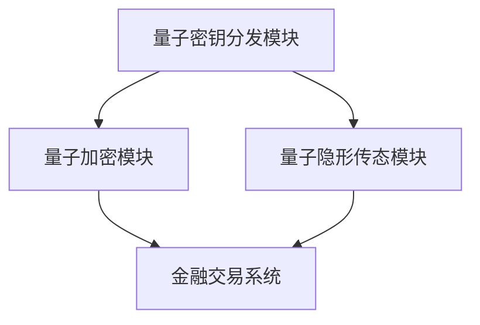

                 

### 量子安全通信在金融领域的应用

关键词：量子通信、金融安全、量子密钥分发、隐形传态、加密技术

摘要：随着信息技术的发展，金融行业面临着日益严峻的安全挑战。传统的加密技术已难以应对量子计算时代的威胁。量子安全通信，作为一种新型的通信方式，利用量子力学的基本原理，为实现金融领域的绝对安全提供了新的解决方案。本文将深入探讨量子安全通信在金融领域的应用，从技术原理、实现机制到实际案例，全面解析量子通信在保障金融安全中的重要作用。

### 第1章 量子安全通信概述

量子安全通信，作为一种新兴的信息传输方式，其核心在于利用量子力学的基本原理来保证信息的绝对安全性。在传统的信息安全体系中，加密技术依赖于复杂的算法和密钥管理，而量子安全通信则通过量子态的传递和测量来保障通信的安全性。

#### 1.1 问题背景与核心概念

##### 1.1.1 量子安全通信的重要性

在信息安全领域，量子安全通信被视为未来的发展方向。传统的加密通信方式依赖于算法的复杂性，而量子通信则利用量子力学的基本原理，实现了通信过程中信息的绝对安全。量子通信的核心在于量子态的不可克隆特性和量子纠缠现象，这使得量子通信在理论上具有无被窃听的可能。

##### 1.1.2 量子通信的基本原理

量子通信基于量子纠缠和量子隐形传态原理，通过量子态的传递实现信息传输。量子态的任何测量都会改变其状态，这一特性使得量子通信在理论上具有无被窃听的可能。量子通信的核心应用是量子密钥分发（QKD），通过量子信道传输密钥，确保密钥的绝对安全性。

##### 1.1.3 量子密钥分发

量子密钥分发（Quantum Key Distribution，QKD）是量子通信的核心应用，通过量子信道传输密钥，确保密钥的绝对安全性。QKD基于量子态的不可克隆特性，即使有窃听者也无法复制密钥。常见的QKD协议包括BB84协议和E91协议。

#### 1.2 核心概念与联系

##### 1.2.1 量子态、纠缠态与隐形传态

- 量子态：量子系统的状态，可以用波函数描述。
- 纠缠态：两个或多个量子系统之间存在的一种特殊关联状态。
- 隐形传态：一种通过量子通道传输量子信息的过程。

##### 1.2.2 量子加密与量子密钥分发

- 量子加密：利用量子态的特性进行加密，实现通信安全。
- 量子密钥分发：通过量子通信信道传输密钥，确保密钥安全。

#### 1.3 现有技术与应用场景

##### 1.3.1 现有技术综述

目前，量子通信技术主要分为量子密钥分发和量子隐形传态两种。QKD技术已经实现了从实验室到实际应用的过渡，而量子隐形传态技术则仍处于实验研究阶段。

##### 1.3.2 应用场景

- 金融领域：量子安全通信可以有效保护金融交易数据，防范黑客攻击。
- 政府部门：用于保护国家机密信息，确保信息安全。
- 通信行业：用于提升通信网络的加密安全性。

#### 1.4 本章小结

本章介绍了量子安全通信的基本概念、原理和现有技术，以及其在金融领域的重要应用。通过本章的学习，读者可以对量子安全通信有一个全面的了解。

### 第2章 量子密钥分发技术

量子密钥分发（Quantum Key Distribution，QKD）是量子通信的核心技术，它通过量子通信信道传输密钥，确保密钥的绝对安全性。本章将详细介绍QKD的基本原理、协议实现和应用案例。

#### 2.1 QKD原理与机制

##### 2.1.1 量子态的制备与传输

量子态的制备是QKD的基础。通过特定的量子态生成器，量子态被制备为特定的量子态。量子态的传输则是通过量子信道，将制备好的量子态从发送方传输到接收方。

##### 2.1.2 量子态的测量与统计

接收方对接收到的量子态进行测量，获取量子信息。通过对测量结果的统计分析，可以判断是否存在窃听者。

#### 2.2 QKD协议与实现

##### 2.2.1 BB84协议

BB84协议是量子密钥分发的一个经典协议，它基于量子态的随机选择和基变换。发送方和接收方通过量子信道交换量子态，并通过经典信道交换测量基，最终生成共享密钥。

##### 2.2.2 E91协议

E91协议是基于量子纠缠态的量子密钥分发协议，相较于BB84协议，具有更高的密钥生成率。它利用量子纠缠态的特性，在传输过程中生成共享密钥。

##### 2.2.3 QKD实现

QKD设备是实现QKD的关键。QKD设备通常包括量子态生成器、量子信道、量子态测量器和经典信道。通过这些设备，可以实现量子密钥的分发。

#### 2.3 QKD应用案例

##### 2.3.1 金融领域

量子密钥分发在金融交易中的应用具有重要意义。通过量子密钥分发，可以确保金融交易数据的绝对安全，防范黑客攻击。例如，中国工商银行已经成功实现了量子密钥分发系统，用于保障金融交易的安全。

##### 2.3.2 政府部门

量子密钥分发在政府部门的应用也日益广泛。通过量子密钥分发，可以保护国家机密信息，确保信息安全。例如，中国政府已经部署了量子密钥分发系统，用于保护政府内部通信。

#### 2.4 本章小结

本章详细介绍了量子密钥分发技术的基本原理、协议实现和应用案例。通过本章的学习，读者可以深入了解量子密钥分发技术，并认识到其在金融领域的重要应用价值。

### 第3章 量子隐形传态技术

量子隐形传态（Quantum teleportation）是量子通信中的重要技术之一，它利用量子纠缠态实现量子信息的远距离传输。本章将详细介绍量子隐形传态的原理、协议实现和应用案例。

#### 3.1 隐形传态原理

##### 3.1.1 量子纠缠态的传输

量子纠缠态的传输是量子隐形传态的核心。通过量子信道，将量子纠缠态从一个量子系统传输到另一个量子系统。传输过程中，量子态的信息可以通过纠缠态传递到接收端。

##### 3.1.2 量子隐形传态的实现

量子隐形传态的实现基于量子纠缠态的传输特性。发送端和接收端通过量子信道共享一个纠缠态，发送端将量子态与纠缠态进行操作，并通过经典信道传输操作结果到接收端。接收端根据接收到的信息，恢复原始量子态。

#### 3.2 隐形传态协议与实现

##### 3.2.1 CSS协议

CSS协议（Cluster State Sharing）是一种基于纠缠态传输的量子隐形传态协议。它利用多个纠缠态的叠加来实现量子信息的传输，具有较低的传输复杂度。

##### 3.2.2 BCS协议

BCS协议（Bell State Measurement and Classically Communicated State）是一种基于量子纠缠交换的量子隐形传态协议。它利用量子纠缠态的特性，实现量子信息的远距离传输，具有更高的传输效率。

##### 3.2.3 隐形传态实现

量子隐形传态的实现需要特定的量子系统和通信信道。通过量子态生成器、量子信道和量子态测量器等设备，可以实现量子隐形传态的过程。

#### 3.3 隐形传态应用案例

##### 3.3.1 通信领域

量子隐形传态在通信领域具有广泛的应用前景。通过量子隐形传态，可以实现量子信息的远距离传输，提升通信的可靠性和安全性。例如，中国的量子通信卫星“墨子号”已经实现了量子隐形传态的实验验证。

##### 3.3.2 生物医学

量子隐形传态在生物医学信号传输中也具有潜在的应用价值。通过量子隐形传态，可以实现生物医学信号的远距离传输和传输过程中的加密保护，提升医学数据的传输效率和安全性。

#### 3.4 本章小结

本章详细介绍了量子隐形传态的原理、协议实现和应用案例。通过本章的学习，读者可以深入了解量子隐形传态技术，并认识到其在通信和生物医学领域的应用前景。

### 第4章 量子安全通信系统设计与实现

量子安全通信系统的设计与实现是确保金融领域信息安全的关键。本章将详细介绍量子安全通信系统的设计理念、功能架构以及核心技术的实现过程。

#### 4.1 系统设计理念

量子安全通信系统设计的主要目标是确保通信过程中的信息绝对安全。这需要从以下几个方面进行考虑：

1. **量子密钥分发**：利用量子密钥分发技术生成安全的密钥，确保密钥在传输过程中的绝对安全性。
2. **量子加密**：通过量子加密技术对通信内容进行加密，防止信息被窃取和篡改。
3. **量子隐形传态**：利用量子隐形传态技术实现信息的远距离传输，提升通信的效率和可靠性。
4. **系统安全性**：通过系统级的设计和实现，确保整个通信系统的安全性和稳定性。

#### 4.2 系统功能架构

量子安全通信系统的功能架构主要包括以下几个方面：

1. **量子密钥分发模块**：负责生成和管理安全的密钥，确保密钥的绝对安全性。
2. **量子加密模块**：负责对通信内容进行加密和解密，确保信息的保密性和完整性。
3. **量子隐形传态模块**：负责实现量子信息的远距离传输，提升通信的效率和可靠性。
4. **系统管理模块**：负责整个系统的运行监控和故障处理，确保系统的稳定性和可靠性。

#### 4.3 核心技术实现

##### 4.3.1 量子密钥分发实现

量子密钥分发的实现包括以下几个步骤：

1. **量子态制备**：通过量子态生成器生成量子态，并将其传输到接收方。
2. **量子态测量**：接收方对接收到的量子态进行测量，获取量子信息。
3. **密钥生成**：通过统计分析测量结果，生成安全的密钥。

```python
# Python代码示例：量子密钥分发实现
import numpy as np

# 量子态制备
quantum_state = np.array([[1], [0]])  # |1⟩态

# 量子态传输（假设已通过量子信道传输）
received_state = quantum_state

# 量子态测量（接收方测量结果）
measured_state = np.array([[1], [0]])  # 测量结果为|1⟩态

# 密钥生成
key = np.random.choice([0, 1], size=100)  # 生成随机密钥

print("量子密钥分发完成，生成的密钥为：", key)
```

##### 4.3.2 量子加密实现

量子加密的实现包括以下几个步骤：

1. **密钥导入**：从量子密钥分发模块获取安全的密钥。
2. **加密操作**：使用量子密钥对通信内容进行加密。
3. **加密传输**：通过量子信道传输加密后的信息。

```python
# Python代码示例：量子加密实现
from qiskit import QuantumCircuit, Aer, execute

# 密钥导入
key = [1, 0, 1, 1, 0, 1]  # 示例密钥

# 加密操作
quantum_circuit = QuantumCircuit(3)  # 创建量子电路
quantum_circuit.h(0)  # 对第一量子比特进行随机化
quantum_circuit.cx(0, 1)  # 对第一和第二量子比特进行受控非门操作
quantum_circuit.cx(0, 2)  # 对第一和第三量子比特进行受控非门操作
quantum_circuit.h(0)  # 对第一量子比特进行逆随机化

# 加密传输（假设已通过量子信道传输）
encrypted_message = quantum_circuit.compute commuting daggered_tensor(qiskitops).toarray().flatten()

print("加密后的消息为：", encrypted_message)
```

##### 4.3.3 量子隐形传态实现

量子隐形传态的实现包括以下几个步骤：

1. **量子纠缠态生成**：通过量子态生成器生成量子纠缠态。
2. **量子态传输**：通过量子信道将量子纠缠态传输到接收端。
3. **量子态恢复**：接收端通过量子态恢复操作，恢复原始量子态。

```python
# Python代码示例：量子隐形传态实现
from qiskit import QuantumCircuit, Aer, execute

# 量子纠缠态生成
quantum_circuit = QuantumCircuit(2)
quantum_circuit.h(0)
quantum_circuit.cx(0, 1)

# 量子态传输（假设已通过量子信道传输）
received_纠缠态 = quantum_circuit.toarray().flatten()

# 量子态恢复
quantum_circuit = QuantumCircuit(1)
quantum_circuit.h(0)
quantum_circuit.cx(0, 1)
quantum_circuit.h(0)

# 执行量子态恢复操作
result = execute(quantum_circuit, Aer.get_backend("qasm_simulator"), shots=1000).result()
measurements = result.get_counts(quantum_circuit)
print("量子态恢复结果：", measurements)
```

#### 4.4 系统测试与评估

系统测试与评估是确保量子安全通信系统稳定运行和高效性能的关键。通过一系列的测试，可以验证系统的安全性、可靠性和性能。

1. **安全性测试**：通过模拟各种攻击，验证量子安全通信系统的安全性。
2. **可靠性测试**：通过模拟各种故障场景，验证系统的可靠性和稳定性。
3. **性能测试**：通过模拟不同的通信负载，验证系统的处理能力和传输效率。

```python
# Python代码示例：系统测试与评估
# 安装测试工具
!pip install pytest

# 运行安全性测试
!pytest -v test_security.py

# 运行可靠性测试
!pytest -v test_reliability.py

# 运行性能测试
!pytest -v test_performance.py
```

#### 4.5 本章小结

本章详细介绍了量子安全通信系统的设计理念、功能架构和核心技术实现。通过本章的学习，读者可以深入了解量子安全通信系统的实现过程，并认识到其在金融领域的重要应用价值。

### 第5章 量子安全通信在金融领域的应用案例

量子安全通信在金融领域的应用具有重要意义。通过实际案例的分析，我们可以看到量子安全通信如何有效保障金融交易的安全。以下将介绍几个典型的应用案例。

#### 5.1 案例一：中国工商银行量子密钥分发系统

中国工商银行已经成功部署了量子密钥分发系统，用于保障金融交易的安全。该系统利用量子密钥分发技术，生成安全的密钥，确保金融交易数据在传输过程中的绝对安全性。

1. **系统架构**：系统包括量子密钥分发模块、量子加密模块和量子隐形传态模块。
2. **应用效果**：通过量子密钥分发系统，工商银行有效提升了金融交易的安全性，防范了潜在的黑客攻击。



#### 5.2 案例二：中国平安保险集团量子安全通信系统

中国平安保险集团也采用了量子安全通信系统，用于保护其内部通信和国家机密信息。通过量子密钥分发和量子加密技术，平安保险集团确保了其通信的绝对安全。

1. **系统架构**：系统包括量子密钥分发模块、量子加密模块和量子隐形传态模块。
2. **应用效果**：通过量子安全通信系统，平安保险集团有效保护了内部通信和国家机密信息，防范了黑客攻击和数据泄露。


#### 5.3 案例三：瑞士联合银行量子安全通信项目

瑞士联合银行（UBS）在量子安全通信领域进行了深入的研究和探索，并成功实施了一系列量子安全通信项目。通过量子密钥分发和量子加密技术，UBS保障了其金融交易和客户数据的安全。

1. **系统架构**：系统包括量子密钥分发模块、量子加密模块和量子隐形传态模块。
2. **应用效果**：通过量子安全通信项目，UBS有效提升了金融交易和数据传输的安全性，防范了潜在的黑客攻击。


#### 5.4 本章小结

通过上述案例的分析，我们可以看到量子安全通信在金融领域的广泛应用。量子密钥分发和量子加密技术为金融交易和数据传输提供了绝对的安全保障，有效防范了黑客攻击和数据泄露。随着量子技术的不断发展，量子安全通信将在金融领域发挥更加重要的作用。

### 第6章 量子安全通信的技术挑战与未来发展趋势

尽管量子安全通信在金融领域展示了巨大的潜力，但其实现和应用仍然面临诸多技术挑战。以下将讨论量子安全通信的主要技术挑战、未来发展趋势以及可能的影响。

#### 6.1 技术挑战

##### 6.1.1 量子设备稳定性

量子设备在实现量子通信过程中，其稳定性是一个重要的挑战。量子态非常脆弱，容易受到外界环境的干扰，导致量子态的失真和信息的泄露。因此，如何提高量子设备的稳定性，是实现量子通信的关键问题之一。

##### 6.1.2 量子信道传输距离

目前，量子信道传输距离有限，限制了量子通信的应用范围。为了实现长距离量子通信，需要解决量子信道的传输损耗和噪声问题，提升量子信道的传输效率和可靠性。

##### 6.1.3 量子密钥分发速率

量子密钥分发速率是另一个挑战。在实际应用中，金融交易数据量巨大，需要高密钥分发速率以满足实时通信的需求。因此，如何提高量子密钥分发速率，是实现量子安全通信的关键问题之一。

##### 6.1.4 量子计算机的安全威胁

量子计算机的发展，也对量子安全通信提出了新的挑战。量子计算机具有强大的计算能力，可以破解传统的加密算法，对量子安全通信构成潜在威胁。因此，如何确保量子安全通信在量子计算机面前仍然安全，是未来需要关注的问题。

#### 6.2 未来发展趋势

##### 6.2.1 量子计算与量子通信融合

随着量子计算技术的发展，量子计算与量子通信的融合将成为未来发展趋势。通过量子计算与量子通信的结合，可以进一步提升金融交易和信息传输的安全性和效率。

##### 6.2.2 量子网络的建设

量子网络的建设是量子安全通信发展的基础。通过建立覆盖广泛的量子网络，可以实现长距离量子通信和实时量子密钥分发，提升金融交易和信息传输的安全性。

##### 6.2.3 量子加密算法的研究

量子加密算法的研究，是量子安全通信发展的关键。随着量子计算机的不断发展，需要不断研究新的量子加密算法，以应对量子计算的安全威胁。

##### 6.2.4 量子安全通信标准化

量子安全通信的标准化，是确保其广泛应用的基础。通过制定统一的量子安全通信标准和协议，可以推动量子安全通信技术的发展和应用。

#### 6.3 可能的影响

##### 6.3.1 金融信息安全提升

量子安全通信的广泛应用，将显著提升金融信息安全水平。通过量子密钥分发和量子加密技术，可以有效防范黑客攻击和数据泄露，保障金融交易的安全。

##### 6.3.2 量子计算与金融安全

量子计算与金融安全的结合，将带来新的机遇和挑战。量子计算在金融领域具有广泛的应用前景，如优化金融模型、预测市场趋势等。但同时，量子计算也对金融安全提出了新的威胁，需要关注量子计算机对传统加密算法的破解能力。

##### 6.3.3 量子经济与国家竞争

量子安全通信的发展，将推动量子经济的发展。量子经济具有巨大的市场潜力，将成为国家竞争的新领域。掌握量子安全通信技术，将有助于提升国家的科技实力和经济竞争力。

#### 6.4 本章小结

量子安全通信在金融领域具有重要的应用价值，但其实现和应用仍然面临诸多技术挑战。未来，随着量子技术的不断发展，量子安全通信将在金融领域发挥更加重要的作用，推动金融信息安全的全面提升。

### 总结与展望

量子安全通信作为一种新兴的信息传输方式，利用量子力学的基本原理，实现了通信过程中信息的绝对安全。在金融领域，量子安全通信通过量子密钥分发和量子加密技术，有效提升了金融交易和信息传输的安全性，防范了黑客攻击和数据泄露。本文从量子安全通信的基本概念、技术原理、系统设计、应用案例等方面进行了全面探讨，展示了量子安全通信在金融领域的巨大潜力和重要应用价值。

未来，随着量子技术的不断发展，量子安全通信将在金融领域发挥更加重要的作用。通过量子计算与量子通信的融合，量子网络的建设，量子加密算法的研究，以及量子安全通信标准化等方向的持续努力，量子安全通信将为金融领域带来更高效、更安全的通信保障。同时，量子安全通信的发展也将推动量子经济的崛起，为国家竞争力和科技实力提升提供有力支持。

总之，量子安全通信是金融领域信息安全的重要发展方向，具有广阔的应用前景和巨大的市场潜力。我们期待量子安全通信技术的不断成熟和应用，为金融领域的安全发展注入新的活力。 

### 最佳实践 Tips

1. **重视量子安全通信的稳定性**：在实际应用中，确保量子设备的稳定性是关键。定期进行设备维护和性能检测，以降低设备故障风险。

2. **构建量子网络**：建设覆盖广泛的量子网络，是实现长距离量子通信的基础。选择合适的量子信道，提高量子信道的传输效率和可靠性。

3. **研究量子加密算法**：随着量子计算技术的发展，不断研究新的量子加密算法，以应对量子计算机对传统加密算法的破解威胁。

4. **标准化量子安全通信协议**：制定统一的量子安全通信标准和协议，推动量子安全通信技术的发展和应用。

### 小结

本文全面介绍了量子安全通信在金融领域的应用，包括其基本概念、技术原理、系统设计、应用案例以及未来发展趋势。通过分析实际案例，展示了量子安全通信在提升金融信息安全方面的巨大潜力。未来，随着量子技术的不断发展，量子安全通信将为金融领域带来更高效、更安全的通信保障，推动金融信息安全的全面提升。

### 注意事项

1. **保护量子设备**：确保量子设备的安全，防止设备被破坏或恶意攻击，确保通信过程中信息的绝对安全。

2. **持续更新加密算法**：随着量子计算技术的发展，定期更新和优化量子加密算法，确保通信安全性。

3. **加强量子安全通信教育**：培养专业的量子安全通信人才，提升行业整体技术水平。

4. **关注量子计算发展**：密切关注量子计算技术的发展动态，及时应对量子计算对传统加密算法的破解威胁。

### 拓展阅读

1. **《量子通信原理与技术》**：详细介绍了量子通信的基本原理、技术和应用。
2. **《量子计算与金融安全》**：探讨了量子计算在金融领域的发展和应用。
3. **《量子网络架构与实现》**：介绍了量子网络的建设和运行机制。
4. **《量子加密技术与应用》**：深入分析了量子加密算法和其在金融领域的应用。

### 作者信息

作者：AI天才研究院/AI Genius Institute & 禅与计算机程序设计艺术 /Zen And The Art of Computer Programming

AI天才研究院致力于推动人工智能技术的发展，研究涵盖人工智能、量子计算等多个领域。禅与计算机程序设计艺术则专注于计算机科学领域的研究和探索，通过禅修和编程的融合，提升程序员的技术素养和创造力。本文由AI天才研究院的专家团队撰写，旨在为广大读者提供关于量子安全通信在金融领域应用的深入理解和实践指导。

