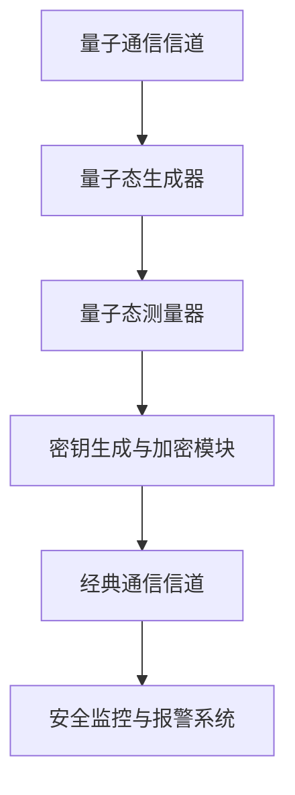
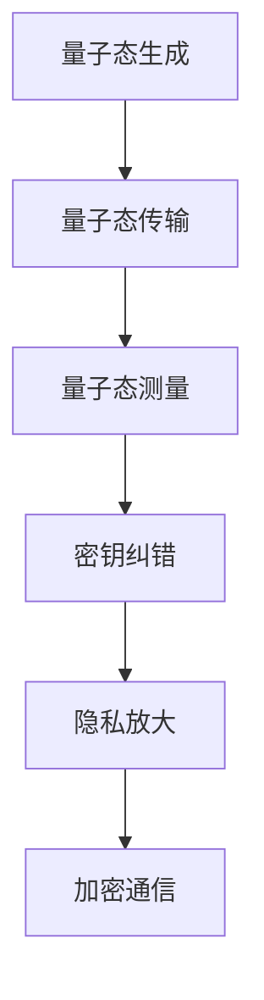
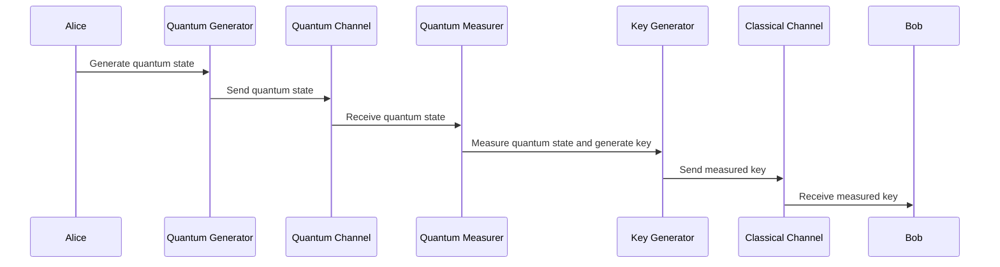

                 

### 背景介绍

#### 1.1 问题背景

在当今信息化社会中，信息安全尤其是国家安全的保障显得尤为重要。随着信息技术的迅猛发展，数据泄露、网络攻击等安全事件频发，传统的加密技术面临着越来越大的挑战。为了确保政府通信的绝对安全，保障国家安全，寻找更为安全的通信加密技术成为当务之急。

传统的加密技术主要基于经典密码学，这些技术依赖于复杂的算法和计算强度来保护信息的机密性。然而，随着计算能力的不断提升，传统加密技术逐渐暴露出弱点。量子计算机的崛起使得这些传统加密技术面临被破解的风险。因此，探索一种能够抵御量子计算机攻击的加密技术成为信息安全领域的重要课题。

#### 1.2 问题描述

政府通信作为国家安全的重要组成部分，其安全性直接关系到国家的核心利益。在传统的通信过程中，通信双方的密钥分发是一个关键环节。如果密钥在分发过程中被窃取或篡改，将导致通信内容被非法获取或篡改，从而对国家安全造成严重威胁。

传统的密钥分发方法主要包括对称加密和非对称加密两种。对称加密要求通信双方事先共享一个密钥，而非对称加密则依赖于公私钥对。然而，这些方法在面临量子计算机攻击时都存在一定的安全隐患。

#### 1.3 问题解决

量子密钥分发（Quantum Key Distribution, QKD）技术应运而生，它是一种基于量子力学原理的加密技术，能够实现绝对安全的密钥分发。QKD通过量子态的传输和测量来实现密钥的生成和分发，即使有第三方窃听，也无法获取到真实的密钥信息。因此，量子密钥分发成为解决政府通信安全问题的关键技术。

#### 1.4 边界与外延

量子密钥分发技术主要应用于需要高安全级别的通信场合，如政府、军事、金融等领域。虽然目前QKD技术尚处于发展阶段，但其潜在的应用前景十分广阔。

量子密钥分发技术的实现需要依赖于量子通信技术，如量子纠缠态的传输、量子密钥交换协议等。此外，量子密钥分发系统还需要考虑量子中继、量子隐形传态等技术以实现长距离通信。

#### 1.5 核心概念结构与要素组成

量子密钥分发技术涉及多个核心概念和要素，包括：

- **量子比特**：量子比特（qubit）是量子计算机的基本信息单元，它既可以是0，也可以是1，或者处于0和1的叠加状态。
- **量子纠缠**：量子纠缠是量子力学中的一种现象，当两个或多个量子系统发生相互作用时，它们之间会形成量子纠缠态，即使它们相隔很远，彼此的状态也会相互依赖。
- **量子密钥交换协议**：量子密钥交换协议是量子密钥分发技术的核心，它通过量子纠缠态的传输和测量来实现密钥的生成和分发。
- **量子中继**：量子中继技术可以延长量子态传输的距离，是实现长距离量子通信的关键技术。
- **量子隐形传态**：量子隐形传态是一种量子信息传输技术，它可以将一个量子态从一个位置传递到另一个位置，而不需要经过中间位置。

通过以上核心概念和要素的有机结合，量子密钥分发技术能够提供一种全新的通信加密手段，为政府通信安全提供坚实保障。

### 核心概念与联系

#### 2.1 量子密钥分发

量子密钥分发（Quantum Key Distribution，QKD）是一种基于量子力学原理的加密技术，旨在实现绝对安全的密钥分发。其基本原理是利用量子态的不可克隆性和测量导致的量子态坍缩特性，确保通信双方能够安全地共享密钥。

#### 2.2 政府通信

政府通信是指政府部门在执行公务过程中使用的各种通信手段，包括电话、电子邮件、视频会议等。这些通信内容通常涉及国家安全、政策制定、外交事务等敏感信息，因此对通信安全性有着极高的要求。

#### 2.3 国家安全

国家安全是国家生存和发展的基本保障，包括政治安全、国土安全、军事安全、经济安全、文化安全、社会安全、科技安全等多个方面。保障国家安全是政府的核心职责之一。

#### 2.4 核心概念之间的联系

量子密钥分发与政府通信、国家安全之间存在密切的联系：

1. **量子密钥分发与政府通信**：量子密钥分发技术能够为政府通信提供一种绝对安全的密钥分发手段，确保通信内容的机密性和完整性，从而增强政府通信的安全性。
   
2. **量子密钥分发与国家安全**：国家安全对通信安全有着极高的要求，量子密钥分发技术能够有效抵御量子计算机的攻击，为国家安全提供坚实的技术保障。

3. **政府通信与国家安全**：政府通信是国家安全的重要组成部分，保障政府通信安全直接关系到国家的核心利益和国家安全。量子密钥分发技术的应用，有助于提高政府通信的安全水平，进而增强国家的综合安全能力。

通过量子密钥分发技术，政府通信能够在量子计算机时代实现安全的通信，从而为国家安全保驾护航。量子密钥分发技术的应用不仅提高了政府通信的安全性，也为国家信息安全体系建设提供了新的思路和手段。

### 量子密钥分发原理

量子密钥分发（Quantum Key Distribution, QKD）技术是一种基于量子力学原理的加密技术，旨在实现绝对安全的密钥分发。QKD通过利用量子态的不可克隆性和测量导致的量子态坍缩特性，确保通信双方能够安全地共享密钥。以下是量子密钥分发的基本原理：

#### 3.1 基本原理

量子密钥分发的基本原理可以概括为以下几个步骤：

1. **量子态生成**：通信双方（Alice和Bob）各自生成一对量子纠缠态，通过量子通信信道进行传输。
   
2. **量子态测量**：Alice和Bob分别对传输过来的量子态进行测量，测量结果可能包含噪声和错误。
   
3. **错误检测**：双方通过共享的公开信道（可以是经典通信信道）交换测量结果，并共同排除受干扰或测量错误的量子态。
   
4. **密钥提取**：排除错误后，双方剩余的量子态对应的就是共享的密钥。

#### 3.2 量子比特与经典比特的区别

量子比特（qubit）是量子计算机的基本信息单元，它与经典比特（classical bit）有以下几点重要区别：

- **状态表示**：经典比特只能处于0或1的状态，而量子比特可以处于0和1的叠加态。
- **并行计算**：量子比特的叠加态使得量子计算机能够在同一时刻处理多个计算任务，而经典比特无法实现这一点。
- **纠缠效应**：量子比特之间存在量子纠缠，这种纠缠态可以在远距离的量子比特之间产生，而经典比特之间则不存在这种现象。

#### 3.3 量子密钥分发的数学模型

量子密钥分发可以通过以下数学模型来描述：

1. **量子态生成**：假设Alice和Bob生成一对量子纠缠态，其量子态可以表示为：

   $$
   \psi_{AB} = \frac{1}{\sqrt{2}}(|00\rangle - |11\rangle)
   $$

   其中，$|0\rangle$和$|1\rangle$分别表示量子比特的基态和激发态，上标A和B表示量子态分别属于Alice和Bob。

2. **量子态传输**：Alice将量子态发送给Bob，传输过程中可能受到噪声和干扰的影响。

3. **量子态测量**：Bob对接收到的量子态进行测量，测量结果可以是0或1。测量结果的不同概率分布取决于量子态的叠加程度。

4. **密钥提取**：Alice和Bob根据测量结果共享一个随机的密钥序列，通过纠错和隐私放大等步骤，最终得到一个安全共享的密钥。

#### 3.4 量子密钥分发的流程

量子密钥分发的具体流程可以分为以下几个阶段：

1. **初始化**：Alice和Bob各自生成一对量子纠缠态。

2. **量子态传输**：Alice将量子态发送给Bob，可以使用量子纠缠态的传输技术，如量子隐形传态。

3. **测量**：Bob对传输过来的量子态进行测量，记录测量结果。

4. **结果交换**：Alice和Bob通过经典通信信道交换测量结果。

5. **纠错**：双方根据共享的公开信道交换结果，排除受干扰或测量错误的量子态。

6. **隐私放大**：对剩余的量子态进行隐私放大，确保最终共享的密钥安全性。

7. **密钥使用**：双方使用共享的密钥进行加密通信，确保通信内容的机密性和完整性。

通过以上原理和流程，量子密钥分发技术能够实现绝对安全的密钥分发，为政府通信提供坚实的加密保障。

### 量子密钥分发技术

量子密钥分发（Quantum Key Distribution, QKD）技术是一种利用量子力学原理实现密钥安全分发的通信技术。QKD技术的核心在于通过量子态的不可克隆性和测量导致的量子态坍缩特性，确保通信双方能够安全地共享密钥。以下是量子密钥分发技术的概述、主流量子密钥分发协议以及其应用场景。

#### 4.1 量子密钥分发技术概述

量子密钥分发技术的基本思想是通过量子通信信道传输量子态，通信双方在量子态上执行特定的操作和测量，从而生成共享的密钥。由于量子态的不可克隆性和测量导致的量子态坍缩特性，即使第三方窃听，也无法获得真实的密钥信息。因此，量子密钥分发技术被认为是一种绝对安全的密钥分发方式。

QKD技术的关键要素包括：

- **量子态生成**：通信双方（通常称为Alice和Bob）各自生成一对量子纠缠态。
- **量子态传输**：Alice将量子态发送给Bob，可以通过量子通信信道实现。
- **量子态测量**：Bob对传输过来的量子态进行测量，并根据测量结果生成部分密钥。
- **经典通信**：Alice和Bob通过经典通信信道交换量子态测量结果，共同排除受干扰或测量错误的量子态。
- **密钥生成**：通过纠错和隐私放大等步骤，双方最终得到一个安全共享的密钥。

#### 4.2 主流量子密钥分发协议

目前，已有多个量子密钥分发协议被提出，其中最著名的包括BB84协议和E91协议。以下是这些协议的基本原理和特点：

1. **BB84协议**

   BB84协议是第一个被提出的量子密钥分发协议，由Charles H. Bennett和Gilles Brassard于1984年提出。BB84协议的核心思想是利用量子态的叠加态和基态之间的转换来实现密钥的分发。

   - **量子态生成**：Alice生成一系列随机选择的量子态，将其编码为基态和叠加态。
   - **量子态传输**：Alice将量子态发送给Bob，Bob对传输过来的量子态进行测量。
   - **测量结果交换**：Bob将测量结果通过经典通信信道发送给Alice。
   - **密钥生成**：Alice和Bob根据双方共享的测量结果，排除错误和干扰，生成共享的密钥。

2. **E91协议**

   E91协议是由Lothar Schrödinger和Seifedine K. Habib于1991年提出的，它基于量子纠缠态的性质。E91协议的核心思想是利用量子纠缠态的特性来实现密钥的分发。

   - **量子态生成**：Alice和Bob各自生成一对量子纠缠态。
   - **量子态测量**：Alice对她的量子态进行测量，Bob对他们的量子态进行测量。
   - **测量结果交换**：Alice和Bob通过经典通信信道交换测量结果。
   - **密钥生成**：通过量子纠缠态的特性，Alice和Bob可以排除错误和干扰，生成共享的密钥。

#### 4.3 量子密钥分发技术的应用场景

量子密钥分发技术主要应用于以下场景：

1. **政府通信**：政府通信涉及大量敏感信息，如政策制定、外交事务等。量子密钥分发技术能够提供绝对安全的密钥分发，确保政府通信的机密性和完整性。

2. **军事通信**：军事通信要求高度的安全性，量子密钥分发技术可以有效保护军事通信，防止敌对方窃取或篡改信息。

3. **金融通信**：金融通信中，涉及大量金融数据和交易信息，这些信息的泄露可能导致严重损失。量子密钥分发技术可以为金融通信提供安全的密钥分发，确保金融数据的安全。

4. **科研通信**：科研通信中，涉及大量敏感的科研成果和创新信息，量子密钥分发技术可以保障科研数据的机密性和完整性。

5. **企业内部通信**：大型企业的内部通信涉及大量机密信息，量子密钥分发技术可以有效提升企业内部通信的安全水平。

通过量子密钥分发技术，各类通信场景都可以实现绝对安全的密钥分发，从而为信息安全和国家安全提供坚实保障。

### 量子密钥分发在政府通信中的应用

量子密钥分发（Quantum Key Distribution，QKD）技术作为一种基于量子力学原理的加密技术，能够在量子计算机时代提供绝对安全的密钥分发。在政府通信领域，QKD技术能够极大地提升通信安全水平，确保国家核心机密和信息的安全性。以下是量子密钥分发在政府通信中的应用分析。

#### 5.1 政府通信需求分析

政府通信具有以下几个显著特点，这些特点决定了政府通信对安全性的高要求：

1. **敏感性**：政府通信内容通常涉及国家安全、政策制定、外交事务等敏感信息，这些信息一旦泄露，可能会对国家安全、国家利益造成严重影响。

2. **重要性**：政府通信在执行公务过程中，需要传输大量的重要信息，如决策文件、机密报告、外交电报等，这些信息的传输必须确保高度安全性。

3. **连续性**：政府通信需要保持高度连续性，以确保政府各部门和机构之间能够实时、高效地进行沟通和协作，确保政府工作的正常运转。

4. **多样性**：政府通信的形式多样，包括电话、电子邮件、视频会议、即时通讯等多种通信方式，这些通信方式需要统一的安全解决方案。

鉴于上述需求，政府通信在密钥分发方面面临以下挑战：

- **传统加密技术失效**：随着量子计算机的崛起，传统加密技术面临被量子计算机破解的风险，这导致传统加密技术无法保障政府通信的安全性。
- **密钥管理复杂**：政府通信涉及大量敏感信息，需要确保密钥的安全分发和管理，传统的密钥管理方法复杂且效率低下。
- **远程通信安全**：政府通信往往需要在远程进行，这要求密钥分发技术能够在长距离、复杂环境下保持高安全性。

#### 5.2 量子密钥分发在政府通信中的应用案例

量子密钥分发技术在政府通信中的应用已经取得了一些显著成果，以下是几个典型的应用案例：

1. **中国**：中国已在多个政府机构和部门中部署了量子密钥分发系统，如国家电网、国家安全部等。这些系统通过量子密钥分发技术实现了政府内部通信的高安全性，有效防止了信息泄露和篡改。

2. **美国**：美国国家安全局（NSA）也在积极研究和部署量子密钥分发技术。通过量子密钥分发系统，美国政府内部通信的安全性得到了显著提升，确保了核心机密的安全。

3. **欧洲**：欧洲多个国家也在积极探索和部署量子密钥分发技术，如德国、法国等。这些国家通过量子密钥分发系统，加强了政府通信的安全保障，为应对量子计算机时代的威胁做好了准备。

#### 5.3 量子密钥分发对政府通信安全的提升

量子密钥分发技术对政府通信安全水平的提升主要体现在以下几个方面：

1. **绝对安全性**：量子密钥分发技术基于量子力学原理，能够提供绝对安全的密钥分发。即使在量子计算机时代，量子密钥分发技术也能有效抵御量子攻击，确保政府通信的绝对安全。

2. **密钥管理简化**：量子密钥分发技术通过量子通信信道直接传输密钥，避免了传统密钥分发过程中的复杂环节，简化了密钥管理过程，提高了密钥分发的效率和安全性。

3. **长距离通信**：量子密钥分发技术能够在长距离、复杂环境下保持高安全性，确保远程通信的安全。这对于政府跨区域、跨部门的通信具有重要意义。

4. **抗干扰能力**：量子密钥分发技术能够有效抵御电磁干扰和物理攻击，确保通信信道的安全性。这对于政府通信环境复杂、面临多种干扰威胁的情况具有重要意义。

5. **透明度管理**：量子密钥分发技术能够实时监测通信过程中的异常情况，如量子态的丢失或篡改，及时发现并处理安全隐患，确保政府通信的安全透明性。

通过量子密钥分发技术，政府通信能够在量子计算机时代实现安全的通信，为国家安全提供坚实保障。量子密钥分发技术的应用不仅提高了政府通信的安全性，也为国家信息安全体系建设提供了新的思路和手段。

### 量子密钥分发系统的设计与实现

量子密钥分发（Quantum Key Distribution, QKD）系统的设计与实现是确保政府通信安全的关键环节。一个完善的量子密钥分发系统需要考虑系统的整体架构、功能设计、接口设计以及系统交互等多个方面。以下是对量子密钥分发系统设计与实现的详细说明。

#### 6.1 系统架构设计

量子密钥分发系统的架构设计决定了系统的稳定性和可靠性。一个典型的量子密钥分发系统架构包括以下几个关键组件：

1. **量子通信信道**：量子通信信道是系统的基础，它负责传输量子态和经典信息。量子通信信道可以是光纤、自由空间或量子中继器等。

2. **量子态生成器**：量子态生成器负责生成量子纠缠态或其他需要的量子态，并将其发送到量子通信信道。

3. **量子态测量器**：量子态测量器负责对传输的量子态进行测量，并根据测量结果生成部分密钥。

4. **经典通信信道**：经典通信信道用于传输量子态测量结果和最终的共享密钥。它可以是互联网、卫星通信或其他可靠的通信手段。

5. **密钥生成与加密模块**：密钥生成与加密模块负责对测量结果进行纠错和隐私放大，生成最终的共享密钥，并进行加密通信。

6. **安全监控与报警系统**：安全监控与报警系统负责监测系统的异常情况，如量子态丢失、干扰或物理攻击，并及时发出警报。

以下是量子密钥分发系统架构的Mermaid架构图：

#### 6.2 系统功能设计

量子密钥分发系统的功能设计包括以下几个关键方面：

1. **量子态生成**：量子态生成器需要能够生成符合要求的量子纠缠态或其他量子态，以供测量和分发。

2. **量子态传输**：量子态需要在量子通信信道中传输，系统需要确保量子态在传输过程中不受干扰或失真。

3. **量子态测量**：量子态测量器需要能够准确地测量量子态，并根据测量结果生成部分密钥。

4. **密钥纠错**：由于量子态传输过程中可能会出现错误，系统需要具备密钥纠错功能，确保最终共享的密钥的准确性。

5. **隐私放大**：通过隐私放大，系统能够进一步提高共享密钥的安全性。

6. **加密通信**：最终生成的密钥用于加密通信，确保通信内容在传输过程中的机密性和完整性。

以下是量子密钥分发系统的功能设计Mermaid类图：

#### 6.3 系统接口设计和系统交互

量子密钥分发系统的接口设计和系统交互是系统稳定运行的重要保障。以下是系统的接口设计和交互流程：

1. **量子态生成接口**：量子态生成器通过该接口生成量子态，并将其发送到量子通信信道。

2. **量子态测量接口**：量子态测量器通过该接口接收量子通信信道传来的量子态，并进行测量。

3. **密钥生成接口**：密钥生成与加密模块通过该接口接收量子态测量结果，生成最终的共享密钥。

4. **经典通信接口**：经典通信信道通过该接口传输量子态测量结果和最终密钥。

以下是系统接口设计和系统交互的Mermaid序列图：

通过以上设计与实现，量子密钥分发系统能够在复杂的通信环境中提供高度安全的密钥分发服务，确保政府通信的安全性和可靠性。系统架构设计、功能设计、接口设计以及系统交互的有机结合，使得量子密钥分发系统能够高效、稳定地运行，为国家安全提供坚实保障。

### 量子密钥分发在国家安全中的应用前景

量子密钥分发（Quantum Key Distribution, QKD）技术在国家安全领域具有广泛的应用前景。随着量子计算机技术的发展，传统加密技术面临前所未有的挑战，而量子密钥分发技术以其绝对安全的特性，成为保障国家安全的重要手段。以下是量子密钥分发在国家安全中的应用前景分析。

#### 7.1 国家安全需求分析

国家安全需求可以分为以下几个方面：

1. **信息保密性**：确保国家核心机密和信息在传输和存储过程中的保密性，防止敌对方通过窃听、破解等手段获取敏感信息。

2. **通信安全性**：保障政府、军事等机构之间的通信安全，防止通信内容被篡改、伪造或拦截。

3. **数据完整性**：确保传输的数据未被非法篡改或损坏，保证数据的完整性和真实性。

4. **抗攻击能力**：面对网络攻击、物理攻击等威胁，保障通信系统的稳定运行和数据的完整性。

5. **实时性**：对于军事通信等紧急情况，要求通信系统能够快速、高效地传输信息。

在量子计算机时代，传统的加密技术如对称加密和非对称加密面临着被量子计算机破解的风险。量子密钥分发技术能够提供绝对安全的密钥分发，有效应对量子计算机的威胁，成为保障国家安全的关键技术。

#### 7.2 量子密钥分发在国家安全中的应用前景

量子密钥分发技术在国家安全领域具有以下几方面的应用前景：

1. **政府通信安全**：政府通信涉及大量敏感信息，如政策制定、外交事务等。量子密钥分发技术能够提供绝对安全的密钥分发，确保政府通信的机密性和完整性。

2. **军事通信安全**：军事通信对于国家安全至关重要。量子密钥分发技术可以保障军事通信的绝对安全，防止敌对方窃听和破解通信内容。

3. **金融通信安全**：金融通信中涉及大量金融数据和交易信息，量子密钥分发技术能够确保金融数据的机密性和完整性，防止金融诈骗和网络攻击。

4. **科研通信安全**：科研通信中涉及大量敏感的科研成果和创新信息，量子密钥分发技术能够保障科研数据的机密性和完整性，促进科技创新。

5. **跨区域通信安全**：量子密钥分发技术能够在长距离、复杂环境下保持高安全性，为跨区域、跨部门的通信提供安全保障。

6. **物联网安全**：随着物联网技术的发展，大量的设备连接到网络，量子密钥分发技术可以提供端到端的安全保障，防止设备被攻击和数据泄露。

#### 7.3 挑战与展望

尽管量子密钥分发技术在国家安全领域具有广泛的应用前景，但在实际应用过程中仍面临一些挑战：

1. **技术成熟度**：量子密钥分发技术尚处于发展阶段，技术成熟度和稳定性仍有待提高。

2. **设备成本**：量子通信设备和系统的成本较高，需要进一步降低成本，以实现大规模应用。

3. **量子通信信道**：量子通信信道的安全性和稳定性是量子密钥分发技术的重要保障，需要解决量子通信信道的中断、干扰等问题。

4. **系统集成**：量子密钥分发技术需要与现有的通信系统和信息安全体系相结合，实现系统集成和无缝对接。

5. **政策法规**：需要制定相关的政策法规，规范量子密钥分发技术的研发、应用和管理。

展望未来，量子密钥分发技术将在国家安全领域发挥越来越重要的作用。随着技术的不断进步和成本的逐步降低，量子密钥分发技术有望实现大规模应用，为国家安全提供坚实的技术保障。通过技术创新和政策支持，量子密钥分发技术将为国家安全体系建设提供新的思路和手段。

### 最佳实践与注意事项

在量子密钥分发（Quantum Key Distribution, QKD）技术的实际应用过程中，积累了一些宝贵的实践经验，同时也有必要注意一些潜在的风险和挑战。以下是关于量子密钥分发技术的最佳实践和注意事项：

#### 8.1 实践经验总结

1. **系统稳定性**：在实际应用中，系统稳定性是量子密钥分发技术的关键。为了确保系统的稳定性，需要选择可靠的量子通信信道和设备，并进行定期的维护和检查。

2. **安全性验证**：在部署量子密钥分发系统之前，需要进行严格的安全性验证，包括对量子通信信道的检测、量子态生成和测量设备的校准等。

3. **操作规范**：制定明确的操作规范，确保操作人员能够正确、安全地使用量子密钥分发系统。操作规范应包括安全操作流程、故障处理程序等。

4. **用户体验**：用户界面和操作体验对量子密钥分发系统的实际应用至关重要。系统应设计简洁、易用，确保用户能够轻松地完成密钥的分发和加密通信。

5. **数据备份**：对生成的密钥和加密数据进行备份，以防止数据丢失或损坏。备份策略应考虑数据的完整性和安全性，确保备份过程不会泄露密钥信息。

6. **系统整合**：量子密钥分发技术需要与现有的信息安全体系整合，实现无缝对接。整合过程中，应充分考虑系统兼容性和性能优化。

#### 8.2 注意事项

1. **量子通信信道安全**：量子通信信道是量子密钥分发系统的核心，其安全性直接影响到密钥分发过程的安全性。在部署系统时，应确保量子通信信道免受物理攻击和电磁干扰。

2. **密钥管理**：密钥管理是量子密钥分发技术的重要环节。密钥生成、存储、传输和销毁等过程都需要严格控制，以防止密钥泄露或被篡改。

3. **技术更新**：量子技术发展迅速，量子密钥分发系统需要定期更新，以应对新的安全威胁和挑战。更新过程中，应注意兼容性和稳定性，确保系统的正常运行。

4. **人才培养**：量子密钥分发技术对操作人员的技术要求较高。因此，需要培养专业的技术人才，确保系统能够高效、安全地运行。

5. **法律法规**：随着量子技术的应用，相关的法律法规也在不断完善。在实际应用过程中，应遵守国家和地区的法律法规，确保系统的合法合规。

6. **数据隐私**：在量子密钥分发过程中，应确保用户的隐私得到保护。数据传输和存储过程应遵循数据保护标准，防止数据泄露和滥用。

#### 8.3 拓展阅读建议

1. **《量子密钥分发技术原理与应用》**：详细介绍了量子密钥分发技术的原理、协议和应用场景，有助于深入理解量子密钥分发技术的基本概念和实现方法。

2. **《量子通信：原理、协议与应用》**：探讨了量子通信的基础理论和实际应用，包括量子密钥分发、量子隐形传态等关键技术，适合对量子通信技术有较高兴趣的读者。

3. **《量子计算机与量子加密技术》**：介绍了量子计算机的基本原理和量子加密技术的最新发展，分析了量子计算机对传统加密技术的影响以及量子加密技术的应对策略。

通过遵循最佳实践和注意事项，量子密钥分发技术在实际应用中能够更好地保障政府通信和国家安全。未来，随着技术的不断发展和完善，量子密钥分发技术将在更多领域发挥重要作用。

### 总结

量子密钥分发（Quantum Key Distribution, QKD）技术作为一种基于量子力学原理的加密技术，为政府通信和国家安全提供了全新的解决方案。本文从背景介绍、核心概念与联系、原理讲解、技术概述、应用分析、系统设计与实现、应用前景到最佳实践，全面探讨了量子密钥分发技术在保障国家安全方面的作用和重要性。

量子密钥分发技术利用量子态的不可克隆性和测量导致的量子态坍缩特性，实现了绝对安全的密钥分发。它不仅能够抵御量子计算机的攻击，还能在长距离、复杂环境下保持高安全性，为政府通信提供坚实的加密保障。

未来，随着量子技术的不断进步和应用，量子密钥分发技术将在国家安全、金融通信、科研通信等领域发挥更加重要的作用。通过技术创新和政策支持，量子密钥分发技术将为国家安全体系建设提供新的思路和手段。

在此，感谢读者对本文的关注，希望本文能够为读者提供关于量子密钥分发技术及其在政府通信中应用的有益见解。未来，我们将继续关注量子技术的发展和应用，带来更多精彩内容。作者：AI天才研究院/AI Genius Institute & 禅与计算机程序设计艺术 /Zen And The Art of Computer Programming。

