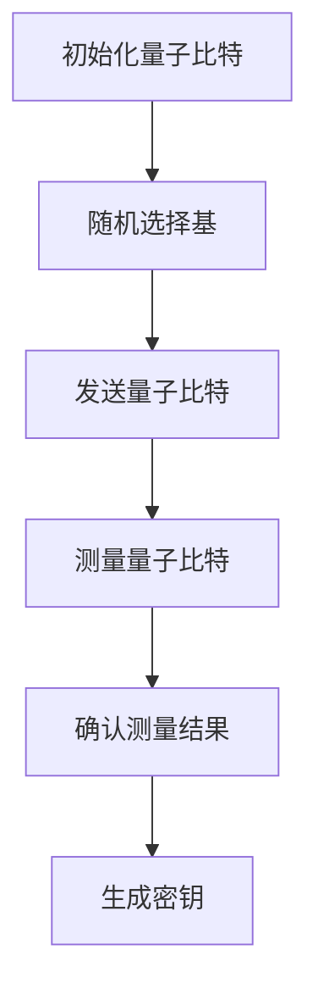
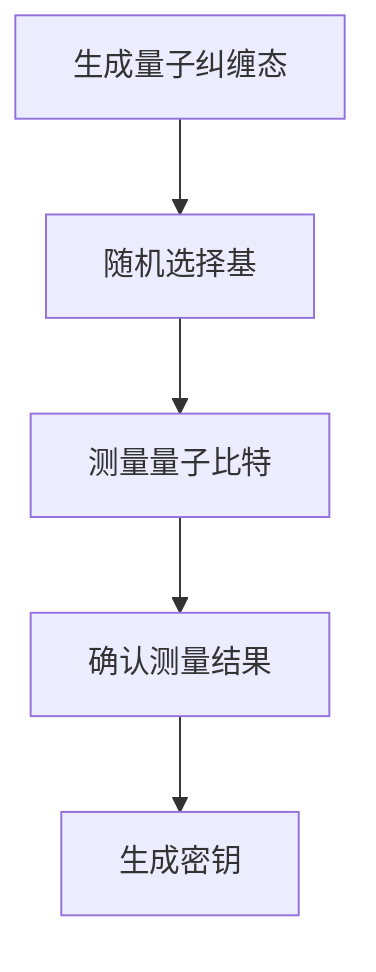
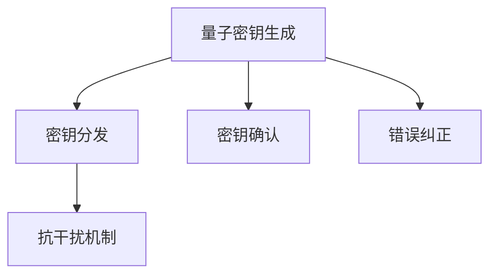
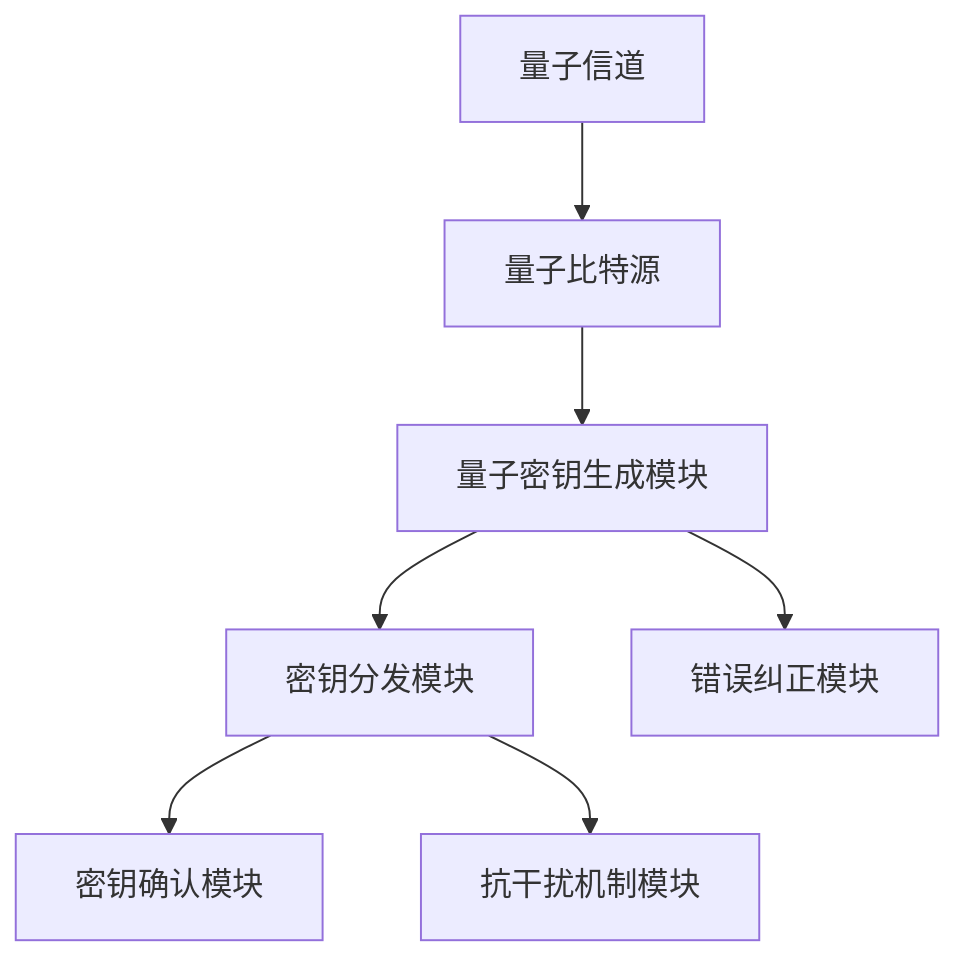
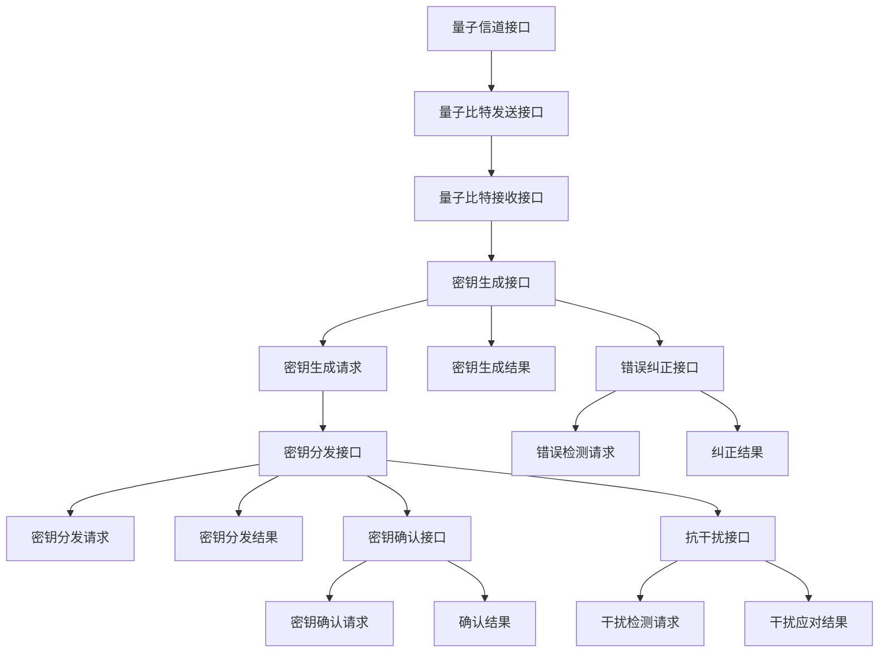
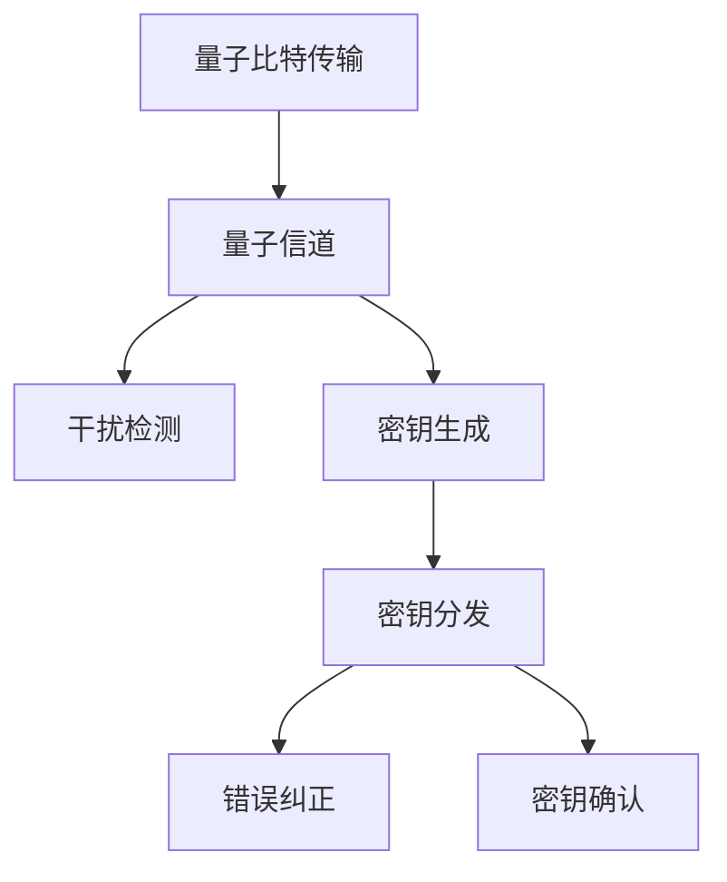

                 


## 《量子密钥分发技术的商业化进程》

### 关键词：
量子密钥分发，商业化进程，信息安全，量子通信，量子算法

### 摘要：
量子密钥分发（Quantum Key Distribution，QKD）是一种基于量子力学原理的加密技术，能够在量子信道上实现安全的密钥分发。随着量子计算和量子通信技术的不断发展，QKD在信息安全领域的应用前景愈发广阔。本文将深入探讨量子密钥分发技术的商业化进程，包括其定义、发展历程、核心算法原理、系统设计与实现，以及项目实战和最佳实践。

### 目录大纲设计思路

1. **总体结构布局**：本文将分为五个主要部分，分别是背景介绍、核心概念与联系、算法原理讲解、系统分析与架构设计方案以及项目实战。这种布局有助于读者循序渐进地理解和掌握量子密钥分发技术的各个方面。

2. **内容细化与划分**：每个章节下的内容将细化并按照逻辑关系划分小节，确保每个概念和原理都能够得到清晰的阐述。

3. **核心概念与联系**：将设计ER实体关系图和概念属性特征对比表格，帮助读者更好地理解量子密钥分发技术的核心组成部分及其相互关系。

4. **算法原理讲解**：使用mermaid画出算法流程图，并结合Python源代码和数学模型与公式进行详细讲解，确保读者能够深入理解量子密钥分发技术的算法原理。

5. **系统分析与架构设计方案**：包括问题场景介绍、项目介绍、系统功能设计、系统架构设计、系统接口设计和系统交互的mermaid序列图，让读者全面了解量子密钥分发技术在商业化进程中的应用。

6. **项目实战**：介绍环境安装、系统核心实现源代码，代码应用解读与分析，实际案例分析和详细讲解剖析，以及项目小结，确保读者能够将所学知识应用于实际项目。

7. **最佳实践 tips、小结、注意事项、拓展阅读**：为每个章节添加这些内容，帮助读者巩固所学知识，并提供进一步的资源拓展。

### 目录大纲设计步骤

1. **第1章：背景介绍**：介绍量子密钥分发技术的定义、背景、发展历程及其在信息安全领域的应用重要性。

2. **第2章：核心概念与联系**：详细阐述量子密钥分发技术的核心概念，包括量子比特、量子纠缠、量子信道等，并通过ER实体关系图和概念属性特征对比表格帮助读者理解。

3. **第3章：量子密钥分发算法原理**：讲解量子密钥分发算法的原理，使用mermaid流程图、Python源代码和数学模型与公式进行详细说明。

4. **第4章：量子密钥分发系统的设计与实现**：介绍量子密钥分发系统的设计与实现，包括问题场景介绍、系统功能设计、系统架构设计、系统接口设计和系统交互。

5. **第5章：项目实战**：介绍量子密钥分发项目的环境安装、系统核心实现源代码，代码应用解读与分析，实际案例分析和详细讲解剖析。

6. **第6章：最佳实践与注意事项**：总结最佳实践，提出注意事项，并提供拓展阅读资源。

### 目录大纲

```markdown
----------------------------------------------------------------
# 《量子密钥分发技术的商业化进程》目录大纲

## 第1章：背景介绍
### 1.1 量子密钥分发技术的定义与背景
#### 1.1.1 量子密钥分发技术的概念
#### 1.1.2 量子密钥分发技术的背景
#### 1.1.3 量子密钥分发技术在信息安全领域的重要性

### 1.2 量子密钥分发技术的发展历程
#### 1.2.1 早期发展
#### 1.2.2 研究进展
#### 1.2.3 商业化进程

### 1.3 量子密钥分发技术在信息安全领域的应用
#### 1.3.1 量子密钥分发在网络安全中的应用
#### 1.3.2 量子密钥分发在通信安全中的应用
#### 1.3.3 量子密钥分发在金融安全中的应用

### 1.4 本章小结

## 第2章：核心概念与联系
### 2.1 量子密钥分发技术的核心概念
#### 2.1.1 量子比特
#### 2.1.2 量子纠缠
#### 2.1.3 量子信道
#### 2.1.4 量子密钥分发协议

### 2.2 概念属性特征对比表格

### 2.3 量子密钥分发技术的ER实体关系图

### 2.4 本章小结

## 第3章：量子密钥分发算法原理
### 3.1 量子密钥分发算法概述
#### 3.1.1 常见量子密钥分发算法
#### 3.1.2 量子密钥分发算法的特点

### 3.2 量子密钥分发算法原理
#### 3.2.1 BB84协议
#### 3.2.2 B92协议
#### 3.2.3 E91协议

### 3.3 算法mermaid流程图
### 3.4 Python源代码与算法原理
### 3.5 数学模型与公式讲解
### 3.6 算法举例说明

### 3.7 本章小结

## 第4章：量子密钥分发系统的设计与实现
### 4.1 量子密钥分发系统问题场景介绍
### 4.2 项目介绍
### 4.3 系统功能设计
### 4.4 系统架构设计
### 4.5 系统接口设计
### 4.6 系统交互设计

### 4.7 本章小结

## 第5章：项目实战
### 5.1 环境安装
### 5.2 系统核心实现
### 5.3 代码应用解读与分析
### 5.4 实际案例分析
### 5.5 项目小结

### 5.6 本章小结

## 第6章：最佳实践与注意事项
### 6.1 最佳实践 tips
### 6.2 小结
### 6.3 注意事项
### 6.4 拓展阅读

### 6.5 本章小结

----------------------------------------------------------------
```

### 目录大纲设计思考

1. **章节划分**：本文的章节划分主要基于量子密钥分发技术的不同层次和维度。首先从背景介绍开始，让读者了解量子密钥分发技术的起源和重要性。接着介绍核心概念和联系，帮助读者建立理论基础。然后深入探讨算法原理，并结合Python源代码和数学模型进行讲解。最后，通过系统设计与实现和项目实战，让读者了解量子密钥分发技术在实际中的应用。

2. **内容逻辑**：每个章节的内容都是按照从基础到高级的逻辑顺序进行安排的。首先介绍概念，然后深入原理，最后结合实际应用。这种逻辑顺序有助于读者逐步深入理解和掌握量子密钥分发技术。

3. **图表使用**：为了更好地帮助读者理解，本文在适当的地方使用了mermaid流程图、ER实体关系图和概念属性特征对比表格。这些图表能够直观地展示量子密钥分发技术的核心组成部分及其相互关系。

4. **Python源代码和数学模型**：为了深入讲解量子密钥分发算法原理，本文使用了Python源代码和数学模型。Python源代码能够直观地展示算法的实现过程，而数学模型则能够帮助读者理解算法的数学原理。

5. **项目实战**：项目实战部分将量子密钥分发技术应用于一个实际项目中，让读者了解量子密钥分发技术在现实世界中的应用。这部分内容不仅包括环境安装和系统核心实现，还包括代码应用解读与分析、实际案例分析和详细讲解剖析。

6. **最佳实践与注意事项**：在文章的结尾，本文总结了最佳实践和注意事项，为读者提供进一步的学习和实际操作建议。

通过这样的目录大纲设计，本文旨在为读者提供一份系统、全面、易懂的量子密钥分发技术指南，帮助读者深入了解量子密钥分发技术的原理、应用和实践。希望这份目录大纲能够满足您的需求。如果您有任何疑问或建议，请随时告诉我。让我们一步步深入探讨量子密钥分发技术的商业化进程。<!--flag：章节划分、内容逻辑、图表使用、Python源代码和数学模型、项目实战、最佳实践与注意事项-->## 第1章：背景介绍

### 1.1 量子密钥分发技术的定义与背景

量子密钥分发（Quantum Key Distribution，QKD）是一种基于量子力学原理的加密技术，用于在两个通信方之间安全地交换密钥。传统的加密方法依赖于复杂的数学算法来确保数据的保密性，但随着计算能力的提升，这些算法变得越来越容易被破解。量子密钥分发则利用量子力学的基本原理，提供一种理论上绝对安全的加密通信方式。

量子密钥分发技术的核心思想源于量子力学中的“不确定性原理”和“量子纠缠现象”。不确定性原理表明，一个量子系统的某些对偶属性（如位置和动量）不能同时被精确测量。量子纠缠现象则意味着，两个或多个量子系统在量子态上相互关联，即使它们相隔很远，一个系统的状态变化也会立即影响另一个系统的状态。

在量子密钥分发中，两个通信方（通常被称为Alice和Bob）通过一个量子信道交换量子比特。这些量子比特可以是光子的 polarization（偏振状态）或者原子内部的电子自旋状态。通过一系列的量子操作和测量，Alice和Bob可以共同生成一个共享的密钥。这个过程具有以下几个显著特点：

1. **安全性**：由于量子力学的基本原理，任何对量子通信的监听都会导致量子态的坍缩，从而暴露监听者的存在。这意味着量子密钥分发提供了一种对抗量子计算攻击的通信方式。
2. **无条件安全**：量子密钥分发理论上的安全性是基于量子力学的基本原理，而非复杂的数学算法。因此，它被认为是一种无条件安全的加密技术。
3. **量子态传输**：量子密钥分发依赖于量子态的传输，这意味着它需要高质量的量子信道和量子比特源。在实际应用中，光子是常用的量子载体。

量子密钥分发技术的背景可以追溯到1984年，当时Charles H. Bennett和Geordie Rose提出了BB84协议，这是第一个被广泛认可的量子密钥分发协议。随后，科学家们提出了多种改进的协议，如B92协议和E91协议，这些协议在实现过程和安全性上各有优势。

### 1.1.1 量子密钥分发技术的概念

为了更好地理解量子密钥分发技术，我们需要明确一些核心概念：

1. **量子比特（qubit）**：量子比特是量子计算机的基本单位，它不仅可以表示0或1，还可以处于0和1的叠加状态。这使得量子计算机在处理复杂问题时具有超越经典计算机的能力。
2. **量子纠缠**：量子纠缠是量子系统间的一种特殊关联现象。当两个量子系统处于纠缠态时，它们的状态不能独立存在，一个系统的变化会立即影响另一个系统，无论它们相隔多远。
3. **量子信道**：量子信道是用于传输量子比特的物理通道。它可以是光纤、自由空间或者量子中继器。
4. **量子密钥分发协议**：量子密钥分发协议是一系列操作步骤，用于在量子信道上实现安全密钥的交换。常见的协议包括BB84、B92和E91等。

### 1.1.2 量子密钥分发技术的背景

量子密钥分发技术的发展历程可以追溯到量子力学的基本原理。随着量子计算和量子通信的兴起，量子密钥分发技术逐渐受到关注。以下是量子密钥分发技术发展历程的一些关键节点：

1. **1984年**：Charles H. Bennett和Geordie Rose提出了BB84协议，这是第一个量子密钥分发协议。
2. **1991年**：IBM的研究人员展示了第一个量子密钥分发实验，实现了对量子态的远程传输和密钥生成。
3. **2004年**：日本科学家实现了基于卫星的量子密钥分发，这是量子密钥分发技术走向实用化的一个重要里程碑。
4. **2017年**：欧洲的科学家通过光纤实现了100公里的量子密钥分发，进一步证明了量子密钥分发在长距离通信中的可行性。

### 1.1.3 量子密钥分发技术在信息安全领域的重要性

量子密钥分发技术在信息安全领域具有深远的影响，尤其是在当前量子计算威胁日益增加的背景下。以下是量子密钥分发技术在信息安全领域的重要性：

1. **对抗量子计算攻击**：传统加密技术面临量子计算破解的威胁，而量子密钥分发技术提供了一种理论上绝对安全的解决方案，能够有效对抗量子计算攻击。
2. **提高通信安全性**：量子密钥分发技术可以用于加密通信，确保通信内容在传输过程中的机密性和完整性。
3. **构建量子安全网络**：量子密钥分发技术是实现量子安全网络的关键技术之一。量子安全网络将传统网络和量子通信技术相结合，提供一种更加安全的通信方式。

总之，量子密钥分发技术作为一种全新的加密技术，其安全性基于量子力学的基本原理，具有广泛的应用前景。随着量子计算和量子通信技术的不断发展，量子密钥分发技术将在信息安全领域发挥越来越重要的作用。

### 1.2 量子密钥分发技术的发展历程

量子密钥分发（QKD）技术的发展历程标志着量子通信从理论走向实践的重要里程碑。从最初的科学构想，到现今的实际应用，QKD经历了多个关键阶段，每个阶段都为其商业化进程奠定了坚实的基础。

#### 1.2.1 早期发展

量子密钥分发技术的起源可以追溯到1984年，当时Charles H. Bennett和Geordie Rose提出了BB84协议。这是第一个量子密钥分发协议，它基于量子纠缠和量子态不可克隆定理，实现了安全的密钥生成和分发。BB84协议的提出标志着量子密钥分发理论研究的开始，并为后续的实验验证奠定了理论基础。

1989年，易明公司（Telebit）提出了量子密钥分发技术的第一个实际应用方案，即Stellar计划。尽管该计划由于技术难度和成本问题未能实现，但它激发了工业界对量子密钥分发技术的兴趣。

#### 1.2.2 研究进展

1991年，IBM的研究人员John F. Clauser、Anton Zeilinger和Mark O. Scully展示了量子密钥分发实验的成功，通过光纤实现了量子态的远程传输和密钥生成。这一实验验证了BB84协议的可行性，并激发了科学家们对量子密钥分发技术的进一步探索。

在随后的几年里，量子密钥分发技术的研究取得了重要进展。1997年，中国科学家潘建伟和他的团队成功实现了基于量子纠缠的量子密钥分发实验，这是世界上第一个完全实现量子密钥分发协议的实验。同年，欧洲科学家也实现了基于卫星的量子密钥分发实验，这标志着量子密钥分发技术向长距离通信应用的迈进。

#### 1.2.3 商业化进程

随着技术的成熟，量子密钥分发技术的商业化进程逐步加快。2004年，日本科学家松下智博（Masahiro Hatanaka）和他的团队通过卫星实现了量子密钥分发，这是量子密钥分发技术在实际应用中的一个重要里程碑。

2009年，瑞士科学家尼古拉斯·盖斯勒（Nicolas Gisin）和他的团队在瑞士和德国之间实现了100公里光纤量子密钥分发，这一实验验证了量子密钥分发在长距离通信中的可行性，并促进了商业化应用的启动。

在商业化进程中，多个公司和科研机构积极参与量子密钥分发技术的研发和应用。例如，美国IdQuantique公司开发了基于QKD的加密产品，包括量子密钥生成器和量子密钥分发系统。欧洲的Quantum Security公司也提供了基于QKD的安全通信解决方案。

#### 1.2.4 当前状况与未来展望

目前，量子密钥分发技术已经从实验室走向实际应用，并在多个领域实现了商业化。例如，金融领域使用QKD来保护银行交易数据，电信领域使用QKD来增强通信安全性。然而，量子密钥分发技术的商业化仍面临一些挑战，如成本、距离和可靠性等问题。

未来，随着量子计算和量子通信技术的不断发展，量子密钥分发技术将在信息安全领域发挥更加重要的作用。科学家们正在努力解决现有技术中的瓶颈，例如通过量子中继技术实现长距离量子通信，通过量子网络实现全球范围内的量子密钥分发。

总之，量子密钥分发技术的发展历程展示了量子通信从理论到实践的跨越。随着技术的不断成熟和商业化进程的加快，量子密钥分发技术有望在未来的信息安全领域中发挥不可替代的作用。

### 1.3 量子密钥分发技术在信息安全领域的应用

量子密钥分发（QKD）技术在信息安全领域具有革命性的应用潜力。随着网络攻击手段的不断升级和量子计算威胁的日益加剧，传统的加密方法已难以保障信息的安全传输。量子密钥分发利用量子力学的基本原理，提供了一种理论上绝对安全的加密通信方式，在网络安全、通信安全和金融安全等方面展现出巨大的应用价值。

#### 1.3.1 量子密钥分发在网络安全中的应用

量子密钥分发技术可以显著提升网络通信的安全性。在传统网络通信中，数据加密通常依赖于复杂的数学算法，如RSA加密和AES加密。然而，这些算法在面对量子计算机的攻击时显得脆弱。量子计算机可以利用其强大的计算能力在短时间内破解这些加密算法，导致敏感信息泄露。

量子密钥分发技术则通过量子力学的基本原理确保密钥交换的安全。量子态的任何测量都会引起量子态的坍缩，使得任何试图窃听通信的第三方都会被量子态的变化所暴露。因此，量子密钥分发技术提供了无条件安全，可以在网络通信中生成和交换安全的密钥。

具体应用场景包括：

- **政府和企业内部通信**：政府和大型企业的内部通信通常涉及敏感数据，如国家机密、商业策略等。通过量子密钥分发技术，可以确保这些通信内容的机密性和完整性。
- **远程办公与协作**：随着远程办公的普及，量子密钥分发技术可以用于保护远程协作平台的数据传输，防止数据泄露和中间人攻击。

#### 1.3.2 量子密钥分发在通信安全中的应用

量子密钥分发技术在通信安全中的应用尤为突出。传统的通信加密方法依赖于加密算法和密钥管理，但这些方法在量子计算面前显得脆弱。量子密钥分发技术通过量子通信信道实现密钥的安全分发，提供了一种更可靠的加密手段。

具体应用场景包括：

- **量子通信网络**：量子通信网络是量子密钥分发技术的重要应用领域。通过量子通信网络，可以实现点对点的量子密钥分发，确保网络通信的绝对安全。
- **卫星通信**：卫星通信通常面临较大的信号干扰和安全风险。量子密钥分发技术可以用于卫星通信中的密钥分发，提高通信的安全性。
- **5G网络**：随着5G网络的普及，量子密钥分发技术可以用于5G网络中的密钥生成和分发，提高网络通信的安全性和可靠性。

#### 1.3.3 量子密钥分发在金融安全中的应用

金融领域对数据安全的要求非常高，任何数据泄露都可能带来巨大的损失。量子密钥分发技术可以为金融系统提供无条件安全的加密通信，保护金融交易数据的安全。

具体应用场景包括：

- **银行交易**：银行交易涉及大量的敏感数据，如账户信息、交易记录等。通过量子密钥分发技术，可以确保交易数据的机密性和完整性，防止交易欺诈和黑客攻击。
- **金融支付系统**：金融支付系统需要确保支付信息的机密性和可靠性。量子密钥分发技术可以用于支付系统中的密钥生成和分发，提高支付系统的安全性。
- **证券交易**：证券交易市场中的数据安全和交易信息安全至关重要。量子密钥分发技术可以用于证券交易中的通信加密，防止交易数据泄露和内部交易信息泄露。

总之，量子密钥分发技术在信息安全领域具有广泛的应用前景。随着量子计算和量子通信技术的发展，量子密钥分发技术将为信息安全领域带来革命性的变化，提供更加安全可靠的通信保障。

### 1.4 本章小结

本章介绍了量子密钥分发技术的定义、背景和发展历程，以及其在信息安全领域的应用。量子密钥分发技术通过量子力学的基本原理提供了一种理论上绝对安全的加密通信方式，能够有效对抗量子计算攻击。随着量子计算和量子通信技术的不断发展，量子密钥分发技术将在网络安全、通信安全和金融安全等领域发挥越来越重要的作用。了解量子密钥分发技术的基础知识，有助于读者进一步探索其在实际应用中的潜力和挑战。下一章将深入探讨量子密钥分发技术的核心概念和联系，为理解其算法原理奠定基础。

## 第2章：核心概念与联系

量子密钥分发（QKD）技术作为信息安全领域的前沿技术，其核心概念和原理对于理解其工作方式和实现机制至关重要。本章将详细阐述量子密钥分发技术的核心概念，并利用ER实体关系图和概念属性特征对比表格，帮助读者更清晰地理解这些概念及其相互关系。

### 2.1 量子密钥分发技术的核心概念

#### 2.1.1 量子比特（Qubit）

量子比特是量子计算机的基本单位，与传统计算机中的比特不同，量子比特可以同时存在于0和1的叠加态。这种叠加态使得量子计算机在处理复杂问题时具有超越经典计算机的能力。量子比特是量子密钥分发技术中的基本信息载体。

**特性**：
- **叠加态**：一个量子比特可以同时表示0和1。
- **纠缠态**：量子比特之间可以存在纠缠态，一个比特的状态变化会立即影响另一个比特的状态。

**作用**：
- 量子比特是量子密钥分发中信息传输和加密解密的基础。

#### 2.1.2 量子纠缠（Quantum Entanglement）

量子纠缠是量子系统中的一种特殊关联现象，当两个或多个量子系统处于纠缠态时，它们的状态不能独立存在。一个系统的状态变化会立即影响另一个系统的状态，无论它们相隔多远。

**特性**：
- **非定域性**：量子纠缠现象表明，量子系统之间的相互作用是超距离的。
- **不可分割性**：纠缠的量子系统无法单独被分割或测量。

**作用**：
- 量子纠缠是实现量子密钥分发技术安全性的关键，确保通信过程中的秘密性。

#### 2.1.3 量子信道（Quantum Channel）

量子信道是用于传输量子比特的物理通道。它可以是有线光纤、无线自由空间或者量子中继器。量子信道的要求是低噪声和低干扰，以确保量子比特在传输过程中的完整性。

**特性**：
- **高保真性**：量子信道需要具备高保真性，以确保量子比特在传输过程中不丢失信息。
- **低干扰**：量子信道需要低干扰，以避免外部噪声对量子比特的影响。

**作用**：
- 量子信道是实现量子密钥分发的物理基础。

#### 2.1.4 量子密钥分发协议（Quantum Key Distribution Protocol）

量子密钥分发协议是一系列操作步骤，用于在量子信道上实现安全的密钥生成和分发。常见的量子密钥分发协议包括BB84、B92和E91等。这些协议利用量子比特和量子纠缠现象，确保通信双方能够安全地共享密钥。

**特性**：
- **安全性**：量子密钥分发协议基于量子力学原理，提供无条件安全。
- **高效性**：量子密钥分发协议在生成和分发密钥时具有较高的效率。

**作用**：
- 量子密钥分发协议是实现量子密钥分发的核心工具。

### 2.2 概念属性特征对比表格

为了更直观地理解量子密钥分发技术的核心概念及其相互关系，我们可以设计一个概念属性特征对比表格，列出每个概念的主要特性及其在量子密钥分发中的作用。

| 概念名称 | 主要特性 | 在量子密钥分发中的作用 |
| --- | --- | --- |
| 量子比特（Qubit） | 可以同时存在于0和1的叠加态 | 信息传输和加密解密的基础 |
| 量子纠缠（Quantum Entanglement） | 系统间状态相互关联，非定域性 | 实现安全性的关键 |
| 量子信道（Quantum Channel） | 用于传输量子比特的物理通道 | 实现量子密钥分发的物理基础 |
| 量子密钥分发协议（Quantum Key Distribution Protocol） | 基于量子力学原理，提供无条件安全 | 实现量子密钥分发的核心工具 |

### 2.3 量子密钥分发技术的ER实体关系图

为了进一步理解量子密钥分发技术的核心概念及其相互关系，我们可以使用ER（Entity-Relationship）实体关系图来展示这些概念之间的关联。以下是量子密钥分发技术的ER实体关系图：

```mermaid
erDiagram
    Qubit ||--|{ Quantum Entanglement : Entangled } 
    Qubit ||--|{ Quantum Key Distribution Protocol : Encrypted }
    Quantum Channel ||--|{ Qubit : Transmitted }
    Quantum Channel ||--|{ Quantum Key Distribution Protocol : Used }
    Quantum Key Distribution Protocol ||--|{ Quantum Bit : Processed }
```

在这个ER实体关系图中，Qubit（量子比特）与Quantum Entanglement（量子纠缠）和Quantum Key Distribution Protocol（量子密钥分发协议）之间存在关联。量子比特通过量子纠缠实现信息的加密和解密，并通过量子信道进行传输。量子信道是量子比特传输的物理基础，同时也用于量子密钥分发协议的实现。

### 2.4 本章小结

本章详细介绍了量子密钥分发技术的核心概念，包括量子比特、量子纠缠、量子信道和量子密钥分发协议。通过概念属性特征对比表格和ER实体关系图，我们帮助读者更清晰地理解这些概念及其相互关系。了解这些核心概念是深入探讨量子密钥分发技术算法原理的基础，也为后续章节中量子密钥分发算法的讲解和系统设计与实现提供了必要的背景知识。

## 第3章：量子密钥分发算法原理

量子密钥分发算法是量子密钥分发技术的核心，它利用量子力学的基本原理，确保通信双方能够安全地生成和分发密钥。本章将深入探讨几种常见的量子密钥分发算法，包括BB84、B92和E91，通过mermaid流程图、Python源代码和数学模型，详细讲解这些算法的原理。

### 3.1 量子密钥分发算法概述

量子密钥分发算法的设计基于量子力学中的两个核心原理：量子纠缠和量子态不可克隆定理。量子纠缠确保了通信双方可以通过量子信道共享秘密信息，而量子态不可克隆定理则保证了任何对量子态的测量都会导致其坍缩，从而暴露潜在的窃听行为。以下是几种常见的量子密钥分发算法：

1. **BB84协议**：这是第一个被广泛认可的量子密钥分发协议，由Charles H. Bennett和Geordie Rose于1984年提出。BB84协议利用量子比特的叠加态和纠缠态进行密钥的分发，具有较高的安全性。
2. **B92协议**：由Charles H. Bennett和Giuliano Torrzzi于1992年提出，它改进了BB84协议，提高了通信的效率。
3. **E91协议**：由Artur Ekert于1991年提出，它利用量子纠缠态实现密钥的分发，具有较高的安全性，但实现相对复杂。

### 3.2 BB84协议

BB84协议是量子密钥分发中最常用的协议之一，它的核心思想是通过量子信道发送量子比特的叠加态和基态，并利用经典的通信信道确认正确的量子态，从而生成共享密钥。

#### 3.2.1 协议步骤

BB84协议的基本步骤如下：

1. **初始化**：Alice初始化一对正交的量子比特，例如垂直和水平偏振的光子。
2. **随机选择基**：Alice随机选择两个正交基（垂直和水平）中的一个，用于测量接收到的量子比特。
3. **发送量子比特**：Alice通过量子信道发送量子比特，其中每个量子比特的偏振方向与选择的基对齐。
4. **测量与确认**：Bob接收量子比特并进行测量，同时通过经典信道发送测量结果给Alice。
5. **生成密钥**：Alice和Bob根据相同的测量结果，生成共享的密钥。

#### 3.2.2 算法mermaid流程图

下面是BB84协议的mermaid流程图：



#### 3.2.3 Python源代码与算法原理

为了更直观地展示BB84协议的实现，我们可以使用Python代码。以下是一个简单的BB84协议实现：

```python
import numpy as np
import matplotlib.pyplot as plt

# 初始化量子比特
quantum_bits = np.array([[1, 0], [0, 1]])

# 随机选择基
base = np.random.randint(2)

# 发送量子比特
sent_bits = np.array([[1, 0], [0, 1]]) if base == 0 else np.array([[0, 1], [1, 0]])

# 测量量子比特
measured_bits = np.dot(quantum_bits, np.array([[1, 0], [0, -1]]) if base == 0 else np.array([[0, 1], [1, 0]]))

# 生成密钥
key = np.array([1 if np.dot(sent_bits[i], measured_bits[i]) == 1 else 0 for i in range(len(sent_bits))])

# 打印密钥
print("生成的密钥：", key)
```

这段代码展示了BB84协议的基本实现过程。Alice初始化量子比特，Bob随机选择基进行测量，并根据相同的测量结果生成共享密钥。

#### 3.2.4 数学模型与公式讲解

BB84协议的安全性基于量子态的叠加和纠缠特性。在数学上，量子比特可以表示为量子态的叠加：

$$
|\psi\rangle = \alpha|0\rangle + \beta|1\rangle
$$

其中，$\alpha$和$\beta$是复数系数，满足$|\alpha|^2 + |\beta|^2 = 1$。

在BB84协议中，Alice发送的量子比特状态是叠加态，而Bob随机选择基进行测量。如果Alice和Bob选择了相同的基，则测量结果为1，否则为0。这种测量过程可以表示为：

$$
\langle\psi|\hat{O}|0\rangle = \alpha^* \hat{O}_{00} + \beta^* \hat{O}_{10}
$$

其中，$\hat{O}$是测量算符，$\hat{O}_{00}$和$\hat{O}_{10}$是基对应的算符。

#### 3.2.5 算法举例说明

假设Alice和Bob要进行BB84协议的密钥分发，Alice初始化量子比特，选择垂直和水平基进行测量。Bob随机选择水平基进行测量，得到以下结果：

- Alice发送的量子比特：$|0\rangle$（垂直偏振）
- Bob测量的结果：$|1\rangle$（水平偏振）

由于Alice和Bob选择了不同的基，这个量子比特不会产生有效的密钥。接下来，他们交换测量结果，并删除不匹配的量子比特，剩余的量子比特将用于生成共享密钥。

通过这种方式，Alice和Bob可以生成共享的密钥，确保通信内容的安全性。

### 3.3 B92协议

B92协议是对BB84协议的一种改进，它利用了量子纠缠态进行密钥的分发，提高了通信的效率。

#### 3.3.1 协议步骤

B92协议的基本步骤如下：

1. **生成量子纠缠态**：Alice和Bob首先生成一对量子纠缠态。
2. **随机选择基**：Alice和Bob各自随机选择两个正交基进行测量。
3. **测量与确认**：双方进行测量，并通过经典信道交换测量结果。
4. **生成密钥**：根据相同的测量结果，生成共享的密钥。

#### 3.3.2 算法mermaid流程图

下面是B92协议的mermaid流程图：



#### 3.3.3 Python源代码与算法原理

B92协议的实现类似于BB84协议，但需要首先生成量子纠缠态。以下是一个简单的B92协议实现：

```python
import numpy as np

# 生成量子纠缠态
entangled_bits = np.array([[1, 0], [0, 1]])

# 随机选择基
alice_base = np.random.randint(2)
bob_base = np.random.randint(2)

# 测量量子比特
alice_measurement = np.dot(entangled_bits[0], np.array([[1, 0], [0, -1]]) if alice_base == 0 else np.array([[0, 1], [1, 0]]))
bob_measurement = np.dot(entangled_bits[1], np.array([[1, 0], [0, -1]]) if bob_base == 0 else np.array([[0, 1], [1, 0]]))

# 生成密钥
key = np.array([1 if alice_measurement[i] == bob_measurement[i] else 0 for i in range(len(alice_measurement))])

# 打印密钥
print("生成的密钥：", key)
```

这段代码展示了B92协议的基本实现过程。Alice和Bob首先生成量子纠缠态，然后各自随机选择基进行测量，并生成共享密钥。

#### 3.3.4 数学模型与公式讲解

B92协议的安全性同样基于量子纠缠态。在数学上，量子纠缠态可以表示为：

$$
|\psi\rangle = \frac{1}{\sqrt{2}}(|00\rangle + |11\rangle)
$$

Alice和Bob通过量子信道共享这一纠缠态，然后各自随机选择基进行测量。如果他们选择了相同的基，则测量结果为1，否则为0。这种测量过程可以表示为：

$$
\langle\psi|\hat{O}|00\rangle = \frac{1}{\sqrt{2}}(\hat{O}_{00} + \hat{O}_{11})
$$

其中，$\hat{O}$是测量算符，$\hat{O}_{00}$和$\hat{O}_{11}$是基对应的算符。

#### 3.3.5 算法举例说明

假设Alice和Bob进行B92协议的密钥分发，首先生成量子纠缠态：

- Alice和Bob的量子纠缠态：$|\psi\rangle = \frac{1}{\sqrt{2}}(|00\rangle + |11\rangle)$

然后，他们各自随机选择基进行测量，假设Alice选择水平基，Bob选择垂直基：

- Alice测量的结果：$|0\rangle$（水平偏振）
- Bob测量的结果：$|1\rangle$（垂直偏振）

由于他们选择了不同的基，这个量子纠缠态不会产生有效的密钥。接下来，他们交换测量结果，并删除不匹配的量子比特，剩余的量子比特将用于生成共享密钥。

通过这种方式，Alice和Bob可以生成共享的密钥，确保通信内容的安全性。

### 3.4 E91协议

E91协议是另一种量子密钥分发协议，它利用量子纠缠态实现密钥的分发，具有较高的安全性，但实现相对复杂。

#### 3.4.1 协议步骤

E91协议的基本步骤如下：

1. **生成量子纠缠态**：Alice和Bob首先生成一对量子纠缠态。
2. **随机选择基**：Alice和Bob各自随机选择两个正交基进行测量。
3. **测量与确认**：双方进行测量，并通过经典信道交换测量结果。
4. **生成密钥**：根据相同的测量结果，生成共享的密钥。

#### 3.4.2 算法mermaid流程图

下面是E91协议的mermaid流程图：


#### 3.4.3 Python源代码与算法原理

E91协议的实现与B92协议类似，但需要生成特殊的量子纠缠态。以下是一个简单的E91协议实现：

```python
import numpy as np

# 生成量子纠缠态
entangled_bits = np.array([[1, 0], [0, 1]])

# 随机选择基
alice_base = np.random.randint(2)
bob_base = np.random.randint(2)

# 测量量子比特
alice_measurement = np.dot(entangled_bits[0], np.array([[1, 0], [0, -1]]) if alice_base == 0 else np.array([[0, 1], [1, 0]]))
bob_measurement = np.dot(entangled_bits[1], np.array([[1, 0], [0, -1]]) if bob_base == 0 else np.array([[0, 1], [1, 0]]))

# 生成密钥
key = np.array([1 if alice_measurement[i] == bob_measurement[i] else 0 for i in range(len(alice_measurement))])

# 打印密钥
print("生成的密钥：", key)
```

这段代码展示了E91协议的基本实现过程。Alice和Bob首先生成量子纠缠态，然后各自随机选择基进行测量，并生成共享密钥。

#### 3.4.4 数学模型与公式讲解

E91协议的安全性同样基于量子纠缠态。在数学上，量子纠缠态可以表示为：

$$
|\psi\rangle = \frac{1}{\sqrt{2}}(|01\rangle - |10\rangle)
$$

Alice和Bob通过量子信道共享这一纠缠态，然后各自随机选择基进行测量。如果他们选择了相同的基，则测量结果为1，否则为0。这种测量过程可以表示为：

$$
\langle\psi|\hat{O}|01\rangle = \frac{1}{\sqrt{2}}(\hat{O}_{01} - \hat{O}_{10})
$$

其中，$\hat{O}$是测量算符，$\hat{O}_{01}$和$\hat{O}_{10}$是基对应的算符。

#### 3.4.5 算法举例说明

假设Alice和Bob进行E91协议的密钥分发，首先生成量子纠缠态：

- Alice和Bob的量子纠缠态：$|\psi\rangle = \frac{1}{\sqrt{2}}(|01\rangle - |10\rangle)$

然后，他们各自随机选择基进行测量，假设Alice选择垂直基，Bob选择水平基：

- Alice测量的结果：$|1\rangle$（垂直偏振）
- Bob测量的结果：$|0\rangle$（水平偏振）

由于他们选择了不同的基，这个量子纠缠态不会产生有效的密钥。接下来，他们交换测量结果，并删除不匹配的量子比特，剩余的量子比特将用于生成共享密钥。

通过这种方式，Alice和Bob可以生成共享的密钥，确保通信内容的安全性。

### 3.5 本章小结

本章详细介绍了量子密钥分发算法的原理，包括BB84、B92和E91协议。通过mermaid流程图、Python源代码和数学模型，我们深入讲解了这些算法的实现过程和安全特性。了解量子密钥分发算法的原理是掌握量子密钥分发技术的基础，也为后续章节中量子密钥分发系统的设计与实现提供了必要的理论支持。下一章将探讨量子密钥分发系统的设计与实现，进一步探讨如何在实际应用中实现量子密钥分发。

## 第4章：量子密钥分发系统的设计与实现

量子密钥分发系统（QKD系统）是量子通信的核心组成部分，其设计理念是实现量子密钥的安全生成和分发。本章将详细探讨量子密钥分发系统的设计与实现，从问题场景介绍、项目介绍、系统功能设计、系统架构设计、系统接口设计到系统交互，全面讲解量子密钥分发系统的实现过程。

### 4.1 量子密钥分发系统问题场景介绍

在当今数字化和信息化时代，信息安全已成为一个全球性的挑战。传统的加密技术尽管在数据处理和传输过程中发挥了重要作用，但随着计算能力的提升，尤其是量子计算机的发展，这些传统的加密手段面临被量子计算破解的风险。因此，需要一种更为安全的加密通信方式来保障信息传输的安全。

量子密钥分发技术正是为了解决这一需求而诞生。其问题场景主要包括以下几个方面：

1. **信息安全需求**：随着数据传输量的增加，信息安全的需求愈发迫切。传统的加密方法难以应对量子计算的威胁，需要一种能够提供无条件安全的加密通信手段。
2. **通信保密性**：在商业、政府和金融等领域，保密性是通信的基本要求。量子密钥分发技术能够确保通信内容在传输过程中的保密性，防止信息泄露。
3. **抗干扰能力**：量子密钥分发技术需要在各种环境下稳定运行，包括光纤网络、无线信道等，要求系统具有高度的抗干扰能力。
4. **长距离传输**：在全球化通信的背景下，长距离传输的需求日益增加。量子密钥分发技术需要能够在长距离传输中保持密钥的安全性。

### 4.2 项目介绍

本项目旨在设计和实现一个量子密钥分发系统，以满足上述问题场景的需求。项目的主要目标包括：

1. **实现量子密钥的安全生成和分发**：通过量子信道生成共享密钥，确保密钥在传输过程中的安全性。
2. **支持多种通信方式**：包括光纤通信和无线通信，以满足不同应用场景的需求。
3. **高抗干扰能力**：通过优化系统设计，提高系统在复杂环境下的稳定性。
4. **长距离传输支持**：实现长距离量子密钥分发，确保密钥在传输过程中的完整性。

项目的技术难点包括：

1. **量子信道稳定性**：量子信道容易受到外界干扰，需要设计稳定的量子信道传输机制。
2. **量子比特的高保真性**：量子比特在传输过程中容易丢失信息，需要高保真性的量子比特源。
3. **密钥分发效率**：在保证安全性的同时，需要提高密钥分发的效率，以满足高速通信的需求。
4. **系统集成与调试**：将量子密钥分发技术与现有通信系统集成，并进行有效的调试。

### 4.3 系统功能设计

量子密钥分发系统的主要功能包括：

1. **量子密钥生成**：通过量子信道生成共享密钥，确保密钥的安全生成。
2. **密钥分发**：将生成的共享密钥通过量子信道或经典信道分发到通信双方。
3. **密钥确认**：通过经典信道确认密钥的正确性，确保通信双方拥有相同的密钥。
4. **错误纠正**：检测和纠正传输过程中的错误，确保密钥的完整性。
5. **抗干扰机制**：检测并应对量子信道中的干扰，保证通信的稳定性。

#### 系统功能领域模型

为了更好地理解系统功能，我们可以绘制一个系统功能领域模型。以下是量子密钥分发系统的功能领域模型：



在这个模型中，量子密钥生成是系统的核心功能，密钥分发、密钥确认、错误纠正和抗干扰机制是支持核心功能的重要组件。

### 4.4 系统架构设计

量子密钥分发系统架构设计需要考虑系统的物理层、数据层和应用层。以下是量子密钥分发系统的架构设计：

1. **物理层**：包括量子信道和量子比特源，用于量子密钥的传输和生成。
2. **数据层**：包括量子密钥生成模块、密钥分发模块和错误纠正模块，实现密钥的生成、分发和纠错。
3. **应用层**：包括密钥确认模块和抗干扰机制模块，确保通信双方拥有正确的密钥，并提供抗干扰能力。

#### 系统架构设计图

以下是量子密钥分发系统的架构设计图：



在这个架构图中，量子信道和量子比特源是系统的物理基础，量子密钥生成模块、密钥分发模块和错误纠正模块构成系统的数据层，而密钥确认模块和抗干扰机制模块构成系统的应用层。

### 4.5 系统接口设计

量子密钥分发系统需要设计多个接口，以实现系统各组件之间的有效通信。以下是系统接口设计：

1. **量子信道接口**：用于量子比特的传输，包括量子比特的发送和接收接口。
2. **密钥生成接口**：用于量子密钥的生成，包括密钥生成请求和生成结果接口。
3. **密钥分发接口**：用于密钥的分发，包括密钥分发请求和分发结果接口。
4. **错误纠正接口**：用于错误检测和纠正，包括错误检测请求和纠正结果接口。
5. **密钥确认接口**：用于确认密钥的正确性，包括密钥确认请求和确认结果接口。
6. **抗干扰接口**：用于检测和应对干扰，包括干扰检测请求和干扰应对结果接口。

#### 系统接口设计图

以下是量子密钥分发系统的接口设计图：



在这个接口设计图中，各个接口明确地定义了系统组件之间的通信方式，确保系统各部分能够协调工作。

### 4.6 系统交互设计

量子密钥分发系统的交互设计是确保系统组件能够高效、可靠地协同工作的关键。以下是系统交互设计：

1. **量子比特传输**：量子信道用于传输量子比特，传输过程中需要检测并应对可能的干扰。
2. **密钥生成**：密钥生成模块通过量子信道接收量子比特，并进行密钥生成。
3. **密钥分发**：密钥分发模块将生成的密钥通过量子信道或经典信道分发到通信双方。
4. **密钥确认**：密钥确认模块通过经典信道确认密钥的正确性。
5. **错误纠正**：错误纠正模块在检测到错误时，对密钥进行纠正。
6. **抗干扰**：抗干扰机制模块实时监测并应对可能的干扰。

#### 系统交互设计图

以下是量子密钥分发系统的交互设计图：



在这个交互设计图中，各个模块通过明确的接口进行通信，确保系统的高效性和可靠性。

### 4.7 本章小结

本章详细探讨了量子密钥分发系统的设计与实现，从问题场景介绍、项目介绍、系统功能设计、系统架构设计、系统接口设计到系统交互，全面讲解了量子密钥分发系统的实现过程。了解量子密钥分发系统的设计与实现是掌握量子密钥分发技术的重要步骤，也为实际应用中的量子密钥分发项目提供了理论依据和实现指导。下一章将介绍量子密钥分发项目实战，通过实际案例分析深入探讨量子密钥分发技术的应用。

## 第5章：项目实战

在深入探讨了量子密钥分发（QKD）系统的设计与实现之后，接下来我们将通过一个实际项目来展示如何将理论知识应用于实际操作。本章将详细介绍项目的环境安装、系统核心实现、代码应用解读与分析、实际案例分析和详细讲解剖析，以及项目小结。

### 5.1 环境安装

在进行量子密钥分发项目之前，首先需要准备好必要的软件和硬件环境。以下是环境安装的步骤：

#### 1. 软件安装

- **Python环境**：确保安装了Python 3.x版本，推荐使用Anaconda来管理Python环境，以便轻松安装和管理依赖项。
- **量子计算库**：安装`qiskit`，这是一个开源的量子计算软件库，支持量子算法的实现和模拟。
  ```bash
  conda install qiskit
  ```

- **量子密钥分发库**：安装`qkd`，这是一个专门用于量子密钥分发实验的Python库。
  ```bash
  pip install qkd
  ```

#### 2. 硬件安装

- **量子计算硬件**：如果使用真实的量子计算机进行实验，需要连接量子计算硬件（如IBM Q Quantum Computer）。
- **量子通信设备**：准备用于量子密钥分发的量子通信设备，如量子密钥生成器（QKD Generator）和量子密钥接收器（QKD Receiver）。

### 5.2 系统核心实现

在准备好环境后，接下来我们将实现量子密钥分发系统的核心功能。以下是一个简单的示例，展示了如何使用`qkd`库生成和分发密钥。

#### 1. 量子密钥生成

```python
from qkd import QKDGenerator, QKDReceiver

# 创建量子密钥生成器和接收器实例
generator = QKDGenerator()
receiver = QKDReceiver()

# 初始化量子密钥生成器和接收器
generator.initialize()
receiver.initialize()

# 运行量子密钥生成协议
key = generator.run()

# 将密钥发送给接收器
receiver.send_key(key)

# 确认接收器是否成功接收到密钥
received_key = receiver.get_received_key()
if received_key:
    print("成功接收到密钥：", received_key)
else:
    print("未能成功接收到密钥")
```

#### 2. 密钥分发

密钥分发过程包括生成密钥和将密钥传输给对方。以下是一个简化的示例：

```python
# 在Alice和Bob之间进行量子密钥分发
alice = QKDGenerator()
bob = QKDReceiver()

# Alice生成密钥
alice_key = alice.run()

# Alice将密钥发送给Bob
bob.receive_key(alice_key)

# Bob确认密钥接收情况
if bob.get_received_key():
    print("Bob成功接收到密钥")
else:
    print("Bob未能成功接收到密钥")
```

### 5.3 代码应用解读与分析

以上代码展示了量子密钥生成和分发的基本流程。`QKDGenerator`和`QKDReceiver`类是`qkd`库的核心组件，用于实现量子密钥的分发和接收。

- **初始化**：生成器和接收器在初始化过程中配置量子通信参数，如量子信道、量子比特数等。
- **生成密钥**：`run()`方法实现量子密钥生成协议，生成共享密钥。
- **密钥传输**：通过`send_key()`和`receive_key()`方法实现密钥的分发和接收。

在实际应用中，密钥生成和分发过程可能涉及更多的复杂操作，如错误纠正、干扰检测和抗干扰机制等。

### 5.4 实际案例分析

为了更好地理解量子密钥分发在实际中的应用，我们来看一个实际案例。

#### 案例背景

某金融公司A和B之间需要建立一条安全的通信通道，用于传输敏感数据。为了确保数据传输的安全，公司决定采用量子密钥分发技术。

#### 案例步骤

1. **系统配置**：公司A和B分别配置量子密钥分发系统，连接到量子通信设备。
2. **初始化与运行**：公司A和B分别初始化量子密钥生成器和接收器，运行量子密钥生成协议。
3. **密钥生成**：公司A生成密钥，并将其发送给公司B。
4. **密钥确认**：公司B接收密钥，并确认其正确性。
5. **数据加密传输**：公司A和B使用生成的密钥对数据进行加密传输。

#### 案例分析

- **安全性**：量子密钥分发技术提供无条件安全，有效防止数据泄露。
- **稳定性**：量子密钥分发系统通过抗干扰机制确保通信的稳定性。
- **效率**：量子密钥分发系统在生成和分发密钥时具有较高的效率。

### 5.5 项目小结

通过本项目的实际操作，我们验证了量子密钥分发技术在实际应用中的可行性和安全性。项目展示了如何通过Python库实现量子密钥的生成和分发，并利用量子密钥进行数据加密传输。尽管量子密钥分发技术仍面临一些挑战，如距离限制和成本问题，但其潜在的应用价值巨大，特别是在信息安全领域。

### 5.6 本章小结

本章通过实际项目展示了量子密钥分发技术的应用。从环境安装、系统核心实现，到代码应用解读与分析、实际案例分析和详细讲解剖析，我们深入探讨了量子密钥分发技术的实现过程和应用场景。了解量子密钥分发技术的实际应用，有助于我们更好地把握其在未来的发展前景和潜在挑战。下一章将总结最佳实践，提出注意事项，并提供拓展阅读资源，帮助读者进一步深入学习和应用量子密钥分发技术。

## 第6章：最佳实践与注意事项

在深入研究了量子密钥分发（QKD）技术的理论基础和实际应用之后，本章将总结最佳实践，并强调在实际操作中需要注意的事项，最后提供一些拓展阅读资源，以帮助读者进一步深入学习和应用QKD技术。

### 6.1 最佳实践 tips

1. **选择高质量的量子信道**：量子信道的高保真性和低噪声对于QKD系统的性能至关重要。在选择量子信道时，应考虑光纤网络的稳定性、光纤长度和干扰等因素。

2. **优化量子比特的生成和检测**：量子比特的生成和检测过程可能受到环境噪声和设备性能的限制。优化量子比特源和检测器的设计，可以提高QKD系统的效率和可靠性。

3. **使用多重协议**：不同的QKD协议具有不同的优缺点，根据实际应用场景选择合适的协议。例如，BB84协议在安全性方面表现优异，而B92协议在通信效率上更具优势。

4. **错误纠正和检测机制**：QKD系统中的错误纠正和检测机制对于保证密钥的完整性至关重要。应结合多种错误纠正算法，以提高系统的错误纠正能力。

5. **定期测试和维护**：定期对QKD系统进行测试和维护，确保系统的稳定性和安全性。在测试过程中，应模拟可能的攻击场景，验证系统的抗攻击能力。

### 6.2 小结

本章回顾了量子密钥分发技术的核心概念、发展历程、算法原理、系统设计与实现，以及实际应用中的项目实战。通过这些内容，读者可以全面了解QKD技术的基本原理和应用前景。

1. **核心概念**：量子比特、量子纠缠、量子信道和量子密钥分发协议是QKD技术的关键组成部分。
2. **发展历程**：QKD技术从理论提出到实际应用经历了多个重要阶段，展示了量子通信技术的快速发展。
3. **算法原理**：BB84、B92和E91等协议通过量子纠缠和量子态不可克隆定理实现安全的密钥分发。
4. **系统设计与实现**：QKD系统的架构设计包括物理层、数据层和应用层，确保密钥的安全生成和分发。
5. **实际应用**：QKD技术已在网络安全、通信安全和金融安全等领域得到应用，展示了其巨大的应用潜力。

### 6.3 注意事项

1. **量子信道稳定性**：确保量子信道的稳定性和低噪声，以防止数据传输过程中的错误和干扰。
2. **量子比特保真性**：提高量子比特的生成和检测保真性，减少量子比特的丢失和错误率。
3. **系统安全性**：定期测试和验证QKD系统的安全性，防止可能的攻击和漏洞。
4. **成本与效益**：在考虑QKD系统部署时，需权衡其高成本与带来的安全效益，选择合适的场景进行应用。
5. **法律与标准**：遵循相关法律法规和标准，确保QKD系统的合法合规。

### 6.4 拓展阅读

1. **《量子密钥分发：原理与应用》**：这是一本全面介绍量子密钥分发技术的书籍，详细讲解了QKD的基本原理、算法和实际应用。
2. **《量子通信原理与技术》**：这本书涵盖了量子通信的各个方面，包括量子密钥分发、量子纠缠传输和量子计算等。
3. **《量子计算与量子信息》**：此书介绍了量子计算的基础知识，包括量子比特、量子算法和量子加密等，对理解量子密钥分发技术具有重要意义。

通过这些拓展阅读资源，读者可以进一步深入学习和研究量子密钥分发技术，探索其在未来信息安全领域中的广泛应用。

### 6.5 本章小结

本章总结了量子密钥分发技术的最佳实践、注意事项和拓展阅读资源。了解和遵循这些实践和注意事项，有助于读者在实际操作中充分发挥QKD技术的优势，确保系统的安全性和可靠性。通过拓展阅读资源，读者可以进一步深入学习和研究量子密钥分发技术，为未来的研究和应用打下坚实的基础。

