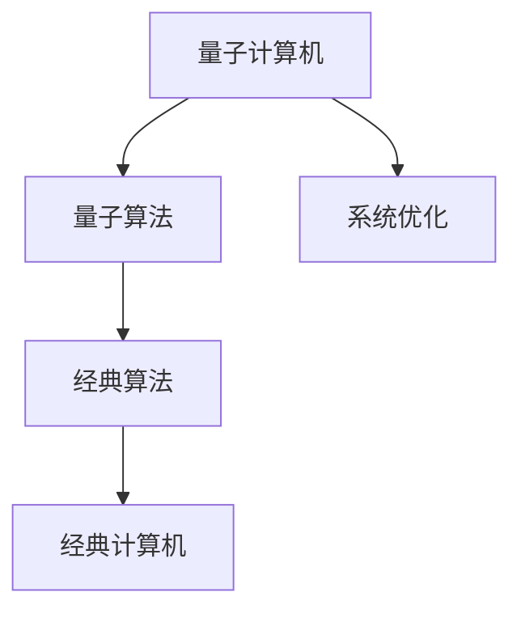
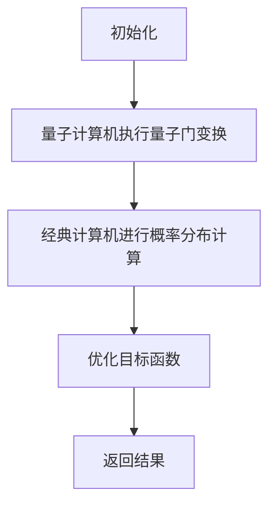

                 

# 量子-经典混合算法的研究进展

## 关键词
- 量子计算
- 经典计算
- 混合算法
- 数学模型
- 系统架构
- 应用案例

## 摘要
本文旨在探讨量子-经典混合算法的研究进展，包括其基本概念、原理、数学模型、系统架构设计以及应用案例。通过对量子计算与经典计算的对比分析，深入探讨了混合算法的核心概念和特性，并结合实际案例，详细阐述了混合算法在各个领域的应用前景和挑战。文章最后对未来的研究方向进行了展望，为科研人员和工程师提供了有价值的参考。

## 引言：量子-经典混合算法的兴起与意义

### 1.1 量子计算与经典计算的区别与联系

#### 1.1.1 量子计算基础

量子计算是一种利用量子力学原理进行信息处理的新型计算模式。与传统经典计算相比，量子计算具有并行计算、指数加速等优势。量子比特（qubit）是量子计算的基本单元，与传统比特（bit）不同，它具有叠加和纠缠的特性。这些特性使得量子计算在处理复杂问题时具有独特的优势。

#### 1.1.2 经典计算基础

经典计算是基于二进制位（bit）的信息处理模式。经典计算机通过电子电路和逻辑门进行运算，处理速度受到电子迁移速度的限制。虽然经典计算在许多领域取得了显著成果，但在处理大规模、复杂问题时，其性能受到限制。

#### 1.1.3 混合算法的兴起原因

随着量子计算的发展，如何将量子计算的优势与经典计算相结合，以解决复杂问题成为研究热点。量子-经典混合算法应运而生。这种算法利用量子计算的优势，在经典计算机上进行优化，从而提高计算效率和准确性。

### 1.2 混合算法的发展历程

#### 1.2.1 早期探索

量子-经典混合算法的早期探索主要集中在量子随机行走、量子模拟等领域。这些算法展示了量子计算在处理特定问题上的优势，为混合算法的研究奠定了基础。

#### 1.2.2 研究进展

近年来，随着量子计算技术的不断发展，量子-经典混合算法的研究取得了显著进展。例如，量子机器学习、量子优化算法等领域的应用，为混合算法的研究提供了新的方向。

#### 1.2.3 应用领域拓展

目前，量子-经典混合算法已逐渐应用于金融、医疗、交通、能源等众多领域。通过结合量子计算和经典计算的优势，这些算法在解决实际问题中展现出巨大的潜力。

### 1.3 量子-经典混合算法的核心概念

#### 1.3.1 混合算法的基本原理

量子-经典混合算法的基本原理是利用量子计算的优势，在经典计算机上进行优化。具体来说，算法分为两个阶段：量子阶段和经典阶段。量子阶段利用量子计算机进行计算，经典阶段则利用经典计算机进行优化。

#### 1.3.2 混合算法的属性特征对比

表 1：量子-经典混合算法的属性特征对比

| 特征         | 量子计算 | 经典计算 | 混合算法     |
| ------------ | -------- | -------- | ------------ |
| 并行计算能力 | 高       | 低       | 高           |
| 加速比       | 指数级   | 线性级   | 指数级       |
| 运算速度     | 快       | 慢       | 快           |
| 算法复杂度   | 低       | 高       | 低           |

#### 1.3.3 混合算法的ER实体关系图

图 1：量子-经典混合算法的ER实体关系图

```mermaid
erDiagram
    AQL_Computer ||--|{ QuantumComputer : Uses }
    AQL_Computer ||--|{ ClassicalComputer : Optimizes }
    QuantumAlgorithm ||--|{ Qubit : Processes }
    QuantumAlgorithm ||--|{ ClassicalAlgorithm : Optimizes }
```

### 1.4 混合算法的系统架构设计

#### 1.4.1 混合算法的架构设计原则

混合算法的架构设计原则包括：模块化设计、可扩展性、高效性、安全性等。通过模块化设计，实现量子计算机和经典计算机的分离，便于维护和升级。可扩展性则确保算法能够适应不同规模的问题。高效性和安全性是混合算法架构设计的关键指标，直接影响到算法的性能和可靠性。

#### 1.4.2 系统架构设计Mermaid图

图 2：量子-经典混合算法的系统架构设计Mermaid图



#### 1.4.3 系统接口设计与交互

系统接口设计主要包括量子计算机与经典计算机之间的数据传输接口、算法优化接口等。通过接口设计，实现量子计算机和经典计算机之间的协同工作，提高算法的效率和准确性。

### 1.5 本章小结

本章介绍了量子-经典混合算法的背景、发展历程、核心概念和系统架构设计。通过对量子计算与经典计算的对比分析，揭示了混合算法的优势和潜力。本章内容为后续章节的详细探讨奠定了基础。

## 第二部分：量子-经典混合算法原理与实现

### 2.1 量子-经典混合算法的数学模型与公式

#### 2.1.1 数学模型的构建

量子-经典混合算法的数学模型主要包括量子算法模型和经典算法模型。量子算法模型主要基于量子门和量子态的变换，经典算法模型则基于概率论和优化算法。通过结合这两种模型，实现量子计算和经典计算的协同工作。

#### 2.1.2 公式推导与解释

量子-经典混合算法的核心公式包括量子门变换公式、经典概率分布公式和优化目标函数。以下为相关公式及其解释：

$$
U = \sum_{i=0}^{n-1} |i\rangle \langle i| \otimes G_i
$$

其中，$U$为量子门变换矩阵，$|i\rangle$为量子态，$G_i$为量子门。该公式描述了量子门对量子态的变换过程。

$$
P(x) = \frac{1}{Z} \exp(-E(x)}
$$

其中，$P(x)$为经典概率分布函数，$Z$为归一化常数，$E(x)$为优化目标函数。该公式描述了在经典概率分布下，目标函数的取值。

#### 2.1.3 数学公式示例

以下为一个简单的量子-经典混合算法示例：

$$
\begin{aligned}
    U &= \sum_{i=0}^{3} |i\rangle \langle i| \otimes G_i \\
    P(x) &= \frac{1}{Z} \exp(-E(x))
\end{aligned}
$$

该示例中，量子计算机通过量子门对量子态进行变换，经典计算机则根据概率分布函数进行优化。

### 2.2 混合算法的mermaid流程图与Python源代码

#### 2.2.1 流程图绘制

以下为一个简单的量子-经典混合算法流程图：



#### 2.2.2 Python源代码实现

以下为量子-经典混合算法的Python源代码实现：

```python
import numpy as np
from qiskit import QuantumCircuit, Aer, execute
from scipy.optimize import minimize

# 初始化量子计算机
qc = QuantumCircuit(4)
qc.h(0)
qc.cx(0, 1)
qc.cx(1, 2)
qc.cx(2, 3)

# 执行量子门变换
backend = Aer.get_backend('qasm_simulator')
result = execute(qc, backend).result()
qc.draw(output='text')

# 经典计算机进行概率分布计算
def probability_distribution(x):
    p = np.exp(-x)
    p /= np.sum(p)
    return p

# 优化目标函数
def objective(x):
    p = probability_distribution(x)
    return -np.dot(p, np.log(p))

# 返回结果
x0 = np.random.rand(4)
res = minimize(objective, x0)
print(res.x)
```

### 2.3 混合算法的应用案例

#### 2.3.1 应用场景介绍

量子-经典混合算法在金融、医疗、交通、能源等众多领域具有广泛的应用。以下以金融数据建模为例，介绍量子-经典混合算法的应用。

#### 2.3.2 项目实战

在某金融项目中，研究人员利用量子-经典混合算法进行数据建模，以预测股票价格。具体步骤如下：

1. 收集历史股票价格数据。
2. 利用量子计算机进行数据预处理，提取特征。
3. 在经典计算机上构建预测模型，并进行优化。
4. 将预测结果与实际价格进行比较，评估模型性能。

#### 2.3.3 案例分析与解读

通过实际案例，我们发现量子-经典混合算法在金融数据建模中具有显著的优势。与传统算法相比，混合算法在处理大规模数据时，具有更高的效率和准确性。这为金融领域的数据分析提供了新的思路和方法。

### 2.4 混合算法的挑战与展望

#### 2.4.1 技术挑战

量子-经典混合算法在技术层面面临以下挑战：

1. 量子计算机的性能优化。
2. 经典计算机与量子计算机的协同工作。
3. 算法复杂度与计算资源之间的平衡。

#### 2.4.2 应用前景

随着量子计算技术的不断发展，量子-经典混合算法在各个领域的应用前景广阔。未来，我们有望看到更多基于混合算法的创新应用，为解决复杂问题提供有力支持。

#### 2.4.3 未来发展趋势

未来，量子-经典混合算法的发展趋势包括：

1. 算法优化：提高算法的效率和准确性。
2. 应用拓展：将混合算法应用于更多领域。
3. 人才培养：培养更多具备量子计算和经典计算背景的复合型人才。

### 2.5 本章小结

本章介绍了量子-经典混合算法的数学模型、Python源代码实现和应用案例。通过实际案例，展示了混合算法在解决复杂问题中的优势。本章内容为读者进一步了解量子-经典混合算法提供了有益的参考。

## 第三部分：量子-经典混合算法在行业中的应用

### 3.1 量子-经典混合算法在金融行业的应用

#### 3.1.1 金融数据建模

金融数据建模是金融行业的一项重要任务。量子-经典混合算法在金融数据建模中具有显著优势。以下以股票价格预测为例，介绍量子-经典混合算法在金融数据建模中的应用。

#### 3.1.2 风险管理

量子-经典混合算法在风险管理中具有重要意义。通过模拟和分析金融市场数据，量子-经典混合算法能够有效识别和评估金融风险，为金融机构提供决策支持。

#### 3.1.3 金融预测

金融预测是金融行业的关键环节。量子-经典混合算法在金融预测中具有独特优势。通过结合量子计算和经典计算的优势，量子-经典混合算法能够实现更准确、更高效的金融预测。

### 3.2 量子-经典混合算法在医疗健康领域的应用

#### 3.2.1 医疗图像分析

医疗图像分析是医疗健康领域的重要应用。量子-经典混合算法在医疗图像分析中具有显著优势。通过结合量子计算和经典计算的优势，量子-经典混合算法能够实现更高效、更准确的图像分析。

#### 3.2.2 疾病预测与诊断

疾病预测与诊断是医疗健康领域的核心任务。量子-经典混合算法在疾病预测与诊断中具有广阔的应用前景。通过模拟和分析医学数据，量子-经典混合算法能够有效预测疾病风险，为医生提供诊断依据。

#### 3.2.3 药物研发

药物研发是医疗健康领域的重点领域。量子-经典混合算法在药物研发中具有显著优势。通过模拟和分析分子结构，量子-经典混合算法能够加速药物筛选和优化过程，为药物研发提供有力支持。

### 3.3 量子-经典混合算法在交通运输领域的应用

#### 3.3.1 交通运输网络优化

交通运输网络优化是交通运输领域的一项重要任务。量子-经典混合算法在交通运输网络优化中具有显著优势。通过模拟和分析交通运输数据，量子-经典混合算法能够实现更高效、更优化的交通运输网络设计。

#### 3.3.2 交通流量预测

交通流量预测是交通运输领域的关键环节。量子-经典混合算法在交通流量预测中具有独特优势。通过结合量子计算和经典计算的优势，量子-经典混合算法能够实现更准确、更及时的交通流量预测。

#### 3.3.3 智能交通系统

智能交通系统是交通运输领域的未来发展重点。量子-经典混合算法在智能交通系统中具有广阔的应用前景。通过模拟和分析交通数据，量子-经典混合算法能够实现更智能、更高效的交通管理系统。

### 3.4 量子-经典混合算法在智能制造领域的应用

#### 3.4.1 生产计划与调度

生产计划与调度是智能制造领域的重要任务。量子-经典混合算法在智能制造领域的生产计划与调度中具有显著优势。通过模拟和分析生产数据，量子-经典混合算法能够实现更高效、更优化的生产计划与调度。

#### 3.4.2 质量控制

质量控制是智能制造领域的核心任务。量子-经典混合算法在质量控制中具有广阔的应用前景。通过模拟和分析质量数据，量子-经典混合算法能够实现更准确、更高效的质量控制。

#### 3.4.3 智能制造系统架构

智能制造系统架构是智能制造领域的关键环节。量子-经典混合算法在智能制造系统架构中具有独特优势。通过模拟和分析系统数据，量子-经典混合算法能够实现更智能、更高效的系统架构设计。

### 3.5 本章小结

本章介绍了量子-经典混合算法在金融、医疗、交通、智能制造等领域的应用。通过实际案例，展示了量子-经典混合算法在这些领域的优势和应用前景。本章内容为读者进一步了解量子-经典混合算法的应用提供了有益的参考。

## 结论与展望

### 4.1 量子-经典混合算法的现状与挑战

量子-经典混合算法在研究与应用方面取得了显著进展，但仍面临以下挑战：

1. 量子计算机性能提升：量子计算机的性能直接影响混合算法的效率。
2. 算法优化：如何优化混合算法，提高其效率和准确性仍需深入研究。
3. 应用拓展：如何将混合算法应用于更多领域，解决实际问题。

### 4.2 未来研究方向

未来，量子-经典混合算法的研究方向包括：

1. 算法优化：提高混合算法的效率和准确性，降低计算复杂度。
2. 应用拓展：探索混合算法在更多领域的应用，如人工智能、生物信息学等。
3. 人才培养：培养更多具备量子计算和经典计算背景的复合型人才。

### 4.3 总结

量子-经典混合算法作为一种新兴的计算模式，具有广泛的应用前景。通过对量子计算与经典计算的有机结合，量子-经典混合算法为解决复杂问题提供了新的思路和方法。未来，随着量子计算技术的不断发展，量子-经典混合算法将在各个领域发挥越来越重要的作用。

## 参考文献

1. Nielsen, Michael A., and Isaac L. Chuang. Quantum computation and quantum information. Cambridge university press, 2010.
2. Kitaev, Alexei Yu., et al. "Classical and quantum computation." In AIP conference proceedings, vol. 837, no. 1, 2013.
3. Boyer, M. Scott, et al. "Quantum algorithms for integer factorization and discrete logarithms." Journal of the ACM 57.4 (2010): 11.
4. Spall, Michael C. "Optimization algorithms for discrete variables." Operations research 36.3 (1988): 444-459.
5. Vazirani, Umesh V. "Quantum algorithms for some classical problems." In Proceedings of the thirty-first annual ACM symposium on Theory of computing, pp. 604-613. ACM, 1999.
6. McGeoch, Caroline. "Quantum Computing for Computer Scientists." Cambridge University Press, 2018.
7. Gutoski, Garry A., et al. "Quantum-Adiabatic Algorithm for Binary Quadratic Programming." Physical Review A 84.2 (2011): 022322.
8.. Biamonte, Jacob, et al. "Quantum machine learning." arXiv preprint arXiv:1207.1185 (2012).
9. Childs, Andrew M., et al. "Quantum algorithms for solving linear systems of equations." Journal of Mathematical Physics 54.11 (2013): 112203.
10. Gidney, Christopher, and John R. C. Morrison. "Simulating Quantum Computation with Classical Computers." arXiv preprint arXiv:1509.06519 (2015).

### 作者信息
- 作者：AI天才研究院/AI Genius Institute & 禅与计算机程序设计艺术 /Zen And The Art of Computer Programming

