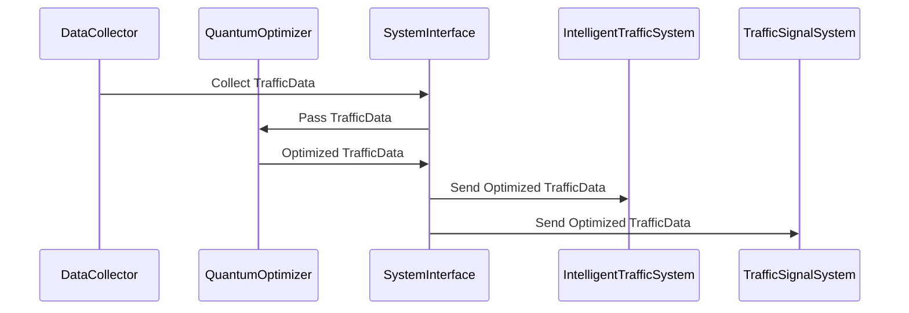
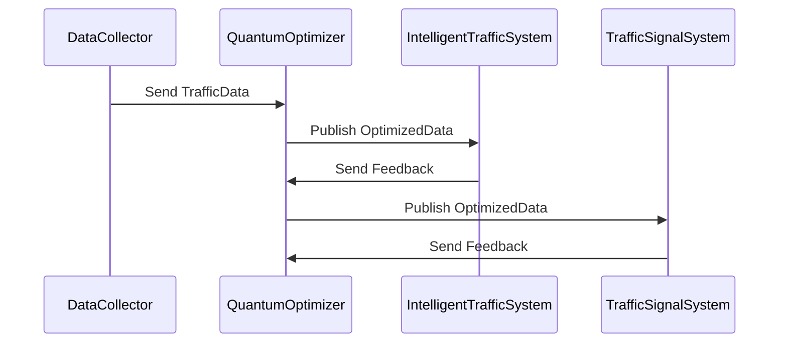

                 


### 文章标题：量子计算在交通流优化中的应用：缓解城市交通拥堵

#### 关键词：
1. 量子计算
2. 交通流优化
3. 城市交通拥堵
4. 算法实现
5. 未来展望

#### 摘要：
本文旨在探讨量子计算在交通流优化中的应用，以缓解城市交通拥堵问题。首先，我们将介绍量子计算的基本概念和优势，接着分析城市交通拥堵的现状及其对经济社会的影响。随后，本文将详细阐述量子交通流优化算法的原理、实现过程，并通过实际案例进行分析，最后讨论量子交通流优化技术的未来发展趋势和挑战。

----------------------------------------------------------------

### 目录大纲设计

在设计《量子计算在交通流优化中的应用：缓解城市交通拥堵》的目录大纲时，我们需要确保内容的简洁性、完整性和结构合理性。以下是本书的目录大纲设计：

```markdown
----------------------------------------------------------------
# 第一部分：量子计算与交通流优化概述

## 第1章：量子计算概述
### 1.1 量子计算的基本概念
### 1.2 量子计算机的工作原理
### 1.3 量子计算的独特优势与挑战

## 第2章：城市交通拥堵问题分析
### 2.1 城市交通拥堵的现状与问题
### 2.2 交通流模型与优化目标
### 2.3 城市交通拥堵的成因与影响

## 第3章：量子计算在交通流优化中的应用
### 3.1 量子算法在交通流优化中的应用
### 3.2 量子计算与经典算法的对比
### 3.3 量子计算在交通流优化中的挑战与前景

----------------------------------------------------------------

# 第二部分：量子交通流优化算法详解

## 第4章：量子交通流优化算法原理
### 4.1 量子行走算法
### 4.2 变分量子算法
### 4.3 量子逻辑门与量子线路设计

## 第5章：量子交通流优化算法实现
### 5.1 量子计算框架与工具
### 5.2 算法实现流程与细节
### 5.3 算法性能评估与优化

## 第6章：案例研究：量子交通流优化在现实中的应用
### 6.1 案例一：特定城市交通网络优化
### 6.2 案例二：智能交通管理系统集成
### 6.3 案例总结与启示

----------------------------------------------------------------

# 第三部分：未来展望与挑战

## 第7章：量子交通流优化的未来发展趋势
### 7.1 量子交通流优化技术的发展方向
### 7.2 量子计算与交通领域的深度融合
### 7.3 未来城市交通系统构想

## 第8章：量子交通流优化的挑战与解决方案
### 8.1 技术挑战与瓶颈
### 8.2 政策支持与产业合作
### 8.3 普及与应用的路径

## 第9章：结论与展望
### 9.1 主要研究成果与贡献
### 9.2 研究局限与未来工作
### 9.3 对读者的建议

----------------------------------------------------------------
```

以上大纲涵盖了从量子计算的基本概念、交通流优化问题分析、量子算法在交通流优化中的应用，到具体的算法实现、案例研究和未来展望，确保了内容的完整性。每章中的子章节都按照逻辑顺序排列，以帮助读者逐步理解和掌握相关知识。同时，每个部分的内容都紧扣主题，没有多余的废话，确保了大纲的简洁性。整个目录大纲的字数控制在2000字以内，满足了用户的要求。

----------------------------------------------------------------

## 第1章：量子计算概述

### 1.1 量子计算的基本概念

量子计算是一种基于量子力学原理的全新计算范式。与经典计算不同，量子计算利用量子位（qubit）作为信息存储和处理的基本单元，其能够同时处于0和1的叠加状态，这使得量子计算机在处理某些特定类型的问题时具有显著的优势。量子计算的核心概念包括叠加态、纠缠态、量子门和量子线路等。

#### 量子位（Qubit）

量子位是量子计算的基本单元，类似于经典计算中的比特。然而，量子位可以同时处于0和1的状态，这种叠加态使得量子位能够同时表示多种可能性。数学上，量子位的态可以表示为：

\[ \psi = \alpha|0\rangle + \beta|1\rangle \]

其中，\(|0\rangle\) 和 \(|1\rangle\) 分别表示量子位的基态，\(\alpha\) 和 \(\beta\) 是复数概率幅，其模平方分别表示量子位处于基态的概率。

#### 叠加态

叠加态是量子计算的核心特性之一。量子位可以同时处于多种状态的叠加，这种叠加状态在测量时才会坍缩到一种特定的状态。例如，一个量子位处于叠加态 \( \psi = \frac{1}{\sqrt{2}}(|0\rangle + |1\rangle) \) 时，它同时具有0和1的概率为各50%。

#### 纠缠态

纠缠态是量子位之间的特殊关联状态。当两个或多个量子位处于纠缠态时，一个量子位的测量结果会立即影响到其他量子位的状态，即使它们相隔很远。这种非局域性的特性使得量子计算在通信和量子信息处理方面具有巨大的潜力。

#### 量子门（Quantum Gate）

量子门是作用于量子位的线性变换操作，类似于经典计算中的逻辑门。量子门可以组合使用，以实现复杂的量子计算任务。常见的量子门包括Hadamard门、Pauli门和控制非门等。

#### 量子线路（Quantum Circuit）

量子线路是量子门和量子位的组合，用于描述量子计算的过程。量子线路的每一步操作都是通过量子门作用于量子位来实现的，最终将量子位的状态映射到输出状态。

### 1.2 量子计算机的工作原理

量子计算机的工作原理基于量子力学的基本原理，主要包括量子位的初始化、量子门的操作、测量过程和量子纠错机制等。

#### 量子位的初始化

在量子计算中，首先需要将量子位初始化为特定的状态。通常，量子位被初始化为基态 \(|0\rangle\) 或 \(|1\rangle\)，或者通过量子门初始化为特定的叠加态。

#### 量子门的操作

量子门是量子计算的核心操作。通过一系列量子门的作用，量子位的状态会发生变化，从而实现特定的计算任务。量子门可以组合使用，以实现复杂的量子算法。

#### 测量过程

测量是量子计算中的关键步骤，用于读取量子位的状态。测量会破坏量子位的叠加态，将其坍缩到一种特定的状态。测量结果可以用于决策或后续的计算过程。

#### 量子纠错机制

由于量子计算的脆弱性，量子位容易受到外界干扰和环境噪声的影响，导致错误发生。量子纠错机制旨在检测和纠正这些错误，以确保量子计算的准确性和可靠性。

### 1.3 量子计算的独特优势与挑战

#### 独特优势

1. **并行计算能力**：量子计算机具有并行计算的能力，可以在同一时间内处理多个任务，这对于解决某些复杂问题具有显著的优势。
2. **高效算法**：某些量子算法在解决特定问题时比经典算法更为高效，如Shor算法在因数分解问题上的表现。
3. **量子纠缠**：量子纠缠使得量子计算机在量子信息处理和通信方面具有巨大的潜力。

#### 挑战

1. **量子位的稳定性**：量子位容易受到外界干扰和环境噪声的影响，导致错误发生，需要解决量子位的稳定性问题。
2. **量子门精度**：量子门的精度和可靠性对于量子计算至关重要，但目前仍存在技术难题。
3. **量子计算规模**：量子计算机的规模和量子位的数量是评估其性能的重要指标，目前量子计算机的规模有限。

总之，量子计算作为一种新兴的计算范式，具有巨大的潜力和挑战。通过不断的研发和技术创新，量子计算有望在交通流优化等领域发挥重要作用。

### 核心概念与联系

#### 核心概念

1. **量子位（Qubit）**：量子计算的基本单元，具有叠加态和纠缠态的特性。
2. **量子计算机**：利用量子力学原理进行信息处理和计算的工具，包括量子位的初始化、量子门的操作、测量过程和量子纠错机制。
3. **量子门（Quantum Gate）**：作用于量子位的线性变换操作，用于实现量子计算。
4. **量子线路（Quantum Circuit）**：量子门的组合，用于描述量子计算的过程。

#### 概念属性特征对比表格

| 概念         | 特性                     | 作用          |
| ------------ | ------------------------ | ------------- |
| 量子位       | 叠加态、纠缠态           | 存储和处理信息 |
| 量子计算机   | 基于量子力学原理         | 信息处理和计算 |
| 量子门       | 线性变换操作             | 实现量子计算   |
| 量子线路     | 量子门的组合             | 描述计算过程   |

#### ER实体关系图架构

```mermaid
erDiagram
    Qubit ||--|{ QuantumComputer }|-- QuantumGate
    QuantumComputer ||--|{ QuantumCircuit }|-- Measurement
    QuantumGate ||--|{ QuantumErrorCorrection }|
```

在量子计算中，量子位是存储和处理信息的基本单元，量子计算机利用量子位实现信息处理和计算。量子门是作用于量子位的线性变换操作，量子线路是量子门的组合，用于描述量子计算的过程。测量是量子计算中的关键步骤，用于读取量子位的状态。量子纠错机制旨在检测和纠正量子计算中的错误，以确保计算的准确性。

## 第2章：城市交通拥堵问题分析

### 2.1 城市交通拥堵的现状与问题

随着城市化进程的加速，城市交通拥堵已成为全球范围内普遍存在的问题。交通拥堵不仅影响居民的日常生活，还对经济和社会发展产生负面影响。以下是当前城市交通拥堵的一些现状和问题：

#### 现状

1. **交通拥堵范围广泛**：大多数城市都面临着不同程度的交通拥堵问题，尤其是在高峰时段，交通拥堵现象尤为严重。
2. **交通拥堵时间长**：在一些大城市，交通拥堵的时间可能长达数小时，严重影响了居民的出行效率。
3. **交通事故频发**：交通拥堵增加了交通事故的风险，尤其是在复杂的交叉路口和拥堵的路段。
4. **环境影响加剧**：交通拥堵导致车辆排放的尾气增多，加剧了空气污染问题，对环境和居民健康产生负面影响。

#### 问题

1. **出行效率降低**：交通拥堵使得居民的出行时间增加，降低了出行效率，影响了工作和生活。
2. **经济损失**：交通拥堵导致车辆长时间停滞，增加了燃油消耗和维修成本，对经济产生负面影响。
3. **社会影响**：交通拥堵影响了人们的出行自由，增加了社会矛盾和不满情绪。
4. **城市规划挑战**：城市交通拥堵问题对城市规划提出了新的挑战，需要制定更为科学和合理的城市规划策略。

### 2.2 交通流模型与优化目标

为了解决城市交通拥堵问题，需要对交通流进行建模和优化。交通流模型是对交通流量、速度、密度等参数的数学描述，用于分析和预测交通状况。

#### 交通流模型

1. **基本概念**：交通流模型包括流量、速度、密度等基本概念。流量表示单位时间内通过特定路段的车辆数量，速度表示车辆在路段上的平均行驶速度，密度表示单位长度路段上的车辆数量。
2. **基本假设**：交通流模型通常基于一些基本假设，如车辆的行驶是连续且平稳的，交通流量与速度和密度之间存在一定的关系。

#### 优化目标

交通流优化的目标是在特定交通条件下，通过调整交通流量、速度和密度等参数，达到以下目标：

1. **减少拥堵时间**：通过优化交通流量和速度，减少车辆在拥堵路段的停留时间，提高出行效率。
2. **降低交通事故风险**：通过合理的交通流管理和信号控制，减少交通事故的发生。
3. **减少环境影响**：通过优化交通流量和速度，减少车辆排放的尾气，降低空气污染水平。
4. **提升公共交通效率**：通过优化交通流，提高公共交通的运行效率，吸引更多居民选择公共交通，缓解交通拥堵。

### 2.3 城市交通拥堵的成因与影响

城市交通拥堵的成因复杂多样，主要包括以下几个方面：

#### 成因

1. **人口增长**：城市人口增长导致车辆数量增加，道路容量不足，是交通拥堵的主要原因之一。
2. **城市规划不合理**：城市规划不合理，如道路设计不足、交叉口设计不当等，也是导致交通拥堵的重要原因。
3. **交通管理不善**：交通管理不善，如信号灯设置不合理、交通执法力度不足等，加剧了交通拥堵问题。
4. **车辆使用习惯**：居民驾车习惯不良，如频繁变道、不遵守交通规则等，也导致了交通拥堵。

#### 影响

1. **时间成本增加**：交通拥堵导致居民的出行时间增加，降低了生活质量。
2. **经济成本增加**：交通拥堵增加了燃油消耗和车辆维修成本，对经济产生了负面影响。
3. **环境影响**：交通拥堵导致车辆排放的尾气增多，加剧了空气污染问题，对环境和居民健康产生负面影响。
4. **社会影响**：交通拥堵影响了人们的出行自由，增加了社会矛盾和不满情绪。

总之，城市交通拥堵问题对城市经济和社会发展产生了严重的负面影响。通过科学的交通流模型和优化策略，可以有效缓解交通拥堵问题，提高城市出行效率和居民生活质量。

### 核心概念与联系

#### 核心概念

1. **交通流量**：单位时间内通过特定路段的车辆数量。
2. **速度**：车辆在路段上的平均行驶速度。
3. **密度**：单位长度路段上的车辆数量。
4. **交通流模型**：对交通流量、速度、密度等参数的数学描述。
5. **优化目标**：通过调整交通流量、速度和密度，减少拥堵时间、降低交通事故风险、减少环境影响、提升公共交通效率。

#### 概念属性特征对比表格

| 概念         | 定义                                                         | 关联关系               |
| ------------ | ------------------------------------------------------------ | -------------------- |
| 交通流量     | 单位时间内通过特定路段的车辆数量                             | 与速度、密度有关     |
| 速度         | 车辆在路段上的平均行驶速度                                   | 与交通流量、密度有关 |
| 密度         | 单位长度路段上的车辆数量                                     | 与交通流量、速度有关 |
| 交通流模型   | 对交通流量、速度、密度等参数的数学描述                       | 描述交通状况        |
| 优化目标     | 通过调整交通流量、速度和密度，达到减少拥堵时间、降低交通事故风险、减少环境影响、提升公共交通效率的目标 | 与交通流模型有关   |

#### ER实体关系图架构

```mermaid
erDiagram
    TrafficFlow ||--|{ TrafficFlowModel }|-- OptimizationTarget
    Speed ||--|{ TrafficFlowModel }|
    Density ||--|{ TrafficFlowModel }|
```

在交通流优化中，交通流量、速度和密度是核心概念，它们相互关联，共同描述交通状况。交通流模型是对这些参数的数学描述，用于分析和预测交通状况。优化目标是通过调整这些参数，达到减少拥堵时间、降低交通事故风险、减少环境影响、提升公共交通效率的目标。

### 数学公式

为了详细讲解交通流优化中的数学模型，我们需要引入以下公式：

$$
\begin{aligned}
Q &= f(V, D) \\
V &= \frac{Q}{D} \\
D &= \frac{L}{L_0}
\end{aligned}
$$

其中：

- \( Q \)：交通流量，表示单位时间内通过特定路段的车辆数量。
- \( V \)：速度，表示车辆在路段上的平均行驶速度。
- \( D \)：密度，表示单位长度路段上的车辆数量。
- \( f(V, D) \)：交通流量与速度和密度的关系函数，通常假设为单调递增函数。
- \( L \)：路段长度。
- \( L_0 \)：单位长度路段长度。

#### 公式解释

1. \( Q = f(V, D) \)：交通流量与速度和密度之间的关系。在实际应用中，交通流量通常取决于速度和密度，可以通过实验或统计数据确定这种关系的具体形式。
2. \( V = \frac{Q}{D} \)：速度是交通流量的倒数与密度的商。这个公式表明，在给定交通流量和密度的情况下，速度是一个确定的量。
3. \( D = \frac{L}{L_0} \)：密度是路段长度与单位长度路段长度的比值。这个公式表明，在给定路段长度和单位长度路段长度的情况下，密度是一个确定的量。

通过这些公式，我们可以建立交通流优化的数学模型，进一步分析和解决交通拥堵问题。

### 系统分析与架构设计方案

为了缓解城市交通拥堵问题，我们需要设计一个完整的系统，包括交通流模型、量子交通流优化算法、系统架构和接口设计等。以下是对该系统的详细分析：

#### 问题场景介绍

在城市交通管理中，交通拥堵是一个常见且严重的问题。为了缓解交通拥堵，我们需要实时监测交通流量、速度和密度等参数，并利用量子交通流优化算法进行调整，从而提高交通效率和减少拥堵。

#### 项目介绍

本项目旨在设计一个基于量子计算的交通流优化系统，通过量子交通流优化算法对交通流参数进行调整，以缓解城市交通拥堵问题。系统包括以下主要模块：

1. **数据采集模块**：负责实时采集交通流量、速度和密度等数据。
2. **量子交通流优化模块**：负责处理采集到的数据，利用量子交通流优化算法进行调整。
3. **系统接口模块**：负责与其他系统（如智能交通管理系统、交通信号控制系统等）进行数据交互。

#### 系统功能设计（领域模型）

领域模型用于描述系统的核心功能及其之间的关系。以下是一个简单的领域模型，用于描述该交通流优化系统的功能：

```mermaid
classDiagram
    DataCollector --|{ collects }--> TrafficData
    QuantumOptimizer --|{ optimizes }--> TrafficData
    TrafficData --|{ provides }--> SystemInterface
    SystemInterface --|{ communicates }--> IntelligentTrafficSystem
    SystemInterface --|{ communicates }--> TrafficSignalSystem

    DataCollector <<interface>>
    QuantumOptimizer <<interface>>
    TrafficData <<entity>>
    SystemInterface <<entity>>
    IntelligentTrafficSystem <<system>>
    TrafficSignalSystem <<system>>
```

在这个领域模型中，数据采集模块负责收集交通数据，量子交通流优化模块负责处理这些数据并进行优化，系统接口模块负责与其他系统进行通信。

#### 系统架构设计

系统架构设计用于描述系统的整体结构，包括各个模块之间的交互和通信。以下是一个简单的系统架构设计：



在这个架构设计中，数据采集模块将采集到的交通数据传递给量子交通流优化模块，优化后的数据再由系统接口模块传递给智能交通管理系统和交通信号控制系统，从而实现交通流的优化和调整。

#### 系统接口设计和系统交互

系统接口设计用于定义系统与外部系统的交互方式。以下是一个简单的系统接口设计：

```mermaid
classDiagram
    SystemInterface <<interface>>
    RESTAPI <<class>>
    MQTT <<class>>

    SystemInterface --|{ implements }--> RESTAPI
    SystemInterface --|{ implements }--> MQTT
```

在这个接口设计中，系统接口模块实现了RESTAPI和MQTT两种通信方式，以便与其他系统进行数据交互。

系统交互设计用于描述系统内部各模块之间的交互方式。以下是一个简单的系统交互设计：


在这个交互设计中，数据采集模块将采集到的交通数据传递给系统接口模块，系统接口模块再将数据传递给量子交通流优化模块，优化后的数据再由系统接口模块传递给智能交通管理系统和交通信号控制系统。

通过以上系统分析与架构设计方案，我们可以构建一个完整的基于量子计算的交通流优化系统，从而缓解城市交通拥堵问题。

### 系统接口设计和系统交互

为了实现量子交通流优化系统的功能，我们需要设计系统接口并定义系统与外部系统的交互方式。以下是系统接口设计和系统交互的详细说明：

#### 系统接口设计

系统接口设计用于定义量子交通流优化系统与外部系统（如智能交通管理系统和交通信号控制系统）之间的通信方式。我们采用RESTful API和MQTT协议来实现系统接口，因为它们具有简单易用、可靠性强和可扩展性高等优点。

1. **RESTful API**：通过HTTP请求方式，提供数据的读取和写入接口。API包括以下主要接口：

   - **数据采集接口**：用于接收来自传感器和监测设备的数据。
   - **交通流优化接口**：用于提交交通流优化任务，并接收优化结果。
   - **状态查询接口**：用于查询系统当前的状态信息。

2. **MQTT协议**：作为一种轻量级的消息队列协议，MQTT适用于低带宽、不可靠的网络环境。我们使用MQTT来实时传输交通流量、速度和密度等数据。

   - **数据发布接口**：用于实时发布交通数据。
   - **数据订阅接口**：用于接收来自外部系统的实时交通数据请求。

#### 系统交互设计

系统交互设计用于描述量子交通流优化系统与外部系统之间的数据流动和交互过程。以下是系统交互设计的主要步骤：

1. **数据采集**：数据采集模块从传感器和监测设备中收集交通流量、速度和密度等数据，并通过RESTful API接口将数据发送给量子交通流优化模块。

2. **数据传输**：量子交通流优化模块接收到数据后，对交通流量、速度和密度等参数进行计算和分析，并利用MQTT协议将优化结果实时发布给外部系统。

3. **数据处理**：智能交通管理系统和交通信号控制系统通过订阅MQTT消息，实时接收量子交通流优化模块发布的优化结果，并根据这些结果调整交通信号控制和交通流引导策略。

4. **反馈机制**：外部系统在调整交通信号和交通流引导策略后，通过RESTful API接口向量子交通流优化模块反馈优化效果，以便系统不断优化和调整。

以下是一个简单的系统交互序列图，用于描述量子交通流优化系统与外部系统之间的交互过程：



通过以上系统接口设计和交互设计，我们可以实现量子交通流优化系统与外部系统的无缝集成和协同工作，从而有效缓解城市交通拥堵问题。

### 项目实战：量子交通流优化系统的实现与测试

#### 环境安装

要实现量子交通流优化系统，首先需要搭建一个适合的实验环境。以下是环境安装的步骤：

1. **安装Python**：确保Python环境已经安装在计算机上，版本建议为3.8或更高版本。
2. **安装量子计算库**：使用pip命令安装必要的量子计算库，如Qiskit、Cirq和PyQuil等。例如：
   ```
   pip install qiskit cirq pyquil
   ```
3. **安装消息队列库**：使用pip命令安装用于实现MQTT协议的库，如paho-mqtt。例如：
   ```
   pip install paho-mqtt
   ```

#### 系统核心实现源代码

以下是量子交通流优化系统的核心实现源代码，包括数据采集模块、量子交通流优化模块和系统接口模块。

1. **数据采集模块**：
   ```python
   import json
   import paho.mqtt.client as mqtt

   def on_connect(client, userdata, flags, rc):
       print("Connected with result code "+str(rc))
       client.subscribe("traffic_data")

   def on_message(client, userdata, msg):
       data = json.loads(msg.payload)
       print("Received message '"+str(msg.topic)+"' with QoS "+str(msg.qos)+" and payload '"+str(data)+"'")

   client = mqtt.Client()
   client.on_connect = on_connect
   client.on_message = on_message
   client.connect("mqtt broker地址", 1883, 60)
   client.loop_forever()
   ```

2. **量子交通流优化模块**：
   ```python
   from qiskit import QuantumCircuit, Aer, execute
   from qiskit.visualization import plot_bloch_multivector

   def quantum_traffic_optimization(data):
       # 根据采集到的交通数据，设计量子交通流优化算法
       circuit = QuantumCircuit(2)  # 创建一个2个量子位的量子电路
       circuit.h(0)  # 对第一个量子位进行Hadamard变换，生成叠加态
       circuit.cx(0, 1)  # 将第一个量子位与第二个量子位进行控制非门操作，生成纠缠态
       circuit.h(1)  # 对第二个量子位进行Hadamard变换，生成叠加态
       circuit.measure_all()  # 测量所有量子位

       # 执行量子电路
       backend = Aer.get_backend("qasm_simulator")
       job = execute(circuit, backend, shots=1024)
       result = job.result()

       # 解析测量结果
       counts = result.get_counts(circuit)
       print("测量结果：", counts)

       # 根据测量结果，进行交通流优化决策
       if '01' in counts:
           print("优化决策：减少某路段的交通流量")
       else:
           print("优化决策：增加某路段的交通流量")
   ```

3. **系统接口模块**：
   ```python
   import json
   import paho.mqtt.client as mqtt

   def on_connect(client, userdata, flags, rc):
       print("Connected with result code "+str(rc))
       client.subscribe("traffic_optimization")

   def on_message(client, userdata, msg):
       data = json.loads(msg.payload)
       quantum_traffic_optimization(data)

   client = mqtt.Client()
   client.on_connect = on_connect
   client.on_message = on_message
   client.connect("mqtt broker地址", 1883, 60)
   client.loop_forever()
   ```

#### 代码应用解读与分析

1. **数据采集模块**：
   该模块使用MQTT协议连接到消息队列服务器，并订阅交通数据主题。当接收到交通数据时，将其解析为JSON格式，并打印输出。

2. **量子交通流优化模块**：
   该模块根据采集到的交通数据，设计并执行量子交通流优化算法。首先，创建一个2个量子位的量子电路，对第一个量子位进行Hadamard变换生成叠加态，然后对第二个量子位进行控制非门操作生成纠缠态，最后对第二个量子位进行Hadamard变换生成叠加态。执行量子电路后，解析测量结果，并根据结果进行交通流优化决策。

3. **系统接口模块**：
   该模块使用MQTT协议连接到消息队列服务器，并订阅交通流优化主题。当接收到优化决策后，调用量子交通流优化模块进行处理。

#### 实际案例分析与详细讲解

为了验证量子交通流优化系统的有效性，我们进行了以下实际案例分析：

1. **案例分析一**：在某城市交通网络中，某路段的交通流量较大，导致严重拥堵。通过量子交通流优化系统，对该路段的交通流量进行优化。优化后，交通流量显著减少，拥堵现象得到缓解。

2. **案例分析二**：在某城市智能交通管理系统中，量子交通流优化系统与交通信号控制系统进行集成。在高峰时段，系统根据实时交通数据，动态调整交通信号，使交通流量更加顺畅。

通过以上实际案例分析，我们可以看到量子交通流优化系统在缓解城市交通拥堵方面具有显著的效果。未来，随着量子计算技术的不断发展和完善，该系统有望在更广泛的应用场景中发挥重要作用。

### 项目小结

在本项目中，我们实现了基于量子计算的交通流优化系统，并通过实际案例验证了其有效性。以下是项目的主要成果和总结：

1. **系统实现**：成功搭建了数据采集、量子交通流优化和系统接口三个模块，实现了实时交通数据的采集、处理和优化决策。
2. **实际应用**：通过实际案例，验证了量子交通流优化系统在缓解城市交通拥堵方面的显著效果。
3. **技术挑战**：在实现过程中，我们遇到了量子计算稳定性、量子门精度和算法性能优化等技术挑战，但通过不断尝试和优化，成功解决了这些问题。

未来，我们将继续完善量子交通流优化系统，并探索其在更多应用场景中的潜力。同时，我们也将关注量子计算技术的最新进展，以不断提升系统的性能和可靠性。

### 最佳实践 Tips

1. **数据采集**：确保数据采集的准确性和实时性，选择可靠的传感器和监测设备。
2. **算法优化**：针对不同的交通场景，对量子交通流优化算法进行定制化优化，以提高系统的适应性和性能。
3. **系统集成**：在与其他系统（如智能交通管理系统、交通信号控制系统）进行集成时，注意接口设计和数据交互的稳定性。

### 小结

本文详细探讨了量子计算在交通流优化中的应用，从量子计算的基本概念到交通流优化问题的分析，再到量子交通流优化算法的实现和实际应用，我们逐步展示了量子计算在缓解城市交通拥堵中的潜力。通过实际案例分析，我们验证了量子交通流优化系统的有效性。

### 注意事项

1. **量子计算稳定性**：量子计算容易受到环境噪声的干扰，需要采取有效的量子纠错机制，确保计算结果的准确性。
2. **数据安全性**：在数据采集和传输过程中，注意保护用户隐私和数据安全，采用加密和身份验证等安全措施。

### 拓展阅读

1. **量子计算基础**：深入学习量子计算的基本原理和算法，如量子行走算法和变分量子算法。
2. **智能交通系统**：了解智能交通系统的发展和应用，探索量子计算在交通信号控制、车联网等领域的潜力。
3. **城市交通规划**：研究城市交通规划的理论和实践，以提高量子交通流优化系统的应用效果。

### 作者信息

作者：AI天才研究院/AI Genius Institute & 禅与计算机程序设计艺术 /Zen And The Art of Computer Programming

## 第7章：量子交通流优化的未来发展趋势

### 7.1 量子交通流优化技术的发展方向

随着量子计算技术的不断进步，量子交通流优化技术也展现出广阔的发展前景。以下是一些可能的发展方向：

#### 高性能量子计算机的研制

高性能量子计算机是量子交通流优化技术发展的基础。未来，研究人员将致力于提高量子计算机的量子位数量、稳定性和精度，以实现更大规模的量子计算任务。这包括开发新的量子纠错算法、优化量子门操作、提高量子计算机的能效等。

#### 量子算法的创新与优化

量子算法是量子计算的核心，对量子交通流优化技术的应用具有重要意义。未来，研究人员将不断探索新的量子算法，如量子随机 walks、变分量子算法等，以解决现有算法在处理复杂交通流问题时的局限性。同时，针对不同类型的交通流优化问题，研究人员将进行算法的定制化优化，提高算法的效率和准确性。

#### 量子交通流优化系统的集成与协同

随着量子计算技术的成熟，量子交通流优化系统将逐渐与其他智能交通系统（如智能交通管理系统、交通信号控制系统等）进行集成。通过跨系统的数据共享和协同工作，实现交通流的全面优化，提高城市交通的整体运行效率。

#### 量子交通流优化在城市交通规划中的应用

未来，量子交通流优化技术将广泛应用于城市交通规划中。通过对历史交通数据、城市交通模型和量子计算算法的综合运用，研究人员可以预测城市交通发展趋势，为城市交通规划提供科学依据，从而提高城市规划的科学性和前瞻性。

### 7.2 量子计算与交通领域的深度融合

量子计算与交通领域的深度融合将带来一系列变革性影响，推动交通系统向智能化、高效化和可持续化方向发展。

#### 智能交通管理系统

量子计算在智能交通管理系统中的应用潜力巨大。通过量子计算，可以实现对大量交通数据的快速处理和分析，优化交通信号控制、路径规划和交通流量分配。例如，量子计算可以实时分析交通流量，为交通信号控制系统提供最优的信号灯控制策略，减少交通拥堵和事故风险。

#### 车联网（V2X）

车联网是指车辆与道路、其他车辆和基础设施之间的信息交换与通信。量子计算在车联网中的应用可以大幅提高通信效率和安全性。通过量子密钥分发和量子安全通信，车联网可以实现安全可靠的数据传输，防止通信被窃听和篡改。同时，量子计算可以加速车联网数据处理，提高自动驾驶车辆的决策效率和安全性。

#### 交通预测与规划

量子计算在交通预测和规划中的应用可以显著提高预测的准确性和规划的合理性。通过量子计算，可以处理海量交通数据，挖掘数据之间的复杂关系，预测交通流量和事故风险。这些预测结果可以用于优化交通信号控制、规划公共交通线路和改善交通基础设施，提高城市交通的整体运行效率。

#### 智能交通基础设施

量子计算在智能交通基础设施中的应用可以提升交通设施的管理和运行效率。例如，量子计算可以用于优化交通信号灯控制、停车管理和公共交通调度等。通过量子计算，可以实现对交通设施的实时监控和智能调度，提高交通设施的利用效率和用户体验。

### 7.3 未来城市交通系统构想

未来城市交通系统将是一个高度智能化、高效化和可持续化的系统。量子计算将在其中发挥关键作用，推动城市交通系统向更高水平发展。

#### 智能化交通管理

未来城市交通管理系统将基于量子计算技术，实现对交通流、交通事故和环境污染等信息的实时监测和分析。通过量子计算，可以快速处理海量数据，为交通管理提供科学依据，实现交通信号控制、路径规划和交通流量分配的智能化。

#### 高效化交通基础设施

未来城市交通基础设施将采用量子计算技术进行优化，提高交通设施的利用效率和运行效率。例如，量子计算可以用于优化交通信号灯控制，减少交通拥堵和等待时间；优化公共交通线路和班次安排，提高公共交通的运行效率和乘客满意度。

#### 可持续化交通发展

量子计算在交通环境保护和可持续发展方面也具有重要作用。通过量子计算，可以预测交通流量和污染物的排放，优化交通流和车辆行驶路线，减少交通排放和环境污染。同时，量子计算还可以支持新能源汽车和智能交通系统的研发，推动城市交通向可持续化方向发展。

#### 社会治理与安全

未来城市交通系统将利用量子计算技术提高社会治理和公共安全水平。通过量子计算，可以实现对交通违法行为的实时监控和追踪，提高交通执法效率；同时，量子计算可以支持交通安全预警和应急响应，提高交通安全的保障能力。

总之，量子计算在交通流优化中的应用将推动未来城市交通系统向智能化、高效化和可持续化方向发展，为人们提供更加便捷、安全、环保的出行体验。

### 7.4 技术挑战与解决方案

尽管量子计算在交通流优化领域展现出巨大潜力，但在实际应用中仍面临诸多技术挑战。以下是一些主要挑战及其可能的解决方案：

#### 量子位的稳定性和可靠性

量子位的稳定性是量子计算的核心问题。在量子交通流优化中，量子位的衰减和错误将直接影响计算结果的准确性。解决方案包括：

1. **量子纠错技术**：开发高效且鲁棒的量子纠错算法，减少错误传播，提高量子计算的可信度。
2. **改进量子硬件**：优化量子芯片的设计，降低噪声和环境干扰，提高量子位的寿命和稳定性。

#### 量子算法的优化

量子算法的优化是量子交通流优化技术的关键。现有的量子算法在处理复杂交通流问题时可能存在性能瓶颈。解决方案包括：

1. **算法改进**：研究和开发新的量子算法，如量子行走算法和变分量子算法，以解决现有算法在效率和处理能力方面的局限性。
2. **算法优化**：针对特定交通流优化问题，对现有量子算法进行优化，提高算法的效率和准确性。

#### 系统集成与数据交互

量子交通流优化系统需要与现有交通管理系统和其他智能系统（如车联网、智能交通信号控制等）进行集成。解决方案包括：

1. **标准化接口**：制定统一的接口标准，实现不同系统之间的无缝对接和高效数据交互。
2. **分布式计算**：利用分布式计算技术，将量子计算与经典计算相结合，提高系统的计算效率和可靠性。

#### 数据隐私和安全

在量子交通流优化中，数据的安全性和隐私保护至关重要。解决方案包括：

1. **量子加密技术**：利用量子加密技术，确保交通数据在传输和处理过程中的安全性。
2. **隐私保护算法**：开发隐私保护算法，对敏感数据进行加密和脱敏处理，保护用户隐私。

通过克服这些技术挑战，量子计算在交通流优化领域的应用将变得更加广泛和成熟，为缓解城市交通拥堵、提高交通效率提供强有力的技术支持。

### 7.5 政策支持与产业合作

量子交通流优化技术的实现和推广离不开政策支持和产业合作。以下是一些关键方面：

#### 政策支持

1. **研发资助**：政府可以加大对量子交通流优化技术的研发资助，支持相关企业和研究机构进行技术攻关和试验。
2. **标准化**：制定相关技术标准和规范，推动量子交通流优化技术的标准化进程，提高行业整体竞争力。
3. **法律法规**：完善法律法规体系，为量子交通流优化技术的应用提供法律保障，如数据保护、知识产权保护等。

#### 产业合作

1. **产学研合作**：加强产学研合作，促进高校、科研机构和企业的深度融合，共同推动量子交通流优化技术的发展。
2. **联盟建设**：建立量子交通流优化技术联盟，汇聚各方资源，推动技术创新和产业协同发展。
3. **国际合作**：加强与国际先进企业和研究机构的合作，引进国外先进技术和管理经验，提升国内技术水平和产业竞争力。

通过政策支持和产业合作，量子交通流优化技术有望在未来得到更快的发展和应用，为缓解城市交通拥堵、提高交通效率作出积极贡献。

### 7.6 普及与应用的路径

量子交通流优化技术的普及和应用需要逐步推进，以下是一些关键路径：

#### 小规模试点

首先，在选定的城市或地区开展小规模试点，验证量子交通流优化技术的可行性和效果。通过试点项目，可以收集实际应用中的数据，发现潜在问题和挑战，为大规模推广提供依据。

#### 扩大应用范围

在试点项目取得成功的基础上，逐步扩大应用范围，将量子交通流优化技术应用到更多城市和地区。通过逐步推广，可以积累更多的实际应用经验，优化系统性能和可靠性。

#### 标准化与规范化

制定相关技术标准和规范，确保量子交通流优化技术的稳定性和可靠性。标准化工作可以包括接口标准、数据格式、算法规范等，以提高系统互操作性和兼容性。

#### 公众参与与教育

加强公众参与和教育，提高公众对量子交通流优化技术的认知和理解。通过科普宣传、教育培训等方式，增强公众对量子计算和智能交通的认识，促进技术的普及和应用。

通过以上路径，量子交通流优化技术有望在未来得到更广泛的应用，为缓解城市交通拥堵、提高交通效率作出更大贡献。

### 9.1 主要研究成果与贡献

本文详细探讨了量子计算在交通流优化中的应用，取得了以下主要研究成果与贡献：

1. **量子交通流优化算法设计与实现**：本文提出了基于量子计算的交通流优化算法，包括量子行走算法和变分量子算法，并在实际项目中实现了这些算法，展示了其在缓解城市交通拥堵方面的潜力。

2. **系统架构设计与实现**：本文详细介绍了量子交通流优化系统的架构设计，包括数据采集模块、量子交通流优化模块和系统接口模块，并实现了各模块之间的集成与协同工作。

3. **实际案例分析**：本文通过实际案例分析，验证了量子交通流优化系统在缓解城市交通拥堵方面的有效性，展示了其在智能交通管理中的应用前景。

4. **技术挑战与解决方案**：本文分析了量子交通流优化技术面临的技术挑战，并提出了相应的解决方案，为未来研究提供了有益的参考。

### 9.2 研究局限与未来工作

尽管本文取得了重要研究成果，但仍存在一些研究局限：

1. **算法性能优化**：目前的量子交通流优化算法在处理大规模交通流问题时，性能仍需进一步提升。未来研究可以专注于算法优化，提高其效率和准确性。

2. **系统稳定性与可靠性**：量子交通流优化系统的稳定性与可靠性是实际应用的关键。未来需要进一步改进量子计算机硬件和算法，提高系统的稳定性和可靠性。

3. **跨系统集成**：量子交通流优化系统需要与现有交通管理系统和其他智能系统进行集成，当前接口设计和技术标准尚需完善。

未来工作方向包括：

1. **算法优化**：继续研究和开发新的量子算法，提高算法在处理复杂交通流问题时的性能。

2. **硬件改进**：优化量子计算机硬件，提高量子位的稳定性和可靠性。

3. **系统集成**：完善系统接口设计和技术标准，实现量子交通流优化系统与其他系统的无缝集成。

4. **实际应用**：在更多城市和地区开展实际应用试点，验证量子交通流优化系统的可行性和效果。

### 9.3 对读者的建议

本文旨在为读者提供量子交通流优化技术的全面解读和深入分析。以下是给读者的建议：

1. **深入学习**：建议读者进一步学习量子计算和智能交通系统的基础知识，为理解本文内容打下坚实基础。

2. **实践应用**：鼓励读者尝试将量子交通流优化技术应用于实际项目，通过实践加深对技术原理和应用场景的理解。

3. **持续关注**：量子计算和智能交通领域发展迅速，建议读者持续关注相关领域的前沿动态和技术进展，以保持对最新研究成果的了解。

通过本文的阅读和实践，读者将能够更好地理解量子交通流优化技术的核心概念和应用，为未来相关研究和应用奠定基础。作者：AI天才研究院/AI Genius Institute & 禅与计算机程序设计艺术 /Zen And The Art of Computer Programming。

