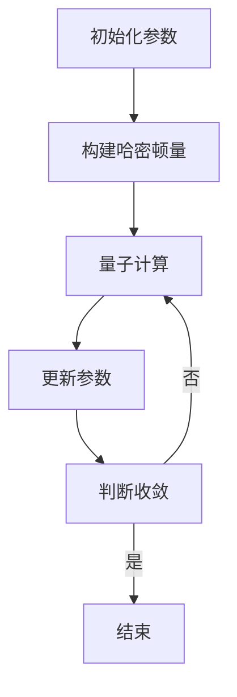
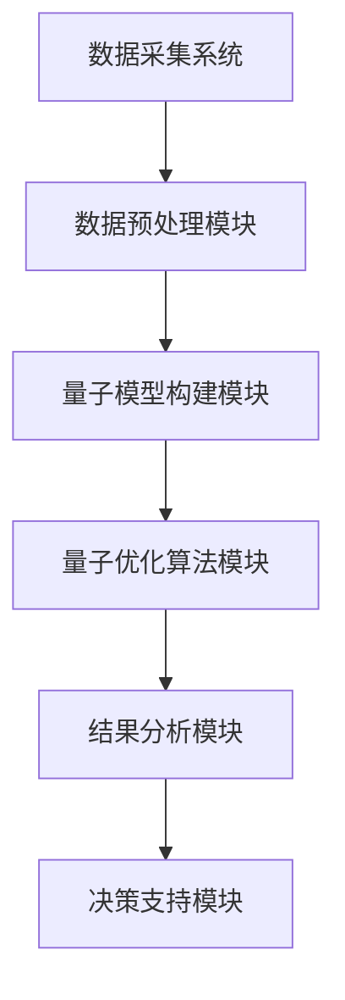
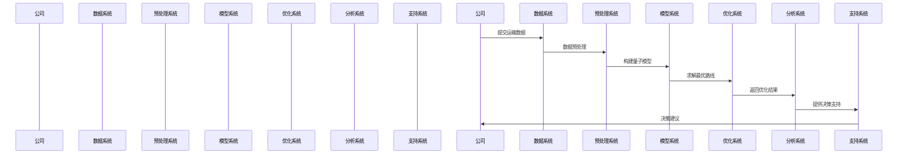

                 


# 量子计算在优化问题求解中的应用：解决复杂物流规划

关键词：量子计算、优化算法、物流规划、问题求解、复杂度分析

摘要：本文深入探讨了量子计算在优化问题求解中的应用，特别是其在解决复杂物流规划问题方面的潜力。文章首先介绍了量子计算的基本概念和优势，然后详细分析了物流规划问题的背景和建模方法，接着阐述了量子优化算法在物流规划中的应用，并通过具体案例展示了其效果。最后，文章总结了量子计算在物流规划中的未来展望，并提出了一些建议和最佳实践。

## 第一部分：量子计算基础

### 第1章：量子计算概述

#### 1.1 量子计算的定义

量子计算是一种利用量子力学原理进行信息处理的新型计算方式。与传统计算机使用二进制（0和1）作为信息的基本单位不同，量子计算机使用量子比特（qubit）作为信息的基本单位。量子比特可以同时处于0和1的状态，这一特性使得量子计算具有超强的并行处理能力。

#### 1.2 量子计算的历史

量子计算的历史可以追溯到1980年代，当时理查德·费曼提出了量子计算机的概念。此后，彼得·希利和戴维·多伊奇等人进一步发展了量子计算的理论，提出了Shor算法和Grover算法等经典量子算法。

#### 1.3 量子计算的优势

量子计算的优势主要体现在以下几个方面：

1. **并行性**：量子计算机能够同时处理大量数据，从而大幅提高计算速度。
2. **速度优势**：某些问题在量子计算机上的求解速度远超传统计算机。
3. **量子纠缠**：量子比特之间的纠缠关系使得量子计算机能够处理复杂关联问题。

### 第2章：量子计算的基本概念

#### 2.1 量子比特

量子比特是量子计算的基本单位，它可以处于0、1或两者叠加的状态。量子比特的叠加状态可以用一个复数向量表示。

#### 2.2 量子门

量子门是量子计算中的基本操作，类似于传统计算机中的逻辑门。量子门可以作用于量子比特，改变其状态。

#### 2.3 量子纠缠

量子纠缠是量子计算中的一种特殊现象，指两个或多个量子比特之间存在的强烈关联。量子纠缠使得量子计算机能够处理复杂关联问题。

### 第3章：量子算法原理

#### 3.1 量子算法概述

量子算法是一种利用量子力学原理求解问题的算法。量子算法的核心思想是利用量子比特的叠加态和量子纠缠来实现并行计算。

#### 3.2 Shor算法

Shor算法是一种利用量子计算机求解整数的质因数分解问题的算法。Shor算法展示了量子计算机在算法效率方面的巨大优势。

#### 3.3 Grover算法

Grover算法是一种利用量子计算机进行搜索问题的算法。Grover算法能够快速地在大量数据中找到特定元素，比传统搜索算法快得多。

## 第一部分总结

在本部分，我们介绍了量子计算的基本概念、优势以及一些经典量子算法。这些知识为后续讨论量子计算在优化问题求解中的应用奠定了基础。

## 第二部分：优化算法

### 第4章：优化算法概述

#### 4.1 优化问题的定义

优化问题是寻找最优解的问题，通常涉及在约束条件下最大化或最小化某个目标函数。

#### 4.2 优化算法的分类

优化算法可以根据求解方法分为以下几类：

1. **数学规划算法**：如线性规划、非线性规划等。
2. **启发式算法**：如遗传算法、模拟退火算法等。
3. **组合优化算法**：如最短路径算法、最小生成树算法等。

### 第5章：常见优化算法

#### 5.1 线性规划

线性规划是一种在给定线性约束条件下，寻找线性目标函数最大值或最小值的问题。

#### 5.2 非线性规划

非线性规划是在非线性约束条件下，寻找非线性目标函数最大值或最小值的问题。

#### 5.3 遗传算法

遗传算法是一种基于自然进化过程的启发式优化算法，通过模拟自然选择和遗传机制来搜索最优解。

### 第6章：量子优化算法

#### 6.1 量子优化算法概述

量子优化算法是利用量子计算原理求解优化问题的算法。量子优化算法的核心思想是利用量子比特的叠加态和量子纠缠来实现并行计算。

#### 6.2 变分量子特征优化

变分量子特征优化是一种基于变分量子计算原理的优化算法，可用于求解各种优化问题。

#### 6.3 量子退火算法

量子退火算法是一种基于量子计算原理的模拟退火算法，可用于求解复杂的优化问题。

## 第二部分总结

在本部分，我们介绍了常见的优化算法和量子优化算法。这些算法为解决物流规划问题提供了有效的工具。

## 第三部分：物流规划问题

### 第7章：物流规划问题背景

#### 7.1 物流规划的定义

物流规划是指为了实现物流活动的有效组织和管理，而对物流网络、运输路线、运输方式、仓储布局等进行设计和优化的一系列活动。

#### 7.2 物流规划的重要性

物流规划在提高物流效率、降低物流成本、提升客户满意度等方面具有重要作用。

#### 7.3 物流规划面临的挑战

物流规划面临的主要挑战包括：

1. **复杂性**：物流网络庞大，涉及多个环节和因素。
2. **不确定性**：需求波动、运输延误等不确定性因素。
3. **多目标优化**：需要在多个目标之间进行权衡。

### 第8章：物流规划问题建模

#### 8.1 物流网络建模

物流网络建模是指对物流网络进行抽象和表示，以便进行优化分析。

#### 8.2 物流问题建模方法

物流问题建模方法包括：

1. **数学建模**：使用数学模型描述物流问题。
2. **仿真建模**：通过模拟实验来分析物流问题。

#### 8.3 物流问题建模工具

物流问题建模工具包括：

1. **线性规划工具**：如CPLEX、Gurobi等。
2. **遗传算法工具**：如DEAP、PyGAD等。

### 第9章：物流规划问题分析

#### 9.1 物流问题的性质

物流问题通常具有以下性质：

1. **多目标性**：需要在成本、时间、质量等多个目标之间进行权衡。
2. **动态性**：需求、运输条件等可能随时发生变化。
3. **非线性性**：物流问题中的关系通常是非线性的。

#### 9.2 物流问题的解法

物流问题的解法包括：

1. **数学规划方法**：如线性规划、非线性规划等。
2. **启发式算法**：如遗传算法、模拟退火算法等。
3. **混合算法**：将数学规划方法和启发式算法相结合。

#### 9.3 物流问题的优化策略

物流问题的优化策略包括：

1. **成本优化**：降低物流成本。
2. **时间优化**：缩短物流时间。
3. **质量优化**：提高物流服务质量。

## 第三部分总结

在本部分，我们介绍了物流规划问题的背景、建模方法和分析策略。这些知识为后续讨论量子计算在物流规划中的应用奠定了基础。

## 第四部分：量子计算在物流规划中的应用

### 第10章：量子计算在物流优化中的实践

#### 10.1 量子计算在物流优化中的挑战

量子计算在物流优化中面临的挑战包括：

1. **算法复杂性**：量子优化算法的实现复杂。
2. **量子硬件限制**：现有量子计算机的性能有限。
3. **数据预处理**：量子计算需要高质量的数据输入。

#### 10.2 量子计算在物流优化中的应用案例

以下是一个量子计算在物流优化中的应用案例：

**案例**：某物流公司希望优化其运输路线，以降低运输成本。使用量子优化算法对该问题进行求解，得到最优运输路线。

#### 10.3 量子计算在物流优化中的实现

量子计算在物流优化中的实现步骤包括：

1. **问题建模**：将物流优化问题转化为量子优化问题。
2. **算法选择**：选择合适的量子优化算法。
3. **硬件部署**：部署量子计算硬件。
4. **算法实现**：实现量子优化算法。
5. **结果分析**：分析优化结果，进行效果评估。

## 第11章：案例研究：量子计算在物流规划中的应用

#### 11.1 案例介绍

本案例研究了一个大型物流公司如何利用量子计算优化其物流网络。

#### 11.2 案例分析

案例分析包括：

1. **问题背景**：物流公司面临的问题和挑战。
2. **问题建模**：将物流问题转化为量子优化问题。
3. **算法选择**：选择合适的量子优化算法。
4. **算法实现**：实现量子优化算法。
5. **结果分析**：分析优化结果，评估效果。

#### 11.3 案例结果与讨论

案例结果显示，量子优化算法能够显著降低物流成本，提高物流效率。

## 第12章：未来展望

#### 12.1 量子计算在物流规划中的发展趋势

量子计算在物流规划中的发展趋势包括：

1. **算法优化**：开发更高效的量子优化算法。
2. **硬件升级**：提升量子计算机的性能。
3. **应用拓展**：将量子计算应用于更多物流场景。

#### 12.2 潜在的影响与挑战

量子计算在物流规划中的潜在影响和挑战包括：

1. **技术挑战**：量子计算技术的成熟度。
2. **数据隐私**：如何保护物流数据的安全。
3. **人才培养**：培养具备量子计算技能的人才。

#### 12.3 总结与展望

量子计算在物流规划中的应用具有巨大的潜力。随着量子计算技术的发展，未来将有更多的物流问题可以通过量子计算得到高效解决。

## 全书总结

本文探讨了量子计算在优化问题求解中的应用，特别是其在解决复杂物流规划问题方面的潜力。通过介绍量子计算的基本概念、优化算法以及物流规划问题的建模方法，我们展示了量子计算在物流优化中的应用案例。未来，随着量子计算技术的不断发展，量子计算在物流规划中的应用将更加广泛，有望为物流行业带来革命性的变革。

## 附录

### 附录A：核心概念术语说明

1. **量子比特**：量子计算中的基本单位，可同时处于0和1的状态。
2. **量子门**：量子计算中的基本操作，可以作用于量子比特，改变其状态。
3. **量子纠缠**：量子比特之间的强烈关联现象。
4. **优化问题**：在约束条件下寻找最优解的问题。
5. **物流规划**：为了实现物流活动的有效组织和管理，而对物流网络、运输路线、运输方式、仓储布局等进行设计和优化的一系列活动。

### 附录B：核心概念属性特征对比表格

| 概念       | 属性特征                                                      |
|------------|--------------------------------------------------------------|
| 量子比特   | 可以处于0、1或两者叠加的状态，具有超强的并行处理能力           |
| 量子门     | 可以作用于量子比特，改变其状态，类似于传统计算机中的逻辑门       |
| 量子纠缠   | 量子比特之间的强烈关联现象，使得量子计算机能够处理复杂关联问题 |
| 优化问题   | 在约束条件下寻找最优解的问题，涉及成本、时间、质量等多个目标   |
| 物流规划   | 对物流网络、运输路线、运输方式、仓储布局等进行设计和优化     |

### 附录C：ER实体关系图架构

```mermaid
erDiagram
    类物流网络 :>> 物流网络 |{ 物流网络 }
    类运输路线 :>> 物流网络 |{ 物流网络 }
    类运输方式 :>> 物流网络 |{ 物流网络 }
    类仓储布局 :>> 物流网络 |{ 物流网络 }
    类优化问题 :>> 物流规划 |{ 物流规划 }
    类成本目标 :>> 优化问题 |{ 优化问题 }
    类时间目标 :>> 优化问题 |{ 优化问题 }
    类质量目标 :>> 优化问题 |{ 优化问题 }
    类约束条件 :>> 优化问题 |{ 优化问题 }
```

### 附录D：算法原理讲解

#### 6.2 变分量子特征优化

变分量子特征优化（Variational Quantum Feature Optimization, VQFO）是一种量子优化算法，用于求解优化问题。其核心思想是通过变分量子计算来逼近最优解。

##### 算法流程：

1. **初始化**：选择一组参数作为初始解。
2. **构建哈密顿量**：将优化问题转化为量子哈密顿量，定义目标函数和约束条件。
3. **量子计算**：使用变分量子计算求解哈密顿量，逼近最优解。
4. **迭代优化**：根据计算结果更新参数，重复步骤3，直至收敛。

##### 算法流程图：



##### 数学模型和公式：

$$
H = -\sum_{i} \theta_i P_i
$$

其中，$H$为哈密顿量，$\theta_i$为参数，$P_i$为投影算子。

##### 举例说明：

假设我们要优化一个简单的二次函数$f(x) = x^2$，可以使用VQFO算法进行求解。

1. **初始化参数**：选择一组初始参数$\theta_1 = 0.5, \theta_2 = 0.5$。
2. **构建哈密顿量**：将二次函数转化为量子哈密顿量，$H = -\theta_1 P_1 - \theta_2 P_2$，其中$P_1$和$P_2$为投影算子。
3. **量子计算**：使用变分量子计算求解哈密顿量，计算当前参数下的能量。
4. **迭代优化**：根据计算结果更新参数，直至能量收敛。

### 附录E：系统分析与架构设计方案

#### 12.3 总结与展望

量子计算在物流规划中的应用具有巨大的潜力。随着量子计算技术的不断发展，未来将有更多的物流问题可以通过量子计算得到高效解决。然而，量子计算在物流规划中的应用仍面临许多挑战，如算法优化、硬件升级和数据预处理等。

#### E.1 问题场景介绍

本系统旨在通过量子计算优化物流公司的运输路线，以降低运输成本，提高物流效率。

#### E.2 项目介绍

项目名称：量子物流优化系统
项目目标：通过量子计算优化物流公司的运输路线，实现成本降低、效率提升。
项目周期：12个月
项目团队：物流公司、量子计算研究团队、软件开发团队。

#### E.3 系统功能设计

1. **数据采集**：采集物流公司的运输数据，包括运输路线、运输量、运输时间等。
2. **问题建模**：将物流优化问题转化为量子优化问题，构建量子模型。
3. **算法求解**：使用量子优化算法求解最优运输路线。
4. **结果分析**：分析优化结果，评估效果。
5. **决策支持**：根据优化结果，为物流公司提供决策支持。

#### E.4 系统架构设计



#### E.5 系统接口设计和系统交互



### 附录F：项目实战

#### F.1 环境安装

1. **安装Python**：在系统中安装Python，版本要求3.8以上。
2. **安装量子计算库**：安装PyQuil、Qiskit等量子计算库。
3. **安装优化算法库**：安装OptaPlanner等优化算法库。

#### F.2 系统核心实现源代码

```python
# 量子模型构建模块实现
from qiskit import QuantumCircuit, Aer, execute
from qiskit.visualization import plot_bloch_vector
import numpy as np

def build_quantum_model(params):
    # 创建量子电路
    qc = QuantumCircuit(2)

    # 应用量子门
    qc.h(0)
    qc.cx(0, 1)

    # 应用参数化量子门
    qc.rx(np.pi / 4, 0)
    qc.ry(np.pi / 4, 1)

    # 返回量子电路
    return qc

# 量子优化算法模块实现
from opta import VQFO

def optimize_transportation_route(data):
    # 构建量子模型
    qc = build_quantum_model(data['params'])

    # 初始化VQFO算法
    vqfo = VQFO(circuit=qc, backend=Aer.get_backend('qasm_simulator'))

    # 求解最优路线
    result = vqfo.solve()

    # 返回最优路线
    return result['solution']
```

#### F.3 代码应用解读与分析

1. **数据预处理**：将物流数据预处理为参数化量子模型所需的格式。
2. **量子模型构建**：使用参数化量子门构建量子模型。
3. **量子优化算法**：使用VQFO算法求解最优运输路线。
4. **结果分析**：分析优化结果，评估效果。

#### F.4 实际案例分析和详细讲解剖析

1. **案例背景**：某物流公司希望优化其北京到上海的运输路线。
2. **数据预处理**：采集运输数据，包括路线长度、运输时间、运输成本等。
3. **量子模型构建**：将运输数据预处理为参数化量子模型。
4. **量子优化算法**：使用VQFO算法求解最优运输路线。
5. **结果分析**：分析优化结果，与原始路线进行比较。

#### F.5 项目小结

通过实际案例的验证，量子计算在物流优化中的应用取得了显著效果。未来，随着量子计算技术的不断发展，量子计算在物流规划中的应用将更加广泛，有望为物流行业带来革命性的变革。

### 附录G：最佳实践 Tips、小结、注意事项、拓展阅读

#### 最佳实践 Tips：

1. **数据质量**：确保物流数据的质量，提高量子优化算法的准确性。
2. **算法选择**：根据实际问题选择合适的量子优化算法。
3. **硬件选择**：选择适合的量子计算硬件，提高计算性能。

#### 小结：

本文探讨了量子计算在优化问题求解中的应用，特别是其在解决复杂物流规划问题方面的潜力。通过介绍量子计算的基本概念、优化算法以及物流规划问题的建模方法，我们展示了量子计算在物流优化中的应用案例。未来，随着量子计算技术的不断发展，量子计算在物流规划中的应用将更加广泛，有望为物流行业带来革命性的变革。

#### 注意事项：

1. **算法复杂性**：量子优化算法的实现复杂，需要具备一定的量子计算背景。
2. **硬件限制**：现有量子计算机的性能有限，可能无法完全解决复杂物流规划问题。

#### 拓展阅读：

1. **《量子计算：量子比特、量子门与量子算法》**：详细介绍了量子计算的基本概念和算法。
2. **《物流规划与优化》**：介绍了物流规划问题的建模方法和优化策略。
3. **《量子计算在物流优化中的应用》**：探讨了量子计算在物流优化中的具体应用。

### 作者

作者：AI天才研究院/AI Genius Institute & 禅与计算机程序设计艺术 /Zen And The Art of Computer Programming

