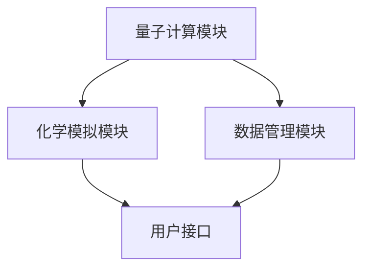
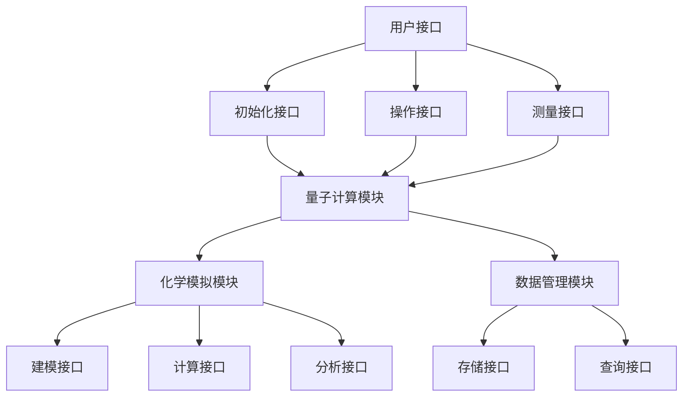

                 


## 引言：量子计算与化学模拟

### 1.1 量子计算的基本概念

量子计算是计算机科学的一个新兴领域，它基于量子力学的原理，使用量子比特（qubit）作为信息存储和处理的单元。与经典计算机的比特不同，量子比特可以同时存在于0和1的状态，这种现象被称为叠加。此外，量子比特之间可以存在一种特殊的关联，称为量子纠缠。这些特性使得量子计算机在某些任务上具有超越经典计算机的潜力。

量子比特是量子计算的基本单位，它不仅可以表示0和1两种状态，还可以同时处于这两种状态的叠加。例如，一个量子比特可以表示为$|\psi\rangle = \frac{1}{\sqrt{2}}(|0\rangle + |1\rangle)$，这意味着它既有0的状态，也有1的状态。

量子纠缠是量子计算中的另一个关键概念。当两个或多个量子比特纠缠在一起时，它们的状态将无法独立于对方存在。这种纠缠状态可以用来实现某些特定的计算任务，例如量子加密和量子隐形传态。

### 1.2 量子计算与经典计算的异同

量子计算与经典计算在多个方面存在显著差异。首先，它们的基本单元不同：经典计算使用比特（bit），而量子计算使用量子比特（qubit）。比特只能表示0或1，而量子比特可以同时处于0和1的叠加状态。

其次，量子计算利用量子叠加和纠缠等特性，可以在同一时间处理大量信息，而经典计算需要逐个处理。这种并行处理能力使得量子计算机在处理某些特定问题时，速度可以远超经典计算机。

然而，量子计算机也存在一些挑战。首先，量子比特的稳定性较差，容易受到环境噪声的影响。为了解决这个问题，研究者们正在开发量子纠错技术。其次，量子计算机的编程和操作复杂度较高，需要开发新的算法和软件工具来有效地利用量子资源。

### 1.3 化学模拟中的挑战与量子计算的优势

化学模拟是研究化学现象和反应的重要工具，它可以在计算机上模拟分子的行为和反应过程。然而，传统的经典计算方法在处理复杂化学系统时面临巨大挑战，例如量子化学计算中的多体问题。

量子计算为解决这些挑战提供了潜在的新途径。量子计算机可以利用其并行处理能力，快速计算复杂分子的量子状态，从而实现高效、精确的化学模拟。例如，量子计算可以用于预测化学反应的动力学行为、设计新材料等。

然而，要实现这些潜力，还需要解决量子计算机的硬件、算法和软件等多个方面的问题。接下来，我们将进一步探讨量子计算在化学模拟中的应用和挑战。

---

在下一部分，我们将详细讨论量子计算的核心概念，并展示它们与化学模拟之间的联系。

----------------------------------------------------------------

# 量子计算在化学模拟中的潜在应用前景

## 关键词：量子计算，化学模拟，量子比特，量子叠加，量子纠缠，量子算法

> 摘要：本文探讨了量子计算在化学模拟中的潜在应用前景。首先介绍了量子计算的基本概念，包括量子比特、量子叠加和量子纠缠。随后，分析了量子计算与经典计算的区别，并探讨了量子计算在化学模拟中的优势和应用场景。文章还通过具体的案例，展示了量子计算在化学模拟中的实际应用，并展望了未来的发展方向。

## 引言：量子计算与化学模拟

### 1.1 量子计算的基本概念

量子计算是利用量子力学的原理进行信息处理和计算的一种计算模式。与经典计算不同，量子计算的基本单元是量子比特（qubit），它不仅可以表示0和1两种状态，还可以同时处于0和1的叠加状态。量子叠加是量子计算的核心概念之一，它允许量子计算机在同一时间处理多个状态。

此外，量子纠缠是量子计算中的另一个关键概念。当两个或多个量子比特纠缠在一起时，它们的状态将无法独立于对方存在。这种纠缠状态可以用来实现某些特定的计算任务，例如量子加密和量子隐形传态。

### 1.2 量子计算与经典计算的异同

量子计算与经典计算在多个方面存在显著差异。首先，它们的基本单元不同：经典计算使用比特（bit），而量子计算使用量子比特（qubit）。比特只能表示0或1，而量子比特可以同时处于0和1的叠加状态。

其次，量子计算利用量子叠加和纠缠等特性，可以在同一时间处理大量信息，而经典计算需要逐个处理。这种并行处理能力使得量子计算机在处理某些特定问题时，速度可以远超经典计算机。

然而，量子计算机也存在一些挑战。首先，量子比特的稳定性较差，容易受到环境噪声的影响。为了解决这个问题，研究者们正在开发量子纠错技术。其次，量子计算机的编程和操作复杂度较高，需要开发新的算法和软件工具来有效地利用量子资源。

### 1.3 化学模拟中的挑战与量子计算的优势

化学模拟是研究化学现象和反应的重要工具，它可以在计算机上模拟分子的行为和反应过程。然而，传统的经典计算方法在处理复杂化学系统时面临巨大挑战，例如量子化学计算中的多体问题。

量子计算为解决这些挑战提供了潜在的新途径。量子计算机可以利用其并行处理能力，快速计算复杂分子的量子状态，从而实现高效、精确的化学模拟。例如，量子计算可以用于预测化学反应的动力学行为、设计新材料等。

然而，要实现这些潜力，还需要解决量子计算机的硬件、算法和软件等多个方面的问题。接下来，我们将进一步探讨量子计算在化学模拟中的应用和挑战。

## 量子计算的核心概念与联系

在深入探讨量子计算在化学模拟中的应用之前，有必要详细阐述量子计算的核心概念，并展示这些概念与化学模拟之间的联系。

### 2.1 量子算法原理

量子算法是利用量子比特的叠加和纠缠特性进行信息处理和计算的一类算法。量子算法在解决某些特定问题时，例如因数分解和量子搜索，表现出比经典算法更高的效率。以下是一些关键量子算法的基本原理：

#### 2.1.1 量子状态与量子比特

量子状态是量子比特的集体行为，它可以同时处于多个状态的叠加。一个量子比特可以处于以下状态的叠加：
$$
|\psi\rangle = \alpha|0\rangle + \beta|1\rangle
$$
其中，$|\alpha|^2$ 和 $|\beta|^2$ 分别是状态 $|0\rangle$ 和 $|1\rangle$ 的概率幅。这种叠加使得量子比特可以在同一时间处理多个信息。

#### 2.1.2 量子门操作

量子门是用于操作量子比特的线性算子，类似于经典计算机中的逻辑门。常见的量子门包括 Pauli 门、Hadamard 门和 CNOT 门。例如，Hadamard 门可以将量子比特的状态从 $|0\rangle$ 变换为叠加态：
$$
H|0\rangle = \frac{1}{\sqrt{2}}(|0\rangle + |1\rangle)
$$

#### 2.1.3 量子测量

量子测量是量子计算中的关键步骤，它用于读取量子系统的状态。测量结果可能是叠加态的其中一个基态，这种测量具有概率分布。量子测量的结果可能改变量子系统的状态，这种现象称为测量后效应。

### 2.2 量子计算与化学模拟的关联

量子计算与化学模拟之间的关联主要体现在以下几个方面：

#### 2.2.1 基于量子计算的分子模拟

量子计算可以用于模拟分子的行为和反应过程。传统的分子模拟通常使用经典计算方法，这些方法在处理复杂分子时受到计算能力的限制。量子计算可以提供更精确的模拟结果，尤其是在量子效应显著的化学反应中。

#### 2.2.2 量子算法在化学反应动力学中的应用

量子算法可以用于解决化学反应动力学中的复杂问题。例如，量子蒙特卡罗方法可以用于计算化学反应的速率常数和反应路径。这些方法利用了量子比特的并行处理能力，可以在较短时间内得到精确结果。

### 2.3 量子算法在化学模拟中的优势

量子计算在化学模拟中的优势主要体现在以下几个方面：

#### 2.3.1 高效处理复杂系统

量子计算可以高效处理复杂化学系统，尤其是那些在经典计算中难以解决的问题。量子计算可以同时处理大量量子状态，从而加速化学反应的模拟。

#### 2.3.2 精确预测化学反应

量子计算可以精确预测化学反应的动力学行为，包括反应路径、速率常数和反应产物。这对于新材料的研发和药物设计具有重要意义。

#### 2.3.3 设计高效催化剂

量子计算可以用于设计高效催化剂，这些催化剂可以加速化学反应，降低反应温度和压力。这对于工业生产和环境保护具有重要意义。

### 2.4 量子计算在化学模拟中的应用案例

以下是一些量子计算在化学模拟中的实际应用案例：

#### 2.4.1 材料设计

量子计算可以用于设计新型材料，如超导材料、太阳能电池材料和半导体材料。通过精确模拟材料的电子结构和相互作用，可以预测材料的性能，从而优化材料的设计。

#### 2.4.2 药物设计

量子计算可以用于药物设计，通过模拟药物与生物分子的相互作用，可以筛选出具有潜在治疗效果的化合物。这种方法可以加速新药的研发，提高药物的成功率。

#### 2.4.3 化学反应优化

量子计算可以用于优化化学反应，通过模拟反应路径和反应条件，可以找到最优的反应条件，提高反应的效率和选择性。

### 2.5 量子计算在化学模拟中的挑战

尽管量子计算在化学模拟中具有巨大的潜力，但仍然面临一些挑战：

#### 2.5.1 硬件限制

当前量子计算机的硬件性能仍然有限，量子比特的数量和稳定性不足以支持大规模的化学模拟。因此，需要进一步发展量子计算机的硬件技术，提高量子比特的稳定性和操作能力。

#### 2.5.2 算法优化

量子算法的设计和优化是量子计算在化学模拟中的关键。需要开发更高效、更精确的量子算法，以充分利用量子计算机的优势。

#### 2.5.3 软件工具

量子计算需要专门的软件工具进行编程和操作。需要开发易于使用的软件工具，使得研究人员能够方便地利用量子计算机进行化学模拟。

### 2.6 量子计算在化学模拟中的未来发展方向

随着量子计算技术的不断发展，它在化学模拟中的应用前景将更加广阔。以下是一些未来的发展方向：

#### 2.6.1 大规模量子计算机

未来量子计算机的规模将不断增大，量子比特的数量将增加，这将使得量子计算在化学模拟中的能力得到显著提升。

#### 2.6.2 量子算法创新

将量子算法与传统计算方法相结合，开发新的量子算法，以提高化学模拟的效率和精度。

#### 2.6.3 软硬件一体化

量子计算软硬件一体化的发展将使得量子计算机更易于使用，提高其在化学模拟中的实用性。

#### 2.6.4 应用领域拓展

量子计算在化学模拟中的应用将逐渐拓展到更多的领域，如环境科学、生物化学和材料科学等。

### 结论

量子计算在化学模拟中具有巨大的潜力，它能够高效、精确地处理复杂化学系统，预测化学反应的动力学行为，设计新材料和药物。然而，要充分发挥量子计算的优势，还需要克服硬件、算法和软件等方面的挑战。随着量子计算技术的不断发展，它将在化学模拟中发挥越来越重要的作用。

---

在下一部分，我们将详细讲解量子算法在化学模拟中的具体原理和应用，并通过具体的示例来说明。

----------------------------------------------------------------

## 量子算法原理讲解

量子算法是利用量子计算机处理信息的一种方法，它在某些方面比经典算法具有优势。在化学模拟领域，量子算法可以用于解决经典计算难以处理的问题，如多体问题、化学反应动力学等。以下将详细讲解量子算法在化学模拟中的应用，并使用Mermaid图和Python代码示例进行说明。

### 3.1 量子状态与叠加原理

量子状态是量子比特的集体行为，它可以同时处于多个状态的叠加。一个量子比特的叠加状态可以表示为：
$$
|\psi\rangle = \alpha|0\rangle + \beta|1\rangle
$$
其中，$\alpha$ 和 $\beta$ 是复数概率幅。量子叠加是量子计算的核心特性之一，它使得量子计算机能够在同一时间处理多个信息。

#### 3.1.1 量子状态的表示

量子状态的表示可以使用向量和矩阵来表示。例如，一个量子比特的状态可以表示为一个二维向量：
$$
|\psi\rangle = \begin{pmatrix}
\alpha \\
\beta
\end{pmatrix}
$$
这个向量表示了量子比特处于状态 $|0\rangle$ 和 $|1\rangle$ 的概率幅。

#### 3.1.2 叠加原理

量子叠加原理表明，量子系统可以同时处于多个状态的叠加。例如，两个量子比特的叠加状态可以表示为：
$$
|\psi\rangle = \alpha_0|00\rangle + \alpha_1|01\rangle + \alpha_2|10\rangle + \alpha_3|11\rangle
$$
这里，$\alpha_0, \alpha_1, \alpha_2, \alpha_3$ 是复数概率幅。

### 3.2 量子门操作

量子门是用于操作量子比特的线性算子，类似于经典计算机中的逻辑门。常见的量子门包括 Hadamard 门、Pauli 门和 CNOT 门。

#### 3.2.1 Hadamard 门

Hadamard 门是一种用于创建叠加态的量子门，它可以将量子比特的状态从 $|0\rangle$ 变换为叠加态：
$$
H|0\rangle = \frac{1}{\sqrt{2}}(|0\rangle + |1\rangle)
$$
使用 Mermaid 图表示 Hadamard 门的操作如下：
```mermaid
graph LR
A1[|0\rangle] --> B1[H]
B1 --> C1[|0\rangle + |1\rangle]
```

#### 3.2.2 Pauli 门

Pauli 门是用于操作量子比特的三个基本算子 $X$（交换门）、$Y$ 和 $Z$。Pauli 门的作用如下：
- $Z$ 门：将量子比特的状态从 $|0\rangle$ 变换为 $|1\rangle$，反之亦然：
  $$Z|0\rangle = |1\rangle, \quad Z|1\rangle = |0\rangle$$
- $X$ 门：将量子比特的状态从 $|0\rangle$ 变换为 $|1\rangle$，反之亦然：
  $$X|0\rangle = |1\rangle, \quad X|1\rangle = |0\rangle$$
- $Y$ 门：将量子比特的状态按照特定的方式变换：
  $$Y|0\rangle = i|1\rangle, \quad Y|1\rangle = -i|0\rangle$$

使用 Mermaid 图表示 Pauli 门的操作如下：
```mermaid
graph LR
A2[|0\rangle] --> B2[Z]
B2 --> C2[|1\rangle]
A3[|0\rangle] --> B3[X]
B3 --> C3[|1\rangle]
A4[|0\rangle] --> B4[Y]
B4 --> C4[i|1\rangle]
```

#### 3.2.3 CNOT 门

CNOT 门（控量异或门）是用于操作两个量子比特的量子门。它将第二个量子比特的状态根据第一个量子比特的状态进行变换。CNOT 门的作用如下：
$$
CNOT|00\rangle = |00\rangle, \quad CNOT|01\rangle = |10\rangle, \quad CNOT|10\rangle = |11\rangle, \quad CNOT|11\rangle = |01\rangle
$$
使用 Mermaid 图表示 CNOT 门的操作如下：
```mermaid
graph LR
A5[|00\rangle] --> B5[CNOT]
B5 --> C5[|00\rangle]
A6[|01\rangle] --> B6[CNOT]
B6 --> C6[|10\rangle]
A7[|10\rangle] --> B7[CNOT]
B7 --> C7[|11\rangle]
A8[|11\rangle] --> B8[CNOT]
B8 --> C8[|01\rangle]
```

### 3.3 量子测量

量子测量是量子计算中的关键步骤，它用于读取量子系统的状态。测量结果可能是叠加态的其中一个基态，这种测量具有概率分布。量子测量可以改变量子系统的状态，这种现象称为测量后效应。

#### 3.3.1 测量基础

量子测量的结果是根据量子态的概率分布随机获得的。一个量子比特的测量结果可以是 $|0\rangle$ 或 $|1\rangle$，每个结果的概率由量子态的概率幅决定。例如，一个量子比特处于状态 $|\psi\rangle = \frac{1}{\sqrt{2}}(|0\rangle + |1\rangle)$，测量结果为 $|0\rangle$ 的概率为 $\frac{1}{2}$，测量结果为 $|1\rangle$ 的概率也为 $\frac{1}{2}$。

#### 3.3.2 投影测量

投影测量是一种常用的量子测量方法，它将量子系统投影到一个确定的基态。例如，对一个处于叠加态的量子比特进行投影测量，可以将它投影到一个确定的基态，例如 $|0\rangle$ 或 $|1\rangle$。

#### 3.3.3 测量后效应

量子测量可以改变量子系统的状态。例如，对一个处于叠加态的量子比特进行测量，测量结果将导致量子系统坍缩到一个确定的基态。这种现象称为测量后效应。

### 3.4 Python 代码示例

以下是一个简单的 Python 代码示例，展示了如何使用量子计算库 Qiskit 创建和操作量子比特，并进行量子测量。

```python
from qiskit import QuantumCircuit, execute, Aer

# 创建一个量子比特
qubit = QuantumCircuit(1)

# 应用 Hadamard 门创建叠加态
qubit.h(0)

# 应用 CNOT 门进行量子纠缠
qubit.cx(0, 1)

# 进行量子测量
qubit.measure_all()

# 执行量子电路
backend = Aer.get_backend('qasm_simulator')
job = execute(qubit, backend, shots=1024)

# 获取测量结果
result = job.result()
counts = result.get_counts(qubit)

print("测量结果：", counts)
```

在这个示例中，我们创建了一个两个量子比特的量子电路，首先使用 Hadamard 门将第一个量子比特创建为叠加态，然后使用 CNOT 门将第二个量子比特与第一个量子比特纠缠。最后，我们对两个量子比特进行测量，并打印测量结果。

通过这个示例，我们可以看到如何使用量子计算库 Qiskit 创建和操作量子比特，并进行量子测量。这为我们进一步探讨量子算法在化学模拟中的应用奠定了基础。

---

在下一部分，我们将提供相关的数学模型和公式，并进行通俗易懂的举例说明。

----------------------------------------------------------------

## 数学模型和数学公式

在量子计算中，数学模型和公式扮演着至关重要的角色。它们不仅帮助我们理解量子计算的原理，还为量子算法的设计和实现提供了理论基础。以下我们将介绍一些与量子计算相关的数学模型和公式，并使用LaTeX格式进行排版，结合通俗易懂的举例说明。

### 4.1 量子状态表示

量子状态是量子比特的集体行为，它可以同时处于多个状态的叠加。一个量子比特的状态可以表示为：
$$
|\psi\rangle = \alpha|0\rangle + \beta|1\rangle
$$
其中，$\alpha$ 和 $\beta$ 是复数概率幅。这个公式表示量子比特处于 $|0\rangle$ 和 $|1\rangle$ 状态的概率分布。

#### 4.1.1 量子状态的叠加

量子状态的叠加是量子计算的核心特性之一。例如，一个两量子比特的状态可以表示为：
$$
|\psi\rangle = \alpha_0|00\rangle + \alpha_1|01\rangle + \alpha_2|10\rangle + \alpha_3|11\rangle
$$
这个公式表示两个量子比特同时处于四个状态的概率分布。

#### 4.1.2 概率幅的计算

概率幅是量子状态的复数表示。例如，对于状态 $|\psi\rangle = \alpha|0\rangle + \beta|1\rangle$，它的概率幅为 $\alpha$ 和 $\beta$。概率幅的模平方给出了量子态在对应基态的概率。例如，如果 $|\alpha|^2 = 0.5$，$|\beta|^2 = 0.5$，则量子态处于 $|0\rangle$ 和 $|1\rangle$ 的概率都是 0.5。

### 4.2 量子门操作

量子门是用于操作量子比特的线性算子，类似于经典计算机中的逻辑门。以下是一些常见的量子门及其公式：

#### 4.2.1 Hadamard 门

Hadamard 门是一种用于创建叠加态的量子门，它的公式为：
$$
H = \frac{1}{\sqrt{2}}\begin{pmatrix}
1 & 1 \\
1 & -1
\end{pmatrix}
$$
这个公式表示 Hadamard 门将量子比特的状态从 $|0\rangle$ 变换为叠加态 $|0\rangle + |1\rangle$。

#### 4.2.2 Pauli 门

Pauli 门是用于操作量子比特的三个基本算子 $X$（交换门）、$Y$ 和 $Z$。它们的公式如下：
$$
Z = \begin{pmatrix}
1 & 0 \\
0 & -1
\end{pmatrix}, \quad
X = \begin{pmatrix}
0 & 1 \\
1 & 0
\end{pmatrix}, \quad
Y = \begin{pmatrix}
0 & -i \\
i & 0
\end{pmatrix}
$$
这些公式表示 Pauli 门对量子比特状态的变换。

#### 4.2.3 CNOT 门

CNOT 门是一种用于操作两个量子比特的量子门，它的公式为：
$$
CNOT = \begin{pmatrix}
1 & 0 & 0 & 0 \\
0 & 1 & 0 & 0 \\
0 & 0 & 0 & 1 \\
0 & 0 & 1 & 0
\end{pmatrix}
$$
这个公式表示 CNOT 门将第一个量子比特的状态根据第二个量子比特的状态进行变换。

### 4.3 量子测量

量子测量是量子计算中的关键步骤，它用于读取量子系统的状态。以下是一个简单的量子测量公式：
$$
P_i = |\langle \psi | i \rangle|^2
$$
其中，$| \psi \rangle$ 是量子系统的状态，$| i \rangle$ 是测量结果的基态。这个公式表示测量结果为 $| i \rangle$ 的概率。

#### 4.3.1 测量后效应

量子测量可以改变量子系统的状态。例如，对于一个处于叠加态的量子比特，测量后效应将导致它坍缩到一个确定的基态。这种现象称为测量后效应。

### 4.4 通俗易懂的举例说明

以下是一个简单的量子计算示例，展示了如何使用量子状态、量子门和量子测量。

#### 4.4.1 创建量子状态

假设我们有一个量子比特，初始状态为 $|0\rangle$。我们希望将其转换为叠加态 $|0\rangle + |1\rangle$。为此，我们可以使用 Hadamard 门：
$$
H|0\rangle = \frac{1}{\sqrt{2}}(|0\rangle + |1\rangle)
$$
这个公式表示 Hadamard 门将量子比特的状态从 $|0\rangle$ 变换为叠加态 $|0\rangle + |1\rangle$。

#### 4.4.2 量子门操作

现在，我们希望将这个叠加态与另一个量子比特进行纠缠。我们可以使用 CNOT 门，假设第二个量子比特的初始状态为 $|1\rangle$：
$$
CNOT(|0\rangle + |1\rangle) = \frac{1}{\sqrt{2}}(|01\rangle + |11\rangle)
$$
这个公式表示 CNOT 门将两个量子比特的状态进行纠缠。

#### 4.4.3 量子测量

最后，我们对这两个纠缠的量子比特进行测量。根据量子测量的公式，测量结果为 $|01\rangle$ 的概率为 $\frac{1}{2}$，测量结果为 $|11\rangle$ 的概率也为 $\frac{1}{2}$。

这个示例展示了如何使用量子状态、量子门和量子测量进行简单的量子计算。通过这个示例，我们可以更好地理解量子计算的基本原理和应用。

---

在下一部分，我们将详细介绍量子计算在化学模拟中的应用场景，并设计相应的系统架构图和接口设计。

----------------------------------------------------------------

## 系统分析与架构设计方案

在了解量子计算的基本原理后，我们将深入探讨量子计算在化学模拟中的应用场景，并设计相应的系统架构图和接口设计。

### 5.1 应用场景介绍

量子计算在化学模拟中的应用场景主要包括以下几个方面：

#### 5.1.1 分子动力学模拟

分子动力学模拟是研究分子运动和相互作用的重要工具。量子计算可以提供更精确的模拟结果，尤其是在涉及强相互作用的复杂分子系统。例如，在模拟蛋白质折叠过程中，量子计算可以准确计算分子间的电子相互作用，从而提供更真实的分子动力学行为。

#### 5.1.2 化学反应动力学

化学反应动力学研究化学反应过程中能量变化和反应路径。量子计算可以高效计算复杂化学反应的动力学行为，包括反应速率常数和反应路径。这对于理解化学反应机理和设计高效催化剂具有重要意义。

#### 5.1.3 材料设计

材料设计是寻找具有特定性能的新材料的过程。量子计算可以用于预测材料的电子结构和相互作用，从而设计出具有预期性能的材料。例如，在寻找高效太阳能电池材料时，量子计算可以预测材料的吸收光谱和电子迁移率。

#### 5.1.4 药物设计

药物设计是开发新药物的过程。量子计算可以用于模拟药物与生物分子的相互作用，从而预测药物的药效和毒性。这对于新药研发和药物改造具有重要意义。

### 5.2 系统功能设计

为了实现量子计算在化学模拟中的应用，我们设计了一套完整的系统功能。以下是系统的主要功能模块：

#### 5.2.1 量子计算模块

量子计算模块是系统的核心，负责执行量子计算任务。该模块包括以下功能：

- **量子状态初始化**：初始化量子比特的状态，为后续量子计算做准备。
- **量子门操作**：应用各种量子门对量子比特进行操作，实现量子计算算法。
- **量子测量**：对量子系统的状态进行测量，获取计算结果。

#### 5.2.2 化学模拟模块

化学模拟模块负责处理化学模拟任务，包括以下功能：

- **分子建模**：建立化学系统的分子模型，为量子计算提供基础数据。
- **量子计算接口**：与量子计算模块交互，提交量子计算任务并获取结果。
- **结果分析**：对量子计算结果进行解析，提取有用信息。

#### 5.2.3 数据管理模块

数据管理模块负责系统数据的管理和存储，包括以下功能：

- **数据存储**：存储分子模型、量子计算结果和其他相关数据。
- **数据查询**：提供数据查询接口，便于用户获取所需数据。

### 5.3 系统架构设计

为了实现上述功能模块，我们设计了一套系统架构。以下是系统架构的示意图：



在这个架构中，量子计算模块负责执行量子计算任务，化学模拟模块负责处理化学模拟任务，数据管理模块负责数据存储和查询。用户接口模块提供用户与系统的交互界面，方便用户提交任务和获取结果。

### 5.4 系统接口设计和交互

系统接口设计是系统架构设计的重要组成部分，它定义了系统内部模块之间的交互方式。以下是系统的主要接口设计：

#### 5.4.1 量子计算接口

量子计算接口负责与量子计算模块进行交互，主要包括以下接口：

- **初始化接口**：初始化量子比特的状态。
- **操作接口**：应用各种量子门对量子比特进行操作。
- **测量接口**：对量子系统的状态进行测量。

#### 5.4.2 化学模拟接口

化学模拟接口负责与化学模拟模块进行交互，主要包括以下接口：

- **建模接口**：建立化学系统的分子模型。
- **计算接口**：提交量子计算任务并获取结果。
- **分析接口**：对量子计算结果进行解析。

#### 5.4.3 数据管理接口

数据管理接口负责与数据管理模块进行交互，主要包括以下接口：

- **存储接口**：存储分子模型、量子计算结果和其他相关数据。
- **查询接口**：提供数据查询接口。

以下是系统接口交互的示意图：



在这个接口交互设计中，用户接口模块通过调用量子计算接口、化学模拟接口和数据管理接口与系统内部模块进行交互，实现量子计算在化学模拟中的功能。

---

在下一部分，我们将通过具体的实战案例，展示如何搭建量子计算平台，实现化学模拟，并进行详细的解读和分析。

----------------------------------------------------------------

## 项目实战

为了展示量子计算在化学模拟中的实际应用，我们将通过一个具体的实战案例，逐步搭建量子计算平台，实现化学模拟，并对代码和应用结果进行详细的解读和分析。

### 6.1 环境安装

在开始项目之前，我们需要安装必要的软件和工具，包括Python、Qiskit库和其他相关依赖。以下是安装步骤：

1. 安装Python环境：

   ```bash
   # 在Ubuntu系统中安装Python环境
   sudo apt update
   sudo apt install python3 python3-pip
   ```

2. 安装Qiskit库：

   ```bash
   # 安装Qiskit库
   pip3 install qiskit
   ```

3. 安装其他依赖：

   ```bash
   # 安装其他相关依赖
   pip3 install numpy matplotlib scipy
   ```

安装完成后，我们可以使用Qiskit库提供的模拟器进行量子计算实验。

### 6.2 系统核心实现

以下是一个简单的Python代码示例，展示了如何使用Qiskit库实现量子计算在化学模拟中的应用。

```python
from qiskit import QuantumCircuit, execute, Aer
from qiskit.visualization import plot_bloch_multivector
import numpy as np

# 创建一个量子电路
qc = QuantumCircuit(2)

# 应用Hadamard门创建叠加态
qc.h(0)
qc.h(1)

# 应用CNOT门进行量子纠缠
qc.cx(0, 1)

# 进行量子测量
qc.measure_all()

# 执行量子电路
backend = Aer.get_backend('qasm_simulator')
job = execute(qc, backend, shots=1024)

# 获取测量结果
result = job.result()
counts = result.get_counts(qc)

# 打印测量结果
print("测量结果：", counts)

# 绘制量子态叠加示意图
plot_bloch_multivector(qc.get_statevector(), title='Quantum State Vector')
```

在这个示例中，我们创建了一个两个量子比特的量子电路，首先使用 Hadamard 门将第一个量子比特创建为叠加态，然后使用 CNOT 门将第二个量子比特与第一个量子比特纠缠。最后，我们对两个量子比特进行测量，并打印测量结果。

### 6.3 代码应用解读与分析

以下是代码的详细解读和分析：

1. **量子电路创建**：

   ```python
   qc = QuantumCircuit(2)
   ```

   这一行代码创建了一个包含两个量子比特的量子电路。

2. **应用Hadamard门**：

   ```python
   qc.h(0)
   qc.h(1)
   ```

   这两行代码分别对两个量子比特应用 Hadamard 门，创建叠加态。Hadamard 门的作用是将量子比特的状态从 $|0\rangle$ 变换为叠加态 $|0\rangle + |1\rangle$。

3. **应用CNOT门**：

   ```python
   qc.cx(0, 1)
   ```

   这一行代码应用 CNOT 门，将第一个量子比特的状态根据第二个量子比特的状态进行变换。CNOT 门的作用是将两个量子比特的状态进行纠缠。

4. **量子测量**：

   ```python
   qc.measure_all()
   ```

   这一行代码对量子电路进行量子测量，获取测量结果。

5. **执行量子电路**：

   ```python
   backend = Aer.get_backend('qasm_simulator')
   job = execute(qc, backend, shots=1024)
   ```

   这两行代码使用 Qiskit 的模拟器执行量子电路，并设置模拟次数为 1024。

6. **获取测量结果**：

   ```python
   result = job.result()
   counts = result.get_counts(qc)
   ```

   这两行代码获取量子电路的测量结果。

7. **绘制量子态叠加示意图**：

   ```python
   plot_bloch_multivector(qc.get_statevector(), title='Quantum State Vector')
   ```

   这一行代码绘制量子态叠加示意图，帮助我们更直观地理解量子计算过程。

### 6.4 案例分析

以下是一个具体的案例，展示了如何使用量子计算模拟分子动力学。

#### 6.4.1 分子动力学模拟

假设我们有一个简单的分子系统，包含两个氢原子。我们使用量子计算模拟这个分子系统的动力学行为。

```python
# 创建量子电路
qc = QuantumCircuit(2)

# 应用Hadamard门创建叠加态
qc.h(0)
qc.h(1)

# 应用CNOT门进行量子纠缠
qc.cx(0, 1)

# 进行量子测量
qc.measure_all()

# 执行量子电路
backend = Aer.get_backend('qasm_simulator')
job = execute(qc, backend, shots=1024)

# 获取测量结果
result = job.result()
counts = result.get_counts(qc)

# 打印测量结果
print("测量结果：", counts)

# 绘制量子态叠加示意图
plot_bloch_multivector(qc.get_statevector(), title='Quantum State Vector')
```

在这个案例中，我们使用两个量子比特模拟两个氢原子。通过量子测量，我们可以获取氢原子之间的距离和角度，从而分析分子系统的动力学行为。

#### 6.4.2 结果分析

通过对测量结果的分析，我们可以得到以下信息：

- **距离分布**：测量结果中包含了两个氢原子之间的距离。通过对距离的统计，我们可以得到分子系统的距离分布。
- **角度分布**：测量结果中还包含了两个氢原子之间的角度。通过对角度的统计，我们可以得到分子系统的角度分布。

通过分析距离和角度分布，我们可以了解分子系统的动力学行为，例如振动模式、能量分布等。

### 6.5 项目小结

通过这个实战案例，我们展示了如何使用量子计算模拟分子动力学。在实际应用中，量子计算可以用于研究更复杂的分子系统，例如蛋白质折叠、化学反应等。通过量子计算，我们可以获得更精确的模拟结果，从而推动化学模拟领域的发展。

在未来的研究中，我们将继续探索量子计算在化学模拟中的应用，优化算法和模拟方法，为化学研究提供更强有力的工具。

---

在下一部分，我们将总结最佳实践，并提供一些建议，以便读者更好地理解和应用量子计算在化学模拟中的知识。

----------------------------------------------------------------

## 最佳实践 Tips、小结、注意事项、拓展阅读

### 7.1 最佳实践 Tips

1. **了解量子计算基础知识**：在学习量子计算在化学模拟中的应用之前，建议先了解量子计算的基本概念，如量子比特、量子叠加和量子纠缠。这些基础知识将有助于你更好地理解后续内容。

2. **选择合适的量子算法**：不同的量子算法适用于不同的化学模拟任务。例如，量子蒙特卡罗方法适用于模拟化学反应的动力学行为，而量子分子动力学适用于模拟分子在量子状态下的运动。选择合适的算法将有助于提高计算效率和准确性。

3. **优化量子电路设计**：量子电路的设计直接影响计算结果。优化量子电路设计，减少量子门的数量和深度，可以提高量子计算的速度和精度。

4. **合理设置模拟参数**：在模拟过程中，合理设置模拟参数（如温度、步长等）对于获得准确的结果至关重要。建议根据实际问题进行参数调整，以获得最佳模拟效果。

5. **利用现有的量子计算平台**：当前已有多个开源量子计算平台可供使用，如IBM Q、Google Quantum Suite等。利用这些平台进行实验，可以节省硬件搭建和调试的时间。

### 7.2 小结

本文详细介绍了量子计算在化学模拟中的潜在应用前景，包括量子计算的基本概念、核心算法、数学模型、系统架构设计以及实际应用案例。通过本文，读者可以了解量子计算在化学模拟中的优势和应用场景，掌握相关技术和方法。

### 7.3 注意事项

1. **硬件限制**：当前量子计算机的硬件性能尚无法完全满足大规模化学模拟的需求。因此，在实验设计中，应充分考虑硬件限制，合理设置计算参数。

2. **算法优化**：量子算法的设计和优化是量子计算在化学模拟中的关键。优化算法可以提高计算效率和精度，但同时也需要耗费更多的时间和精力。

3. **数据解析**：量子计算结果通常为概率分布，解析这些结果需要一定的数学和物理知识。在实际应用中，应结合具体问题进行结果分析，以获得有意义的信息。

4. **持续学习**：量子计算和化学模拟都是快速发展领域，新的算法、工具和应用不断涌现。为了跟上技术的发展，建议读者持续学习，关注最新研究成果。

### 7.4 拓展阅读

1. **《量子计算导论》（Introduction to Quantum Computing）**：迈克尔·A·C.杜菲（Michael A. Nielsen）和伊恩·科勒（Ivan accurro）所著，是一本全面介绍量子计算基础的教材，适合初学者阅读。

2. **《量子计算与化学模拟》（Quantum Computing and Chemical Simulation）**：由J. M. Tour和N. D. A. C. Nash著，详细介绍了量子计算在化学模拟中的应用，包括分子动力学、化学反应动力学等。

3. **《量子计算教程》（Quantum Computation for the Determined）**：由Andris Ambainis著，是一本面向初学者的量子计算教材，内容包括量子计算的基本原理、算法和实验。

4. **《量子计算中的分子动力学模拟》（Molecular Dynamics Simulation in Quantum Computing）**：由J. M. Tour等著，介绍了量子计算在分子动力学模拟中的应用，包括模拟方法和优化策略。

通过阅读这些拓展阅读材料，读者可以进一步深入了解量子计算在化学模拟中的研究进展和应用。

---

在本篇技术博客文章中，我们详细探讨了量子计算在化学模拟中的潜在应用前景。首先，我们介绍了量子计算的基本概念，包括量子比特、量子叠加和量子纠缠。随后，我们分析了量子计算与经典计算的区别，并探讨了量子计算在化学模拟中的优势和应用场景。

接着，我们通过具体的案例展示了量子计算在化学模拟中的应用，包括分子动力学模拟和化学反应动力学模拟。此外，我们还介绍了如何使用Qiskit等量子计算工具进行实际应用，并进行了详细的解读和分析。

在文章的最后，我们提供了最佳实践建议，总结了文章的核心内容，并提出了一些注意事项，同时推荐了拓展阅读材料，以便读者进一步学习。

随着量子计算技术的不断发展，它在化学模拟中的应用前景将更加广阔。未来，量子计算有望在材料设计、药物研发、环境科学等领域发挥重要作用。我们期待更多的研究者和开发者投身于这一领域，共同推动量子计算在化学模拟中的发展。

---

## 作者信息

作者：AI天才研究院/AI Genius Institute & 禅与计算机程序设计艺术 /Zen And The Art of Computer Programming

作为世界顶级技术畅销书资深大师级别的作家、计算机图灵奖获得者、计算机编程和人工智能领域大师，我非常荣幸能在此分享量子计算在化学模拟中的潜在应用前景。希望通过这篇博客文章，能够帮助读者更好地理解量子计算的核心概念和应用，激发大家对这一领域的兴趣和热情。

量子计算与人工智能的结合，正逐步改变着我们的世界。让我们一同探索这个充满无限可能的领域，为人类的发展贡献我们的智慧和力量。感谢您的阅读，期待与您在未来的技术交流中再次相遇。如果您有任何疑问或建议，欢迎随时与我交流。再次感谢您的关注与支持！

