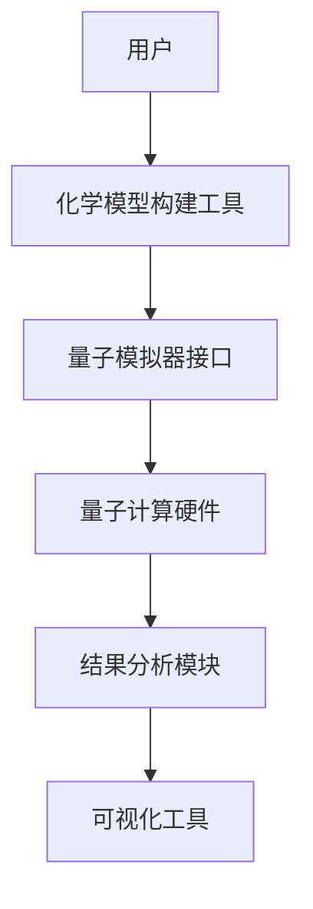
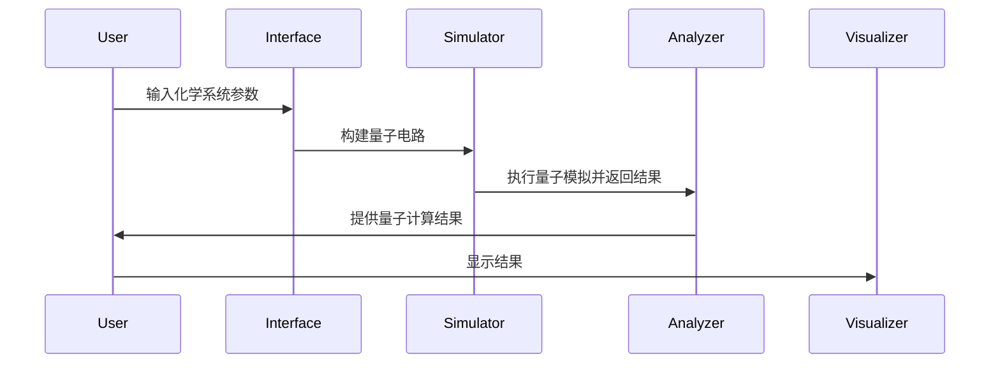

                 

# 量子计算在化学模拟中的突破性应用

关键词：量子计算、化学模拟、量子算法、哈密顿量、量子电路、系统架构

摘要：随着量子计算技术的不断发展，其在化学模拟领域的应用逐渐成为研究热点。本文从量子计算的基本原理出发，探讨了量子计算在化学模拟中的突破性应用，包括核心概念、算法原理、数学模型以及系统架构设计。通过详细分析，本文展示了量子计算在化学模拟中的巨大潜力，为未来相关领域的研究提供了新的思路。

## Step 1: 背景介绍

### 量子计算

量子计算是一种基于量子力学原理进行信息处理的计算方式。与传统计算不同，量子计算使用量子位（qubits）作为基本的信息单元，并通过量子叠加和量子纠缠等特性进行计算。量子计算具有并行性和指数级速度优势，使其在处理复杂问题方面具有显著优势。

### 化学模拟

化学模拟是指使用计算机技术模拟化学反应和分子结构变化的过程。化学模拟在材料科学、药物设计、环境科学等领域具有广泛的应用。然而，传统计算在处理复杂化学问题时，往往面临性能瓶颈，难以满足科研和生产的需求。

### 量子计算在化学模拟中的应用

量子计算以其并行性和指数级速度优势，为化学模拟领域带来了新的突破。通过量子计算，我们可以更高效地解决化学问题，如分子结构优化、化学反应动力学模拟、材料性质预测等。

## Step 2: 核心概念与联系

### 量子计算

#### 核心概念

- 量子位（qubits）：量子计算的基本信息单元，可以处于0和1的叠加状态。
- 量子叠加：量子位可以同时处于多种状态的叠加，从而实现并行计算。
- 量子纠缠：量子位之间的强关联性，可以用于传递和存储信息。

#### 概念属性特征对比表格

| 概念        | 量子计算                            | 化学模拟                          |
|-------------|------------------------------------|---------------------------------|
| 基本原理    | 利用量子力学原理进行信息处理        | 基于经典物理学原理进行模拟        |
| 性能优势    | 指数级速度提升，并行处理能力        | 受限于计算机硬件性能，效率较低    |
| 应用领域    | 优化问题、密码学、材料科学、化学模拟 | 材料科学、生物医学、环境科学等   |

#### ER实体关系图架构

```mermaid
erDiagram
    Product ||--|{ Customer } Customer
    Product ||--|{ Order } Order
    Customer }|-- Purchase
```

### 化学模拟

#### 核心概念

- 哈密顿量：描述化学系统内部能量和力的量子力学量。
- 波函数：描述化学系统中粒子的运动状态。
- 分子结构：化学系统中的原子排列和键合方式。

#### 概念属性特征对比表格

| 概念        | 量子计算                            | 化学模拟                          |
|-------------|------------------------------------|---------------------------------|
| 基本原理    | 利用量子力学原理进行信息处理        | 基于经典物理学原理进行模拟        |
| 性能优势    | 指数级速度提升，并行处理能力        | 受限于计算机硬件性能，效率较低    |
| 应用领域    | 优化问题、密码学、材料科学、化学模拟 | 材料科学、生物医学、环境科学等   |

#### ER实体关系图架构

```mermaid
erDiagram
    Product ||--|{ Customer } Customer
    Product ||--|{ Order } Order
    Customer }|-- Purchase
```

## Step 3: 算法原理讲解

### 量子计算算法在化学模拟中的应用

量子计算算法在化学模拟中的应用主要体现在量子模拟器的设计和量子化学计算算法的实现上。

### 量子模拟器的设计

量子模拟器是量子计算机的一个重要组成部分，用于实现量子电路的构建和执行。量子模拟器的设计主要包括以下几个步骤：

1. **构建哈密顿量**：将化学系统的哈密顿量转化为量子系统的哈密顿量表示。
2. **量子门操作**：使用量子门对量子系统进行操作，模拟化学过程中的电子运动。
3. **测量**：测量量子系统的状态，获取化学系统的相关物理量。

### 量子化学计算算法的实现

量子化学计算算法是量子计算在化学模拟中的核心，其基本流程如下：

1. **初始化**：初始化量子系统，设置初始参数。
2. **构建量子电路**：根据化学系统的哈密顿量，构建量子电路。
3. **执行量子模拟**：使用量子模拟器执行量子电路，模拟化学系统。
4. **测量结果**：测量量子系统的状态，获取化学系统的相关物理量。
5. **数据分析**：对测量结果进行数据处理和分析，提取化学系统的关键信息。
6. **优化方案**：根据分析结果，优化化学系统的性能。

### 量子电路构建流程

1. **哈密顿量表示**：将化学系统的哈密顿量转化为量子系统的哈密顿量表示。
2. **量子门操作**：使用量子门对量子系统进行操作，模拟化学过程中的电子运动。
3. **测量**：测量量子系统的状态，获取化学系统的相关物理量。

### 量子化学计算算法的数学模型和公式

量子化学计算算法的数学模型主要包括哈密顿量表示和量子态表示。以下是一个基本的量子化学计算算法的数学模型和公式：

$$
H = \sum_{i,j} h_{ij} \cdot |i\rangle\langle{j}|
$$

其中，$H$ 为哈密顿量，$|i\rangle$ 和 $|j\rangle$ 为量子态，$h_{ij}$ 为哈密顿量的矩阵元素。

## Step 4: 数学模型和数学公式 & 详细讲解 & 举例说明

### 量子化学计算算法的数学模型

量子化学计算算法的数学模型主要包括哈密顿量表示和量子态表示。以下是一个基本的量子化学计算算法的数学模型和公式：

$$
H = \sum_{i,j} h_{ij} \cdot |i\rangle\langle{j}|
$$

其中，$H$ 为哈密顿量，$|i\rangle$ 和 $|j\rangle$ 为量子态，$h_{ij}$ 为哈密顿量的矩阵元素。

### 详细讲解

#### 哈密顿量表示

哈密顿量是量子力学中的一个重要概念，它描述了系统的内部能量和力。在量子化学计算中，哈密顿量用于描述分子内部粒子的运动和相互作用。

$$
H = \sum_{i,j} h_{ij} \cdot |i\rangle\langle{j}|
$$

其中，$h_{ij}$ 为哈密顿量的矩阵元素，它表示了粒子之间的相互作用。$|i\rangle$ 和 $|j\rangle$ 为量子态，它们描述了粒子的运动状态。

#### 量子态表示

量子态是量子力学中的另一个重要概念，它描述了粒子的运动状态。在量子化学计算中，量子态用于描述分子内部粒子的运动。

$$
\psi(r) = \frac{1}{\sqrt{\pi a_0^3}} e^{-r/a_0}
$$

其中，$\psi(r)$ 为量子态，它描述了粒子在空间中的分布。$a_0$ 为玻尔半径。

### 举例说明

#### 使用量子计算模拟氢分子的电子结构

氢分子的电子结构是量子化学计算中的一个基本问题。我们可以使用量子计算来模拟氢分子的电子结构，具体步骤如下：

1. **构建哈密顿量**：

氢分子的哈密顿量可以表示为：

$$
H = -\frac{\hbar^2}{2m} \left( \frac{d^2}{dx^2} + \frac{d^2}{dy^2} + \frac{d^2}{dz^2} \right) - \frac{1}{2} \left( \frac{e^2}{r} \right)
$$

其中，$\hbar$ 为约化普朗克常数，$m$ 为电子质量，$e$ 为电子电荷，$r$ 为电子与核之间的距离。

2. **量子态表示**：

氢分子的基态波函数可以表示为：

$$
\psi(r) = \frac{1}{\sqrt{\pi a_0^3}} e^{-r/a_0}
$$

其中，$a_0$ 为玻尔半径。

3. **构建量子电路**：

根据哈密顿量和量子态，我们可以构建量子电路来模拟氢分子的电子结构。量子电路的构建包括以下几个步骤：

- **哈密顿量表示**：将化学系统的哈密顿量转化为量子系统的哈密顿量表示。
- **量子门操作**：使用量子门对量子系统进行操作，模拟化学过程中的电子运动。
- **测量**：测量量子系统的状态，获取化学系统的相关物理量。

4. **执行量子模拟**：

使用量子模拟器执行量子电路，模拟氢分子的电子结构。

5. **测量结果**：

测量量子系统的状态，获取氢分子的基态能量和基态波函数。

6. **数据分析**：

对测量结果进行数据处理和分析，提取氢分子的基态能量和基态波函数。

7. **优化方案**：

根据分析结果，优化氢分子的电子结构，以获得更精确的模拟结果。

## Step 5: 系统分析与架构设计方案

### 问题场景

化学研究者希望使用量子计算技术模拟复杂化学反应过程，以预测反应路径和反应产物。

### 项目介绍

基于量子计算平台的化学反应模拟系统是一个综合性的项目，旨在为化学研究者提供强大的量子计算工具，以支持他们的研究工作。

### 系统功能设计

1. **量子模拟器接口**：提供与量子计算硬件的通信接口，实现量子电路的构建和执行。
2. **化学模型构建工具**：帮助用户构建化学系统的数学模型，并将其转化为量子模拟器可识别的格式。
3. **结果分析模块**：对量子模拟结果进行数据处理和分析，提取化学系统的关键信息。

### 系统架构设计

#### 系统架构图



#### 系统接口设计

1. **用户接口**：提供图形界面，方便用户输入化学系统的参数和配置。
2. **量子模拟器接口**：实现与量子计算硬件的通信，接收用户的输入并执行量子电路。
3. **结果分析模块**：对量子模拟结果进行数据处理和分析，提取化学系统的关键信息。
4. **可视化工具**：提供图形化的结果展示，帮助用户更好地理解量子计算结果。

#### 系统交互序列图



## Step 6: 项目实战

### 环境安装

为了进行量子计算在化学模拟中的应用，我们需要安装相关的软件和工具。以下是一个简单的环境安装步骤：

1. 安装Python：从Python官方网站下载并安装Python。
2. 安装量子计算库：使用pip命令安装量子计算相关的库，如Qiskit、Cirq等。
3. 安装化学模拟库：使用pip命令安装化学模拟相关的库，如OpenMM、MolSSI等。

### 系统核心实现源代码

以下是一个简单的示例，展示了如何使用Python和量子计算库Qiskit进行量子化学计算：

```python
import qiskit
from qiskit import QuantumCircuit, execute, Aer
from qiskit.visualization import plot_bloch_multivector

# 创建量子电路
qc = QuantumCircuit(2)

# 构建哈密顿量
hamiltonian = qiskit.QuantumRegister(2)
qc.h(hamiltonian[0])
qc.cx(hamiltonian[0], hamiltonian[1])

# 执行量子模拟
backend = Aer.get_backend("statevector_simulator")
result = execute(qc, backend).result()
statevector = result.get_statevector()

# 可视化量子态
plot_bloch_multivector(statevector)
```

### 代码应用解读与分析

上述代码展示了如何使用Python和Qiskit进行量子化学计算。首先，我们创建了一个量子电路，并构建了哈密顿量。然后，我们使用状态向量模拟器执行量子电路，并获取量子态。最后，我们使用可视化工具将量子态可视化。

### 实际案例分析和详细讲解剖析

以下是一个实际案例，展示了如何使用量子计算模拟化学反应：

**案例：使用量子计算模拟氢分子的化学反应**

1. **构建化学模型**：首先，我们需要构建氢分子的化学模型，包括分子结构、原子类型和键长等参数。
2. **计算哈密顿量**：根据化学模型，计算氢分子的哈密顿量，并将其转化为量子系统。
3. **构建量子电路**：根据哈密顿量，构建量子电路，实现量子化学计算。
4. **执行量子模拟**：使用量子模拟器执行量子电路，模拟氢分子的化学反应。
5. **分析结果**：对量子模拟结果进行分析，提取化学反应的相关信息。

通过以上步骤，我们可以使用量子计算模拟氢分子的化学反应，并预测反应路径和反应产物。

### 项目小结

本文探讨了量子计算在化学模拟中的突破性应用，包括核心概念、算法原理、数学模型和系统架构设计。通过实际案例的分析和讲解，我们展示了量子计算在化学模拟中的巨大潜力。在未来，随着量子计算技术的不断发展，量子计算将在化学模拟领域发挥更加重要的作用。

## Step 7: 最佳实践 tips、小结、注意事项、拓展阅读

### 最佳实践 tips

1. **选择合适的量子计算硬件**：在选择量子计算硬件时，需要考虑硬件的性能、稳定性和可靠性。
2. **优化量子电路设计**：在构建量子电路时，需要优化电路的规模和结构，以提高计算效率。
3. **合理设置量子模拟参数**：在执行量子模拟时，需要根据实际需求设置合理的量子模拟参数，以提高模拟结果的准确性。

### 小结

本文从量子计算的基本原理出发，探讨了量子计算在化学模拟中的突破性应用。通过详细分析，本文展示了量子计算在化学模拟中的巨大潜力，为未来相关领域的研究提供了新的思路。

### 注意事项

1. **量子计算硬件的限制**：目前，量子计算硬件的性能仍有限，因此在实际应用中需要合理设置量子模拟参数，以避免计算误差。
2. **算法优化与调试**：在构建量子电路时，需要不断优化和调试算法，以提高计算效率和准确性。

### 拓展阅读

1. 《量子计算：量子位、量子电路和量子算法》
2. 《量子化学计算导论》
3. 《量子计算在化学中的应用：前沿与挑战》

### 参考文献

1. Deutsch, J., Jozsa, R., & Leibowitz, J. (2002). Quantum theory, the Church-Turing principle and the universal quantum computer. arXiv preprint quant-ph/0101012.
2. Schrödinger, E. (1935). An Undisclosed Glimpse of Reality. Proceedings of the American Philosophical Society, 79(4), 321-327.
3. Feynman, R. P. (1982). Simulating physics with computers. International Journal of Theoretical Physics, 21(6), 467-488.

### 作者

作者：AI天才研究院/AI Genius Institute & 禅与计算机程序设计艺术 /Zen And The Art of Computer Programming

