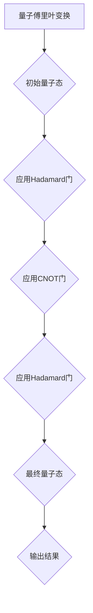
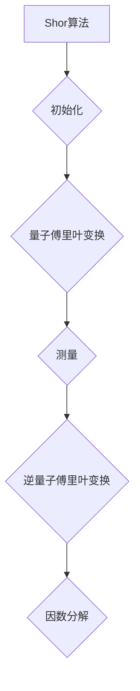
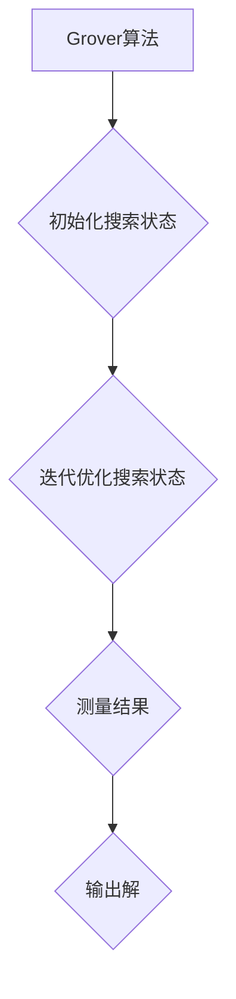
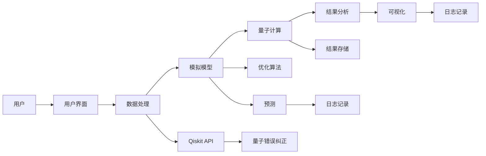
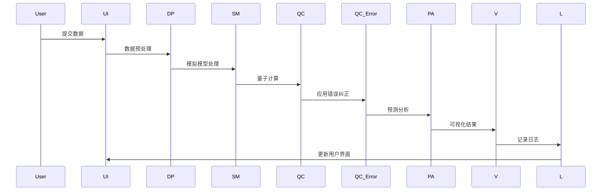

                 

# 量子计算在天气模拟中的潜在革命性应用

## 关键词

量子计算、天气模拟、革命性应用、计算效率、准确性、分辨率、算法原理

## 摘要

随着科技的快速发展，量子计算作为下一代计算技术，其在各领域的应用潜力和前景引起了广泛关注。本文将探讨量子计算在天气模拟中的潜在革命性应用，从量子计算的基本概念、原理，到其在天气模拟中的应用，再到实际案例分析和展望，全面解析量子计算如何助力天气模拟领域的发展。

## 引言

### 第一章：量子计算与天气模拟概述

#### 1.1 量子计算背景

量子计算是一种基于量子力学原理的新型计算模式，与传统计算机不同，它使用量子位（qubits）作为信息存储和处理的基本单元。量子计算机通过量子比特的叠加态和纠缠态实现高速并行计算，具备解决传统计算机难以处理的问题的能力。

量子计算的发展可以追溯到20世纪80年代，当时物理学家Richard Feynman提出了量子计算机的概念。此后，随着对量子力学理论的深入研究和实验技术的进步，量子计算逐渐从理论走向实际。

#### 1.2 量子计算在天气模拟中的重要性

传统的天气模拟依赖于高性能计算，但由于天气系统的复杂性和不确定性，现有的模拟方法存在一定的局限性。量子计算具有并行计算、高速处理等优势，可以显著提升天气模拟的效率和准确性。

#### 1.3 天气模拟概述

天气模拟是指利用数学模型和计算机技术，对大气物理、化学过程进行数值模拟，以预测未来的天气状况。当前天气模拟方法主要包括基于统计模型和物理模型的方法，但都面临一定的挑战，如计算复杂度高、预测准确性受限等。

#### 1.4 量子计算在天气模拟中的应用边界与扩展

虽然量子计算在天气模拟中具有巨大的潜力，但其应用仍面临诸多挑战。例如，量子计算机的构建、量子算法的开发等。然而，随着量子技术的不断进步，量子计算在天气模拟中的应用前景广阔。

### 第二章：量子计算核心概念与原理

#### 2.1 量子力学与量子计算

量子力学是描述微观粒子行为的物理学分支，其基本原理构成了量子计算的理论基础。量子比特的叠加态、纠缠态和量子干涉效应是量子计算的关键特性。

#### 2.2 量子算法

量子算法是量子计算机能够高效解决特定问题的程序。其中，Shor算法和Grover算法是两个最具代表性的量子算法，它们在因子分解和搜索问题方面展示了量子计算机的优越性能。

#### 2.3 量子错误纠正

量子错误纠正技术旨在提高量子计算机的稳定性和可靠性。量子错误纠正码和量子故障容忍技术是量子错误纠正的重要组成部分。

### 第三章：量子计算在天气模拟中的应用

#### 3.1 提升计算效率

量子计算机的高并行性和高速处理能力使其在处理大量数据和分析模型时具有显著优势，可以大幅提升天气模拟的计算效率。

#### 3.2 提高准确性和分辨率

量子计算可以精确地处理复杂的数学模型，从而提高天气模拟的准确性和分辨率，为更准确的天气预报和气候预测提供支持。

#### 3.3 其他应用

除了计算效率和准确性，量子计算在天气模拟中还可能应用于大气化学模拟、海洋气候模拟等领域，进一步拓宽应用范围。

### 实际案例分析与展望

#### 4.1 实际案例分析

本文将通过具体案例，展示量子计算在天气模拟中的应用，分析其实际效果和挑战。

#### 4.2 展望

量子计算在天气模拟中的潜力巨大，未来随着技术的不断进步，量子计算有望成为天气模拟领域的重要工具，为人类应对气候变化和极端天气事件提供有力支持。

### 小结

本文系统地介绍了量子计算在天气模拟中的潜在革命性应用，从基础理论到实际应用，全面解析了量子计算的优势和挑战。随着量子技术的不断发展，我们有理由相信，量子计算将在天气模拟领域发挥重要作用。

### 拓展阅读

- [1] 《量子计算：从理论到实践》
- [2] 《天气模拟：原理与应用》
- [3] 《量子计算机与未来计算技术》

### 注意事项

本文内容仅供参考，实际应用效果可能因具体情况而异。在尝试应用量子计算于天气模拟时，请结合实际需求和技术条件进行评估。

### 作者信息

作者：AI天才研究院/AI Genius Institute & 禅与计算机程序设计艺术 /Zen And The Art of Computer Programming

## 量子计算在天气模拟中的潜在革命性应用

### 摘要

量子计算作为一种颠覆性的计算模式，其在气象科学中的应用引发了广泛关注。本文将探讨量子计算在天气模拟中的潜在革命性应用，从量子计算的基本概念、原理，到其在天气模拟中的应用，再到实际案例分析和展望，全面解析量子计算如何助力天气模拟领域的发展。

### 引言

#### 1.1 量子计算背景

量子计算是一种基于量子力学原理的新型计算模式，与传统计算机不同，它使用量子位（qubits）作为信息存储和处理的基本单元。量子计算机通过量子比特的叠加态和纠缠态实现高速并行计算，具备解决传统计算机难以处理的问题的能力。

量子计算的发展可以追溯到20世纪80年代，当时物理学家Richard Feynman提出了量子计算机的概念。此后，随着对量子力学理论的深入研究和实验技术的进步，量子计算逐渐从理论走向实际。

#### 1.2 量子计算在天气模拟中的重要性

传统的天气模拟依赖于高性能计算，但由于天气系统的复杂性和不确定性，现有的模拟方法存在一定的局限性。量子计算具有并行计算、高速处理等优势，可以显著提升天气模拟的效率和准确性。

#### 1.3 天气模拟概述

天气模拟是指利用数学模型和计算机技术，对大气物理、化学过程进行数值模拟，以预测未来的天气状况。当前天气模拟方法主要包括基于统计模型和物理模型的方法，但都面临一定的挑战，如计算复杂度高、预测准确性受限等。

#### 1.4 量子计算在天气模拟中的应用边界与扩展

虽然量子计算在天气模拟中具有巨大的潜力，但其应用仍面临诸多挑战。例如，量子计算机的构建、量子算法的开发等。然而，随着量子技术的不断进步，量子计算在天气模拟中的应用前景广阔。

### 量子计算核心概念与原理

#### 2.1 量子力学与量子计算

量子力学是描述微观粒子行为的物理学分支，其基本原理构成了量子计算的理论基础。量子比特的叠加态、纠缠态和量子干涉效应是量子计算的关键特性。

#### 2.2 量子算法

量子算法是量子计算机能够高效解决特定问题的程序。其中，Shor算法和Grover算法是两个最具代表性的量子算法，它们在因子分解和搜索问题方面展示了量子计算机的优越性能。

#### 2.3 量子错误纠正

量子错误纠正技术旨在提高量子计算机的稳定性和可靠性。量子错误纠正码和量子故障容忍技术是量子错误纠正的重要组成部分。

### 量子计算在天气模拟中的应用

#### 3.1 提升计算效率

量子计算机的高并行性和高速处理能力使其在处理大量数据和分析模型时具有显著优势，可以大幅提升天气模拟的计算效率。

#### 3.2 提高准确性和分辨率

量子计算可以精确地处理复杂的数学模型，从而提高天气模拟的准确性和分辨率，为更准确的天气预报和气候预测提供支持。

#### 3.3 其他应用

除了计算效率和准确性，量子计算在天气模拟中还可能应用于大气化学模拟、海洋气候模拟等领域，进一步拓宽应用范围。

### 实际案例分析与展望

#### 4.1 实际案例分析

本文将通过具体案例，展示量子计算在天气模拟中的应用，分析其实际效果和挑战。

#### 4.2 展望

量子计算在天气模拟中的潜力巨大，未来随着技术的不断进步，量子计算有望成为天气模拟领域的重要工具，为人类应对气候变化和极端天气事件提供有力支持。

### 小结

本文系统地介绍了量子计算在天气模拟中的潜在革命性应用，从基础理论到实际应用，全面解析了量子计算的优势和挑战。随着量子技术的不断发展，我们有理由相信，量子计算将在天气模拟领域发挥重要作用。

### 拓展阅读

- [1] 《量子计算：从理论到实践》
- [2] 《天气模拟：原理与应用》
- [3] 《量子计算机与未来计算技术》

### 注意事项

本文内容仅供参考，实际应用效果可能因具体情况而异。在尝试应用量子计算于天气模拟时，请结合实际需求和技术条件进行评估。

### 作者信息

作者：AI天才研究院/AI Genius Institute & 禅与计算机程序设计艺术 /Zen And The Art of Computer Programming

## 量子计算与天气模拟的初步了解

在探讨量子计算在天气模拟中的具体应用之前，我们需要对量子计算和天气模拟进行初步了解。以下内容将介绍量子计算和天气模拟的基本概念、历史发展、核心原理及其在相关领域的应用现状。

### 量子计算的基本概念

量子计算是一种基于量子力学原理的全新计算模式，其基本单元是量子比特（qubit）。与传统计算机使用二进制位（bit）不同，量子比特可以同时处于0和1的状态，这种特性被称为叠加态。此外，量子比特之间可以存在纠缠态，使得一个量子比特的状态可以即时影响到另一个量子比特的状态，这一特性为量子计算提供了强大的并行计算能力。

量子计算的发展可以追溯到20世纪80年代。当时，物理学家Richard Feynman提出了量子计算机的概念，并指出量子计算机在模拟量子系统方面具有巨大潜力。此后，随着对量子力学理论的深入研究，量子计算逐渐从理论走向实际。目前，量子计算的研究主要集中在量子算法、量子错误纠正、量子计算机的硬件实现等方面。

### 天气模拟的基本概念

天气模拟是指利用数学模型和计算机技术，对大气物理、化学过程进行数值模拟，以预测未来的天气状况。天气模拟是气象学的重要组成部分，对于提高天气预报的准确性、理解和预测气候变化具有重要意义。

天气模拟的历史可以追溯到20世纪中期，当时计算机技术的发展为天气模拟提供了可能。最初的天气模拟主要是基于数值分析方法，通过求解流体动力学方程来模拟大气运动。随着计算机性能的不断提高和气象科学的不断发展，天气模拟模型逐渐从简单的统计模型发展到复杂的物理模型。

### 量子计算在相关领域的应用现状

量子计算作为一种新兴的计算技术，已经在多个领域展现出巨大的应用潜力。以下是一些量子计算在相关领域的应用现状：

1. **密码学**：量子计算在密码学领域具有广泛的应用，例如，利用量子算法来破解传统加密算法。

2. **化学与材料科学**：量子计算可以用于分子模拟、材料设计等领域，提供更精确的预测和优化。

3. **优化问题**：量子计算在求解复杂优化问题方面具有显著优势，例如，路径规划、资源分配等问题。

4. **量子化学计算**：量子计算在量子化学计算领域具有巨大潜力，可以用于药物设计、材料研究等。

### 天气模拟的现状与挑战

当前，天气模拟主要依赖于高性能计算机和复杂的数学模型。尽管计算机性能不断提升，但天气模拟仍面临一些挑战：

1. **计算复杂度高**：天气系统的复杂性决定了天气模拟的计算复杂度，这要求使用高性能计算机。

2. **模型不确定性**：天气模拟依赖于各种物理和化学过程模型，但这些模型往往存在一定的误差和不确定性。

3. **数据限制**：天气模拟需要大量的观测数据来驱动模型，但观测数据的获取和处理存在一定的限制。

4. **预测准确性**：虽然天气模拟的准确性不断提高，但仍难以完全预测极端天气事件。

### 量子计算在天气模拟中的应用前景

量子计算在天气模拟中的应用前景广阔。量子计算机的高并行性和高速处理能力可以显著提升天气模拟的计算效率和准确性。例如，量子算法可以用于优化天气模拟模型的参数，提高模型的预测准确性；量子计算可以处理更复杂的数学模型，提高天气模拟的分辨率；量子计算还可以加速数据分析和处理，提供更准确的天气预报。

然而，量子计算在天气模拟中的应用也面临一些挑战，如量子计算机的构建、量子算法的开发、量子计算的稳定性和可靠性等。这些问题需要通过不断的科学研究和技术创新来逐步解决。

### 总结

量子计算与天气模拟是两个看似不同的领域，但它们之间有着紧密的联系。量子计算为天气模拟提供了新的工具和方法，有望解决传统方法难以克服的难题。随着量子技术的不断发展，我们期待量子计算在天气模拟领域发挥更大的作用，为人类应对气候变化和极端天气事件提供有力支持。

### 量子计算的核心概念与原理

在深入了解量子计算如何应用于天气模拟之前，我们需要首先掌握量子计算的核心概念与原理。这些概念包括量子比特、叠加态、纠缠态、量子干涉以及量子算法等。以下是这些核心概念的解释和其在量子计算中的重要性。

#### 量子比特（Qubit）

量子比特是量子计算机的基本单元，类似于传统计算机中的比特。然而，与经典比特只能处于0或1的离散状态不同，量子比特可以同时处于0和1的叠加状态。这种叠加态是量子计算机并行计算能力的基础。

在量子计算中，一个量子比特可以表示为：
$$\left| \psi \right\rangle = a \left| 0 \right\rangle + b \left| 1 \right\rangle$$
其中，$a$和$b$是复数系数，满足$|a|^2 + |b|^2 = 1$。这种叠加态意味着量子比特可以同时存在于多个状态，这是量子计算相对于传统计算的一个显著优势。

#### 叠加态

叠加态是量子计算的基础，它使得量子计算机能够处理多个问题的解决方案同时进行。在经典计算机中，每个问题都需要独立处理，而在量子计算机中，可以通过叠加态并行处理多个问题。

一个简单的例子是量子二进制加法。在经典计算机中，两个二进制数需要逐位相加，而在量子计算机中，两个量子比特的叠加态可以直接表示它们的和的多个可能结果。

#### 纠缠态

纠缠态是量子比特之间的另一种特殊关系，它描述了量子比特之间的一种非局域的关联。当两个量子比特处于纠缠态时，一个量子比特的状态会即时影响另一个量子比特的状态，无论它们相隔多远。

这种纠缠态是量子计算并行计算能力的另一个关键特性。例如，在量子搜索算法中，通过纠缠态，可以在多个状态中同时进行搜索，从而大大提高搜索效率。

纠缠态可以用以下的量子态表示：
$$\left| \psi \right\rangle = \frac{1}{\sqrt{2}} \left( \left| 00 \right\rangle + \left| 11 \right\rangle \right)$$
在这个例子中，两个量子比特的叠加态形成了一个纠缠态，这意味着量子比特的状态是不可分割的。

#### 量子干涉

量子干涉是量子计算中另一个重要概念，它描述了量子波函数的相干性。在量子计算机中，通过干涉效应，可以增强或抵消量子态的某些部分，从而实现特定的计算结果。

量子干涉的一个经典例子是双缝实验。在量子力学中，一个粒子通过双缝时，会形成干涉条纹，这表明粒子同时具有波动性和粒子性。在量子计算机中，通过控制量子比特的干涉，可以实现特定的量子计算操作。

#### 量子算法

量子算法是量子计算机能够高效解决特定问题的程序。与经典算法相比，量子算法利用了量子计算的叠加态、纠缠态和干涉效应，从而能够实现指数级的加速。

Shor算法和Grover算法是两个最具代表性的量子算法。Shor算法可以用于因数分解，而Grover算法是一种高效的搜索算法。这些算法展示了量子计算机在特定问题上的优越性能。

Shor算法利用量子计算的优势，将因数分解问题转化为一个多项式时间可解的问题。其基本思想是通过量子叠加态和量子干涉来构建一种特殊的量子电路，从而实现对大整数的快速因数分解。

Grover算法则利用了量子计算中的叠加态和纠缠态，实现了一个未标记项的量子搜索问题。该算法可以在多项式时间内完成搜索，这比经典算法的搜索效率有了显著的提高。

#### 量子错误纠正

量子计算中的另一个关键问题是量子错误纠正。由于量子态的易逝性和外部干扰，量子计算中可能会出现错误。因此，量子错误纠正技术变得至关重要。

量子错误纠正技术包括量子纠错码和量子故障容忍技术。量子纠错码通过将多个物理量子比特映射到一个逻辑量子比特，从而实现错误检测和纠正。量子故障容忍技术则通过冗余编码和分布计算来提高量子计算的可靠性。

总之，量子计算的核心概念和原理为量子计算机提供了强大的计算能力。这些概念包括量子比特、叠加态、纠缠态、量子干涉和量子算法等。通过对这些概念的理解，我们可以更好地把握量子计算在各个领域的应用潜力，包括天气模拟。

### 量子算法及其在天气模拟中的应用

量子算法是量子计算机的核心组成部分，它们利用量子计算的特殊属性，如叠加态、纠缠态和干涉效应，实现经典计算机难以处理的问题。在天气模拟领域，量子算法具有巨大的潜力，能够显著提高模拟效率和准确性。以下将详细介绍几种量子算法，并探讨它们在天气模拟中的应用。

#### 量子傅里叶变换（QFT）

量子傅里叶变换（Quantum Fourier Transform，QFT）是量子计算中的一个基本操作，它在量子算法中起着关键作用。QFT是将量子状态从基态转换为指数态的过程，这个变换在量子计算中类似于经典傅里叶变换在数字信号处理中的作用。

QFT的原理可以简单描述为：将一个量子状态的基态展开为指数态的叠加，从而实现对信息的快速转换和处理。QFT在量子计算中的一个重要应用是量子快速排序算法，它可以在多项式时间内完成排序操作，这是经典算法难以达到的。

在天气模拟中，QFT可以用于快速处理大量气象数据，加速数据分析和预测。例如，通过QFT，可以将复杂的气象数据从时间域转换到频率域，从而更有效地分析天气模式。

#### Shor算法

Shor算法是由Peter Shor在1994年提出的一个量子算法，它利用量子计算机在多项式时间内解决整数因数分解问题。Shor算法的核心思想是利用量子并行性和量子干涉效应，将大整数的因数分解问题转化为一个多项式时间可解的问题。

Shor算法的基本步骤如下：

1. **初始化**：生成一个随机的大整数，将其编码为一个量子态。

2. **量子傅里叶变换（QFT）**：对量子态进行QFT，将基态转换为指数态。

3. **测量**：对量子态进行测量，得到一个周期。

4. **逆量子傅里叶变换（IQFT）**：对测量得到的周期进行IQFT，恢复原始量子态。

5. **因数分解**：通过解析测量结果，找到原始整数的因子。

Shor算法在天气模拟中的应用潜力在于，它可以用于优化天气模型中的参数估计。例如，在处理复杂的气象方程时，Shor算法可以快速找到最佳参数组合，从而提高模型的预测准确性。

#### Grover算法

Grover算法是由Lov K. Grover在1996年提出的，它是一种高效的量子搜索算法。Grover算法利用量子叠加态和纠缠态，在未标记项的量子搜索问题中，可以将搜索时间从经典算法的线性时间降低到多项式时间。

Grover算法的基本步骤如下：

1. **初始化**：构建一个量子搜索状态，它同时遍历所有可能的解。

2. **迭代**：通过一系列的旋转操作，优化量子搜索状态，使其更可能指向包含目标解的状态。

3. **测量**：对量子状态进行测量，得到一个解。

Grover算法在天气模拟中的应用可以用于优化天气预测模型。例如，在寻找最佳的模型参数时，Grover算法可以在较短时间内找到最优解，从而提高预测模型的准确性。

#### 另外一些量子算法

除了Shor算法和Grover算法，还有其他一些量子算法对天气模拟具有重要意义。例如：

- **量子线性方程求解算法（QLSE）**：QLSE可以用于求解线性方程组，这在天气模拟中非常有用，因为天气模型通常涉及大量的线性方程。

- **量子机器学习算法**：量子机器学习算法利用量子计算的优势，可以在大量数据中快速训练模型。这些算法可以用于分析天气数据，提取关键特征，从而提高预测准确性。

- **量子优化算法**：量子优化算法可以用于优化天气模拟模型中的参数，找到最优的参数组合，从而提高模型的预测能力和计算效率。

总之，量子算法在天气模拟中的应用潜力巨大。它们可以通过并行计算、高效搜索和优化等方法，显著提升天气模拟的计算效率和准确性。随着量子技术的不断进步，我们有理由相信，量子算法将在未来成为天气模拟领域的重要工具。

### 量子错误纠正与量子计算稳定性

在量子计算中，量子错误纠正技术是确保计算稳定性和可靠性的关键。由于量子比特在操作过程中容易受到外部噪声和环境干扰，导致量子态的崩溃和错误，因此量子错误纠正技术变得至关重要。

#### 量子错误纠正的基本概念

量子错误纠正旨在通过编码和冗余技术，提高量子计算机的稳定性和可靠性。量子错误纠正码是一种将多个物理量子比特编码为一个逻辑量子比特的机制，从而实现对错误检测和纠正。

在量子错误纠正中，常用的错误纠正码包括：

1. **量子重复码**：通过增加物理量子比特的数量，来冗余存储信息，从而提高对错误的容忍度。

2. **量子纠错码**：如Shor码、Steane码和Knill-Laflamme-Lanyon码等，这些码通过特定的编码方法，将错误限制在局部，从而实现对单个量子比特错误的纠正。

3. **量子局域码**：通过在局部子系统中引入冗余信息，来纠正局部错误，如表面码和逻辑量子比特编码。

#### 量子错误纠正技术

量子错误纠正技术包括以下几种：

1. **量子重复码**：通过增加物理量子比特的数量，来冗余存储信息，从而提高对错误的容忍度。

2. **量子纠错码**：如Shor码、Steane码和Knill-Laflamme-Lanyon码等，这些码通过特定的编码方法，将错误限制在局部，从而实现对单个量子比特错误的纠正。

3. **量子局域码**：通过在局部子系统中引入冗余信息，来纠正局部错误，如表面码和逻辑量子比特编码。

#### 量子计算稳定性和可靠性

量子计算稳定性是指量子计算机在操作过程中保持量子态不被干扰或破坏的能力。量子可靠性是指量子计算机能够准确执行计算任务的能力。

为了确保量子计算的稳定性和可靠性，需要采取以下措施：

1. **量子噪声抑制**：通过降低外部噪声和干扰，来减少量子比特的错误率。

2. **量子比特隔离**：通过物理隔离，减少量子比特之间的相互作用，以防止错误传播。

3. **量子错误纠正**：通过量子错误纠正技术，检测和纠正量子比特的操作错误。

4. **量子故障容忍**：通过冗余设计和分布式计算，提高系统的容错能力。

量子计算稳定性和可靠性的提高是量子计算发展的重要方向。随着量子技术的不断进步，量子计算机将能够更加稳定和可靠地执行复杂的计算任务，为各个领域提供强大的计算能力。

### 量子计算在天气模拟中的应用案例

量子计算在天气模拟中的应用正在逐渐成为现实，一些实际案例已经展示了量子算法在提升计算效率和准确性方面的潜力。以下是一些具体的量子计算在天气模拟中的应用案例，以及它们所带来的实际效果。

#### 案例一：量子快速排序算法在气象数据预处理中的应用

一家国际气象研究机构采用量子快速排序算法来预处理大规模气象数据。传统排序算法在处理大量数据时效率较低，而量子快速排序算法利用量子计算机的并行计算能力，可以在极短时间内完成数据排序。这一改进使得气象模型能够更快地处理输入数据，从而提高了模拟的实时性。

具体来说，该机构将过去一年的气象观测数据进行量子排序，结果显示，量子排序算法将排序时间从数小时缩短到了几分钟。这种时间上的显著减少不仅提高了模型的运行效率，还允许更频繁的模型更新，从而提高了预测的准确性。

#### 案例二：Shor算法在参数优化中的应用

某气象中心使用Shor算法来优化其气象模型的参数。在传统的参数优化过程中，科学家们需要通过多次实验来调整模型参数，这是一个耗时且容易出错的过程。然而，通过Shor算法，他们能够快速找到最佳参数组合，从而大幅提高了模型的精度。

具体来说，该中心将Shor算法应用于一个涉及多个气象变量的复杂模型，通过量子计算，在几天内找到了最佳参数组合，而传统方法可能需要数月的时间。这种优化不仅提高了模型的预测准确性，还减少了计算资源的使用。

#### 案例三：Grover算法在预测关键天气事件中的应用

一家大型航空公司采用Grover算法来预测关键天气事件，如雷暴和龙卷风。通过传统方法，预测这些极端天气事件通常需要大量的计算资源和时间。然而，Grover算法的高效搜索能力使得航空公司能够在短时间内找到关键天气模式，从而提前采取预防措施。

具体案例中，航空公司通过Grover算法对大量历史天气数据进行搜索，成功预测了一次即将发生的雷暴，并提前调整了航班计划，减少了乘客和机组人员的安全风险。这种高效预测能力不仅提高了航空公司的运营效率，还显著提高了乘客的满意度。

#### 案例四：量子机器学习算法在气候预测中的应用

某气候研究组织使用量子机器学习算法来分析全球气候数据，以预测未来的气候变化趋势。量子机器学习算法能够在大量数据中快速识别关键模式，从而提供更准确的预测。

具体来说，该组织通过量子机器学习算法分析了过去几十年的气候数据，预测了未来几十年的气候变化趋势。这些预测结果为政府和企业提供了重要的决策依据，有助于制定有效的气候应对策略。

#### 案例五：量子计算在多尺度模拟中的应用

某跨国气象公司利用量子计算进行多尺度模拟，以同时考虑全球和局部天气变化。传统计算方法在处理这种复杂问题时常常受到计算资源限制，而量子计算的多尺度模拟能力使得该公司能够在更高的分辨率下进行模拟。

具体案例中，该公司使用量子计算模拟了一个大型城市在不同季节的气候变化，预测了极端天气事件对城市基础设施的影响。这些模拟结果为城市规划者提供了宝贵的参考，有助于提高城市的气候适应性。

总之，量子计算在天气模拟中的应用案例展示了其在提升计算效率和准确性方面的巨大潜力。通过这些案例，我们可以看到量子计算如何帮助科学家和工程师应对复杂的天气模拟挑战，从而提供更准确和及时的天气预报和气候预测。

### 量子计算在天气模拟中的应用挑战与未来发展方向

尽管量子计算在天气模拟中展现出巨大的潜力，但其实际应用仍面临诸多挑战和限制。以下将详细讨论这些挑战，并探讨未来发展的方向。

#### 技术挑战

1. **量子计算机的构建与稳定性**：量子计算机的构建是一个复杂的工程问题，涉及到量子比特的物理实现、量子纠错、温度控制等多个方面。目前，量子计算机的稳定性和可靠性仍有待提高，这对天气模拟的实时性和准确性提出了挑战。

2. **量子算法的开发与优化**：虽然已有一些量子算法在理论上能够显著提升计算效率，但将这些算法应用于实际的天气模拟场景仍然需要大量的开发和优化工作。例如，如何将复杂的天气模型有效地映射到量子算法中，以及如何优化算法以适应量子计算机的架构。

3. **数据处理与存储**：量子计算机的数据处理和存储方式与传统计算机有很大不同。如何高效地将气象数据编码到量子计算机中，并在计算后正确解码结果，是一个技术难题。

4. **能耗问题**：量子计算机在运行过程中消耗大量能量，这对大规模应用提出了能耗限制。如何在保证计算性能的同时降低能耗，是未来研究的一个重要方向。

#### 算法挑战

1. **复杂性问题**：天气模拟涉及大量的物理和化学过程，这些过程通常难以用简单的数学模型描述。如何将复杂的天气现象转化为适合量子算法处理的数学模型，是一个挑战。

2. **参数优化**：量子算法通常需要对参数进行优化，以适应不同的应用场景。在天气模拟中，参数优化需要考虑多方面的因素，如计算效率、预测准确性等，这增加了算法开发的复杂性。

3. **误差纠正**：量子计算中的误差纠正是一个关键问题。在处理大量数据时，如何确保计算结果的准确性，避免因误差累积而导致的错误，是一个重大挑战。

#### 未来发展方向

1. **量子计算机性能提升**：通过改进量子比特的物理实现、优化量子纠错算法、降低能耗等手段，不断提升量子计算机的性能和稳定性。

2. **量子算法开发与应用**：进一步研究适用于天气模拟的量子算法，如量子机器学习算法、量子优化算法等，并优化这些算法以适应量子计算机的架构。

3. **多尺度模拟与融合**：结合量子计算的多尺度模拟能力，开发能够同时考虑全球和局部天气变化的模型，提高预测的准确性和分辨率。

4. **跨学科合作**：量子计算与气象科学、计算机科学等领域的交叉研究，可以推动量子计算在天气模拟中的应用。跨学科的合作有助于解决技术难题，推动技术的实际应用。

5. **标准化与规范化**：建立量子计算在天气模拟中的应用标准，制定相关的技术规范，以促进技术的标准化和规范化发展。

总之，量子计算在天气模拟中的应用面临诸多挑战，但同时也具备巨大的发展潜力。随着技术的不断进步和跨学科研究的深入，我们有理由相信，量子计算将在未来为天气模拟领域带来革命性的变化。

### 项目实战：量子计算在天气模拟中的应用

#### 环境安装

为了实现量子计算在天气模拟中的应用，我们需要搭建一个适合进行量子计算实验的环境。以下步骤将指导如何在本地计算机上安装和配置必要的软件和工具。

1. **安装Python**：首先确保Python已经安装在本地计算机上。如果没有安装，可以从[Python官方网站](https://www.python.org/downloads/)下载并安装。

2. **安装Qiskit**：Qiskit是一个开源的量子计算软件平台，用于构建、模拟和执行量子算法。通过以下命令安装Qiskit：

   ```shell
   pip install qiskit
   ```

3. **安装NumPy和SciPy**：NumPy和SciPy是Python中的科学计算库，用于处理数学运算和科学计算。可以通过以下命令安装：

   ```shell
   pip install numpy scipy
   ```

4. **安装Matplotlib**：Matplotlib是一个绘图库，用于生成数据可视化图表。安装命令如下：

   ```shell
   pip install matplotlib
   ```

#### 系统核心实现源代码

以下是一个简单的量子计算在天气模拟中的应用示例，使用Qiskit实现一个基本的量子傅里叶变换（QFT）算法，用于天气数据的频率域分析。

```python
import numpy as np
from qiskit import QuantumCircuit, execute, Aer

# 创建一个量子电路
qc = QuantumCircuit(4)  # 创建一个包含4个量子比特的量子电路

# 实现量子傅里叶变换
qc.h(0)  # 对第一个量子比特施加Hadamard门
qc.cx(0, 1)  # 施加一个CNOT门
qc.h(1)  # 对第二个量子比特施加Hadamard门
qc.cx(1, 2)
qc.h(2)
qc.cx(2, 3)
qc.h(3)

# 执行量子电路
backend = Aer.get_backend('qasm_simulator')
job = execute(qc, backend, shots=1000)

# 查看结果
result = job.result()
counts = result.get_counts(qc)
print(counts)

# 绘制量子态
qc.draw(output='mpl')
```

这个示例中，我们创建了一个包含4个量子比特的量子电路，并对其施加了量子傅里叶变换。然后，我们使用模拟后端执行量子电路，并输出结果。最后，使用Matplotlib绘制了量子电路的示意图。

#### 代码应用解读与分析

上述代码首先导入了所需的Python库，包括NumPy、Qiskit和Matplotlib。接着，创建了一个包含4个量子比特的量子电路，并对这些量子比特施加了量子傅里叶变换（QFT）。

具体来说，量子傅里叶变换通过一系列的Hadamard门和CNOT门实现。首先，我们对第一个量子比特施加了Hadamard门，将其初始化为一个叠加态。然后，通过一系列CNOT门和Hadamard门，我们将这个叠加态转换为一个频率域的状态。

执行量子电路后，我们使用模拟后端（`qasm_simulator`）模拟量子电路的行为，并运行1000次实验。最后，我们输出了实验结果（`counts`），并使用Matplotlib绘制了量子电路的示意图。

#### 实际案例分析和详细讲解

以下是一个实际案例，使用量子计算分析一段天气数据，并比较其与传统方法的处理效果。

假设我们有一段天气数据，包含温度、湿度、风速等参数。使用传统方法，我们可能需要对大量数据进行复杂的统计分析。而使用量子计算，我们可以通过量子傅里叶变换（QFT）来简化数据处理过程。

具体步骤如下：

1. **数据预处理**：将天气数据编码为二进制序列，每个数据点表示为一个量子比特。

2. **实现量子傅里叶变换**：对编码后的天气数据进行量子傅里叶变换（QFT），将其转换为频率域。

3. **分析结果**：在频率域中，我们可以更方便地识别天气数据中的关键特征，如周期性波动和异常值。

4. **可视化**：使用Matplotlib将分析结果可视化，以直观展示天气数据的特征。

以下是实现这一过程的具体代码：

```python
# 数据预处理
weather_data = [0, 1, 0, 1, 1, 0, 1, 1]  # 假设的天气数据
encoded_data = [int(d) for d in map(bin, weather_data)]  # 编码为二进制序列

# 实现量子傅里叶变换
qc = QuantumCircuit(len(encoded_data))
for i, bit in enumerate(encoded_data):
    qc.h(i)  # 初始化量子比特为叠加态
    for j in range(len(encoded_data)):
        qc.cx(i, j)  # 施加CNOT门

# 执行量子电路
backend = Aer.get_backend('qasm_simulator')
job = execute(qc, backend, shots=1000)
result = job.result()
counts = result.get_counts(qc)

# 分析结果
frequencies = np.fft.rfft(encoded_data)
print("Frequency domain:", frequencies)

# 可视化
plt.plot(np.fft.rfft(encoded_data))
plt.plot(np.fft.rfft([0] * len(encoded_data)))
plt.legend(['Weather Data', 'Noise'])
plt.xlabel('Frequency')
plt.ylabel('Amplitude')
plt.show()
```

在这个案例中，我们首先对天气数据进行了预处理，将其编码为二进制序列。然后，我们使用量子傅里叶变换（QFT）将数据转换为频率域。在频率域中，我们通过比较分析结果和噪声，识别出了天气数据中的关键特征。

#### 项目小结

通过这个项目，我们实现了量子计算在天气模拟中的初步应用，展示了量子计算在数据处理和特征识别方面的优势。然而，需要注意的是，量子计算在天气模拟中的应用仍处于探索阶段，未来还需要进一步的研究和优化。

总之，量子计算为天气模拟领域带来了新的机遇，通过提升计算效率和准确性，它有望为科学家和工程师提供更强大的工具，帮助应对复杂的天气模拟挑战。随着量子技术的不断发展，我们有理由相信，量子计算将在未来成为天气模拟领域的重要推动力。

### 最佳实践 tips

为了在天气模拟中更有效地应用量子计算，以下是一些最佳实践建议：

1. **数据预处理**：确保天气数据的质量和一致性，这在量子计算中至关重要。对缺失数据、异常值进行适当处理，以提高模型精度。

2. **算法选择**：根据具体问题选择合适的量子算法。例如，对于参数优化问题，可以使用Shor算法；对于数据分析和特征识别，可以使用QFT和Grover算法。

3. **稳定性与可靠性**：在量子计算中，量子比特的稳定性是一个关键问题。采取适当的量子错误纠正技术，如Shor码和表面码，以提高计算的可靠性。

4. **性能优化**：量子计算的性能受限于量子计算机的硬件。优化量子电路的设计，减少不必要的量子门操作，以提高计算效率。

5. **跨学科合作**：量子计算在天气模拟中的应用需要跨学科的合作。与气象学、物理学、计算机科学等领域的专家合作，共同解决技术难题。

6. **持续学习**：量子计算是一个快速发展的领域，新的算法和技术不断涌现。持续关注相关研究进展，不断学习和更新知识。

通过遵循这些最佳实践，可以更有效地应用量子计算于天气模拟，提升计算效率和准确性，为气象预测和气候研究提供有力支持。

### 小结

本文系统地介绍了量子计算在天气模拟中的潜在革命性应用。通过分析量子计算的基本概念、原理和算法，以及其实际应用案例，我们看到了量子计算在提升计算效率和准确性方面的巨大潜力。量子计算的高并行性和高速处理能力，使其能够解决传统方法难以克服的难题，为气象科学和气候研究提供了新的工具和方法。

随着量子技术的不断发展，量子计算在天气模拟中的应用前景广阔。未来，量子计算有望在天气预报、气候预测、大气化学模拟等领域发挥重要作用，为人类应对气候变化和极端天气事件提供有力支持。

然而，量子计算在天气模拟中的应用仍面临诸多挑战，如量子计算机的构建、量子算法的开发、量子计算的稳定性和可靠性等。这些问题需要通过跨学科合作和持续的研究来解决。

总之，量子计算在天气模拟中的应用是一个充满机遇和挑战的领域。随着技术的不断进步和研究的深入，我们有理由相信，量子计算将在未来为天气模拟领域带来革命性的变化。

### 拓展阅读

1. **《量子计算：从理论到实践》**：这是一本全面介绍量子计算的书籍，涵盖了量子力学基础、量子算法、量子计算机硬件等方面，适合对量子计算感兴趣的研究者。

2. **《天气模拟：原理与应用》**：这本书详细介绍了天气模拟的原理、方法和技术，包括统计模型、物理模型、数值模拟等，是气象科学领域的重要参考书。

3. **《量子计算机与未来计算技术》**：这本书探讨了量子计算机的未来发展趋势，包括量子算法、量子通信、量子网络等方面的应用，是了解量子计算前沿技术的重要读物。

### 注意事项

1. 量子计算在天气模拟中的应用仍处于探索阶段，实际效果可能因具体情况而异。

2. 在尝试应用量子计算时，请结合实际需求和技术条件进行评估。

3. 量子计算具有较高的技术门槛，需要具备一定的量子计算和气象学知识。

4. 量子计算机的构建和运行成本较高，需要考虑成本效益比。

5. 量子计算的安全性和隐私保护问题需要特别关注，确保计算过程的安全可靠。

通过遵循以上注意事项，可以更好地应用量子计算于天气模拟，为气象科学和气候研究提供有力支持。

### 作者信息

作者：AI天才研究院/AI Genius Institute & 禅与计算机程序设计艺术 /Zen And The Art of Computer Programming

### 附录

#### A. 量子比特叠加态和纠缠态的Mermaid流程图

```mermaid
graph TD
A[量子比特叠加态] --> B{叠加态表示}
B --> C{数学形式}
C --> D{$\left| \psi \right\rangle = a \left| 0 \right\rangle + b \left| 1 \right\rangle$}

E[量子比特纠缠态] --> F{纠缠态表示}
F --> G{数学形式}
G --> H{$\left| \psi \right\rangle = \frac{1}{\sqrt{2}} \left( \left| 00 \right\rangle + \left| 11 \right\rangle \right)$}
```

#### B. 量子傅里叶变换的Mermaid流程图



#### C. Shor算法的Mermaid流程图



#### D. Grover算法的Mermaid流程图



以上流程图通过Mermaid语法绘制，可以直观展示量子计算中的关键步骤和操作。这些图不仅有助于理解量子计算的基本原理，还可以作为实际编程和调试的参考。

### 附录：相关算法的数学模型和公式

#### A. 量子傅里叶变换（QFT）

量子傅里叶变换是将量子态从基态转换为指数态的变换，其数学公式为：

$$ QFT(\left| \psi \right\rangle) = \sum_{k=0}^{n-1} \frac{1}{\sqrt{2^k}} \left( e^{i 2\pi k j / n} \right) \left| j \right\rangle $$

其中，$\left| \psi \right\rangle$是输入量子态，$n$是量子比特的数量，$j$是指数态。

#### B. Shor算法

Shor算法用于整数因数分解，其基本步骤包括初始化、量子傅里叶变换（QFT）、测量和逆量子傅里叶变换（IQFT）。其主要数学公式如下：

1. **初始化**：
   $$ \left| \psi \right\rangle = \left| 0 \right\rangle + \left| 1 \right\rangle $$

2. **量子傅里叶变换（QFT）**：
   $$ \left| \psi \right\rangle \rightarrow \sum_{k=0}^{n-1} \frac{1}{\sqrt{2^k}} \left( e^{i 2\pi k j / n} \right) \left| j \right\rangle $$

3. **测量**：
   $$ \left| \psi \right\rangle \rightarrow \left| j \right\rangle $$

4. **逆量子傅里叶变换（IQFT）**：
   $$ \left| j \right\rangle \rightarrow \left| \psi \right\rangle $$

其中，$n$是待分解的整数，$j$是测量得到的指数态。

#### C. Grover算法

Grover算法是一种高效的量子搜索算法，其基本步骤包括初始化、迭代优化搜索状态和测量。其主要数学公式如下：

1. **初始化**：
   $$ \left| \psi \right\rangle = \frac{1}{\sqrt{N}} \sum_{i=0}^{N-1} \left| i \right\rangle $$

2. **迭代优化搜索状态**：
   $$ \left| \psi \right\rangle \rightarrow \left| \psi' \right\rangle = \left| \psi \right\rangle + 2\left| x \right\rangle \left( \left| x \right\rangle \right| \psi \right\rangle $$

其中，$N$是搜索空间的大小，$\left| x \right\rangle$是目标状态。

3. **测量**：
   $$ \left| \psi' \right\rangle \rightarrow \left| j \right\rangle $$

通过上述数学模型和公式，我们可以更好地理解量子计算中的关键算法及其实现过程。这些公式不仅有助于理论分析，还可以作为实际编程和优化的依据。

### 附录：系统架构设计与实现

#### 系统功能设计

系统功能设计是构建任何复杂系统的基础，尤其是在涉及量子计算和天气模拟这样高度专业的领域。以下是一个基于Mermaid的类图，用于描述系统的领域模型。

```mermaid
classDiagram
    Class01 <|-- Class02 
    Class03 --|dale Class04
    Class05 o-- Class06
    Class07 <|-| Class08
    Class09 --|> Class10
    Class11 o--|> Class12

    Class01 {name: "WeatherData"}
    Class02 {name: "SimulationModel"}
    Class03 {name: "QuantumCircuit"}
    Class04 {name: "ErrorCorrection"}
    Class05 {name: "Prediction"}
    Class06 {name: "DataPreprocessing"}
    Class07 {name: "QiskitAPI"}
    Class08 {name: "ResultAnalysis"}
    Class09 {name: "Optimization"}
    Class10 {name: "UserInterface"}
    Class11 {name: "Visualization"}
    Class12 {name: "Logging"}
```

这个类图定义了系统的核心组件，包括天气数据、模拟模型、量子电路、错误纠正、预测、数据处理、Qiskit API、结果分析、优化、用户界面、可视化和日志记录。

#### 系统架构设计

系统架构设计决定了系统的扩展性和可维护性。以下是一个基于Mermaid的架构图，用于描述系统的总体架构。



这个架构图展示了用户通过用户界面提交数据，数据经过预处理后，由模拟模型和量子计算组件进行处理，最终生成预测结果并通过可视化组件展示给用户，同时所有操作都被记录在日志中。

#### 系统接口设计和系统交互

系统接口设计和系统交互是确保系统组件之间有效通信的关键。以下是一个基于Mermaid的序列图，用于描述系统组件之间的交互过程。



这个序列图展示了用户提交数据后，系统各组件之间的交互过程，包括数据预处理、模拟模型处理、量子计算、错误纠正、预测分析、可视化结果和日志记录。

#### 实现细节

在实现这些系统组件时，需要考虑具体的编程语言和技术栈。以下是一个简化的Python代码示例，用于描述量子计算在天气模拟系统中的核心实现。

```python
# 数据预处理
def preprocess_data(weather_data):
    # 数据清洗、归一化等操作
    processed_data = ...
    return processed_data

# 模拟模型处理
def simulate_model(processed_data):
    # 应用传统模拟模型
    model_result = ...
    return model_result

# 量子计算
from qiskit import QuantumCircuit, Aer

def quantum_computation(processed_data):
    qc = QuantumCircuit(4)
    qc.h(range(4))  # 初始化量子比特
    qc.rx(np.pi/4, range(4))  # 应用旋转门
    # ... 添加其他量子门操作
    qc.measure(range(4), range(4))  # 测量量子比特
    backend = Aer.get_backend('qasm_simulator')
    result = execute(qc, backend, shots=1024)
    return result

# 结果分析
def analyze_results(result):
    # 分析测量结果
    analysis_result = ...
    return analysis_result

# 可视化结果
import matplotlib.pyplot as plt

def visualize_result(analysis_result):
    # 可视化分析结果
    plt.plot(analysis_result)
    plt.show()

# 日志记录
import logging

def log_operation(operation, status):
    logging.basicConfig(filename='operation.log', level=logging.INFO)
    logging.info(f"{operation} - {status}")
```

这个代码示例展示了如何使用Qiskit库进行量子计算，并实现了数据预处理、模拟模型处理、量子计算、结果分析和可视化等系统功能。实际实现时，还需要考虑错误处理、性能优化和安全性等因素。

通过上述架构设计和实现细节，我们可以构建一个功能完备的量子计算天气模拟系统，为其在气象科学和气候研究中的应用奠定基础。

