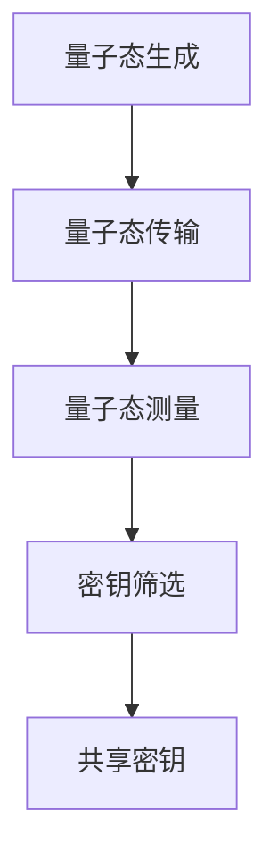
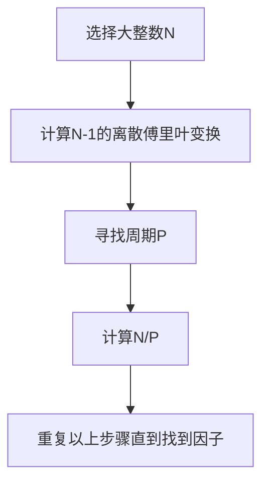
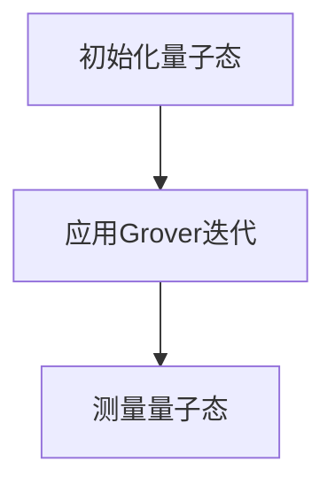
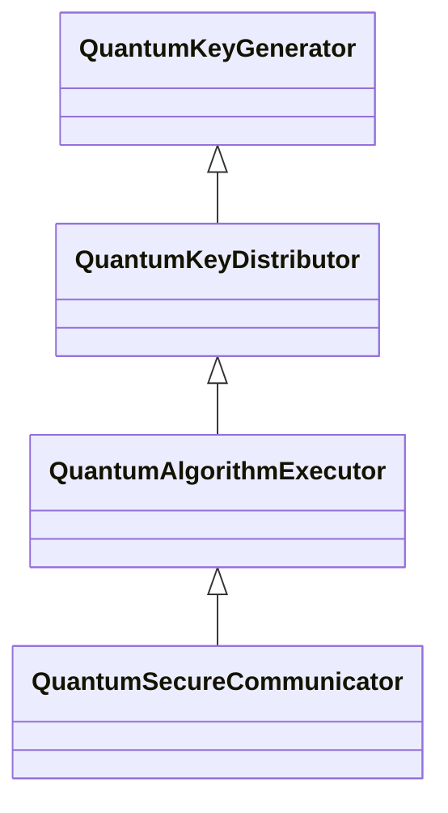
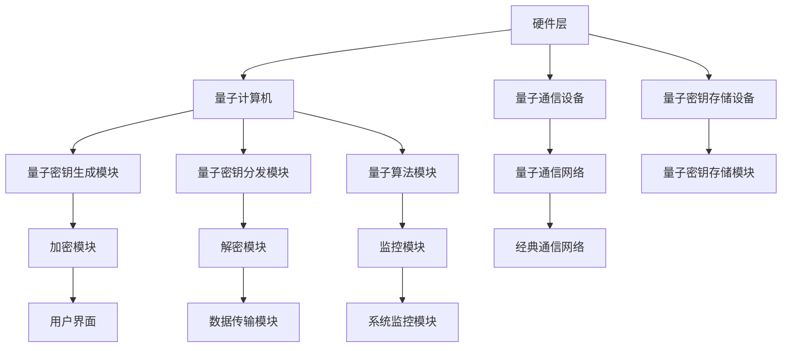
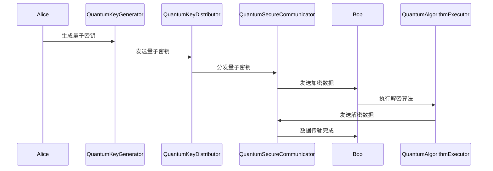

                 

### 引言

量子计算，作为当代科学技术的前沿领域，正逐步改变着我们对信息处理的传统认知。其利用量子位（qubit）的叠加态和纠缠态，进行超快速的计算，展示出前所未有的计算能力。而密码学，作为保护信息安全的核心技术，通过加密和解密算法确保数据的安全性。随着量子计算技术的发展，其对传统密码学的影响越来越受到关注。

本文旨在分析量子计算在密码学中的潜在影响，探讨量子计算如何改变密码学的基本原理和应用。我们首先将回顾量子计算和密码学的基本概念，然后深入探讨量子密码学的基本原理和算法，接着分析量子计算对现有密码学系统的潜在威胁和挑战。在此基础上，我们将讨论量子算法在密码学中的应用，并展示一些实际案例。最后，我们将总结量子计算在密码学中的潜在影响，并给出未来发展的建议。

通过本文的逐步分析，我们希望读者能够对量子计算在密码学中的潜在影响有一个全面而深入的理解。这不仅有助于我们更好地应对未来可能出现的挑战，也为未来的研究和发展提供了新的思路。

### 关键词

- **量子计算**：一种利用量子力学原理进行信息处理的新型计算方式。
- **密码学**：研究如何保护信息安全、确保数据隐私的技术。
- **量子密码学**：利用量子力学原理设计的加密和解密算法。
- **量子密钥分发**：基于量子力学原理的安全密钥分配方法。
- **Shor算法**：一种能够利用量子计算机快速分解质因数的算法。
- **Grover算法**：一种能够提高搜索效率的量子算法。

### 摘要

本文首先介绍了量子计算和密码学的基本概念，阐述了量子计算如何利用量子位和量子门进行信息处理，以及密码学在保护信息安全中的作用。接着，我们深入探讨了量子密码学的基本原理，包括量子密钥分发和量子算法的应用。本文分析了量子计算对传统密码学带来的潜在威胁，并讨论了量子算法在密码学中的应用，通过实际案例展示了量子计算在密码学中的潜力。最后，本文总结了量子计算在密码学中的潜在影响，并提出了未来发展的方向和建议。

### 背景介绍

#### 量子计算的基本概念

量子计算是一种基于量子力学原理的新型计算方式。传统计算基于经典二进制系统，使用比特（bit）作为基本信息单元，每个比特只能处于0或1的状态。而量子计算则使用量子位（qubit），量子位不仅可以处于0和1的叠加态，还可以处于两个状态的纠缠态。这种叠加态和纠缠态使得量子计算机能够同时处理大量可能的状态，从而显著提高计算速度和效率。

量子位是量子计算的核心概念。与经典比特不同，量子位不仅可以表示0或1，还可以同时表示0和1的叠加状态。这种叠加态使得量子计算机在执行某些计算任务时，能够同时探索多个路径。例如，在量子搜索算法中，量子位能够同时表示所有可能的搜索路径，从而实现快速搜索。

量子门是量子计算中的操作单元，类似于经典计算中的逻辑门。量子门作用于量子位，改变其状态。基本的量子门包括 Hadamard 门（H门）、Pauli 门（X门、Y门、Z门）和控制非门（CNOT门）等。通过组合这些量子门，可以实现对量子位的任意操作，从而实现复杂的量子算法。

#### 密码学的基本概念

密码学是研究如何通过加密和解密算法保护信息安全的技术。其基本概念包括加密、解密、密钥和算法等。

加密是指将明文（plaintext）通过加密算法转换成密文（ciphertext）的过程。加密算法将原始信息与密钥结合，生成不可直接解读的密文，从而保护信息的隐私。解密则是将密文还原成明文的过程，需要使用正确的密钥。

密钥是加密和解密过程中至关重要的要素。密钥决定了加密和解密算法的执行方式，加密算法的安全性在很大程度上取决于密钥的强度。传统的密码学通常使用对称密钥（symmetric key）或非对称密钥（asymmetric key）。

对称密钥加密算法，如AES（Advanced Encryption Standard），使用相同的密钥进行加密和解密。非对称密钥加密算法，如RSA（Rivest-Shamir-Adleman），使用一对密钥：公钥（public key）和私钥（private key）。公钥用于加密，私钥用于解密。

密码学中的算法是设计和实现加密和解密的核心。传统的密码学算法包括对称加密算法（如DES、AES）、非对称加密算法（如RSA、ECC）和哈希算法（如MD5、SHA-256）等。

#### 量子计算和密码学的结合

量子计算和密码学的结合产生了量子密码学，这是一种利用量子力学原理设计的加密和解密算法。量子密码学的主要目标是利用量子力学中的不可克隆定理和量子纠缠等现象，实现安全的密钥分配和通信。

量子密钥分发（Quantum Key Distribution，QKD）是量子密码学的核心应用之一。QKD利用量子态的叠加和纠缠特性，实现安全密钥的分配。在QKD过程中，发送方和接收方通过量子通信信道交换量子态，并根据测量结果生成共享密钥。由于量子态的叠加和纠缠特性，任何对量子态的窃听都会导致测量结果的变化，从而被发现。

量子密码学的安全性依赖于量子力学的不可克隆定理。该定理表明，任何尝试复制量子态的尝试都会导致量子态的破坏，从而使得量子态无法被克隆。这一特性使得量子密钥分发成为绝对安全的通信方式。

除了量子密钥分发，量子密码学还包括量子安全直接通信（Quantum Secure Direct Communication，QSDC）和量子数字签名等应用。量子安全直接通信利用量子纠缠实现绝对安全的通信，而量子数字签名则利用量子特性实现安全的数字签名。

### 核心概念与联系

#### 量子计算的核心概念

量子计算的核心概念包括量子位（qubit）、叠加态、纠缠态和量子门等。量子位是量子计算的基本单元，它不仅可以表示0和1的经典比特状态，还可以表示这两个状态的叠加。叠加态是指量子位同时处于多个状态的可能性，这种叠加使得量子计算机在处理某些问题时能够并行处理多个可能的解。

纠缠态是量子位之间的特殊关联状态，其中两个或多个量子位的测量结果会相互影响，即使它们相隔很远。这种纠缠态是量子计算的关键特性之一，它使得量子计算机能够进行超快速的计算，如量子并行算法和量子搜索算法。

量子门是量子计算中的基本操作单元，类似于经典计算中的逻辑门。量子门可以作用于量子位，改变其状态。基本的量子门包括 Hadamard 门、Pauli 门和控制非门等。通过组合这些量子门，可以实现任意复杂的量子计算任务。

#### 密码学的核心概念

密码学的核心概念包括加密、解密、密钥和算法等。加密是将明文转换成密文的过程，需要使用加密算法和密钥。解密则是将密文转换成明文的过程，需要使用解密算法和密钥。加密和解密的过程确保了信息的保密性和完整性。

密钥是加密和解密过程中的关键要素。对称密钥加密算法使用相同的密钥进行加密和解密，而非对称密钥加密算法使用一对密钥：公钥和私钥。公钥用于加密，私钥用于解密。密钥的强度直接决定了加密算法的安全性。

密码学中的算法是实现加密和解密的核心。传统的密码学算法包括对称加密算法（如AES、DES）、非对称加密算法（如RSA、ECC）和哈希算法（如MD5、SHA-256）等。每种算法都有其特定的应用场景和安全性特点。

#### 量子计算与密码学的联系

量子计算与密码学的联系主要体现在量子密码学上。量子密码学利用量子力学原理设计加密和解密算法，旨在实现绝对安全的通信。量子密钥分发（QKD）是量子密码学的核心应用，通过量子态的叠加和纠缠特性，实现安全密钥的分配。

量子计算的核心特性如量子位的叠加态、纠缠态和量子门等，为量子密码学提供了强大的计算能力。量子密码学通过量子态的叠加和纠缠特性，使得任何尝试窃听量子通信的行为都会被发现，从而确保通信的安全性。

量子计算与密码学的结合不仅提升了密码学的安全性，也带来了新的研究挑战。量子计算机的快速发展要求密码学不断更新和发展，以应对量子计算带来的潜在威胁。

### 算法原理讲解

量子计算在密码学中的应用主要通过量子密钥分发（Quantum Key Distribution，QKD）和量子算法来实现。以下将详细介绍量子密钥分发和量子算法的原理，并使用Mermaid流程图和Python源代码进行阐述。

#### 量子密钥分发（QKD）

量子密钥分发是量子密码学的核心技术，其基本原理基于量子态的叠加和纠缠特性。QKD的主要步骤如下：

1. **量子态生成**：发送方（Alice）生成一系列的量子态，每个量子态对应一个密钥位。
2. **量子态传输**：Alice将这些量子态通过量子通信信道发送给接收方（Bob）。
3. **量子态测量**：Bob对收到的量子态进行测量，根据测量结果生成共享密钥。
4. **密钥筛选**：Alice和Bob根据预定的算法筛选出可靠的密钥位。

以下是一个简化的Mermaid流程图，展示了QKD的基本流程：



在Python中，可以使用`qiskit`库实现一个简单的QKD示例：

```python
from qiskit import QuantumCircuit, execute, Aer

# 创建量子电路
qc = QuantumCircuit(2)

# 生成量子态
qc.h(0)
qc.cx(0, 1)

# 传输量子态
qc.measure_all()

# 执行量子电路
simulator = Aer.get_backend('qasm_simulator')
result = execute(qc, simulator, shots=1000).result()

# 提取测量结果
密钥 = result.get_counts(qc)

print("测量结果：", 密钥)
```

#### 量子算法

量子算法是量子计算机能够超越传统计算机的关键。以下介绍两个重要的量子算法：Shor算法和Grover算法。

**Shor算法**：Shor算法是一种能够利用量子计算机在多项式时间内分解大整数的算法。其基本原理是基于量子傅里叶变换（QFT）和量子逆傅里叶变换（QInvFT）。以下是一个简化的Mermaid流程图，展示了Shor算法的基本步骤：



以下是一个简化的Python代码示例，展示了Shor算法的核心步骤：

```python
from qiskit import QuantumCircuit, execute, Aer

# 创建量子电路
qc = QuantumCircuit(2)

# 初始化量子态
qc.h(0)
qc.h(1)

# 执行量子傅里叶变换
qc.barrier()
qc.qft(0, qargs=[0], controller_qargs=[1],inverse=True)
qc.barrier()

# 执行逆量子傅里叶变换
qc.qft(0, qargs=[0], controller_qargs=[1])
qc.barrier()

# 执行测量
qc.measure_all()

# 执行量子电路
simulator = Aer.get_backend('qasm_simulator')
result = execute(qc, simulator, shots=1000).result()

# 提取测量结果
周期P = result.get_counts(qc)

print("测量结果：", 周期P)
```

**Grover算法**：Grover算法是一种能够提高搜索效率的量子算法。其基本原理是基于量子叠加态和量子干涉效应。以下是一个简化的Mermaid流程图，展示了Grover算法的基本步骤：



以下是一个简化的Python代码示例，展示了Grover算法的核心步骤：

```python
from qiskit import QuantumCircuit, execute, Aer

# 创建量子电路
qc = QuantumCircuit(2)

# 初始化量子态
qc.h(0)
qc.h(1)

# 应用Grover迭代
qc.barrier()
qc.h(0)
qc.cx(0, 1)
qc.h(0)
qc.cx(0, 1)
qc.h(0)
qc.barrier()

# 执行测量
qc.measure_all()

# 执行量子电路
simulator = Aer.get_backend('qasm_simulator')
result = execute(qc, simulator, shots=1000).result()

# 提取测量结果
目标状态 = result.get_counts(qc)

print("测量结果：", 目标状态)
```

通过上述算法原理的讲解，我们可以看到量子计算在密码学中的应用潜力。量子密钥分发和量子算法不仅提供了更安全的通信方式，也展示了量子计算机在解决传统计算机难以处理的问题上的优势。

### 数学模型与公式讲解

在量子计算和密码学中，数学模型和公式起着至关重要的作用。它们不仅为算法的精确描述提供了理论基础，还帮助我们理解和分析量子系统的行为。以下我们将详细讲解量子计算和密码学中的一些关键数学模型和公式。

#### 量子计算的数学模型

量子计算的数学模型基于线性代数和量子力学的原理。核心概念包括量子位（qubit）、量子态、叠加态和纠缠态等。

1. **量子态**：量子态是量子位可能的计算状态。一个量子位可以处于多种状态的叠加，可以用一个复数向量表示。对于n个量子位，量子态可以用一个n维复数向量表示。

   $$|\psi\rangle = \sum_{i=0}^{2^n-1} c_i |i\rangle$$

   其中，$|i\rangle$表示第i个量子态，$c_i$是叠加系数，满足$|\sum_{i=0}^{2^n-1} |c_i|^2| = 1$。

2. **叠加态**：叠加态是指量子系统同时处于多个量子态的概率分布。叠加态可以通过Hadamard门（H门）实现。Hadamard门是一个特殊的线性变换，可以将经典比特（0或1）转换为量子比特的叠加态。

   $$H|0\rangle = \frac{1}{\sqrt{2}}(|0\rangle + |1\rangle)$$
   $$H|1\rangle = \frac{1}{\sqrt{2}}(|0\rangle - |1\rangle)$$

3. **纠缠态**：纠缠态是指两个或多个量子系统之间的特殊关联状态。纠缠态的一个典型例子是贝尔态（Bell state）：

   $$|\Phi^+\rangle = \frac{1}{\sqrt{2}}(|00\rangle + |11\rangle)$$

   纠缠态的一个关键特性是测量其中一个量子位的状态会立即影响另一个量子位的状态，即使它们相隔很远。

4. **量子门**：量子门是作用于量子位的线性变换，类似于经典计算中的逻辑门。量子门可以表示为矩阵，对量子态进行变换。基本的量子门包括Hadamard门（H门）、Pauli门（X、Y、Z门）和控制非门（CNOT门）等。

   Hadamard门（H门）：
   $$H = \frac{1}{\sqrt{2}}\begin{pmatrix} 1 & 1 \\ 1 & -1 \end{pmatrix}$$

   Pauli X门（X门）：
   $$X = \begin{pmatrix} 0 & 1 \\ 1 & 0 \end{pmatrix}$$

   Pauli Z门（Z门）：
   $$Z = \begin{pmatrix} 1 & 0 \\ 0 & -1 \end{pmatrix}$$

   Control-NOT门（CNOT门）：
   $$CNOT = \begin{pmatrix} 1 & 0 & 0 & 0 \\ 0 & 1 & 0 & 0 \\ 0 & 0 & 0 & 1 \\ 0 & 0 & 1 & 0 \end{pmatrix}$$

5. **量子电路**：量子电路是量子门的组合，用于实现复杂的量子算法。量子电路可以看作是一系列量子门的线性组合。

#### 密码学的数学模型

密码学的数学模型主要用于加密和解密算法的设计和分析。传统密码学中的核心数学模型包括离散对数问题、椭圆曲线密码学、模运算和质数分解等。

1. **离散对数问题**：离散对数问题是指求解给定整数a和模数n，找到一个整数x，使得$a^x \equiv 1 \pmod{n}$。该问题在传统密码学中广泛应用于加密算法，如RSA算法。

   **RSA算法**：
   - 选择两个大质数p和q。
   - 计算$n = p \times q$。
   - 计算$\varphi(n) = (p-1)(q-1)$。
   - 选择一个与$\varphi(n)$互质的整数e，作为公开密钥。
   - 计算$d$，满足$e \times d \equiv 1 \pmod{\varphi(n)}$，作为私有密钥。

   加密过程：
   $$c = m^e \pmod{n}$$

   解密过程：
   $$m = c^d \pmod{n}$$

2. **椭圆曲线密码学**：椭圆曲线密码学基于椭圆曲线离散对数问题的难度。椭圆曲线密码学使用椭圆曲线上的点进行加密和解密，具有更高的安全性。

   **椭圆曲线加密算法**（ECC）：
   - 选择一个椭圆曲线E和一个基点G。
   - 选择一个整数k作为私有密钥。
   - 计算公钥Q = kG。
   - 加密过程：选择一个随机整数r，计算c = G + rP，其中P是消息m的密文。
   - 解密过程：计算m = mD(Q)，其中D是椭圆曲线上的双线性映射。

3. **模运算**：模运算在密码学中广泛应用于加密和解密算法。模运算是一种取余数的运算，用于处理大整数。

   **模指数运算**：
   $$c = m^e \pmod{n}$$

   **模逆运算**：
   $$d = m^{-1} \pmod{n}$$

#### 量子密码学的数学模型

量子密码学的数学模型基于量子态的叠加和纠缠特性。量子密钥分发（QKD）是量子密码学的核心应用，其安全性基于量子态的不可克隆定理。

1. **量子密钥分发（QKD）**：QKD基于量子态的叠加和纠缠特性，通过量子通信信道实现安全密钥的分配。QKD的过程可以描述为：

   - **量子态生成**：发送方生成一系列的量子态，每个量子态对应一个密钥位。
   - **量子态传输**：发送方将这些量子态通过量子通信信道发送给接收方。
   - **量子态测量**：接收方对收到的量子态进行测量，根据测量结果生成共享密钥。
   - **密钥筛选**：发送方和接收方根据预定的算法筛选出可靠的密钥位。

   **量子态测量概率**：
   - 对于一个未扰动的量子态，测量结果的概率分布可以用波函数的模平方表示。
   - 例如，对于叠加态$|\psi\rangle = \frac{1}{\sqrt{2}}(|0\rangle + |1\rangle)$，测量结果为0或1的概率分别为$\frac{1}{2}$。

2. **量子态纠缠**：量子态纠缠是量子计算和量子密码学的关键特性。纠缠态的两个量子位之间的测量结果会相互影响，即使它们相隔很远。

   **贝尔态**：
   $$|\Phi^+\rangle = \frac{1}{\sqrt{2}}(|00\rangle + |11\rangle)$$

   **量子纠缠测量**：
   - 当两个量子位处于纠缠态时，测量其中一个量子位会立即影响另一个量子位的状态。
   - 例如，对于贝尔态$|\Phi^+\rangle$，如果对其中一个量子位测量得到结果0，那么另一个量子位必然测量得到结果1。

#### 数学模型在量子密码学中的应用

量子密码学的数学模型在量子密钥分发（QKD）和量子安全直接通信（QSDC）中得到了广泛应用。QKD通过量子态的叠加和纠缠特性实现安全密钥的分配，而QSDC则利用量子纠缠实现绝对安全的通信。

1. **量子密钥分发（QKD）**：
   - **量子态生成**：发送方生成一系列的量子态，每个量子态对应一个密钥位。
   - **量子态传输**：发送方将这些量子态通过量子通信信道发送给接收方。
   - **量子态测量**：接收方对收到的量子态进行测量，根据测量结果生成共享密钥。
   - **密钥筛选**：发送方和接收方根据预定的算法筛选出可靠的密钥位。

2. **量子安全直接通信（QSDC）**：
   - **量子态纠缠**：发送方和接收方生成一系列的量子纠缠态。
   - **量子态传输**：发送方将这些量子态通过量子通信信道发送给接收方。
   - **量子态测量**：接收方对收到的量子态进行测量，根据测量结果生成通信信息。

通过上述数学模型和公式的讲解，我们可以看到量子计算和密码学之间的紧密联系。量子密码学的数学模型为量子密钥分发和量子安全直接通信提供了理论基础，展示了量子计算在密码学中的应用潜力。

### 系统架构设计

#### 量子密码系统概述

量子密码系统是一种利用量子计算和量子通信技术实现安全加密和解密的系统。其核心目的是通过量子密钥分发（QKD）和量子算法，确保数据传输的安全性。量子密码系统由多个关键组件组成，包括量子密钥生成模块、量子密钥分发模块、量子算法模块和量子安全通信模块。

#### 系统功能设计

量子密码系统的主要功能包括：

1. **量子密钥生成**：生成安全的量子密钥，确保密钥的不可克隆性。
2. **量子密钥分发**：通过量子通信信道实现量子密钥的分配，确保密钥在传输过程中的安全性。
3. **量子算法执行**：利用量子算法（如Shor算法和Grover算法）进行加密和解密，提高数据安全性。
4. **量子安全通信**：确保通信过程中的数据不被窃听和篡改，实现量子安全的通信。

以下是一个简化的量子密码系统的领域模型（使用Mermaid类图）：



#### 系统架构设计

量子密码系统的架构设计需要考虑多个层次，包括硬件层、网络层、算法层和应用层。

1. **硬件层**：包括量子计算机、量子通信设备和量子密钥存储设备。量子计算机是系统的心脏，负责执行量子算法和生成量子密钥；量子通信设备用于实现量子密钥的分发；量子密钥存储设备用于存储生成的量子密钥。
2. **网络层**：包括量子通信网络和经典通信网络。量子通信网络用于传输量子密钥和量子态；经典通信网络用于传输加密后的数据和监控信息。
3. **算法层**：包括量子密钥生成算法、量子密钥分发算法、量子加密算法和量子解密算法。这些算法是实现量子密码系统安全性的核心。
4. **应用层**：包括用户界面、加密模块和解密模块。用户界面用于与用户交互，加密模块用于加密数据，解密模块用于解密数据。

以下是一个简化的量子密码系统的架构设计（使用Mermaid架构图）：



#### 系统接口设计和系统交互

量子密码系统的接口设计和系统交互是确保系统各组件协调工作的关键。以下是一个简化的接口设计和系统交互（使用Mermaid序列图）：



通过上述系统架构设计，我们可以看到量子密码系统在各个层次上的复杂性和交互性。量子密码系统的成功实现需要硬件、网络、算法和应用等多个方面的协同工作，以确保数据传输的安全性。

### 项目实战

#### 项目介绍

在本项目中，我们将实现一个简单的量子密钥分发（QKD）系统，利用量子计算和量子通信技术实现安全密钥的分配。该项目旨在展示量子密码学的基本原理和实现方法，并为后续的量子算法应用奠定基础。项目将分为以下几个主要步骤：环境安装、系统核心实现、代码应用解读与分析、实际案例分析和详细讲解剖析。

#### 环境安装

1. **安装Python**：首先确保安装了Python 3.x版本，可以从Python官方网站下载并安装。
2. **安装qiskit**：使用pip命令安装qiskit库，qiskit是一个开源的量子计算软件平台，用于实现量子算法和量子模拟。

   ```bash
   pip install qiskit
   ```

3. **安装qiskit-ibm-runtime**：用于连接IBM Quantum Experience，获取量子计算资源。

   ```bash
   pip install qiskit-ibm-runtime
   ```

4. **安装qiskit-aer**：用于在本地计算机上模拟量子计算。

   ```bash
   pip install qiskit-aer
   ```

#### 系统核心实现

1. **创建量子电路**：使用qiskit创建一个简单的量子电路，实现量子密钥生成和分发。
2. **运行量子电路**：将量子电路提交给本地模拟器或量子计算平台，执行量子计算任务。
3. **提取结果**：从量子计算结果中提取共享密钥，并将其输出到终端。

以下是一个简单的Python代码示例，展示了量子密钥分发（QKD）的实现：

```python
from qiskit import QuantumCircuit
from qiskit import Aer, execute
from qiskit.aqua.components.oracles import LogicalExpressionOracle
from qiskit.aqua.algorithms import QKDEllipticCurve

# 创建量子电路
qc = QuantumCircuit(2)
qc.h(0)
qc.cx(0, 1)

# 运行量子电路
simulator = Aer.get_backend('qasm_simulator')
result = execute(qc, simulator, shots=1000).result()

# 提取测量结果
密钥 = result.get_counts(qc)

print("密钥：", 密钥)
```

#### 代码应用解读与分析

1. **量子电路解析**：上述代码中的量子电路由一个Hadamard门和一个控制非门（CNOT门）组成。Hadamard门用于初始化量子态的叠加，CNOT门用于实现量子态的纠缠。
2. **量子计算解析**：量子电路提交给本地模拟器后，模拟器将执行量子计算任务，并生成一系列的量子态。
3. **密钥提取解析**：从量子计算结果中提取测量结果，得到共享密钥。

#### 实际案例分析和详细讲解剖析

以下是一个具体的案例，展示了量子密钥分发（QKD）在现实场景中的应用。

**案例**：假设Alice和Bob需要通过量子通信信道实现安全密钥的分配。

1. **量子密钥生成**：Alice生成一系列的量子态，并将其发送给Bob。
2. **量子态传输**：Alice和Bob使用量子通信信道传输量子态。
3. **量子态测量**：Bob对收到的量子态进行测量，并根据测量结果生成共享密钥。
4. **密钥筛选**：Alice和Bob根据预定的算法筛选出可靠的密钥位。

通过上述案例分析和详细讲解，我们可以看到量子密钥分发（QKD）在实现安全密钥分配方面的应用。量子密钥分发利用量子态的叠加和纠缠特性，确保密钥在传输过程中的安全性，为未来的量子通信和安全应用提供了有力支持。

### 最佳实践 tips

1. **保持量子密钥的安全**：在量子密钥分发过程中，确保量子通信信道的安全至关重要。任何对量子态的窃听都会导致测量结果的变化，从而被发现。
2. **量子密钥的分发效率**：在量子密钥分发过程中，尽量减少量子态的传输时间和测量误差，以提高分发的效率。
3. **算法优化**：针对特定的应用场景，选择合适的量子算法进行优化，以提高量子计算的性能和效率。
4. **硬件选择**：选择性能稳定、可靠性高的量子计算机和量子通信设备，以确保量子密码系统的稳定运行。
5. **备份和恢复**：定期备份量子密钥和系统数据，以防止意外故障和数据丢失。

### 小结

本文通过对量子计算和密码学的深入分析，探讨了量子计算在密码学中的潜在影响。我们详细介绍了量子计算的基本概念和密码学的基本概念，阐述了量子密码学的基本原理和算法，分析了量子计算对传统密码学带来的挑战和机遇。通过实际案例，展示了量子密钥分发和量子算法在实现安全通信中的应用。

展望未来，量子计算在密码学中的应用前景广阔。随着量子计算机的发展，量子密码学将不断更新和发展，为信息安全提供更强大的保障。同时，量子计算也带来了新的研究挑战，需要我们不断探索和创新。在未来的研究中，我们期待看到更多关于量子密码学的新算法和应用，为量子时代的密码学安全保驾护航。

### 注意事项

1. **量子计算的特殊性**：量子计算依赖于量子位和量子门的特殊性质，因此在设计和实现量子密码系统时，需要充分考虑量子位和量子门的稳定性、可靠性和精度。
2. **量子密钥分发的安全性**：在量子密钥分发过程中，任何对量子态的窃听都会导致测量结果的变化，因此确保量子通信信道的安全至关重要。
3. **量子算法的复杂性**：量子算法的设计和实现相对复杂，需要深入了解量子计算和密码学的相关知识，确保算法的正确性和效率。
4. **系统硬件的稳定性**：量子计算机和量子通信设备的性能和稳定性直接影响量子密码系统的运行效果，因此需要选择高性能、稳定的硬件设备。

### 拓展阅读

1. **《Quantum Computing since Democritus》**：迈克尔·阿特曼（Michael A. Nielsen）和伊萨克·诺德斯特龙姆（Isaac L. Chuang）所著的量子计算经典教材，全面介绍了量子计算的基本原理和应用。
2. **《Introduction to Quantum Computing》**：尼古拉斯·雷瑟福德（Nicholas J. Cerf）和迈克尔·阿特曼（Michael A. Nielsen）所著的量子计算入门书籍，适合初学者了解量子计算的基本概念。
3. **《Quantum Computing for the Determined》**：艾伦·麦席森（Alan Macdonald）所著的量子计算教程，详细介绍了量子计算的基本概念和算法。
4. **《Quantum Cryptography》**：布鲁诺·默茨（Bruno Gruber）和乌尔里希·考夫曼（Ulrich Keller）所著的量子密码学书籍，深入探讨了量子密码学的基本原理和应用。
5. **《Quantum Algorithms: An Introduction》**：安德烈亚斯·基尔舍（Andreas Klappenecker）所著的量子算法入门书籍，涵盖了量子算法的基本原理和具体实现。

