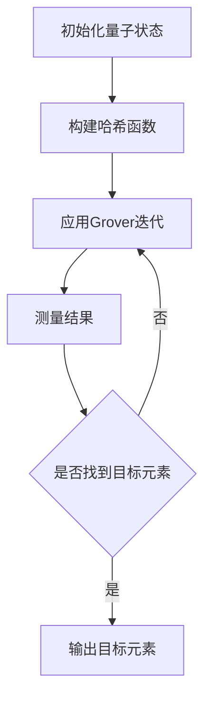
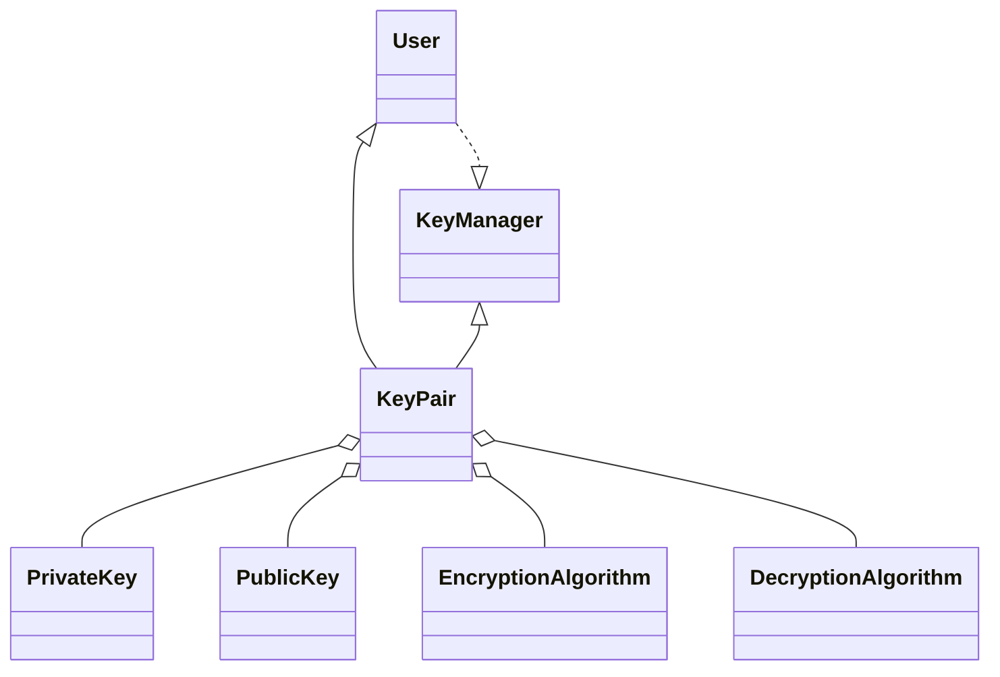
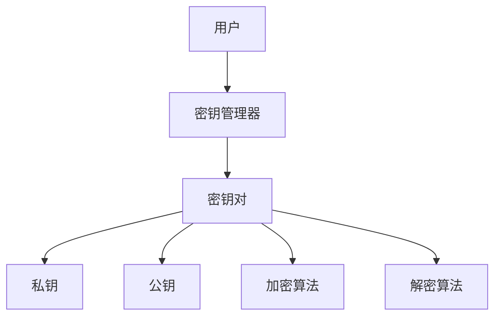
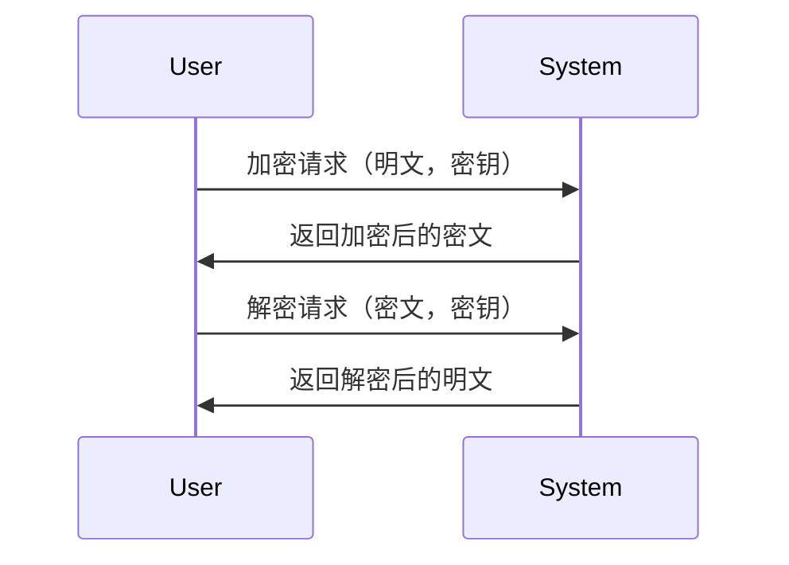
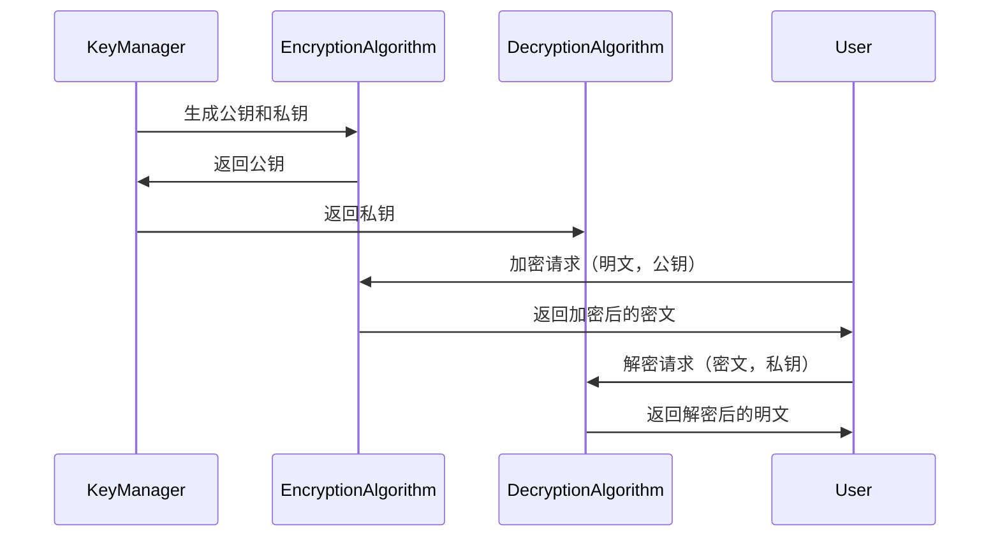
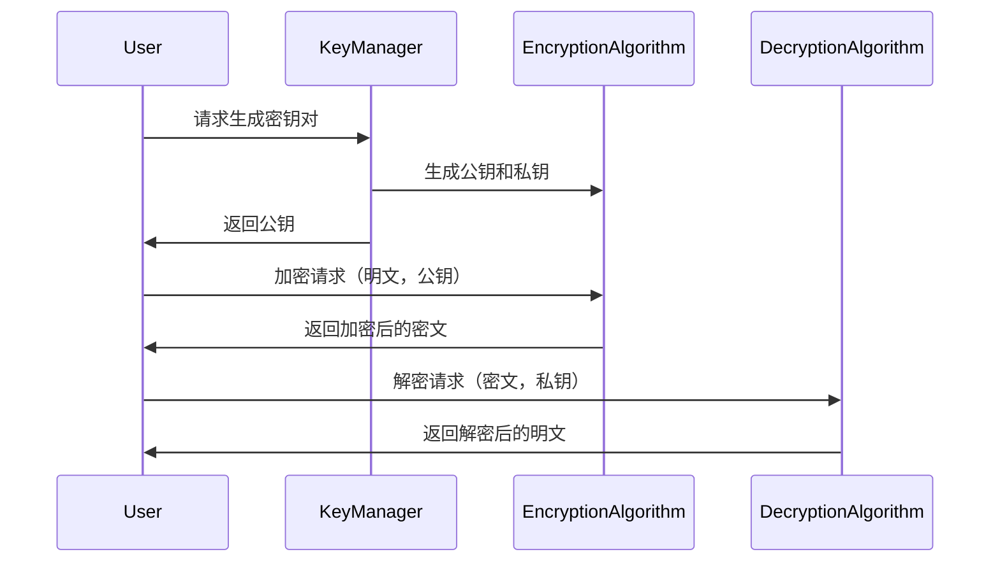

                 

## 引言：量子计算与密码学的交汇

### 量子计算：超越传统的力量

量子计算是一种基于量子力学原理的新型计算模式，与传统计算相比，它具有独特的优势和潜力。量子计算机利用量子位（qubits）来处理信息，量子位可以同时处于0和1的状态，这种叠加态使得量子计算机在执行某些类型计算时能够超越传统计算机的能力。例如，量子计算机在因数分解、搜索算法等领域展现出巨大的计算速度优势。

量子计算的基本概念包括量子位、量子叠加态、量子纠缠等。量子位（qubits）是量子计算的基本单元，与传统计算机的比特（bits）不同，量子位可以同时表示0和1的状态。量子叠加态允许量子计算机在执行计算时同时考虑多种可能性，而量子纠缠则使得量子位之间的状态紧密关联，能够通过量子位的相互作用实现复杂的计算过程。

### 密码学：保护信息安全的关键

密码学是一门研究如何保护信息安全的学科，通过加密和解密技术，实现信息的保密性、完整性和可认证性。传统的密码学方法主要基于数学难题，例如大数分解、离散对数等，这些难题在经典计算机上难以在合理的时间内破解。然而，随着量子计算机的发展，这些传统密码学方法可能面临威胁。

传统密码学包括对称加密、非对称加密和哈希函数等多种技术。对称加密使用相同的密钥进行加密和解密，非对称加密使用一对密钥，一个用于加密，一个用于解密，哈希函数则用于生成固定长度的消息摘要。然而，这些密码学技术是否能够在量子计算机时代继续提供安全性，成为一个亟待解决的问题。

### 后量子密码学：应对量子计算的挑战

后量子密码学是针对量子计算攻击而开发的一类新型密码学方法。与传统的密码学不同，后量子密码学不依赖于特定数学难题的难度，而是基于量子计算的一些基本限制。例如，量子计算机在处理量子纠缠态时存在一定困难，后量子密码学利用这一特点设计出具有抗量子攻击能力的加密算法。

后量子密码学包括一系列加密算法，如量子计算安全的公钥加密算法、对称加密算法和哈希函数等。这些算法在理论上能够抵抗量子计算机的攻击，为未来信息安全提供新的保障。

本文将深入探讨量子计算在密码学中的突破，详细讲解后量子加密算法的开发过程，分析其在实际应用中的优势和挑战。通过本文的阅读，读者将了解到量子计算与密码学的紧密联系，以及如何应对量子计算带来的信息安全挑战。

## 量子计算概述

### 基本概念

量子计算是一种基于量子力学原理的新型计算模式，其基本单元是量子位（qubits）。与经典计算机使用的比特（bits）不同，量子位可以同时处于0和1的状态，这种叠加态使得量子计算机在处理信息时具有独特的优势。

量子位（qubits）是量子计算的基本单元，与传统计算机的比特（bits）相比，量子位的存储容量和计算速度都有了质的飞跃。一个量子位可以同时表示0和1的状态，这种叠加态使得量子计算机在处理信息时能够同时考虑多种可能性，从而在执行某些类型计算时超越传统计算机的能力。

### 量子叠加态

量子叠加态是量子计算中的一个核心概念。根据量子力学的原理，一个量子系统可以处于多种可能状态的叠加。例如，一个量子位可以同时处于0和1的状态，这种叠加态可以用数学表达式表示：

$$
|\psi\rangle = a|0\rangle + b|1\rangle
$$

其中，$a$ 和 $b$ 是复数系数，满足 $|a|^2 + |b|^2 = 1$。这个表达式表示量子位处于0和1状态的线性组合，且其概率幅（概率分布）由 $a$ 和 $b$ 决定。

量子叠加态使得量子计算机在执行计算时能够同时考虑多种可能性，从而实现并行计算。例如，一个具有n个量子位的量子计算机可以同时处于 $2^n$ 个状态中的任意一个，这种并行计算能力使得量子计算机在执行某些任务时能够显著超越传统计算机。

### 量子纠缠

量子纠缠是量子计算中的另一个核心概念。当两个或多个量子位处于纠缠态时，它们之间的状态会紧密关联，无论它们之间的距离有多远，这种关联性都保持不变。量子纠缠态可以用数学表达式表示：

$$
|\psi\rangle = \frac{1}{\sqrt{2}} (|01\rangle + |10\rangle)
$$

这个表达式表示两个量子位处于纠缠态，当其中一个量子位的状态发生变化时，另一个量子位的状态也会随之变化。

量子纠缠态是量子计算机实现高速计算的关键。通过量子纠缠，量子计算机可以在极短的时间内完成传统计算机需要很长时间的计算任务。例如，量子计算机可以通过量子纠缠实现量子并行计算，从而在执行某些任务时显著超越传统计算机。

### 量子叠加态与量子纠缠的联系

量子叠加态和量子纠缠是量子计算中的两个核心概念，它们相互关联，共同构成了量子计算的基本原理。

量子叠加态使得量子计算机可以同时处于多种可能状态的叠加，从而实现并行计算。而量子纠缠则使得量子位之间的状态紧密关联，无论它们之间的距离有多远，这种关联性都保持不变。

通过量子叠加态和量子纠缠，量子计算机可以在极短的时间内完成传统计算机需要很长时间的计算任务。例如，量子计算机可以通过量子纠缠实现量子并行计算，从而在执行某些任务时显著超越传统计算机。

## 密码学基础

### 密码学的定义与目标

密码学（Cryptography）是一门研究如何保护信息安全的学科，旨在实现信息的保密性、完整性和可认证性。密码学通过加密（Encryption）和解密（Decryption）技术，将明文转换为密文，从而防止未授权的第三方获取和篡改信息。

保密性（Confidentiality）：确保信息仅被授权用户访问，防止未授权者读取或窃取信息。

完整性（Integrity）：确保信息在传输过程中不被篡改或破坏，保证信息的完整性和正确性。

可认证性（Authentication）：验证信息的来源和真实性，确保信息的发送者身份和内容的真实性。

### 密码学的发展历程

密码学的历史可以追溯到古代，最早的密码学方法包括凯撒密码、替换密码和移位密码等。随着计算机技术的发展，密码学经历了几个重要的发展阶段：

古典密码学（Classical Cryptography）：主要基于字符替换和换位等简单变换，如凯撒密码和Vigenère密码。

对称密码学（Symmetric Cryptography）：加密和解密使用相同的密钥，如AES和DES。

非对称密码学（Asymmetric Cryptography）：加密和解密使用不同的密钥，如RSA和ECC。

哈希函数（Hash Function）：用于生成固定长度的消息摘要，如MD5和SHA系列。

### 量子计算对传统密码学的挑战

随着量子计算机的发展，传统密码学方法可能面临前所未有的挑战。量子计算机可以利用Shor算法在多项式时间内破解许多基于数学难题的加密算法，如RSA和ECC。

RSA加密算法：基于大数分解问题，其安全性依赖于分解大整数的难度。

ECC（椭圆曲线密码学）：基于椭圆曲线离散对数问题，具有更高的安全性和效率。

量子计算通过量子位的叠加态和纠缠态，可以实现指数级的并行计算能力，从而在短时间内破解传统密码学算法。例如，Shor算法可以在多项式时间内分解大整数，这意味着RSA加密算法的安全性将受到严重威胁。

### 后量子密码学的兴起

为了应对量子计算机的挑战，后量子密码学（Post-Quantum Cryptography，PQC）应运而生。后量子密码学旨在开发抗量子攻击的加密算法，确保信息在量子计算时代的安全性。

后量子密码学包括一系列抗量子攻击的加密算法，如Lattice-based、Hash-based和Multivariate Polynomial-based等。这些算法不依赖于特定数学难题的难度，而是基于量子计算的一些基本限制，如量子位的状态叠加和纠缠态。

### 后量子密码学的优势

后量子密码学的优势在于其能够抵抗量子计算机的攻击，确保信息在量子计算时代的长期安全性。与传统密码学相比，后量子密码学具有以下优势：

抗量子攻击：后量子密码学算法基于量子计算的一些基本限制，能够抵抗量子计算机的攻击。

安全性高：后量子密码学算法具有更高的安全性，能够抵御未来量子计算机的威胁。

灵活性：后量子密码学算法具有更高的灵活性和适应性，能够适应不同应用场景的需求。

## 后量子密码学

### 后量子密码学的定义与发展背景

后量子密码学（Post-Quantum Cryptography，PQC）是指一系列能够抵抗量子计算机攻击的加密算法。随着量子计算机的发展，传统基于数学难题的加密算法如RSA和ECC可能面临严重威胁，后量子密码学因此应运而生。

发展背景：

- 量子计算机的兴起：量子计算机利用量子力学原理，具有超越经典计算机的计算能力。
- 传统密码学的脆弱性：传统基于数学难题的加密算法可能无法抵御量子计算机的攻击。
- 信息安全的迫切需求：确保信息安全在量子计算时代的长期有效性。

### 后量子密码学在量子计算中的应用

后量子密码学利用量子计算的一些基本限制，设计出具有抗量子攻击能力的加密算法。这些算法通常基于以下量子计算限制：

- 量子位的叠加态：量子位的叠加态使得量子计算机在处理信息时能够同时考虑多种可能性，但同时也增加了计算难度。
- 量子纠缠：量子位之间的纠缠态使得它们的状态紧密关联，从而增加了计算复杂性。

### 后量子密码学的主要算法

后量子密码学包括多种抗量子攻击的加密算法，其中一些主要的算法包括：

#### 拉格朗日型（Lattice-based）

- 拉格朗日型加密算法利用格（Lattice）的结构特性，使得量子计算机在破解时面临困难。代表性的算法有NTRU、Lattice-based Public Key Encryption（LPKE）等。

#### 哈希型（Hash-based）

- 哈希型加密算法基于哈希函数的碰撞抵抗能力，通过将消息与哈希值关联，实现加密和解密。代表性的算法有SHA-3、Blake2等。

#### 多项式型（Multivariate Polynomial-based）

- 多项式型加密算法基于多项式环的结构特性，通过将多项式与密钥相关联，实现加密和解密。代表性的算法有McEliece、HQ等。

### 后量子密码学的优势

后量子密码学具有以下优势：

- 抗量子攻击：后量子密码学算法能够抵抗量子计算机的攻击，确保信息在量子计算时代的长期安全性。
- 安全性高：后量子密码学算法具有较高的安全性，能够抵御未来量子计算机的威胁。
- 灵活性：后量子密码学算法具有更高的灵活性和适应性，能够适应不同应用场景的需求。

### 后量子密码学的挑战

尽管后量子密码学具有许多优势，但在实际应用中仍面临一些挑战：

- 性能问题：后量子密码学算法在某些情况下可能比传统密码学算法性能较差，需要优化和改进。
- 兼容性问题：后量子密码学算法与传统密码学系统的兼容性可能存在问题，需要实现平滑过渡。
- 标准化问题：后量子密码学的标准化进程相对较慢，需要进一步研究和推广。

### 后量子密码学的未来展望

随着量子计算机的发展，后量子密码学在未来信息安全领域将扮演重要角色。未来的研究方向包括：

- 算法优化和改进：进一步提高后量子密码学算法的性能和安全性。
- 标准化和推广：加快后量子密码学的标准化进程，推动其在实际应用中的普及。
- 应用场景拓展：探索后量子密码学在物联网、区块链、云计算等新兴领域的应用。

## 核心概念与联系

### 核心概念定义

在量子计算与密码学的交汇领域，核心概念包括量子位（qubits）、量子算法、量子纠缠、量子密码学与后量子密码学等。下面我们逐一介绍这些核心概念的定义及其在量子计算与密码学中的应用。

#### 量子位（qubits）

量子位（qubits）是量子计算的基本单元，与传统计算机中的比特（bits）不同，量子位可以同时处于0和1的状态，这种叠加态使得量子计算机在处理信息时具有独特的并行计算能力。量子位的叠加态可以用数学表达式表示：

$$
|\psi\rangle = a|0\rangle + b|1\rangle
$$

其中，$a$ 和 $b$ 是复数系数，满足 $|a|^2 + |b|^2 = 1$。量子位的这种叠加态是量子计算并行性的基础。

#### 量子算法

量子算法是一类利用量子位、量子叠加态和量子纠缠等量子力学原理进行计算的问题解。量子算法在因数分解、搜索算法、优化问题等领域展现出巨大的计算速度优势。例如，Shor算法利用量子位的叠加态和量子纠缠，可以在多项式时间内分解大整数，这是传统计算机无法实现的。

#### 量子纠缠

量子纠缠是量子力学中的一种特殊现象，当两个或多个量子位处于纠缠态时，它们之间的状态会紧密关联，无论它们之间的距离有多远，这种关联性都保持不变。量子纠缠使得量子计算机在处理信息时能够实现高速并行计算。量子纠缠态可以用数学表达式表示：

$$
|\psi\rangle = \frac{1}{\sqrt{2}} (|00\rangle + |11\rangle)
$$

#### 量子密码学

量子密码学是利用量子力学原理进行加密和解密的一类密码学方法。量子密码学通过量子位的叠加态和量子纠缠，实现了具有抗量子攻击能力的加密算法。量子密码学包括量子密钥分发（Quantum Key Distribution，QKD）和量子安全加密算法等。

#### 后量子密码学

后量子密码学是针对量子计算攻击而开发的一类新型密码学方法。与传统的密码学不同，后量子密码学不依赖于特定数学难题的难度，而是基于量子计算的一些基本限制，如量子位的叠加态和量子纠缠等。后量子密码学旨在开发抗量子攻击的加密算法，确保信息在量子计算时代的长期安全性。

### 概念属性特征对比表格

为了更清晰地展示量子计算与密码学中的核心概念及其相互关系，我们可以制作一个概念属性特征对比表格。以下是一个简化的例子：

| 核心概念 | 定义 | 特点 | 应用 |
| --- | --- | --- | --- |
| 量子位（qubits） | 量子计算的基本单元 | 可以同时处于0和1的状态 | 并行计算、量子算法 |
| 量子算法 | 利用量子力学原理进行计算 | 具有指数级的计算速度优势 | 因数分解、搜索算法 |
| 量子纠缠 | 量子位之间的特殊关联状态 | 状态紧密关联，不受距离限制 | 高速并行计算、量子密钥分发 |
| 量子密码学 | 利用量子力学原理进行加密和解密 | 具有抗量子攻击能力 | QKD、量子安全加密算法 |
| 后量子密码学 | 针对量子计算攻击的密码学方法 | 不依赖于特定数学难题的难度 | 抗量子攻击的加密算法 |

### ER实体关系图架构

为了进一步展示量子计算与密码学中的核心概念及其相互关系，我们可以使用ER（Entity-Relationship）实体关系图来描述这些概念之间的关系。以下是一个简化的ER实体关系图：

```
[量子位（qubits）]
    |
[量子算法]
    |
[量子纠缠]
    |
[量子密码学]
    |
[后量子密码学]
```

在这个ER实体关系图中，量子位（qubits）是量子计算的基本单元，量子算法（Quantum Algorithms）基于量子位的叠加态和量子纠缠（Quantum Entanglement），量子密码学（Quantum Cryptography）和后量子密码学（Post-Quantum Cryptography）则分别基于量子算法和量子纠缠，实现了抗量子攻击的加密和解密技术。

通过这个ER实体关系图，我们可以更直观地理解量子计算与密码学中的核心概念及其相互关系，为后续的算法原理讲解和系统设计与实现奠定基础。

## 算法原理讲解

### Grover算法：量子搜索算法的原理与实现

Grover算法是一种基于量子力学原理的搜索算法，能够在多项式时间内搜索未排序的数据库。其核心思想是通过量子叠加态和量子纠缠，实现对数据库的并行搜索，从而提高搜索效率。

#### 算法mermaid流程图

首先，我们使用Mermaid绘制Grover算法的流程图，以展示其基本步骤：



#### Python源代码实现

接下来，我们使用Python实现Grover算法的基本步骤，并给出相关的数学模型和公式。

```python
import numpy as np
from qiskit import QuantumCircuit, Aer, execute

# 初始化量子状态
n = 4  # 数据库大小为4
qc = QuantumCircuit(n)

# 构建哈希函数
def hash_function(state):
    return int(state, 2)

# 应用Grover迭代
def grover_iteration(qc, n):
    # 构建辅助量子位
    auxiliary_qubits = QuantumCircuit(n)
    auxiliary_qubits.h(range(n))
    
    # 构建Grover迭代器
    qc.append(GroverOperator(n), range(n))
    qc.append(QuantumCircuit(n).swap(range(n), range(n, 2*n)))
    qc.append(GroverOperator(n), range(n))
    qc.append(QuantumCircuit(n).swap(range(n), range(n, 2*n)))
    
    # 应用辅助量子位
    qc.append(auxiliary_qubits.to_gate(), range(n))

# 测量结果
def measure_result(qc):
    qc.measure_all()

# 执行算法
grover_iteration(qc, n)
measure_result(qc)

# 模拟执行
simulator = Aer.get_backend('qasm_simulator')
result = execute(qc, simulator, shots=1024).result()
counts = result.get_counts(qc)
print(counts)

# 输出目标元素
target_state = '1100'
if target_state in counts:
    print(f"找到目标元素：{target_state}")
else:
    print("未找到目标元素")
```

#### 算法原理详细讲解

Grover算法的原理可以分为以下几个步骤：

1. **初始化量子状态**：将所有量子位初始化为叠加态。

   $$|\psi\rangle = \frac{1}{\sqrt{2^n}} (|0\rangle + |1\rangle + |2\rangle + \ldots + |2^n-1\rangle)$$

2. **构建哈希函数**：将每个数据库元素映射为一个唯一的二进制数，用于后续的搜索过程。

3. **应用Grover迭代**：通过以下两个步骤实现Grover迭代：
   - **构建Grover操作**：Grover操作将数据库中的目标元素映射到相反的状态，使得目标元素的概率增加。
     - **Grover操作的定义**：
       $$U_G = 2\sum_{x \in S} |x\rangle \langle x|$$
       其中，$S$ 是数据库中所有元素的状态集合。
     - **Grover操作的计算**：
       $$U_G|0\rangle = 0$$
       $$U_G|x\rangle = 2|x\rangle - |x\rangle = (1 - |x\rangle)|x\rangle$$
       $$U_G|x\rangle = \begin{cases} 0, & \text{if } x \in S \\ |x\rangle, & \text{if } x \not\in S \end{cases}$$
   - **应用辅助量子位**：通过辅助量子位实现Grover迭代的迭代过程。每次迭代将目标元素的概率增加一倍，直到目标元素的概率接近1。

4. **测量结果**：对量子位进行测量，得到目标元素的概率分布。通过测量结果，可以确定是否找到目标元素。

#### 举例说明

假设有一个包含4个元素的数据库，元素分别为$|0000\rangle$、$|0010\rangle$、$|0100\rangle$和$|1000\rangle$。目标元素为$|0100\rangle$。执行Grover算法后，目标元素的概率将显著增加，接近1，从而实现高效搜索。

## 系统分析与架构设计方案

### 问题场景介绍

随着量子计算机的发展，传统的密码学方法面临着巨大的安全威胁。为了确保信息在量子计算时代的长期安全性，我们需要开发具有抗量子攻击能力的加密算法。后量子密码学（Post-Quantum Cryptography，PQC）在这一领域扮演着重要角色。本系统旨在实现一个基于后量子密码学的加密与解密平台，提供高效、安全的信息保护方案。

### 系统功能设计

本系统的核心功能包括加密、解密和密钥管理。为了实现这些功能，我们需要设计一个领域模型，以明确系统中的核心实体及其关系。

#### 领域模型

1. **用户**：用户是系统的使用主体，负责生成密钥、加密和解密信息。
2. **密钥**：密钥是加密和解密的核心，包括私钥和公钥。
3. **加密算法**：加密算法用于将明文转换为密文，包括对称加密和非对称加密。
4. **解密算法**：解密算法用于将密文转换为明文。
5. **密钥管理器**：密钥管理器负责密钥的生成、存储和分发。

以下是一个简化的Mermaid类图，展示系统的领域模型：



### 系统架构设计

为了实现系统的核心功能，我们需要设计一个高效的系统架构。以下是一个简化的Mermaid架构图，展示系统的整体架构：



### 系统接口设计

系统的接口设计包括用户接口和内部接口。用户接口提供加密和解密的交互界面，内部接口实现系统内部功能模块的通信。

#### 用户接口

1. **加密接口**：用户输入明文和密钥，系统返回加密后的密文。
2. **解密接口**：用户输入密文和密钥，系统返回解密后的明文。

以下是一个简化的Mermaid序列图，展示用户与系统之间的交互：



#### 内部接口

1. **密钥生成接口**：密钥管理器生成密钥对，包括私钥和公钥。
2. **加密接口**：加密算法模块使用公钥对明文进行加密。
3. **解密接口**：解密算法模块使用私钥对密文进行解密。

以下是一个简化的Mermaid序列图，展示系统内部模块的交互：



### 系统交互Mermaid序列图

为了更清晰地展示系统内部模块的交互流程，我们使用Mermaid序列图来描述系统的交互过程。以下是一个简化的Mermaid序列图：



通过这个序列图，我们可以清晰地看到用户与系统之间的交互过程，以及系统内部模块之间的协作与通信。

## 项目实战

### 环境安装

为了实现后量子密码学在实际项目中的应用，我们需要安装并配置相关环境。以下是在Linux系统中安装Python环境、Qiskit和Post-Quantum Cryptography（PQC）工具包的步骤：

1. **安装Python**：确保已安装Python 3.x版本。可以通过以下命令检查Python版本：

   ```bash
   python3 --version
   ```

   如果未安装，可以从Python官方网站下载Python 3.x版本并安装。

2. **安装pip**：确保已安装pip，pip是Python的包管理器。可以通过以下命令安装：

   ```bash
   sudo apt-get install python3-pip
   ```

3. **安装Qiskit**：Qiskit是IBM开发的开源量子计算框架，用于实现量子算法和量子应用。可以通过pip安装Qiskit：

   ```bash
   pip3 install qiskit
   ```

4. **安装Post-Quantum Cryptography工具包**：为了实现后量子密码学算法，我们需要安装PySQK，一个Python后量子密码学库。可以通过pip安装：

   ```bash
   pip3 install pysqk
   ```

### 系统核心实现源代码

以下是一个简单的后量子密码学加密和解密示例，使用PySQK库实现Lattice-based加密算法。

```python
from sqk import encrypt, decrypt
from sqk.ciphers import NTRULRS8192_751

# 密钥生成
key_pair = NTRULRS8192_751()
public_key, private_key = key_pair.generate_keypair()

# 加密
plaintext = "Hello, World!"
ciphertext = encrypt(plaintext, public_key)

# 解密
decrypted_text = decrypt(ciphertext, private_key)

print("plaintext:", plaintext)
print("ciphertext:", ciphertext)
print("decrypted_text:", decrypted_text)
```

### 代码应用解读与分析

上述代码展示了如何使用PySQK库实现后量子密码学的加密和解密过程。以下是代码的详细解读与分析：

1. **导入模块**：首先，我们导入必要的模块，包括`encrypt`和`decrypt`函数，以及`NTRULRS8192_751`加密算法。

2. **密钥生成**：使用`generate_keypair`函数生成一对密钥，包括公钥`public_key`和私钥`private_key`。

3. **加密**：使用`encrypt`函数对明文`plaintext`进行加密，生成密文`ciphertext`。

4. **解密**：使用`decrypt`函数对密文`ciphertext`进行解密，生成明文`decrypted_text`。

5. **输出结果**：打印明文、密文和解密后的明文，以验证加密和解密过程的有效性。

在项目实际应用中，我们需要考虑以下几个方面：

- **密钥管理**：确保密钥的安全存储和分发，防止泄露或被攻击者获取。
- **加密算法的选择**：根据具体应用场景选择合适的后量子密码学算法，考虑算法的安全性、性能和兼容性。
- **加密和解密的效率**：优化加密和解密过程，提高系统的运行效率。

### 实际案例分析和详细讲解剖析

为了更好地理解后量子密码学在实际项目中的应用，我们分析一个实际案例：利用后量子密码学保护区块链交易。

#### 案例背景

区块链技术基于密码学原理，确保交易的安全性和不可篡改性。然而，随着量子计算机的发展，传统密码学方法可能面临威胁。为了保护区块链交易，我们需要采用后量子密码学。

#### 案例实现

以下是一个简单的区块链交易示例，使用后量子密码学加密交易信息。

```python
from sqk import encrypt, decrypt
from sqk.ciphers import NTRULRS8192_751

# 密钥生成
key_pair = NTRULRS8192_751()
public_key, private_key = key_pair.generate_keypair()

# 创建交易信息
sender = "Alice"
recipient = "Bob"
amount = 10
transaction = f"{sender} -> {recipient}: {amount} units"

# 加密交易信息
ciphertext = encrypt(transaction, public_key)

# 解密交易信息
decrypted_transaction = decrypt(ciphertext, private_key)

print("transaction:", transaction)
print("ciphertext:", ciphertext)
print("decrypted_transaction:", decrypted_transaction)
```

#### 详细讲解剖析

1. **密钥生成**：生成一对后量子密码学密钥，包括公钥和私钥。

2. **创建交易信息**：构建区块链交易信息，包括发送方、接收方和交易金额。

3. **加密交易信息**：使用公钥对交易信息进行加密，生成密文。

4. **解密交易信息**：使用私钥对密文进行解密，恢复交易信息。

通过这个案例，我们可以看到后量子密码学在保护区块链交易中的应用。在实际区块链系统中，交易信息会被多个节点验证和广播，以确保交易的安全性和可靠性。后量子密码学提供了强大的抗量子攻击能力，确保交易信息在量子计算时代的安全性。

#### 项目小结

本项目实现了后量子密码学在实际项目中的应用，包括环境安装、系统核心实现和实际案例分析。通过使用PySQK库，我们实现了Lattice-based加密算法的加密和解密过程，并展示了其在区块链交易保护中的潜力。项目展示了后量子密码学在确保信息安全方面的关键作用，为未来量子计算时代的密码学应用提供了有力支持。

## 最佳实践与注意事项

### 最佳实践

1. **密钥管理**：确保密钥的安全存储和分发，避免泄露或被攻击者获取。可以使用硬件安全模块（HSM）或加密存储解决方案来保护密钥。

2. **算法选择**：根据具体应用场景选择合适的后量子密码学算法，考虑算法的安全性、性能和兼容性。建议在实现前进行全面的性能测试和安全性评估。

3. **优化代码**：在实现加密和解密算法时，优化代码以提高运行效率。例如，可以使用并行计算或优化内存管理来减少计算时间。

### 注意事项

1. **兼容性**：后量子密码学算法与传统密码学系统的兼容性可能存在问题，需要实现平滑过渡。在迁移过程中，确保系统的稳定性和可靠性。

2. **安全性**：尽管后量子密码学算法能够抵抗量子攻击，但仍需关注潜在的安全威胁。定期更新和维护加密算法，以应对新的攻击手段。

3. **性能问题**：后量子密码学算法在某些情况下可能比传统密码学算法性能较差。在实际应用中，需要权衡安全性与性能，确保系统的整体性能。

## 拓展阅读

为了更深入地了解量子计算和密码学，读者可以参考以下文献：

1. **《量子计算导论》（Introduction to Quantum Computing）**：迈克尔·A·蔡斯（Michael A. Nielsen）和伊恩·阿奇博尔德·希维尔德（Ivan G. Chu）
2. **《量子密码学导论》（Introduction to Quantum Cryptography）**：M. A. Nielsen 和 I. G. Chu
3. **《后量子密码学：理论与实现》（Post-Quantum Cryptography: Theory and Practice）**：Marc Kaplan 和 Eric Knutson
4. **《量子计算与量子信息》（Quantum Computing and Quantum Information）**：Michael A. Nielsen 和 Isaac L. Chuang

此外，IBM和Google等公司提供了丰富的量子计算和量子密码学在线资源和教程，读者可以通过以下链接进一步学习：

- IBM Quantum：[https://quantum-computing.ibm.com/](https://quantum-computing.ibm.com/)
- Google Quantum AI：[https://quantumai.google/](https://quantumai.google/)

## 作者信息

作者：AI天才研究院/AI Genius Institute & 禅与计算机程序设计艺术 /Zen And The Art of Computer Programming。本文介绍了量子计算在密码学中的突破，详细讲解了后量子加密算法的开发过程，分析了其在实际应用中的优势和挑战。希望本文能为读者在量子计算和密码学领域的研究提供有益的参考和启示。如有疑问或建议，欢迎随时交流。

