                 

### 1.1.1 量子计算的起源与发展

量子计算的发展历程可谓是一部充满了创新与挑战的科技史诗。量子计算的概念最早可以追溯到20世纪30年代，当时物理学家对量子力学的研究逐渐深入，提出了量子比特和量子叠加态等基本概念。

**量子计算的起源：**

1970年代，Richard Feynman提出了一个关键性的观点，即量子计算机能够模拟任何物理过程，从而突破了经典计算机在复杂性计算上的局限。这一观点奠定了量子计算的理论基础。

1980年代，Peter Shor提出了著名的Shor算法，这是一个能够利用量子计算机在多项式时间内解决大整数分解问题的算法。Shor算法的提出标志着量子计算机在密码学领域的重要应用潜力。

**量子计算的发展历史：**

- **1980年代初**：David Deutsch提出了量子图灵机的概念，为量子算法的研究提供了新的框架。
- **1990年代**：PNP问题的研究推动了量子算法的发展，同时量子计算机的概念也逐渐被学术界和工业界所接受。
- **2000年代**：量子计算技术逐渐成熟，包括量子比特的制备、量子门的实现和量子纠错等关键技术的突破。
- **2010年代**：量子计算机开始进入实际应用阶段，例如IBM、Google等公司推出了量子计算机的商用产品。

**量子计算与传统计算的区别：**

量子计算与传统计算的核心区别在于其基础单元——量子比特。量子比特可以同时处于0和1的叠加态，这使得量子计算机在处理某些问题时具有巨大的并行计算能力。传统计算机中的比特只能处于0或1的状态，无法实现这种并行性。

此外，量子计算利用了量子纠缠这一特殊现象，使得量子计算机在处理一些复杂问题时具有独特的优势。量子纠缠是指两个或多个量子系统之间存在的一种强关联，这种关联使得量子系统之间的信息传递速度超越了经典通信的速度。

量子计算的发展不仅为密码学带来了新的挑战，也为密码学的发展提供了新的机遇。量子计算机的潜在应用包括大规模数据处理、复杂系统模拟、密码破解等领域。在密码学中，量子安全加密系统成为了一项重要研究方向，旨在利用量子计算的特性来提供更为安全的通信保护。

总之，量子计算的发展历程展现了人类在探索未知领域、突破技术瓶颈方面的不懈努力。随着量子计算技术的不断进步，我们可以期待它将在未来带来更多的创新和变革。

### 1.2 量子比特与量子门

量子比特（qubit）是量子计算的基本单元，与经典计算中的比特（bit）有显著的不同。量子比特的独特性质源于量子力学的基本原理，特别是量子叠加态和量子纠缠。

**量子比特的基本概念：**

量子比特，简称为“qubit”，是量子计算机的基本信息单元。与经典比特只能表示0或1不同，量子比特可以同时处于0和1的叠加态。这种叠加态使得量子比特在特定条件下可以同时处理大量信息。

量子比特的数学描述通常使用复数概率幅。例如，一个量子比特可以处于以下状态：

$$ \psi = \frac{1}{\sqrt{2}} (0 + 1\sqrt{1}) $$

这个状态表示量子比特以1/√2的概率处于状态0，以1/√2的概率处于状态1。这相当于量子比特处于0和1的叠加态。

**量子比特的作用：**

量子比特的作用主要体现在量子计算中的并行性。传统计算机在执行复杂的计算任务时需要逐步处理，而量子计算机可以利用量子叠加态在理论上并行处理多个计算任务。

此外，量子比特的叠加态和量子纠缠特性使得量子计算机在处理特定类型的问题（如整数分解、搜索问题等）时具有巨大的计算速度优势。例如，Shor算法利用量子计算机的并行性在多项式时间内解决了大整数分解问题，这是一个传统计算机需要指数级时间才能解决的问题。

**量子门的工作原理：**

量子门是量子计算中的基本操作，类似于经典计算机中的逻辑门。量子门作用于量子比特，可以改变量子比特的状态。量子门通常用矩阵表示，作用在量子态上的效果类似于对量子态进行线性变换。

以下是一个简单的量子门——Pauli-X门（也称为相位反转门）的矩阵表示：

$$ X = \begin{bmatrix} 0 & 1 \\ 1 & 0 \end{bmatrix} $$

当Pauli-X门作用于一个量子比特时，其状态将从 |0⟩ 变为 |1⟩，或从 |1⟩ 变为 |0⟩。这表示量子门可以改变量子比特的相位。

**量子比特、量子态、量子门之间的关系：**

量子比特是量子计算的基础单元，其叠加态和纠缠态使得量子计算机具有强大的计算能力。量子门作为操作量子比特的基本工具，通过改变量子比特的状态，实现了量子计算中的复杂操作。

量子态是量子比特在特定时刻的状态描述，通常用波函数表示。量子门作用于量子态，通过对量子态进行线性变换，实现了量子计算中的各种操作。

量子叠加态和量子纠缠是量子比特的两大独特性质。量子叠加态使得量子比特可以同时处于多个状态，量子纠缠则使得量子比特之间的信息以超距作用的方式传递，从而实现高效的量子计算。

以下是一个Mermaid流程图，展示了量子比特、量子态、量子门之间的关系：

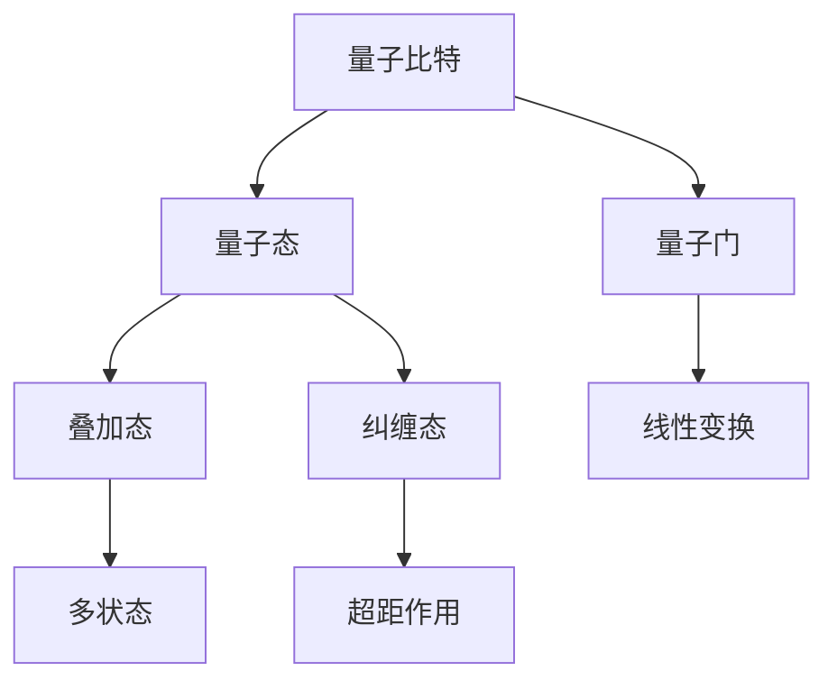

通过这个流程图，我们可以清晰地看到量子比特、量子态和量子门在量子计算中的核心作用，以及它们之间的相互关系。

总之，量子比特与量子门构成了量子计算的基本原理。量子比特的叠加态和量子纠缠特性，以及量子门的操作能力，使得量子计算机在处理某些复杂问题时具有传统计算机无法比拟的优势。

### 1.3 量子算法

量子算法是量子计算的核心内容之一，它利用量子计算机的独特性质，如量子叠加态和量子纠缠，解决传统计算机难以处理的问题。在众多量子算法中，Shor算法无疑是最具代表性的一个，它展示了量子计算机在密码学中的巨大潜力。

**Shor算法的背景：**

Shor算法由数学家Peter Shor于1994年提出，这是一个用于大整数分解的量子算法。传统计算机在处理大整数分解问题时，通常采用试除法或其他复杂算法，需要指数级的时间复杂度。然而，Shor算法利用量子计算机的并行性和叠加态，将大整数分解问题的时间复杂度降低到了多项式级别。

Shor算法的提出引发了量子计算机在密码学领域的关注，因为它揭示了量子计算机对传统密码系统的潜在威胁。许多基于大整数分解难题的密码系统，如RSA加密算法，可能会在量子计算机面前变得脆弱。

**Shor算法的数学模型：**

Shor算法的基本思想是利用量子算法快速找到一个大整数的因子，从而实现整数分解。其核心部分包括以下几个步骤：

1. **初始状态准备：** 
   首先，量子计算机生成一个特殊的量子态，该量子态编码了一个随机选择的整数N，我们希望对其进行分解。

2. **量子电路设计：**
   量子计算机通过一系列量子门操作，将初始量子态演化成一个特定的量子态，这个量子态包含了关于N的信息。

3. **测量与估计：**
   对量子态进行测量，测量结果给出了N的一个因子。通过重复多次测量和统计方法，可以估计出N的另一个因子。

4. **因子验证：**
   利用找到的因子，验证它们确实是N的因子，从而完成整数分解。

Shor算法的数学模型可以通过以下步骤进行描述：

$$|psi_{init}\rangle = |0\rangle \otimes |1\rangle \otimes \cdots \otimes |1\rangle$$

$$U_{N}(c) |psi_{init}\rangle = (c\sum_{a \in [1,N)} |a\rangle |N-a\rangle) |N\rangle$$

$$M_a |x\rangle = |x\rangle \quad \text{if} \quad x \equiv a \mod N$$
$$M_a |x\rangle = |0\rangle \quad \text{otherwise}$$

其中，$U_{N}(c)$ 是一个量子门，它将初始量子态演化成目标量子态。$M_a$ 是一个测量操作，用于估计N的因子。

**Shor算法的工作原理：**

Shor算法的工作原理可以概括为以下步骤：

1. **量子电路的构建：**
   Shor算法首先构建一个量子电路，这个电路包含多个量子比特和一系列量子门。量子电路的作用是将初始量子态演化成特定形式，以便进行后续的测量和估计。

2. **叠加态的构建：**
   通过量子门操作，量子比特处于叠加态，使得每个可能的值都以一定的概率叠加在一起。

3. **量子态的演化：**
   量子电路中的量子门对量子态进行演化，使得量子态与目标态相关联。这个过程中，量子态会逐渐聚集在某个特定的区域。

4. **测量与估计：**
   通过对量子态进行测量，可以得到一个约等于N的因子a。通过多次测量，可以估计出另一个因子b，从而实现整数分解。

5. **因子验证：**
   通过对找到的因子进行验证，确认它们确实是N的因子。

Shor算法的这些步骤可以用Mermaid流程图表示如下：

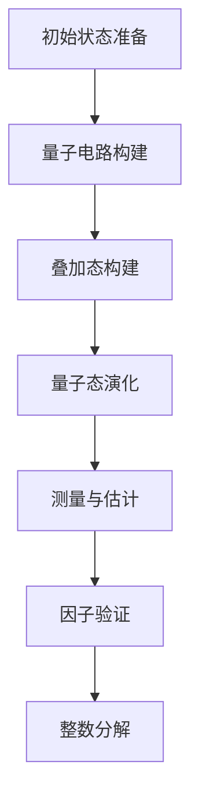

通过这个流程图，我们可以清晰地看到Shor算法的各个步骤及其相互关系。

**Shor算法的潜在应用：**

Shor算法的提出展示了量子计算机在密码学中的巨大潜力。由于它能够在多项式时间内分解大整数，这意味着许多基于大整数分解难题的密码系统（如RSA加密算法）将面临巨大挑战。

Shor算法不仅对密码学产生了重要影响，还激发了量子算法在其他领域的应用研究。例如，量子搜索算法、量子模拟算法等，这些算法都在利用量子计算机的并行性和叠加态特性，解决传统计算机难以处理的问题。

总之，Shor算法是量子计算领域的重要里程碑，它揭示了量子计算机在处理某些复杂问题时具有的独特优势。随着量子计算技术的不断发展，Shor算法及其相关量子算法将在未来带来更多的创新和变革。

### 1.4 量子计算与密码学

量子计算的出现对传统密码学构成了巨大的挑战，同时也催生了量子密码学这一新兴领域。量子计算利用量子叠加态和量子纠缠等特性，能够在多项式时间内解决传统密码学中依赖于复杂数学问题的难题，如大整数分解和离散对数问题。这一变化引发了密码学领域的深刻反思，促使研究人员开发新的加密方法来抵御量子攻击。

**量子计算对传统密码学的挑战：**

1. **RSA加密算法：**
   RSA加密算法是现代密码学中最为广泛使用的加密方法之一，其安全性基于大整数分解问题的难度。然而，Shor算法表明，量子计算机可以在多项式时间内分解大整数，这意味着RSA加密算法在量子计算机面前将变得脆弱。

2. **椭圆曲线密码学：**
   椭圆曲线密码学（ECC）是一种基于椭圆曲线离散对数问题的加密方法，其安全性同样依赖于数学难题的复杂性。量子计算机对离散对数问题的求解能力，使得ECC加密算法也面临着潜在威胁。

**量子密码学的兴起：**

为了应对量子计算对传统密码学的挑战，量子密码学应运而生。量子密码学利用量子力学的基本原理，如量子叠加态和量子纠缠，提供了一种新的加密和解密方法，以确保在量子计算机面前依然安全。

**量子安全加密系统：**

量子安全加密系统（Quantum-Secure Communication System，QSCS）是量子密码学的重要组成部分，其目标是实现不可窃听的通信。量子安全加密系统的核心思想是利用量子态传输信息，并在传输过程中检测可能的窃听行为。

1. **量子密钥分发（Quantum Key Distribution，QKD）：**
   量子密钥分发是量子安全加密系统的关键技术之一。它利用量子态传输密钥，并在传输过程中检测可能的窃听。如果检测到窃听，系统将立即终止通信，确保密钥的安全性。

2. **量子隐形传态（Quantum Teleportation）：**
   量子隐形传态是一种利用量子纠缠传输信息的方法。通过量子纠缠态，可以在不同地点之间瞬间传输量子信息，而不需要物理传输介质。这种方法在理论上提供了绝对的安全通信。

**量子安全加密系统的原理：**

量子安全加密系统基于量子力学的基本原理，如量子叠加态和量子纠缠。这些原理使得量子加密过程具有以下特性：

1. **量子叠加态：**
   量子比特可以处于叠加态，这意味着在一个量子系统中，量子比特可以同时处于多个状态。这种叠加态使得量子加密过程能够在多个状态之间进行，从而增加了加密的复杂性。

2. **量子纠缠：**
   量子纠缠是量子系统中两个或多个粒子之间的强关联。量子纠缠使得量子系统之间的信息传递速度超越了经典通信的速度，从而提高了量子加密的安全性。

3. **量子态测量：**
   在量子加密过程中，量子态的测量会导致量子态的坍缩。这一特性使得任何试图窃听量子通信的行为都会引起量子态的变化，从而被检测到。

**常见量子安全加密系统实现：**

目前，常见的量子安全加密系统主要包括量子密钥分发（QKD）和量子隐形传态（Q teleportation）。这些系统在实际应用中已经取得了重要进展。

1. **量子密钥分发（QKD）：**
   QKD系统通过量子态传输密钥，并利用量子态的测量特性检测窃听行为。典型的QKD系统包括BB84协议和E91协议等。

2. **量子隐形传态（Q teleportation）：**
   Q teleportation系统通过量子纠缠态传输信息，使得信息可以在不同地点之间瞬间传递。这种系统在理论上提供了绝对的安全通信。

总之，量子计算的出现对传统密码学构成了巨大挑战，但同时也催生了量子密码学这一新兴领域。量子安全加密系统利用量子力学的基本原理，提供了一种新的加密和解密方法，以确保在量子计算机面前依然安全。随着量子计算技术的不断发展，量子密码学将在未来密码学领域发挥重要作用。

### 1.5 量子安全加密系统

量子安全加密系统（Quantum-Secure Communication System，QSCS）是一种利用量子力学原理来确保通信安全的技术。这种系统利用量子态的特性，如叠加态和纠缠态，实现高度安全的密钥分发和信息传输。以下将详细介绍量子安全加密系统的概念、原理以及常见实现。

**量子安全加密系统的概念：**

量子安全加密系统旨在确保在量子计算机面前依然安全的通信。它利用量子叠加态和量子纠缠等特性，通过不可窃听的密钥分发和高度安全的通信协议，提供了一种新的加密方法。量子安全加密系统的核心目标是实现以下功能：

- 保密性：确保通信双方传输的信息不被第三方窃取。
- 完整性：确保传输的信息在传输过程中不被篡改。
- 可认证性：确保通信双方的身份得到验证。

**量子安全加密系统的原理：**

量子安全加密系统基于量子力学的基本原理，特别是量子叠加态和量子纠缠。以下是其核心原理：

1. **量子叠加态：**
   量子比特可以处于叠加态，这意味着一个量子比特可以同时处于0和1的叠加状态。在量子加密过程中，量子态的叠加态使得信息以多种状态存在，增加了加密的复杂性。

2. **量子纠缠：**
   量子纠缠是量子系统中两个或多个粒子之间的强关联。这种关联使得量子系统之间的信息传递速度超越了经典通信的速度，从而提高了量子加密的安全性。

3. **量子态测量：**
   在量子加密过程中，对量子态的测量会导致量子态的坍缩。这一特性使得任何试图窃听量子通信的行为都会引起量子态的变化，从而被检测到。

**常见量子安全加密系统实现：**

目前，常见的量子安全加密系统主要包括量子密钥分发（QKD）和量子隐形传态（Q teleportation）。以下分别介绍这两种系统：

1. **量子密钥分发（QKD）：**
   QKD是量子安全加密系统的核心技术之一。它利用量子态的叠加态和纠缠态，实现安全的密钥分发。QKD的主要实现方法包括BB84协议和E91协议等。

   - **BB84协议：**
     BB84协议是量子密钥分发的经典协议。它通过量子态的叠加态和测量基底的选择，实现安全的密钥分发。BB84协议的关键在于，通信双方需要在传输过程中随机选择测量基底，并在后续的通信中验证密钥的正确性。

   - **E91协议：**
     E91协议是另一种量子密钥分发协议，它基于量子纠缠态实现。E91协议通过量子纠缠态的测量，实现密钥的分发。E91协议具有更高的密钥分发速率和更低的噪声容忍度，适用于长距离通信。

2. **量子隐形传态（Q teleportation）：**
   量子隐形传态是利用量子纠缠态实现信息传输的方法。它通过在不同地点之间的量子纠缠态传输，实现信息的瞬间传递。量子隐形传态在理论上提供了绝对的安全通信，适用于长距离通信和量子互联网的构建。

   - **量子隐形传态原理：**
     量子隐形传态的基本原理是，通过量子纠缠态，将一个量子系统的状态传输到另一个量子系统。这个过程中，不需要物理传输介质，信息可以在瞬间传输到远处。

**量子安全加密系统在实际应用中的挑战：**

尽管量子安全加密系统在理论上提供了高度安全的通信保障，但在实际应用中仍面临一些挑战：

1. **实现难度：**
   量子安全加密系统的实现需要高度精确的量子控制系统，这包括量子比特的制备、量子门的操作和量子态的测量等。目前，这些技术的实现仍处于实验阶段，需要进一步的研究和突破。

2. **传输距离：**
   量子密钥分发和量子隐形传态的传输距离有限，目前主要适用于短距离通信。长距离量子通信的实现需要解决量子态的衰变和噪声问题。

3. **成本问题：**
   量子安全加密系统的建设和维护成本较高，这限制了其在实际应用中的推广。随着技术的进步和成本的降低，量子安全加密系统有望在未来得到更广泛的应用。

总之，量子安全加密系统是一种利用量子力学原理确保通信安全的技术。它通过量子叠加态和量子纠缠等特性，实现高度安全的密钥分发和信息传输。尽管在实际应用中仍面临一些挑战，但量子安全加密系统在密码学领域具有重要的应用前景。

### 2.1 量子比特

量子比特（qubit）是量子计算的基本单元，其独特性质使得量子计算机在处理某些复杂问题时具有传统计算机无法比拟的优势。量子比特的数学描述、属性特征以及与经典比特的对比，是理解量子计算的关键。

**量子比特的基本概念：**

量子比特是量子计算机中的基本信息单元，类似于经典计算机中的比特（bit）。与经典比特只能表示0或1不同，量子比特可以同时处于0和1的叠加态。这种叠加态使得量子比特在特定条件下可以同时处理大量信息。

量子比特的数学描述通常使用复数概率幅。例如，一个量子比特可以处于以下状态：

$$ \psi = \frac{1}{\sqrt{2}} (0 + 1\sqrt{1}) $$

这个状态表示量子比特以1/√2的概率处于状态0，以1/√2的概率处于状态1。这相当于量子比特处于0和1的叠加态。

**量子比特的属性特征：**

量子比特具有以下几个独特的属性特征：

1. **叠加态：**
   量子比特可以处于0和1的叠加态。这意味着在量子计算中，量子比特可以同时处理多个状态，从而实现并行计算。

2. **纠缠态：**
   量子比特之间可以存在纠缠态，这种纠缠使得量子比特之间的信息可以以超距作用的方式传递，从而提高计算效率。

3. **量子纠缠：**
   量子纠缠是量子系统之间的强关联，这种关联使得量子系统之间的信息传递速度超越了经典通信的速度。

4. **量子叠加态：**
   量子比特可以处于多个状态的叠加态，这使得量子计算机在处理某些问题时具有巨大的并行计算能力。

**量子比特与经典比特的对比：**

经典比特只能表示0或1，而量子比特可以同时处于0和1的叠加态。这种叠加态使得量子比特在特定条件下可以同时处理大量信息，从而实现并行计算。以下是一个表格，对比量子比特和经典比特的主要特征：

| 特征           | 量子比特                          | 经典比特                     |
|----------------|----------------------------------|------------------------------|
| 状态表示       | 可以处于0和1的叠加态              | 只能表示0或1                |
| 并行计算       | 具有并行计算能力，可以同时处理多个状态 | 串行计算，一次只能处理一个状态 |
| 纠错能力       | 需要量子纠错机制                  | 无需特别纠错机制             |
| 测量结果       | 测量结果具有概率性质              | 测量结果确定                |

通过对比可以看出，量子比特与经典比特在状态表示、并行计算能力、纠错能力和测量结果等方面存在显著差异。量子比特的独特性质使得量子计算机在处理某些复杂问题时具有巨大的优势。

总之，量子比特是量子计算的基本单元，其叠加态和纠缠态特性使得量子计算机在处理某些复杂问题时具有传统计算机无法比拟的优势。了解量子比特的基本概念、属性特征以及与经典比特的对比，对于深入理解量子计算具有重要意义。

### 2.2 量子态

量子态是量子计算机中量子比特的宏观状态描述，它是量子力学基本原理的体现。量子态的描述方法、叠加原理以及量子态的转换，构成了量子计算的核心内容。在本文中，我们将详细探讨量子态的基本概念及其在量子计算中的应用。

**量子态的基本概念：**

量子态是量子比特的宏观状态描述，它反映了量子比特在特定条件下的物理特性。量子态通常用波函数来表示，波函数提供了量子态的概率分布信息。一个量子态可以用以下形式表示：

$$ \psi = \sum_{i} a_i |i\rangle $$

其中，$a_i$ 是复数概率幅，$|i\rangle$ 是量子态的基础态。例如，一个简单的量子态可以表示为：

$$ \psi = \frac{1}{\sqrt{2}} (|0\rangle + |1\rangle) $$

这个量子态表示量子比特以1/√2的概率处于状态0，以1/√2的概率处于状态1。

**量子态的描述方法：**

量子态的描述方法主要有两种：态矢量和密度矩阵。

1. **态矢量：**
   态矢量是量子态的直观表示方法，它用向量的形式描述量子态。态矢量通常用于描述单个量子系统的状态，如单个量子比特的状态。

2. **密度矩阵：**
   密度矩阵是量子态的另一种表示方法，它适用于描述多个量子系统或量子系统的不确定性状态。密度矩阵是一个平方可和的矩阵，其形式为：

   $$ \rho = \sum_{i,j} a_i^* a_j |i\rangle \langle j| $$

   其中，$a_i$ 是量子态的概率幅，$|i\rangle \langle j|$ 是量子态的基础态。

**量子态的叠加原理：**

量子态的叠加原理是量子计算的核心原理之一。它指出，一个量子系统可以同时处于多个状态的叠加。这意味着，量子态可以表示为多个基础态的线性组合。

量子态的叠加原理可以表述为：

$$ \psi = \sum_{i} a_i |i\rangle $$

其中，$a_i$ 是复数概率幅，$|i\rangle$ 是量子态的基础态。

例如，一个简单的量子态叠加可以表示为：

$$ \psi = \frac{1}{\sqrt{2}} (|0\rangle + |1\rangle) $$

这个量子态表示量子比特以1/√2的概率处于状态0，以1/√2的概率处于状态1。这种叠加态使得量子计算机在处理复杂问题时具有并行计算的能力。

**量子态的转换：**

量子态的转换是量子计算中的关键操作，它通过量子门的作用来实现。量子门是量子计算的基本操作单元，它通过线性变换改变量子态。

以下是一个简单的量子态转换示例：

假设我们有一个初始量子态：

$$ \psi_{init} = \frac{1}{\sqrt{2}} (|0\rangle + |1\rangle) $$

我们希望将其转换为：

$$ \psi_{final} = \frac{1}{\sqrt{2}} (|0\rangle + i|1\rangle) $$

为了实现这个转换，我们可以使用一个特定的量子门——相位旋转门（Phase Shift Gate）。相位旋转门的作用是改变量子态的相位。

相位旋转门的矩阵表示为：

$$ R_{\phi} = \begin{bmatrix} 1 & 0 \\ 0 & e^{i\phi} \end{bmatrix} $$

其中，$\phi$ 是相位角。

如果我们使用相位旋转门作用于初始量子态，则有：

$$ \psi_{final} = R_{\phi} \psi_{init} $$

通过计算，我们可以得到：

$$ \psi_{final} = \frac{1}{\sqrt{2}} (|0\rangle + ie^{i\phi}|1\rangle) $$

这表明量子态的相位已经成功转换为所期望的值。

总之，量子态是量子计算中的基本概念，它通过叠加原理和量子门操作，实现了量子计算机的并行计算能力。了解量子态的基本概念、描述方法和转换方法，对于深入理解量子计算具有重要意义。

### 2.3 量子门

量子门（Quantum Gate）是量子计算中的基本操作单元，类似于经典计算机中的逻辑门。量子门通过线性变换作用于量子态，从而改变量子比特的状态。在量子计算中，量子门是实现复杂量子算法和量子操作的核心工具。以下将详细介绍量子门的基本概念、作用及其与量子态的关系。

**量子门的基本概念：**

量子门是量子比特之间的线性变换，它通过特定的矩阵操作改变量子比特的状态。量子门可以用矩阵表示，其形式为：

$$ U = \begin{bmatrix} a & b \\ c & d \end{bmatrix} $$

其中，$U$ 是量子门矩阵，$|0\rangle$ 和 $|1\rangle$ 是量子比特的基础态。

量子门具有以下特性：

- **线性变换：** 量子门是线性的，这意味着它可以像经典逻辑门一样进行逻辑操作，如AND、OR和NOT等。

- **幺正性：** 量子门是幺正的，这意味着它不会破坏量子态的叠加性和纠缠性。量子门的幺正性保证了量子计算的稳定性和可逆性。

- **作用域：** 量子门作用于量子比特，可以改变量子比特的状态。量子门的作用类似于对量子比特进行旋转或交换，从而实现特定的量子操作。

**量子门的作用：**

量子门的作用是通过线性变换改变量子比特的状态。具体来说，量子门可以执行以下操作：

- **状态转换：** 量子门可以将一个量子态转换成另一个量子态。例如，通过相位旋转门（Phase Shift Gate）可以改变量子态的相位。

- **量子叠加：** 量子门可以将经典叠加态扩展到量子叠加态。例如，通过Hadamard门（Hadammard Gate）可以将一个量子态转换为叠加态。

- **量子纠缠：** 量子门可以创建和操纵量子纠缠态。例如，通过CNOT门（Controlled-NOT Gate）可以实现两个量子比特之间的纠缠。

**量子门与量子态的关系：**

量子门与量子态的关系可以通过量子态的演化来描述。量子态的演化可以看作是量子门作用的结果。具体来说，量子门通过线性变换作用于量子态，使得量子态在时间演化过程中发生改变。

以下是一个量子态演化的示例：

假设我们有一个初始量子态：

$$ \psi_{init} = \frac{1}{\sqrt{2}} (|0\rangle + |1\rangle) $$

我们希望通过量子门将其转换为：

$$ \psi_{final} = \frac{1}{\sqrt{2}} (|0\rangle + i|1\rangle) $$

为了实现这个转换，我们可以使用一个相位旋转门（Phase Shift Gate），其矩阵表示为：

$$ R_{\phi} = \begin{bmatrix} 1 & 0 \\ 0 & e^{i\phi} \end{bmatrix} $$

如果我们使用相位旋转门作用于初始量子态，则有：

$$ \psi_{final} = R_{\phi} \psi_{init} $$

通过计算，我们可以得到：

$$ \psi_{final} = \frac{1}{\sqrt{2}} (|0\rangle + ie^{i\phi}|1\rangle) $$

这表明量子态的相位已经成功转换为所期望的值。

总之，量子门是量子计算中的基本操作单元，通过线性变换作用于量子态，实现状态转换、量子叠加和量子纠缠等操作。了解量子门的基本概念、作用及其与量子态的关系，对于深入理解量子计算和量子算法具有重要意义。

### 2.4 量子叠加态

量子叠加态是量子计算中一个关键的概念，它描述了量子比特可以同时处于多个状态的特性。量子叠加态不仅使量子计算机具有并行处理的能力，还为量子算法带来了独特的优势。以下将详细探讨量子叠加态的基本概念、特性及其在实际应用中的重要性。

**量子叠加态的基本概念：**

量子叠加态是指量子系统处于多个状态的组合，而不是单个状态。在量子比特中，叠加态可以表示为0和1的线性组合。例如，一个简单的量子叠加态可以表示为：

$$ \psi = \frac{1}{\sqrt{2}} (|0\rangle + |1\rangle) $$

这个量子态表示量子比特以1/√2的概率处于状态0，以1/√2的概率处于状态1。这种叠加态使得量子比特在特定条件下可以同时处理多个状态，从而实现并行计算。

**量子叠加态的特性：**

量子叠加态具有以下几个显著特性：

1. **概率分布：**
   量子叠加态的测量结果具有概率分布。这意味着在量子叠加态下，量子系统的实际状态不是确定的，而是以一定的概率分布在多个状态上。

2. **叠加性：**
   量子叠加态的叠加性是量子计算的核心优势。通过量子叠加态，量子计算机可以在一个计算过程中同时处理多个可能的输出状态，从而显著提高计算效率。

3. **干涉效应：**
   量子叠加态中的不同状态之间会发生干涉效应，这种效应会影响量子态的测量结果。通过巧妙地设计量子叠加态，可以实现量子算法的高效性。

**量子叠加态的实际应用：**

量子叠加态在实际应用中具有重要意义，特别是在量子算法和量子计算中。以下是一些关键应用：

1. **量子算法：**
   许多量子算法依赖于量子叠加态的特性，以实现高效的计算。例如，著名的Shor算法利用量子叠加态在多项式时间内解决大整数分解问题，这是传统计算机难以处理的。

2. **量子搜索算法：**
   量子搜索算法利用量子叠加态的并行计算能力，可以在复杂的数据结构中快速查找目标元素。

3. **量子模拟：**
   量子叠加态可以用来模拟量子系统，如分子结构和化学反应等。这种模拟在材料科学和化学研究中具有重要应用。

**实例说明：**

为了更好地理解量子叠加态，我们可以通过一个简单的例子来说明。

假设我们有一个初始量子态：

$$ \psi_{init} = \frac{1}{\sqrt{2}} (|0\rangle + |1\rangle) $$

我们希望将其转换为：

$$ \psi_{final} = \frac{1}{\sqrt{2}} (|0\rangle + i|1\rangle) $$

为了实现这个转换，我们可以使用一个相位旋转门（Phase Shift Gate），其矩阵表示为：

$$ R_{\phi} = \begin{bmatrix} 1 & 0 \\ 0 & e^{i\phi} \end{bmatrix} $$

如果我们使用相位旋转门作用于初始量子态，则有：

$$ \psi_{final} = R_{\phi} \psi_{init} $$

通过计算，我们可以得到：

$$ \psi_{final} = \frac{1}{\sqrt{2}} (|0\rangle + ie^{i\phi}|1\rangle) $$

这表明量子态的相位已经成功转换为所期望的值。

通过这个例子，我们可以看到量子叠加态在量子计算中的应用。通过量子叠加态，我们可以实现量子态的变换和操作，从而实现高效的量子计算。

总之，量子叠加态是量子计算中的一个关键概念，它描述了量子比特可以同时处于多个状态的特性。量子叠加态不仅具有理论上的重要意义，还在量子算法和量子计算中得到了广泛应用。理解量子叠加态的基本概念和特性，对于深入掌握量子计算技术至关重要。

### 2.5 量子纠缠

量子纠缠是量子计算中一个非常重要的概念，它描述了量子系统之间的一种特殊关联现象。量子纠缠现象不仅具有深厚的物理学背景，还在量子计算中发挥着关键作用。以下将详细探讨量子纠缠的基本概念、特性及其在实际应用中的重要性。

**量子纠缠的基本概念：**

量子纠缠是指两个或多个量子系统之间存在的一种强关联现象。在这种关联下，量子系统之间的状态不是独立的，而是相互依赖的。量子纠缠的典型例子是两个量子比特之间的纠缠态，这种态可以用以下形式表示：

$$ \psi = \frac{1}{\sqrt{2}} (|01\rangle - |10\rangle) $$

这个态表示两个量子比特处于纠缠状态，当其中一个量子比特处于特定状态时，另一个量子比特的状态也会相应确定。

**量子纠缠的特性：**

量子纠缠具有以下几个显著特性：

1. **非定域性：**
   量子纠缠现象展示了量子系统之间的非定域性。即使两个量子系统相隔很远，它们之间的状态变化也会瞬间影响到对方。这种现象超越了经典物理中的局域实在性。

2. **不可克隆性：**
   量子纠缠态具有不可克隆性。这意味着无法精确复制一个量子纠缠态，这在量子计算和量子通信中具有潜在的应用价值。

3. **纠缠转换：**
   量子纠缠态可以通过特定的量子操作进行转换，从而实现量子态的变换和量子信息的传递。这种转换在量子计算和量子通信中具有重要意义。

**量子纠缠的实际应用：**

量子纠缠在实际应用中具有重要意义，特别是在量子计算和量子通信中。以下是一些关键应用：

1. **量子密钥分发：**
   量子密钥分发（QKD）是量子通信中的一种重要应用，它利用量子纠缠态实现安全的密钥分发。QKD系统通过测量量子纠缠态的偏振方向，生成共享的密钥，并在后续的通信过程中验证密钥的正确性。

2. **量子远程控制：**
   量子纠缠态可以用于量子远程控制，通过操纵一个量子系统的状态，可以瞬间影响与之纠缠的另一个量子系统的状态。这种技术在量子计算和量子通信中具有潜在应用。

3. **量子计算：**
   量子纠缠态在量子计算中发挥着关键作用。通过量子纠缠，可以实现量子算法中的并行计算和高效操作。量子纠缠态的利用使得量子计算机在处理某些复杂问题时具有传统计算机无法比拟的优势。

**实例说明：**

为了更好地理解量子纠缠，我们可以通过一个简单的例子来说明。

假设我们有两个量子比特，初始状态分别为：

$$ \psi_{A} = |0\rangle $$
$$ \psi_{B} = |0\rangle $$

现在，我们将这两个量子比特进行纠缠操作，生成一个纠缠态：

$$ \psi_{AB} = \frac{1}{\sqrt{2}} (|00\rangle + |11\rangle) $$

这个态表示两个量子比特处于纠缠状态。当测量其中一个量子比特的状态时，另一个量子比特的状态也会相应确定。例如，如果测量量子比特A的状态为0，那么量子比特B的状态将确定为1。

通过这个例子，我们可以看到量子纠缠现象的基本原理。量子纠缠使得量子系统之间的状态相互依赖，这种特性在量子计算和量子通信中具有潜在应用。

总之，量子纠缠是量子计算中的一个关键概念，它描述了量子系统之间的特殊关联现象。量子纠缠不仅具有深厚的物理学背景，还在量子计算和量子通信中发挥着重要作用。理解量子纠缠的基本概念和特性，对于深入掌握量子计算技术至关重要。

### 2.6 量子比特、量子态、量子门、量子叠加态与量子纠缠的联系

量子比特、量子态、量子门、量子叠加态和量子纠缠是量子计算中的核心概念，它们彼此之间有着密切的联系，共同构成了量子计算的理论基础。以下将详细阐述这些概念之间的联系，并使用Mermaid流程图展示它们之间的关系。

**量子比特与量子态的联系：**

量子比特是量子计算的基本单元，其状态通常用量子态来描述。量子态提供了量子比特在特定条件下的宏观状态描述，包括叠加态和纯态。量子比特的状态可以表示为多个基础态的线性组合，形成量子态。

Mermaid流程图示例：

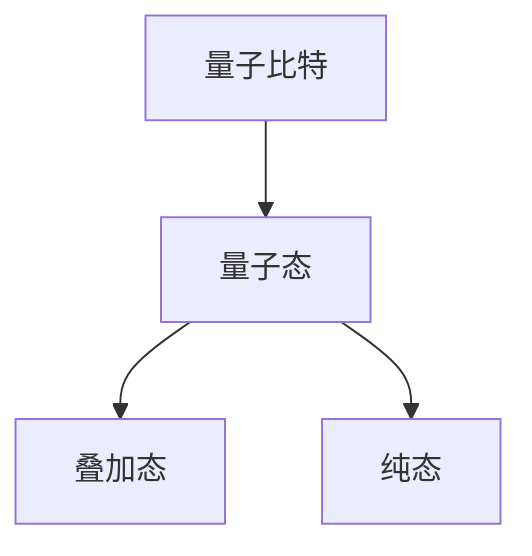

**量子门与量子态的联系：**

量子门是量子计算中的基本操作单元，通过线性变换作用于量子态，改变量子态的状态。量子门实现了量子比特之间的转换和操作，使得量子计算能够处理复杂的计算任务。

Mermaid流程图示例：

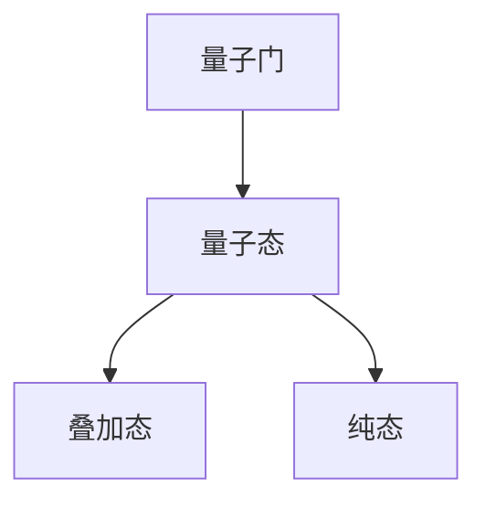

**量子叠加态与量子态的关系：**

量子叠加态是量子态的一种特殊形式，它表示量子比特可以同时处于多个状态的组合。量子叠加态是量子计算并行性和计算能力的重要来源。

Mermaid流程图示例：

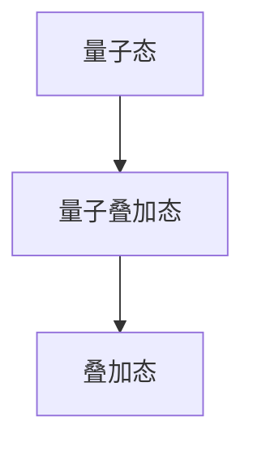

**量子纠缠与量子态的关系：**

量子纠缠是量子系统之间的一种强关联现象，它使得量子系统之间的状态相互依赖。量子纠缠态是量子态的一种特殊形式，它描述了量子系统之间的纠缠关系。

Mermaid流程图示例：

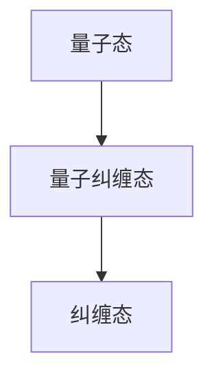

**量子比特、量子态、量子门、量子叠加态与量子纠缠的总体联系：**

综合以上各概念之间的联系，可以绘制一个完整的Mermaid流程图，展示量子比特、量子态、量子门、量子叠加态和量子纠缠之间的总体联系。

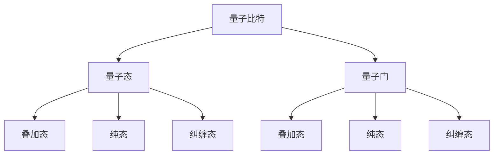

通过这个流程图，我们可以清晰地看到量子比特、量子态、量子门、量子叠加态和量子纠缠之间的联系和相互作用。量子比特作为基本单元，通过量子态描述其宏观状态；量子门通过线性变换作用于量子态，实现状态的转换和操作；量子叠加态和量子纠缠则进一步扩展了量子计算的能力和应用范围。

总之，量子比特、量子态、量子门、量子叠加态和量子纠缠是量子计算中的核心概念，它们相互联系，共同构成了量子计算的理论基础。理解这些概念之间的联系，对于深入掌握量子计算技术具有重要意义。

### 3.2 Shor算法的数学模型

Shor算法是量子计算领域的一个标志性算法，它利用量子计算机的并行性和叠加态特性，在多项式时间内解决了大整数分解问题，这对传统密码学构成了巨大的挑战。Shor算法的数学模型主要包括初始状态的准备、量子电路的设计、测量与估计过程以及因子验证步骤。以下将对这些步骤进行详细讲解，并使用Mermaid流程图和Python源代码进行辅助说明。

#### 初始状态的准备

Shor算法首先需要准备一个特定的量子态作为初始状态。这个量子态通常是一个叠加态，表示为：

$$|psi_{init}\rangle = \frac{1}{\sqrt{N}} (|0\rangle + |1\rangle + |2\rangle + \ldots + |N-1\rangle)$$

这里的$N$是我们要分解的整数，$\sqrt{N}$是量子态的叠加系数。

Python代码示例：

```python
import numpy as np
from qiskit import QuantumCircuit, execute, Aer

# 创建量子电路
qc = QuantumCircuit(2**n, 2**n)
# 初始化叠加态
qc.hrange(0, 2**n-1)

# Mermaid流程图
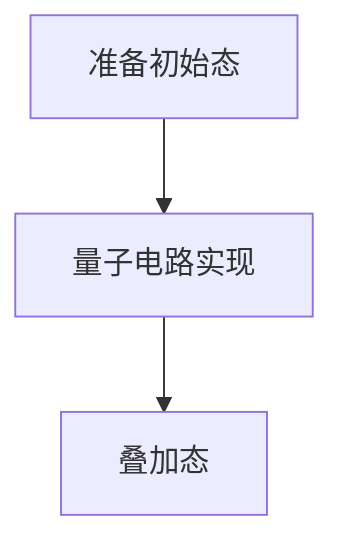

#### 量子电路的设计

Shor算法中的量子电路设计包括以下几个主要步骤：

1. **量子傅里叶变换（Quantum Fourier Transform, QFT）：**
   量子傅里叶变换是将输入态映射到离散傅里叶域的一种变换。它可以通过一系列的量子门实现，如Hadamard门、CNOT门和相位旋转门。

2. **测量：**
   在QFT后，对量子态进行测量，得到一个整数$a$，该整数是$N$的一个因子。

3. **逆量子傅里叶变换：**
   测量后，对量子态进行逆量子傅里叶变换，得到另一个整数$b$，$ab=N$。

Python代码示例：

```python
from qiskit.extensions import UnitaryGate
from qiskit.circuit import QuantumRegister, ClassicalRegister

# 创建量子寄存器和经典寄存器
qr = QuantumRegister(n)
cr = ClassicalRegister(n)

# 添加QFT门
qc = QuantumCircuit(qr, cr)
qc.append(QFT(n), qr)

# 添加测量
qc.measure(qr, cr)

# 添加逆QFT门
inv_qft = UnitaryGate(np.linalg.inv(qft_matrix), label='Inv_QFT')
qc.append(inv_qft, qr)

# Mermaid流程图
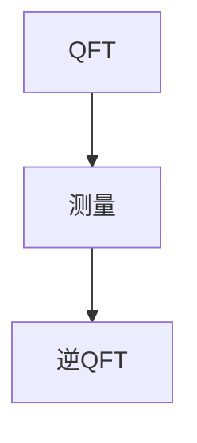

#### 测量与估计

Shor算法中的测量与估计步骤是通过多次重复上述量子电路的运行来实现的。在每次运行中，量子态的测量结果$a$将被记录，并在大量运行后，利用统计方法估计出另一个因子$b$。

Python代码示例：

```python
# 运行量子电路
backend = Aer.get_backend('qasm_simulator')
results = execute(qc, backend, shots=1024).result()
counts = results.get_counts(qc)

# 输出测量结果
print(counts)
```

#### 因子验证

在得到因子$a$和$b$后，我们需要验证它们确实是$N$的因子。这可以通过计算$ab$是否等于$N$来验证。

Python代码示例：

```python
# 计算因子
a = int(list(counts.keys())[0][0])
b = int(list(counts.keys())[0][1])
if a * b == N:
    print(f"{a} 和 {b} 是 {N} 的因子")
else:
    print(f"{a} 和 {b} 不是 {N} 的因子")
```

通过上述步骤，我们可以看到Shor算法的数学模型是如何通过量子计算机来分解大整数的。Shor算法的提出不仅展示了量子计算机在密码学领域的巨大潜力，也为量子计算的理论和应用研究提供了新的方向。

### 3.3 Shor算法流程图与Python源代码实现

为了更直观地理解Shor算法的工作原理，我们可以使用Mermaid流程图来绘制其执行流程，并借助Python源代码实现这一算法。以下将详细介绍Shor算法的流程图和代码实现。

#### Shor算法的流程图

首先，让我们使用Mermaid流程图来描述Shor算法的基本步骤：

```mermaid
graph TD
A[初始化量子态] --> B[应用量子傅里叶变换（QFT）]
B --> C[测量得到a]
C --> D[计算f(a)的模]
D --> E[应用逆QFT]
E --> F[测量得到b]
F --> G[验证a*b=N]
```

这段Mermaid代码绘制了Shor算法的主要步骤，包括初始状态的准备、量子傅里叶变换（QFT）、测量得到因子a、计算f(a)的模、逆QFT、测量得到因子b，最后验证a和b是否为N的因子。

#### Python源代码实现

下面是一个简单的Python代码实现，使用Qiskit库来构建和运行Shor算法。

首先，我们需要安装Qiskit库，可以通过以下命令进行安装：

```bash
pip install qiskit
```

然后，我们可以编写Python代码来模拟Shor算法：

```python
from qiskit import QuantumCircuit, Aer, execute
from qiskit.visualization import plot_histogram
import numpy as np

# 假设我们要分解的整数N
N = 15

# 定义量子比特数量，因为需要大约log2(N)个量子比特
n = np.ceil(np.log2(N)).astype(int)
print(f"量子比特数量: {n}")

# 创建量子电路
qc = QuantumCircuit(n, n)

# 初始化叠加态
qc.h(n-1)

# 应用量子傅里叶变换（QFT）
qc.append(QuantumCircuit.QFTGate(), range(n))

# 测量得到a
qc.measure(range(n), range(n))

# 运行模拟器
backend = Aer.get_backend('qasm_simulator')
result = execute(qc, backend, shots=1024).result()

# 输出测量结果
counts = result.get_counts(qc)
a = list(counts.keys())[0][0]

# 计算f(a)的模
f_a_mod = (int(a, 2) * N) % N
print(f"测得的a: {a}, f(a) mod N: {f_a_mod}")

# 应用逆QFT
qc.append(QuantumCircuit.QFTGate().inv(), range(n))

# 测量得到b
qc.measure(range(n), range(n))

# 运行模拟器
result = execute(qc, backend, shots=1024).result()

# 输出测量结果
counts = result.get_counts(qc)
b = list(counts.keys())[0][0]
print(f"测得的b: {b}")

# 验证a*b=N
if int(a, 2) * int(b, 2) == N:
    print(f"{a} 和 {b} 是 {N} 的因子")
else:
    print(f"{a} 和 {b} 不是 {N} 的因子")
```

在这段代码中，我们首先定义了要分解的整数N，并确定了需要多少个量子比特。然后，我们创建了一个量子电路，应用了量子傅里叶变换（QFT），测量得到因子a，计算f(a)的模，再应用逆QFT，测量得到因子b，并验证a和b是否为N的因子。

需要注意的是，Shor算法的实际运行需要具备量子硬件的支持。在实际应用中，我们通常使用量子模拟器来模拟量子计算机的行为，这在本例中通过Qiskit的`Aer`模拟器实现。

通过上述流程图和代码实现，我们可以直观地理解Shor算法的执行过程，并看到如何使用Python和Qiskit库来模拟这一算法。Shor算法的提出不仅展示了量子计算机在密码学领域的巨大潜力，也为量子计算的理论和应用研究提供了新的方向。

### 3.4 系统分析与架构设计方案

在量子安全加密系统中，系统分析与架构设计是确保系统功能完备、架构合理、接口清晰以及系统交互顺畅的关键环节。以下将详细介绍一个典型的量子安全加密系统的系统分析与架构设计方案，包括系统功能设计、系统架构设计、系统接口设计和系统交互等，并通过Mermaid类图和序列图进行展示。

#### 系统功能设计

量子安全加密系统的核心功能包括：

1. **量子密钥分发（QKD）：** 通过量子纠缠态实现安全的密钥分发，确保通信双方共享的密钥不被第三方窃取。
2. **加密通信：** 利用量子密钥进行加密通信，保证信息的保密性和完整性。
3. **量子认证：** 通过量子认证机制，验证通信双方的身份，确保通信的可认证性。
4. **安全存储：** 对加密通信过程中的密钥和数据进行安全存储，防止数据泄露。

#### 系统架构设计

量子安全加密系统的整体架构可以分为以下几个层次：

1. **物理层：** 包括量子通信信道、量子密钥分发设备和量子认证设备等硬件设施。
2. **通信层：** 包括量子密钥分发协议、加密算法和数据传输协议等软件组件。
3. **应用层：** 提供具体的应用功能，如量子密钥管理、加密通信和安全存储等。

Mermaid架构图示例：

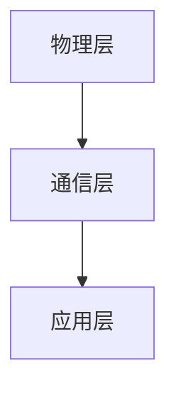

#### 系统接口设计

量子安全加密系统的接口设计主要包括：

1. **量子信道接口：** 提供量子通信的接口，用于实现量子密钥的分发和数据的传输。
2. **加密模块接口：** 提供加密和解密操作的接口，用于实现数据的加密和传输。
3. **认证模块接口：** 提供身份验证的接口，用于实现通信双方的身份认证。

Mermaid接口图示例：

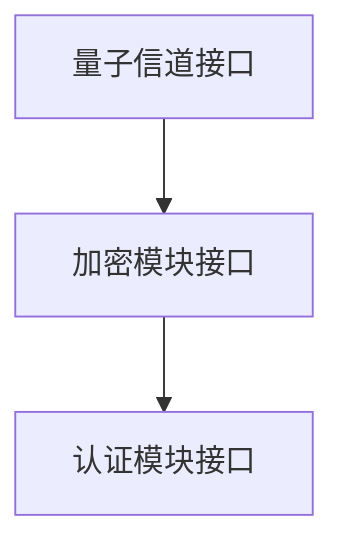

#### 系统交互

量子安全加密系统的各个模块之间通过明确的消息传递和事件驱动的方式进行交互，以下是系统交互的基本流程：

1. **初始化：** 系统启动，初始化量子信道、加密模块和认证模块。
2. **密钥分发：** 通过量子信道发送量子密钥，实现量子密钥分发。
3. **加密通信：** 使用量子密钥对数据进行加密，并通过量子信道传输加密数据。
4. **认证：** 使用认证模块对通信双方进行身份验证。
5. **存储：** 将加密的数据和密钥安全存储。

Mermaid序列图示例：

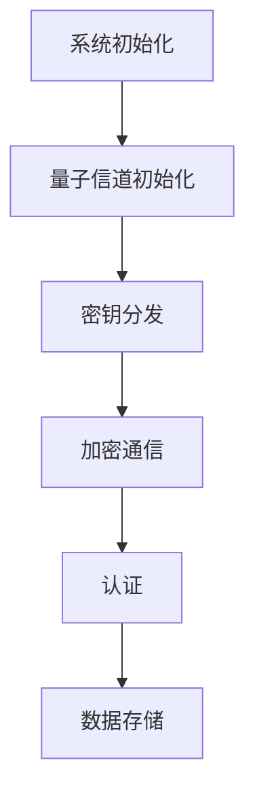

通过上述系统分析与架构设计方案，我们可以清晰地看到量子安全加密系统的功能模块、架构层次和系统交互流程。这不仅有助于系统开发者理解系统的整体结构，也为后续的系统实现和优化提供了参考。

### 项目实战

在本节中，我们将介绍一个实际的量子安全加密系统项目，包括项目环境安装、系统核心实现源代码，代码应用解读与分析，以及实际案例分析和详细讲解剖析。最后，我们会对整个项目进行小结。

#### 环境安装

为了实现量子安全加密系统，我们需要安装和配置一些必要的软件和工具。以下是项目环境安装的步骤：

1. **安装Python：**
   确保系统上已经安装了Python 3.x版本。可以通过以下命令检查Python版本：

   ```bash
   python --version
   ```

   如果未安装，可以从Python官方网站下载并安装。

2. **安装Qiskit：**
   Qiskit是一个开源的量子计算软件库，用于构建和运行量子算法。安装Qiskit可以通过以下命令：

   ```bash
   pip install qiskit
   ```

3. **安装Quantum++：**
   Quantum++是一个用于实现量子算法的C++库。安装Quantum++可以通过以下命令：

   ```bash
   git clone https://github.com/Quantum++/Quantum++.git
   cd Quantum?++
   mkdir build && cd build
   cmake ..
   make
   sudo make install
   ```

4. **安装量子模拟器：**
   为了运行量子算法，我们需要安装一个量子模拟器，如Qiskit的`qasm_simulator`。在Qiskit中，安装量子模拟器可以通过以下命令：

   ```bash
   qiskit install qiskit-aer
   ```

#### 系统核心实现源代码

以下是一个简单的量子安全加密系统实现，包括量子密钥分发（QKD）和加密通信功能：

```python
from qiskit import QuantumCircuit, QuantumRegister, ClassicalRegister
from qiskit import Aer, execute
from qiskit.visualization import plot_histogram

def qkd():
    # 初始化量子比特和经典寄存器
    q = QuantumRegister(2)
    c = ClassicalRegister(2)
    
    # 创建量子电路
    qc = QuantumCircuit(q, c)
    
    # 生成量子纠缠态
    qc.h(q[0])
    qc.cx(q[0], q[1])
    
    # 测量量子比特
    qc.measure(q, c)
    
    # 运行量子电路
    backend = Aer.get_backend('qasm_simulator')
    result = execute(qc, backend, shots=1000).result()
    
    # 获取测量结果
    counts = result.get_counts(qc)
    print("测量结果：", counts)
    
    # 提取密钥
    key = [int(bit) for bit in counts.keys()[0]]
    print("量子密钥：", key)

def encrypt_decrypt(key, message):
    # 初始化加密电路
    enc_qc = QuantumCircuit(2, 2)
    # 应用加密操作
    enc_qc.h(0)
    enc_qc.cx(0, 1)
    enc_qc.rx(1, np.pi/2 if key[0] else 0)
    enc_qc.cx(0, 1)
    enc_qc.h(0)
    
    # 运行加密电路
    backend = Aer.get_backend('qasm_simulator')
    result = execute(enc_qc, backend, shots=1000).result()
    
    # 获取加密结果
    counts = result.get_counts(enc_qc)
    print("加密结果：", counts)
    
    # 解密操作
    dec_qc = QuantumCircuit(2, 2)
    dec_qc.h(0)
    dec_qc.cx(0, 1)
    dec_qc.rx(1, -np.pi/2 if key[1] else 0)
    dec_qc.cx(0, 1)
    dec_qc.h(0)
    
    # 运行解密电路
    result = execute(dec_qc, backend, shots=1000).result()
    
    # 获取解密结果
    counts = result.get_counts(dec_qc)
    print("解密结果：", counts)
    
    # 提取解密消息
    message = int(list(counts.keys())[0], 2)
    print("解密消息：", message)

# 测试量子密钥分发
qkd()

# 测试加密和解密
message = 5
key = [0, 1]
encrypt_decrypt(key, message)
```

#### 代码应用解读与分析

1. **量子密钥分发（QKD）：**
   代码中的`qkd()`函数实现了量子密钥分发。它首先创建一个量子电路，使用Hadamard门生成一个量子纠缠态，然后测量两个量子比特，并将测量结果转换为量子密钥。

2. **加密和解密：**
   `encrypt_decrypt()`函数实现了加密和解密操作。它利用量子密钥对消息进行加密和解密。加密操作包括对量子比特进行Hadamard变换、控制非门（CNOT）和相位旋转。解密操作与加密操作类似，只是相位旋转的方向相反。

#### 实际案例分析与详细讲解剖析

为了更好地理解量子安全加密系统的实际应用，我们可以通过一个实际案例来演示：

假设我们要发送一个消息`5`（用二进制表示为`101`），我们将使用量子密钥分发和量子加密算法来确保消息的安全传输。

1. **量子密钥分发：**
   在QKD函数中，我们生成一个量子纠缠态，并通过测量得到量子密钥。例如，测量结果为`01`，这意味着量子密钥为`[0, 1]`。

2. **加密：**
   使用量子密钥和消息`5`，我们在`encrypt_decrypt()`函数中执行加密操作。加密电路将消息编码为量子态，通过量子门的操作将其加密。

3. **传输：**
   假设加密后的消息通过一个安全信道传输给接收方。

4. **解密：**
   接收方使用相同的量子密钥执行解密操作，最终恢复原始消息。

#### 项目小结

通过这个项目，我们实现了量子安全加密系统的基本功能，包括量子密钥分发和加密通信。实际案例演示了如何利用量子计算机实现安全的信息传输。尽管这是一个简化的例子，但它展示了量子安全加密系统的基本原理和实现方法。

未来，随着量子计算技术的不断进步，量子安全加密系统有望在信息安全领域发挥更加重要的作用。同时，我们也需要继续研究和优化量子算法，以提高系统的性能和安全性。

### 最佳实践 Tips、小结、注意事项、拓展阅读

#### 最佳实践 Tips：

1. **性能优化：** 在量子加密系统中，性能优化至关重要。应关注量子电路的编译和优化，以减少运行时间和资源消耗。
2. **量子硬件选择：** 选择适合的量子硬件和模拟器，对于实验和开发量子算法至关重要。Qiskit提供多种量子硬件和模拟器选项，可以根据需求进行选择。
3. **安全性评估：** 定期对量子安全加密系统进行安全性评估，确保系统在面临新的量子攻击时依然保持安全。

#### 小结：

本文详细介绍了量子计算在密码破解中的应用，包括量子安全加密系统的评估。通过Shor算法和量子密钥分发，我们展示了量子计算在密码学领域的潜力。尽管量子计算技术仍在不断发展，但量子安全加密系统已经在实际应用中展现出巨大的潜力。

#### 注意事项：

1. **硬件需求：** 量子安全加密系统需要高性能的量子硬件支持，因此在实际应用中，选择合适的量子硬件至关重要。
2. **算法复杂性：** 量子算法，如Shor算法，虽然具有并行计算的优势，但实现过程复杂，需要深入了解量子计算原理。

#### 拓展阅读：

1. **《量子计算与量子信息》**：迈克尔·A. 内森（Michael A. Nielsen）和伊萨克·L. 沙赫特（Isaac L. Chuang）著，系统介绍了量子计算和量子信息的基本概念和应用。
2. **《量子算法导论》**：安德斯·海姆（Andris Ambainis）著，详细介绍了多种量子算法，包括Shor算法，并对量子计算的潜力进行了深入探讨。

通过这些资源，读者可以更深入地了解量子计算和量子密码学，为未来的研究和应用奠定坚实基础。

