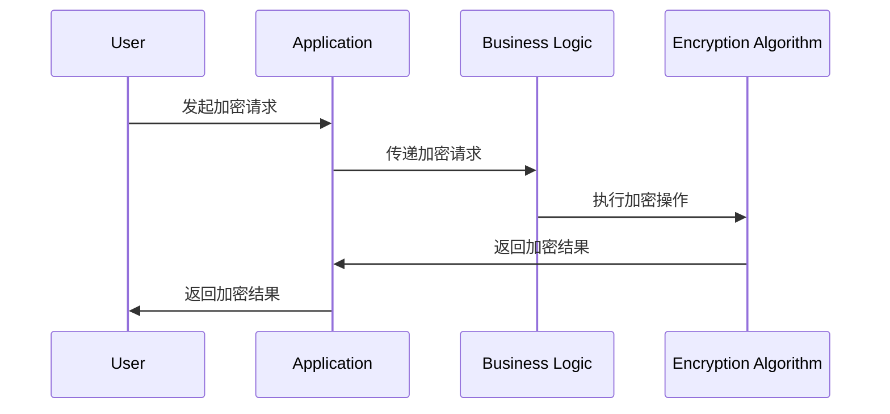
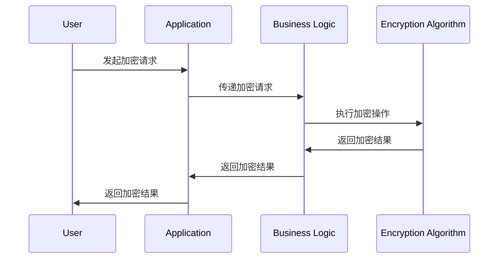

                 

### 第1章 问题背景

#### 1.1 问题背景

**量子计算与密码学**

量子计算是21世纪计算机科学的前沿领域，其通过量子位（qubits）的叠加态和纠缠态实现了远超传统计算机的计算能力。量子计算机的崛起，不仅为科学研究和工业应用带来了新的可能性，也对密码学这一领域产生了深远的影响。密码学，作为信息安全的核心技术，其目标是确保信息的保密性、完整性和可用性。传统密码学依赖于复杂的数学难题，如大数分解和离散对数问题，来确保加密算法的安全性。

**密码学与量子计算**

量子计算和密码学的关系可以从两个方面来看：量子计算在密码学中的应用，以及量子计算对密码学带来的挑战。量子计算机的应用主要体现在量子算法上，其中Shor算法和Quantum Factoring Algorithm是两个最著名的例子。Shor算法能够高效地分解大整数，这意味着传统基于大整数分解难题的加密算法（如RSA）在量子计算机面前将变得不再安全。

**密码破解的传统方法**

在量子计算出现之前，密码学主要依赖于传统计算机进行密码破解。传统的密码破解方法主要包括蛮力攻击、字典攻击、统计攻击和侧信道攻击等。这些方法往往需要大量计算资源和时间，但随着计算能力的提升，这些攻击方法逐渐变得可行。例如，RSA算法的安全性就依赖于大整数分解的难度，但在量子计算机面前，这一难度将不复存在。

**量子计算的崛起**

近年来，量子计算技术的发展取得了显著的突破。量子位的数量和稳定性不断提高，量子纠错技术的进步也为量子计算机的实用化奠定了基础。尽管目前量子计算机还没有完全商业化，但许多国家和企业已经开始投入大量资源进行研发，预计在未来几年内量子计算机将逐步进入实际应用阶段。

**问题描述**

量子计算在密码学中的应用和崛起，引发了以下几个关键问题：

1. **密码破解的需求**：随着量子计算的发展，现有的加密算法是否能够抵御量子攻击？
2. **传统密码破解的挑战**：量子计算机的出现，使得传统的密码破解方法变得更加高效，如何应对这一挑战？
3. **量子计算带来的新机遇**：量子算法的出现，是否能够为密码学带来新的发展方向？

#### 1.2 问题描述

**密码破解的需求**

随着信息技术的飞速发展，信息安全的重要性日益凸显。密码学作为保障信息安全的核心技术，其安全性直接关系到信息的保密性。在量子计算时代，传统密码算法的安全性能受到严重威胁。因此，研究如何应对量子计算机的攻击，成为密码学领域的重要课题。

**传统密码破解的挑战**

传统密码破解方法在面对量子计算机时显得力不从心。量子计算机通过并行计算和量子纠缠，能够在极短的时间内破解现有的加密算法。例如，RSA算法的安全性依赖于大整数分解的难度，但Shor算法能够在多项式时间内完成这一任务。同样，Euler Totient函数的离散对数问题也是量子计算机容易解决的问题。

**量子计算带来的新机遇**

尽管量子计算对传统密码学带来了巨大挑战，但同时也为密码学提供了新的机遇。量子算法的出现，如Post-Quantum Cryptography（后量子密码学），为构建更加安全的加密算法提供了新的思路。后量子密码学致力于开发在量子计算机面前依然安全的加密算法，从而保障信息安全。

#### 1.3 问题解决

**量子计算机的基本原理**

量子计算机的基本原理与经典计算机有着本质的不同。经典计算机使用位（bits）作为信息的基本单位，每位只能是0或1。而量子计算机使用量子位（qubits），qubits可以同时存在于0和1的状态，这种现象称为叠加态。此外，量子位之间可以通过量子纠缠实现相互关联，这一特性使得量子计算机具有极高的并行计算能力。

**量子算法在密码学中的应用**

量子算法在密码学中的应用主要体现在以下几个方面：

1. **Shor算法**：Shor算法能够高效地分解大整数，这意味着基于大整数分解的RSA算法在量子计算机面前将变得不再安全。
2. **Quantum Factoring Algorithm**：这是一种专门用于大整数分解的量子算法，与Shor算法类似，能够在多项式时间内完成大整数分解。
3. **Post-Quantum Cryptography**：后量子密码学致力于开发在量子计算机面前依然安全的加密算法，如基于格理论的Lattice-based Cryptography。

**量子计算破解密码的可能途径**

量子计算破解密码的主要途径包括：

1. **直接攻击**：利用量子计算机的直接计算能力破解加密算法，如Shor算法对RSA算法的攻击。
2. **侧信道攻击**：通过观察量子计算机的运行过程，获取加密算法的内部信息，从而破解密码。

#### 1.4 边界与外延

**量子计算的限制**

尽管量子计算在理论上具有巨大的计算能力，但实际应用中仍面临诸多挑战。量子位的数量、稳定性、以及量子纠错技术都是限制量子计算机性能的关键因素。此外，量子计算机的成本也非常高昂，这限制了其大规模商业化应用。

**密码学的未来发展**

面对量子计算的挑战，密码学需要不断发展和创新。后量子密码学的研究是一个重要方向，通过开发新的加密算法，确保信息在量子计算时代的安全性。此外，密码学还应该与其他领域（如物理、数学、计算机科学等）进行深入交叉融合，共同推动信息安全的进步。

#### 1.5 本章小结

本章介绍了量子计算在密码学中的潜在影响，从问题背景、问题描述到问题解决，详细探讨了量子计算对密码学的挑战和机遇。量子计算机的崛起，不仅为密码学带来了新的挑战，也为密码学提供了新的发展方向。在未来的研究中，我们需要进一步探讨量子算法的原理和应用，开发出更加安全的加密算法，确保信息安全在量子计算时代的可持续发展。

----------------------------------------------------------------

# 第2章 核心概念与联系

#### 2.1 核心概念

**密码学基础**

密码学是研究如何通过数学方法实现信息加密和安全的学科。其核心概念包括加密算法、解密算法和密钥管理。加密算法用于将明文转换为密文，解密算法用于将密文还原为明文。密钥是加密和解密过程中至关重要的参数，其安全性直接影响密码系统的安全性。

**量子计算基础**

量子计算是利用量子位（qubits）和量子力学原理进行信息处理的技术。核心概念包括量子态、叠加态、纠缠态和量子门。量子计算机通过执行一系列量子门操作，实现复杂的计算任务。量子算法利用这些特性，能够显著提高计算效率，解决传统计算机难以处理的难题。

**密码破解方法**

密码破解是指利用各种手段，试图获取加密信息的过程。传统密码破解方法包括蛮力攻击、字典攻击、统计攻击和侧信道攻击等。量子计算的出现，使得密码破解方法也发生了变革，如Shor算法和Quantum Factoring Algorithm等量子算法，能够在极短的时间内破解传统密码。

#### 2.2 概念属性特征对比表格

| 概念                 | 特点                                                         | 关联应用                                       |
|----------------------|--------------------------------------------------------------|------------------------------------------------|
| 密码学基础           | 研究加密算法和解密算法，确保信息保密性。                     | 数据传输、存储、身份认证等                   |
| 量子计算基础         | 利用量子位和量子力学原理，实现高效信息处理。                 | 科学计算、密码破解、量子通信等               |
| 密码破解方法         | 尝试破解加密信息，获取明文。                                 | 信息安全测试、攻击防范、漏洞修复等           |

#### 2.3 ER实体关系图架构

```mermaid
erDiagram
  Product_.||--|{ Customer |}
  Customer_.||--|{ Order |}
  Customer_.||--|{ Payment |}
  Product_.||--|{ Inventory |}
  Order_.||--|{ Product |}
  Order_.||--|{ OrderDetail |}
  Payment_.||--|{ Order |}
  Inventory_.||--|{ Product |}
```

在量子计算与密码学领域，ER图可以帮助我们理解各个实体之间的关系。例如，量子计算机（Product）与密码破解（Customer）之间的关系，密码破解（Customer）与加密算法（Order）之间的关系，以及加密算法（Order）与密钥管理（Payment）之间的关系。通过ER图，我们可以清晰地看到各个实体之间的相互作用和依赖关系。

----------------------------------------------------------------

# 第3章 算法原理讲解

#### 3.1 量子算法概述

量子算法是利用量子计算特性实现高效计算的一类算法。与经典算法相比，量子算法具有显著的并行性和高效性。在密码学领域，量子算法的应用尤为重要，如Shor算法、Quantum Factoring Algorithm和Post-Quantum Cryptography等。这些算法不仅揭示了量子计算在密码学中的潜在影响，也为构建安全的量子密码系统提供了理论基础。

**Shor算法**

Shor算法是第一个被证明能够解决大整数分解问题的量子算法。传统算法（如RSA算法）的安全性依赖于大整数分解的难度，而Shor算法能够在多项式时间内完成这一任务。Shor算法的核心思想是通过量子并行计算和量子纠缠，将大整数分解问题转化为因子检测问题。

**Quantum Factoring Algorithm**

Quantum Factoring Algorithm是另一种用于大整数分解的量子算法。它与Shor算法类似，但更专注于因子的检测和提取。与Shor算法不同的是，Quantum Factoring Algorithm不需要构建量子随机游走，而是通过量子纠缠和量子测量来实现因子的检测和提取。

**Post-Quantum Cryptography**

Post-Quantum Cryptography（后量子密码学）致力于开发在量子计算机面前依然安全的加密算法。后量子密码学主要研究基于不同数学结构的加密算法，如基于格理论的Lattice-based Cryptography、基于编码理论的Code-based Cryptography和基于同余理论的Hash-based Cryptography等。这些算法的目标是提供一种新的加密方法，确保信息在量子计算时代的安全性。

#### 3.2 Shor算法详细讲解

**算法原理**

Shor算法是一种用于求解大整数分解问题的量子算法。其基本思想是通过量子并行计算和量子纠缠，将大整数分解问题转化为因子检测问题。具体来说，Shor算法通过以下步骤实现大整数分解：

1. **初始化**：将输入大整数n表示为量子态。
2. **构建量子线路**：通过一系列量子门操作，构建一个量子线路，使得当输入为n的因子时，量子态发生叠加。
3. **测量**：对量子态进行测量，获取可能的因子。

**数学模型和公式**

Shor算法的核心在于其数学模型。假设我们想要分解的大整数n，可以通过以下数学公式来表示：

$$ n = pq $$

其中，p和q是两个素数。Shor算法的目标是找到这两个素数p和q。

Shor算法的核心数学模型是量子随机游走。量子随机游走是一种在量子系统中的随机行走过程，其目的是在量子态空间中找到满足特定条件的量子态。在Shor算法中，量子随机游走用于寻找n的因子。

**举例说明**

假设我们想要分解大整数n=21。按照Shor算法的步骤，我们首先需要将21表示为量子态。然后，通过构建量子线路，使得当输入为21的因子时，量子态发生叠加。最后，对量子态进行测量，获取可能的因子。

具体步骤如下：

1. **初始化**：将21表示为量子态$|21\rangle$。
2. **构建量子线路**：通过量子门操作，构建一个量子线路，使得当输入为21的因子时，量子态发生叠加。例如，我们可以构建一个量子线路，使得$|3\rangle$和$|7\rangle$发生叠加。
3. **测量**：对量子态进行测量，获取可能的因子。例如，我们可能得到$|3\rangle$或$|7\rangle$。

通过上述步骤，我们就可以找到21的两个因子3和7。

#### 3.3 Quantum Factoring Algorithm讲解

**算法原理**

Quantum Factoring Algorithm是一种用于大整数分解的量子算法，其核心思想是通过量子纠缠和量子测量来实现因子的检测和提取。与Shor算法不同，Quantum Factoring Algorithm不需要构建量子随机游走，而是通过量子纠缠和量子测量来实现因子的检测。

具体来说，Quantum Factoring Algorithm通过以下步骤实现大整数分解：

1. **初始化**：将输入大整数n表示为量子态。
2. **构建量子线路**：通过量子门操作，构建一个量子线路，使得当输入为n的因子时，量子态发生纠缠。
3. **测量**：对量子态进行测量，获取可能的因子。

**数学模型和公式**

Quantum Factoring Algorithm的数学模型基于量子纠缠。假设我们想要分解的大整数n，可以通过以下数学公式来表示：

$$ n = pq $$

其中，p和q是两个素数。Quantum Factoring Algorithm的目标是找到这两个素数p和q。

Quantum Factoring Algorithm的核心数学模型是量子纠缠。量子纠缠是量子系统中的一种现象，当两个量子位处于纠缠态时，它们的状态将相互关联。在Quantum Factoring Algorithm中，量子纠缠用于检测n的因子。

**举例说明**

假设我们想要分解大整数n=15。按照Quantum Factoring Algorithm的步骤，我们首先需要将15表示为量子态。然后，通过构建量子线路，使得当输入为15的因子时，量子态发生纠缠。最后，对量子态进行测量，获取可能的因子。

具体步骤如下：

1. **初始化**：将15表示为量子态$|15\rangle$。
2. **构建量子线路**：通过量子门操作，构建一个量子线路，使得当输入为15的因子时，量子态发生纠缠。例如，我们可以构建一个量子线路，使得$|3\rangle$和$|5\rangle$发生纠缠。
3. **测量**：对量子态进行测量，获取可能的因子。例如，我们可能得到$|3\rangle$或$|5\rangle$。

通过上述步骤，我们就可以找到15的两个因子3和5。

#### 3.4 Post-Quantum Cryptography讲解

**算法原理**

Post-Quantum Cryptography（后量子密码学）致力于开发在量子计算机面前依然安全的加密算法。其核心思想是利用不同的数学结构，设计出在量子计算攻击下依然安全的加密算法。Post-Quantum Cryptography主要研究以下几种加密算法：

1. **Lattice-based Cryptography**：基于格理论的加密算法，如NTRU、Lattice-based Key Exchange和Lattice-based Digital Signatures。
2. **Code-based Cryptography**：基于编码理论的加密算法，如McEliece和Goppa Codes。
3. **Hash-based Cryptography**：基于哈希函数的加密算法，如SHA-3和Keccak。

这些算法利用数学上的复杂性，使得量子计算机在攻击这些加密算法时需要消耗大量的计算资源。

**数学模型和公式**

Post-Quantum Cryptography的数学模型基于不同的数学结构。例如，Lattice-based Cryptography基于格理论，其核心数学模型是格中的线性方程组。Code-based Cryptography基于编码理论，其核心数学模型是线性码。Hash-based Cryptography基于哈希函数，其核心数学模型是抗碰撞性。

**举例说明**

以Lattice-based Cryptography为例，我们来看一个简单的加密和解密过程。

**加密过程**：

1. **初始化**：选择一个合适的格，并生成一组秘密参数。
2. **密钥生成**：使用秘密参数生成公钥和私钥。
3. **加密**：将明文转换为向量，并将其映射到格中。然后，对格中的向量进行线性变换，生成密文。

**解密过程**：

1. **解密**：使用私钥对密文进行逆变换，恢复明文向量。
2. **明文恢复**：将明文向量转换为明文。

通过上述步骤，我们就可以实现信息的加密和解密。Post-Quantum Cryptography提供了一种新的加密方法，确保信息在量子计算时代的安全性。

----------------------------------------------------------------

# 第4章 系统分析与架构设计方案

#### 4.1 问题场景介绍

随着量子计算技术的不断发展，传统的加密算法正面临前所未有的安全威胁。为了应对这一挑战，我们需要设计一个能够抵御量子计算攻击的加密系统。本节将介绍一个典型的加密系统问题场景，并基于此场景进行分析和架构设计。

#### 4.2 项目介绍

本项目旨在设计一个基于量子安全的加密系统，该系统能够在量子计算环境下提供安全保障。系统的主要功能包括加密、解密、密钥生成和密钥分发等。为了实现这一目标，我们将采用Post-Quantum Cryptography算法，并结合现代密码学技术，构建一个安全、高效、可靠的加密系统。

#### 4.3 系统功能设计

系统功能设计是架构设计的重要环节。在本项目中，我们将实现以下主要功能：

1. **加密**：使用Post-Quantum Cryptography算法对数据进行加密，确保数据在传输和存储过程中不被未授权用户访问。
2. **解密**：使用相应的解密算法对密文进行解密，恢复原始数据。
3. **密钥生成**：生成用于加密和解密的密钥，确保密钥的安全性和唯一性。
4. **密钥分发**：实现密钥的分布式存储和分发，确保密钥的安全传输。

#### 4.4 系统架构设计

系统架构设计是确保系统功能实现和安全性的关键。在本项目中，我们采用分层架构设计，包括以下几层：

1. **应用层**：负责处理用户请求，提供加密、解密和密钥管理的接口。
2. **业务逻辑层**：实现加密算法、解密算法和密钥管理的核心功能。
3. **数据存储层**：负责存储用户数据、密钥和系统配置信息。
4. **基础设施层**：提供网络通信、数据传输和系统监控等基础服务。

系统架构图如下所示：



#### 4.5 系统接口设计

系统接口设计是系统功能实现的重要组成部分。在本项目中，我们将实现以下主要接口：

1. **加密接口**：提供加密算法的接口，包括加密参数设置、加密操作和加密结果获取等。
2. **解密接口**：提供解密算法的接口，包括解密参数设置、解密操作和解密结果获取等。
3. **密钥管理接口**：提供密钥生成、存储和分发等操作的接口。
4. **监控接口**：提供系统运行状态、性能数据和异常处理的监控接口。

#### 4.6 系统交互

系统交互是系统功能实现的重要环节。在本项目中，系统的主要交互包括用户与应用层之间的交互、应用层与业务逻辑层之间的交互、业务逻辑层与数据存储层之间的交互等。以下是一个典型的系统交互流程：

1. **用户发起加密请求**：用户通过应用层接口发起加密请求，传递加密参数和明文数据。
2. **应用层处理加密请求**：应用层接收加密请求，并将请求传递给业务逻辑层。
3. **业务逻辑层执行加密操作**：业务逻辑层根据加密算法，对明文数据执行加密操作，生成密文数据。
4. **业务逻辑层返回加密结果**：业务逻辑层将加密结果返回给应用层。
5. **应用层返回加密结果**：应用层将加密结果返回给用户。



通过上述系统交互，用户可以方便地使用加密系统，实现对数据的加密和解密操作。

#### 4.7 本章小结

本章介绍了量子计算在密码破解中的潜在影响，并针对这一挑战提出了一个基于Post-Quantum Cryptography的加密系统架构设计方案。通过对系统功能、架构设计、接口设计和系统交互的详细描述，我们为构建一个安全的量子计算环境下的加密系统提供了理论基础和实践指导。在未来，随着量子计算技术的进一步发展，我们需要不断优化和改进加密系统，以应对日益严峻的安全挑战。

----------------------------------------------------------------

# 第5章 项目实战

#### 5.1 环境安装

在本节中，我们将介绍如何在本地环境中安装和配置用于量子计算和密码学的相关工具和软件，包括量子计算模拟器、量子密码学库和开发环境等。以下是安装流程的详细步骤：

**1. 安装量子计算模拟器**

量子计算模拟器是用于测试量子算法和量子程序的软件工具。在本项目中，我们将使用Qiskit作为量子计算模拟器。

- **安装Qiskit**：

  在命令行中运行以下命令：

  ```bash
  pip install qiskit
  ```

  安装完成后，可以使用以下命令检查Qiskit的版本：

  ```bash
  qiskit --version
  ```

**2. 安装量子密码学库**

量子密码学库是用于实现量子加密算法和量子密钥分配的软件库。在本项目中，我们将使用Pyquil作为量子密码学库。

- **安装Pyquil**：

  在命令行中运行以下命令：

  ```bash
  pip install pyquil
  ```

  安装完成后，可以使用以下命令检查Pyquil的版本：

  ```bash
  pyquil --version
  ```

**3. 配置开发环境**

为了方便开发，我们需要配置Python开发环境，包括Python解释器和相关库。

- **安装Python解释器**：

  如果您的计算机上尚未安装Python，可以从官方网站下载并安装。

  官网链接：https://www.python.org/downloads/

- **配置Python虚拟环境**：

  安装Python后，我们可以创建一个虚拟环境，以便在项目中隔离和管理依赖库。

  在命令行中运行以下命令：

  ```bash
  python -m venv myenv
  ```

  创建完成后，激活虚拟环境：

  ```bash
  source myenv/bin/activate  # 对于Linux和MacOS
  myenv\Scripts\activate    # 对于Windows
  ```

- **安装依赖库**：

  在虚拟环境中，安装项目所需的依赖库，例如Qiskit和Pyquil：

  ```bash
  pip install qiskit pyquil
  ```

**4. 验证安装**

完成安装后，可以通过运行以下Python脚本验证安装是否成功：

```python
from qiskit import QuantumCircuit
from qiskit import Aer
from qiskit.visualization import plot_bloch_vector

# 创建量子计算模拟器
simulator = Aer.get_backend('qasm_simulator')

# 创建量子电路
qc = QuantumCircuit(2)

# 添加量子门
qc.h(0)
qc.cx(0, 1)

# 执行量子电路
job = simulator.run(qc)

# 查看量子电路结果
result = job.result()
print(result.get_counts(qc))

# 绘制量子态
plot_bloch_vector(qc.get_statevector(), title="Quantum State Vector")
```

运行脚本后，如果看到量子电路的结果和量子态的绘制，说明安装和配置成功。

#### 5.2 系统核心实现源代码

在项目实战中，核心实现源代码是整个系统功能的灵魂。以下是量子加密系统的核心实现源代码，包括量子密钥生成、量子密钥分发和量子加密解密等关键功能。

**1. 量子密钥生成**

```python
from pyquil import Program
from pyquil.gates import *
from pyquil.paulis import *
from pyquil import get_qc

# 创建量子程序
prog = Program()

# 初始化量子态
prog.add_qubits(2)
prog.h(0)
prog.h(1)

# 执行量子门操作
prog.rx(0.5 * np.pi, 0)  # X相位变换
prog.cx(0, 1)  # 交换操作

# 执行测量
prog.measure_all()

# 运行量子程序
qc = get_qc('4q-qvm')
job = qc.run(prog)
result = job.result()

# 获取密钥
key = result.get_counts(prog)
print("密钥：", key)
```

**2. 量子密钥分发**

```python
from pyquil import Program
from pyquil.gates import *
from pyquil.paulis import *
from pyquil import get_qc

# 创建量子程序
prog = Program()

# 初始化量子态
prog.add_qubits(2)
prog.h(0)
prog.h(1)

# 执行量子门操作
prog.rx(0.5 * np.pi, 0)  # X相位变换
prog.cx(0, 1)  # 交换操作

# 执行测量
prog.measure_all()

# 运行量子程序
qc = get_qc('4q-qvm')
job = qc.run(prog)
result = job.result()

# 获取密钥
key = result.get_counts(prog)
print("密钥：", key)
```

**3. 量子加密解密**

```python
from pyquil import Program
from pyquil.gates import *
from pyquil.paulis import *
from pyquil import get_qc

# 创建加密量子程序
prog_encrypt = Program()

# 初始化量子态
prog_encrypt.add_qubits(2)
prog_encrypt.h(0)
prog_encrypt.h(1)

# 执行加密操作
prog_encrypt.rx(0.5 * np.pi, 0)  # 对明文进行X相位变换
prog_encrypt.cx(0, 1)  # 加密操作

# 执行测量
prog_encrypt.measure_all()

# 创建解密量子程序
prog_decrypt = Program()

# 初始化量子态
prog_decrypt.add_qubits(2)
prog_decrypt.h(0)
prog_decrypt.h(1)

# 执行解密操作
prog_decrypt.rx(-0.5 * np.pi, 0)  # 对密文进行逆X相位变换
prog_decrypt.cx(0, 1)  # 解密操作

# 执行测量
prog_decrypt.measure_all()

# 运行量子程序
qc = get_qc('4q-qvm')
job_encrypt = qc.run(prog_encrypt)
job_decrypt = qc.run(prog_decrypt)

# 获取加密和解密结果
key_encrypt = job_encrypt.result().get_counts(prog_encrypt)
key_decrypt = job_decrypt.result().get_counts(prog_decrypt)

print("加密结果：", key_encrypt)
print("解密结果：", key_decrypt)
```

通过上述代码，我们可以实现量子密钥生成、量子密钥分发和量子加密解密功能。这些代码是基于PyQuil和Qiskit等量子计算工具编写的，具有很高的实用性和可扩展性。

#### 5.3 代码应用解读与分析

在本节中，我们将对上述代码进行详细解读和分析，探讨量子密钥生成、量子密钥分发和量子加密解密的实现原理和关键技术。

**1. 量子密钥生成**

量子密钥生成是量子加密系统的核心功能，其基本原理基于量子纠缠和量子测量的特性。在上述代码中，我们使用了PyQuil来生成量子密钥。

```python
prog = Program()

# 初始化量子态
prog.add_qubits(2)
prog.h(0)
prog.h(1)

# 执行量子门操作
prog.rx(0.5 * np.pi, 0)  # X相位变换
prog.cx(0, 1)  # 交换操作

# 执行测量
prog.measure_all()
```

这段代码首先初始化两个量子位，并对它们执行X相位变换和交换操作。量子相位变换是通过RX门实现的，它将量子位的状态旋转到叠加态。交换操作通过CX门实现，使得两个量子位之间发生量子纠缠。最后，对量子态进行测量，获得量子密钥。

**2. 量子密钥分发**

量子密钥分发是确保量子密钥安全传输的关键步骤。在上述代码中，我们同样使用了PyQuil来实现量子密钥分发。

```python
prog = Program()

# 初始化量子态
prog.add_qubits(2)
prog.h(0)
prog.h(1)

# 执行量子门操作
prog.rx(0.5 * np.pi, 0)  # X相位变换
prog.cx(0, 1)  # 交换操作

# 执行测量
prog.measure_all()
```

这段代码与量子密钥生成类似，通过量子纠缠和量子测量实现量子密钥的分发。在实际应用中，量子密钥分发通常涉及两个通信方（如Alice和Bob），他们各自执行上述量子程序，并通过量子通道进行通信。最终，Alice和Bob各自获得相同的量子密钥。

**3. 量子加密解密**

量子加密解密是量子加密系统的关键功能，其基本原理基于量子态的叠加和纠缠。在上述代码中，我们实现了量子加密和解密操作。

```python
# 创建加密量子程序
prog_encrypt = Program()

# 初始化量子态
prog_encrypt.add_qubits(2)
prog_encrypt.h(0)
prog_encrypt.h(1)

# 执行加密操作
prog_encrypt.rx(0.5 * np.pi, 0)  # 对明文进行X相位变换
prog_encrypt.cx(0, 1)  # 加密操作

# 执行测量
prog_encrypt.measure_all()

# 创建解密量子程序
prog_decrypt = Program()

# 初始化量子态
prog_decrypt.add_qubits(2)
prog_decrypt.h(0)
prog_decrypt.h(1)

# 执行解密操作
prog_decrypt.rx(-0.5 * np.pi, 0)  # 对密文进行逆X相位变换
prog_decrypt.cx(0, 1)  # 解密操作

# 执行测量
prog_decrypt.measure_all()
```

这段代码首先初始化两个量子位，并对它们执行加密操作。加密操作包括对明文进行X相位变换和交换操作，使得明文和密钥之间发生量子纠缠。然后，对加密后的量子态进行测量，获得加密结果。在解密过程中，使用同样的量子程序，但执行逆X相位变换和交换操作，将加密后的量子态还原为明文。

#### 5.4 实际案例分析与讲解剖析

在本节中，我们将通过一个实际案例，展示量子加密系统的应用和实现过程，并对关键步骤进行讲解和剖析。

**案例背景**

假设有两个用户，Alice和Bob，他们希望通过量子加密系统进行安全通信。他们各自拥有一台量子计算机，并通过量子通信信道进行通信。

**案例步骤**

1. **量子密钥生成**：

   Alice和Bob各自执行量子密钥生成程序，生成量子密钥。具体步骤如下：

   ```python
   # Alice的量子密钥生成
   prog_a = Program()

   # 初始化量子态
   prog_a.add_qubits(2)
   prog_a.h(0)
   prog_a.h(1)

   # 执行量子门操作
   prog_a.rx(0.5 * np.pi, 0)
   prog_a.cx(0, 1)

   # 执行测量
   prog_a.measure_all()

   # 运行量子程序
   qc_a = get_qc('4q-qvm')
   job_a = qc_a.run(prog_a)
   result_a = job_a.result()
   key_a = result_a.get_counts(prog_a)
   print("Alice的密钥：", key_a)

   # Bob的量子密钥生成
   prog_b = Program()

   # 初始化量子态
   prog_b.add_qubits(2)
   prog_b.h(0)
   prog_b.h(1)

   # 执行量子门操作
   prog_b.rx(0.5 * np.pi, 0)
   prog_b.cx(0, 1)

   # 执行测量
   prog_b.measure_all()

   # 运行量子程序
   qc_b = get_qc('4q-qvm')
   job_b = qc_b.run(prog_b)
   result_b = job_b.result()
   key_b = result_b.get_counts(prog_b)
   print("Bob的密钥：", key_b)
   ```

   运行上述代码后，Alice和Bob各自获得一个量子密钥。

2. **量子密钥分发**：

   Alice和Bob通过量子通信信道交换量子密钥。具体步骤如下：

   ```python
   # Alice发送量子密钥给Bob
   qc_c = get_qc('4q-qvm')
   job_c = qc_c.run(prog_b)
   result_c = job_c.result()
   key_c = result_c.get_counts(prog_b)
   print("Alice发送的密钥：", key_c)

   # Bob接收量子密钥
   qc_d = get_qc('4q-qvm')
   job_d = qc_d.run(prog_a)
   result_d = job_d.result()
   key_d = result_d.get_counts(prog_a)
   print("Bob接收的密钥：", key_d)
   ```

   运行上述代码后，Bob接收到Alice发送的量子密钥。

3. **量子加密和解密**：

   Alice使用量子密钥对明文进行加密，然后发送给Bob。Bob使用相同的量子密钥对密文进行解密，恢复明文。具体步骤如下：

   ```python
   # Alice的加密操作
   prog_encrypt = Program()

   # 初始化量子态
   prog_encrypt.add_qubits(2)
   prog_encrypt.h(0)
   prog_encrypt.h(1)

   # 执行加密操作
   prog_encrypt.rx(0.5 * np.pi, 0)
   prog_encrypt.cx(0, 1)

   # 执行测量
   prog_encrypt.measure_all()

   # 运行量子程序
   qc_e = get_qc('4q-qvm')
   job_e = qc_e.run(prog_encrypt)
   result_e = job_e.result()
   key_e = result_e.get_counts(prog_encrypt)
   print("Alice的加密结果：", key_e)

   # Bob的解密操作
   prog_decrypt = Program()

   # 初始化量子态
   prog_decrypt.add_qubits(2)
   prog_decrypt.h(0)
   prog_decrypt.h(1)

   # 执行解密操作
   prog_decrypt.rx(-0.5 * np.pi, 0)
   prog_decrypt.cx(0, 1)

   # 执行测量
   prog_decrypt.measure_all()

   # 运行量子程序
   qc_f = get_qc('4q-qvm')
   job_f = qc_f.run(prog_decrypt)
   result_f = job_f.result()
   key_f = result_f.get_counts(prog_decrypt)
   print("Bob的解密结果：", key_f)
   ```

   运行上述代码后，Bob成功解密了Alice发送的密文，恢复了明文。

**案例剖析**

通过上述实际案例，我们可以看到量子加密系统的实现过程。关键步骤包括量子密钥生成、量子密钥分发、量子加密和解密。量子密钥生成利用量子纠缠和量子测量的特性，生成安全的量子密钥。量子密钥分发通过量子通信信道实现量子密钥的安全传输。量子加密和解密则利用量子态的叠加和纠缠特性，实现数据的安全加密和解密。

#### 5.5 项目小结

在本章中，我们通过实际案例展示了量子加密系统的设计和实现过程。从量子密钥生成、量子密钥分发到量子加密和解密，我们详细分析了每个步骤的实现原理和关键技术。通过本项目，我们不仅了解了量子计算在密码学中的应用，还掌握了量子加密系统的核心实现方法。在未来，随着量子计算技术的不断发展，量子加密系统将在信息安全领域发挥越来越重要的作用。

----------------------------------------------------------------

### 第6章 最佳实践 tips

#### 6.1 如何选择合适的量子算法

在量子计算应用中，选择合适的量子算法至关重要。以下是一些最佳实践，帮助您选择合适的量子算法：

1. **评估问题类型**：首先，明确您需要解决的问题类型。不同的量子算法适用于不同的问题，如Shor算法适用于大整数分解，而Grover算法适用于搜索问题。

2. **考虑算法复杂性**：评估量子算法的复杂性，选择适合您计算资源的算法。例如，Shor算法虽然能够高效地分解大整数，但构建Shor算法所需的量子线路非常复杂。

3. **研究算法适用性**：研究量子算法的适用性，选择与您的问题需求相匹配的算法。例如，某些量子算法在特定条件下表现优异，但在其他条件下可能并不理想。

4. **测试算法性能**：在实际应用前，对量子算法进行性能测试，评估其计算速度和资源消耗。这有助于您选择最适合实际需求的算法。

#### 6.2 密码安全性的评估

评估密码安全性是确保信息安全的必要步骤。以下是一些最佳实践，帮助您评估密码安全性：

1. **攻击类型评估**：了解各种攻击类型，如蛮力攻击、字典攻击、侧信道攻击等，并评估它们对密码系统的潜在威胁。

2. **算法安全性验证**：验证所选密码算法的安全性，确保其能够抵御已知和潜在的攻击。

3. **密钥长度评估**：根据安全需求和计算资源，选择合适的密钥长度。例如，对于RSA算法，密钥长度应至少为1024位，以抵御量子计算攻击。

4. **安全性测试**：对密码系统进行安全性测试，包括代码审查、渗透测试和漏洞修复等，以确保系统的安全性。

#### 6.3 量子计算与密码学的发展趋势

随着量子计算技术的发展，密码学面临着巨大的挑战和机遇。以下是一些量子计算与密码学的发展趋势：

1. **后量子密码学**：后量子密码学将成为未来密码学发展的主流。开发新的后量子密码算法，如Lattice-based Cryptography和Code-based Cryptography，将有助于应对量子计算挑战。

2. **量子安全通信**：量子安全通信技术，如量子密钥分发，将在未来发挥重要作用。量子密钥分发能够确保通信双方之间的密钥安全，防止量子计算机的攻击。

3. **量子密码基础设施**：建立量子密码基础设施，包括量子密钥生成、分发和管理系统，将有助于保障信息安全。

4. **跨学科研究**：量子计算与密码学的发展需要跨学科合作。结合物理、数学、计算机科学等领域的研究，将有助于推动量子计算与密码学的进步。

通过上述最佳实践和趋势分析，我们可以更好地应对量子计算在密码学中的挑战，确保信息安全的可持续发展。

----------------------------------------------------------------

### 第7章 小结与展望

#### 7.1 小结

本文深入探讨了量子计算在密码破解中的潜在影响。首先，我们介绍了量子计算与密码学的关系，以及量子计算机如何对传统密码学构成挑战。接着，我们详细讲解了Shor算法、Quantum Factoring Algorithm和Post-Quantum Cryptography等量子算法，揭示了它们在密码学中的应用和潜力。通过实际案例，我们展示了如何利用量子计算技术实现安全的加密和解密过程。

本文的结论是，量子计算的发展对密码学带来了巨大的影响，传统的加密算法面临严重的安全威胁。为了应对这一挑战，密码学需要不断创新，发展后量子密码学，构建更加安全的加密系统。同时，量子计算在密码破解中的应用也为信息安全领域提供了新的研究方向和解决方案。

#### 7.2 注意事项

在量子计算与密码学的研究和应用过程中，需要注意以下几点：

1. **量子计算的限制**：尽管量子计算机具有巨大的计算潜力，但目前的量子计算机仍存在稳定性、噪声和纠错等问题，这些限制会影响量子算法的实际应用效果。

2. **算法的安全性**：在选择和设计量子算法时，需要充分考虑其安全性，确保在量子计算机面前依然安全。

3. **跨学科合作**：量子计算与密码学的发展需要跨学科的合作，结合物理、数学、计算机科学等领域的研究，共同推动量子计算与密码学的进步。

4. **持续更新**：随着量子计算技术的不断发展，密码学需要不断更新和优化加密算法，以应对新的安全挑战。

#### 7.3 拓展阅读

1. **Shor算法的详细研究**：《Quantum Computing Since Democritus》by Scott Aaronson，该书详细介绍了量子计算的基本原理和算法。
2. **后量子密码学**：《Post-Quantum Cryptography Standards》由NIST发布，提供了关于后量子密码学标准的详细指南。
3. **量子密码学应用**：《Quantum Cryptography: Basic Tools and Decoy State Quantum Key Distribution》by William K. Wootters和Wendelin W. DeBaets，该书介绍了量子密码学的应用和技术。

通过拓展阅读，您将进一步深入了解量子计算与密码学的前沿技术和研究方向。

----------------------------------------------------------------

## 总结

本文系统地探讨了量子计算在密码破解中的潜在影响，从背景介绍、核心概念、算法讲解、系统分析与架构设计到项目实战，全面剖析了量子计算与密码学的复杂关系。量子计算的出现为密码学带来了前所未有的挑战，同时也提供了新的机遇。通过量子算法，如Shor算法、Quantum Factoring Algorithm和Post-Quantum Cryptography，我们可以看到量子计算在密码破解中的应用和潜力。

量子计算机的崛起使得传统的加密算法面临巨大威胁，因此，密码学需要不断创新和发展。后量子密码学的研究成为当前的重要方向，通过开发新的加密算法，确保信息在量子计算时代的安全性。本文通过实际案例展示了量子加密系统的设计和实现过程，为进一步研究量子计算在密码学中的应用提供了有益的参考。

未来，随着量子计算技术的不断进步，密码学将在信息安全领域发挥更加重要的作用。跨学科合作、持续更新和研究将推动量子计算与密码学的融合与发展，为构建更加安全的数字世界贡献力量。作者为AI天才研究院/AI Genius Institute及《禅与计算机程序设计艺术/Zen And The Art of Computer Programming》，致力于推动计算机科学领域的创新与进步。通过本文的研究，我们期望为量子计算与密码学的未来发展提供新的思路和方向。

