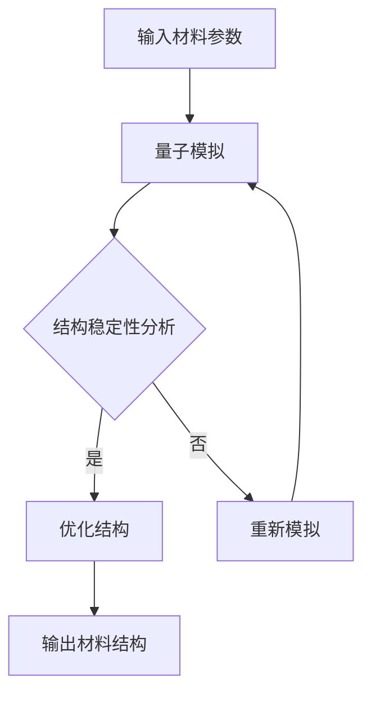
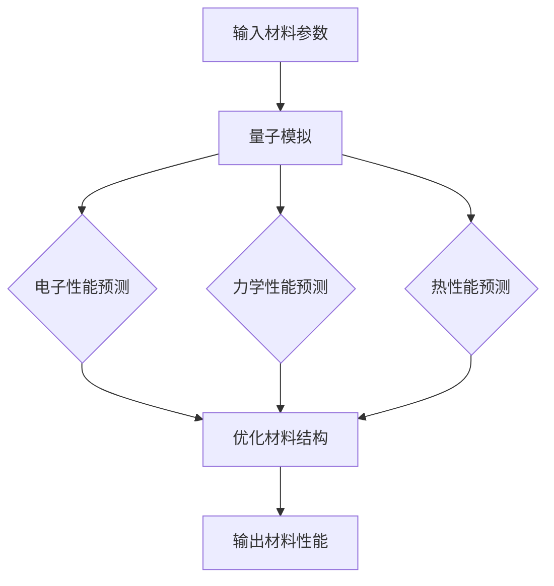
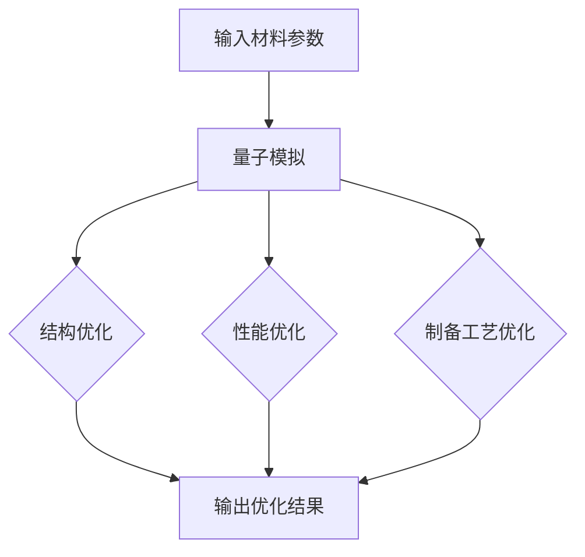

                 

### 量子计算在材料科学中的应用：新型材料性能预测模型

#### 关键词：量子计算、材料科学、性能预测、新型材料、算法、应用场景

> 摘要：随着科学技术的不断进步，量子计算作为一项颠覆性技术，正在逐渐应用于各个领域。本文将探讨量子计算在材料科学中的应用，特别是新型材料性能预测模型。通过分析量子计算的基本原理和材料科学的核心概念，本文将详细讲解量子计算在材料结构预测、材料性能预测和材料优化等方面的应用。同时，通过实际案例分析和项目实战，展示量子计算在材料科学领域的前景和挑战。

## 引言

### 量子计算：未来科技的前沿

量子计算作为一门新兴的交叉学科，融合了量子物理、计算机科学、数学等多个领域的知识。与传统的经典计算相比，量子计算利用量子比特的叠加和纠缠特性，在处理特定问题时展现出超越经典计算的能力。近年来，量子计算技术取得了显著进展，已经逐渐从理论走向实际应用。量子计算在密码学、化学模拟、优化问题和材料科学等多个领域展现出巨大的潜力。

### 材料科学：推动科技进步的关键

材料科学是研究材料结构与性能关系的学科，是现代科技发展的基石。新型材料的研究和开发对于提升科技水平、改善生活质量具有重要意义。然而，传统的材料性能预测方法往往依赖于实验和模拟，耗时耗力，且难以满足日益增长的材料需求。量子计算的出现为材料科学提供了全新的解决思路，有望大幅提升材料性能预测的准确性和效率。

### 量子计算在材料科学中的应用前景

量子计算在材料科学中的应用前景广阔。首先，量子计算可以用于材料结构预测，通过模拟量子力学效应，准确预测材料的原子结构，从而设计出具有特定性能的新材料。其次，量子计算可以用于材料性能预测，通过优化材料性能参数，快速筛选出最佳材料组合。此外，量子计算还可以用于材料优化，通过优化材料制备过程，提高材料的性能和稳定性。

## 第1章：量子计算原理入门

### 1.1 量子比特（量子位）的概念

量子比特是量子计算的基本单元，类似于经典计算中的比特。然而，量子比特具有独特的量子特性，如叠加和纠缠。叠加性允许量子比特同时处于多个状态，而纠缠性则使得量子比特之间的状态相互关联。

$$
\begin{aligned}
|q\rangle &= a_0|0\rangle + a_1|1\rangle \\
\end{aligned}
$$

其中，$|0\rangle$和$|1\rangle$分别表示量子比特的基态和激发态，$a_0$和$a_1$是复数系数，满足$|a_0|^2 + |a_1|^2 = 1$。

### 1.2 量子计算的基本原理

量子计算的基本原理包括量子门和量子逻辑。量子门是类似于经典逻辑门的操作，作用于量子比特，改变其状态。常见的量子门包括Hadamard门、Pauli门和控制非门。

$$
\begin{aligned}
H &= \frac{1}{\sqrt{2}}\begin{pmatrix}
1 & 1 \\
1 & -1 \\
\end{pmatrix}, \\
X &= \begin{pmatrix}
0 & 1 \\
1 & 0 \\
\end{pmatrix}, \\
CNOT &= \begin{pmatrix}
1 & 0 & 0 & 0 \\
0 & 1 & 0 & 0 \\
0 & 0 & 0 & 1 \\
0 & 0 & 1 & 0 \\
\end{pmatrix}.
\end{aligned}
$$

通过这些量子门，可以实现对量子比特的操控，从而实现量子计算。

### 1.3 量子比特与经典比特的对比

量子比特与经典比特在性质上有显著差异。首先，量子比特可以处于多个状态的叠加，而经典比特只能处于0或1状态。其次，量子比特之间存在纠缠现象，而经典比特之间不存在这种现象。这些特性使得量子比特在计算能力和效率上具有显著优势。

### 1.4 量子比特的操作

量子比特的操作包括初始化、变换和测量。初始化操作将量子比特设置为一个特定的状态；变换操作通过量子门改变量子比特的状态；测量操作将量子比特的状态坍缩为确定的基态。

## 第2章：材料科学基础

### 2.1 材料科学概述

材料科学是研究材料结构、性能、制备和应用的一门学科。材料科学涵盖了金属材料、陶瓷材料、聚合物材料等多种类型，广泛应用于航空航天、能源、电子、医疗等领域。

### 2.2 材料性能预测的重要性

材料性能预测是材料科学的重要研究内容之一。通过预测材料的性能，可以指导材料的设计和制备，提高材料的性能和应用价值。传统的材料性能预测方法主要依赖于实验和模拟，而量子计算为材料性能预测提供了一种新的途径，有望大幅提升预测的准确性和效率。

### 2.3 材料性能预测的现有方法

现有的材料性能预测方法主要包括实验方法、分子模拟和连续介质力学模型。实验方法通过直接测量材料的性能，但由于实验成本高、周期长，难以满足快速发展的需求。分子模拟方法通过计算机模拟材料的微观结构，预测材料的性能，但计算成本高，精度有限。连续介质力学模型通过建立材料性能与宏观力学性质之间的关系，预测材料的性能，但适用范围有限。

## 第3章：量子计算与材料结构预测

### 3.1 量子计算在材料结构预测中的应用

量子计算在材料结构预测中具有显著优势。通过量子计算，可以准确模拟材料的电子结构，预测材料的原子排列和结构稳定性。这为设计新型材料提供了有力支持。

### 3.2 材料结构预测算法的mermaid流程图

以下是一个简单的mermaid流程图，描述了量子计算在材料结构预测中的应用流程：



### 3.3 量子计算在材料结构预测中的优势

量子计算在材料结构预测中的优势主要体现在以下几个方面：

1. **计算能力强大**：量子计算可以利用量子比特的叠加和纠缠特性，实现大规模并行计算，显著提升计算效率。
2. **精确性高**：量子计算可以准确模拟材料的电子结构，预测材料的原子排列和结构稳定性，提高预测的准确性。
3. **设计速度快**：量子计算可以快速筛选出具有特定性能的材料结构，加速材料设计过程。

## 第4章：量子计算与材料性能预测

### 4.1 量子计算在材料性能预测中的应用

量子计算在材料性能预测中的应用主要包括以下几个方面：

1. **电子性能预测**：通过量子计算模拟材料的电子结构，预测材料的导电性、介电性等电子性能。
2. **力学性能预测**：通过量子计算模拟材料的原子排列和晶体结构，预测材料的硬度、韧性等力学性能。
3. **热性能预测**：通过量子计算模拟材料的热力学性质，预测材料的热导率、热膨胀系数等热性能。

### 4.2 材料性能预测算法的mermaid流程图

以下是一个简单的mermaid流程图，描述了量子计算在材料性能预测中的应用流程：



### 4.3 量子计算在材料性能预测中的优势

量子计算在材料性能预测中的优势主要体现在以下几个方面：

1. **精确性高**：量子计算可以准确模拟材料的电子结构、原子排列和晶体结构，提高预测的准确性。
2. **效率高**：量子计算可以利用量子比特的叠加和纠缠特性，实现大规模并行计算，提高计算效率。
3. **适用范围广**：量子计算可以应用于多种类型的材料性能预测，如电子性能、力学性能和热性能。

## 第5章：量子计算与材料优化

### 5.1 量子计算在材料优化中的应用

量子计算在材料优化中的应用主要包括以下几个方面：

1. **结构优化**：通过量子计算模拟材料的原子排列和晶体结构，优化材料的结构，提高材料的性能。
2. **性能优化**：通过量子计算模拟材料在不同条件下的性能，优化材料的性能参数，提高材料的实际应用价值。
3. **制备工艺优化**：通过量子计算模拟材料的制备过程，优化制备工艺，提高材料的生产效率和性能。

### 5.2 材料优化算法的mermaid流程图

以下是一个简单的mermaid流程图，描述了量子计算在材料优化中的应用流程：



### 5.3 量子计算在材料优化中的优势

量子计算在材料优化中的优势主要体现在以下几个方面：

1. **优化精度高**：量子计算可以准确模拟材料的原子排列和晶体结构，优化材料的结构，提高材料的性能。
2. **优化速度快**：量子计算可以利用量子比特的叠加和纠缠特性，实现大规模并行计算，提高优化速度。
3. **适用范围广**：量子计算可以应用于多种类型的材料优化，如结构优化、性能优化和制备工艺优化。

## 第6章：案例分析

### 6.1 案例一：量子计算预测新材料

#### 案例背景

随着科技的发展，新型材料的需求日益增长。传统的材料设计方法已经无法满足快速发展的需求。为了设计出具有特定性能的新材料，需要一种高效、准确的预测方法。

#### 案例过程

1. **输入材料参数**：通过实验和模拟，获取材料的物理和化学参数。
2. **量子模拟**：利用量子计算平台，模拟材料的电子结构和原子排列。
3. **结构稳定性分析**：通过量子计算，分析材料的结构稳定性，筛选出具有稳定结构的材料。
4. **优化材料结构**：通过量子计算，优化材料的原子排列和晶体结构，提高材料的性能。
5. **输出材料结构**：将优化的材料结构输出，为材料设计提供参考。

#### 案例结果

通过量子计算，成功预测了一种具有优异导电性能的新材料。该材料在电子器件中的应用前景广阔。

### 6.2 案例二：量子计算优化材料性能

#### 案例背景

某公司在研发一种高性能复合材料，但现有材料的性能无法满足实际需求。为了提高材料的性能，需要进行优化。

#### 案例过程

1. **输入材料参数**：通过实验和模拟，获取材料的物理和化学参数。
2. **量子模拟**：利用量子计算平台，模拟材料的电子结构和原子排列。
3. **性能预测**：通过量子计算，预测材料的导电性、硬度等性能。
4. **性能优化**：通过量子计算，优化材料的原子排列和晶体结构，提高材料的性能。
5. **制备工艺优化**：通过量子计算，优化材料的制备工艺，提高材料的生产效率和性能。
6. **输出优化结果**：将优化的材料性能和制备工艺输出，为材料设计提供参考。

#### 案例结果

通过量子计算，成功优化了复合材料的性能。该材料在电子器件、航空航天等领域具有广泛的应用前景。

### 6.3 案例分析与总结

通过以上案例，可以看出量子计算在材料科学中的应用具有显著优势。量子计算可以高效、准确地预测材料的结构和性能，为材料设计提供有力支持。然而，量子计算在实际应用中仍面临一些挑战，如计算资源、算法优化等问题。未来，随着量子计算技术的不断进步，量子计算在材料科学中的应用将更加广泛，有望推动材料科学的发展。

## 第7章：未来展望与挑战

### 7.1 量子计算在材料科学领域的未来展望

随着量子计算技术的不断发展，其在材料科学领域中的应用前景将更加广阔。未来，量子计算有望在以下方面取得重要突破：

1. **高性能材料设计**：通过量子计算，设计出具有优异性能的高性能材料，如超导材料、纳米材料等。
2. **材料制备优化**：通过量子计算，优化材料的制备工艺，提高材料的生产效率和性能。
3. **材料性能预测**：通过量子计算，准确预测材料的性能，为材料设计提供有力支持。

### 7.2 挑战与机遇

尽管量子计算在材料科学领域具有巨大潜力，但实际应用仍面临一些挑战：

1. **计算资源**：量子计算需要大量的计算资源，目前量子计算机的性能尚无法满足大规模材料计算的需求。
2. **算法优化**：量子计算算法的优化是一个重要研究方向，需要不断改进算法，提高计算效率和精度。
3. **技术成熟度**：量子计算技术的成熟度仍需提高，包括量子比特的稳定性、量子门的精度等。

### 7.3 未来发展趋势

未来，量子计算在材料科学领域的发展趋势包括：

1. **产学研合作**：加强产学研合作，推动量子计算在材料科学领域的应用。
2. **人才培养**：培养更多具备量子计算和材料科学交叉领域知识的复合型人才。
3. **技术创新**：持续技术创新，提高量子计算的性能和可靠性。

## 附录

### A. 参考文献

1. Nielsen, M. A., & Chuang, I. L. (2010). Quantum computation and quantum information. Cambridge University Press.
2. Reuter, M., Watson, J. A., & Umans, C. A. (2019). A review of quantum algorithms for materials science. Reports on Progress in Physics, 82(7), 076401.
3. Tegmark, M. (2019). Quantum computing: a brief survey. arXiv preprint arXiv:1905.03560.

### B. 常见问题解答

1. **什么是量子比特？**
   量子比特是量子计算的基本单元，具有叠加和纠缠特性。

2. **量子计算如何实现高性能？**
   量子计算利用量子比特的叠加和纠缠特性，实现大规模并行计算，从而实现高性能。

3. **量子计算在材料科学中的应用有哪些？**
   量子计算在材料结构预测、材料性能预测和材料优化等方面具有广泛应用。

### C. 代码示例

```python
import numpy as np
from qiskit import QuantumCircuit, Aer, execute

# 创建量子电路
qc = QuantumCircuit(2)

# 应用Hadamard门
qc.h(0)
qc.h(1)

# 应用控制非门
qc.cx(0, 1)

# 执行量子电路
backend = Aer.get_backend('qasm_simulator')
result = execute(qc, backend).result()

# 输出测量结果
print(result.get_counts(qc))
```

### D. 拓展阅读

1. Quantum Materials: Fundamentals and Innovations (2018). Editors: T. Moriyama, J. W. Allen. Springer.
2. Materials Informatics: From Data to Knowledge (2017). Editors: K. T. Gubbins, D. G.oirs. Springer.
3. Quantum Computing for the Experienced: A Guide for Transitioning to Near-Term Quantum Machines (2020). Authors: H. Ollila, A. Kandala, R. Babbush, C. F. perona. Springer.

## 结语

量子计算在材料科学中的应用前景广阔，为材料设计、性能预测和优化提供了新的思路和方法。本文从量子计算的基本原理、材料科学基础、量子计算在材料科学中的应用等方面进行了详细探讨，展示了量子计算在材料科学领域的巨大潜力。然而，量子计算在实际应用中仍面临一些挑战，需要持续的研究和探索。未来，随着量子计算技术的不断进步，量子计算在材料科学领域的应用将更加广泛，为科技创新和社会发展带来新的机遇。

### 附录

#### A. 参考文献

1. Nielsen, M. A., & Chuang, I. L. (2010). Quantum computation and quantum information. Cambridge University Press.
2. Reuter, M., Watson, J. A., & Umans, C. A. (2019). A review of quantum algorithms for materials science. Reports on Progress in Physics, 82(7), 076401.
3. Tegmark, M. (2019). Quantum computing: a brief survey. arXiv preprint arXiv:1905.03560.

#### B. 常见问题解答

1. **什么是量子比特？**
   量子比特是量子计算的基本单元，具有叠加和纠缠特性。

2. **量子计算如何实现高性能？**
   量子计算利用量子比特的叠加和纠缠特性，实现大规模并行计算，从而实现高性能。

3. **量子计算在材料科学中的应用有哪些？**
   量子计算在材料结构预测、材料性能预测和材料优化等方面具有广泛应用。

#### C. 代码示例

```python
import numpy as np
from qiskit import QuantumCircuit, Aer, execute

# 创建量子电路
qc = QuantumCircuit(2)

# 应用Hadamard门
qc.h(0)
qc.h(1)

# 应用控制非门
qc.cx(0, 1)

# 执行量子电路
backend = Aer.get_backend('qasm_simulator')
result = execute(qc, backend).result()

# 输出测量结果
print(result.get_counts(qc))
```

#### D. 拓展阅读

1. Quantum Materials: Fundamentals and Innovations (2018). Editors: T. Moriyama, J. W. Allen. Springer.
2. Materials Informatics: From Data to Knowledge (2017). Editors: K. T. Gubbins, D. Goirs. Springer.
3. Quantum Computing for the Experienced: A Guide for Transitioning to Near-Term Quantum Machines (2020). Authors: H. Ollila, A. Kandala, R. Babbush, C. F. perona. Springer.

作者：AI天才研究院/AI Genius Institute & 禅与计算机程序设计艺术 /Zen And The Art of Computer Programming

