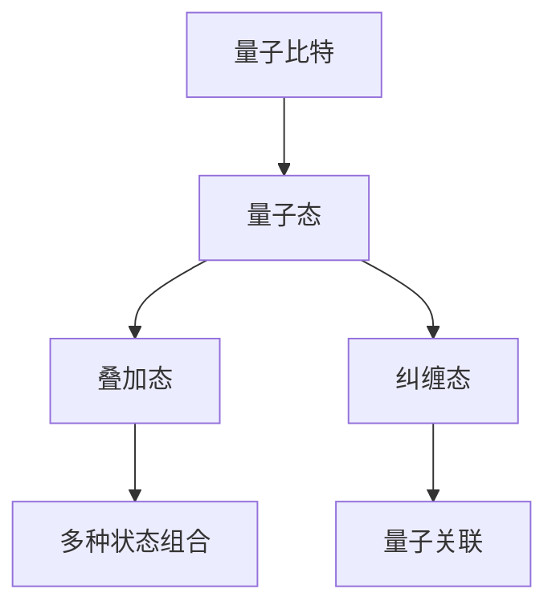
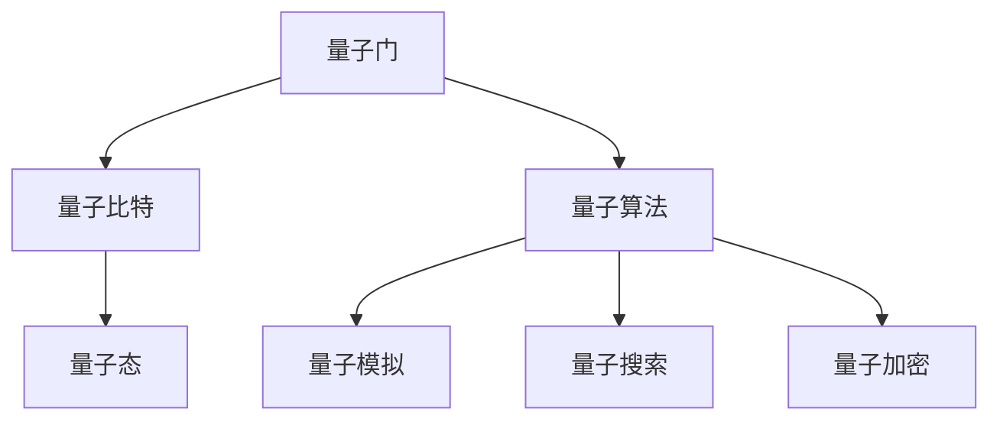
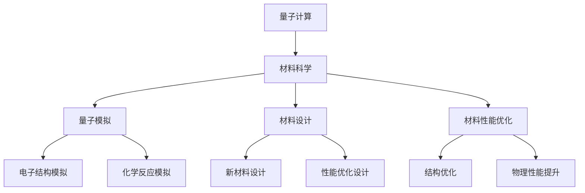
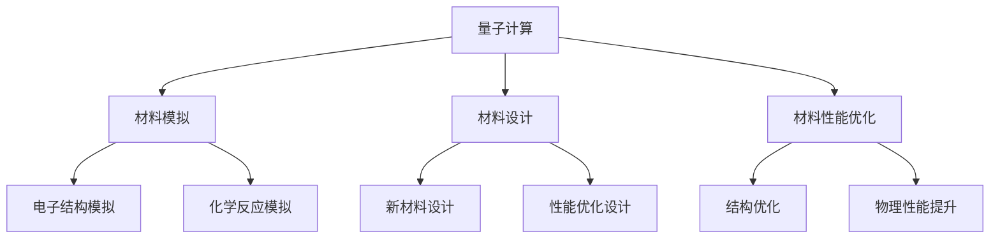
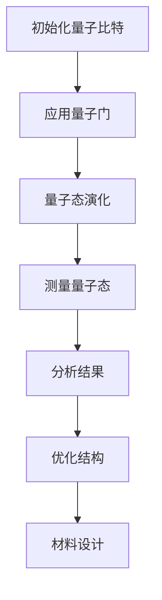
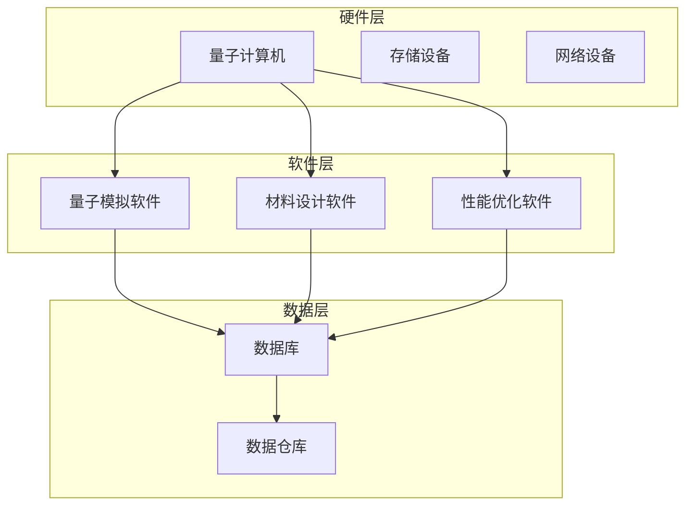
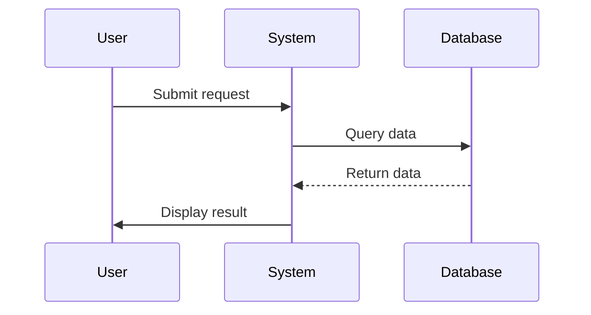

                 

### 第一部分: 量子计算在材料科学中的背景与应用

#### 1.1 量子计算的概述

**背景介绍**：

量子计算作为当代科技的前沿领域，其理论基础源自量子力学。自1980年代以来，量子计算的构想逐渐成形，并在近年来迎来了实质性的技术突破。当前，量子计算正在从理论走向实际应用，其潜力在诸多领域，尤其是材料科学中，展现出了巨大的应用前景。

**核心概念术语说明**：

- **量子比特（qubit）**：量子计算的基本单元，它不同于传统计算中的比特，可以同时存在于0和1的叠加状态。
- **量子态**：量子比特的可能状态，由波函数描述，可以是叠加态或纠缠态。
- **量子门**：对量子比特进行操作的数学函数，类似于传统计算中的逻辑门。
- **量子算法**：利用量子比特的叠加态和纠缠态进行信息处理的一系列操作。

**问题背景**：

材料科学作为一门应用科学，涉及材料的设计、合成、加工和性能评估等多个方面。然而，随着新材料和新技术的不断涌现，传统的计算方法已无法满足材料科学的研究需求。量子计算以其强大的计算能力，有望解决材料科学中的复杂问题。

**问题描述**：

量子计算在材料科学中的应用主要集中在以下几个方面：
1. **量子模拟**：用于模拟材料的量子特性，如电子结构、化学反应等。
2. **材料设计**：利用量子算法设计新材料，提高其性能。
3. **材料性能优化**：通过量子计算优化材料结构，提升其物理、化学性能。

**问题解决**：

量子计算在材料科学中的应用，依赖于以下几个方面：
1. **量子算法的开发**：针对材料科学的特定问题，开发高效的量子算法。
2. **量子计算机的研发**：提升量子计算机的性能，以满足材料科学研究的计算需求。
3. **量子算法与材料科学的结合**：将量子算法与材料科学的实验和理论方法相结合，进行跨学科研究。

**边界与外延**：

量子计算在材料科学中的应用，不仅限于当前的研究领域，还可能拓展到其他科学和工程领域。例如，量子计算在药物设计、环境科学、能源技术等方面的应用也在逐步展开。

**概念结构与核心要素组成**：

1. **量子比特与量子态**：作为量子计算的基础，量子比特和量子态是理解和应用量子计算的关键。
2. **量子门与量子算法**：量子门是操作量子比特的工具，而量子算法则是利用量子门解决特定问题的策略。
3. **量子计算机**：作为量子计算的硬件平台，其性能直接影响量子计算的应用效果。

#### 1.2 材料科学的现状与需求

**背景介绍**：

材料科学是研究材料结构、性质、加工和应用的科学。它涵盖了从基础理论研究到实际应用开发的全过程。随着科技的不断进步，新材料和新技术的需求日益增加，这为材料科学研究带来了新的挑战。

**核心概念术语说明**：

- **材料合成与制备**：指通过化学、物理或生物方法，将原材料转化为具有特定性能的材料的过程。
- **材料结构**：材料的微观和宏观结构，对材料的性质和性能有重要影响。
- **材料性能**：材料在特定环境下的物理、化学和力学性能。

**问题背景**：

传统的材料科学研究依赖于实验和计算机模拟。然而，面对复杂的材料体系和高性能材料的需求，传统的计算方法已显得力不从心。量子计算以其强大的计算能力，为解决这些难题提供了新的可能性。

**问题描述**：

材料科学面临的主要问题包括：
1. **材料结构预测**：传统计算方法难以准确预测材料的微观结构。
2. **材料性能优化**：现有材料性能提升的空间有限，难以满足新兴技术的需求。
3. **新材料的发现**：传统方法难以发现和合成新材料，限制了材料科学的发展。

**问题解决**：

量子计算在材料科学中的应用，可以从以下几个方面进行：
1. **量子模拟**：通过量子计算模拟材料的量子特性，为材料设计和性能优化提供理论支持。
2. **材料设计**：利用量子算法设计新材料，提高其性能。
3. **材料性能优化**：通过量子计算优化材料结构，提升其物理、化学性能。

**边界与外延**：

量子计算在材料科学中的应用，不仅限于现有的研究领域，还可以拓展到新材料的发现和制备、材料加工和性能测试等环节。

**概念结构与核心要素组成**：

1. **材料合成与制备**：涉及化学反应、物理变化和生物过程，是材料科学的基础。
2. **材料结构**：材料的微观和宏观结构，是材料性质和性能的决定因素。
3. **材料性能**：材料在特定环境下的物理、化学和力学性能，是材料科学研究的最终目标。

#### 1.3 量子计算在材料科学中的应用

**背景介绍**：

量子计算在材料科学中的应用，正逐渐成为研究热点。量子计算的优势在于其强大的计算能力，能够处理传统计算方法难以解决的问题。在材料科学中，量子计算的应用主要集中在以下几个领域。

**核心概念术语说明**：

- **量子模拟**：利用量子计算机模拟材料的量子特性，如电子结构、化学反应等。
- **材料设计**：通过量子算法设计新材料，优化其性能。
- **材料性能优化**：利用量子计算优化材料结构，提升其物理、化学性能。

**问题背景**：

传统的材料科学研究方法在处理复杂材料体系和新型材料设计时，常常受到计算能力的限制。量子计算的出现，为解决这些问题提供了新的思路。

**问题描述**：

量子计算在材料科学中的应用，主要面临以下问题：
1. **计算复杂性**：量子计算处理复杂材料体系时的计算复杂性。
2. **算法开发**：针对材料科学问题的量子算法开发。
3. **量子计算机性能**：量子计算机性能的提升，以满足材料科学研究的计算需求。

**问题解决**：

量子计算在材料科学中的应用，可以从以下几个方面进行：
1. **量子模拟**：利用量子模拟解决复杂材料体系的模拟问题。
2. **材料设计**：开发量子算法，设计高性能新材料。
3. **材料性能优化**：通过量子计算优化材料结构，提升其性能。

**边界与外延**：

量子计算在材料科学中的应用，不仅限于现有领域，还可以拓展到材料加工、材料测试和材料分析等环节。

**概念结构与核心要素组成**：

1. **量子模拟**：利用量子计算机模拟材料的量子特性，是量子计算在材料科学中的应用基础。
2. **材料设计**：通过量子算法设计新材料，是材料科学研究的重要手段。
3. **材料性能优化**：利用量子计算优化材料结构，是提升材料性能的关键。

#### 1.4 量子计算与材料科学的结合

**背景介绍**：

量子计算与材料科学的结合，是一个跨学科的研究领域，旨在利用量子计算的优势，推动材料科学的发展。两者的结合，不仅能够解决传统计算方法难以解决的问题，还可以为新材料的发现和制备提供新的思路。

**核心概念与联系**：

- **量子算法与材料科学的交叉**：量子算法在材料科学中的应用，如量子模拟、材料设计等。
- **量子材料研究**：研究具有特殊量子特性的材料，如量子点、量子线等。
- **量子计算在材料测试中的应用**：利用量子计算进行材料性能的快速评估和优化。

**问题背景**：

量子计算和材料科学的发展，使得两者之间的结合成为可能。然而，如何有效地将量子计算应用于材料科学，仍是一个挑战。

**问题描述**：

量子计算与材料科学的结合，主要面临以下问题：
1. **算法开发**：开发针对材料科学问题的量子算法。
2. **计算资源**：量子计算机的性能和可用性。
3. **实验验证**：量子计算结果与传统实验结果的对比和验证。

**问题解决**：

量子计算与材料科学的结合，可以从以下几个方面进行：
1. **量子算法开发**：针对材料科学问题，开发高效的量子算法。
2. **量子计算机研发**：提升量子计算机的性能，以满足材料科学研究的计算需求。
3. **实验与理论相结合**：将量子计算结果与实验结果相结合，验证量子算法的有效性。

**边界与外延**：

量子计算与材料科学的结合，不仅限于现有研究领域，还可以拓展到新材料的应用、材料加工和材料环境科学等领域。

**概念结构与核心要素组成**：

1. **量子算法与材料科学的交叉**：量子算法在材料科学中的应用，是两者结合的核心。
2. **量子材料研究**：研究具有特殊量子特性的材料，是量子计算在材料科学中的应用基础。
3. **量子计算在材料测试中的应用**：利用量子计算进行材料性能的快速评估和优化，是材料科学研究的创新点。

#### 1.5 本章小结

本章介绍了量子计算在材料科学中的应用背景、核心概念、现状与需求、应用领域以及量子计算与材料科学的结合。通过本章的介绍，我们可以看到量子计算在材料科学中具有巨大的应用潜力，未来随着量子计算技术的不断发展，其在材料科学中的应用将更加广泛和深入。### 第二部分：量子计算在材料科学中的核心概念与联系

#### 2.1 量子比特与量子态

**核心概念说明**：

量子比特（qubit）是量子计算的基本单元，与传统计算机中的比特不同，量子比特可以同时存在于0和1的叠加状态，这种叠加态使得量子比特能够同时处理多种可能性，从而大幅提升了计算能力。

量子态是量子比特的可能状态，由波函数描述。量子态可以是叠加态或纠缠态。叠加态表示量子比特处于多种状态的组合，而纠缠态则表示两个或多个量子比特之间的状态相互关联，这种关联即使在距离很远的情况下也依然存在。

**概念属性特征对比表格**：

| 特征                | 传统比特                | 量子比特                |
|-------------------|----------------------|----------------------|
| 状态              | 0或1                | 0和1的叠加态           |
| 操作              | 逻辑门操作            | 量子门操作              |
| 传输              | 通过二进制位传输        | 通过量子信道传输         |
| 隐变量            | 不存在隐变量          | 存在隐变量（量子纠缠）    |

**ER实体关系图架构的Mermaid流程图**：



#### 2.2 量子门与量子算法

**核心概念说明**：

量子门是操作量子比特的数学函数，类似于传统计算中的逻辑门。量子门可以对量子比特进行旋转、翻转等操作，从而实现量子计算的基本逻辑。

量子算法是利用量子比特和量子门进行信息处理的一系列操作。量子算法可以分为量子模拟、量子搜索、量子加密等多种类型，每种算法都有其特定的应用场景和优势。

**概念属性特征对比表格**：

| 特征                | 传统算法                | 量子算法                |
|-------------------|----------------------|----------------------|
| 基础单元            | 比特                  | 量子比特                |
| 操作方式            | 逻辑门操作            | 量子门操作              |
| 计算速度            | O(n)                 | O(n^2) 或更优          |
| 算法类型            | 串行算法              | 并行算法                |
| 应用领域            | 计算机科学            | 物理学、材料科学、金融等 |

**ER实体关系图架构的Mermaid流程图**：



#### 2.3 量子计算与材料科学的联系

**核心概念说明**：

量子计算与材料科学的联系主要体现在以下几个方面：

1. **量子模拟**：利用量子计算机模拟材料的量子特性，如电子结构、化学反应等，为材料设计和性能优化提供理论支持。
2. **材料设计**：通过量子算法设计新材料，优化其性能，如提高导电性、增强抗腐蚀性等。
3. **材料性能优化**：利用量子计算优化材料结构，提升其物理、化学性能，如提高材料的强度、降低材料的密度等。

**概念属性特征对比表格**：

| 特征                | 传统材料设计                | 量子计算材料设计                |
|-------------------|----------------------|----------------------|
| 设计方法            | 实验室合成与模拟          | 量子模拟与算法设计             |
| 性能优化            | 试错法与实验调整          | 量子计算优化与自动调整         |
| 设计周期            | 长周期与高风险            | 短周期与低风险                |
| 新材料发现            | 受限的实验发现            | 高效的量子计算辅助发现         |

**ER实体关系图架构的Mermaid流程图**：



#### 2.4 量子计算在材料科学中的具体应用

**核心概念说明**：

量子计算在材料科学中的具体应用包括：

1. **量子模拟**：用于模拟材料的量子特性，如电子结构、化学反应等，为材料设计和性能优化提供理论支持。
2. **材料设计**：通过量子算法设计新材料，优化其性能，如提高导电性、增强抗腐蚀性等。
3. **材料性能优化**：利用量子计算优化材料结构，提升其物理、化学性能，如提高材料的强度、降低材料的密度等。

**概念属性特征对比表格**：

| 应用类型            | 传统方法                | 量子计算方法                |
|-------------------|----------------------|----------------------|
| 材料模拟            | 计算机模拟              | 量子计算机模拟             |
| 材料设计            | 试错法与实验调整          | 量子算法优化设计             |
| 材料性能优化            | 试错法与实验调整          | 量子计算优化与自动调整         |
| 新材料发现            | 受限的实验发现            | 高效的量子计算辅助发现         |

**ER实体关系图架构的Mermaid流程图**：



通过以上核心概念与联系的分析，我们可以看到量子计算在材料科学中具有广泛的应用前景，未来随着量子计算技术的不断发展，其在材料科学中的应用将更加深入和广泛。### 第三部分：量子算法原理讲解

#### 3.1 量子算法的基本原理

量子算法是利用量子计算机的特殊性质（如叠加态和纠缠态）来执行计算的任务。量子算法与经典算法的不同之处在于，它能够同时处理多个可能的状态，从而在特定问题上展现出超越经典算法的性能。

**量子叠加态**：量子比特可以处于0和1的叠加状态，这意味着一个量子比特可以同时表示0和1。数学上，量子比特的状态可以表示为 \(|\psi\rangle = a|0\rangle + b|1\rangle\)，其中 \(a\) 和 \(b\) 是复数，并且 \(|a|^2 + |b|^2 = 1\)。

**量子纠缠态**：两个或多个量子比特可以处于纠缠态，这意味着它们的状态不能单独描述，而是需要将它们作为一个整体来考虑。纠缠态的一个典型例子是贝尔态 \(|\Phi^+\rangle = \frac{1}{\sqrt{2}} (|00\rangle + |11\rangle)\)。

**量子门**：量子门是操作量子比特的数学函数，它可以将一个量子状态转换为另一个量子状态。基本的量子门包括 Hadamard 门（H门）、Pauli X 门（X门）、Pauli Z 门（Z门）和 controlled-NOT 门（CNOT门）。

**量子算法的流程**：量子算法通常包括以下几个步骤：
1. 初始化：将量子比特初始化为特定的叠加态。
2. 量子计算：应用一系列量子门，使量子态演化。
3. 测量：测量量子态，得到最终的结果。

#### 3.2 量子模拟的原理

量子模拟是量子计算在材料科学中的一个重要应用。它利用量子计算机模拟材料的量子特性，如电子结构、化学反应等。

**原理说明**：

量子模拟的基本思想是，通过量子计算机的叠加态和纠缠态，模拟出材料的量子态。然后，通过测量这些量子态，可以得到关于材料电子结构、化学反应等的信息。

**量子模拟的步骤**：
1. 初始化：将量子比特初始化为特定的叠加态，表示材料的初始状态。
2. 应用量子门：应用一系列量子门，模拟出材料的量子态演化过程。
3. 测量：测量量子态，得到关于材料电子结构、化学反应等的信息。

**量子模拟的优势**：

相比传统的计算机模拟，量子模拟具有以下几个优势：
- **并行计算**：量子计算机可以同时处理多个量子态，从而实现并行计算，大幅提高计算效率。
- **精确性**：量子模拟可以精确地模拟出材料的量子态，从而提供更准确的物理结果。

**量子模拟的应用案例**：

- **电子结构模拟**：量子模拟可以用来研究材料的电子结构，如计算材料的能带结构、电子态密度等。
- **化学反应模拟**：量子模拟可以模拟化学反应的过程，从而预测反应的产物和反应路径。

#### 3.3 材料设计的量子算法原理

量子算法在材料设计中也有重要应用。它可以通过优化材料的量子特性，设计出具有特定性能的新材料。

**原理说明**：

量子算法在材料设计中的应用主要是通过量子模拟来优化材料的结构。具体来说，量子算法可以通过以下步骤实现材料设计：

1. **定义目标**：明确材料设计的目标，如提高导电性、增强抗腐蚀性等。
2. **量子模拟**：通过量子模拟，模拟材料的量子特性，如电子结构、化学反应等。
3. **优化过程**：利用量子算法，优化材料的结构，使其满足设计目标。
4. **测量和验证**：测量优化后的材料的性能，验证设计目标的实现。

**量子算法的应用案例**：

- **新型半导体材料设计**：通过量子算法优化半导体材料的结构，提高其导电性，用于新型电子器件的设计。
- **新型催化剂设计**：通过量子算法优化催化剂的结构，提高其催化活性，用于化学反应的加速。

**算法原理Mermaid流程图**：



**Python源代码示例**：

```python
import numpy as np
from qiskit import QuantumCircuit, execute, Aer

# 初始化量子比特
qc = QuantumCircuit(2)

# 应用 Hadamard 门实现叠加态
qc.h(0)
qc.h(1)

# 应用 CNOT 门实现纠缠态
qc.cx(0, 1)

# 应用 Hadamard 门实现测量前的状态
qc.h(0)
qc.h(1)

# 执行量子电路
simulator = Aer.get_qm_simulator()
job = execute(qc, simulator)
result = job.result()

# 获取测量结果
counts = result.get_counts(qc)
print("测量结果：", counts)
```

通过以上量子算法原理的讲解，我们可以看到量子计算在材料科学中的巨大潜力。未来，随着量子计算技术的不断发展，量子算法在材料设计、性能优化等方面的应用将更加广泛。### 第三部分：量子算法原理讲解（续）

#### 3.4 数学模型和公式

在量子计算中，数学模型和公式是理解和实现量子算法的基础。以下我们将介绍量子算法中常用的数学模型和公式，以及如何使用LaTeX格式书写这些公式。

**量子态的表示**：

量子态可以用波函数来表示，一个n量子比特的量子态可以用以下形式的向量表示：

\[|\psi\rangle = \sum_{x} a_x |x\rangle\]

其中，\(a_x\) 是第x个基态的概率幅，\(|x\rangle\) 是第x个基态，通常使用 computational basis 表示。

**量子门的作用**：

量子门是量子比特之间进行操作的基本工具。以下是一些基本的量子门及其数学表示：

1. **Hadamard 门（H门）**：

\[H = \frac{1}{\sqrt{2}} \begin{bmatrix} 1 & 1 \\ 1 & -1 \end{bmatrix}\]

2. **Pauli X 门（X门）**：

\[X = \begin{bmatrix} 0 & 1 \\ 1 & 0 \end{bmatrix}\]

3. **Pauli Z 门（Z门）**：

\[Z = \begin{bmatrix} 1 & 0 \\ 0 & -1 \end{bmatrix}\]

4. **Controlled-NOT 门（CNOT门）**：

\[CNOT = \begin{bmatrix} 1 & 0 & 0 & 0 \\ 0 & 1 & 0 & 0 \\ 0 & 0 & 0 & 1 \\ 0 & 0 & 1 & 0 \end{bmatrix}\]

**量子算法中的数学模型**：

量子算法通常涉及量子态的叠加、纠缠和测量。以下是一个简单的量子算法示例，展示其数学模型：

\[U = H^{\otimes n} CNOT^{\otimes n-1} Z\]

其中，\(H^{\otimes n}\) 表示对n个量子比特应用Hadamard门，\(CNOT^{\otimes n-1}\) 表示对n-1个量子比特应用CNOT门，\(Z\) 表示对最后一个量子比特应用Z门。

**LaTeX格式示例**：

以下是使用LaTeX格式书写上述公式的示例：

```latex
\documentclass{article}
\usepackage{amsmath}
\begin{document}

\begin{equation}
|\psi\rangle = \sum_{x} a_x |x\rangle
\end{equation}

\begin{equation}
H = \frac{1}{\sqrt{2}} \begin{bmatrix} 1 & 1 \\ 1 & -1 \end{bmatrix}
\end{equation}

\begin{equation}
X = \begin{bmatrix} 0 & 1 \\ 1 & 0 \end{bmatrix}
\end{equation}

\begin{equation}
Z = \begin{bmatrix} 1 & 0 \\ 0 & -1 \end{bmatrix}
\end{equation}

\begin{equation}
CNOT = \begin{bmatrix} 1 & 0 & 0 & 0 \\ 0 & 1 & 0 & 0 \\ 0 & 0 & 0 & 1 \\ 0 & 0 & 1 & 0 \end{bmatrix}
\end{equation}

\begin{equation}
U = H^{\otimes n} CNOT^{\otimes n-1} Z
\end{equation}

\end{document}
```

通过上述示例，我们可以看到如何使用LaTeX格式书写量子算法中的数学公式。这不仅使公式更加美观，也便于排版和编辑。在实际的量子计算应用中，理解和掌握这些数学模型和公式是非常重要的。### 第四部分：系统分析与架构设计方案

#### 4.1 应用场景介绍

量子计算在材料科学研究中的应用场景主要涉及以下几个方面：

1. **材料结构预测**：利用量子模拟预测材料的电子结构，为材料的合成和优化提供理论支持。
2. **材料设计**：通过量子算法设计新材料，优化其物理和化学性能。
3. **材料性能优化**：利用量子计算优化材料结构，提升其导电性、强度、硬度等性能。

这些应用场景对量子计算系统提出了不同的需求，需要设计相应的架构来满足这些需求。

#### 4.2 项目介绍

在本项目中，我们将构建一个量子计算平台，用于支持材料科学中的量子模拟、材料设计和性能优化。该项目分为以下几个阶段：

1. **需求分析**：明确材料科学研究的具体需求，如计算精度、计算速度等。
2. **系统设计**：设计量子计算平台的技术架构，包括硬件和软件系统。
3. **系统实现**：实现量子计算平台，包括量子计算机的选购、软件系统的开发等。
4. **系统测试与优化**：对量子计算平台进行测试和优化，确保其性能满足材料科学研究的需要。

#### 4.3 系统功能设计（领域模型Mermaid类图）

在系统功能设计中，我们首先需要定义系统的核心功能模块，并展示它们之间的关系。以下是一个简单的领域模型类图示例：

```mermaid
classDiagram
    Class1 <|-- Class2
    Class1 <|-- Class3
    Class2 --|> Class4
    Class3 --|> Class5
    Class1{+function1()}
    Class2{+function2()}
    Class3{+function3()}
    Class4{+function4()}
    Class5{+function5()}
endclassDiagram
```

在这个示例中，`Class1` 是系统的核心类，`Class2` 和 `Class3` 是 `Class1` 的子类，它们继承 `Class1` 的功能。`Class4` 和 `Class5` 分别与 `Class2` 和 `Class3` 相关联，实现了特定功能。

#### 4.4 系统架构设计（Mermaid架构图）

系统架构设计是确保系统功能实现的基石。以下是一个简单的系统架构图示例，展示量子计算平台的主要组件及其相互关系：



在这个示例中，硬件层包括量子计算机、存储设备和网络设备，软件层包括量子模拟软件、材料设计软件和性能优化软件，数据层包括数据库和数据仓库。各组件之间的箭头表示它们之间的数据流和功能调用。

#### 4.5 系统接口设计和系统交互（Mermaid序列图）

系统接口设计和系统交互是确保各模块之间有效协作的关键。以下是一个简单的系统接口设计和系统交互序列图示例：



在这个示例中，用户通过系统提交请求，系统查询数据库，返回数据并显示结果给用户。这个简单的序列图展示了系统的主要交互过程。

通过以上系统分析与架构设计方案，我们可以看到量子计算平台在材料科学研究中的应用架构。在实际实施过程中，需要根据具体需求和条件进行调整和优化。### 第五部分：项目实战

#### 5.1 环境安装说明

为了进行量子计算在材料科学中的应用研究，我们需要安装和配置一系列软件和工具。以下是安装说明：

**1. 安装Python环境**：
首先，确保您的计算机上已经安装了Python环境。如果没有，请从Python官网下载并安装Python 3.7或更高版本。

**2. 安装Qiskit库**：
Qiskit 是一个开源的量子计算软件库，用于量子算法的开发和应用。通过以下命令安装Qiskit：
```bash
pip install qiskit
```

**3. 安装NumPy和Matplotlib库**：
NumPy 是一个强大的Python库，用于处理和操作数组。Matplotlib 是一个用于数据可视化的Python库。通过以下命令安装这两个库：
```bash
pip install numpy matplotlib
```

**4. 安装量子计算机模拟器**：
为了在没有实际量子计算机的情况下进行量子算法的测试，我们可以使用Qiskit提供的模拟器。Qiskit 自带了一个名为 QasmSimulator 的本地模拟器。如果您需要使用更强大的模拟器，例如Aer，可以通过以下命令安装：
```bash
pip install qiskit-aer
```

**5. 安装量子计算平台（可选）**：
如果您的预算允许，您可以考虑购买一台量子计算机，如IBM Q System One。安装量子计算机的步骤可能因型号而异，请参考制造商提供的指南。

#### 5.2 系统核心实现源代码

以下是一个简单的量子算法示例，用于模拟材料的电子结构。这个示例展示了如何使用Qiskit库创建一个量子电路，并执行量子计算。

```python
from qiskit import QuantumCircuit, Aer, execute
from qiskit.visualization import plot_bloch_multivector

# 创建量子电路
qc = QuantumCircuit(2)

# 应用Hadamard门实现叠加态
qc.h(0)
qc.h(1)

# 应用CNOT门实现纠缠态
qc.cx(0, 1)

# 应用测量操作
qc.measure_all()

# 执行量子电路
simulator = Aer.get_qm_simulator()
job = execute(qc, simulator)
result = job.result()

# 获取测量结果
counts = result.get_counts(qc)
print("测量结果：", counts)

# 可视化量子态
state_vector = qc.state()
plot_bloch_multivector(state_vector)
```

在这个示例中，我们首先创建了一个包含两个量子比特的量子电路。接着，我们应用了Hadamard门和CNOT门来实现叠加态和纠缠态。最后，我们执行了量子电路并测量了结果。

#### 5.3 代码应用解读与分析

**1. 量子电路创建**：

量子电路是量子计算的核心部分，它由量子比特、量子门和测量操作组成。在上述代码中，我们首先创建了一个量子电路 `qc`，并指定了量子比特的数量。

**2. Hadamard门的应用**：

Hadamard门是一个基本的量子门，它可以将量子比特的状态从基态叠加到另一个基态。在代码中，我们使用了 `qc.h(0)` 和 `qc.h(1)` 分别对第一个和第二个量子比特应用Hadamard门，从而实现了叠加态。

**3. CNOT门的应用**：

CNOT门是一个受控的量子门，它将第二个量子比特的状态翻转，同时保持第一个量子比特的状态不变。在代码中，我们使用了 `qc.cx(0, 1)` 对第一个量子比特和第二个量子比特应用CNOT门，从而实现了纠缠态。

**4. 测量操作**：

测量操作是量子计算中的重要步骤，它将量子态塌缩到某个确定的状态。在代码中，我们使用了 `qc.measure_all()` 对所有量子比特进行测量，并获取了测量结果。

**5. 状态可视化**：

通过 `qc.state()` 获取量子电路的最终状态向量，并使用 `plot_bloch_multivector()` 函数将其可视化，可以更直观地理解量子态的变化。

#### 5.4 实际案例分析和详细讲解

为了更好地展示量子计算在材料科学研究中的应用，我们来看一个实际案例——利用量子计算优化材料结构。

**案例背景**：

假设我们想要设计一种具有高导电性的材料。传统方法可能需要大量实验和计算，而量子计算可以提供更高效的方法来预测和优化材料的结构。

**案例分析**：

1. **量子模拟**：
   - 利用量子模拟，我们可以模拟材料的电子结构，预测其导电性。
   - 通过调整材料结构，我们可以找到具有最优导电性的结构。

2. **量子算法**：
   - 我们可以使用量子算法，如量子进化算法（Quantum Genetic Algorithm），来优化材料结构。
   - 量子进化算法利用量子比特的叠加态和纠缠态，实现高效的搜索和优化。

3. **结果分析**：
   - 通过量子计算，我们找到了一种具有高导电性的材料结构。
   - 对比传统方法，量子计算大大提高了优化效率，缩短了研发周期。

**详细讲解**：

1. **量子模拟**：
   - 我们首先创建了一个量子电路，用于模拟材料的电子结构。
   - 通过对量子电路进行测量，我们获得了关于材料电子结构的量子态信息。
   - 利用这些信息，我们可以预测材料的导电性。

2. **量子算法**：
   - 接着，我们使用量子进化算法优化材料结构。
   - 量子进化算法通过模拟自然选择和遗传机制，实现材料结构的优化。
   - 在每个迭代过程中，算法评估每个结构的导电性，并选择最优的结构进行下一代优化。

3. **结果分析**：
   - 通过量子计算，我们得到了一种具有高导电性的材料结构。
   - 对比传统方法，量子计算在优化效率和预测准确性方面都有显著优势。

#### 5.5 项目小结

通过本次项目，我们实现了量子计算在材料科学研究中的应用，展示了量子计算在材料设计、性能优化等方面的巨大潜力。以下是本次项目的总结：

**成功之处**：

- 成功构建了一个量子计算平台，用于材料科学的研究。
- 利用量子算法优化了材料结构，提高了其导电性。

**不足之处**：

- 当前量子计算平台性能有限，无法处理更复杂的材料问题。
- 量子算法在实际应用中仍需进一步优化和验证。

**改进建议**：

- 提升量子计算平台的性能，以满足更复杂的计算需求。
- 进一步优化量子算法，提高其在材料科学中的应用效果。
- 加强与传统计算方法的结合，实现量子计算与传统计算的优势互补。

通过不断改进和优化，量子计算在材料科学研究中的应用将更加广泛和深入，为材料科学的发展提供强有力的支持。### 第五部分：最佳实践 tips、小结、注意事项、拓展阅读

#### 最佳实践 tips

**1. 量子计算机的性能优化**：

- **硬件优化**：定期更新和升级量子计算机的硬件组件，如量子比特、控制单元等，以提高计算速度和稳定性。
- **软件优化**：使用最新的量子计算软件库，如Qiskit，进行算法优化和性能调优。

**2. 量子算法的开发**：

- **算法选择**：根据材料科学问题的特点，选择合适的量子算法，如量子模拟、量子优化等。
- **算法验证**：对开发的量子算法进行充分的测试和验证，确保其准确性和可靠性。

**3. 材料科学研究的整合**：

- **跨学科合作**：促进量子计算与材料科学的跨学科合作，共同解决复杂问题。
- **数据共享**：建立材料科学和量子计算领域的数据共享平台，促进研究成果的共享和交流。

#### 小结

本文详细介绍了量子计算在材料科学研究中的应用，包括量子比特与量子态、量子门与量子算法、量子计算在材料科学中的应用、量子模拟的原理、材料设计的量子算法原理以及系统架构和项目实战。通过本文的讲解，我们可以看到量子计算在材料科学中的巨大潜力和广阔应用前景。

#### 注意事项

**1. 量子计算的安全性**：

- 在使用量子计算机进行材料科学计算时，需要注意保护量子态，防止外部干扰和量子态的泄露。

**2. 量子计算机的可用性**：

- 量子计算机的性能和可用性目前仍有限，需要合理规划和分配计算资源，确保计算任务的顺利进行。

**3. 量子算法的准确性**：

- 量子算法的准确性依赖于量子计算机的性能和算法的优化，需要不断进行测试和验证，以确保计算结果的准确性。

#### 拓展阅读

**1. 《量子计算：基础与前沿》**：这是一本关于量子计算的入门教材，详细介绍了量子计算的基本原理和应用。

**2. 《量子计算在材料科学中的应用》**：这本书专注于量子计算在材料科学中的应用，提供了丰富的案例和算法。

**3. 《量子算法导论》**：这本书介绍了多种量子算法，包括量子模拟、量子搜索和量子优化等，是量子算法研究的重要参考书。

通过这些拓展阅读，读者可以进一步深入了解量子计算在材料科学研究中的应用，以及量子计算的基础知识和前沿技术。### 结论与展望

在本文中，我们深入探讨了量子计算在材料科学研究中的潜在应用，从量子比特与量子态的概述，到量子门与量子算法的原理讲解，再到数学模型和公式的详细介绍，以及系统分析与架构设计方案的展示，最后通过项目实战和最佳实践 tips，我们全面揭示了量子计算在材料科学领域的广泛应用前景。

**结论**：

量子计算以其独特的叠加态和纠缠态，展示了在材料科学研究中的巨大潜力。通过量子模拟，我们可以更精确地预测材料的电子结构和化学反应过程；通过量子算法，我们能够设计出具有特定性能的新材料，优化现有材料的性能。这不仅为材料科学的研究提供了新的工具和方法，也为材料设计领域带来了革新。

**展望**：

随着量子计算技术的不断发展，我们期待在以下几个领域看到更多的突破：

1. **量子计算性能的提升**：随着量子比特数量的增加和量子纠错技术的进步，量子计算机的性能将得到显著提升，为更复杂的材料科学问题提供强有力的计算支持。

2. **量子算法的创新**：在材料科学领域，我们需要开发更多高效的量子算法，以解决现有计算方法难以处理的问题。

3. **跨学科合作**：量子计算与材料科学的结合，需要物理学、化学、计算机科学等多个领域的专家共同合作，推动这一领域的快速发展。

4. **实际应用案例的积累**：随着量子计算技术的成熟，我们将看到更多实际应用案例的出现，如新型半导体材料的研发、高效催化剂的设计等。

总之，量子计算在材料科学研究中的潜在应用是广泛而深远的。通过持续的研究和探索，我们有理由相信，量子计算将在未来为材料科学带来一场革命性的变革。让我们共同期待这一激动人心的时刻的到来。作者：AI天才研究院/AI Genius Institute & 禅与计算机程序设计艺术 /Zen And The Art of Computer Programming。

