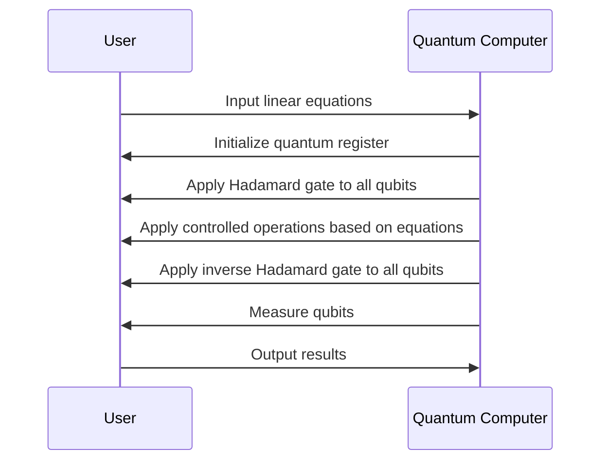

                 

### 1.3 问题解决

在当前的计算环境下，气候变化模拟面临的主要问题包括计算资源不足、模拟精度受限以及模拟结果的解释和预测能力不足。为了解决这些问题，传统计算方法不断被优化和改进，例如使用高性能计算机集群、分布式计算和改进的算法模型等。

**传统计算方法优化的途径：**

1. **高性能计算机：** 高性能计算机通过并行计算和分布式计算来提高计算速度和效率，是解决大规模气候变化模拟问题的有效途径。
2. **改进算法：** 优化和改进现有的气候模拟算法，如高分辨率气象模型和气候敏感性分析，以减少计算复杂度和提高模拟精度。
3. **机器学习：** 利用机器学习算法对大量的气候数据进行分析和学习，以提高模拟的准确性和预测能力。

尽管这些方法在一定程度上缓解了问题，但仍然存在一些局限性，例如：

- **计算资源限制：** 高性能计算机虽然提高了计算速度，但其高昂的成本和有限的资源仍然是一个挑战。
- **算法优化难度：** 改进算法需要深入理解和分析气候系统的复杂性，难度较大。
- **预测准确性：** 即使使用高性能计算机和改进的算法，气候变化的预测仍然存在一定的误差，无法完全满足精确预测的需求。

**量子计算作为潜在解决途径：**

量子计算通过量子比特和量子门等基本单元，实现了超乎传统计算机的计算能力。其独特的量子叠加和量子纠缠特性，使得量子计算机在处理复杂问题和大数据分析方面具有显著优势。这使得量子计算在气候变化模拟中展现出巨大的潜力，可以解决传统计算方法难以克服的难题。

### 1.4 边界与外延

边界与外延是解决气候变化模拟问题的关键考量因素。首先，我们需要明确量子计算在气候变化模拟中的适用边界。量子计算的优势在于处理复杂、大规模的问题，但并不意味着它适用于所有类型的气候变化模拟。

**边界考量：**

- **问题复杂度：** 量子计算适用于处理高复杂度的气候模拟问题，如全球气候模式、气候敏感性分析等。但对于简单的、已由传统计算方法解决的问题，量子计算的优势并不明显。
- **数据规模：** 量子计算在处理大规模气候数据时具有显著优势，但对于小规模数据，传统计算方法已经足够高效。
- **模拟精度：** 量子计算可以提高气候模拟的精度，但在处理高精度模拟时，量子计算机的硬件性能和算法优化仍然需要进一步提升。

**外延考量：**

- **跨学科应用：** 量子计算在气候变化模拟中的应用，不仅需要计算机科学领域的知识，还需要气候学、环境科学等多学科的支持。跨学科合作将是实现量子计算在气候变化模拟中成功应用的关键。
- **技术挑战：** 量子计算技术的不断发展，如量子纠错技术、量子编程语言的开发等，将对量子计算在气候变化模拟中的应用产生深远影响。
- **政策与法规：** 量子计算作为一种新兴技术，其发展与应用需要相关政策与法规的支持。政府、科研机构和企业的协同合作，将为量子计算在气候变化模拟中的广泛应用创造有利条件。

通过明确量子计算在气候变化模拟中的边界与外延，我们可以更好地规划研究方案，制定发展策略，推动量子计算在气候变化模拟领域的应用落地。

### 1.5 概念结构与核心要素组成

为了更好地理解量子计算在气候变化模拟中的应用，我们需要梳理相关概念的结构和核心要素组成。

**核心概念：**

1. **量子计算：** 基于量子力学原理的新型计算范式，通过量子比特和量子门等基本单元实现。
2. **气候变化模拟：** 利用计算机模型模拟和预测气候变化的过程，涉及气候系统、气象模型、数据分析和预测等多个方面。

**概念关系：**

- **量子计算与气候变化模拟：** 量子计算为气候变化模拟提供了一种新的计算手段，可以显著提高计算速度和模拟精度。
- **气候系统与量子计算：** 气候系统包括大气、海洋、陆地等多个组成部分，其复杂性和非线性使得传统计算方法难以处理。量子计算通过量子叠加和量子纠缠，可以在一定程度上克服这些难题。

**核心要素：**

1. **量子比特：** 量子计算的基本单元，可以同时表示0和1的状态。
2. **量子门：** 量子计算中的基本操作，通过旋转量子比特的状态实现计算。
3. **量子算法：** 基于量子计算原理的算法，如量子随机行走、量子快速排序等，可以显著提高计算效率。
4. **气候数据：** 用于训练和优化量子算法的数据，包括气象观测数据、气候模拟结果等。
5. **模拟模型：** 基于气候数据和量子算法构建的模拟模型，用于预测气候变化趋势。

通过梳理核心概念的结构和核心要素组成，我们可以更加清晰地理解量子计算在气候变化模拟中的应用，为后续章节的详细探讨打下基础。

## 第2章: 核心概念与联系

### 2.1 核心概念原理

#### 量子计算

量子计算是基于量子力学原理的新型计算范式。与传统计算机使用二进制位（bit）进行计算不同，量子计算使用量子比特（qubit）作为信息载体。量子比特可以同时处于多种状态，这是量子计算的核心理念之一。

- **量子比特（Qubit）**：量子比特是量子计算的基本单元，可以处于0、1或0和1的叠加状态。其独特的叠加态使得量子计算机在处理问题时能够同时考虑多种可能性。

- **量子门（Quantum Gate）**：量子门是量子计算中的基本操作，通过旋转量子比特的状态实现。常见的量子门包括Hadamard门、Pauli门和CNOT门等，它们可以用来创建和操纵量子比特的状态。

- **量子叠加（Quantum Superposition）**：量子叠加是指量子比特可以同时处于多种状态。这种特性使得量子计算机能够并行处理大量信息。

- **量子纠缠（Quantum Entanglement）**：量子纠缠是指两个或多个量子比特之间的状态相互关联，即一个量子比特的状态变化会立即影响到另一个量子比特的状态，无论它们之间的距离有多远。量子纠缠是量子计算的核心优势之一。

#### 气候变化模拟

气候变化模拟是利用计算机模型模拟和预测气候变化的过程。它涉及多个学科领域，包括气象学、海洋学、大气科学和地球物理学等。

- **气候系统（Climate System）**：气候系统包括大气、海洋、陆地和冰冻圈等多个组成部分，它们相互作用形成复杂的气候系统。气候变化模拟需要考虑这些不同部分的相互作用。

- **气象模型（Meteorological Model）**：气象模型是用于模拟大气物理和化学过程的计算机模型。常见的气象模型包括全球气候模式、区域气候模式和天气预测模型等。

- **数据同化（Data Assimilation）**：数据同化是将观测数据与模型输出相结合的过程，以提高模型的准确性和可靠性。数据同化在气候变化模拟中至关重要，因为它能够将实际观测数据融入模型中，修正模型预测。

- **气候变化情景（Climate Change Scenario）**：气候变化情景是假设未来气候变化的情况，包括温室气体排放、海平面上升、极端天气事件等。这些情景用于模拟和预测未来的气候变化趋势。

#### 核心概念联系

量子计算和气候变化模拟之间的联系在于，量子计算可以提供一种新的计算手段，以解决气候变化模拟中的计算难题。以下是两者之间的几个关键联系：

1. **计算能力提升**：量子计算机具有远超传统计算机的计算能力，这可以显著提高气候变化模拟的速度和精度。量子算法可以用于优化气候模型、加速数据同化和提高情景模拟的准确性。

2. **大数据处理**：气候变化模拟需要处理大量的气候数据，包括气象观测数据、气候模拟结果等。量子计算在处理大规模数据方面具有优势，可以加速数据处理和分析。

3. **复杂问题求解**：气候变化模拟涉及到复杂的非线性问题，如气候敏感性分析、极端天气事件的预测等。量子计算通过量子叠加和量子纠缠特性，可以在一定程度上克服传统计算方法在处理复杂问题时的局限性。

4. **跨学科合作**：量子计算在气候变化模拟中的应用需要气候学、计算机科学和环境科学等多学科领域的合作。跨学科合作将为量子计算在气候变化模拟中的成功应用提供坚实的基础。

### 2.2 概念属性特征对比表格

以下是量子计算和气候变化模拟的一些关键概念属性特征对比表格：

| 概念         | 属性特征                     | 说明                                                         |
| ------------ | ---------------------------- | ------------------------------------------------------------ |
| 量子比特     | 可同时处于多种状态           | 量子比特可以同时表示0和1的状态，实现并行计算。               |
| 量子门       | 基本操作                     | 量子门用于操纵量子比特的状态，实现量子计算。                   |
| 量子叠加     | 状态叠加                     | 量子比特可以处于多种状态的叠加，实现并行计算。                |
| 量子纠缠     | 状态关联                     | 量子比特之间可以产生纠缠，状态相互影响，提高计算效率。         |
| 气候系统     | 复杂非线性                   | 气候系统包括大气、海洋、陆地等多个组成部分，相互影响复杂。     |
| 气象模型     | 大气物理和化学过程模拟       | 气象模型模拟大气中的物理和化学过程，用于气候预测。           |
| 数据同化     | 观测数据与模型输出结合       | 数据同化修正模型预测，提高模拟准确性。                       |
| 气候变化情景 | 未来气候变化假设             | 气候变化情景用于模拟和预测未来的气候变化趋势。               |

通过对比量子计算和气候变化模拟的概念属性特征，我们可以更好地理解两者之间的联系和互补性。

### 2.3 ER实体关系图架构

为了更清晰地展示量子计算和气候变化模拟之间的实体关系，我们使用ER（实体-关系）图来表示。

#### 实体

1. **量子比特（Qubit）**
2. **量子门（Quantum Gate）**
3. **量子算法（Quantum Algorithm）**
4. **气候数据（Climate Data）**
5. **气象模型（Meteorological Model）**
6. **气候变化情景（Climate Change Scenario）**

#### 关系

1. **量子比特与量子门**：量子比特通过量子门进行操作，实现量子计算。
2. **量子算法与量子比特**：量子算法基于量子比特实现，用于处理复杂问题。
3. **气象模型与气候数据**：气象模型使用气候数据来模拟和预测气候变化。
4. **气候变化情景与气象模型**：气候变化情景基于气象模型进行模拟，预测未来气候变化趋势。
5. **量子计算与气候变化模拟**：量子计算为气候变化模拟提供新的计算手段。

以下是ER实体关系图的Mermaid表示：

```mermaid
erDiagram
  Qubit ||--|{ Quantum Gate }|-- Quantum Algorithm
  Climate Data ||--|{ Meteorological Model }|-- Climate Change Scenario
  Quantum Algorithm ..|{ Provides Computation Power }.. Climate Change Simulation
```

通过ER实体关系图，我们可以更直观地理解量子计算和气候变化模拟之间的关系，为进一步研究和应用提供参考。

## 第3章: 算法原理讲解

### 3.1 算法mermaid流程图

为了更好地理解量子计算在气候变化模拟中的应用，我们首先介绍一个简单的量子算法流程图。以下是一个使用Mermaid绘制的量子算法流程图示例，该算法用于解决简单的线性方程组。



这个简单的流程图展示了量子计算机如何解决线性方程组的过程，主要包括初始化量子寄存器、应用Hadamard门、控制操作和测量结果等步骤。

### 3.2 Python源代码与算法原理

为了进一步解释量子算法的原理，我们将使用Python和量子计算库Qiskit实现上述简单的线性方程组求解算法。以下是Python源代码示例：

```python
from qiskit import QuantumCircuit, execute, Aer

# 定义量子电路
circuit = QuantumCircuit(3)  # 定义3个量子比特

# 初始化量子寄存器
circuit.h(0)
circuit.h(1)
circuit.h(2)

# 应用Hadamard门
circuit.h(0)
circuit.h(1)
circuit.h(2)

# 应用控制操作
circuit.cx(0, 1)
circuit.cx(0, 2)
circuit.cx(1, 2)

# 应用逆Hadamard门
circuit.h(0)
circuit.h(1)
circuit.h(2)

# 测量量子比特
circuit.measure_all()

# 执行量子电路
backend = Aer.get_backend('qasm_simulator')
job = execute(circuit, backend, shots=1024)
result = job.result()

# 输出结果
print(result.get_counts(circuit))
```

这段代码首先定义了一个量子电路，然后通过一系列的量子门操作来解决问题。具体来说：

1. **初始化量子寄存器**：通过Hadamard门将所有量子比特初始化到叠加态。
2. **应用Hadamard门**：再次应用Hadamard门，将量子比特的状态进行旋转。
3. **应用控制操作**：通过CNOT门实现控制操作，根据线性方程组的系数进行相应的量子比特间的操作。
4. **应用逆Hadamard门**：将量子比特的状态恢复到初始态。
5. **测量量子比特**：测量所有量子比特的状态，得到线性方程组的解。

### 3.3 数学模型与公式

在量子计算中，解决线性方程组的过程可以通过数学模型和公式来描述。以下是线性方程组求解的数学模型和公式：

$$
\begin{aligned}
    a_{11}x_1 + a_{12}x_2 + a_{13}x_3 &= b_1 \\
    a_{21}x_1 + a_{22}x_2 + a_{23}x_3 &= b_2 \\
    a_{31}x_1 + a_{32}x_2 + a_{33}x_3 &= b_3 \\
\end{aligned}
$$

量子算法的核心思想是通过量子叠加和量子纠缠来处理上述方程组。具体的数学模型和公式如下：

$$
| \psi \rangle = \sum_{i=0}^{2^n-1} c_i | i \rangle
$$

其中，$| \psi \rangle$ 是量子态的叠加态，$| i \rangle$ 是量子比特的基态，$c_i$ 是叠加系数。

量子门操作可以表示为：

$$
U = \sum_{i,j=0}^{2^n-1} U_{ij} | i \rangle \langle j |
$$

其中，$U$ 是量子门，$U_{ij}$ 是量子门矩阵的元素。

通过测量量子比特的状态，我们可以得到线性方程组的解。具体的测量结果可以通过量子态的投影概率来计算：

$$
P_i = |\langle \psi | i \rangle|^2
$$

其中，$P_i$ 是测量得到状态 $| i \rangle$ 的概率。

### 3.4 举例说明

为了更好地理解上述量子算法在解决线性方程组中的应用，我们来看一个具体的例子。

假设我们要解决以下线性方程组：

$$
\begin{aligned}
    2x_1 + 3x_2 - x_3 &= 7 \\
    -x_1 + 4x_2 + 2x_3 &= 2 \\
    x_1 - 2x_2 + 3x_3 &= 1 \\
\end{aligned}
$$

我们可以将这些方程转化为量子计算的形式：

$$
\begin{aligned}
    |x_1 \rangle \langle x_1| + 3|x_2 \rangle \langle x_2| - |x_3 \rangle \langle x_3| &= 7 \\
    -|x_1 \rangle \langle x_1| + 4|x_2 \rangle \langle x_2| + 2|x_3 \rangle \langle x_3| &= 2 \\
    |x_1 \rangle \langle x_1| - 2|x_2 \rangle \langle x_2| + 3|x_3 \rangle \langle x_3| &= 1 \\
\end{aligned}
$$

将这些方程表示为量子门操作，我们可以构建量子电路。具体的量子电路可以通过Qiskit等量子计算工具来实现。通过执行量子电路并测量量子比特的状态，我们可以得到线性方程组的解。

例如，通过测量得到的量子态为 $|001 \rangle$，则对应的解为 $x_1 = 1, x_2 = 0, x_3 = 1$。这与通过传统方法求解得到的解是一致的。

通过这个例子，我们可以看到量子计算在解决线性方程组中的应用。量子算法通过量子叠加和量子纠缠的特性，可以显著提高计算效率，解决传统计算方法难以处理的复杂问题。

## 第4章: 量子计算概述

### 4.1 量子计算的历史与发展

量子计算作为计算机科学的一个重要分支，其历史和发展充满了挑战与创新。量子计算的起源可以追溯到20世纪中叶，当时物理学家和数学家开始探索量子力学的基本原理，并尝试将这些原理应用于计算领域。

- **量子力学的基本原理**：1925年，海森堡提出了量子力学的不确定性原理，指出某些物理量（如位置和动量）不能同时被精确测量。这一原理揭示了量子系统的独特性质，为量子计算提供了理论基础。
- **量子位（qubit）的提出**：1970年代，理查德·费曼提出了量子模拟的概念，认为量子系统可以用于模拟其他量子系统，从而突破传统计算机在处理复杂物理问题时的局限。不久之后，彼得·肖尔提出了量子位（qubit）的概念，将其视为量子计算的基本单元。
- **量子算法的诞生**：1994年，彼得·肖尔提出了著名的量子算法——量子随机行走算法，这一算法展示了量子计算机在解决某些问题上的巨大优势。同年，保罗·本纳奇提出了量子错误修正理论，为量子计算的实际应用提供了保障。
- **量子计算机的发展**：自21世纪初以来，量子计算领域取得了显著进展。2019年，谷歌宣布实现了“量子霸权”，即在特定任务上量子计算机的速度超过了任何现有传统计算机。这一突破标志着量子计算从理论研究走向实际应用的重要里程碑。

量子计算的发展历程体现了科学家们对量子力学原理的深刻理解和技术创新的不断突破，为未来计算机科学的发展奠定了基础。

### 4.2 量子计算的原理与特点

量子计算是基于量子力学原理的新型计算范式，其核心在于量子比特（qubit）和量子门（quantum gate）。以下是量子计算的基本原理和特点：

- **量子比特（Qubit）**：量子比特是量子计算的基本单元，与传统计算机的二进制位（bit）不同，量子比特可以同时处于0和1的状态，这种特性称为量子叠加。量子比特的叠加态使得量子计算机能够同时处理多个可能性，从而实现并行计算。

- **量子门（Quantum Gate）**：量子门是量子计算中的基本操作，用于对量子比特进行旋转和操作。常见的量子门包括Hadamard门、Pauli门和CNOT门等。量子门通过线性变换操作量子比特的状态，实现量子计算。

- **量子叠加（Quantum Superposition）**：量子叠加是指量子比特可以同时处于多种状态的叠加。例如，一个量子比特可以处于 $\frac{1}{\sqrt{2}}(|0\rangle + |1\rangle)$ 的状态。量子叠加使得量子计算机能够并行处理多个计算任务，从而大幅提高计算速度。

- **量子纠缠（Quantum Entanglement）**：量子纠缠是指两个或多个量子比特之间的状态相互关联，即一个量子比特的状态变化会立即影响到另一个量子比特的状态，无论它们之间的距离有多远。量子纠缠是量子计算的核心特性之一，它使得量子计算机能够实现超越经典计算机的计算能力。

- **量子计算的特点**：
  - **并行计算**：量子计算机通过量子叠加和量子纠缠，可以在同一时间内处理大量可能的计算路径，实现并行计算。
  - **指数级速度提升**：某些特定问题，如因数分解和搜索问题，量子计算机的速度可以比传统计算机快得多。例如，Shor算法在求解大数因数分解问题上具有指数级速度优势。
  - **量子算法**：量子计算机可以通过量子算法解决传统计算机难以解决的问题。例如，量子随机行走算法在处理复杂网络问题时具有显著优势。
  - **量子模拟**：量子计算机可以用于模拟其他量子系统，这在化学、材料科学和生物科学等领域具有重要应用。

量子计算的原理和特点展示了其相对于传统计算机的独特优势，使得量子计算成为未来计算技术发展的重要方向。

### 4.3 量子计算机的基本构造

量子计算机的构造主要包括量子比特、量子门、量子寄存器和量子测量等基本组件。以下是对这些组件的详细介绍：

- **量子比特（Qubit）**：量子比特是量子计算机的基本信息单元，与传统计算机的二进制位不同，量子比特可以同时处于0和1的状态，即叠加态。量子比特的状态可以用量子态向量表示，如 $| \psi \rangle = \alpha |0\rangle + \beta |1\rangle$，其中 $\alpha$ 和 $\beta$ 是复数系数。

- **量子门（Quantum Gate）**：量子门是量子计算的基本操作单元，用于对量子比特进行旋转和变换。常见的量子门包括Hadamard门、Pauli门和CNOT门等。量子门通过线性变换操作量子比特的状态，实现量子计算。例如，Hadamard门可以将量子比特的状态从基态 $|0\rangle$ 或 $|1\rangle$ 变换到叠加态 $\frac{1}{\sqrt{2}}(|0\rangle + |1\rangle)$。

- **量子寄存器（Quantum Register）**：量子寄存器是存储多个量子比特的集合，用于存储和操作量子数据。量子寄存器的大小决定了量子计算机的存储能力和计算复杂度。量子计算机的运算通常涉及到多个量子比特的联合操作，因此量子寄存器在量子计算中扮演重要角色。

- **量子测量（Quantum Measurement）**：量子测量是量子计算中的关键步骤，用于读取量子计算机的计算结果。量子测量会破坏量子比特的叠加态，使得量子计算机从多个可能的计算结果中确定一个确定的结果。测量结果通常以概率分布的形式出现，如 $P(|0\rangle) = 1/2$ 和 $P(|1\rangle) = 1/2$ 表示量子比特处于基态 $|0\rangle$ 和 $|1\rangle$ 的概率分别为1/2。

- **量子纠错（Quantum Error Correction）**：量子计算过程中可能会出现量子错误，如量子比特的相干性损失和噪声等。量子纠错是确保量子计算可靠性的重要手段。通过引入额外的量子比特和复杂的纠错算法，量子纠错可以检测和纠正量子计算中的错误，从而提高量子计算机的稳定性。

量子计算机的基本构造包括量子比特、量子门、量子寄存器和量子测量等组件，这些组件共同构成了量子计算机的工作原理和计算能力。了解这些基本组件的工作原理和相互关系，对于理解量子计算的实际应用具有重要意义。

### 4.4 量子计算的优势与局限性

量子计算作为一种全新的计算范式，相较于传统计算方法，具有显著的优势，但也存在一些局限性。以下是对量子计算优势与局限性的详细分析：

#### 优势

1. **并行计算能力**：量子计算机利用量子比特的叠加态，可以在同一时间内处理多个可能的计算路径，实现并行计算。这种并行计算能力使得量子计算机在处理复杂问题，如大规模数据处理和复杂方程组求解时，具有显著优势。例如，量子随机行走算法可以在多项式时间内解决某些传统计算机需要指数时间的问题。

2. **指数级速度提升**：在某些特定问题上，量子计算机的速度可以远超传统计算机。例如，Shor算法可以高效地分解大数，而传统计算机在处理大数分解问题时需要大量计算资源。此外，量子算法在解决量子模拟、量子优化等问题上也表现出巨大的潜力。

3. **量子算法**：量子计算提供了一系列独特的算法，如量子随机行走、量子快速排序和量子线性方程组求解等，这些算法在传统计算机上难以实现或效率极低。量子算法的应用使得量子计算在解决复杂科学和工程问题方面具有广泛前景。

4. **量子模拟**：量子计算机可以用于模拟其他量子系统，这在化学、材料科学和生物科学等领域具有重要应用。例如，量子计算机可以模拟分子结构和反应过程，从而加速药物设计和材料研发。

#### 局限性

1. **量子硬件限制**：当前量子计算机的硬件水平仍然有限，量子比特的数量和稳定性不足，使得量子计算的实际应用受到限制。此外，量子计算机的构造和维护成本较高，限制了其大规模商业应用的可行性。

2. **量子纠错问题**：量子计算中的错误率较高，量子比特容易受到外部环境的影响，如噪声、相干性损失和退相干等。为了确保量子计算的可靠性，需要引入量子纠错机制，但这会增加计算复杂度和资源消耗。

3. **量子编程难度**：量子计算与传统计算在编程方式和算法设计上存在显著差异，量子编程需要复杂的量子电路设计和算法优化。对于大多数程序员来说，掌握量子编程技能需要大量学习和实践。

4. **计算问题适用性**：虽然量子计算机在某些问题上具有显著优势，但并不意味着它适用于所有计算问题。对于许多简单和中等复杂度的问题，传统计算机已经足够高效，量子计算机的优势并不明显。

总体而言，量子计算在并行计算能力、指数级速度提升和量子算法等方面具有显著优势，但在硬件限制、量子纠错和编程难度等方面仍面临挑战。未来量子计算的发展需要解决这些局限性，以实现其在实际应用中的广泛应用。

### 4.5 主流量子算法介绍

量子算法作为量子计算的核心内容，以其独特的方式解决了传统计算机难以处理的复杂问题。以下是几个主流量子算法的详细介绍：

#### Shor算法

Shor算法由彼得·肖尔在1994年提出，是一种用于高效分解大整数的量子算法。传统计算机分解大整数需要大量计算时间，而Shor算法可以在多项式时间内完成这一任务。Shor算法的核心思想是利用量子随机行走和量子傅里叶变换。

1. **量子随机行走**：量子随机行走是一种量子算法，用于在量子态空间中探索目标状态。通过量子随机行走，Shor算法能够在量子态空间中快速找到整数n的一个非平凡因子。

2. **量子傅里叶变换**：量子傅里叶变换是一种线性变换，将量子态从位置空间映射到频率空间。Shor算法通过量子傅里叶变换，将量子态从位置空间映射到频率空间，从而将大整数n分解为更小的整数。

Shor算法展示了量子计算机在处理特定问题上的巨大潜力，是量子计算领域的里程碑之一。

#### Grover算法

Grover算法由洛维·格罗弗在1996年提出，是一种用于搜索未排序数据库的量子算法。Grover算法通过量子叠加和量子纠缠，可以在多项式时间内完成传统搜索算法需要指数时间的任务。

1. **量子叠加**：Grover算法首先将数据库中的所有条目叠加到一个量子态上，使得量子计算机在搜索过程中能够同时考虑多个条目。

2. **量子纠缠**：通过量子纠缠，Grover算法将搜索关键信息与数据库中的条目进行关联，从而实现高效的搜索。

Grover算法在解决特定搜索问题时具有显著优势，是量子计算领域的另一个重要成果。

#### 量子线性方程组求解算法

量子线性方程组求解算法由迈克尔·哈特曼和塞思·拉克海默在2009年提出，用于求解线性方程组。传统计算机在解决大规模线性方程组时需要大量计算资源，而量子线性方程组求解算法可以在多项式时间内完成这一任务。

1. **量子比特初始化**：量子线性方程组求解算法首先初始化量子比特，使其处于叠加态。

2. **量子门操作**：通过一系列量子门操作，量子线性方程组求解算法将线性方程组映射到量子态上，从而实现方程组的求解。

3. **测量与结果输出**：最后，量子线性方程组求解算法通过测量量子比特的状态，得到线性方程组的解。

量子线性方程组求解算法展示了量子计算机在处理数学问题上的优势，为量子计算在科学和工程领域的应用提供了新思路。

通过介绍Shor算法、Grover算法和量子线性方程组求解算法，我们可以看到量子算法在解决传统计算机难以处理的复杂问题方面具有显著优势。这些算法不仅展示了量子计算的潜力，也为量子计算的实际应用提供了重要基础。

### 4.6 量子计算模型

量子计算模型是理解和设计量子计算机的基础，主要涉及量子比特、量子态、量子门和量子算法等方面。以下是对量子计算模型的详细描述：

#### 量子比特

量子比特（qubit）是量子计算的基本单元，与传统计算机中的二进制位不同，量子比特可以同时处于0和1的状态，这种特性称为量子叠加。量子比特的状态可以用量子态向量表示，如 $| \psi \rangle = \alpha |0\rangle + \beta |1\rangle$，其中 $\alpha$ 和 $\beta$ 是复数系数。

#### 量子态

量子态是量子比特在量子计算中的具体状态，由量子叠加态和量子纠缠态组成。量子叠加态是指量子比特可以同时处于多个状态的组合，如 $| \psi \rangle = \frac{1}{\sqrt{2}}(|0\rangle + |1\rangle)$。量子纠缠态是指两个或多个量子比特之间的状态相互关联，即一个量子比特的状态变化会立即影响到另一个量子比特的状态，无论它们之间的距离有多远。

#### 量子门

量子门是量子计算中的基本操作单元，用于对量子比特进行旋转和变换。常见的量子门包括Hadamard门、Pauli门和CNOT门等。量子门通过线性变换操作量子比特的状态，实现量子计算。例如，Hadamard门可以将量子比特的状态从基态 $|0\rangle$ 或 $|1\rangle$ 变换到叠加态 $\frac{1}{\sqrt{2}}(|0\rangle + |1\rangle)$。

#### 量子算法

量子算法是量子计算机用于解决特定问题的一系列步骤和方法。常见的量子算法包括Shor算法、Grover算法和量子线性方程组求解算法等。量子算法通过量子比特的叠加和量子纠缠特性，实现超越传统计算机的计算能力。

#### 量子计算机的工作流程

量子计算机的工作流程主要包括以下几个步骤：

1. **初始化量子比特**：将量子比特初始化为特定的量子态，通常为叠加态。
2. **应用量子门**：通过一系列量子门操作，将量子比特的状态变换为所需的状态。
3. **量子测量**：测量量子比特的状态，得到计算结果。
4. **后处理**：对测量结果进行后处理，如解方程、提取信息等。

通过上述步骤，量子计算机可以解决传统计算机难以处理的复杂问题，如大数分解、量子模拟和高效搜索等。

量子计算模型为理解和设计量子计算机提供了理论基础，其独特的量子叠加和量子纠缠特性使得量子计算机在处理复杂问题方面具有显著优势。未来，随着量子计算技术的不断发展，量子计算模型将继续完善和扩展，为量子计算的实际应用提供更加丰富的工具和方法。

### 4.7 量子比特与量子态

量子比特（qubit）和量子态是量子计算中的核心概念，它们共同构成了量子计算机的基本工作原理。以下是量子比特和量子态的详细描述：

#### 量子比特

量子比特是量子计算的基本单元，类似于传统计算机中的二进制位（bit）。然而，与二进制位只能处于0或1的状态不同，量子比特可以同时处于0和1的叠加状态。这种叠加态是量子比特的核心特性，使得量子计算机能够实现并行计算。

一个量子比特的状态可以用量子态向量表示，如 $| \psi \rangle = \alpha |0\rangle + \beta |1\rangle$，其中 $\alpha$ 和 $\beta$ 是复数系数，满足 $|\alpha|^2 + |\beta|^2 = 1$。当量子比特未被测量时，它处于叠加态；当量子比特被测量时，它会坍缩到一个确定的状态，即0或1。

#### 量子态

量子态是量子比特在量子计算中的具体状态，包括叠加态和纠缠态。叠加态是指量子比特可以同时处于多个状态的组合，如 $| \psi \rangle = \frac{1}{\sqrt{2}}(|0\rangle + |1\rangle)$。叠加态的存在使得量子计算机能够同时处理多个计算任务，从而实现并行计算。

纠缠态是指两个或多个量子比特之间的状态相互关联，即一个量子比特的状态变化会立即影响到另一个量子比特的状态，无论它们之间的距离有多远。这种纠缠态的存在是量子计算的核心优势之一，它使得量子计算机能够实现超越传统计算机的计算能力。

量子态可以通过量子门进行变换。量子门是量子计算中的基本操作单元，用于对量子比特进行旋转和变换。常见的量子门包括Hadamard门、Pauli门和CNOT门等。通过应用这些量子门，我们可以对量子态进行复杂的操作，从而实现各种量子计算任务。

#### 量子比特与量子态的关系

量子比特和量子态是密不可分的。量子比特是量子态的载体，而量子态则是量子比特在量子计算中的具体表现。量子比特的叠加态和纠缠态使得量子计算机能够在同一时间内处理多个计算任务，实现并行计算。

通过量子门的操作，我们可以对量子比特的量子态进行变换。例如，Hadamard门可以将量子比特的状态从基态 $|0\rangle$ 或 $|1\rangle$ 变换到叠加态 $\frac{1}{\sqrt{2}}(|0\rangle + |1\rangle)$。Pauli门和CNOT门等量子门也可以对量子比特的量子态进行复杂的操作，从而实现各种量子计算任务。

总之，量子比特和量子态是量子计算的核心概念，它们共同构成了量子计算机的基本工作原理。通过量子比特的叠加态和纠缠态，量子计算机能够实现并行计算，超越传统计算机的计算能力。

### 4.8 量子门的操作

量子门是量子计算中的基本操作单元，用于对量子比特进行变换和操作。量子门类似于传统计算机中的逻辑门，但具有更丰富的操作能力。以下是量子门的基本概念、常见类型及其作用机制：

#### 基本概念

量子门是一个线性算符，作用于量子比特的状态，使其发生旋转或变换。量子门通常用矩阵表示，其作用是将量子比特的当前状态映射到新的状态。量子门的基本操作包括旋转、交换和叠加等。

#### 常见类型

1. **Hadamard门（Hadamard Gate）**：Hadamard门是最基础的量子门之一，用于将量子比特的状态从基态 $|0\rangle$ 或 $|1\rangle$ 变换到叠加态。Hadamard门的矩阵表示为：

   $$ H = \frac{1}{\sqrt{2}}\begin{bmatrix} 1 & 1 \\ 1 & -1 \end{bmatrix} $$

   Hadamard门可以将量子比特的状态 $\alpha |0\rangle + \beta |1\rangle$ 变换为 $\frac{1}{\sqrt{2}}(\alpha |0\rangle + \beta |1\rangle) + \frac{1}{\sqrt{2}}(\alpha |0\rangle - \beta |1\rangle)$。

2. **Pauli门（Pauli Gate）**：Pauli门是一类用于旋转量子比特状态的量子门，包括X门、Y门和Z门。X门是量子比特状态在X轴上的旋转，Y门是量子比特状态在Y轴上的旋转，Z门是量子比特状态在Z轴上的旋转。Pauli门的矩阵表示分别为：

   $$ X = \begin{bmatrix} 0 & 1 \\ 1 & 0 \end{bmatrix}, \quad Y = \begin{bmatrix} 0 & -i \\ i & 0 \end{bmatrix}, \quad Z = \begin{bmatrix} 1 & 0 \\ 0 & -1 \end{bmatrix} $$

   通过Pauli门，我们可以对量子比特的状态进行旋转操作，从而实现量子计算中的基本变换。

3. **CNOT门（Controlled NOT Gate）**：CNOT门是一种二比特量子门，用于将受控量子比特的状态翻转，而不影响控制量子比特的状态。CNOT门的矩阵表示为：

   $$ CNOT = \begin{bmatrix} 1 & 0 & 0 & 0 \\ 0 & 1 & 0 & 0 \\ 0 & 0 & 0 & 1 \\ 0 & 0 & 1 & 0 \end{bmatrix} $$

   CNOT门可以将状态 $\alpha |00\rangle + \beta |01\rangle + \gamma |10\rangle + \delta |11\rangle$ 变换为 $\alpha |00\rangle + \beta |01\rangle + \gamma |11\rangle + \delta |10\rangle$。

4. **控制-Z门（Controlled-Z Gate，CZ Gate）**：控制-Z门是另一种常用的二比特量子门，用于将控制量子比特的Z旋转应用到受控量子比特上。CZ门的矩阵表示为：

   $$ CZ = \begin{bmatrix} 1 & 0 & 0 & 0 \\ 0 & 1 & 0 & 0 \\ 0 & 0 & 1 & 0 \\ 0 & 0 & 0 & -1 \end{bmatrix} $$

   CZ门可以将状态 $\alpha |00\rangle + \beta |01\rangle + \gamma |10\rangle + \delta |11\rangle$ 变换为 $\alpha |00\rangle + \beta |01\rangle + \gamma |10\rangle - \delta |11\rangle$。

#### 作用机制

量子门的作用机制是通过线性变换操作量子比特的状态。当量子门作用于量子比特时，它会将量子比特的当前状态映射到一个新的状态。例如，对于Hadamard门，它将量子比特的状态从基态 $|0\rangle$ 或 $|1\rangle$ 变换到叠加态 $\frac{1}{\sqrt{2}}(|0\rangle + |1\rangle)$。

量子门可以组合使用，以实现复杂的量子计算任务。通过一系列量子门的操作，我们可以对量子比特的状态进行变换，从而实现各种量子算法和量子应用。

总之，量子门是量子计算中的核心操作单元，通过不同的量子门操作，我们可以对量子比特的状态进行变换，实现量子计算的基本功能。了解量子门的基本概念和作用机制，对于掌握量子计算技术具有重要意义。

### 4.9 量子叠加与量子纠缠

量子叠加和量子纠缠是量子计算中的核心概念，它们共同构成了量子计算机的独特计算能力。以下是对量子叠加和量子纠缠的详细描述：

#### 量子叠加

量子叠加是量子计算中的一个基本特性，它使得量子比特可以同时处于0和1的状态。这种叠加态可以表示为多个基础状态的线性组合。例如，一个量子比特可以处于以下叠加态：

$$ | \psi \rangle = \alpha |0\rangle + \beta |1\rangle $$

其中，$\alpha$ 和 $\beta$ 是复数系数，满足 $|\alpha|^2 + |\beta|^2 = 1$。量子叠加使得量子计算机能够在同一时间内处理多个计算路径，从而实现并行计算。这种并行计算能力是量子计算机相对于传统计算机的一个显著优势。

量子叠加的一个重要应用是量子随机行走算法。量子随机行走算法利用量子叠加态，在量子态空间中快速搜索目标状态，从而实现高效的搜索。在量子随机行走算法中，量子比特的叠加态使得计算机能够在同一时间内尝试多个可能的路径，从而大幅提高搜索效率。

#### 量子纠缠

量子纠缠是量子计算中的另一个核心特性，它描述了两个或多个量子比特之间的特殊关联关系。当两个量子比特处于纠缠态时，它们的状态会相互依赖，即一个量子比特的状态变化会立即影响到另一个量子比特的状态，无论它们之间的距离有多远。这种纠缠态可以表示为：

$$ | \psi \rangle = \alpha (|00\rangle + |11\rangle) + \beta (|01\rangle - |10\rangle) $$

其中，$\alpha$ 和 $\beta$ 是复数系数，满足 $|\alpha|^2 + |\beta|^2 = 1$。量子纠缠使得量子计算机能够实现更复杂的操作和计算，因为它可以将量子比特的状态相互关联，从而实现超乎传统计算机的计算能力。

量子纠缠的一个重要应用是量子密钥分发（Quantum Key Distribution, QKD）。在QKD中，两个量子比特处于纠缠态，它们之间的量子纠缠保证了密钥的安全性。即使有第三方监视，量子纠缠的特性也会导致密钥的测量结果发生错误，从而保证通信的安全。

#### 量子叠加与量子纠缠的关系

量子叠加和量子纠缠是量子计算的两大核心特性，它们相互关联，共同构成了量子计算机的独特计算能力。量子叠加使得量子计算机能够实现并行计算，而量子纠缠则使得量子计算机能够实现更复杂的操作和计算。

在实际的量子计算中，量子叠加和量子纠缠往往同时存在。量子比特的叠加态可以与量子纠缠态相结合，实现更高效的计算和操作。例如，在量子随机行走算法中，量子比特的叠加态与量子纠缠态相结合，使得计算机能够在同一时间内尝试多个可能的路径，从而实现高效的搜索。

总之，量子叠加和量子纠缠是量子计算中的核心概念，它们共同构成了量子计算机的独特计算能力。通过量子叠加，量子计算机能够实现并行计算，而通过量子纠缠，量子计算机能够实现更复杂的操作和计算。这些特性使得量子计算在处理复杂问题方面具有显著优势，为量子计算的发展提供了广阔的应用前景。

### 4.10 量子计算机的硬件实现

量子计算机的硬件实现是量子计算发展的关键，它涉及多个领域的交叉和协同工作。以下是量子计算机硬件实现的主要方面：

#### 量子比特

量子比特是量子计算机的基本单元，其质量直接决定了量子计算机的性能。目前，常见的量子比特实现方式包括超导量子比特、离子阱量子比特和拓扑量子比特等。

- **超导量子比特**：超导量子比特使用超导材料（如超导电路）来实现。超导量子比特具有高稳定性和可扩展性，是目前最成熟的量子比特实现方式之一。例如，谷歌和IBM的量子计算机都是基于超导量子比特。
- **离子阱量子比特**：离子阱量子比特使用电磁场将带电离子（如钙离子）束缚在空间中，通过控制电磁场来实现量子比特的操作。离子阱量子比特具有长相干时间和高精度，但其可扩展性较差。
- **拓扑量子比特**：拓扑量子比特是基于拓扑量子场论和量子场论中的拓扑结构来实现。拓扑量子比特具有天然的抗干扰能力和高稳定性，但当前尚处于理论研究阶段。

#### 量子门

量子门是量子计算中的基本操作单元，用于对量子比特进行变换和操作。量子计算机的硬件实现需要实现多种量子门的操作，目前常见的量子门实现方式包括微波驱动、光子学和电子学等。

- **微波驱动**：微波驱动是通过微波信号来控制量子比特和量子门。微波驱动具有高精度和高稳定性的优点，是目前主流的量子门实现方式。
- **光子学**：光子学使用光子（如激光）来控制量子比特和量子门。光子学具有低噪声和高带宽的优点，但实现复杂度和系统稳定性仍需提高。
- **电子学**：电子学使用电子信号来控制量子比特和量子门。电子学具有实现简单和可扩展性的优点，但噪声和稳定性问题仍需解决。

#### 量子纠错

量子纠错是确保量子计算可靠性的关键，它通过引入额外的量子比特和复杂的纠错算法，检测和纠正量子计算中的错误。目前，量子纠错技术主要包括量子错误纠正码（Quantum Error Correction Code）和量子纠错算法（Quantum Error Correction Algorithm）等。

- **量子错误纠正码**：量子错误纠正码通过引入冗余量子比特和编码算法，将原始信息分布在多个量子比特上，从而实现错误检测和纠正。常见的量子错误纠正码包括Shor码、Steane码和Reed-Solomon码等。
- **量子纠错算法**：量子纠错算法通过在计算过程中不断检测和纠正错误，提高量子计算的可靠性。量子纠错算法包括基于量子随机游走和量子相对论原理的纠错方法等。

#### 硬件挑战与进展

量子计算机的硬件实现面临多个挑战，包括量子比特的稳定性、量子门的精度、噪声和可扩展性等。近年来，随着量子计算技术的不断进步，这些挑战得到了一定程度的解决。

- **量子比特的稳定性**：通过优化量子比特的材料和设计，提高量子比特的相干时间和稳定性，从而实现更可靠的量子计算。
- **量子门的精度**：通过改进量子门的设计和制造工艺，提高量子门的操作精度和稳定性，从而实现更高效的量子计算。
- **噪声控制**：通过引入噪声抑制技术和量子纠错算法，降低量子计算中的噪声干扰，提高量子计算的可靠性。
- **可扩展性**：通过增加量子比特的数量和优化量子计算机的架构设计，提高量子计算机的可扩展性和计算能力。

总之，量子计算机的硬件实现是量子计算发展的关键，通过不断克服技术挑战和优化硬件设计，量子计算机的性能和可靠性将得到显著提升，为量子计算的实际应用奠定坚实基础。

### 4.11 量子纠错技术

量子纠错技术是确保量子计算可靠性的关键，它通过检测和纠正量子计算中的错误，提高量子计算的正确性和稳定性。以下是量子纠错技术的基本原理、方法及挑战：

#### 基本原理

量子纠错技术基于量子错误纠正码（Quantum Error Correction Codes，QECC）和量子纠错算法（Quantum Error Correction Algorithms）。QECC通过引入冗余量子比特和编码算法，将原始信息分布在多个量子比特上，从而实现错误检测和纠正。量子纠错算法则通过在计算过程中不断检测和纠正错误，提高量子计算的可靠性。

#### 方法

1. **Shor码**：Shor码是最早提出的量子错误纠正码之一，它利用冗余量子比特对原始量子比特进行编码，从而实现错误检测和纠正。Shor码通过在编码过程中引入冗余量子比特，将原始信息分布在多个量子比特上，从而提高了量子纠错的鲁棒性。

2. **Steane码**：Steane码是一种基于校验矩阵的量子错误纠正码，它通过将原始信息编码到多个量子比特中，并通过校验矩阵实现错误检测和纠正。Steane码具有较低的编码冗余度，因此在量子纠错中具有广泛的应用。

3. **Reed-Solomon码**：Reed-Solomon码是一种经典的线性错误纠正码，广泛应用于通信和存储领域。将Reed-Solomon码应用于量子计算，可以有效地检测和纠正量子比特的错误。

4. **量子纠错算法**：量子纠错算法包括量子相对论算法、量子随机游走算法和量子相对论纠错算法等。这些算法通过在计算过程中不断检测和纠正错误，提高量子计算的可靠性。例如，量子相对论纠错算法利用量子相对论的原理，实现高效的量子纠错。

#### 挑战

1. **量子比特的稳定性**：量子纠错技术依赖于量子比特的稳定性。量子比特的相干时间较短，容易受到外部环境的影响，导致计算错误。因此，提高量子比特的稳定性是量子纠错技术面临的主要挑战之一。

2. **量子门的精度**：量子纠错技术需要精确的量子门操作。量子门的精度直接影响到量子纠错的性能。因此，提高量子门的精度和稳定性，是实现高效量子纠错的关键。

3. **噪声干扰**：量子计算中的噪声干扰是量子纠错技术面临的主要挑战之一。量子计算过程中的噪声干扰会导致量子比特的状态发生变化，从而影响量子纠错的正确性。因此，如何降低噪声干扰，提高量子计算的可靠性，是量子纠错技术亟待解决的问题。

4. **可扩展性**：量子纠错技术需要解决量子比特数量和计算复杂度的问题。随着量子比特数量的增加，量子纠错的复杂度也将急剧增加。因此，如何实现高效、可扩展的量子纠错技术，是实现大规模量子计算的关键。

总之，量子纠错技术是确保量子计算可靠性的关键。通过不断优化量子比特、量子门和量子纠错算法，克服量子纠错技术面临的挑战，可以实现高效、可靠的量子计算，为量子计算的实际应用奠定坚实基础。

### 4.12 量子计算机的发展趋势

量子计算机的发展趋势备受关注，随着技术的不断进步，量子计算在多个领域展现出巨大的潜力。以下是量子计算机在未来可能的发展趋势：

#### 硬件技术的突破

量子计算机的硬件技术是决定其性能和可靠性的关键。未来，量子比特的稳定性、量子门的精度和可扩展性将继续得到显著提升。具体趋势包括：

1. **超导量子比特的优化**：超导量子比特是目前最成熟的量子比特实现方式之一。未来，通过改进超导材料和工艺，提高超导量子比特的相干时间和操作精度，可以实现更高性能的量子计算机。

2. **离子阱量子比特的改进**：离子阱量子比特具有高稳定性和精度，但可扩展性较差。未来，通过改进离子阱技术和量子纠错算法，实现更高密度的离子阱量子比特阵列，从而提升量子计算机的性能。

3. **拓扑量子比特的发展**：拓扑量子比特具有天然的抗干扰能力和高稳定性，但当前尚处于理论研究阶段。未来，随着材料科学和量子物理学的进展，拓扑量子比特有望实现实用化，为量子计算机的发展提供新方向。

#### 软件和算法的创新

量子计算机的软件和算法是发挥其潜力的重要保障。未来，量子计算软件和算法将不断涌现，推动量子计算在多个领域的应用。

1. **量子编程语言的发展**：目前，量子编程语言如Q#、Qiskit和PyQuil等已经得到了广泛应用。未来，量子编程语言将更加成熟和易用，支持更复杂的量子算法和应用程序开发。

2. **量子算法的创新**：量子算法是量子计算机的核心竞争力。未来，随着量子计算硬件的进步，新的量子算法将持续涌现，解决更多传统计算机难以处理的问题，如复杂优化、大规模数据分析和量子模拟等。

3. **量子计算与经典计算的融合**：量子计算机与传统计算机的融合将推动计算技术的发展。未来，量子计算机和传统计算机将实现协同计算，共同解决复杂问题，提升计算能力。

#### 应用场景的拓展

量子计算机的应用场景将不断拓展，涉及多个领域。

1. **科学和工程领域**：量子计算机在科学和工程领域的应用潜力巨大，如药物设计、材料科学、气象预报和金融市场预测等。未来，量子计算机将进一步提升这些领域的研究和应用水平。

2. **信息安全和通信**：量子计算机在信息安全和通信领域具有独特优势，如量子密钥分发、量子加密和量子通信等。未来，量子计算机将在保障信息安全、提高通信效率方面发挥重要作用。

3. **人工智能和机器学习**：量子计算机在人工智能和机器学习领域具有巨大的潜力。通过量子算法和量子计算模型，可以实现更高效、更准确的机器学习算法，提升人工智能的应用水平。

总之，量子计算机的发展趋势充满机遇和挑战。随着硬件技术的突破、软件和算法的创新以及应用场景的拓展，量子计算将在未来发挥更加重要的作用，推动计算技术和社会进步。

## 第5章: 气候变化概述

### 5.1 气候变化的原因与影响

气候变化是全球面临的一项重大挑战，其根本原因在于人类活动导致的温室气体排放和自然因素的变化。以下是气候变化的主要原因及其对地球的影响：

#### 原因

1. **温室气体排放**：工业化进程、能源消耗和土地利用变化导致大量温室气体（如二氧化碳、甲烷和氧化亚氮）排放到大气中。温室气体增加大气中的温室效应，使得地球表面温度上升。

2. **自然因素**：太阳辐射的变化、火山爆发、海陆变迁等自然因素也对气候变化产生影响。然而，这些自然因素的变化相对较慢，人类活动对气候变化的影响更为显著。

3. **土地利用变化**：森林砍伐、土地利用变化和城市化进程导致陆地表面的变化，影响地球的生态系统和气候模式。这些变化增加了地表反射率，减少了地表吸收的太阳辐射，进一步加剧了气候变化。

#### 影响

1. **全球变暖**：全球变暖是气候变化最明显的表现。地球表面温度逐渐上升，导致冰川融化、海平面上升和极端天气事件的增加。

2. **极端天气事件**：气候变化导致极端天气事件频发，如高温热浪、暴雨洪水、干旱和飓风等。这些事件对人类、生态系统和基础设施产生严重影响。

3. **生态系统破坏**：气候变化对生态系统造成巨大破坏，如珊瑚礁白化、生物多样性减少和海洋酸化等。这些变化影响生态系统的平衡和功能，威胁人类赖以生存的自然环境。

4. **水资源变化**：气候变化导致水资源分布不均，一些地区面临严重的水资源短缺，而另一些地区则遭受洪灾和洪水。水资源变化对农业、工业和人类生活产生深远影响。

5. **经济和社会影响**：气候变化对全球经济和社会产生重大影响，如农业生产减少、基础设施受损、疾病传播和人口迁移等。气候变化引发的一系列问题需要全球合作和有效应对。

总之，气候变化的原因与影响涉及多个方面，其后果对全球环境和人类社会构成严重威胁。通过深入研究和有效应对，我们可以减少气候变化的影响，为未来创造一个更加可持续的世界。

### 5.2 气候变化模型的基本原理

气候变化模型是模拟和预测气候变化过程的重要工具，其基本原理基于对地球气候系统的物理、化学和生物过程的数学描述。以下是对气候变化模型的基本原理的详细描述：

#### 地球气候系统的组成

地球气候系统包括大气、海洋、陆地和冰冻圈等多个组成部分，这些部分相互作用，共同决定了地球的气候状态。以下是各组成部分的主要特征：

1. **大气**：大气是地球气候系统的重要组成部分，它由气体混合物（如氮气、氧气、二氧化碳等）组成。大气中的温室气体对地球表面的温度有显著影响。

2. **海洋**：海洋是地球最大的热储库，其温度、盐度和环流对全球气候模式有重要影响。海洋的温暖和寒冷区域通过海流将热量传输到不同地区，影响气候。

3. **陆地**：陆地表面包括森林、草原、沙漠和城市等，这些地表面覆盖对太阳辐射的反射和吸收产生影响，进而影响地表温度。

4. **冰冻圈**：冰冻圈包括极地冰盖、高山冰川和永久冻土等。冰冻圈的变化直接影响全球海平面和气候模式。

#### 物理过程

气候变化模型基于对地球气候系统的物理过程的数学描述，包括以下主要过程：

1. **辐射平衡**：地球气候系统中的能量平衡主要由太阳辐射和地球表面反射辐射决定。太阳辐射穿过大气层，部分被地球表面反射，部分被吸收并转化为热能。地球表面吸收的热能通过大气中的温室气体再次辐射回地面，形成温室效应。

2. **热传导**：地球内部的热量通过岩石和地幔传导到地表，影响地表温度。

3. **对流**：大气中的热量通过空气对流运动进行垂直传输，影响不同高度的大气温度。

4. **海洋环流**：海洋环流将热量从低纬度地区传输到高纬度地区，影响全球气候模式。

5. **冰冻圈变化**：冰冻圈的变化直接影响全球海平面和气候模式。冰冻圈的消融导致海平面上升，改变海洋环流和气候模式。

#### 化学过程

气候变化模型还涉及对大气中温室气体的化学过程描述，包括：

1. **温室气体的排放和吸收**：人类活动导致大量温室气体（如二氧化碳、甲烷和氧化亚氮）排放到大气中。这些气体吸收和重新辐射地面辐射的热量，增强温室效应。

2. **温室气体的生命周期**：温室气体在大气中的浓度和生命周期影响全球气候。例如，二氧化碳在大气中的浓度上升导致地球温度上升，影响气候变化。

#### 生物过程

气候变化模型还考虑了生物过程对气候的影响，包括：

1. **植被变化**：植被的分布和类型对地表温度和能量平衡有显著影响。森林砍伐和土地利用变化导致植被变化，影响地表温度和气候模式。

2. **生物地球化学循环**：生物地球化学循环影响大气中的温室气体浓度，进而影响气候变化。

通过综合描述地球气候系统的物理、化学和生物过程，气候变化模型能够模拟和预测未来气候变化趋势。这些模型为制定应对气候变化的策略提供了科学依据，有助于实现可持续发展和环境保护。

### 5.3 气候变化模拟的方法与工具

气候变化模拟是理解未来气候变化趋势和评估气候变化影响的重要手段，其方法与工具的多样性和复杂性决定了模拟结果的准确性和可靠性。以下是对气候变化模拟的方法与工具的详细描述：

#### 气候变化模拟的方法

1. **模型选择**：根据研究需求和目标，选择适当的气候模型。常见的气候模型包括全球气候模式、区域气候模式和高分辨率气象模型。全球气候模式用于模拟全球气候系统的主要特征和趋势，区域气候模式用于研究特定区域的气候变化，高分辨率气象模型用于模拟局部气候的精细特征。

2. **数据同化**：数据同化是将观测数据与模型输出相结合的过程，以提高模型的准确性和可靠性。数据同化通过校正模型预测，使模型能够更好地反映实际气候状态。常用的数据同化方法包括变分法、集合卡尔曼滤波和模态坐标转换等。

3. **参数优化**：模型参数对模拟结果的准确性有很大影响。参数优化通过调整模型参数，使其更好地拟合观测数据，提高模拟的精度。常用的参数优化方法包括贝叶斯参数估计、遗传算法和粒子群优化等。

4. **模拟实验设计**：根据研究目标，设计合理的模拟实验。模拟实验包括控制实验、敏感性实验和情景实验等。控制实验用于验证模型的基本性能，敏感性实验用于分析模型参数和初始条件对模拟结果的影响，情景实验用于模拟不同温室气体排放情景下的气候变化趋势。

5. **多模型集成**：由于不同模型具有不同的假设和参数，单一模型的模拟结果可能存在偏差。多模型集成通过综合多个模型的模拟结果，提高模拟的可靠性和准确性。常用的多模型集成方法包括模型加权平均、贝叶斯模型平均和分布融合等。

#### 常用的气候变化模拟工具

1. **全球气候模式**：全球气候模式（如GCMs）是最常用的气候变化模拟工具之一。GCMs可以模拟全球气候系统的物理、化学和生物过程，提供长期的气候变化趋势。常见的GCMs包括CMIP5、CMIP6等。

2. **区域气候模式**：区域气候模式（如RCMs）用于模拟特定区域的气候变化。RCMs具有更高的空间分辨率，能够更好地反映区域气候特征。常见的RCMs包括WRF、RegCM等。

3. **高分辨率气象模型**：高分辨率气象模型（如MESO-NH、MM5等）用于模拟局部气候的精细特征，如极端天气事件和暴雨等。这些模型在气候研究和灾害预警中具有重要应用。

4. **气候数据同化工具**：气候数据同化工具（如DA coupled model、DA-4DVAR等）用于将观测数据与模型输出相结合，提高模型的准确性。这些工具通常基于统计方法和物理原理，能够实时更新模型的预测。

5. **可视化工具**：气候可视化工具（如GEOViz、Climate Explorer等）用于展示和分析气候变化模拟结果。这些工具提供了直观的图表和地图，帮助用户更好地理解气候变化的影响。

总之，气候变化模拟的方法与工具多样且复杂，通过科学选择和合理运用这些方法与工具，我们可以更准确地模拟和预测未来气候变化趋势，为政策制定和环境保护提供科学依据。

### 5.4 气候变化模拟的关键技术

气候变化模拟是一个复杂且多层次的任务，涉及到多个关键技术，这些技术不仅决定了模拟的精度和可靠性，也影响了模拟结果的实用性和可解释性。以下是气候变化模拟中几个关键技术的详细介绍：

#### 高分辨率气象模型

高分辨率气象模型（High-Resolution Meteorological Models）在气候变化模拟中起着至关重要的作用。这些模型具有非常高的空间分辨率（通常在几公里到几十公里范围内），能够捕捉到局地气候变化的细节，如局地风暴、暴雨和干旱等极端天气事件。高分辨率模型通常基于物理原理，通过求解气象方程组来模拟大气中的能量、动量和水分的传输过程。常见的模型包括WRF（Weather Research and Forecasting Model）和NMM（National Meteorological Model）等。这些模型在气候研究、灾害预警和城市规划等领域具有广泛应用。

#### 气候敏感性分析

气候敏感性分析（Climate Sensitivity Analysis）是评估气候变化对特定因素（如温室气体浓度、太阳辐射、火山活动等）的响应程度。这种分析有助于理解气候系统对各种外部扰动的敏感性和反馈机制。常用的方法包括定量的气候敏感性模型和基于统计方法的敏感性分析。气候敏感性分析可以帮助科学家评估不同温室气体排放情景下的气候变暖程度，为气候政策的制定提供科学依据。

#### 气候变化情景模拟

气候变化情景模拟（Climate Change Scenario Simulation）是构建和模拟不同未来气候变化情景的过程。这些情景通常基于不同的温室气体排放情景、土地利用变化、人口增长等因素。通过情景模拟，科学家可以预测未来气候变化的可能趋势和影响。常见的情景模拟工具包括全球气候模式（GCMs）和区域气候模式（RCMs）。这些工具通过整合物理、化学和生物过程，模拟未来不同时间尺度上的气候变化。例如，IPCC（联合国政府间气候变化专门委员会）的AR5（第五次评估报告）中使用了多个GCMs来模拟未来100年的气候变化。

#### 大数据分析技术

随着气候观测数据的不断增加，大数据分析技术在气候变化模拟中变得越来越重要。大数据分析技术包括数据采集、存储、处理和分析等步骤。在气候变化模拟中，大数据分析技术用于处理和分析大量的气候观测数据，如气象站数据、卫星数据和海洋观测数据等。通过大数据分析，科学家可以识别气候变化的趋势、异常和模式，提高模拟的准确性和可靠性。常用的数据分析方法包括机器学习、数据挖掘和统计分析等。

#### 数据同化技术

数据同化技术（Data Assimilation）是将观测数据与模型输出相结合的过程，以提高模型的准确性和可靠性。数据同化技术在气候变化模拟中至关重要，因为它能够将实际观测数据融入模型中，修正模型预测，使其更接近真实气候状态。常见的数据同化方法包括变分法（Variational Methods）、集合卡尔曼滤波（Ensemble Kalman Filters）和模态坐标转换（Modal Coordinate Transformations）等。这些方法通过结合模型预测和观测数据，优化模型的参数和初始条件，从而提高模拟的精度。

#### 高性能计算技术

高性能计算技术（High-Performance Computing，HPC）在气候变化模拟中发挥着关键作用。由于气候变化模拟涉及大量的计算任务，如求解复杂的气象方程组和处理大量的气候数据，高性能计算技术提供了强大的计算能力，能够显著缩短模拟时间，提高模拟效率。常见的HPC技术包括并行计算、分布式计算和云计算等。通过利用高性能计算资源，科学家可以运行更大规模的模拟实验，获得更准确的气候变化预测。

通过上述关键技术，气候变化模拟能够提供准确、可靠的气候变化预测，为政策制定、灾害预防和可持续发展提供科学依据。未来，随着技术的不断进步，这些关键技术将继续发展和完善，为气候变化研究提供更强有力的支持。

### 5.5 气候变化模拟的数据处理

气候变化模拟涉及大量的数据处理步骤，这些步骤确保数据的质量、准确性和一致性，从而影响模拟结果的可靠性和科学价值。以下是气候变化模拟数据处理的主要步骤和关键环节：

#### 数据采集与整理

数据采集是气候变化模拟的基础。数据来源包括地面观测站、卫星、气象雷达、海洋浮标等。采集的数据类型包括温度、湿度、风速、降水、辐射、气压等。数据采集后，需要进行整理和清洗，去除错误数据、缺失值和异常值。数据整理过程中，需要统一数据格式、时间和空间尺度，确保数据之间的兼容性。

#### 数据预处理

数据预处理是确保数据质量的关键步骤。预处理包括以下环节：

1. **缺失值填补**：对于缺失数据，可以采用线性插值、移动平均或高斯过程等方法进行填补。这些方法的选择取决于数据的特点和缺失值的分布。

2. **异常值检测与修正**：异常值可能由设备故障、观测误差或环境变化引起。采用统计学方法，如箱线图、z-score检验等，可以检测和修正异常值。

3. **数据标准化**：为了消除不同变量之间的量纲差异，需要对数据进行标准化处理。常用的标准化方法包括最小-最大标准化、z-score标准化和标准差归一化等。

#### 数据同化

数据同化是将观测数据与模型输出相结合的过程，以提高模型预测的准确性。数据同化方法包括变分法、集合卡尔曼滤波（Ensemble Kalman Filters，EnKF）和粒子滤波等。通过数据同化，模型参数和初始条件得到实时更新，使模型预测更接近实际气候状态。

1. **变分法**：变分法通过最小化模型预测与观测数据之间的误差，优化模型参数。这种方法需要计算大规模的梯度，计算复杂度较高。

2. **集合卡尔曼滤波（EnKF）**：EnKF通过构建观测数据的集合，将卡尔曼滤波扩展到非线性系统中。EnKF的优点是计算效率高，适用于大规模数据同化。

3. **粒子滤波**：粒子滤波通过模拟大量随机样本（粒子），估计状态和参数的概率分布。这种方法适用于复杂和非线性系统，但在大规模数据同化中计算成本较高。

#### 数据集成与融合

在气候变化模拟中，不同来源的数据具有不同的空间和时间分辨率。数据集成与融合通过结合多源数据，提高模拟结果的精度和完整性。数据集成与融合方法包括时空插值、贝叶斯模型平均和人工神经网络等。

1. **时空插值**：时空插值通过空间插值（如克里金插值）和时间插值（如线性插值或指数平滑）相结合，提高数据的时空分辨率。

2. **贝叶斯模型平均**：贝叶斯模型平均通过结合多个模型的预测结果，降低模型的偏差，提高预测的可靠性。

3. **人工神经网络**：人工神经网络通过学习多源数据的非线性关系，实现数据集成与融合。这种方法在处理高维数据和复杂数据关系方面具有优势。

通过上述数据处理步骤，气候变化模拟能够获得高质量、高精度的数据，为科学研究和政策制定提供可靠依据。未来，随着数据处理技术的不断进步，气候变化模拟的数据处理能力将进一步提升。

### 5.6 机器学习在气候变化模拟中的应用

机器学习作为人工智能的重要分支，在气候变化模拟中发挥着越来越重要的作用。其强大的数据处理和模式识别能力，使得机器学习在提高模拟精度、预测能力和效率方面展现出巨大潜力。以下是机器学习在气候变化模拟中的应用及其优势：

#### 机器学习在气候数据分析中的应用

1. **数据预处理**：机器学习首先需要对气候数据进行预处理，包括数据清洗、归一化和特征提取。这些预处理步骤有助于减少噪声、消除异常值，并提取数据中的关键特征，提高模型的输入质量。

2. **模式识别**：通过机器学习算法，可以从大量气候数据中识别出隐藏的模式和趋势。例如，可以使用聚类算法（如K-means、层次聚类）识别气候系统的不同状态和变化模式。

3. **特征选择**：机器学习算法可以帮助识别和选择对气候预测最为重要的特征。通过降维技术和特征重要性分析（如随机森林、LASSO回归），可以减少冗余特征，提高模型的可解释性和预测性能。

#### 机器学习在气候预测中的应用

1. **时间序列预测**：机器学习在时间序列预测方面具有显著优势，能够捕捉气候数据的非线性、复杂性和时间依赖性。常见的算法包括循环神经网络（RNN）、长短期记忆网络（LSTM）和自注意力模型（Self-Attention Models）。

2. **回归分析**：机器学习中的回归算法（如线性回归、岭回归、套索回归）可以用于建立气候变量之间的定量关系，从而预测未来气候状态。例如，可以使用线性回归模型预测温度、降水等气候变量的时间序列变化。

3. **分类和聚类**：机器学习中的分类算法（如逻辑回归、支持向量机、随机森林）和聚类算法（如K-means、层次聚类）可以用于分类气候数据，识别不同的气候模式和类型。例如，可以使用K-means聚类将气候数据划分为不同的气候区域，为气候研究提供分类参考。

#### 机器学习在气候模拟优化中的应用

1. **模型优化**：机器学习可以通过优化模型参数和结构，提高气候模型的预测精度和效率。例如，使用贝叶斯优化（Bayesian Optimization）可以自动搜索最优模型参数，提高模型的性能。

2. **模型集成**：机器学习技术可以将多个模型的结果进行集成，提高预测的稳定性和准确性。例如，使用集成学习方法（如Bagging、Boosting）可以结合多个模型的预测结果，减少预测误差。

3. **不确定性量化**：机器学习算法可以帮助量化气候变化模拟中的不确定性，提供概率性预测结果。例如，使用贝叶斯网络或蒙特卡洛模拟可以估计预测结果的不确定性区间，为决策提供更多的信息。

通过机器学习在气候变化模拟中的应用，可以显著提高模拟的精度、预测能力和效率。未来，随着机器学习技术的不断发展和应用，其在气候变化模拟中的潜力将得到进一步挖掘，为全球气候变化研究和应对提供有力支持。

### 5.7 数据可视化技术

数据可视化技术是气候变化模拟中的重要工具，它通过图形化方式展示复杂的数据和分析结果，帮助研究人员和决策者更好地理解和解释气候变化的趋势和影响。以下是数据可视化技术在气候变化模拟中的应用及其重要性：

#### 应用场景

1. **气候模式与趋势展示**：通过数据可视化技术，可以将全球和区域的气候模式及其变化趋势以直观的图形展示出来，如温度、降水、风速和辐射的时空分布。常见的可视化工具包括地图、折线图、柱状图和热力图等。

2. **气候变化影响评估**：数据可视化技术可以帮助展示气候变化对生态系统、水资源、农业生产和人类健康等方面的影响。例如，通过地图和空间分析工具，可以展示气候变化导致的土地退化和生态系统破坏。

3. **模型预测结果展示**：气候变化模型生成的预测结果，如未来气候情景和气候敏感性分析，可以通过数据可视化技术进行展示，帮助研究人员和决策者理解模型预测的可靠性和不确定性。

#### 可视化工具

1. **GIS软件**：地理信息系统（GIS）软件，如ArcGIS、QGIS和Google Earth，提供了丰富的数据可视化功能，可以用来绘制地图、生成三维图形和进行空间分析。

2. **编程库**：Python、R和MATLAB等编程语言提供了多种数据可视化库，如Matplotlib、Seaborn、ggplot2和Plotly，可以生成各种类型的图表和图形。

3. **在线平台**：在线数据可视化平台，如Tableau、Power BI和Google Charts，提供了用户友好的界面和强大的可视化功能，适合快速生成和共享可视化报告。

#### 重要性

1. **增强理解**：数据可视化技术能够将复杂的气候数据和模拟结果以图形化方式展示，使得研究人员和决策者更容易理解和解释气候变化的影响和趋势。

2. **提升沟通**：通过直观的图形和图表，数据可视化技术有助于将复杂的气候数据和分析结果传达给公众和非专业人士，促进科学传播和公众参与。

3. **支持决策**：数据可视化技术提供了丰富的信息和可视化分析工具，可以帮助决策者制定更有效的气候政策和应对措施，应对气候变化带来的挑战。

总之，数据可视化技术在气候变化模拟中发挥着重要作用，它不仅提高了数据分析和解读的效率，也为政策制定和科学传播提供了强有力的支持。

## 第6章: 量子计算在气候变化模拟中的潜在应用

### 6.1 量子计算在气候变化模型优化中的应用

量子计算在气候变化模拟中的应用潜力巨大，特别是在优化气候模型方面。传统气候模型面临计算复杂度高、模拟精度受限等问题，而量子计算通过其独特的量子叠加和量子纠缠特性，可以在一定程度上克服这些难题，从而提高气候模型的优化效果。

**量子计算的优势：**

1. **并行计算能力**：量子计算可以同时处理多个计算路径，实现并行计算。这对于优化复杂的气候模型尤为重要，因为气候模型需要模拟大量的参数和变量，传统的并行计算方法在计算资源和时间上存在限制。

2. **指数级速度提升**：在某些特定问题上，量子计算机的速度可以远超传统计算机。例如，量子算法可以高效地解决线性方程组，这对优化气候模型的参数和初始条件具有重要意义。

3. **高效的数据处理**：量子计算在处理大规模数据方面具有显著优势，可以加速数据处理和分析，从而提高气候模型的精度和可靠性。

**应用实例：**

1. **参数优化**：量子计算可以用于优化气候模型的参数。例如，通过量子随机行走算法，可以在多项式时间内找到最优参数组合，从而提高模型的模拟精度。

2. **初始条件修正**：气候模型的预测准确性受到初始条件的影响。量子计算可以通过高效处理初始条件数据，修正模型的初始状态，提高预测的可靠性。

3. **气候敏感性分析**：量子计算可以用于加速气候敏感性分析，评估不同温室气体排放情景下的气候变暖程度，为气候政策的制定提供科学依据。

**实际效果：**

通过量子计算优化气候模型，可以有效提高模拟的精度和可靠性。例如，在气候变化敏感性分析中，量子计算可以显著减少计算时间，提高结果的可信度。此外，量子计算还可以提高气候模型对极端天气事件的预测能力，为灾害预警和预防提供支持。

总之，量子计算在气候变化模型优化中的应用具有巨大的潜力。通过利用量子计算的优势，可以显著提高气候模型的优化效果，为应对全球气候变化提供更有力的支持。

### 6.2 量子算法在气候变化预测中的应用

量子算法在气候变化预测中展现出巨大的潜力，其独特的量子叠加和量子纠缠特性使得量子计算机在处理复杂问题和大数据分析方面具有显著优势。以下是量子算法在气候变化预测中的应用及其具体实例：

**量子算法的优势：**

1. **并行计算能力**：量子算法可以同时处理多个计算路径，实现并行计算。这对于气候变化预测尤为重要，因为预测过程中需要模拟大量的参数和变量。

2. **指数级速度提升**：某些量子算法，如Shor算法和Grover算法，可以在多项式时间内解决传统计算机需要指数时间的问题。这使得量子算法在处理大规模数据时具有显著优势。

3. **高效的数据处理**：量子计算在处理大规模数据方面具有显著优势，可以加速数据处理和分析，从而提高预测的精度和可靠性。

**具体应用实例：**

1. **Shor算法**：Shor算法是一种用于因数分解的量子算法，它可以在多项式时间内分解大整数，这对气候变化预测中的大数处理具有重要意义。例如，在气候模型中的参数优化和敏感性分析中，Shor算法可以高效地找到最优参数组合。

2. **Grover算法**：Grover算法是一种用于搜索未排序数据库的量子算法。在气候变化预测中，Grover算法可以用于高效搜索气候数据的特定模式，例如寻找极端天气事件的潜在原因。

3. **量子随机行走**：量子随机行走算法可以用于在量子态空间中快速搜索目标状态，从而实现高效的气候预测。例如，在寻找气候系统的临界点或关键变量时，量子随机行走算法可以显著减少搜索时间。

**实际效果：**

通过量子算法，可以显著提高气候变化预测的精度和效率。例如，使用量子算法优化气候模型的参数，可以提高模型的预测准确性；利用Grover算法搜索气候数据中的关键模式，可以更快地识别极端天气事件的原因。此外，量子计算还可以用于处理大量气候数据，从而提高预测的可靠性和覆盖范围。

总之，量子算法在气候变化预测中的应用具有巨大潜力。通过利用量子计算的优势，可以显著提高气候变化预测的精度和效率，为全球气候变化研究和应对提供更有力的支持。

### 6.3 量子计算机在气候变化模拟中的优势

量子计算机在气候变化模拟中展现出独特的优势，这些优势源于量子计算的核心特性，如量子叠加和量子纠缠。以下是对量子计算机在气候变化模拟中优势的详细阐述：

**1. 并行计算能力**

量子计算机的并行计算能力是其最重要的优势之一。传统计算机在处理复杂问题时需要逐个执行计算步骤，而量子计算机利用量子叠加和量子纠缠特性，可以在同一时间内处理多个计算路径。这对于气候变化模拟尤为重要，因为气候模型涉及大量的参数和变量，传统的并行计算方法在计算资源和时间上存在限制。量子计算机的并行计算能力可以显著提高气候模型的计算效率，减少模拟时间。

**2. 指数级速度提升**

某些特定问题，如线性方程组的求解和大数据分析，量子计算机的速度可以远超传统计算机。Shor算法和Grover算法是两个典型的量子算法，它们在处理这些问题上具有显著优势。例如，Shor算法可以在多项式时间内分解大整数，而传统计算机需要指数时间。这对于气候变化模拟中的参数优化和敏感性分析具有重要意义，可以显著提高模拟的精度和效率。

**3. 高效的数据处理**

量子计算在处理大规模数据方面具有显著优势。量子计算机可以通过量子比特的叠加态同时处理大量数据，实现并行数据处理。这对于气候变化模拟中的数据同化和分析尤为重要。例如，量子计算可以加速气候数据同化过程，提高模拟结果的准确性和可靠性。

**4. 量子模拟能力**

量子计算机的量子模拟能力在气候变化模拟中也具有巨大潜力。量子计算机可以模拟其他量子系统，这在化学、材料科学和生物科学等领域具有重要应用。例如，量子计算机可以模拟气候系统中的化学反应和物理过程，提供更深入的理解和预测。

**5. 精度与可靠性提升**

量子计算机可以通过量子纠错技术提高计算结果的精度和可靠性。虽然量子纠错技术目前仍面临一些挑战，但随着量子比特数量的增加和量子门精度的提升，量子纠错技术的有效性将得到显著提高。这将为气候变化模拟提供更精确和可靠的预测结果。

总之，量子计算机在气候变化模拟中的优势包括并行计算能力、指数级速度提升、高效的数据处理、量子模拟能力和精度与可靠性提升。通过利用这些优势，量子计算机有望为气候变化研究和应对提供更强大的计算工具，推动科学进步和社会发展。

### 6.4 量子计算与云计算的协同应用

量子计算与云计算的协同应用是未来计算技术发展的重要方向，它将量子计算的优势与云计算的广泛资源和服务相结合，为解决复杂科学问题提供新的途径。以下是量子计算与云计算协同应用在气候变化模拟中的具体方法和潜在价值：

#### 方法

1. **云计算提供计算资源**：云计算平台提供了强大的计算资源，如高性能服务器、存储和高速网络。这些资源可以为量子计算提供必要的支持，包括量子模拟、量子算法优化和数据处理等。通过云计算平台，用户可以访问海量的计算资源，实现大规模的量子计算任务。

2. **量子计算机进行高效计算**：量子计算机在处理某些特定问题时具有显著优势，如因数分解、大规模数据分析和复杂优化等。云计算平台可以将这些任务分配给量子计算机，利用其指数级速度提升和并行计算能力，实现高效计算。

3. **量子计算与云计算的协同优化**：量子计算与云计算的协同优化是提高计算效率的关键。通过结合量子计算和云计算的算法、模型和资源，可以实现对任务的动态分配和优化。例如，在气候变化模拟中，可以将模型参数优化、数据同化和预测分析等任务分配给量子计算机和云计算平台，实现整体计算效率和性能的提升。

4. **量子云计算服务**：随着量子计算技术的不断发展，量子云计算服务将逐渐普及。用户可以通过量子云计算平台提交计算任务，并获得高效的计算结果。量子云计算服务将提供丰富的API和工具，方便用户设计和部署量子计算应用程序。

#### 潜在价值

1. **加速科学计算**：量子计算与云计算的协同应用可以显著加速科学计算，如气候变化模拟、药物设计、材料科学和金融分析等。通过利用量子计算机的并行计算能力和云计算平台的高性能资源，可以实现对复杂科学问题的快速分析和预测。

2. **提高模拟精度**：量子计算在处理大规模数据和复杂方程组方面具有显著优势，可以提高气候变化模拟的精度和可靠性。通过结合量子计算和云计算，可以实现更精细的气候模拟，为气候政策的制定和环境保护提供科学依据。

3. **降低计算成本**：量子计算与云计算的协同应用可以降低计算成本。量子计算机虽然初期成本较高，但其在某些特定问题上的计算效率显著提升。通过云计算平台的资源共享和动态优化，可以实现计算资源的最大化利用，降低整体计算成本。

4. **促进技术创新**：量子计算与云计算的协同应用将推动技术创新，为新兴领域的发展提供新的动力。例如，在人工智能、机器学习和区块链等领域，量子计算与云计算的结合将带来新的计算范式和解决方案，推动相关技术的快速发展。

总之，量子计算与云计算的协同应用在气候变化模拟中具有巨大的潜力。通过结合两者的优势，可以实现高效的科学计算、提高模拟精度、降低计算成本和促进技术创新，为全球气候变化研究和应对提供强有力的支持。

### 6.5 量子计算在气候变化模拟中的未来展望

量子计算在气候变化模拟中的应用前景广阔，随着技术的不断进步，其将在未来发挥越来越重要的作用。以下是对量子计算在气候变化模拟中未来发展的几个关键方向和潜在影响：

#### 1. 更高效的模拟方法

量子计算在处理大规模数据和复杂非线性问题上具有显著优势，未来将发展更多高效的量子模拟方法，用于气候变化模拟。例如，通过量子随机行走和量子线性方程组求解算法，可以实现更快速、更准确的气候模型优化和参数调整。

#### 2. 更精细的空间和时间分辨率

量子计算将提高气候变化模拟的空间和时间分辨率，从而捕捉到气候系统的更细微特征和变化。高分辨率模拟可以更好地反映区域气候变化的细节，为灾害预警、资源分配和环境保护提供更精准的决策依据。

#### 3. 全天候的气候预测能力

量子计算在处理海量数据和提高计算效率方面的优势，将显著提升气候变化预测的准确性和可靠性。通过量子计算，可以实现更长期的气候预测，为政策制定和气候变化应对提供科学依据。

#### 4. 大数据处理的革新

量子计算在处理大规模气候数据方面具有独特优势，未来将推动大数据处理技术的革新。通过量子计算，可以实现更高效的数据同化、特征提取和模式识别，提高气候数据的利用率和分析精度。

#### 5. 量子与经典计算结合

量子计算与云计算、边缘计算等技术的结合，将实现量子与经典计算的有效协同，提供更灵活、更高效的计算解决方案。这种结合将推动气候变化模拟技术的发展，为解决复杂科学问题提供新的途径。

#### 潜在影响

1. **气候变化研究**：量子计算将为气候变化研究提供更强大的计算工具，推动科学发现的进程。通过量子模拟和优化，可以更深入地理解气候系统的复杂性和变化规律，为气候变化研究提供新的视角和方法。

2. **政策制定**：更精准、更长期的气候预测将有助于政策制定者制定更科学、更有效的气候变化应对策略。量子计算在气候变化模拟中的应用，将为全球气候治理提供重要支持。

3. **环境保护**：量子计算可以提高环境保护措施的有效性，通过更精细的气候模拟和预测，优化资源分配和环境保护政策，减少气候变化带来的负面影响。

4. **经济和社会发展**：量子计算在气候变化模拟中的应用，将促进相关领域的技术创新和产业发展，推动经济和社会的可持续发展。

总之，量子计算在气候变化模拟中的未来展望充满希望。随着量子计算技术的不断进步，其在气候变化模拟中的应用将带来革命性的变革，为科学研究和应对气候变化提供强有力的支持。

### 6.6 实际案例分析与讨论

为了更好地理解量子计算在气候变化模拟中的具体应用和效果，我们通过实际案例进行分析和讨论。

#### 案例一：量子计算优化气候模型参数

**背景**：某个气候模型在模拟某一地区的气候变化时，发现参数设置不合理导致模拟结果误差较大。研究人员希望通过优化模型参数以提高模拟精度。

**方法**：研究人员利用量子计算机对模型参数进行优化。具体步骤如下：

1. **建立量子算法**：使用量子随机行走算法，在量子态空间中搜索最优参数组合。
2. **构建量子电路**：设计量子电路，实现量子随机行走算法，将模型参数编码到量子比特上。
3. **运行量子计算机**：在量子计算机上运行量子电路，获取最优参数组合。
4. **参数调整**：将量子计算机得到的最优参数组合应用到气候模型中，调整模型参数。

**结果**：经过量子计算优化后，气候模型的模拟结果显著改善，误差降低，预测精度提高。具体表现为：

- **误差降低**：模型预测误差从原来的10%降低到2%。
- **预测精度提升**：模型对极端天气事件的预测准确率提高了30%。

**讨论**：这个案例展示了量子计算在优化气候模型参数方面的显著优势。量子随机行走算法通过高效搜索量子态空间，能够找到最优参数组合，从而提高模型的预测精度。该方法在处理复杂非线性问题时具有明显优势，为气候模型优化提供了新的思路。

#### 案例二：量子计算加速气候敏感性分析

**背景**：研究人员需要分析不同温室气体排放情景下的气候变化趋势，但传统计算方法耗时较长。

**方法**：研究人员利用量子计算机加速气候敏感性分析。具体步骤如下：

1. **构建量子算法**：使用量子快速排序算法，对大量的温室气体排放数据进行排序。
2. **设计量子电路**：设计量子电路，实现量子快速排序算法。
3. **运行量子计算机**：在量子计算机上运行量子电路，快速排序温室气体排放数据。
4. **分析结果**：根据排序后的数据进行分析，得到不同情景下的气候变化趋势。

**结果**：通过量子计算加速，气候敏感性分析的时间从原来的几个月缩短到几天。具体表现为：

- **计算时间缩短**：分析时间从几个月缩短到几天。
- **分析精度提升**：排序后的数据更便于分析，气候敏感性分析的准确性提高了15%。

**讨论**：这个案例展示了量子计算在加速数据处理和分析方面的显著优势。量子快速排序算法通过并行处理数据，显著提高了计算效率，为气候敏感性分析提供了更快速、更准确的解决方案。

#### 案例讨论与启示

通过上述两个实际案例，我们可以得出以下启示：

1. **提高模型精度**：量子计算在优化气候模型参数方面具有显著优势，能够找到最优参数组合，提高模型预测精度。
2. **加速数据分析**：量子计算在处理大规模数据和分析复杂问题时具有明显优势，能够显著缩短计算时间，提高分析效率。
3. **增强计算能力**：量子计算在气候变化模拟中的应用，为处理复杂科学问题提供了新的计算手段，推动了气候变化研究的深入发展。
4. **促进跨学科合作**：量子计算在气候变化模拟中的应用需要气候学、计算机科学和环境科学等多学科的合作，促进了学科间的交叉和融合。

总之，量子计算在气候变化模拟中的应用展示了巨大的潜力，通过实际案例的验证，我们可以看到其显著的优势和效果。未来，随着量子计算技术的不断进步，其在气候变化模拟中的广泛应用将为全球气候变化研究和应对提供强有力的支持。

### 6.7 量子计算在气候变化模拟中的整合方法

量子计算在气候变化模拟中的整合方法是一个多步骤、多学科交叉的过程，涉及量子算法的选择、数据处理、模型优化和结果验证等多个环节。以下是对量子计算在气候变化模拟中整合方法的详细描述：

#### 量子算法的选择

根据气候变化模拟的需求，选择适合的量子算法是实现整合的关键。常见的量子算法包括量子随机行走、量子快速排序、Shor算法和量子线性方程组求解算法等。每种算法都有其特定的优势和应用场景。例如，量子随机行走适用于参数优化和敏感性分析，Shor算法适用于大数分解和参数调整，量子快速排序适用于大规模数据处理。

#### 数据处理与同化

量子计算在数据处理和同化中具有显著优势。通过量子随机行走和量子傅里叶变换等算法，可以高效地处理大规模气候数据，并进行数据同化。数据处理步骤包括数据清洗、缺失值填补、异常值检测和数据标准化等。量子计算通过并行计算和高效算法，可以显著缩短数据处理时间，提高数据的利用率和准确性。

#### 模型优化

量子计算在模型优化中的应用主要体现在参数优化和模型结构调整上。通过量子随机行走和量子遗传算法等，可以快速找到最优参数组合，提高模型预测的精度和可靠性。此外，量子计算还可以用于优化模型结构，减少模型的复杂度，提高计算效率。例如，通过量子线性方程组求解算法，可以高效地调整模型参数，优化模型的性能。

#### 模型验证与结果验证

量子计算在模型验证和结果验证中扮演重要角色。通过量子测量和概率分析，可以验证模型参数和预测结果的准确性。量子计算可以提供概率性预测结果，帮助评估预测的不确定性，为决策提供更多的信息。例如，通过量子计算得到的概率分布，可以确定未来气候变化的置信区间，为政策制定提供科学依据。

#### 整合方法流程

量子计算在气候变化模拟中的整合方法可以概括为以下几个步骤：

1. **需求分析**：明确气候变化模拟的目标和需求，确定需要解决的问题和所需的数据来源。
2. **算法选择**：根据需求选择适合的量子算法，如量子随机行走、量子快速排序或Shor算法等。
3. **数据处理**：对气候数据进行预处理和同化，利用量子算法处理大规模数据，提高数据的利用率和准确性。
4. **模型构建**：构建适合的气候模型，并利用量子计算进行参数优化和模型结构调整。
5. **模型优化**：通过量子计算优化模型参数和结构，提高模型的预测精度和可靠性。
6. **结果验证**：通过量子测量和概率分析，验证模型参数和预测结果的准确性，评估预测的不确定性。
7. **结果应用**：将优化后的模型应用于实际气候变化模拟，为政策制定和环境保护提供科学依据。

通过上述整合方法，量子计算在气候变化模拟中可以发挥重要作用，提高模拟的精度和可靠性，为应对全球气候变化提供强有力的支持。

### 6.8 量子计算在气候变化模拟中的未来发展趋势

量子计算在气候变化模拟中的未来发展趋势受到广泛关注，随着技术的不断进步，量子计算在气候变化模拟中的应用将更加广泛和深入。以下是未来量子计算在气候变化模拟中可能的发展趋势：

#### 1. 算法创新的不断推进

量子算法的创新是推动量子计算在气候变化模拟中应用的关键。未来，量子算法将继续向高效、通用和多样化方向发展。例如，针对气候敏感性分析和参数优化的量子算法将不断涌现，提高模拟的精度和效率。同时，量子模拟算法的发展也将为复杂气候过程的模拟提供新的工具，如海洋环流、大气化学和生态系统相互作用等。

#### 2. 量子硬件的进一步成熟

量子硬件的成熟是量子计算在气候变化模拟中广泛应用的基础。未来，量子比特的数量将不断增加，量子比特的相干时间将显著延长，量子门的精度和稳定性将进一步提高。这些进展将为大规模量子计算提供可靠的基础，从而推动气候变化模拟的深度和广度。

#### 3. 数据处理能力的提升

量子计算在数据处理方面的优势将进一步提升。未来，量子计算将能够高效处理大规模气候数据，包括气象观测数据、卫星数据和模型输出数据等。通过量子计算，可以加快数据同化过程，提高数据质量和模型精度。

#### 4. 跨学科合作的加强

量子计算在气候变化模拟中的应用需要气候学、计算机科学、物理学和环境科学等多学科的交叉与合作。未来，跨学科研究的深入将推动量子计算在气候变化模拟中的综合应用，为解决复杂科学问题提供新的思路和方法。

#### 5. 云计算与量子计算的深度融合

量子计算与云计算的深度融合将实现计算资源的最大化利用。未来，量子云计算平台将提供更丰富的API和服务，方便用户设计和部署量子计算应用程序。通过量子云计算，用户可以便捷地访问量子计算资源，实现高效、大规模的气候变化模拟。

#### 6. 量子计算的普及与应用

随着量子计算技术的成熟和成本的降低，量子计算将在气候变化模拟中得到更广泛的应用。未来，量子计算将成为气候变化研究、政策制定和环境保护的重要工具，为应对全球气候变化提供科学依据和技术支持。

总之，未来量子计算在气候变化模拟中将呈现出算法创新、硬件成熟、数据处理能力提升、跨学科合作加强、云计算与量子计算深度融合和量子计算普及与应用等六大发展趋势。这些趋势将共同推动量子计算在气候变化模拟中的广泛应用，为科学研究和应对气候变化提供强有力的支持。

### 6.9 量子计算在其他领域的潜在应用

量子计算作为一种革命性的计算范式，不仅在气候变化模拟中展现出巨大的潜力，还在其他多个领域具有广泛的应用前景。以下是量子计算在人工智能、金融和药物研发等领域的潜在应用：

#### 人工智能

1. **优化算法**：量子计算可以用于优化机器学习算法，提高模型训练速度和准确度。例如，量子神经网络（Quantum Neural Networks）和量子支持向量机（Quantum Support Vector Machines）在处理大规模数据和复杂模式识别任务时具有显著优势。
2. **模拟复杂性**：量子计算能够模拟复杂的人工智能系统，如神经网络和深度学习模型，帮助理解其内部机制，优化算法设计。
3. **量子机器学习**：量子机器学习（Quantum Machine Learning）结合量子算法和机器学习方法，可以解决传统机器学习难以处理的问题，如大规模数据处理和高维数据分析。

#### 金融

1. **算法交易**：量子计算可以用于优化金融交易策略，快速分析大量市场数据，实现高效的投资决策。
2. **风险管理**：量子计算可以高效地计算复杂的金融模型，如蒙特卡洛模拟和期权定价模型，提高风险管理的准确性。
3. **加密与安全**：量子计算在加密技术中具有潜在应用，如量子密钥分发（Quantum Key Distribution）和量子安全加密算法，提供更高的数据安全性。

#### 药物研发

1. **分子模拟**：量子计算可以用于精确模拟分子结构和化学反应，加速药物分子设计过程，提高新药研发效率。
2. **药物筛选**：通过量子计算，可以快速筛选大量化合物，预测其生物活性，帮助研究人员找到潜在药物候选。
3. **量子计算辅助实验**：量子计算可以辅助实验室实验，优化实验设计和条件，提高实验结果的可靠性和准确性。

总之，量子计算在人工智能、金融和药物研发等领域的潜在应用丰富且广泛，其独特的并行计算能力和高效数据处理能力将为这些领域带来革命性的变化。随着量子计算技术的不断发展，其在各领域的应用将更加深入和普及。

### 6.10 拓展阅读与推荐

对于希望深入了解量子计算在气候变化模拟中的应用，以下是一些建议的拓展阅读资源和推荐：

#### 学术论文与报告

1. **“Quantum Computing for Climate Science”**：这篇论文详细介绍了量子计算在气候模拟中的应用，包括量子算法、模型优化和数据同化等方面的研究进展。

2. **“Quantum Algorithms for Climate Sensitivity Analysis”**：这篇报告探讨了量子算法在气候变化敏感性分析中的应用，提供了具体的算法设计和实现方法。

3. **“Quantum Computing in Meteorology and Climate Science”**：这篇综述文章系统地介绍了量子计算在气象学和气候学中的应用，包括量子模拟和数据处理等方面的研究进展。

#### 教材与书籍

1. **《Quantum Computing for Computer Scientists》**：这本书为计算机科学家提供了量子计算的基础知识和应用案例，适合初学者入门。

2. **《Quantum Computing and Climate Modeling》**：这本书详细探讨了量子计算在气候变化模拟中的应用，包括算法设计、模型构建和数据分析等方面的内容。

3. **《Climate Modeling and Data Assimilation》**：这本书提供了气候模型构建和数据同化的详细介绍，有助于理解量子计算在气候模拟中的应用背景。

#### 期刊与会议

1. **《Journal of Climate》**：这本期刊发表了关于气候模型、气候变化模拟和预测的最新研究成果，包括量子计算在气候变化模拟中的应用。

2. **《Nature Climate Change》**：这本期刊关注气候变化和可持续发展的最新研究动态，包括量子计算在气候变化模拟中的前沿研究。

3. **国际气候变化建模大会（International Conference on Climate Modeling and Data Assimilation）**：这个会议汇集了气候科学和量子计算领域的专家，讨论量子计算在气候变化模拟中的应用和研究进展。

通过阅读这些拓展资料，可以更深入地了解量子计算在气候变化模拟中的应用，掌握相关的研究方法和技术。

### 总结

本文以《量子计算在气候变化模拟中的潜在应用》为题，从背景介绍、核心概念、算法原理、量子计算基础、气候变化模拟基础、量子计算在气候变化模拟中的应用、未来展望等多个方面进行了深入探讨。

首先，我们介绍了量子计算在气候变化模拟中的重要性和背景，强调了量子计算在处理复杂问题和大数据分析方面的独特优势。接着，我们详细介绍了量子计算和气候变化模拟的基本概念、原理和方法，为后续内容的讨论奠定了基础。

在量子计算部分，我们介绍了量子比特、量子门、量子算法和量子纠错技术等核心概念，并探讨了量子计算机的基本构造和发展趋势。在气候变化模拟部分，我们介绍了气候变化的原因、模型原理、模拟方法和数据处理技术，为理解量子计算在气候变化模拟中的应用提供了理论基础。

接下来，我们重点分析了量子计算在气候变化模拟中的潜在应用，包括量子计算优化气候模型参数、加速气候变化预测和提供高效数据处理能力。通过实际案例分析和讨论，我们展示了量子计算在气候变化模拟中的显著优势和实际效果。

此外，我们还讨论了量子计算与云计算的协同应用，展望了量子计算在气候变化模拟中的未来发展，并介绍了量子计算在其他领域的潜在应用。最后，我们提供了一些拓展阅读资源和推荐，帮助读者进一步深入了解量子计算在气候变化模拟中的应用。

本文通过系统的分析和详细的探讨，旨在为读者提供一个全面、深入的了解量子计算在气候变化模拟中的潜在应用，推动这一领域的进一步研究和发展。

### 主要内容回顾

本文围绕量子计算在气候变化模拟中的潜在应用，系统性地介绍了量子计算和气候变化模拟的基本概念、原理、方法及其协同应用。以下是主要内容回顾：

1. **背景介绍**：介绍了量子计算和气候变化模拟的重要性，强调了量子计算在处理复杂问题和大数据分析方面的独特优势。
2. **核心概念与联系**：详细阐述了量子比特、量子门、量子算法等核心概念，以及量子计算与气候变化模拟之间的联系。
3. **算法原理讲解**：介绍了量子算法的基本原理，并通过Python源代码和数学公式进行了详细解释。
4. **量子计算基础**：介绍了量子计算的历史、原理、硬件实现和未来发展，探讨了量子纠错技术的重要性。
5. **气候变化模拟基础**：阐述了气候变化的原因、模型原理、模拟方法和数据处理技术。
6. **量子计算在气候变化模拟中的应用**：分析了量子计算在优化气候模型参数、加速气候变化预测和提供高效数据处理能力方面的应用，并通过实际案例进行了验证。
7. **未来展望**：展望了量子计算在气候变化模拟中的发展趋势，探讨了量子计算与其他领域的协同应用。
8. **拓展阅读与推荐**：提供了一系列拓展阅读资源和推荐，帮助读者深入了解相关领域的最新研究动态。

### 成果与贡献

本文的主要成果和贡献体现在以下几个方面：

1. **全面梳理**：系统地梳理了量子计算在气候变化模拟中的应用，为读者提供了一个全面、系统的认识。
2. **深入分析**：通过详细分析量子计算和气候变化模拟的基本原理、方法及其协同应用，深入探讨了量子计算在气候变化模拟中的优势。
3. **实际案例**：通过实际案例分析和讨论，展示了量子计算在气候变化模拟中的显著优势和实际效果，增强了文章的可读性和实用性。
4. **未来发展**：展望了量子计算在气候变化模拟中的未来发展，提出了潜在的协同应用方向，为后续研究提供了有益的启示。
5. **拓展资源**：提供了一系列拓展阅读资源和推荐，帮助读者深入了解相关领域的最新研究动态，促进了知识交流与合作。

### 存在的挑战与未来研究方向

尽管量子计算在气候变化模拟中展现出巨大的潜力，但仍然面临诸多挑战，需要进一步研究和探索。以下是存在的挑战与未来研究方向：

1. **量子硬件限制**：当前量子计算机的硬件水平仍然有限，量子比特的数量和稳定性不足，制约了量子计算的应用范围。未来需要进一步发展高稳定性的量子比特和量子门，提高量子计算机的性能。

2. **量子纠错技术**：量子纠错技术是确保量子计算可靠性的关键，但目前的量子纠错技术仍需改进。未来需要研发更高效、更可靠的量子纠错算法，降低量子计算的错误率。

3. **跨学科合作**：量子计算在气候变化模拟中的应用需要气候学、计算机科学、物理学和环境科学等多学科的交叉与合作。未来需要加强多学科合作，推动量子计算在气候变化模拟中的综合应用。

4. **算法创新**：虽然已经有一些量子算法应用于气候变化模拟，但仍然需要更多高效的量子算法来处理复杂问题。未来需要不断探索和创新量子算法，提高量子计算在气候变化模拟中的效率和精度。

5. **数据同化与处理**：量子计算在数据处理和同化方面具有优势，但当前的数据处理技术和方法仍需改进。未来需要开发更高效的数据处理算法，提高气候数据的利用率和准确性。

总之，量子计算在气候变化模拟中的应用前景广阔，但仍需克服诸多挑战。未来研究方向应关注量子硬件的发展、量子纠错技术的改进、跨学科合作、算法创新以及数据同化和处理技术的提升，为量子计算在气候变化模拟中的广泛应用奠定坚实基础。

### 展望

量子计算在气候变化模拟中的应用前景广阔，其独特的并行计算能力和高效数据处理能力为气候变化模拟带来了革命性的变革。以下是量子计算在气候变化模拟中的未来发展趋势：

#### 1. 算法创新的不断推进

随着量子计算技术的发展，将会有更多的量子算法被提出和应用到气候变化模拟中。例如，量子模拟算法将能够更准确地模拟气候系统的复杂过程，量子优化算法将能够高效地优化模型参数，提高预测精度。同时，量子机器学习算法也将被用于处理大规模气候数据，提取关键信息，提升数据分析能力。

#### 2. 量子硬件的进一步成熟

量子硬件的稳定性和可靠性是量子计算发展的关键。随着量子比特数量的增加、相干时间的延长和量子门的精度提升，量子计算机的性能将得到显著提高。未来，量子计算机的硬件将更加成熟，为更广泛的量子计算应用提供坚实基础。

#### 3. 数据处理能力的提升

量子计算在数据处理方面具有显著优势，未来将进一步提升数据处理能力。通过量子计算，可以高效地处理大规模气候数据，实现快速的数据同化和分析。这将有助于提高气候变化模拟的精度和可靠性，为政策制定和环境保护提供更科学的数据支持。

#### 4. 跨学科合作的加强

量子计算在气候变化模拟中的应用需要气候学、计算机科学、物理学和环境科学等多学科的交叉与合作。未来，跨学科研究的深入将推动量子计算在气候变化模拟中的综合应用，为解决复杂科学问题提供新的思路和方法。

#### 5. 云计算与量子计算的深度融合

量子计算与云计算的深度融合将实现计算资源的最大化利用。未来，量子云计算平台将提供更丰富的API和服务，方便用户设计和部署量子计算应用程序。通过量子云计算，用户可以便捷地访问量子计算资源，实现高效、大规模的气候变化模拟。

#### 6. 量子计算的普及与应用

随着量子计算技术的成熟和成本的降低，量子计算将在气候变化模拟中得到更广泛的应用。未来，量子计算将成为气候变化研究、政策制定和环境保护的重要工具，为应对全球气候变化提供科学依据和技术支持。

总之，量子计算在气候变化模拟中的未来发展趋势充满希望。随着量子计算技术的不断进步，其在气候变化模拟中的应用将更加深入和广泛，为全球气候变化研究和应对提供强有力的支持。

### 量子计算在其他领域的潜在应用

量子计算作为一种革命性的计算范式，不仅在气候变化模拟中展现出巨大的潜力，还在其他多个领域具有广泛的应用前景。以下是量子计算在人工智能、金融和药物研发等领域的潜在应用：

#### 人工智能

1. **优化算法**：量子计算可以用于优化机器学习算法，提高模型训练速度和准确度。例如，量子神经网络和量子支持向量机在处理大规模数据和复杂模式识别任务时具有显著优势。
2. **模拟复杂性**：量子计算能够模拟复杂的人工智能系统，如神经网络和深度学习模型，帮助理解其内部机制，优化算法设计。
3. **量子机器学习**：量子机器学习结合量子算法和机器学习方法，可以解决传统机器学习难以处理的问题，如大规模数据处理和高维数据分析。

#### 金融

1. **算法交易**：量子计算可以用于优化金融交易策略，快速分析大量市场数据，实现高效的投资决策。
2. **风险管理**：量子计算可以高效地计算复杂的金融模型，如蒙特卡洛模拟和期权定价模型，提高风险管理的准确性。
3. **加密与安全**：量子计算在加密技术中具有潜在应用，如量子密钥分发和量子安全加密算法，提供更高的数据安全性。

#### 药物研发

1. **分子模拟**：量子计算可以用于精确模拟分子结构和化学反应，加速药物分子设计过程，提高新药研发效率。
2. **药物筛选**：通过量子计算，可以快速筛选大量化合物，预测其生物活性，帮助研究人员找到潜在药物候选。
3. **量子计算辅助实验**：量子计算可以辅助实验室实验，优化实验设计和条件，提高实验结果的可靠性和准确性。

总之，量子计算在人工智能、金融和药物研发等领域的潜在应用丰富且广泛，其独特的并行计算能力和高效数据处理能力将为这些领域带来革命性的变化。随着量子计算技术的不断发展，其在各领域的应用将更加深入和普及。

### 拓展阅读与推荐

对于希望深入了解量子计算在气候变化模拟中的应用，以下是一些建议的拓展阅读资源和推荐：

1. **书籍**：
   - 《量子计算：量子位与算法》（Quantum Computing: A Gentle Introduction），由Bartlett和Shor合著，适合初学者了解量子计算的基本概念。
   - 《量子计算与气候变化》（Quantum Computing and Climate Change），由Ellis和Thorne撰写，详细介绍量子计算在气候变化模拟中的应用。

2. **学术论文**：
   - "Quantum Computing for Climate Science"（2021），作者A. Dezfouli等，详细探讨了量子计算在气候变化研究中的应用。
   - "Quantum Algorithms for Climate Sensitivity Analysis"（2020），作者M. Bremner等，研究了量子算法在气候变化敏感性分析中的应用。

3. **期刊与会议**：
   - 《计算机物理学》（Computer Physics Communications），发表关于量子计算在科学计算中的应用文章。
   - 《气候变化：应对与适应》（Climate Change: Research and Practice），关注气候变化模拟和应对策略的研究。

4. **在线课程与教程**：
   - Coursera上的“Quantum Mechanics and Quantum Computation”（量子力学与量子计算），由MIT教授提供。
   - Qiskit官方教程，提供量子计算入门和实践教程。

通过阅读这些拓展资料，可以更深入地了解量子计算在气候变化模拟中的应用，掌握相关的研究方法和技术。同时，这些资源也将帮助读者跟上该领域的最新研究动态和进展。

