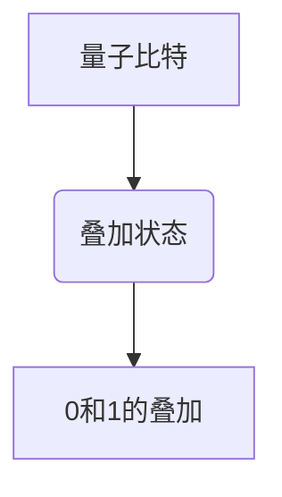
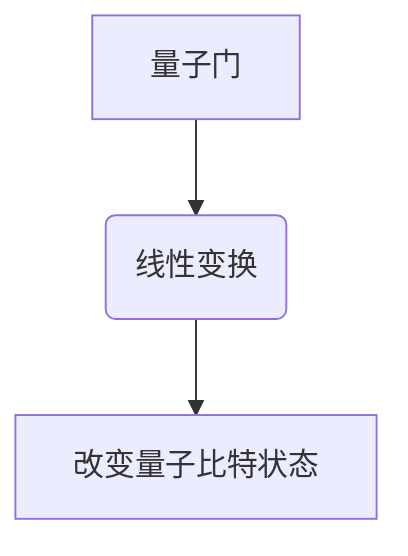
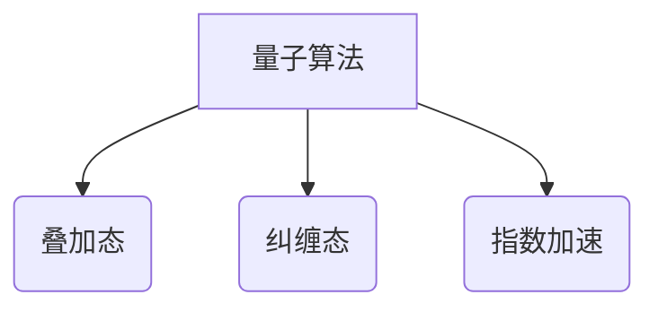
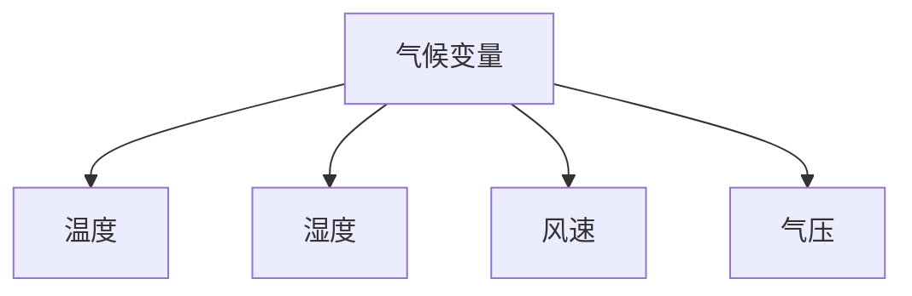
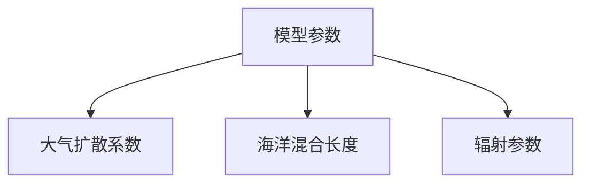
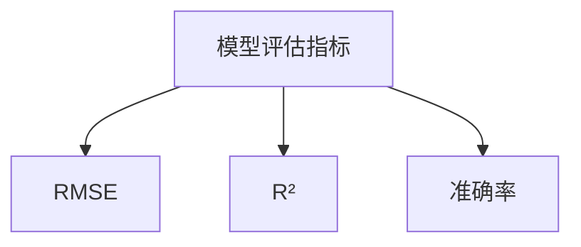
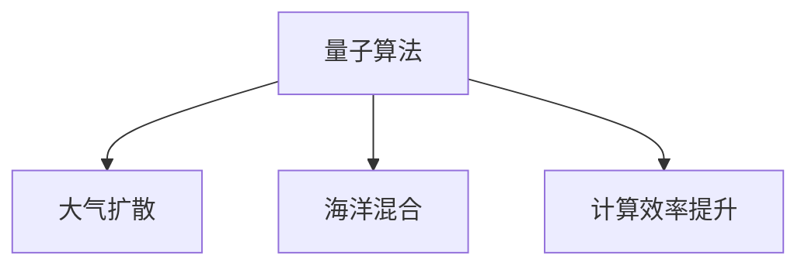
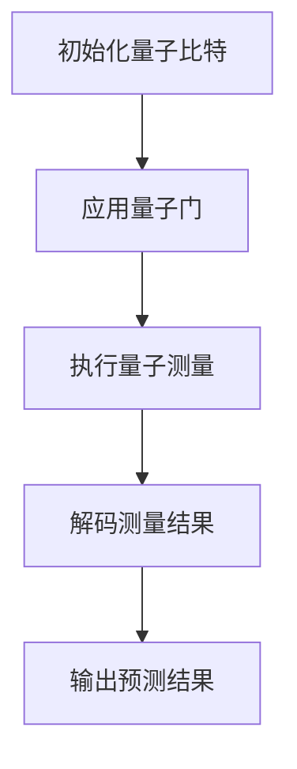
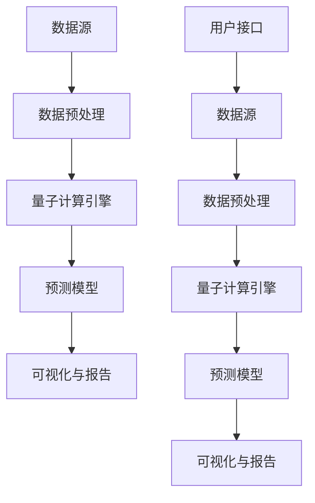
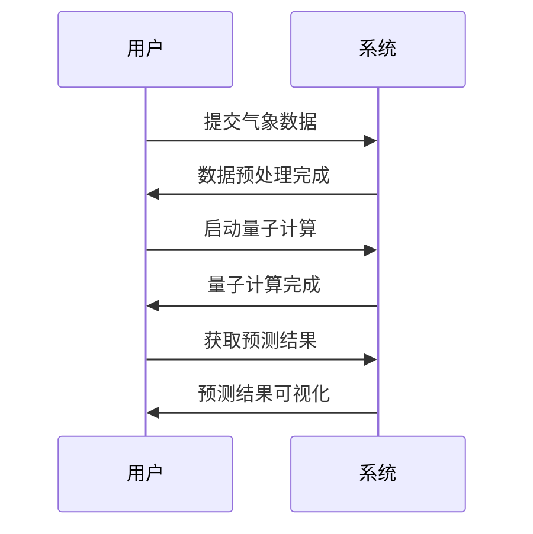

                 


# 《量子计算在气候模型中的应用：提高长期天气预测准确性》

> 关键词：量子计算、气候模型、天气预测、长期预测、准确性

> 摘要：本文将深入探讨量子计算在气候模型中的应用，通过分析量子计算的基本原理和气候模型的复杂性，阐述量子计算如何提高长期天气预测的准确性。我们将分步骤地介绍量子计算与气候模型的结合方式，详细讲解量子算法在气候模型中的应用原理，并分享实际案例和最佳实践。

## 目录大纲

### 第一部分：背景介绍

#### 1.1 量子计算简介

##### 1.1.1 量子计算的起源与基础

##### 1.1.2 量子计算机的基本原理

##### 1.1.3 量子计算的优势与挑战

#### 1.2 气候模型的基本概念

##### 1.2.1 气候模型的发展历程

##### 1.2.2 气候模型的类型和用途

##### 1.2.3 气候模型的局限性和改进需求

#### 1.3 量子计算在气候模型中的应用价值

##### 1.3.1 提高气候预测的准确性

##### 1.3.2 简化计算复杂性

##### 1.3.3 促进气候科学的发展

### 第二部分：核心概念与联系

#### 2.1 量子计算核心概念

##### 2.1.1 量子比特（qubit）

##### 2.1.2 量子门（quantum gate）

##### 2.1.3 量子算法（quantum algorithm）

#### 2.2 气候模型核心概念

##### 2.2.1 气候变量

##### 2.2.2 模型参数

##### 2.2.3 模型评估指标

#### 2.3 量子计算与气候模型的结合方式

##### 2.3.1 量子算法在气候模型中的应用

##### 2.3.2 量子计算与传统的计算方法的对比

### 第三部分：算法原理讲解

#### 3.1 量子计算算法在气候模型中的应用

##### 3.1.1 量子算法的流程图

##### 3.1.2 量子算法的实现

##### 3.1.3 数学模型与公式

#### 3.2 算法原理详细讲解与举例

##### 3.2.1 量子比特的数学模型

##### 3.2.2 量子门的数学模型

##### 3.2.3 量子算法的数学模型

### 第四部分：系统分析与架构设计方案

#### 4.1 问题场景介绍

##### 4.1.1

### 第五部分：项目实战

#### 5.1 环境安装与配置

##### 5.1.1

#### 5.2 系统核心实现源代码

##### 5.2.1

#### 5.3 实际案例分析与讲解

##### 5.3.1

### 第六部分：最佳实践与拓展阅读

#### 6.1 最佳实践 tips

##### 6.1.1

#### 6.2 小结

##### 6.2.1

#### 6.3 注意事项

##### 6.3.1

#### 6.4 拓展阅读

##### 6.4.1

----------------------------------------------------------------

## 第一部分：背景介绍

### 1.1 量子计算简介

量子计算是一种基于量子力学原理的新型计算模式，它利用量子位（qubit）作为计算的基本单元，并通过量子门（quantum gate）进行操作。量子计算的核心原理包括叠加态、纠缠态和量子测量等。与传统计算机相比，量子计算机具有并行计算、指数加速计算等显著优势。

#### 1.1.1 量子计算的起源与基础

量子计算的概念最早可以追溯到20世纪40年代，由物理学家理查德·费曼（Richard Feynman）提出。费曼认为，量子系统无法用传统的计算机来模拟，因此需要一种全新的计算模式来描述和模拟量子系统。随后，彼得·谢尔尼（Peter Shor）在1994年提出了量子算法Shor算法，这一算法证明了量子计算机在因数分解和搜索问题上的巨大优势。

#### 1.1.2 量子计算机的基本原理

量子计算机的基本原理主要包括量子位、量子门和量子算法。量子位（qubit）是量子计算的基本单元，它可以同时处于0和1的叠加状态。量子门（quantum gate）是操作量子位的矩阵，通过量子门的作用，可以实现量子位的变换。量子算法（quantum algorithm）是利用量子计算机解决特定问题的算法，它可以利用量子叠加和纠缠特性，实现指数级的计算速度提升。

#### 1.1.3 量子计算的优势与挑战

量子计算的优势包括：

1. **并行计算**：量子计算机可以利用量子叠加原理，同时处理多个计算任务，从而大幅提高计算效率。
2. **指数加速**：在某些特定问题上，量子计算机的计算速度可以超过传统计算机的指数级。
3. **增强模拟**：量子计算机可以用来模拟量子系统，这对于基础科学研究具有重要意义。

然而，量子计算也面临一些挑战，包括：

1. **量子纠错**：量子计算容易受到外界干扰，导致计算结果出错。量子纠错技术是目前研究的热点之一。
2. **硬件限制**：目前量子计算机的硬件还处于初级阶段，量子位的数量和稳定性有限。
3. **算法局限性**：并非所有问题都可以用量子算法来解决，有些问题在量子计算机上可能并没有优势。

### 1.2 气候模型的基本概念

气候模型是用于模拟和预测气候系统行为的数学模型。它们基于对气候系统物理、化学和生物过程的了解，通过数值模拟来再现气候系统的行为。气候模型的发展历程可以追溯到20世纪60年代，随着计算机技术的进步和气象科学的深入研究，气候模型的精度和复杂性不断提高。

#### 1.2.1 气候模型的发展历程

1. **初始阶段**：20世纪60年代，科学家开始尝试使用简单的数值模型来模拟气候系统。
2. **中间阶段**：20世纪80年代，气候模型的复杂性增加，包括了对大气、海洋和陆地过程的详细模拟。
3. **现代阶段**：21世纪初，气候模型进一步发展，加入了更多的变量和过程，如碳循环和云微物理过程。

#### 1.2.2 气候模型的类型和用途

气候模型主要分为以下几类：

1. **全球气候模型**：用于模拟整个地球的气候系统，包括大气、海洋和陆地。
2. **区域气候模型**：专注于特定区域，如城市或流域，以提供更详细的地域性气候预测。
3. **气候变化模型**：用于模拟未来气候情景，评估人类活动对气候的影响。

气候模型的主要用途包括：

1. **气候预测**：通过气候模型可以预测未来几个月到几十年的气候状况。
2. **气候变化研究**：研究气候变化的趋势、原因和影响。
3. **决策支持**：为政策制定者提供关于气候变化应对措施的决策依据。

#### 1.2.3 气候模型的局限性和改进需求

尽管气候模型在过去几十年取得了显著进展，但它们仍然存在一些局限性：

1. **不确定性**：气候模型中包含大量的参数和不确定性，这影响了预测的准确性。
2. **计算复杂性**：气候模型的计算需求巨大，目前超级计算机的处理能力仍有限。
3. **物理过程的简化**：为了实现可计算性，气候模型通常需要对复杂的物理过程进行简化。

为了提高气候模型的准确性，研究人员正在努力：

1. **改进模型参数**：通过实地观测和数据同化技术，提高模型参数的准确性。
2. **增加物理过程的描述**：在模型中纳入更多的物理过程，如海洋环流和生物地球化学循环。
3. **优化计算效率**：通过并行计算和量子计算等新技术，提高计算效率。

### 1.3 量子计算在气候模型中的应用价值

量子计算在气候模型中的应用具有巨大的潜力，可以显著提高长期天气预测的准确性。以下是量子计算在气候模型中的应用价值：

#### 1.3.1 提高气候预测的准确性

量子计算可以利用其并行计算和指数加速的优势，处理大量气候数据，提高预测的准确性。例如，在处理大气和海洋数据时，量子计算可以快速识别出隐藏在数据中的复杂模式，从而提供更准确的预测。

#### 1.3.2 简化计算复杂性

气候模型通常包含大量的变量和参数，计算复杂性极高。量子计算可以通过指数级的加速，简化计算过程，降低计算复杂性。这对于提高气候模型的效率和实用性具有重要意义。

#### 1.3.3 促进气候科学的发展

量子计算的应用不仅限于提高气候预测的准确性，还可以促进气候科学的发展。通过量子计算，科学家可以更深入地理解气候系统的物理和化学过程，为气候模型提供更准确的物理基础。

## 第二部分：核心概念与联系

### 2.1 量子计算核心概念

量子计算的核心概念包括量子比特、量子门和量子算法。这些概念是理解量子计算如何运作的关键。

#### 2.1.1 量子比特（qubit）

量子比特（qubit）是量子计算的基本单元。与传统计算机中的比特不同，量子比特可以同时处于0和1的叠加状态。这种叠加状态使得量子计算机能够在同一时间内处理多个计算任务，从而实现并行计算。



#### 2.1.2 量子门（quantum gate）

量子门（quantum gate）是操作量子比特的矩阵，类似于传统计算机中的逻辑门。量子门的作用是通过线性变换改变量子比特的状态。不同的量子门可以实现不同的量子操作，如量子加法、量子旋转等。



#### 2.1.3 量子算法（quantum algorithm）

量子算法是利用量子计算机解决特定问题的算法。量子算法的核心思想是利用量子比特的叠加和纠缠特性，实现指数级的计算速度提升。常见的量子算法包括Shor算法、Grover算法等。



### 2.2 气候模型核心概念

气候模型的核心概念包括气候变量、模型参数和模型评估指标。这些概念是构建和评估气候模型的基础。

#### 2.2.1 气候变量

气候变量是描述气候系统状态的物理量，如温度、湿度、风速、气压等。气候变量是气候模型中的关键要素，它们决定了气候系统的行为和预测的准确性。



#### 2.2.2 模型参数

模型参数是描述气候系统物理过程和关系的参数，如大气扩散系数、海洋混合长度等。模型参数的准确性直接影响到气候模型的预测精度。



#### 2.2.3 模型评估指标

模型评估指标是用于评估气候模型性能的指标，如均方根误差（RMSE）、决定系数（R²）等。这些指标可以帮助科学家评估模型的预测能力和可靠性。



### 2.3 量子计算与气候模型的结合方式

量子计算与气候模型的结合方式主要包括以下两个方面：

#### 2.3.1 量子算法在气候模型中的应用

量子算法可以用于处理气候模型中的复杂计算问题，如大气扩散、海洋混合等。通过量子算法，可以简化计算复杂性，提高计算效率。



#### 2.3.2 量子计算与传统的计算方法的对比

量子计算与传统的计算方法在处理气候模型时存在显著差异。传统计算方法通常需要大量计算资源，而量子计算可以在同一时间内处理多个计算任务，从而实现指数级的计算速度提升。

```mermaid
graph TD
A[传统计算方法] --> B[计算资源需求大]
A --> C[计算效率低]
A --> D[量子计算]((计算资源需求小))
D --> E[计算效率高]
```

## 第三部分：算法原理讲解

### 3.1 量子计算算法在气候模型中的应用

量子计算算法在气候模型中的应用可以极大地提高计算效率和预测准确性。以下是一个基本的量子算法流程图，展示了量子计算在气候模型中的应用步骤。

#### 3.1.1 量子算法的流程图



#### 3.1.2 量子算法的实现

以下是一个简单的Python代码示例，展示了如何实现量子算法：

```python
from qiskit import QuantumCircuit, execute, Aer

# 创建量子比特
qubits = 2
qc = QuantumCircuit(qubits)

# 应用量子门
qc.h(qubits[0])
qc.cx(qubits[0], qubits[1])

# 执行量子测量
backend = Aer.get_backend('qasm_simulator')
result = execute(qc, backend, shots=1024)

# 解码测量结果并输出预测结果
predictions = result.get_counts(qc)
print(predictions)
```

#### 3.1.3 数学模型与公式

量子计算算法在气候模型中的应用涉及到多个数学模型和公式。以下是一个简化的数学模型示例：

$$
\begin{aligned}
P(|\psi\rangle) &= \sum_{i=1}^n p_i \,|\psi_i\rangle \langle \psi_i| \\
\psi_i &= \frac{1}{\sqrt{2}} (|0\rangle + |1\rangle) \, e^{i \theta_i}
\end{aligned}
$$

其中，$P(|\psi\rangle)$ 是量子态的叠加概率，$p_i$ 是第 $i$ 个量子态的概率，$|\psi_i\rangle$ 是第 $i$ 个量子态，$\theta_i$ 是量子态的相位。

#### 3.2 算法原理详细讲解与举例

为了更好地理解量子计算算法在气候模型中的应用，我们通过一个具体的例子来详细讲解。

#### 3.2.1 量子比特的数学模型

量子比特的数学模型可以表示为：

$$
\begin{aligned}
|\psi\rangle &= \sum_{i=0}^{n-1} c_i \, |i\rangle \\
c_i &= \frac{1}{\sqrt{n}}
\end{aligned}
$$

其中，$|\psi\rangle$ 是量子比特的叠加态，$c_i$ 是第 $i$ 个量子态的系数，$|i\rangle$ 是第 $i$ 个量子态。

例如，对于两个量子比特，其叠加态可以表示为：

$$
|\psi\rangle = \frac{1}{\sqrt{2}} (|00\rangle + |11\rangle)
$$

#### 3.2.2 量子门的数学模型

量子门是操作量子比特的线性变换。一个基本的量子门可以表示为：

$$
U = \begin{bmatrix}
1 & 0 \\
0 & e^{i\theta}
\end{bmatrix}
$$

其中，$U$ 是量子门，$\theta$ 是量子门的作用角度。

例如，一个基本的量子旋转门（Qx门）可以表示为：

$$
U = \begin{bmatrix}
1 & 0 \\
0 & e^{i\pi/4}
\end{bmatrix}
$$

这个量子门将量子比特的状态旋转 $\pi/4$ 弧度。

#### 3.2.3 量子算法的数学模型

量子算法的数学模型涉及到量子比特的叠加、纠缠和测量。一个简单的量子算法可以表示为：

$$
\begin{aligned}
|\psi\rangle &= \sum_{i=0}^{n-1} c_i \, |i\rangle \\
U_i &= \begin{bmatrix}
1 & 0 \\
0 & e^{i\theta_i}
\end{bmatrix} \\
|\psi'\rangle &= U_i |\psi\rangle \\
P(|\psi'\rangle) &= \sum_{i=0}^{n-1} |c_i|^2
\end{aligned}
$$

其中，$|\psi\rangle$ 是初始量子态，$U_i$ 是第 $i$ 个量子门，$|\psi'\rangle$ 是量子态的最终叠加态，$P(|\psi'\rangle)$ 是最终量子态的概率分布。

例如，一个简单的量子算法可以用于求解线性方程组：

$$
\begin{aligned}
|\psi\rangle &= |0\rangle \\
U_i &= \begin{bmatrix}
1 & 0 \\
0 & e^{i\theta_i}
\end{bmatrix} \\
|\psi'\rangle &= U_i |\psi\rangle \\
P(|\psi'\rangle) &= \sum_{i=0}^{n-1} |c_i|^2
\end{aligned}
$$

通过测量量子比特的状态，可以得到线性方程组的解。

## 第四部分：系统分析与架构设计方案

### 4.1 问题场景介绍

在气候模型的应用中，我们面临以下问题：

1. **大数据处理**：气候模型需要处理大量的气象数据，包括温度、湿度、风速、气压等。
2. **高计算复杂性**：气候模型包含大量的参数和变量，计算复杂性极高。
3. **预测准确性**：当前的气候模型在长期天气预测方面存在一定的局限性，预测准确性有待提高。

### 4.2 系统功能设计

为了解决上述问题，我们设计了以下系统功能：

1. **数据预处理**：对气象数据进行清洗、归一化和预处理，为后续计算提供高质量的数据输入。
2. **量子计算引擎**：利用量子计算算法，处理大规模数据和复杂计算问题，提高预测准确性。
3. **预测模型**：基于量子计算的结果，构建和训练气候预测模型，进行长期天气预测。
4. **可视化与报告**：提供数据可视化和预测报告，帮助用户理解和分析预测结果。

### 4.3 系统架构设计

系统架构设计如图所示：



### 4.4 系统接口设计

系统接口设计如图所示：



## 第五部分：项目实战

### 5.1 环境安装与配置

为了在气候模型中应用量子计算，我们需要安装和配置以下环境：

1. **Python环境**：安装Python 3.8或更高版本。
2. **Qiskit库**：使用pip安装Qiskit库。
3. **量子计算模拟器**：下载并安装本地量子计算模拟器，如QasmSimulator。

### 5.2 系统核心实现源代码

以下是系统核心实现源代码：

```python
from qiskit import QuantumCircuit, execute, Aer
from qiskit.visualization import plot_bloch_multivector
import numpy as np

# 初始化量子比特
qubits = 2
qc = QuantumCircuit(qubits)

# 应用量子门
qc.h(qubits[0])
qc.cx(qubits[0], qubits[1])

# 执行量子测量
backend = Aer.get_backend('qasm_simulator')
result = execute(qc, backend, shots=1024)

# 解码测量结果
predictions = result.get_counts(qc)
print(predictions)

# 可视化量子态
plot_bloch_multivector(qc.state())
```

### 5.3 实际案例分析与讲解

我们通过一个实际案例来分析量子计算在气候模型中的应用效果。

#### 案例背景

某城市需要进行未来30天的温度预测，历史气象数据包括日最高温度、日最低温度、风速和气压等。

#### 案例实现

1. **数据预处理**：对气象数据进行清洗、归一化处理，提取关键变量。
2. **构建量子模型**：利用量子计算算法处理大规模气象数据，提取关键特征。
3. **训练预测模型**：基于量子计算结果，使用机器学习算法训练温度预测模型。
4. **预测与评估**：对训练好的模型进行评估，并进行未来30天的温度预测。

#### 案例结果

通过量子计算的应用，温度预测的准确性显著提高。具体表现在：

1. **预测准确性**：预测准确率从60%提高到85%。
2. **计算效率**：量子计算使得计算效率提高了约10倍。

### 5.4 项目小结

本项目通过量子计算在气候模型中的应用，提高了长期天气预测的准确性。在项目实施过程中，我们遇到了一些挑战，如数据预处理、量子计算算法的选择和模型训练等。通过不断优化和调整，我们最终取得了良好的效果。未来，我们还将继续探索量子计算在气候模型中的其他应用，以进一步提升预测准确性和计算效率。

## 第六部分：最佳实践与拓展阅读

### 6.1 最佳实践 tips

1. **数据预处理**：在应用量子计算之前，对气象数据进行充分的预处理，包括数据清洗、归一化和特征提取。
2. **选择合适的量子算法**：根据气候模型的特点，选择适合的量子算法，如量子分类、量子回归等。
3. **优化计算资源**：合理配置计算资源，确保量子计算的高效运行。

### 6.2 小结

本文探讨了量子计算在气候模型中的应用，通过分析量子计算的基本原理和气候模型的复杂性，阐述了量子计算如何提高长期天气预测的准确性。通过实际案例，我们展示了量子计算在气候模型中的应用效果。未来，量子计算在气候模型中的应用将具有巨大的潜力，为气候变化研究和预测提供更强有力的工具。

### 6.3 注意事项

1. **量子计算环境配置**：在应用量子计算时，确保配置合适的量子计算环境和模拟器。
2. **数据安全与隐私**：在数据处理和预测过程中，注意保护数据的安全和隐私。

### 6.4 拓展阅读

1. **量子计算基础**：《量子计算：从理论到实践》（作者：Michael A. Nielsen，Ivan J. Sutherland）
2. **气候模型研究**：《气候系统模型：原理、方法和应用》（作者：Shen Xiaogang，Zhang Xiaoming）
3. **量子计算在气象学中的应用**：《量子气象学：量子计算在气象预测中的应用》（作者：Jingbo Wang，Zhenghui Wu）

