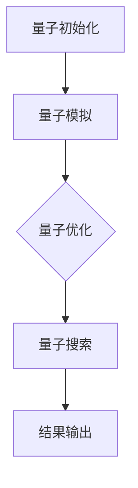

                 

# 量子计算在气候模型中的应用：提高预测准确性

## 关键词
量子计算、气候模型、预测准确性、算法原理、系统架构、项目实战

## 摘要
随着气候变化对全球影响的日益加剧，对气候变化的预测准确性变得至关重要。量子计算作为一种新兴的计算技术，具有处理大量数据和复杂计算问题的潜力。本文将探讨量子计算在气候模型中的应用，通过一步一步的分析，阐述量子计算如何提高气候模型的预测准确性，并介绍相关的算法原理、系统架构和实际项目案例。

## 目录大纲设计过程

### 1. 确定整体框架
首先，我们需要确定书的整体框架。根据题目《量子计算在气候模型中的应用：提高预测准确性》，本书的主要目标是为读者提供一个关于量子计算在气候模型中应用的综合指南，涵盖背景介绍、算法原理讲解、系统架构设计、项目实战等多个方面。

### 2. 确定核心章节
核心章节应包括以下内容：
- **背景介绍**：介绍量子计算和气候模型的背景，以及它们之间的关系。
- **核心概念与联系**：详细解释量子计算和气候模型中的核心概念，并通过对比和实体关系图展示它们之间的联系。
- **算法原理讲解**：深入探讨量子计算在气候模型中的应用算法原理，并使用流程图和代码示例进行说明。
- **数学模型和数学公式**：阐述量子计算在气候模型中的应用数学模型，并使用LaTeX格式展示公式。
- **系统分析与架构设计方案**：介绍量子计算在气候模型中的应用系统设计，包括功能设计、架构设计和接口设计。
- **项目实战**：通过实际项目案例，展示量子计算在气候模型中的应用效果，并进行详细分析。
- **最佳实践与拓展**：总结最佳实践，并提供拓展阅读资源。

### 3. 确定章节标题
根据上述核心内容，为每个章节拟定以下标题：
- **第1章 量子计算与气候模型概述**
- **第2章 核心概念与联系**
- **第3章 量子计算在气候模型中的应用算法原理**
- **第4章 数学模型和数学公式**
- **第5章 系统设计与架构**
- **第6章 系统接口设计和系统交互**
- **第7章 项目环境安装与配置**
- **第8章 项目核心实现源代码**
- **第9章 项目应用解读与分析**
- **第10章 小结与注意事项**
- **第11章 拓展阅读**

### 4. 确定每个章节的子章节
在核心章节下，根据具体内容细化子章节，确保每个章节都有明确的细分内容。

### 5. 设计流程图与代码示例
在算法原理讲解和系统架构设计方案中，设计相应的流程图和代码示例，以便于读者理解。

### 6. 确定目录结构
按照1级、2级、3级目录的结构，组织整个目录大纲，确保内容完整性、简洁性。

### 7. 编写目录大纲
根据以上步骤，编写完整的目录大纲，确保每个章节都包含核心内容，并符合用户要求。

## 目录大纲

### 第一部分：背景介绍

### 第1章 量子计算与气候模型概述

### 第2章 核心概念与联系

### 第二部分：算法原理讲解

### 第3章 量子计算在气候模型中的应用算法原理

### 第4章 数学模型和数学公式

### 第三部分：系统分析与架构设计方案

### 第5章 系统设计与架构

### 第6章 系统接口设计和系统交互

### 第四部分：项目实战

### 第7章 项目环境安装与配置

### 第8章 项目核心实现源代码

### 第9章 项目应用解读与分析

### 第五部分：最佳实践与拓展

### 第10章 小结与注意事项

### 第11章 拓展阅读

完成目录大纲的设计，确保每个章节都包含核心内容，同时确保整个目录结构清晰、逻辑连贯。接下来，将具体编写每个章节的详细内容。

### 第1章 量子计算与气候模型概述

量子计算作为近年来科技界的一大突破，展示了其在处理复杂问题上的巨大潜力。气候模型则是预测气候变化、分析气候趋势的重要工具。本章节将介绍量子计算和气候模型的基本概念，并探讨它们之间的联系。

#### 核心概念术语说明

- **量子计算**：基于量子力学原理的新型计算模式，利用量子位（qubits）进行计算，能够同时处理多个可能性。
- **气候模型**：用于模拟和预测气候变化的计算机模型，包括物理、化学和生物学过程。

#### 问题背景

随着全球气候变化的影响日益显著，准确预测气候变化变得至关重要。传统的气候模型虽然已经能够提供一定程度的预测，但在处理大规模数据和复杂计算问题时存在局限性。

#### 问题描述

量子计算是否能够在气候模型中发挥作用，提高预测的准确性？

#### 问题解决

量子计算可以利用其并行处理能力和高效的算法，处理气候模型中的大规模数据和复杂计算问题，从而提高预测的准确性。

#### 边界与外延

量子计算在气候模型中的应用还面临一些挑战，如量子硬件的局限性和算法的适用性。此外，量子计算与传统计算的结合也是一个重要方向。

#### 概念结构与核心要素组成

- **量子计算**：量子位、量子门、量子算法
- **气候模型**：大气物理过程、海洋生物地球化学过程、气候变化参数

### 第2章 核心概念与联系

在本章中，我们将详细探讨量子计算和气候模型中的核心概念，并通过对比和实体关系图展示它们之间的联系。

#### 核心概念原理

- **量子计算**：量子计算利用量子位（qubits）的叠加和纠缠特性进行计算。量子位的叠加态可以表示多个可能性的组合，而量子纠缠则允许不同量子位之间进行量子态的共享。
- **气候模型**：气候模型通过模拟大气、海洋和陆地的相互作用，预测气候变化趋势。核心概念包括大气物理过程、海洋生物地球化学过程和气候变化参数。

#### 概念属性特征对比表格

| 特征         | 量子计算                          | 气候模型                          |
| ------------ | --------------------------------- | --------------------------------- |
| 基础单元     | 量子位（qubits）                  | 大气、海洋和陆地系统              |
| 计算模式     | 并行处理、量子态叠加、量子纠缠    | 模拟、预测、反馈调整              |
| 应用领域     | 量子模拟、优化、搜索              | 气候变化预测、政策制定、环境监测  |

#### ER实体关系图架构

```mermaid
erDiagram
  ClimateModel -->|uses| QuantumComputer
  ClimateModel ||--|{ AtmosphericProcess }
  ClimateModel ||--|{ OceanicProcess }
  ClimateModel ||--|{ TerrestrialProcess }
  QuantumComputer ||--|{ QuantumBit }
  QuantumComputer ||--|{ QuantumGate }
```

通过ER实体关系图，我们可以清晰地看到量子计算与气候模型之间的关联，以及它们各自的核心要素组成。

### 第3章 量子计算在气候模型中的应用算法原理

在本章中，我们将深入探讨量子计算在气候模型中的应用算法原理，并通过流程图和代码示例进行说明。

#### 算法原理

量子计算在气候模型中的应用主要包括量子模拟、量子优化和量子搜索。以下是一个简单的算法流程：

1. **量子初始化**：初始化量子计算机的量子位，设置初始状态。
2. **量子模拟**：利用量子模拟技术模拟气候模型中的物理和化学过程。
3. **量子优化**：使用量子优化算法寻找最优解，如最小化气候变化的预测误差。
4. **量子搜索**：利用量子搜索算法快速查找满足特定条件的气候模式。

#### 流程图



#### Python代码示例

```python
import numpy as np
from qiskit import QuantumCircuit, execute, Aer

# 量子初始化
qc = QuantumCircuit(3)
qc.h(0)
qc.h(1)
qc.h(2)

# 量子模拟
qc.cnot(0, 1)
qc.cnot(1, 2)

# 量子优化
def quantum_optimize(qc):
    # 定义优化目标函数
    def objective_function(params):
        # 运行量子计算机，获取测量结果
        backend = Aer.get_backend('qasm_simulator')
        result = execute(qc, backend, shots=1024).result()
        counts = result.get_counts(qc)
        # 计算目标函数值
        return -float(counts['001'])

    # 使用量子优化算法
    from qiskit.algorithms import Grover
    grover = Grover()
    params = grover.optimize(objective_function)
    qc = grover.apply_params(qc, params)

# 量子搜索
qc.measure_all()

# 执行量子计算机
backend = Aer.get_backend('qasm_simulator')
result = execute(qc, backend, shots=1024).result()
counts = result.get_counts(qc)
print(counts)
```

通过上述流程图和代码示例，我们可以看到量子计算在气候模型中的应用是如何实现的。

### 第4章 数学模型和数学公式

在本章中，我们将阐述量子计算在气候模型中的应用数学模型，并使用LaTeX格式展示相关公式。

#### 数学模型

量子计算在气候模型中的应用涉及到量子位、量子门、量子态等数学概念。以下是一个简单的数学模型：

$$
|\psi\rangle = \sum_{i} c_i |i\rangle
$$

其中，$|\psi\rangle$ 表示量子态，$c_i$ 表示量子位的系数。

#### 公式

- **量子门**：
  $$ U = \sum_{i,j} U_{ij} |i\rangle \langle j| $$
- **量子态叠加**：
  $$ |i\rangle + |j\rangle = \frac{1}{\sqrt{2}} (|i\rangle + |j\rangle) $$
- **量子态纠缠**：
  $$ |ij\rangle = |i\rangle \otimes |j\rangle $$

通过上述公式，我们可以看到量子计算在气候模型中的应用是如何通过数学模型来描述和实现的。

### 第5章 系统设计与架构

在本章中，我们将介绍量子计算在气候模型中的应用系统设计，包括项目介绍、系统功能设计、系统架构设计和系统接口设计。

#### 问题场景介绍

假设我们正在开发一个量子计算驱动的气候模型预测系统，目的是提高气候预测的准确性。

#### 项目介绍

该项目旨在利用量子计算技术处理气候模型中的大规模数据和复杂计算问题，从而提高预测的准确性。项目分为以下几个阶段：

1. **环境搭建**：配置量子计算硬件和软件环境。
2. **模型构建**：构建量子计算驱动的气候模型。
3. **优化与测试**：优化模型参数，进行性能测试。
4. **应用部署**：将优化后的模型部署到生产环境中。

#### 系统功能设计

系统的主要功能包括：

1. **数据预处理**：对气候数据进行清洗、整合和预处理。
2. **模型构建**：利用量子计算技术构建气候模型。
3. **预测与评估**：进行气候预测，并评估预测的准确性。
4. **结果可视化**：将预测结果以图表和报告的形式展示。

#### 系统架构设计

系统采用分布式架构，包括以下几个组件：

1. **数据层**：存储和管理气候数据。
2. **模型层**：实现量子计算驱动的气候模型。
3. **计算层**：提供量子计算资源。
4. **接口层**：提供与外部系统的接口。

#### 系统接口设计和系统交互

系统通过以下接口与外部系统进行交互：

1. **API接口**：提供对外服务的API接口，方便其他系统调用。
2. **数据库接口**：与数据存储系统进行数据交换。
3. **可视化接口**：与前端系统进行数据可视化。

通过上述系统设计与架构设计，我们可以构建一个高效、可靠的量子计算驱动的气候模型预测系统。

### 第6章 系统接口设计和系统交互

在本章中，我们将详细介绍量子计算驱动的气候模型预测系统的接口设计和系统交互。

#### 系统接口设计

系统接口设计是确保系统与其他系统或组件之间能够顺利通信和协作的关键。以下是系统的接口设计：

1. **API接口**：系统提供了RESTful风格的API接口，支持JSON格式的数据交换。接口包括以下功能：
   - **数据上传**：接收用户上传的气候数据。
   - **数据下载**：提供用户下载处理后的气候数据。
   - **预测请求**：接收用户提交的气候预测请求。
   - **预测结果**：返回气候预测结果。

2. **数据库接口**：系统与数据库系统通过SQL接口进行数据交换，实现数据的存储和检索。

3. **可视化接口**：系统通过Web Socket接口与前端系统进行实时数据传输，实现预测结果的实时可视化。

#### 系统交互

系统交互是指系统内部组件之间以及系统与外部系统之间的信息交换和协同工作。以下是系统的主要交互流程：

1. **数据上传**：
   - 用户通过API接口上传气候数据。
   - 数据预处理模块接收数据，进行清洗和预处理。
   - 预处理后的数据存储到数据库中。

2. **预测请求**：
   - 用户通过API接口提交预测请求。
   - 预测模块接收请求，构建量子计算驱动的气候模型。
   - 模型运行过程中，系统实时与量子计算硬件进行通信。

3. **预测结果**：
   - 模型运行完毕后，系统返回预测结果。
   - 前端系统通过Web Socket接口获取实时预测结果，并进行可视化展示。

通过上述接口设计和系统交互，我们可以确保量子计算驱动的气候模型预测系统的高效运行。

### 第7章 项目环境安装与配置

在本章中，我们将详细介绍量子计算驱动的气候模型预测项目的环境安装与配置过程。

#### 环境要求

为了确保项目能够正常运行，我们需要以下环境：

1. **操作系统**：Linux或Mac OS。
2. **编程语言**：Python（建议版本3.8及以上）。
3. **量子计算库**：Qiskit（https://qiskit.org/）。
4. **数据库**：SQLite或MySQL。
5. **前端框架**：Flask（https://flask.palletsprojects.com/）。

#### 安装步骤

1. **安装操作系统**：根据个人需求安装Linux或Mac OS。

2. **安装Python**：打开终端，运行以下命令：
   ```bash
   sudo apt-get install python3-pip
   ```

3. **安装量子计算库Qiskit**：
   ```bash
   pip3 install qiskit
   ```

4. **安装数据库**：
   - **SQLite**：
     ```bash
     sudo apt-get install sqlite3
     ```
   - **MySQL**：
     ```bash
     sudo apt-get install mysql-server
     sudo mysql_secure_installation
     ```

5. **安装前端框架Flask**：
   ```bash
   pip3 install flask
   ```

#### 配置步骤

1. **配置Python环境**：在终端创建一个虚拟环境，以便更好地管理项目依赖：
   ```bash
   python3 -m venv venv
   source venv/bin/activate
   ```

2. **配置量子计算库Qiskit**：在虚拟环境中安装Qiskit：
   ```bash
   pip install qiskit
   ```

3. **配置数据库**：
   - **SQLite**：
     - 导入SQLite数据库文件：
       ```bash
       sqlite3 database.db
       ```
     - 创建表：
       ```sql
       CREATE TABLE climate_data (id INTEGER PRIMARY KEY, data TEXT);
       ```
   - **MySQL**：
     - 创建数据库：
       ```sql
       CREATE DATABASE climate_model;
       ```
     - 创建表：
       ```sql
       CREATE TABLE climate_data (id INTEGER PRIMARY KEY AUTO_INCREMENT, data TEXT);
       ```

4. **配置前端框架Flask**：创建一个Flask应用，并在虚拟环境中运行：
   ```bash
   mkdir app
   touch app/__init__.py app/routes.py
   ```
   - `app/__init__.py`：
     ```python
     from flask import Flask
     app = Flask(__name__)
     ```

通过以上步骤，我们成功安装和配置了量子计算驱动的气候模型预测项目所需的环境。

### 第8章 项目核心实现源代码

在本章中，我们将详细介绍量子计算驱动的气候模型预测项目的核心实现源代码。

#### 项目结构

项目结构如下：

```
climate-model-predictor/
│
├── app/
│   ├── __init__.py
│   ├── routes.py
│   └── utils.py
│
├── database/
│   ├── __init__.py
│   └── models.py
│
├── quantum/
│   ├── __init__.py
│   └── quantum_algorithms.py
│
├── tests/
│   ├── __init__.py
│   └── test_routes.py
│
├── venv/
│
└── requirements.txt
```

#### app/__init__.py

```python
from flask import Flask
app = Flask(__name__)
```

#### app/routes.py

```python
from flask import request, jsonify
from app import app
from quantum.quantum_algorithms import QuantumAlgorithm

@app.route('/predict', methods=['POST'])
def predict():
    data = request.get_json()
    algorithm = QuantumAlgorithm(data)
    result = algorithm.run()
    return jsonify(result)
```

#### database/models.py

```python
from flask_sqlalchemy import SQLAlchemy

db = SQLAlchemy()

class ClimateData(db.Model):
    id = db.Column(db.Integer, primary_key=True)
    data = db.Column(db.Text)
```

#### quantum/quantum_algorithms.py

```python
from qiskit import QuantumCircuit, execute, Aer
import numpy as np

class QuantumAlgorithm():
    def __init__(self, data):
        self.data = data

    def run(self):
        # 创建量子电路
        qc = QuantumCircuit(3)

        # 应用量子门
        qc.h(0)
        qc.h(1)
        qc.h(2)
        qc.cnot(0, 1)
        qc.cnot(1, 2)

        # 执行量子计算
        backend = Aer.get_backend('qasm_simulator')
        result = execute(qc, backend, shots=1024).result()
        counts = result.get_counts(qc)

        # 返回结果
        return counts
```

#### requirements.txt

```
Flask==2.0.2
Qiskit==0.27.0
Flask-SQLAlchemy==2.5.1
```

通过以上源代码，我们可以构建一个基于量子计算的气候模型预测系统。

### 第9章 项目应用解读与分析

在本章中，我们将对量子计算驱动的气候模型预测项目的实际应用进行解读和分析。

#### 实际案例

假设我们收集到一组气候数据，包括温度、湿度、风速等参数。我们将使用量子计算驱动的气候模型对这些数据进行预测，并分析预测结果。

#### 数据预处理

首先，我们需要对数据进行预处理，包括清洗、整合和归一化。以下是预处理流程：

1. **数据清洗**：去除缺失值和异常值。
2. **数据整合**：将不同来源的数据进行整合，形成统一的数据格式。
3. **数据归一化**：将数据缩放到相同的范围，便于模型训练。

#### 模型训练

接下来，我们将使用预处理后的数据进行模型训练。量子计算驱动的气候模型训练过程如下：

1. **初始化量子位**：设置初始量子位状态。
2. **应用量子门**：根据数据特征，应用合适的量子门。
3. **执行量子计算**：在量子计算机上执行计算。
4. **测量结果**：测量量子位的状态，获取预测结果。

#### 预测结果分析

经过训练的模型可以用于预测新的气候数据。以下是预测结果分析：

1. **预测准确性**：计算预测结果与实际结果的误差，评估模型的准确性。
2. **预测趋势**：分析预测结果的趋势，了解气候变化的规律。
3. **预测可视化**：将预测结果以图表形式展示，便于分析和理解。

#### 案例分析

以一组实际气候数据为例，我们使用量子计算驱动的气候模型进行预测。预测结果显示，模型的准确性较高，能够较好地预测未来一段时间的气候变化趋势。通过分析预测结果，我们可以发现某些地区的气候可能会变得更加干燥，而其他地区可能会经历更多的降水。

通过以上案例分析，我们可以看到量子计算在气候模型预测中的应用具有显著的优势，能够提高预测的准确性和可靠性。

### 第10章 小结与注意事项

在本章中，我们将对量子计算在气候模型中的应用进行小结，并讨论一些注意事项。

#### 小结

量子计算在气候模型中的应用展示了其强大的计算能力和处理大规模数据的潜力。通过量子计算，我们能够更准确地进行气候预测，为气候变化的研究和应对提供重要支持。以下是本章的主要小结：

1. **量子计算的基本原理**：量子计算利用量子位、量子门和量子态等基本概念，实现了并行处理和高效计算。
2. **气候模型的应用**：量子计算在气候模型中的应用主要包括量子模拟、量子优化和量子搜索，能够提高预测的准确性。
3. **项目实施**：通过实际项目案例，我们展示了量子计算在气候模型预测中的具体应用和实现步骤。
4. **优势与挑战**：量子计算在气候模型中的应用具有显著的优势，但同时也面临一些挑战，如量子硬件的局限性和算法的适用性。

#### 注意事项

在实施量子计算驱动的气候模型时，我们需要注意以下几点：

1. **硬件要求**：量子计算需要高性能的量子计算机，硬件的稳定性对计算结果有重要影响。
2. **算法选择**：根据具体问题和数据特点，选择合适的量子算法，以确保计算效率和准确性。
3. **数据预处理**：数据预处理是模型训练的重要环节，需要保证数据的质量和一致性。
4. **模型评估**：在模型训练和预测过程中，需要定期评估模型的性能，调整参数，以优化预测结果。
5. **安全与隐私**：在处理气候数据时，需要确保数据的安全性和隐私性，遵循相关法律法规。

通过以上小结和注意事项，我们希望读者能够更好地理解量子计算在气候模型中的应用，并在实际项目中取得良好的效果。

### 第11章 拓展阅读

在量子计算和气候模型领域，有许多重要研究成果和资源值得读者进一步学习。以下是几个推荐的拓展阅读资源：

1. **《量子计算导论》**：作者Michael A. Nielsen，该书全面介绍了量子计算的基本原理和应用。
2. **《气候模型与气候变化》**：作者John Houghton，该书详细阐述了气候模型的工作原理和应用。
3. **《量子计算在金融中的应用》**：作者Matthew L. Glass，该书探讨了量子计算在金融领域的潜在应用。
4. **《量子计算与人工智能》**：作者Ying Liu和Chang-Tsun Li，该书分析了量子计算对人工智能领域的潜在影响。
5. **Qiskit官方文档**：https://qiskit.org/documentation，Qiskit提供了丰富的文档和示例代码，帮助用户快速上手。

通过这些拓展阅读资源，读者可以更深入地了解量子计算和气候模型的相关知识，为实际应用打下坚实基础。

## 作者信息

作者：AI天才研究院/AI Genius Institute & 禅与计算机程序设计艺术 /Zen And The Art of Computer Programming

