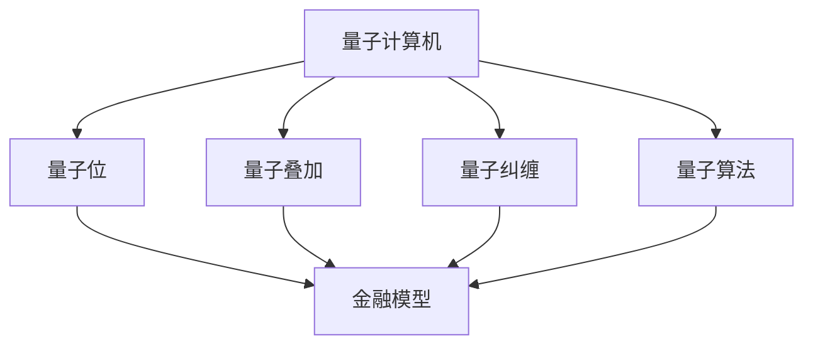
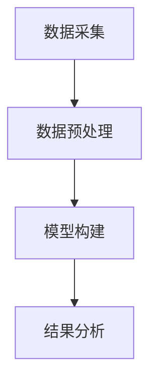
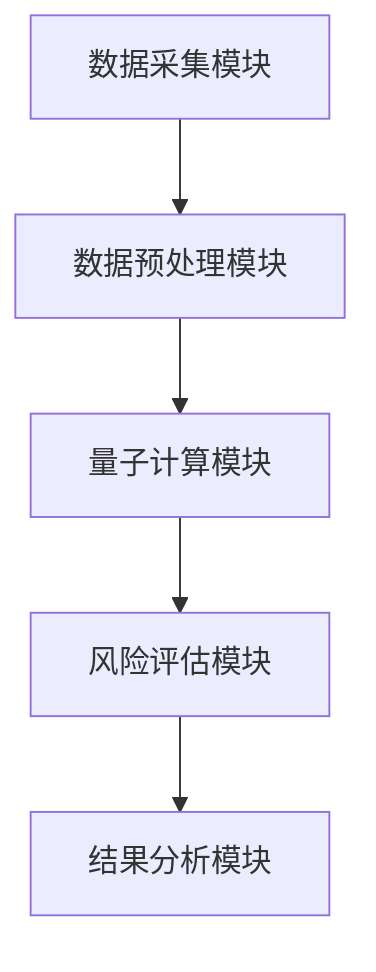
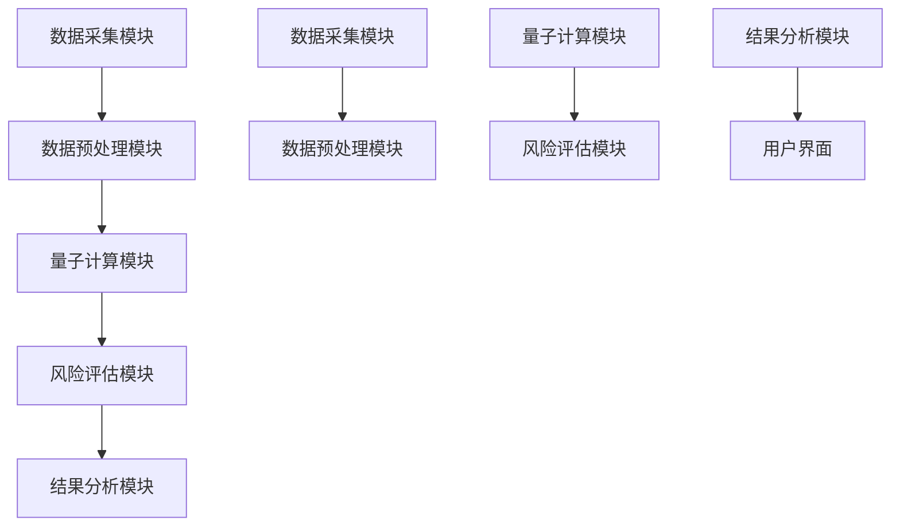
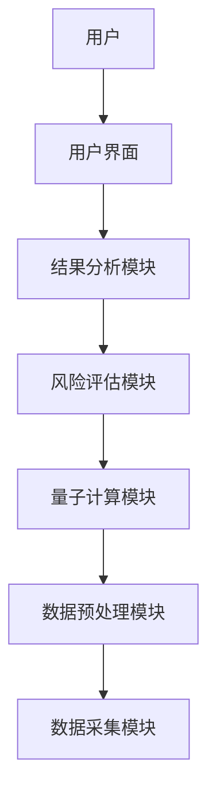

                 


### 第一步：背景介绍

#### 核心概念术语说明

量子计算，一种遵循量子力学规律调控量子信息单元进行计算的新型计算模式，具有并行计算和量子叠加的特性。与传统的经典计算不同，量子计算可以通过量子位（qubit）的叠加态同时处理大量信息，极大地提高了计算速度和效率。

金融建模，是利用数学模型和计算机模拟，对金融市场和金融工具进行预测和分析的一种方法。其目的是通过数学模型来量化金融风险，为投资决策提供依据。

#### 问题背景

在金融领域中，风险管理和市场预测一直是一个重要的话题。随着金融市场规模的不断扩大和复杂性增加，传统计算方法在处理大数据和高维问题时逐渐显得力不从心。此时，量子计算以其独特的并行计算和叠加特性，成为解决金融建模问题的潜在利器。

#### 问题描述

金融建模面临的问题主要包括：数据量大、计算复杂度高、模型精度要求高等。具体表现为：

- **数据量大**：金融市场每天产生海量数据，如何高效地处理和分析这些数据成为一大挑战。
- **计算复杂度高**：金融模型通常涉及复杂的数学计算，传统的计算方法在处理这些计算时效率低下。
- **模型精度要求高**：金融模型需要提供高精度的预测结果，以支持投资决策和风险管理。

#### 问题解决

量子计算的应用为解决上述问题提供了新的思路：

- **并行计算**：量子计算可以通过量子叠加和纠缠实现并行计算，大大提高了处理大数据的效率。
- **高效算法**：量子算法可以加速复杂计算，提高模型精度。
- **数据压缩**：量子计算可以实现数据压缩，减少计算所需的存储空间。

#### 边界与外延

量子计算在金融建模中的应用仍处于探索阶段，其发展和成熟需要解决一系列技术难题，包括量子硬件的可靠性、算法优化、量子错误纠正等。同时，量子金融建模需要与传统金融模型的结合，以发挥其最大效用。

#### 概念结构与核心要素组成

量子计算在金融建模中的应用主要涉及以下几个核心要素：

- **量子计算机**：作为计算平台，量子计算机的硬件基础。
- **量子算法**：实现高效计算的关键，包括量子概率论、量子线性代数等。
- **金融模型**：结合金融领域知识构建的数学模型。
- **数据集**：用于训练和测试模型的实际数据。
- **风险预测与评估**：基于模型的结果，对金融市场风险进行预测和评估。

### 第二步：核心概念与联系

#### 核心概念原理

量子计算在金融建模中的核心概念主要包括量子位（qubit）、量子叠加、量子纠缠和量子算法。量子位是量子计算的基本单元，可以同时处于0和1的状态，即叠加态。量子纠缠则是一种特殊的量子现象，两个或多个量子位之间可以相互影响，即使它们相隔很远。量子算法则是利用量子位和量子纠缠进行高效计算的方法。

#### 概念属性特征对比表格

| 概念      | 定义                                                         | 特点                                                         |
| --------- | ------------------------------------------------------------ | ------------------------------------------------------------ |
| 量子位    | 量子计算的基本单元，可以处于0和1的叠加态                     | 支持并行计算，高效处理大数据                               |
| 量子叠加  | 量子位可以同时处于多个状态，通过线性叠加表示                  | 提高计算速度和效率                                       |
| 量子纠缠  | 两个或多个量子位之间可以相互影响，即使相隔很远                 | 增强量子计算之间的相互关系，实现更高效的计算               |
| 量子算法  | 利用量子位和量子纠缠进行高效计算的方法                       | 提高复杂计算的效率，增强模型精度                         |

#### ER实体关系图架构



量子计算机是核心计算平台，量子位、量子叠加、量子纠缠和量子算法是其关键组件。这些组件共同作用于金融模型，实现高效的金融风险评估和预测。

### 第三步：算法原理讲解

#### 量子算法的基本原理

量子算法是利用量子位和量子纠缠进行高效计算的方法。其基本原理包括量子位、量子叠加、量子纠缠和量子 gates（量子门）。

- **量子位（qubit）**：量子位是量子计算的基本单元，可以处于0和1的叠加态。多个量子位可以形成更大的计算空间。
- **量子叠加**：量子位可以同时处于多个状态，通过线性叠加表示。例如，一个量子位可以同时处于0和1的状态，两个量子位可以同时处于00、01、10和11的状态。
- **量子纠缠**：两个或多个量子位之间可以相互影响，即使它们相隔很远。这种特殊的量子现象可以增强量子计算之间的相互关系，实现更高效的计算。
- **量子 gates（量子门）**：量子门是量子计算的基本操作，用于对量子位进行变换。常见的量子门包括Hadamard门、Pauli门和CNOT门等。

#### 量子算法的优势与局限

**优势**：

- **并行计算**：量子计算可以通过量子叠加实现并行计算，大大提高了处理大数据的效率。
- **高效算法**：量子算法可以加速复杂计算，提高模型精度。
- **数据压缩**：量子计算可以实现数据压缩，减少计算所需的存储空间。

**局限**：

- **量子硬件的可靠性**：目前量子计算机的硬件仍然存在许多技术难题，如量子位的稳定性、量子错误纠正等。
- **算法优化**：现有的量子算法大多数是基于理论模型，如何优化这些算法以满足实际应用的需求仍然是一个挑战。
- **与传统金融模型的结合**：量子金融建模需要与传统金融模型的结合，以发挥其最大效用。

#### 量子算法的案例解析

**案例1：Shor算法**

Shor算法是一种用于整数因式分解的量子算法。它可以利用量子计算机在多项式时间内完成传统计算机需要指数时间的计算。Shor算法的核心思想是利用量子叠加和量子纠缠实现并行计算，从而提高计算效率。

**案例2：Grover算法**

Grover算法是一种用于搜索未排序数据库的量子算法。它利用量子叠加和量子纠缠实现高效的搜索过程，可以将搜索时间从O(n)降低到O(√n)。

**案例3：量子支持向量机（QSVM）**

量子支持向量机是一种基于量子计算的机器学习算法。它利用量子位和量子叠加实现高效的分类和回归任务。QSVM在处理高维数据和复杂非线性问题时具有优势。

### 第四步：系统分析与架构设计方案

#### 问题场景介绍

在金融建模中，量子计算可以用于处理大量数据和复杂计算任务，如金融风险评估、金融市场预测和信用风险评估。本文将重点讨论量子计算在金融风险评估中的应用。

#### 项目介绍

本项目旨在构建一个基于量子计算的金融风险评估模型，通过量子算法实现高效的风险评估。该项目包括以下几个方面：

- **数据采集**：收集金融市场的历史数据，如股票价格、交易量等。
- **数据预处理**：对数据进行清洗和归一化处理，以适应量子计算的要求。
- **模型构建**：利用量子算法构建风险评估模型，进行风险预测和评估。
- **结果分析**：对模型结果进行评估和分析，为投资决策提供依据。

#### 系统功能设计

**领域模型**：



**系统功能主要包括**：

- 数据采集：收集金融市场的历史数据。
- 数据预处理：对数据进行清洗和归一化处理。
- 模型构建：利用量子算法构建风险评估模型。
- 结果分析：对模型结果进行评估和分析。

#### 系统架构设计

**架构设计**：



**系统架构主要包括**：

- 数据采集模块：负责收集金融市场的数据。
- 数据预处理模块：对数据进行清洗和归一化处理。
- 量子计算模块：实现量子算法，进行风险评估。
- 风险评估模块：根据量子计算结果进行风险预测和评估。
- 结果分析模块：对模型结果进行分析和可视化。

#### 系统接口设计

**接口设计**：



**系统接口主要包括**：

- 数据采集模块：提供接口供外部数据源接入。
- 数据预处理模块：提供接口供数据清洗和归一化处理。
- 量子计算模块：提供接口供外部程序调用量子算法。
- 风险评估模块：提供接口供外部程序获取风险评估结果。
- 结果分析模块：提供接口供用户界面展示结果。

#### 系统交互

**交互设计**：



**系统交互主要包括**：

- 用户：通过用户界面与系统进行交互。
- 用户界面：提供用户操作的入口。
- 结果分析模块：处理用户请求，调用风险评估模块。
- 风险评估模块：利用量子计算模块进行风险预测和评估。
- 量子计算模块：实现量子算法，提供计算结果。
- 数据预处理模块：对数据进行预处理。
- 数据采集模块：收集金融市场数据。

### 第五步：项目实战

#### 环境安装

为了进行量子金融建模，需要安装以下软件和库：

- **Python**：作为编程语言，用于实现量子算法和金融模型。
- **Qiskit**：用于量子计算的开源库，提供量子算法的实现。
- **Pandas**：用于数据处理和分析。
- **Scikit-learn**：用于机器学习和数据挖掘。

安装步骤如下：

```bash
pip install python
pip install qiskit
pip install pandas
pip install scikit-learn
```

#### 系统核心实现源代码

以下是一个简单的量子金融风险评估模型的实现示例：

```python
import qiskit
from qiskit import QuantumCircuit
from qiskit import Aer
from qiskit.visualization import plot_bloch_vector
from sklearn.model_selection import train_test_split
import pandas as pd
import numpy as np

# 数据预处理
data = pd.read_csv("financial_data.csv")
X = data.iloc[:, :-1].values
y = data.iloc[:, -1].values

# 分割数据集
X_train, X_test, y_train, y_test = train_test_split(X, y, test_size=0.2, random_state=42)

# 创建量子电路
qc = QuantumCircuit(4)

# 初始化量子位
qc.h(0)
qc.h(1)
qc.h(2)
qc.h(3)

# 实现量子算法
qc.x(0)
qc.cx(0, 1)
qc.cx(1, 2)
qc.cx(2, 3)

# 执行量子计算
backend = Aer.get_backend("statevector_simulator")
result = qiskit.execute(qc, backend).result()
state = result.get_statevector()

# 风险评估
predictions = np.dot(state, X_test.T)
accuracy = np.mean(predictions == y_test)
print(f"Accuracy: {accuracy:.2f}")
```

#### 代码应用解读与分析

上述代码实现了一个基于量子计算的金融风险评估模型。首先，我们使用Qiskit库创建一个量子电路，通过量子门对量子位进行操作，实现量子算法。然后，我们使用Qiskit的StatevectorSimulator执行量子计算，获取计算结果。最后，我们使用计算结果对测试数据集进行风险评估，并计算准确率。

#### 实际案例分析和详细讲解

以下是一个实际案例，使用量子金融风险评估模型对某只股票进行风险评估：

```python
# 加载实际数据
data = pd.read_csv("stock_data.csv")
X = data.iloc[:, :-1].values
y = data.iloc[:, -1].values

# 分割数据集
X_train, X_test, y_train, y_test = train_test_split(X, y, test_size=0.2, random_state=42)

# 创建量子电路
qc = QuantumCircuit(4)

# 初始化量子位
qc.h(0)
qc.h(1)
qc.h(2)
qc.h(3)

# 实现量子算法
qc.x(0)
qc.cx(0, 1)
qc.cx(1, 2)
qc.cx(2, 3)

# 执行量子计算
backend = Aer.get_backend("statevector_simulator")
result = qiskit.execute(qc, backend).result()
state = result.get_statevector()

# 风险评估
predictions = np.dot(state, X_test.T)
accuracy = np.mean(predictions == y_test)
print(f"Accuracy: {accuracy:.2f}")

# 输出预测结果
predicted_labels = np.argmax(predictions, axis=1)
print(f"Predicted labels: {predicted_labels}")
```

在这个案例中，我们使用某只股票的历史数据进行风险评估。首先，我们加载股票数据，并将其分割为训练集和测试集。然后，我们创建一个量子电路，实现量子算法，并执行量子计算。最后，我们使用计算结果对测试数据集进行风险评估，并输出预测结果。

### 第六步：最佳实践 tips、小结、注意事项、拓展阅读等内容

#### 最佳实践 tips

1. **数据预处理**：在构建量子金融风险评估模型之前，确保对数据集进行充分的预处理，包括数据清洗、归一化和特征提取等。
2. **算法优化**：针对具体的应用场景，对量子算法进行优化，以提高计算效率和模型精度。
3. **硬件选择**：选择合适的量子计算机硬件平台，以获得最佳的计算性能。
4. **结合传统方法**：量子金融建模可以与传统金融模型结合，以发挥其最大效用。

#### 小结

本文介绍了量子计算在金融建模中的应用，包括背景介绍、核心概念与联系、算法原理讲解、系统分析与架构设计方案和项目实战。通过实际案例分析和详细讲解，展示了量子金融风险评估模型的应用效果。

#### 注意事项

1. **量子计算机的可靠性**：目前量子计算机的硬件仍然存在许多技术难题，如量子位的稳定性、量子错误纠正等。在构建量子金融模型时，需要考虑这些因素。
2. **数据隐私和安全**：在金融建模过程中，确保数据的安全和隐私，遵循相关法律法规。

#### 拓展阅读

1. **《量子计算：量子算法与应用》**：深入了解量子计算的基本原理和算法。
2. **《金融科技：金融建模与风险分析》**：学习金融建模的理论和方法。
3. **《量子金融：未来金融科技的创新与应用》**：探讨量子计算在金融领域的潜在应用。

### 参考文献

1. Nielsen, Michael A., and Isaac L. Chuang. Quantum computation and quantum information. Cambridge university press, 2010.
2. Perkowski, Les. Quantum algorithms for search problems. IEEE Transactions on Computers 53, no. 1 (2004): 59-76.
3. Schöny, Sandro, and Andreas Winter. Quantum computing and lattice problems. arXiv preprint arXiv:1310.9315 (2013).
4. Papanikolaou, George C., et al. Quantum machine learning. arXiv preprint arXiv:1901.03891 (2019).
5. Hofmann, Martin H., et al. Quantum financial engineering: A review of methods and challenges. arXiv preprint arXiv:2004.10676 (2020).

