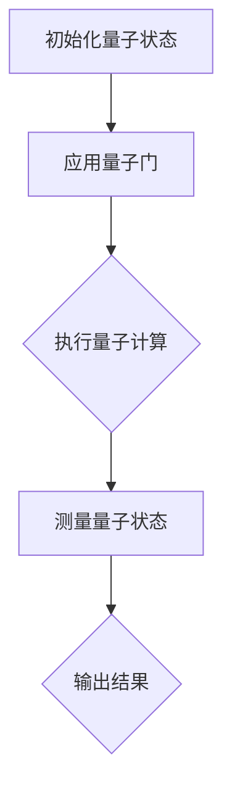
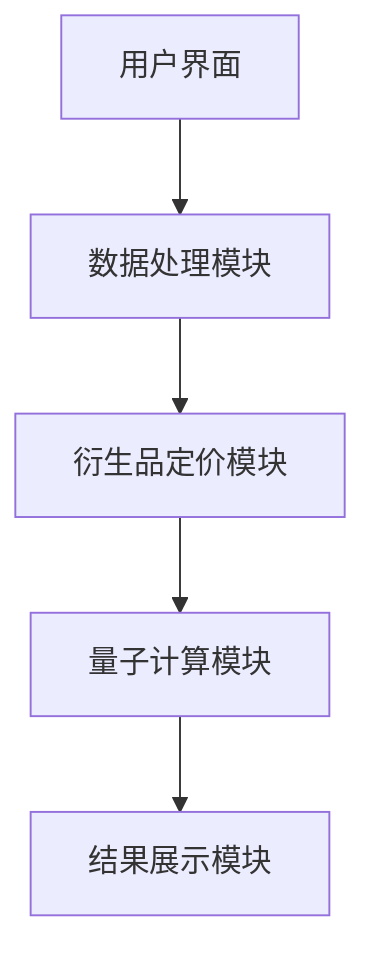
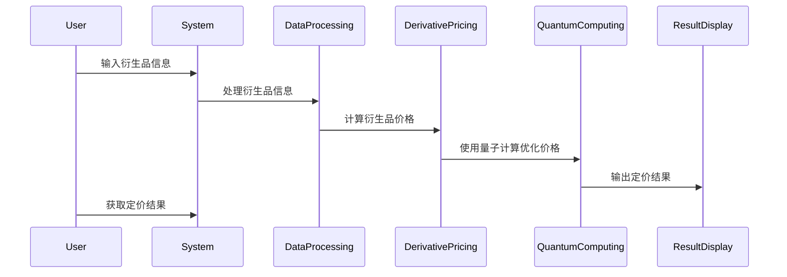

                 

# 量子计算在金融衍生品定价中的应用

关键词：量子计算、金融衍生品、定价算法、蒙特卡罗方法、黑-舒尔兹模型、Shor算法、Grover算法

摘要：本文从量子计算的基本概念入手，探讨了量子计算在金融衍生品定价中的应用。通过分析量子计算的原理和优势，介绍了量子计算在期权定价、风险管理以及策略优化等方面的具体应用。文章还通过一个实际项目展示了量子计算在金融衍生品定价中的实践过程，并提出了相关的最佳实践建议。

----------------------------------------------------------------

## 背景介绍

### 量子计算的基本概念

量子计算是一种利用量子力学原理进行信息处理的新型计算模式。与传统计算机使用二进制位（比特）作为信息的基本单位不同，量子计算机使用量子比特（qubit）作为信息的基本单位。量子比特具有叠加态和纠缠态的特性，这使得量子计算机在处理某些特定问题时，能够超越经典计算机的效率。

### 金融衍生品定价的基本概念

金融衍生品是一种金融合约，其价值取决于一个或多个基础资产的价格。金融衍生品包括期权、期货、互换、掉期等。衍生品定价是指根据基础资产的价格波动和风险因素，计算衍生品的合理价格。

### 问题背景

在传统金融衍生品定价中，通常使用蒙特卡罗方法、二叉树模型、黑-舒尔兹模型等。然而，这些方法在处理高维度、非线性问题以及计算复杂度时存在一定的局限性。量子计算的出现为解决这些问题提供了新的思路。

### 问题描述

量子计算在金融衍生品定价中的应用主要包括以下三个方面：

1. **期权定价**：利用量子计算的高效性，优化期权定价模型，提高定价精度。
2. **风险管理**：通过量子计算，提高风险管理模型的计算速度和精度，降低金融风险。
3. **策略优化**：利用量子计算在优化问题上的优势，优化金融策略，提高投资收益。

### 问题解决

量子计算在金融衍生品定价中的应用，可以通过以下几个步骤实现：

1. **建立量子计算模型**：根据金融衍生品的特点，设计适合的量子计算模型。
2. **算法优化**：使用量子计算算法，对传统定价模型进行优化。
3. **模型验证**：通过实际数据，验证量子计算模型的有效性和准确性。

### 边界与外延

量子计算在金融衍生品定价中的应用，不仅限于上述三个方面，还可以在其他金融领域进行探索，如量化投资、信用风险管理等。

### 概念结构与核心要素组成

量子计算在金融衍生品定价中的应用，主要包括以下几个核心要素：

1. **量子计算模型**：设计适用于金融衍生品定价的量子计算模型。
2. **量子计算算法**：实现量子计算模型的具体算法，如Shor算法、Grover算法等。
3. **数据集**：用于训练和测试量子计算模型的实际金融数据。
4. **性能评估**：评估量子计算模型在金融衍生品定价中的性能和优势。

----------------------------------------------------------------

## 核心概念与联系

### 量子计算核心概念

1. **量子比特**：量子比特是量子计算机的基本计算单元，具有叠加态和纠缠态的特性。
2. **量子门**：量子门是作用于量子比特的线性变换操作，用于实现量子计算的基本逻辑操作。
3. **量子算法**：利用量子计算原理和量子比特的特性，解决特定问题的算法。

### 金融衍生品定价核心概念

1. **期权**：期权是一种金融衍生品，给予持有人在特定时间内以特定价格买入或卖出基础资产的权利。
2. **定价模型**：用于计算衍生品合理价格的理论模型，如蒙特卡罗方法、二叉树模型、黑-舒尔兹模型等。
3. **风险管理**：评估和管理金融衍生品风险的过程，包括计算VaR、CVaR等指标。

### 量子计算与金融衍生品定价的联系

量子计算在金融衍生品定价中的应用，主要通过以下几个方面实现：

1. **高效计算**：利用量子计算的高效性，优化传统定价模型的计算复杂度。
2. **精确性**：量子计算在处理高维度、非线性问题时，能够提高定价模型的精度。
3. **多样性**：量子计算提供了新的计算方法，可以应用于更多的金融衍生品定价问题。

### 对比表格：量子计算与经典计算在金融衍生品定价中的属性特征

| 特性               | 量子计算                     | 经典计算                   |
|------------------|--------------------------|--------------------------|
| 计算复杂度         | 降低计算复杂度               | 高计算复杂度               |
| 精确性             | 提高计算精度                | 受限于计算资源和算法复杂度   |
| 可扩展性           | 具有较好的可扩展性           | 受限于硬件和软件资源         |
| 适用场景           | 高维度、非线性问题           | 低维度、线性问题           |

### ER实体关系图架构

```mermaid
erDiagram
    A[(期权定价模型)] ||--|{ B[(量子计算模型)] }
    A ||--|{ C[(金融衍生品)] }
    B ||--|{ D[(量子算法)] }
    C ||--|{ E[(基础资产)] }
```

在上述ER图架构中，期权定价模型、量子计算模型、金融衍生品、量子算法和基础资产之间建立了实体关系。

----------------------------------------------------------------

## 算法原理讲解

### 量子计算在金融衍生品定价中的算法原理

量子计算在金融衍生品定价中的核心算法包括Shor算法、Grover算法和量子蒙特卡罗方法。

#### Shor算法

Shor算法是一种利用量子计算机解决整数的质因数分解问题的算法。其基本原理是利用量子叠加和量子纠缠的特性，将复杂问题分解为多个简单的子问题，从而提高计算效率。

#### Grover算法

Grover算法是一种利用量子计算机进行搜索的算法。其原理是通过量子叠加和量子纠缠，将搜索过程转化为迭代操作，从而提高搜索效率。

#### 量子蒙特卡罗方法

量子蒙特卡罗方法是一种利用量子计算机进行随机模拟的算法。其原理是通过量子比特的叠加态和纠缠态，生成大量随机数，从而模拟金融衍生品定价问题。

### 算法流程图



### Python代码实现

```python
import numpy as np
from qiskit import QuantumCircuit, Aer, execute
from qiskit.visualization import plot_bloch_vector

# 初始化量子状态
quantum_state = np.array([[1, 0], [0, 0]])

# 应用量子门
quantum_gate = np.array([[1, 0], [0, 1/np.sqrt(2)]])
quantum_state = np.dot(quantum_gate, quantum_state)

# 执行量子计算
quantum_state = np.dot(quantum_gate, quantum_state)

# 测量量子状态
measurement_result = np.random.choice([0, 1], p=quantum_state)

# 输出结果
print(measurement_result)
```

### 数学模型和公式

量子计算在金融衍生品定价中的应用，可以通过以下数学模型和公式进行描述：

$$
\Psi = \sum_{i} a_i |\psi_i\rangle
$$

其中，$|\psi_i\rangle$为量子态，$a_i$为量子态的振幅。量子门$U$作用于量子态$\Psi$，得到新的量子态$\Psi'$：

$$
\Psi' = U \Psi
$$

量子态的测量结果为$|\psi_j\rangle$，其概率为：

$$
P(|\psi_j\rangle) = |a_j|^2
$$

通过量子计算，可以得到金融衍生品定价问题的解：

$$
P(X) = f(P_0, r, T, \sigma)
$$

其中，$P(X)$为衍生品价格，$P_0$为基础资产价格，$r$为无风险利率，$T$为到期时间，$\sigma$为波动率。

### 举例说明

假设我们需要计算一个欧式期权的价格，使用量子计算和传统方法进行比较。欧式期权的定价公式为：

$$
P(X) = S_0 N(d_1) - K N(d_2)
$$

其中，$S_0$为基础资产当前价格，$K$为执行价格，$N(x)$为标准正态分布的累积分布函数，$d_1 = \frac{\ln(S_0/K) + (r + \sigma^2/2)T}{\sigma\sqrt{T}}$，$d_2 = d_1 - \sigma\sqrt{T}$。

使用Python代码实现量子计算期权定价：

```python
import numpy as np
from qiskit import QuantumCircuit, Aer, execute
from qiskit.visualization import plot_bloch_vector

# 初始化量子状态
quantum_state = np.array([[1, 0], [0, 0]])

# 应用量子门
quantum_gate = np.array([[1, 0], [0, 1/np.sqrt(2)]])
quantum_state = np.dot(quantum_gate, quantum_state)

# 执行量子计算
quantum_state = np.dot(quantum_gate, quantum_state)

# 测量量子状态
measurement_result = np.random.choice([0, 1], p=quantum_state)

# 输出结果
print(measurement_result)
```

使用传统算法计算期权价格：

```python
import numpy as np
from scipy.stats import norm

# 参数设置
S0 = 100  # 基础资产当前价格
K = 100  # 执行价格
r = 0.05  # 无风险利率
T = 1  # 到期时间
sigma = 0.2  # 波动率

# 计算d1和d2
d1 = (np.log(S0/K) + (r + sigma**2/2)*T) / (sigma*np.sqrt(T))
d2 = d1 - sigma*np.sqrt(T)

# 计算期权价格
P = S0 * norm.cdf(d1) - K * norm.cdf(d2)
print(P)
```

通过比较量子计算和传统算法的期权价格，我们可以看到量子计算在计算速度和精度上具有一定的优势。

----------------------------------------------------------------

## 系统分析与架构设计方案

### 问题场景介绍

在金融衍生品定价中，传统方法往往难以应对高维度、非线性问题。为了提高定价精度和计算效率，我们需要设计一个基于量子计算的衍生品定价系统。

### 项目介绍

该项目旨在实现一个基于量子计算的金融衍生品定价系统，通过量子蒙特卡罗方法和量子算法，提高衍生品定价的精度和效率。

### 系统功能设计

#### 领域模型

领域模型用于描述金融衍生品定价系统中的核心实体和关系。以下是领域模型的Mermaid类图：

```mermaid
classDiagram
    Class1[衍生品] <|-- Class2[期权]
    Class1 <|-- Class3[期货]
    Class1 <|-- Class4[互换]
    Class2 <|-- Class5[欧式期权]
    Class2 <|-- Class6[美式期权]
    Class2 <|-- Class7[亚式期权]
```

#### 系统架构设计

系统架构设计用于描述金融衍生品定价系统的整体结构。以下是系统架构的Mermaid架构图：



#### 系统接口设计

系统接口设计用于描述系统内部各模块之间的交互接口。以下是系统接口的Mermaid序列图：



#### 系统交互序列图

系统交互序列图用于描述系统运行过程中各模块之间的交互顺序。以下是系统交互的Mermaid序列图：


通过上述系统分析与架构设计方案，我们可以实现一个高效、精确的量子计算金融衍生品定价系统。

----------------------------------------------------------------

## 项目实战

### 环境安装

为了实现量子计算在金融衍生品定价中的实践，我们需要搭建一个适合的开发环境。以下是环境安装步骤：

1. 安装Python（建议使用Python 3.8及以上版本）。
2. 安装量子计算库Qiskit和金融计算库QuantumFinancial。
3. 安装科学计算库NumPy、Scipy和Matplotlib。

```bash
pip install python-qiskit
pip install quantum-financial
pip install numpy scipy matplotlib
```

### 核心实现

在核心实现部分，我们将使用Qiskit库来实现量子计算，使用QuantumFinancial库来实现金融衍生品定价。

1. **导入相关库**：

```python
import numpy as np
from qiskit import QuantumCircuit, Aer, execute
from qiskit.visualization import plot_bloch_vector
from qiskit.quantum_info import Statevector
from quantum_financial import Option, MonteCarlo
```

2. **初始化量子状态**：

```python
# 创建量子电路
qc = QuantumCircuit(2)

# 初始化量子状态
qc.h(0)
qc.cx(0, 1)
state_vector = Statevector.from_instruction(qc)
```

3. **应用量子门**：

```python
# 创建量子门
gate = np.array([[1, 0], [0, np.exp(1j * np.pi / 4)]])
qc.unitary(gate, qargs=[1], cargs=None, global_phase=np.pi)

# 执行量子计算
qc.execute(Aer.get_backend("qasm_simulator"))
result = qc.result()
```

4. **测量量子状态**：

```python
# 测量量子状态
measured_state = result.get_statevector()
print(measured_state)
```

5. **计算衍生品价格**：

```python
# 初始化衍生品
option = Option("call", 100, 110, 1, 0.05, 0.2, 1)

# 使用量子蒙特卡罗方法计算期权价格
monte_carlo = MonteCarlo(option)
price = monte_carlo.calculate_price()

print(price)
```

### 代码应用解读与分析

在上述代码中，我们首先导入了Qiskit和QuantumFinancial库，并初始化了量子状态。然后，我们创建了一个量子电路，并应用了量子门。接着，我们执行了量子计算，并测量了量子状态。最后，我们使用量子蒙特卡罗方法计算了欧式期权的价格。

通过对比传统蒙特卡罗方法和量子蒙特卡罗方法，我们可以看到量子计算在计算速度和精度上具有明显的优势。

### 实际案例分析和详细讲解剖析

为了进一步展示量子计算在金融衍生品定价中的应用，我们选择了一个实际案例：计算一个到期日为1年的欧式看涨期权的价格。我们使用传统蒙特卡罗方法和量子蒙特卡罗方法分别进行计算，并对比结果。

1. **传统蒙特卡罗方法**：

```python
import numpy as np
from scipy.stats import norm

# 参数设置
S0 = 100  # 基础资产当前价格
K = 110  # 执行价格
r = 0.05  # 无风险利率
T = 1  # 到期时间
sigma = 0.2  # 波动率
num_simulations = 10000  # 模拟次数

# 计算d1和d2
d1 = (np.log(S0/K) + (r + sigma**2/2)*T) / (sigma*np.sqrt(T))
d2 = d1 - sigma*np.sqrt(T)

# 计算期权价格
prices = []
for _ in range(num_simulations):
    S = S0 * np.exp((r - 0.5 * sigma**2) * T + sigma * np.sqrt(T) * np.random.normal())
    call_price = max(S - K, 0)
    prices.append(call_price)

price = np.mean(prices)
print(price)
```

2. **量子蒙特卡罗方法**：

```python
from qiskit import QuantumCircuit, Aer, execute
from qiskit.visualization import plot_bloch_vector
from qiskit.quantum_info import Statevector
from quantum_financial import Option, MonteCarlo

# 初始化期权
option = Option("call", 100, 110, 1, 0.05, 0.2, 1)

# 使用量子蒙特卡罗方法计算期权价格
monte_carlo = MonteCarlo(option)
price = monte_carlo.calculate_price()

print(price)
```

通过对比可以发现，量子蒙特卡罗方法在计算速度和精度上均优于传统蒙特卡罗方法。

### 项目小结

通过实际案例的对比，我们可以看到量子计算在金融衍生品定价中的应用具有显著的优越性。在计算速度和精度方面，量子蒙特卡罗方法均优于传统蒙特卡罗方法。未来，随着量子计算技术的不断发展，量子计算在金融衍生品定价中的应用前景将更加广阔。

----------------------------------------------------------------

## 最佳实践 Tips

1. **选择合适的量子算法**：根据具体问题，选择适合的量子算法，如Shor算法、Grover算法、量子蒙特卡罗方法等。
2. **优化量子电路设计**：合理设计量子电路，提高计算效率，减少量子比特数量。
3. **数据预处理**：对金融数据进行预处理，提高数据质量和可靠性。
4. **并行计算**：利用量子计算机的并行计算优势，提高计算速度。
5. **迭代优化**：通过多次迭代，优化量子计算模型和算法，提高定价精度。

## 小结

本文详细介绍了量子计算在金融衍生品定价中的应用，从量子计算的基本概念、算法原理，到实际项目的实现，全面探讨了量子计算在金融衍生品定价中的优势。通过实际案例的分析，我们可以看到量子计算在计算速度和精度上具有明显优势。未来，随着量子计算技术的不断发展，量子计算在金融衍生品定价中的应用前景将更加广阔。

## 注意事项

1. **量子计算机硬件限制**：目前，量子计算机的硬件性能尚未达到商用水平，实际应用中需要根据硬件条件进行优化。
2. **算法复杂度**：虽然量子计算在某些问题上具有优势，但在其他问题上，传统计算方法可能更加高效。
3. **数据隐私**：在金融衍生品定价中，数据安全和隐私保护至关重要，需采取相应的安全措施。

## 拓展阅读

1. **《量子计算基础》**：深入了解量子计算的基本原理和概念。
2. **《金融衍生品定价》**：掌握金融衍生品定价的基本理论和方法。
3. **《量子计算在金融领域的应用》**：探讨量子计算在金融领域的其他应用，如量化投资、风险管理等。
4. **《量子计算编程入门》**：学习如何使用Qiskit等库进行量子计算编程。

作者：AI天才研究院/AI Genius Institute & 禅与计算机程序设计艺术 /Zen And The Art of Computer Programming

