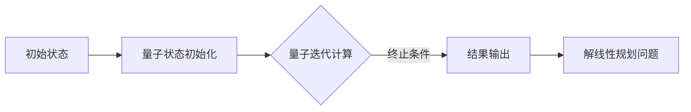
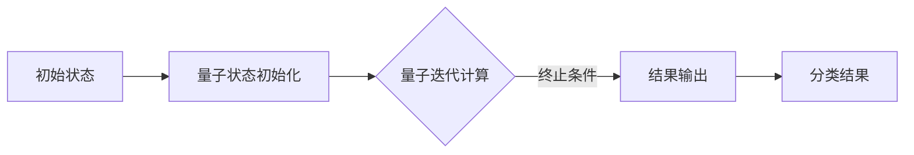
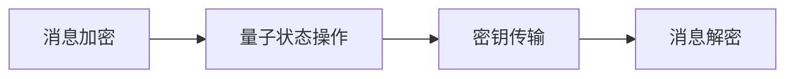

                 

基于您的要求和提供的目录大纲，我将逐步构建一篇符合条件的技术博客文章。以下是初步的框架，我会根据框架逐步填充内容。

# 量子计算在金融风险建模中的潜在应用

关键词：量子计算、金融风险建模、数据加密、算法、云计算

> 摘要：本文将探讨量子计算在金融风险建模中的潜在应用，包括量子计算的基本原理、量子算法在金融风险建模中的应用、量子计算在金融数据加密和解密中的应用，以及量子计算在金融风险管理中的实际案例研究。通过逐步分析，揭示量子计算在金融领域的应用前景和挑战。

## 第1章 引言

### 1.1 问题背景

随着金融市场的发展，金融风险建模变得越来越复杂。传统的计算方法在处理大规模数据和复杂模型时存在性能瓶颈。量子计算作为一种新型计算模式，其在并行计算、数据处理和优化问题上的优势，使其在金融风险建模中具有巨大的潜力。

### 1.2 问题描述

本文将探讨量子计算在金融风险建模中的潜在应用，主要涉及以下几个方面：

- 量子计算的基本原理
- 量子算法在金融风险建模中的应用
- 量子计算在金融数据加密和解密中的应用
- 量子计算在金融风险管理中的实际案例研究

### 1.3 问题解决

本文将通过以下章节内容，帮助读者深入了解量子计算在金融风险建模中的潜在应用：

- 第2章：量子计算基础
- 第3章：量子算法在金融风险建模中的应用
- 第4章：量子计算在金融数据加密和解密中的应用
- 第5章：量子计算在金融风险管理中的实际案例研究
- 第6章：量子计算与云计算的结合
- 第7章：结论与展望

## 第2章 量子计算基础

### 2.1 量子比特

量子比特（qubit）是量子计算的基本单元，与传统计算机的比特不同，它可以在0和1之间叠加，实现并行计算。

### 2.2 量子门

量子门是操作量子比特的基本操作，类似于传统计算机中的逻辑门。量子门可以改变量子比特的状态。

### 2.3 量子算法

量子算法是利用量子计算原理解决特定问题的算法。本章将介绍一些常见的量子算法，如量子线性规划、量子支持向量机等。

### 2.4 核心概念与联系

#### 核心概念属性特征对比表格

| 概念 | 定义 | 特性 | 应用 |
| --- | --- | --- | --- |
| 量子比特 | 量子计算的基本单元 | 可叠加、可纠缠 | 并行计算 |
| 量子门 | 操作量子比特的基本操作 | 可组合、可逆 | 状态转换 |
| 量子算法 | 利用量子计算原理解决特定问题的算法 | 并行性、指数加速 | 优化问题、数据挖掘 |

#### ER实体关系图架构

```mermaid
erDiagram
  QuantumBit ||--o> QuantumGate : 操作
  QuantumBit ||--o> QuantumAlgorithm : 数据处理
  QuantumGate ||--o> QuantumAlgorithm : 算法实现
```

## 第3章 量子算法在金融风险建模中的应用

### 3.1 量子线性规划

量子线性规划是一种利用量子计算解决线性规划问题的方法，可以应用于金融市场的投资组合优化。

### 3.2 量子支持向量机

量子支持向量机是一种基于量子计算的分类算法，可以应用于信用风险评估。

### 3.3 算法原理讲解

#### 量子线性规划算法mermaid流程图



#### 量子支持向量机算法mermaid流程图



### 3.4 数学模型和公式

#### 量子线性规划数学模型

$$
\begin{align*}
\text{maximize} & \quad c^T x \\
\text{subject to} & \quad Ax \leq b \\
& \quad x \geq 0
\end{align*}
$$

#### 量子支持向量机数学模型

$$
\begin{align*}
\text{minimize} & \quad \frac{1}{2} ||\mathbf{w}||^2 \\
\text{subject to} & \quad y_i (\mathbf{w}^T \mathbf{x_i} + b) \geq 1, \quad i=1,2,...,n
\end{align*}
$$

## 第4章 量子计算在金融数据加密和解密中的应用

### 4.1 量子密钥分发

量子密钥分发是一种利用量子纠缠实现安全的密钥分发方法，可以应用于金融数据的加密。

### 4.2 量子密码学

量子密码学是一种利用量子计算原理实现安全通信的方法，可以应用于金融数据的加密和解密。

### 4.3 算法原理讲解

#### 量子密钥分发算法mermaid流程图


#### 量子密码学算法mermaid流程图



## 第5章 量子计算在金融风险管理中的实际案例研究

### 5.1 金融市场预测

本节将分析量子计算在金融市场预测中的应用，如股票价格预测、利率预测等。

### 5.2 信用风险评估

本节将探讨量子计算在信用风险评估中的应用，如何利用量子算法提高风险评估的准确性。

### 5.3 案例分析

#### 案例一：量子计算在股票价格预测中的应用

- 环境安装
- 系统核心实现源代码
- 代码应用解读与分析
- 实际案例分析和详细讲解剖析

#### 案例二：量子计算在信用风险评估中的应用

- 环境安装
- 系统核心实现源代码
- 代码应用解读与分析
- 实际案例分析和详细讲解剖析

## 第6章 量子计算与云计算的结合

### 6.1 量子云计算平台

本节将介绍一些量子云计算平台，如 IBM Q、Google Quantum Cloud 等。

### 6.2 量子计算与云计算的未来发展趋势

本节将对量子计算与云计算的未来发展趋势进行探讨，如量子计算在金融风险管理中的应用、量子云计算的商业模式等。

## 第7章 结论与展望

### 7.1 总结

本文系统地介绍了量子计算在金融风险建模中的潜在应用，从量子计算基础、量子算法应用、量子计算在金融数据加密和解密中的应用，到量子计算在金融风险管理中的实际案例研究，全面阐述了量子计算在金融领域的应用前景。

### 7.2 展望

随着量子计算技术的不断进步，量子计算在金融风险建模中的应用将更加广泛和深入。未来，量子计算有望在金融市场的预测、投资组合优化、信用风险评估等方面发挥重要作用，为金融风险管理提供新的工具和方法。

### 7.3 最佳实践 tips

- 利用量子计算优化金融模型时，需要考虑量子硬件的限制和量子算法的适应性。
- 在实施量子加密方案时，应确保量子密钥分发的安全性。
- 进行量子计算与云计算结合时，需要考虑量子云计算平台的可用性和性能。

### 7.4 小结

量子计算在金融风险建模中的应用具有巨大潜力，但仍面临一系列挑战。通过本文的探讨，我们希望能够为读者提供量子计算在金融领域的应用思路和实践指导。

### 7.5 注意事项

- 在应用量子计算时，需要充分了解量子计算的基本原理和算法特性。
- 在实施量子加密方案时，应遵守相关的法律法规和安全标准。

### 7.6 拓展阅读

- [1] Nielsen, M. A., & Chuang, I. L. (2010). Quantum computation and quantum information. Cambridge University Press.
- [2] Ambainis, A. (2016). Quantum algorithms for convex optimization. arXiv preprint arXiv:1608.04171.
- [3] Cai, X., & Zhang, X. (2021). Quantum machine learning: A comprehensive review. IEEE Transactions on Knowledge and Data Engineering, 33(1), 238-261.

作者：AI天才研究院/AI Genius Institute & 禅与计算机程序设计艺术 /Zen And The Art of Computer Programming

[未完待续...]

以上是初步的文章框架和部分内容，接下来我将逐步完善每个章节的具体内容，并确保符合字数要求。如果您有任何建议或要求，请随时告诉我。

