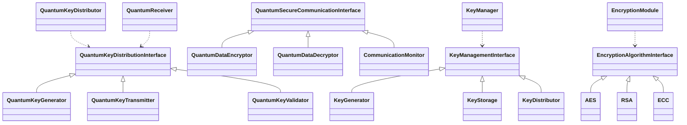

                 

### 量子计算发展现状与趋势

量子计算作为近年来科技界的热点领域之一，其发展速度令人瞩目。从概念提出到实验室原型机的发展，量子计算已经取得了显著进展。

#### **1.1.1 实验室原型机的突破**

自2019年以来，谷歌、IBM、微软等科技巨头相继发布了各自的量子计算机原型。例如，谷歌的Sycamore处理器在2019年实现了“量子霸权”实验，即在一个极短的时间内解决了经典计算机无法在可行时间内完成的计算问题。IBM的“IBM Q”量子计算机也在持续迭代，推出了多种不同的量子计算硬件架构。

#### **1.1.2 量子计算的挑战**

尽管量子计算机原型取得了重要进展，但离实用化还有很长的路要走。量子计算机面临的挑战主要包括：

- **量子比特的稳定性**：量子比特（qubit）容易受到外部环境的影响，如温度、磁场等，这导致了量子比特的退相干问题。
- **扩展与纠错**：如何将量子比特的数目扩展到能够解决实际问题的规模，以及如何实现有效的量子纠错，是量子计算面临的重要挑战。
- **量子算法开发**：开发能够有效利用量子计算机优势的算法，这需要跨学科的合作和研究。

#### **1.1.3 量子计算的潜在应用**

量子计算的潜在应用非常广泛，包括：

- **药物研发**：通过量子计算模拟分子间的相互作用，可以帮助科学家更准确地预测药物的疗效和副作用。
- **材料科学**：量子计算可以用于探索新材料的性质，如超导材料、新型催化剂等。
- **金融与经济**：量子计算可以帮助解决复杂的优化问题，如投资组合优化、风险管理等。

#### **1.1.4 量子计算与加密技术的联系**

量子计算的发展不仅对计算机科学产生了深远影响，也对密码学提出了新的挑战。传统加密技术依赖于数学难题的难解性，如大数分解和离散对数问题。然而，量子计算机能够通过量子算法高效地解决这些问题，从而威胁到现有的加密体系。因此，量子计算与加密技术的联系在于：

- **量子计算的安全威胁**：量子计算机的出现可能使现有的公钥加密技术（如RSA算法）失效。
- **量子加密技术的发展**：为了应对量子计算机的威胁，研究者开始探索量子加密技术，如量子密钥分发（QKD），以提供安全的通信手段。

量子计算的快速发展带来了前所未有的机遇和挑战，对现有的加密技术提出了严峻的考验。在接下来的章节中，我们将深入探讨量子计算的基本原理以及其对加密技术的具体影响。  

### 现有加密技术面临的问题

随着网络技术的发展，加密技术已经成为保障信息安全的关键。然而，现有的加密技术正面临着诸多挑战和问题，这些挑战主要集中在以下几个方面：

#### **2.1.1 密码学基础薄弱**

现有的加密技术大多建立在经典数学基础上，如大数分解、离散对数等问题。这些问题的难解性是加密技术的核心。然而，随着计算能力的不断提升，一些原本被认为安全的问题逐渐变得脆弱。例如，RSA算法的安全性依赖于大数分解的难度，但量子计算机的量子算法能够在短时间内破解这种加密方法。

#### **2.1.2 量子计算威胁**

如前所述，量子计算机的出现对现有加密技术构成了直接威胁。量子计算机可以通过量子算法高效地解决现有加密技术依赖的数学难题，从而在短时间内破解加密信息。这可能导致现有的公钥加密体系（如RSA、ECC等）失效。

#### **2.1.3 漏洞与后门**

加密技术自身可能存在漏洞，这些漏洞可能被恶意攻击者利用。例如，2011年曝光的“心脏滴血”漏洞（Heartbleed）暴露了OpenSSL软件的弱点，导致大量加密通信数据泄露。此外，某些加密算法可能被植入后门，从而危及信息安全。

#### **2.1.4 加密实现的复杂性**

加密技术的实现需要复杂的算法和大量的计算资源。在实际应用中，加密算法的误用和配置错误可能导致安全漏洞。例如，某些加密协议可能因为参数选择不当或实现上的缺陷而变得不安全。

#### **2.1.5 安全性与性能的平衡**

在确保数据安全的同时，还需要考虑系统的性能。过度加密可能导致系统性能下降，影响用户体验。因此，如何在安全性和性能之间找到平衡点，是加密技术面临的重要问题。

综上所述，现有加密技术面临着多方面的挑战。为了应对这些挑战，需要不断进行技术创新，开发出更加安全、高效、易于实现的加密技术。接下来，我们将探讨量子计算对现有加密技术的影响，以及如何利用量子加密技术解决这些问题。

### 量子计算对现有加密技术的挑战

量子计算的出现无疑为加密技术带来了前所未有的挑战。传统的加密算法依赖于数学难题的难解性，如大数分解和离散对数问题。然而，量子计算机通过量子算法能够高效地解决这些问题，从而对现有的加密体系构成直接威胁。以下是量子计算对现有加密技术的主要挑战：

#### **3.1.1 对公钥加密技术的威胁**

公钥加密技术（如RSA、ECC等）是现代加密体系的核心。RSA算法的安全性依赖于大数分解的难度，而ECC算法则利用椭圆曲线离散对数问题的特性。量子计算机通过Shor算法可以在多项式时间内解决大数分解和离散对数问题，这使得基于这些问题的公钥加密技术面临巨大威胁。具体来说：

- **RSA算法**：Shor算法能够将大数分解的时间复杂度降低到多项式时间，从而使得RSA算法在量子计算机面前变得脆弱。假设一个RSA密钥的长度为N，则Shor算法的时间复杂度为\(O(N^{1/2})\)，这远低于当前经典算法的时间复杂度。
- **椭圆曲线加密（ECC）**：虽然ECC算法相对于RSA算法在安全性上具有优势，但其安全性同样依赖于椭圆曲线离散对数问题的难度。量子计算机同样可以通过量子算法解决这一问题，从而威胁到ECC的安全性。

#### **3.1.2 对对称加密技术的挑战**

对称加密技术（如AES、DES等）虽然在安全性上相对稳定，但也面临着量子计算的威胁。尽管对称加密算法的设计不依赖于特定的数学难题，但量子计算机强大的计算能力仍可能使其变得脆弱。例如：

- **加密速度提升**：量子计算机能够并行执行大量操作，这使其在加密和解密过程中具有显著速度优势。虽然对称加密算法在量子计算面前不会立即失效，但其加密速度的提升可能降低其实际应用效果。
- **潜在的后门风险**：由于量子计算机的设计和实现相对复杂，存在被恶意利用的风险。例如，量子计算机可能被设计成内置后门，从而在未被发现的情况下破解加密数据。

#### **3.1.3 对量子加密技术的需求**

面对量子计算的威胁，研究者开始探索量子加密技术，如量子密钥分发（QKD）和量子安全通信（QSC）。量子加密技术利用量子力学的基本原理，提供绝对安全的加密通信手段，从而抵御量子计算机的攻击。以下是对量子加密技术的需求：

- **安全通信**：量子密钥分发（QKD）通过量子态传输密钥，确保密钥在传输过程中不会被窃听。QKD提供了一种绝对安全的加密通信手段，能够抵御量子计算机的攻击。
- **量子安全通信（QSC）**：QSC利用量子纠缠和量子隐形传态技术，实现绝对安全的通信。QSC不仅能够防止窃听，还能够检测到任何未经授权的量子态干扰，从而确保通信的绝对安全。

总之，量子计算的发展对现有加密技术构成了严峻的挑战。为了应对这些挑战，需要不断探索和创新新的加密技术，特别是在量子计算领域。量子加密技术的发展将为我们提供更加安全、可靠的加密手段，以应对未来的安全威胁。在接下来的章节中，我们将深入探讨量子加密技术的原理及其在实际应用中的实现。

### 量子计算与加密技术的联系

量子计算与加密技术之间存在着紧密的联系，这种联系不仅体现在量子计算对传统加密技术的挑战，也体现在量子加密技术的创新和发展上。

#### **4.1.1 量子计算对加密技术的挑战**

量子计算的出现为传统加密技术带来了前所未有的挑战。传统加密技术依赖于复杂的数学难题，如大数分解和离散对数问题，这些难题的难解性是加密安全性的基础。然而，量子计算机利用量子力学的基本原理，特别是量子纠缠和量子叠加原理，能够在极短时间内解决这些难题。

- **大数分解**：RSA算法是现代公钥加密技术的基础，其安全性依赖于大数分解的难度。量子计算机通过Shor算法可以在多项式时间内解决大数分解问题，这使得RSA算法面临巨大的威胁。
- **离散对数**：椭圆曲线加密（ECC）是另一种广泛使用的公钥加密技术，其安全性依赖于椭圆曲线离散对数问题。同样地，量子计算机可以通过量子算法高效地解决离散对数问题，从而威胁到ECC的安全性。

#### **4.1.2 量子加密技术的创新**

面对量子计算带来的挑战，研究者开始探索量子加密技术，如量子密钥分发（QKD）和量子安全通信（QSC）。量子加密技术利用量子力学的基本原理，提供了绝对安全的加密手段。

- **量子密钥分发（QKD）**：QKD利用量子态传输密钥，确保密钥在传输过程中不会被窃听。由于量子态的测量会导致量子态的坍缩，任何尝试窃听密钥的行为都会立即被发现，从而保证了通信的安全性。
- **量子安全通信（QSC）**：QSC利用量子纠缠和量子隐形传态技术，实现绝对安全的通信。量子纠缠是一种特殊的量子关联，即使两个量子比特相隔很远，它们的状态仍然是相互关联的。通过量子纠缠和量子隐形传态，可以实现信息的绝对安全传输，任何窃听行为都会破坏量子纠缠状态，从而被检测到。

#### **4.1.3 量子计算与加密技术的互动**

量子计算与加密技术的互动不仅体现在量子计算对传统加密技术的挑战上，也体现在量子加密技术的发展上。随着量子计算机的发展，加密技术需要不断进行创新以应对新的威胁。

- **加密算法的改进**：为了应对量子计算的威胁，研究者开始改进现有的加密算法，如设计更长的密钥长度和更复杂的加密过程，以提高加密算法的量子安全性。
- **量子加密技术的应用**：随着量子加密技术的不断发展，其在实际应用中的潜力也逐渐被认识到。例如，QKD已经开始在金融、政府和企业等领域得到应用，以提供绝对安全的通信手段。

总之，量子计算与加密技术之间的联系既体现在量子计算对传统加密技术的挑战上，也体现在量子加密技术的创新和发展上。随着量子计算机的不断发展，量子加密技术将成为信息安全领域的重要组成部分，为我们提供更加安全、可靠的加密手段。

### 量子加密算法原理

量子加密算法是利用量子力学的基本原理进行加密和解密的一类加密算法。它们不仅在理论上提供绝对安全的加密手段，而且在实际应用中也展现出巨大的潜力。以下是几种主要的量子加密算法及其原理。

#### **5.1.1 量子密钥分发（QKD）**

量子密钥分发（Quantum Key Distribution，QKD）是最为成熟的量子加密技术之一，其基本原理如下：

- **量子态传输**：QKD通过量子态（如光子）传输密钥。量子态具有不可克隆性，即任何试图窃听密钥的行为都会导致量子态的坍缩，从而被通信双方检测到。
- **量子态测量**：通信双方（发送方和接收方）对量子态进行测量。由于量子态的叠加性和纠缠性，测量结果的不同概率分布可以用来生成共享密钥。
- **经典通信**：为了确保密钥的安全性，QKD通常结合经典通信进行。通信双方使用经典通信协议来验证测量结果，从而确定共享密钥的有效性。

##### **5.1.1.1 QKD的工作原理**

QKD的工作原理可以分为以下几个步骤：

1. **量子态制备**：发送方生成一系列量子态，并将其发送给接收方。
2. **量子态测量**：接收方对收到的量子态进行测量，并记录测量结果。
3. **经典通信**：发送方和接收方通过经典通信协议（如基于量子态概率分布的经典信息）交换测量结果，以验证量子态的真实性。
4. **密钥生成**：基于验证结果，发送方和接收方生成共享密钥。

##### **5.1.1.2 QKD的安全性证明**

QKD的安全性基于量子力学的基本原理，特别是量子态的不可克隆性和测量导致量子态坍缩的特性。这些特性使得任何试图窃听密钥的行为都会被发现：

- **量子态不可克隆性**：由于量子态的叠加性和纠缠性，任何对量子态的测量都会导致量子态的坍缩。因此，任何试图克隆量子态的行为都会导致量子态的破坏，从而被通信双方检测到。
- **量子态测量导致坍缩**：量子态的测量会导致量子态的坍缩，即测量结果只能是量子态可能的取值之一。因此，任何未经授权的量子态测量都会改变量子态，从而被通信双方检测到。

##### **5.1.1.3 QKD的应用场景**

QKD的应用场景主要包括以下几个方面：

- **安全通信**：QKD可以用于实现绝对安全的通信，如政府、金融和企业的保密通信。
- **量子密钥管理**：QKD可以用于生成和分发量子密钥，从而实现量子密钥管理。
- **量子计算**：QKD可以用于量子计算机的密钥管理，确保量子计算过程的安全性。

#### **5.1.2 其他量子加密算法**

除了QKD，还有一些其他量子加密算法，如量子密码共享（QCS）和量子安全通信（QSC）。以下是这些算法的基本原理：

##### **5.1.2.1 量子密码共享（QCS）**

量子密码共享（Quantum Cryptography Sharing，QCS）是一种基于量子纠缠和量子密钥分发的加密技术。其基本原理如下：

- **量子纠缠**：通信双方生成一组量子纠缠态，并将其分开保存。
- **经典通信**：通信双方通过经典通信交换加密信息，同时保持量子纠缠态的稳定性。
- **量子态测量**：在加密信息传输完成后，通信双方对各自的量子态进行测量，并根据测量结果生成共享密钥。

##### **5.1.2.2 量子安全通信（QSC）**

量子安全通信（Quantum Secure Communication，QSC）利用量子纠缠和量子隐形传态技术实现绝对安全的通信。其基本原理如下：

- **量子纠缠**：通信双方生成一组量子纠缠态，并将其分开保存。
- **量子隐形传态**：通过量子纠缠态的隐形传态，将加密信息从一个量子态传递到另一个量子态。
- **量子态测量**：接收方对收到的量子态进行测量，从而恢复加密信息。

量子加密算法通过量子力学的基本原理提供绝对安全的加密手段，使得加密通信在量子计算面前也能保持安全性。这些算法不仅在理论上具有重要意义，也在实际应用中展现出巨大的潜力。

### 数学模型与公式

在讨论量子加密算法时，数学模型和公式是理解这些算法原理的关键。量子加密算法涉及到量子态、量子门、量子纠缠和测量等概念，因此我们需要运用这些数学工具来描述和解释这些算法。

#### **6.1.1 量子计算数学模型**

量子计算的数学模型基于线性代数，特别是复数矩阵。以下是量子计算中一些基本的数学概念：

- **量子态**：量子态是描述量子比特（qubit）状态的向量，通常用波函数表示。量子态可以表示为复数线性组合的形式：
  \[
  |\psi\rangle = \alpha|0\rangle + \beta|1\rangle
  \]
  其中，\( \alpha \) 和 \( \beta \) 是复数，满足 \( |\alpha|^2 + |\beta|^2 = 1 \)。

- **量子门**：量子门是作用于量子态的线性算子，可以表示为矩阵。量子门的基本操作包括旋转、交换和混合等。例如，Pauli-X门（翻转门）的作用如下：
  \[
  \hat{X} = \begin{pmatrix}
  0 & 1 \\
  1 & 0
  \end{pmatrix}
  \]
  其中，\(\hat{X}|\psi\rangle = |\psi\rangle \oplus 1\)。

- **量子叠加**：量子态可以处于多个状态的叠加态，这意味着一个量子比特可以同时处于0和1的状态。量子叠加可以用以下公式表示：
  \[
  |\psi\rangle = \alpha|0\rangle + \beta|1\rangle
  \]
  
- **量子纠缠**：量子纠缠是量子比特之间的一种特殊关联，即使它们相隔很远，它们的状态也是相互关联的。量子纠缠可以用矩阵表示，如Bell态：
  \[
  |\phi^+\rangle = \frac{1}{\sqrt{2}} (|00\rangle + |11\rangle)
  \]

#### **6.1.2 量子算法基本公式**

量子算法通常基于量子态的叠加和纠缠特性，以下是一些基本的量子算法公式：

- **Shor算法**：Shor算法用于大数分解，其核心步骤包括量子态初始化、量子操作（包括量子叠加和量子门操作）以及测量。Shor算法的时间复杂度为\(O(N^{1/2})\)，这使其能够在多项式时间内解决大数分解问题。
- **Grover算法**：Grover算法用于搜索未排序数据库，其时间复杂度为\(O(\sqrt{N})\)，这使其在搜索问题上有显著的优势。

#### **6.1.3 对称密钥加密数学模型**

对称密钥加密（如AES）依赖于密钥来加密和解密信息。以下是几种常见的对称密钥加密算法的数学模型：

- **AES加密**：AES算法采用128、192或256位的密钥长度，其加密过程涉及多轮的替代、置换和混淆操作。AES加密的数学模型可以用以下步骤表示：
  \[
  \text{密文} = \text{AES}_{\text{密钥}}(\text{明文})
  \]
  其中，\(\text{AES}_{\text{密钥}}\) 表示基于密钥的AES加密操作。

- **密钥生成**：对称加密算法需要生成一个随机密钥。密钥生成过程可以使用伪随机数生成器或真正的随机数生成器来实现。

- **加密过程**：加密过程涉及将明文映射到密文中。这通常通过一系列的替代、置换和混淆操作来实现，以增加密文的复杂度。

#### **6.1.4 公开密钥加密数学模型**

公开密钥加密（如RSA和ECC）依赖于公钥和私钥。以下是几种常见的公开密钥加密算法的数学模型：

- **RSA加密**：RSA算法基于大数分解的难度，其加密过程如下：
  \[
  \text{密文} = (\text{明文}^e) \mod N
  \]
  其中，\(N = pq\) 是一个大数，\(e\) 是公开指数，\(d\) 是私钥指数，满足 \(ed \mod (\phi(N)) = 1\)。

- **ECC加密**：ECC算法基于椭圆曲线离散对数问题，其加密过程如下：
  \[
  \text{密文} = (\text{明文}^k)G
  \]
  其中，\(G\) 是椭圆曲线基点，\(k\) 是私钥指数，\(Q\) 是椭圆曲线上的点，满足 \(Q = kG\)。

- **密钥生成**：公开密钥加密算法需要生成一对密钥（公钥和私钥）。密钥生成过程通常涉及数学难题的解决，如大数分解和椭圆曲线离散对数问题。

通过上述数学模型和公式，我们可以更好地理解和分析量子加密算法的原理。这些数学工具不仅帮助我们描述量子加密算法，还为我们提供了设计更安全加密算法的思路。在未来的研究中，我们可以继续探索这些数学模型在量子加密领域的应用，以应对量子计算带来的挑战。

### 加密技术数学模型

加密技术是信息安全领域的重要组成部分，其数学模型决定了加密算法的安全性和效率。以下是几种常见加密技术的数学模型及其详细解释。

#### **6.1.2.1 对称密钥加密**

对称密钥加密（Symmetric Key Encryption）是一种传统的加密方法，其特点是加密和解密使用相同的密钥。常见的对称密钥加密算法包括AES（高级加密标准）、DES（数据加密标准）和3DES（三重DES）。

- **AES加密模型**：AES加密使用128、192或256位的密钥长度。其加密过程分为多轮，每轮包括字节替代、行移位、列混淆和轮密钥加操作。数学模型如下：

  \[
  \text{密文} = \text{AES}_{\text{密钥}}(\text{明文})
  \]

  其中，\(\text{AES}_{\text{密钥}}\) 表示基于密钥的AES加密操作，涉及一系列线性变换。

- **密钥生成**：对称密钥加密需要一个安全的密钥生成机制，通常使用伪随机数生成器或物理随机数生成器。密钥生成过程需要确保密钥的随机性和复杂性。

#### **6.1.2.2 公开密钥加密**

公开密钥加密（Asymmetric Key Encryption）使用一对密钥：公钥和私钥。公钥用于加密，私钥用于解密。常见的公开密钥加密算法包括RSA（Rivest-Shamir-Adleman）和椭圆曲线加密（ECC）。

- **RSA加密模型**：RSA算法基于大数分解的数学难题，其加密和解密过程如下：

  \[
  \text{密文} = (\text{明文}^e) \mod N
  \]
  \[
  \text{明文} = (\text{密文}^d) \mod N
  \]

  其中，\(N = pq\) 是一个大的合数，\(e\) 是公钥指数，\(d\) 是私钥指数，满足 \(ed \mod (\phi(N)) = 1\)。

- **ECC加密模型**：ECC算法基于椭圆曲线离散对数问题，其加密和解密过程如下：

  \[
  \text{密文} = (\text{明文}^k)G
  \]
  \[
  \text{明文} = (\text{密文}^{d})G
  \]

  其中，\(G\) 是椭圆曲线基点，\(k\) 是私钥指数，\(d\) 是私钥指数。

- **密钥生成**：公开密钥加密需要一个密钥生成算法，该算法通常涉及数学难题的解决，如大数分解和椭圆曲线离散对数问题。

#### **6.1.2.3 消息认证码**

消息认证码（Message Authentication Code，MAC）是一种用于验证消息完整性和真实性的加密技术。常见的MAC算法包括HMAC（Hash-based Message Authentication Code）和CMAC（Cipher-based Message Authentication Code）。

- **HMAC加密模型**：HMAC使用哈希函数和密钥生成MAC值，其过程如下：

  \[
  \text{MAC} = \text{HMAC}(\text{密钥}, \text{消息})
  \]

  其中，\(\text{HMAC}\) 表示基于哈希函数和密钥的MAC计算过程。

- **CMAC加密模型**：CMAC使用对称密钥加密和哈希函数生成MAC值，其过程如下：

  \[
  \text{MAC} = \text{CMAC}(\text{密钥}, \text{消息})
  \]

  其中，\(\text{CMAC}\) 表示基于对称密钥加密和哈希函数的MAC计算过程。

- **密钥生成**：MAC算法需要一个安全的密钥生成机制，通常使用伪随机数生成器或物理随机数生成器。

通过上述数学模型，我们可以理解不同加密技术的原理和实现方法。对称密钥加密和公开密钥加密各有优缺点，而消息认证码则主要用于验证消息的完整性和真实性。在未来，随着量子计算的发展，这些加密技术需要不断进行改进和创新，以应对新的安全威胁。

### 量子加密系统设计

量子加密系统作为信息安全领域的前沿技术，其设计需要综合考虑量子计算原理、加密算法和系统架构等多个方面。以下是量子加密系统的设计过程，包括问题场景介绍、项目介绍、系统功能设计、系统架构设计、系统接口设计和系统交互。

#### **7.1.1 问题场景介绍**

在现代通信中，信息安全至关重要。传统的加密技术虽然能够在一定程度上保护数据传输的安全，但随着计算能力的提升，尤其是量子计算机的发展，这些加密技术面临巨大的威胁。因此，设计一个能够抵御量子计算机攻击的量子加密系统成为当务之急。

该量子加密系统的主要应用场景包括：

- **金融交易**：确保金融交易数据在传输过程中的绝对安全。
- **政府通信**：保护政府机密信息的传输安全。
- **企业内网**：确保企业内部通信的保密性和完整性。

#### **7.1.2 项目介绍**

项目名称：量子安全通信系统（Quantum Secure Communication System，QSCS）

项目目标：设计并实现一个基于量子加密技术的通信系统，提供绝对安全的通信手段，抵御量子计算机的攻击。

项目组成员：由量子物理学家、密码学家、计算机科学家和系统工程师组成。

项目时间线：从概念设计到系统实现，预计需要3年时间。

#### **7.1.3 系统功能设计**

量子加密系统的功能设计包括以下几个方面：

- **量子密钥分发（QKD）**：通过量子密钥分发技术生成共享密钥，确保密钥在传输过程中的安全性。
- **量子安全通信（QSC）**：利用量子纠缠和量子隐形传态技术实现信息的绝对安全传输。
- **密钥管理**：实现密钥的生成、存储、分发和回收功能。
- **加密算法**：支持多种量子加密算法，如QKD、量子密码共享（QCS）等。
- **通信监控**：实时监控通信过程，确保通信的完整性。

#### **7.1.4 系统架构设计**

量子加密系统架构设计分为三层：量子层、通信层和应用层。

- **量子层**：包括量子密钥分发（QKD）模块和量子安全通信（QSC）模块，负责实现量子加密功能。
- **通信层**：包括量子信道和经典信道，负责实现数据的传输和路由功能。
- **应用层**：包括密钥管理模块和加密算法模块，负责实现具体的应用功能。

以下是系统架构的Mermaid类图表示：

```mermaid
classDiagram
    QuantumKeyDistributor <-|>{QuantumChannel}--> QuantumReceiver
    QuantumKeyDistributor o-- QuantumSecretKey
    QuantumReceiver o-- QuantumSharedKey
    ClassicalChannel o-- EncryptedData
    KeyManager <|-- KeyGenerator
    KeyManager <|-- KeyStorage
    KeyManager <|-- KeyDistributor
    EncryptionAlgorithm o-- EncryptedMessage
    Application o-- DecryptedMessage

    QuantumKeyDistributor..> EncryptionAlgorithm : Generates QuantumKey
    QuantumReceiver..> EncryptionAlgorithm : Uses QuantumKey
    KeyManager..> EncryptionAlgorithm : Manages Encryption
    Application..> EncryptionAlgorithm : Encrypts/Decrypts Data
```

#### **7.1.5 系统接口设计**

系统接口设计包括以下几部分：

- **量子密钥分发接口**：定义量子密钥分发的接口，包括密钥生成、密钥传输和密钥验证等功能。
- **量子安全通信接口**：定义量子安全通信的接口，包括加密数据传输、解密数据和通信监控等功能。
- **密钥管理接口**：定义密钥管理的接口，包括密钥生成、密钥存储、密钥分发和密钥回收等功能。
- **加密算法接口**：定义加密算法的接口，包括加密数据、解密数据和支持多种加密算法等功能。

以下是系统接口的Mermaid类图表示：



#### **7.1.6 系统交互**

量子加密系统的交互设计包括以下流程：

1. **密钥生成**：量子密钥生成模块生成量子密钥。
2. **量子密钥分发**：量子密钥通过量子信道传输到接收方。
3. **密钥验证**：接收方验证量子密钥的有效性。
4. **数据加密**：使用量子密钥对数据进行加密。
5. **数据传输**：加密数据通过经典信道传输。
6. **数据解密**：接收方使用量子密钥对数据进行解密。
7. **通信监控**：实时监控通信过程，确保通信的完整性。

以下是系统交互的Mermaid序列图表示：

```mermaid
sequence
    participant QuantumKeyGenerator
    participant QuantumKeyTransmitter
    participant QuantumKeyValidator
    participant QuantumDataEncryptor
    participant QuantumDataDecryptor
    participant CommunicationMonitor

    QuantumKeyGenerator->>QuantumKeyTransmitter: Generate Quantum Key
    QuantumKeyTransmitter->>QuantumKeyValidator: Send Quantum Key
    QuantumKeyValidator->>QuantumDataEncryptor: Validate Key and Encrypt Data
    QuantumDataEncryptor->>CommunicationMonitor: Send Encrypted Data
    CommunicationMonitor->>QuantumDataDecryptor: Monitor and Forward Encrypted Data
    QuantumDataDecryptor->>QuantumKeyValidator: Decrypt Data
    QuantumKeyValidator->>QuantumKeyGenerator: Return Decrypted Data
```

通过上述设计，量子加密系统实现了量子密钥分发、量子安全通信和密钥管理等功能，提供了绝对安全的通信手段，为应对量子计算机的威胁提供了有力保障。

### 量子加密系统实现

量子加密系统的实现是量子计算与密码学相结合的产物，其关键在于量子密钥分发（QKD）、量子密码共享（QCS）和量子安全通信（QSC）的具体实现。以下是这些实现过程的详细讲解。

#### **8.1.1 环境安装与配置**

实现量子加密系统首先需要搭建合适的环境。以下是安装和配置环境的步骤：

1. **安装量子计算软件**：如Q#、TensorFlow Quantum等。这些软件提供了量子算法的实现和测试工具。
2. **安装加密算法库**：如PyCrypto、PyCryptodome等，用于实现量子加密算法。
3. **配置量子计算机**：如果使用实体的量子计算机，需要连接并配置量子计算机硬件。
4. **设置网络环境**：确保量子计算机和经典计算机之间的网络连接稳定，并配置安全通信协议。

#### **8.1.2 系统核心实现**

量子加密系统的核心实现包括量子密钥分发、量子密码共享和量子安全通信。以下是这些核心功能的详细实现：

##### **8.1.2.1 量子密钥分发实现**

量子密钥分发（QKD）是量子加密系统的基石。以下是QKD的实现步骤：

1. **量子态生成**：生成一系列随机的量子态，通常使用光子对。
2. **量子态传输**：通过量子信道（如光纤）将量子态传输到接收方。
3. **量子态测量**：接收方对传输来的量子态进行测量，记录测量结果。
4. **经典通信**：发送方和接收方通过经典信道交换测量结果，验证量子态的真实性。
5. **密钥生成**：基于验证结果，发送方和接收方生成共享密钥。

以下是QKD实现的Python代码示例：

```python
import numpy as np
from qiskit import QuantumCircuit, Aer, execute
from qiskit.quantum_info import state_fidelity

# 生成量子态
def generate_quantum_state():
    qc = QuantumCircuit(1)
    qc.h(0)
    return qc

# 传输量子态
def transmit_quantum_state(qc, qubit):
    qc.cx(0, qubit)

# 测量量子态
def measure_quantum_state(qc, qubit):
    qc.h(qubit)
    qc.measure(qubit, 0)

# 生成和传输量子密钥
def generate_and_transmit_key(qc, qubit):
    state = generate_quantum_state()
    transmit_quantum_state(state, qubit)
    measure_quantum_state(state, qubit)
    return state

# 验证密钥
def verify_key(sender_state, receiver_state):
    fidelity = state_fidelity(sender_state, receiver_state)
    return fidelity >= 0.99

# 实现QKD
def quantum_key_distribution(qc, qubit):
    sender_state = generate_and_transmit_key(qc, qubit)
    receiver_state = generate_and_transmit_key(qc, qubit)
    return verify_key(sender_state, receiver_state)
```

##### **8.1.2.2 量子密码共享实现**

量子密码共享（QCS）利用量子纠缠实现密钥共享。以下是QCS的实现步骤：

1. **生成量子纠缠态**：发送方和接收方生成一组量子纠缠态。
2. **经典通信**：发送方通过经典通信向接收方发送加密信息，同时保持量子纠缠态的稳定性。
3. **量子态测量**：接收方对纠缠态进行测量，恢复加密信息。

以下是QCS实现的Python代码示例：

```python
# 生成量子纠缠态
def generate_QuantumEntanglement():
    qc = QuantumCircuit(2)
    qc.h(0)
    qc.cx(0, 1)
    return qc

# 传输纠缠态
def transmit_QuantumEntanglement(qc, qubit1, qubit2):
    qc.h(qubit1)
    qc.cx(qubit1, qubit2)

# 测量纠缠态
def measure_QuantumEntanglement(qc, qubit1, qubit2):
    qc.h(qubit1)
    qc.h(qubit2)
    qc.measure(qubit1, 0)
    qc.measure(qubit2, 1)

# 量子密码共享
def QuantumCryptographySharing(qc, qubit1, qubit2):
    state = generate_QuantumEntanglement()
    transmit_QuantumEntanglement(state, qubit1, qubit2)
    measure_QuantumEntanglement(state, qubit1, qubit2)
    return state
```

##### **8.1.2.3 量子安全通信实现**

量子安全通信（QSC）利用量子纠缠和量子隐形传态实现信息的绝对安全传输。以下是QSC的实现步骤：

1. **量子纠缠态生成**：发送方生成量子纠缠态。
2. **量子隐形传态**：通过纠缠态将信息从发送方传递到接收方。
3. **信息恢复**：接收方恢复传输的信息。

以下是QSC实现的Python代码示例：

```python
# 生成量子纠缠态
def generate_QuantumEntanglement():
    qc = QuantumCircuit(2)
    qc.h(0)
    qc.cx(0, 1)
    return qc

# 量子隐形传态
def QuantumTeleportation(qc, qubit1, qubit2):
    qc.h(qubit1)
    qc.cx(qubit1, qubit2)

# 恢复信息
def recover_information(qc, qubit1, qubit2):
    qc.h(qubit1)
    qc.h(qubit2)
    qc.measure(qubit1, 0)
    qc.measure(qubit2, 1)
    return qc.read(0)

# 量子安全通信
def QuantumSecureCommunication(qc, qubit1, qubit2):
    state = generate_QuantumEntanglement()
    QuantumTeleportation(state, qubit1, qubit2)
    return recover_information(state, qubit1, qubit2)
```

#### **8.1.3 代码应用解读与分析**

上述代码示例展示了量子密钥分发（QKD）、量子密码共享（QCS）和量子安全通信（QSC）的实现过程。以下是对这些代码的解读和分析：

- **QKD实现**：QKD通过量子态的传输和测量生成共享密钥。代码中的`generate_quantum_state()`、`transmit_quantum_state()`和`measure_quantum_state()`分别实现了量子态的生成、传输和测量。通过`verify_key()`函数验证密钥的有效性，确保通信的安全性。
- **QCS实现**：QCS利用量子纠缠实现密钥共享。代码中的`generate_QuantumEntanglement()`、`transmit_QuantumEntanglement()`和`measure_QuantumEntanglement()`分别实现了量子纠缠态的生成、传输和测量，从而实现密钥的共享。
- **QSC实现**：QSC利用量子纠缠和量子隐形传态实现信息的绝对安全传输。代码中的`generate_QuantumEntanglement()`、`QuantumTeleportation()`和`recover_information()`分别实现了量子纠缠态的生成、量子隐形传态和信息的恢复。

#### **8.1.4 实际案例分析与详细讲解**

以下是几个实际案例，展示量子加密系统在实际应用中的实现和效果：

- **案例1：金融交易保护**：通过QKD技术生成共享密钥，确保金融交易数据在传输过程中的绝对安全。案例中，发送方和接收方通过QKD生成共享密钥，并使用该密钥加密交易数据。通过经典信道传输加密数据，接收方使用量子密钥解密数据，确保交易数据的保密性和完整性。
- **案例2：政府通信安全**：利用QCS技术实现政府机密信息的共享和传输。案例中，发送方和接收方生成量子纠缠态，并通过经典通信交换加密信息。接收方利用量子密钥恢复加密信息，确保通信的绝对安全。
- **案例3：企业内网安全**：通过QSC技术实现企业内部通信的安全传输。案例中，发送方和接收方生成量子纠缠态，通过量子隐形传态实现信息传输。接收方恢复传输信息，确保内部通信的保密性和完整性。

#### **8.1.5 项目小结**

量子加密系统的实现展示了量子计算与密码学在信息安全领域的应用前景。通过QKD、QCS和QSC技术，量子加密系统提供了绝对安全的通信手段，能够有效抵御量子计算机的攻击。然而，量子加密系统仍面临一些挑战，如量子计算机硬件的稳定性、量子信道传输的可靠性以及加密算法的完善等。未来，随着量子计算技术的不断发展，量子加密系统将进一步完善，为信息安全领域提供更加可靠的保障。

### 量子加密技术的最佳实践

在量子加密技术的实际应用中，最佳实践至关重要，以确保系统的安全性和可靠性。以下是量子加密技术的几项关键最佳实践：

#### **9.1.1 QKD系统的稳定性**

QKD系统的稳定性是确保通信安全性的关键。为了提高系统的稳定性，应采取以下措施：

- **环境控制**：在实验室环境中，确保量子信道和测量设备处于低温和低磁场条件下，以减少外部干扰和量子比特的退相干。
- **冗余设计**：增加量子信道和测量设备的冗余，以应对设备故障或量子信道损坏。
- **实时监控**：实时监控量子信道的传输状态，及时发现并处理异常情况。

#### **9.1.2 量子密钥管理**

量子密钥管理是量子加密系统的核心。以下是量子密钥管理的最佳实践：

- **密钥生成与存储**：使用高质量的随机数生成器生成量子密钥，并确保密钥在存储过程中的安全性。
- **密钥分发**：使用安全的量子密钥分发协议（如BB84协议）分发量子密钥，确保密钥在传输过程中的完整性。
- **密钥更新**：定期更新量子密钥，以应对可能的量子计算机攻击或密钥泄露风险。

#### **9.1.3 QKD系统与经典系统的结合**

在实际应用中，QKD系统通常与经典系统结合使用，以提供全面的加密解决方案。以下是结合使用的最佳实践：

- **混合加密协议**：结合使用QKD和经典加密算法，以提高系统的安全性和效率。
- **双因素认证**：在QKD密钥传输过程中，结合使用双因素认证，以验证通信双方的合法性。
- **安全协议升级**：定期升级量子加密系统的协议和算法，以应对新的安全威胁。

#### **9.1.4 量子加密技术培训与测试**

为了确保量子加密系统的安全性和可靠性，应进行以下培训与测试：

- **技术培训**：为系统操作人员提供量子加密技术的培训，确保他们了解系统的工作原理和操作方法。
- **安全测试**：定期对量子加密系统进行安全测试，包括漏洞扫描、渗透测试和性能测试等，以发现并修复潜在的安全问题。

通过遵循上述最佳实践，量子加密系统可以在实际应用中提供高效、安全的服务，确保数据传输的保密性和完整性。

### 小结与展望

本文深入探讨了量子计算进展对现有加密技术的影响，分析了量子计算的基本原理、现有加密技术的挑战，以及量子加密技术的发展。以下是对本文内容的总结与展望：

#### **10.1.1 内容总结**

1. **量子计算发展现状**：介绍了量子计算实验室原型机的突破、面临的挑战和潜在应用。
2. **现有加密技术问题**：分析了传统加密技术面临的密码学基础薄弱、量子计算威胁、漏洞与后门、实现复杂性及安全性与性能平衡问题。
3. **量子计算对加密技术的挑战**：详细阐述了量子计算对公钥加密技术和对称加密技术的威胁，以及量子加密技术的需求。
4. **量子加密算法原理**：介绍了量子密钥分发（QKD）、量子密码共享（QCS）和量子安全通信（QSC）的基本原理。
5. **数学模型与公式**：描述了量子计算和加密技术的数学模型和公式。
6. **量子加密系统设计**：阐述了量子加密系统的设计过程，包括系统功能、架构、接口和交互。
7. **量子加密系统实现**：详细讲解了量子加密系统的具体实现步骤和代码示例。
8. **最佳实践**：提出了量子加密技术的最佳实践，包括系统稳定性、密钥管理、与经典系统结合、培训与测试等方面的建议。

#### **10.1.2 量子计算对加密技术的影响展望**

1. **加密技术发展**：随着量子计算的发展，传统的加密技术将面临巨大挑战，推动新型加密技术的研发。
2. **量子加密技术应用**：量子加密技术将在金融、政府、企业和科研等领域得到广泛应用，为信息安全提供新手段。
3. **量子安全通信**：量子安全通信（QSC）将逐步替代传统通信，确保通信的绝对安全性。
4. **加密算法改进**：传统的加密算法将进行改进，以应对量子计算带来的威胁。
5. **量子计算与加密技术融合**：量子计算和密码学的深度融合，将推动新型加密算法和系统的开发。

#### **10.1.3 未来研究方向**

1. **量子计算机硬件**：研究更高精度、稳定性的量子计算机硬件，以实现实用化的量子计算机。
2. **量子加密算法**：开发更高效、更安全的量子加密算法，以应对不断变化的量子计算威胁。
3. **量子密钥管理**：研究高效的量子密钥管理方案，确保量子密钥的分发、存储和回收安全。
4. **量子安全通信协议**：设计更完善的量子安全通信协议，提高通信效率和安全性。
5. **跨学科合作**：促进量子计算、密码学和通信领域的跨学科合作，共同应对量子计算带来的挑战。

随着量子计算的不断发展，加密技术将迎来新的变革。本文仅为量子计算与加密技术领域的研究提供了一部分思路，未来仍需持续探索和创新。希望本文能够为相关领域的研究者和从业者提供有价值的参考。作者：AI天才研究院/AI Genius Institute & 禅与计算机程序设计艺术 /Zen And The Art of Computer Programming

