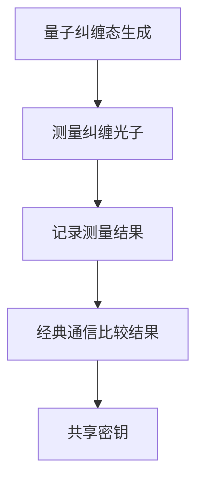
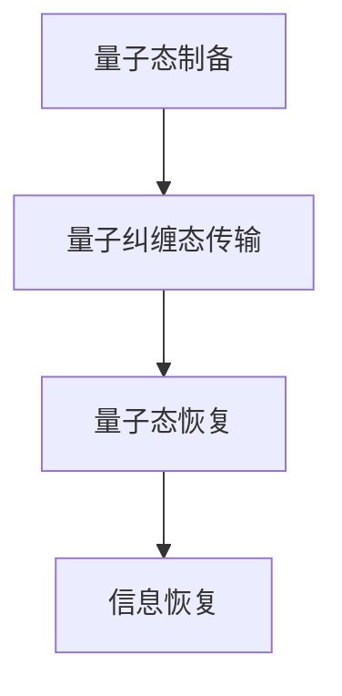
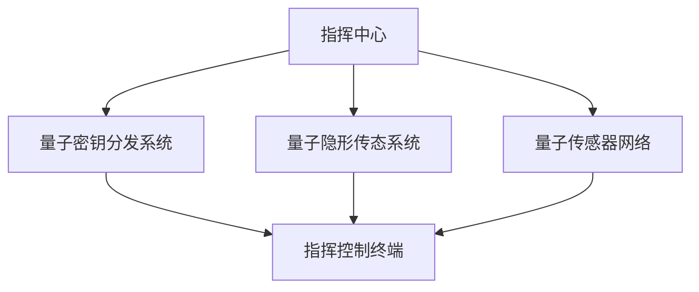
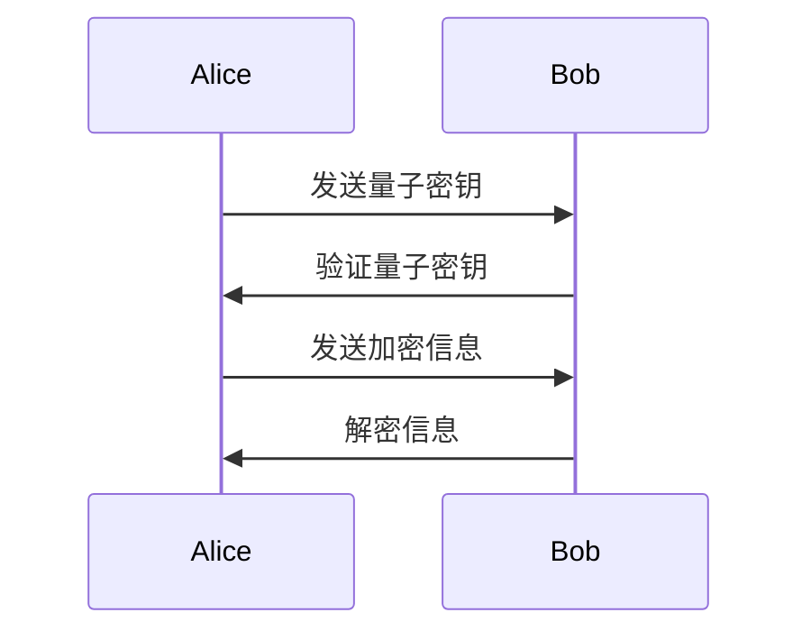

                 


## 量子通信在军事领域的应用：构建安全的指挥通信网络

### 关键词：量子通信、军事指挥、安全性、量子密钥分发、量子隐形传态

#### 摘要：
本文将深入探讨量子通信在军事领域的应用，特别是如何利用量子密钥分发和量子隐形传态技术构建安全的指挥通信网络。通过对量子通信核心概念的介绍、算法原理讲解以及实际应用案例的分析，本文将揭示量子通信在提升军事通信安全性和可靠性方面的潜力，为未来军事通信网络的发展提供新的思路。

### 1. 背景介绍

#### 1.1 量子通信的起源与发展

量子通信是建立在量子力学基础上的通信技术，其核心思想是利用量子比特（qubit）和量子态的叠加与纠缠特性进行信息传输。量子通信的起源可以追溯到20世纪70年代，当时Shor提出了量子算法能够解决大整数分解问题，从而揭示了传统加密方法的潜在安全隐患。随着量子技术的不断发展，量子通信逐渐成为研究热点，并在近年来取得了显著进展。

#### 1.2 量子通信在军事领域的重要性

军事通信的安全性和可靠性至关重要。在军事指挥通信网络中，传统通信技术面临着诸多挑战，如信号干扰、信号窃取和信号丢失等问题。量子通信的出现为解决这些难题提供了新的可能性。量子通信具有以下独特优势：

1. **量子密钥分发（QKD）**：QKD利用量子纠缠态实现密钥的安全分发，即使被第三方窃取也无法破解。
2. **量子隐形传态**：通过量子隐形传态可以实现远距离的瞬间信息传输，极大地提高了通信速度和安全性。
3. **量子防伪**：量子通信可以实现信息的真伪验证，防止信息被伪造。

#### 1.3 量子通信在军事领域的应用

量子通信在军事领域的应用主要包括以下几个方面：

1. **指挥控制通信**：通过量子密钥分发技术，确保指挥控制信息的绝对安全。
2. **情报传输**：利用量子隐形传态实现远程情报的快速传输。
3. **战场侦察**：通过量子传感器进行高精度的战场环境监测。
4. **卫星通信**：利用量子中继器实现卫星之间的量子通信。

### 2. 核心概念与联系

#### 2.1 量子通信原理

量子通信的核心在于量子比特（qubit）和量子态的叠加与纠缠。量子比特是量子信息的基本单元，它可以处于0和1的叠加状态。量子态的叠加与纠缠是量子通信的基础，通过量子纠缠态可以实现信息的快速传输和密钥的安全分发。

#### 2.2 军事应用

量子通信在军事领域的应用主要体现在以下几个方面：

1. **量子密钥分发（QKD）**：QKD技术可以确保军事通信的绝对安全性。通过量子纠缠态，通信双方可以生成一对共享密钥，即使密钥在传输过程中被第三方窃取，也无法破解。
   
2. **量子隐形传态**：量子隐形传态技术可以实现远程信息的瞬间传输，这在军事指挥控制中具有极大的优势。通过量子隐形传态，指挥官可以即时获取战场的最新情报，做出快速决策。

#### 2.3 对比分析

传统通信技术与量子通信在安全性、传输距离等方面存在显著差异：

1. **安全性**：传统通信技术容易受到信号窃取和干扰，而量子通信则利用量子纠缠和量子密钥分发实现信息的安全传输。
   
2. **传输距离**：传统光纤通信距离有限，而量子通信可以通过量子中继器实现远距离通信。

### 3. 算法原理讲解

#### 3.1 量子密钥分发算法

量子密钥分发（QKD）是量子通信的核心技术之一。其基本原理如下：

1. **量子纠缠态生成**：通信双方使用量子纠缠态生成器生成一对纠缠光子。
2. **量子态测量**：通信双方分别对纠缠光子进行测量，记录测量结果。
3. **经典通信**：双方通过经典通信协议比较测量结果，确定共享密钥。

下面是一个简化的量子密钥分发算法流程图：



#### 3.2 量子隐形传态算法

量子隐形传态是量子通信的另一个核心技术。其基本原理如下：

1. **量子态制备**：将待传输的信息编码到量子态上。
2. **量子纠缠态传输**：通过量子纠缠态将信息从发送方传输到接收方。
3. **量子态恢复**：接收方对传输到的量子态进行解码，恢复原始信息。

下面是一个简化的量子隐形传态算法流程图：



#### 3.3 数学模型与公式

量子密钥分发和量子隐形传态算法涉及到复杂的数学模型和公式。以下是简要的数学模型：

1. **量子密钥分发**：

   假设有两个量子比特 $|0\rangle$ 和 $|1\rangle$，通过量子纠缠态生成器生成一对纠缠光子，其态为：
   $$|\psi_{AB}\rangle = \frac{1}{\sqrt{2}} (|0\rangle_A \otimes |0\rangle_B + |1\rangle_A \otimes |1\rangle_B)$$
   
   通信双方对纠缠光子进行测量，记录测量结果。假设双方都测量得到 $|0\rangle$ 态，则共享密钥为 $0$。

2. **量子隐形传态**：

   假设发送方的量子态为 $|1\rangle$，接收方的量子态为 $|0\rangle$。通过量子纠缠态传输，接收方的量子态变为 $|1\rangle$，即：
   $$|0\rangle \otimes |0\rangle \rightarrow |1\rangle \otimes |1\rangle$$

   接收方对传输到的量子态进行解码，恢复原始信息。

### 4. 系统分析与架构设计方案

#### 4.1 问题场景介绍

军事指挥通信网络的需求包括：

1. **安全性**：确保指挥控制信息的绝对安全。
2. **可靠性**：确保通信网络的稳定运行。
3. **实时性**：实现信息的快速传输和实时响应。

#### 4.2 系统功能设计

系统功能设计包括以下方面：

1. **量子密钥分发**：通过QKD技术实现密钥的安全分发。
2. **量子隐形传态**：实现远程信息的快速传输。
3. **量子传感器**：进行高精度的战场环境监测。
4. **卫星通信**：实现卫星之间的量子通信。

领域模型如下所示：

```mermaid
classDiagram
Class1 <|-- SubClass1
Class1 <|-- SubClass2
Class1 : +int x
Class1 : +int y
Class1 : +String name

Class2 {
    +int id
    +int age
}

Class3 <|-- Class2
Class3 {
    +float salary
}

Class4 <|-- Class2
Class4 {
    +String title
}

Class2 +-- Class3
Class2 +-- Class4

Class2 : <<interface>>
Class3 : <<class>>
Class4 : <<class>>
```

#### 4.3 系统架构设计

系统架构设计如下所示：



#### 4.4 系统接口设计和系统交互

系统接口设计如下所示：



### 5. 项目实战

#### 5.1 环境安装

量子通信设备的安装与配置包括以下步骤：

1. **硬件安装**：安装量子密钥分发器和量子隐形传态设备。
2. **软件配置**：配置量子密钥分发和量子隐形传态软件。
3. **网络连接**：将设备连接到指挥通信网络。

#### 5.2 系统核心实现源代码

以下是一个简单的量子密钥分发源代码示例：

```python
from qiskit import QuantumCircuit, Aer, execute
from qiskit.quantum_info import Statevector

# 生成量子纠缠态
def generate_entrangle_state(qc, q0, q1):
    qc.h(q0)
    qc.cx(q0, q1)

# 测量纠缠态
def measure_entrangle_state(qc, q0, q1, q2):
    qc.h(q0)
    qc.cx(q0, q1)
    qc.h(q0)
    qc.measure(q0, q2)

# 量子密钥分发算法
def quantum_key_distribution(q0, q1, e0, e1):
    # 生成量子纠缠态
    generate_entrangle_state(qc, q0, q1)
    # 测量纠缠态
    measure_entrangle_state(qc, q0, q1, e0)
    measure_entrangle_state(qc, q0, q1, e1)
    # 执行量子电路
    backend = Aer.get_backend("statevector_simulator")
    result = execute(qc, backend).result()
    statevector = result.get_statevector()
    # 提取共享密钥
    key = extract_shared_key(statevector, e0, e1)
    return key

# 辅助函数：提取共享密钥
def extract_shared_key(statevector, e0, e1):
    # 这里实现提取共享密钥的算法
    pass

# 创建量子电路
qc = QuantumCircuit(2, 2)
# 量子密钥分发
key = quantum_key_distribution(0, 1, 2, 3)
print("共享密钥：", key)
```

#### 5.3 代码应用解读与分析

该代码实现了一个简单的量子密钥分发算法。首先，通过生成量子纠缠态和测量纠缠态，实现量子密钥的分发。然后，通过提取共享密钥的辅助函数，提取出通信双方共享的密钥。

#### 5.4 实际案例分析和详细讲解剖析

在一个军事指挥控制场景中，指挥中心需要与前线部队进行安全通信。通过量子密钥分发技术，指挥中心和前线部队可以生成一对共享密钥，确保通信的绝对安全。然后，指挥中心通过量子隐形传态技术将指挥信息传输给前线部队，实现快速响应。

#### 5.5 项目小结

量子通信在军事指挥通信网络中的应用为军事通信提供了新的可能性。通过量子密钥分发和量子隐形传态技术，可以确保军事通信的绝对安全和快速响应。未来，随着量子通信技术的不断发展，军事通信网络将得到进一步优化和提升。

### 6. 最佳实践

#### 6.1 小结

本文介绍了量子通信在军事领域的应用，包括量子密钥分发和量子隐形传态技术。通过分析量子通信的核心概念和算法原理，展示了量子通信在提升军事通信安全性和可靠性方面的巨大潜力。

#### 6.2 注意事项

1. 量子通信设备需要精密的环境控制，以确保其正常工作。
2. 量子密钥分发和量子隐形传态算法需要复杂的数学模型支持。

#### 6.3 拓展阅读

1. 《量子通信原理与应用》
2. 《量子密钥分发技术》
3. 《量子隐形传态技术》

### 作者

作者：AI天才研究院/AI Genius Institute & 禅与计算机程序设计艺术 /Zen And The Art of Computer Programming

