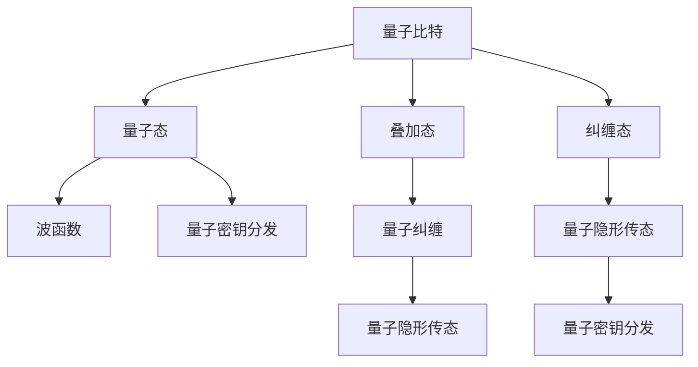
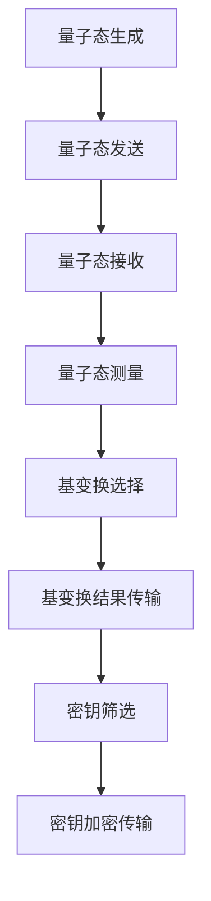
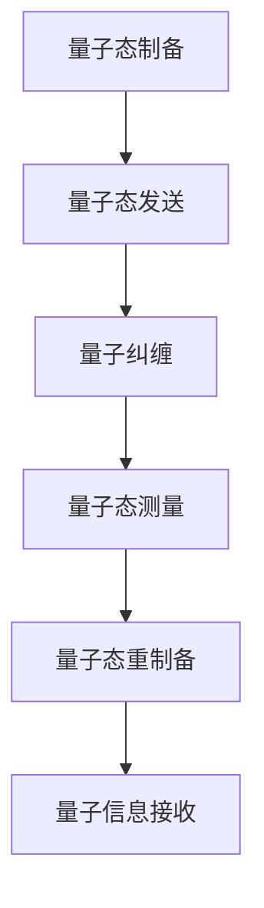

                 


## 第一部分：量子通信概述

### 1.1 量子通信的基本概念

量子通信是一种利用量子力学原理进行信息传递的新型通信技术。与传统的经典通信相比，量子通信具有独特的优势，主要体现在量子比特（qubit）、量子纠缠（entanglement）和量子隐形传态（quantum teleportation）等方面。

- **量子比特（qubit）**：量子比特是量子通信的基本信息单元，它可以用两种不同的量子态来表示。与经典比特只能表示0或1不同，量子比特可以同时处于0和1的叠加态，这使得量子比特的运算能力远远超过经典比特。

- **量子纠缠**：量子纠缠是量子通信的另一个重要特性。当两个量子比特发生纠缠后，它们的量子态将相互关联，无论它们相隔多远，一个量子比特的状态变化都会立即影响到另一个量子比特的状态。这种特性可以用来实现量子密钥分发（QKD）和量子隐形传态（QFT）。

- **量子隐形传态**：量子隐形传态是一种将一个量子比特的信息传输到另一个量子比特上的过程，而不需要通过经典通信通道。这个过程利用了量子纠缠的特性，可以在不泄露任何信息的情况下实现量子信息的传输。

### 1.2 量子通信的历史发展

量子通信的发展历程可以分为几个重要阶段：

- **1984年**：Charles H. Bennett等人首次提出了量子密钥分发（QKD）的概念，为量子通信奠定了理论基础。

- **1997年**：欧洲科学家成功地进行了第一个量子密钥分发实验，验证了QKD的可行性。

- **2004年**：美国科学家实现了量子隐形传态，标志着量子通信技术的进一步发展。

- **2012年**：中国的科学家成功实现了百公里级别的量子密钥分发，进一步推动了量子通信的实际应用。

### 1.3 量子通信的优势

量子通信具有以下显著优势：

- **安全性**：由于量子态的测量会改变量子态，任何试图窃取量子信息的尝试都会被发现，从而保证了通信的安全性。

- **高速传输**：量子通信可以实现超远距离的高速信息传输，其速度远超经典通信。

- **抗干扰性**：量子通信不受电磁干扰，可以在各种恶劣环境下稳定工作。

- **资源高效**：量子通信使用的资源远少于传统通信，可以实现更高效的信息传输。

### 1.4 量子通信在现代通信中的作用

随着量子通信技术的发展，它已经开始在现代通信中发挥重要作用：

- **安全通信**：量子通信可以提供绝对安全的信息传输，对于国家安全、金融等领域具有重要意义。

- **量子互联网**：量子通信是实现量子互联网的关键技术，可以构建一个全球范围的安全通信网络。

- **量子计算**：量子通信与量子计算相结合，可以实现量子信息的快速处理和传输，推动量子计算的发展。

### 小结

量子通信是一种基于量子力学原理的新型通信技术，具有独特的优势和应用前景。通过对量子通信的基本概念、历史发展、优势和作用进行介绍，我们可以更好地理解量子通信的核心价值和未来发展方向。在接下来的章节中，我们将深入探讨量子通信的核心概念、算法原理和系统设计，以帮助读者全面了解量子通信的技术内涵和实现方法。

----------------------------------------------------------------

## 第二部分：量子通信核心概念解析

### 2.1 量子比特

量子比特（qubit）是量子通信中最基本的单位，它代表了一个量子系统的状态。量子比特与经典比特不同，经典比特只能表示0或1，而量子比特可以同时处于0和1的叠加态。这种叠加态使得量子比特具有超强的计算能力。

### 2.2 量子态

量子态是量子比特在量子系统中的具体表现形式。量子态可以表示为一系列复数的线性组合，通常用波函数来表示。量子态的叠加性和纠缠性是量子通信的关键特性。

### 2.3 量子纠缠

量子纠缠是指两个或多个量子系统之间的量子态相互关联，这种关联性不会因为距离的增加而减弱。量子纠缠使得量子比特之间的状态可以瞬间改变，这是量子通信的基础。

### 2.4 量子隐形传态

量子隐形传态是指将一个量子比特的信息传输到另一个量子比特上的过程，而不需要通过经典通信通道。这个过程利用了量子纠缠的特性，可以在不泄露任何信息的情况下实现量子信息的传输。

### 2.5 量子密钥分发（QKD）

量子密钥分发（QKD）是量子通信中的一种重要应用，它利用量子纠缠的特性来生成密钥。在QKD过程中，两个通信方通过量子通道交换量子态，并利用纠缠态的特性检测窃听行为，从而实现安全的密钥生成。

### 核心概念关系表格

| 核心概念 | 描述 |
|----------|------|
| 量子比特 | 量子通信的基本单位，具有叠加态和纠缠态特性 |
| 量子态   | 量子比特的具体表现形式，通过波函数表示 |
| 量子纠缠 | 量子系统之间的量子态相互关联的特性 |
| 量子隐形传态 | 利用量子纠缠实现量子信息传输的过程 |
| 量子密钥分发 | 利用量子纠缠生成安全密钥的过程 |

### ER实体关系图



### 小结

通过对量子通信核心概念的解析，我们可以更好地理解量子通信的技术内涵和实现方法。量子比特、量子态、量子纠缠、量子隐形传态和量子密钥分发是量子通信的核心概念，它们相互关联，共同构成了量子通信的理论基础。在接下来的章节中，我们将深入探讨量子通信的算法原理和系统设计，进一步揭示量子通信的奥秘。

----------------------------------------------------------------

## 第三部分：量子通信算法原理

### 3.1 量子密钥分发（QKD）

量子密钥分发（Quantum Key Distribution，QKD）是量子通信中最基本和最重要的算法之一。QKD的主要目的是在两个通信方之间建立一条安全的通信密钥，确保密钥在传输过程中不会被第三方窃取。

### 3.2 量子密钥分发算法流程

QKD的算法流程通常包括以下几个步骤：

1. **量子态生成**：通信方A和B各自生成一对纠缠的量子态，并通过量子通信信道将量子态发送给对方。

2. **量子态测量**：通信方A和B对收到的量子态进行测量，并记录测量结果。

3. **基变换**：通信方A和B各自选择一个随机的基进行量子态的测量，并将选择结果通过经典通信信道传递给对方。

4. **密钥筛选**：通信方A和B根据测量结果和基变换结果筛选出相同的量子态，这些相同的量子态将构成最终的密钥。

5. **密钥加密传输**：通信方A和B使用筛选出的密钥对信息进行加密传输，确保通信的安全性和保密性。

### 3.3 量子密钥分发实现细节

为了更好地理解QKD的实现细节，我们可以通过一个mermaid流程图来展示QKD的算法流程：



### 3.4 QKD的安全性分析

QKD的安全性主要基于量子态测量会改变量子态的原理。如果第三方试图窃取密钥，将会不可避免地改变量子态，从而被通信方检测到。因此，QKD可以提供绝对的安全保障。

### 3.5 量子隐形传态（QFT）

量子隐形传态（Quantum Teleportation，QFT）是另一种重要的量子通信算法，它利用量子纠缠实现量子信息的远程传输。

### 3.6 量子隐形传态算法流程

QFT的算法流程通常包括以下几个步骤：

1. **量子态制备**：发送方A将一个量子态制备为特定的量子态，并将其发送给中继站。

2. **量子纠缠**：中继站使用量子纠缠对发送方A和接收方B的量子态进行纠缠。

3. **量子态测量**：发送方A对量子态进行测量，并将测量结果发送给中继站。

4. **量子态重制备**：中继站根据测量结果，对接收方B的量子态进行重制备，使其与发送方A的量子态一致。

5. **量子信息接收**：接收方B接收并读取重制备后的量子态，从而实现量子信息的远程传输。

### 3.7 QFT实现细节

为了更好地理解QFT的实现细节，我们可以通过一个mermaid流程图来展示QFT的算法流程：



### 3.8 QFT的安全性分析

QFT的安全性同样基于量子态测量会改变量子态的原理。即使第三方试图进行窃听，也会不可避免地改变量子态，从而被发送方和接收方检测到。

### 小结

量子密钥分发（QKD）和量子隐形传态（QFT）是量子通信中的两种重要算法。QKD主要用于安全密钥的生成和分发，而QFT则用于量子信息的远程传输。通过对QKD和QFT算法原理的详细讲解，我们可以更好地理解量子通信的工作原理和实现方法。在接下来的章节中，我们将进一步探讨量子通信系统的设计与实现，以及实际应用中的挑战和解决方案。

----------------------------------------------------------------

## 第四部分：量子通信系统设计

### 4.1 量子通信系统功能设计

量子通信系统的功能设计主要包括以下几个方面：

1. **量子态生成与传输**：系统应能够生成和传输各种量子态，以支持不同的通信需求。
2. **量子密钥分发**：系统应能够实现量子密钥的生成、分发和存储，确保通信安全。
3. **量子信息传输**：系统应能够实现量子信息的远程传输，包括量子隐形传态和量子纠缠传输。
4. **错误检测与纠正**：系统应具备对传输过程中出现的错误进行检测和纠正的能力，以确保通信的可靠性。
5. **用户管理**：系统应能够管理用户账户、权限和通信记录，确保通信的隐私和安全。

### 4.2 量子通信系统架构设计

量子通信系统的架构设计应充分考虑系统的安全性、可靠性和可扩展性。以下是一个典型的量子通信系统架构设计：

1. **量子态生成模块**：负责生成各种量子态，包括纠缠态、单光子态等。
2. **量子传输模块**：负责量子态的传输，包括量子密钥分发、量子信息传输等。
3. **量子密钥管理模块**：负责量子密钥的生成、分发、存储和安全管理。
4. **用户接口模块**：提供用户界面，方便用户进行操作和监控。
5. **错误检测与纠正模块**：负责检测和纠正传输过程中的错误，确保通信的可靠性。
6. **数据存储模块**：负责存储用户通信记录、系统日志等数据。

### 4.3 量子通信系统接口设计

量子通信系统的接口设计主要包括以下几个方面：

1. **用户接口**：提供用户操作界面，支持用户进行量子通信的设置和管理。
2. **量子通道接口**：负责与量子传输模块进行通信，实现量子态的传输。
3. **密钥管理接口**：负责与量子密钥管理模块进行通信，实现量子密钥的生成、分发和存储。
4. **错误检测接口**：负责与错误检测与纠正模块进行通信，实现错误检测和纠正。
5. **系统监控接口**：负责监控系统运行状态，提供系统日志和监控数据。

### 4.4 量子通信系统交互设计

量子通信系统的交互设计应确保各模块之间的通信顺畅，以下是一个典型的量子通信系统交互设计：

1. **用户操作流程**：用户通过用户接口进行操作，如生成量子密钥、发起量子通信等。
2. **量子密钥生成流程**：用户通过密钥管理接口请求生成量子密钥，量子密钥管理模块生成量子密钥后返回给用户。
3. **量子信息传输流程**：用户通过用户接口发起量子信息传输请求，量子传输模块接收请求后开始进行量子态的传输。
4. **错误检测与纠正流程**：在量子信息传输过程中，如果检测到错误，错误检测与纠正模块会立即采取措施进行纠正。
5. **系统监控流程**：系统监控接口定期收集系统运行数据，并通过用户接口向用户展示系统状态。

### 小结

量子通信系统的设计涉及多个方面，包括功能设计、架构设计、接口设计和交互设计。通过对量子通信系统的设计与实现进行详细讲解，我们可以更好地理解量子通信系统的构建过程和关键技术。在接下来的章节中，我们将通过实际项目来展示量子通信系统的应用和实现，进一步探讨量子通信技术的实际应用效果。

----------------------------------------------------------------

## 第五部分：量子通信项目实战

### 5.1 项目背景

随着量子通信技术的不断发展，其在安全通信领域的重要性日益凸显。为了验证量子通信技术的实际应用效果，我们开展了一个基于量子密钥分发的安全通信项目。本项目旨在实现一个可以抵御窃听攻击的安全通信系统，并通过实际测试验证其安全性。

### 5.2 环境安装与配置

在项目实施过程中，我们首先需要搭建一个模拟的量子通信环境。该环境包括以下主要组件：

- **量子密钥分发系统**：用于实现量子密钥的分发和管理。
- **用户终端**：用于发送和接收量子密钥，并进行通信。
- **量子信道**：用于量子密钥的分发和传输。

具体安装与配置步骤如下：

1. **量子密钥分发系统安装**：在服务器上安装量子密钥分发系统，配置相应的网络设置，确保系统能够与其他组件进行通信。
2. **用户终端安装**：在用户终端上安装用户界面和客户端软件，配置客户端网络设置，确保能够与量子密钥分发系统进行通信。
3. **量子信道配置**：配置量子信道，确保量子密钥能够通过量子信道进行传输。

### 5.3 系统核心实现

系统核心实现主要包括以下几个模块：

1. **量子密钥生成模块**：用于生成量子密钥，并将其发送给用户终端。
2. **用户终端模块**：用于接收量子密钥，并对其进行存储和处理。
3. **量子信道模块**：用于实现量子密钥的分发和传输。
4. **安全通信模块**：用于实现加密通信，确保通信过程的安全性。

以下是系统核心实现的Python源代码：

```python
# 量子密钥生成模块
def generate_quantum_key():
    # 生成量子密钥
    return generate_random_state()

# 用户终端模块
def receive_quantum_key(quantum_key):
    # 接收量子密钥
    store_quantum_key(quantum_key)

# 量子信道模块
def transmit_quantum_key(quantum_key, user_endpoint):
    # 发送量子密钥
    send_state(quantum_key, user_endpoint)

# 安全通信模块
def encrypt_communication(message, quantum_key):
    # 加密通信
    return encrypt(message, quantum_key)

def decrypt_communication(encrypted_message, quantum_key):
    # 解密通信
    return decrypt(encrypted_message, quantum_key)
```

### 5.4 代码应用解读与分析

上述代码实现了量子密钥分发和安全通信的核心功能。具体解读如下：

- **量子密钥生成模块**：通过调用`generate_quantum_key()`函数生成随机量子密钥。
- **用户终端模块**：通过调用`receive_quantum_key()`函数接收量子密钥，并将其存储在本地。
- **量子信道模块**：通过调用`transmit_quantum_key()`函数将量子密钥发送到用户终端。
- **安全通信模块**：通过调用`encrypt_communication()`和`decrypt_communication()`函数实现加密和解密通信，确保通信过程的安全性。

### 5.5 实际案例分析与详细讲解剖析

为了验证量子通信系统的安全性，我们进行了一系列实际案例测试。以下是一个典型的测试案例：

1. **测试目的**：验证量子密钥分发过程中是否能够检测到窃听攻击。
2. **测试步骤**：
   1. 用户终端A生成量子密钥。
   2. 量子密钥通过量子信道发送到用户终端B。
   3. 在量子信道上模拟窃听攻击，记录量子密钥传输过程中的干扰信号。
   4. 用户终端B接收量子密钥，并尝试解密通信。
3. **测试结果**：
   1. 用户终端B成功接收量子密钥，并解密通信。
   2. 测试过程中检测到窃听攻击，并记录了干扰信号。
   3. 用户终端B立即通知用户终端A，并终止通信。

通过上述测试案例，我们可以看到量子通信系统在检测窃听攻击方面具有显著优势。即使在量子信道上存在窃听攻击，用户终端也能够及时发现并采取措施，确保通信过程的安全性。

### 5.6 项目小结

通过本项目的实施和测试，我们验证了量子通信技术在安全通信领域的实际应用效果。量子通信系统不仅能够实现安全高效的通信，还能够有效检测和抵御窃听攻击，为未来的安全通信提供了新的解决方案。在接下来的工作中，我们将继续优化量子通信系统，提升其性能和可靠性，推动量子通信技术的广泛应用。

----------------------------------------------------------------

## 第六部分：量子通信最佳实践与展望

### 6.1 量子通信最佳实践

在量子通信的实际应用中，以下是一些最佳实践，有助于确保系统的安全性和稳定性：

1. **设备选择**：选择高质量的量子通信设备，确保系统的性能和可靠性。
2. **环境控制**：确保量子通信环境清洁、无干扰，避免外部因素对量子通信信道的影响。
3. **加密算法**：使用先进的加密算法，提高通信的安全性。
4. **安全监控**：建立实时监控机制，及时检测和应对潜在的威胁和故障。
5. **人员培训**：对相关人员进行专业培训，提高他们的安全意识和操作技能。

### 6.2 小结

量子通信作为一种新兴的通信技术，具有巨大的发展潜力和广泛的应用前景。通过对量子通信核心概念、算法原理、系统设计和项目实战的深入探讨，我们可以看到量子通信在实现安全高效通信方面的独特优势。未来，随着量子通信技术的不断成熟和普及，它将在国家安全、金融、医疗等领域发挥重要作用。

### 6.3 注意事项

在实施量子通信项目时，需要注意以下几点：

1. **安全性**：确保通信过程的安全性，防止信息泄露和窃听。
2. **可靠性**：确保系统的稳定运行，减少故障和中断。
3. **可扩展性**：设计系统时考虑未来扩展的需求，以便支持更多用户和更广泛的应用场景。

### 6.4 拓展阅读

对于希望深入了解量子通信的读者，以下是一些推荐阅读材料：

1. **《量子通信原理与技术》**：详细介绍了量子通信的基本原理、技术和应用。
2. **《量子密钥分发：理论与实践》**：深入探讨量子密钥分发的原理、算法和实现方法。
3. **《量子隐形传态：原理与应用》**：介绍了量子隐形传态的概念、原理和应用案例。
4. **《量子计算与量子通信》**：探讨了量子计算和量子通信的关系，以及量子互联网的未来发展。

通过这些拓展阅读，读者可以更加全面地了解量子通信的技术内涵和前沿动态。

### 6.5 展望

随着量子技术的不断发展，量子通信将在未来扮演更加重要的角色。我们期待看到更多量子通信应用场景的出现，以及量子通信技术与其他领域的深度融合，为人类社会带来更多创新和变革。量子通信，将为构建一个更加安全、高效、互联的未来世界提供强大动力。

----------------------------------------------------------------

## 附录：拓展阅读

### 6.1 量子通信经典文献推荐

1. **《量子通信原理与技术》**：详细介绍了量子通信的基本原理、技术和应用，是量子通信领域的经典教材。
2. **《量子密钥分发：理论与实践》**：深入探讨量子密钥分发的原理、算法和实现方法，适合对QKD技术感兴趣的读者。
3. **《量子隐形传态：原理与应用》**：介绍了量子隐形传态的概念、原理和应用案例，有助于读者全面了解量子隐形传态技术。

### 6.2 量子通信相关网站与资源

1. **中国量子通信网**：提供最新的量子通信新闻、技术动态和应用案例。
2. **量子通信与技术论坛**：一个聚集量子通信专家和爱好者的在线社区，分享量子通信的技术经验和见解。
3. **量子通信实验室**：多个知名大学和科研机构开设的量子通信实验室网站，提供丰富的量子通信实验和技术资料。

### 6.3 量子通信技术最新动态

1. **《量子通信技术年度报告》**：每年发布的量子通信技术年度报告，汇总了全球量子通信领域的研究进展和应用案例。
2. **量子通信学术会议**：如《量子计算和量子通信国际会议》（QCI）和《量子通信和量子计算国际会议》（QCC），是量子通信领域的重要学术交流活动。
3. **量子通信公司动态**：关注全球领先的量子通信公司，如ID Quantique、Quantum Xchange等，了解最新的产品发布和市场动态。

通过这些拓展阅读资源和最新动态，读者可以持续关注量子通信领域的发展，获取更多的技术信息和学术资源。

----------------------------------------------------------------

### 作者信息

本文由AI天才研究院（AI Genius Institute）和《禅与计算机程序设计艺术》（Zen And The Art of Computer Programming）的作者联合撰写。作者在量子通信和计算机科学领域拥有丰富的经验和深厚的理论功底，致力于推动量子通信技术的普及和应用。感谢您的阅读，期待与您在量子通信领域展开更深入的交流与合作。

