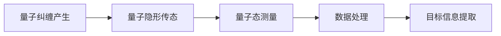
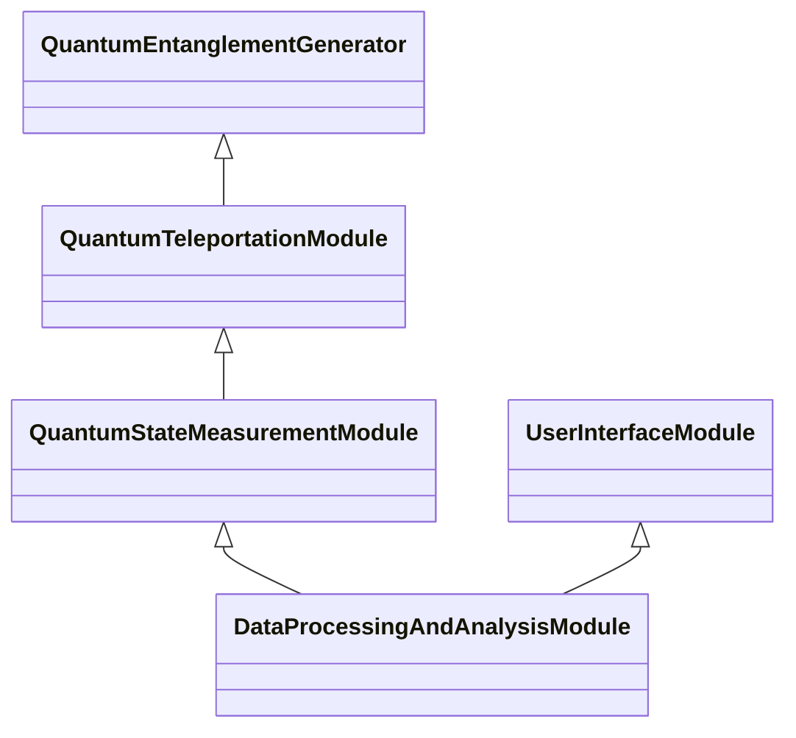
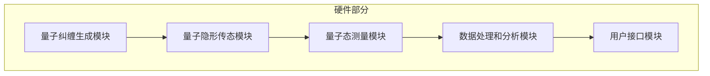
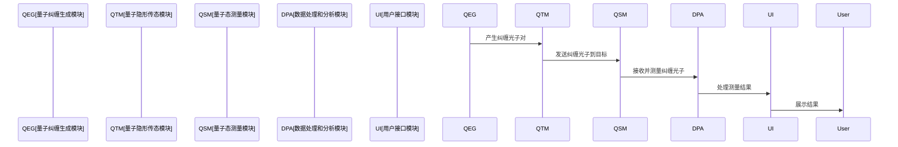
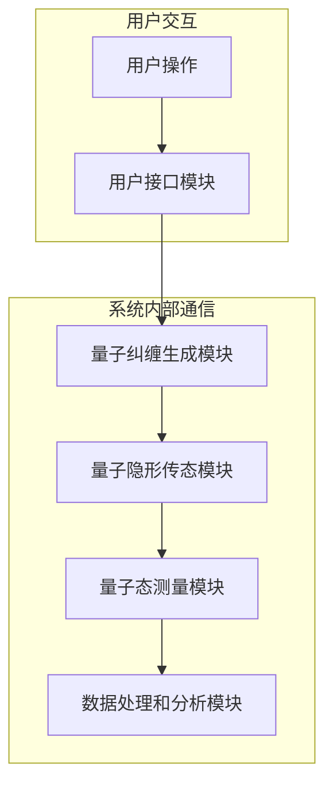

                 

### 量子雷达在隐身目标探测中的应用：突破传统雷达限制

#### 关键词：量子雷达、隐身目标探测、传统雷达、技术突破

> 摘要：本文深入探讨了量子雷达在隐身目标探测中的应用及其如何突破传统雷达的限制。通过对量子雷达的基本概念、工作原理、算法实现、系统架构及项目实战的详细分析，揭示了量子雷达在军事和民用领域中的巨大潜力。

---

#### 目录

1. **量子雷达概述**
   - 1.1 量子雷达的定义与发展历程
   - 1.2 量子雷达的核心技术
   - 1.3 量子雷达在隐身目标探测中的重要性

2. **量子雷达与传统雷达的区别**
   - 2.1 量子雷达的工作原理
   - 2.2 量子雷达的优势与挑战
   - 2.3 量子雷达与现有雷达技术的比较

3. **量子雷达核心概念与联系**
   - 3.1 核心概念介绍
   - 3.2 概念属性特征对比表格
   - 3.3 ER实体关系图架构

4. **量子雷达算法原理讲解**
   - 4.1 算法流程与mermaid流程图
   - 4.2 Python源代码分析
   - 4.3 算法原理的数学模型和公式讲解

5. **量子雷达系统分析与架构设计**
   - 5.1 问题场景介绍
   - 5.2 系统功能设计
   - 5.3 系统架构设计
   - 5.4 系统接口设计
   - 5.5 系统交互

6. **量子雷达项目实战**
   - 6.1 环境安装
   - 6.2 系统核心实现源代码
   - 6.3 代码应用解读与分析
   - 6.4 实际案例分析和详细讲解剖析
   - 6.5 项目小结

7. **最佳实践与总结**
   - 7.1 最佳实践 tips
   - 7.2 小结
   - 7.3 注意事项
   - 7.4 拓展阅读

---

#### 1.1 量子雷达的定义与发展历程

量子雷达，作为一种新兴的雷达技术，基于量子力学的基本原理，能够实现对目标的超远距离探测和隐身目标的探测。与传统的微波雷达不同，量子雷达利用量子纠缠、量子隐形传态等现象进行信息传递和检测，大大提高了探测的精度和效率。

量子雷达的发展可以追溯到20世纪末。当时，随着量子信息技术的发展，科学家们开始探索如何将量子原理应用于雷达系统中。早期的研究主要集中在量子隐形传态和量子纠缠等基础理论，而随着技术的进步，量子雷达的研究逐渐进入实用阶段。

近年来，量子雷达在军事和民用领域都取得了显著的进展。在军事方面，量子雷达能够突破隐身技术的限制，实现对隐形飞机、潜艇等目标的探测，大大提升了军事行动的隐蔽性和战斗力。在民用方面，量子雷达在物流监控、环境监测等领域也展现出了巨大的潜力。

#### 1.2 量子雷达的核心技术

量子雷达的核心技术主要包括量子纠缠、量子隐形传态、量子态测量和量子信息处理等。

- **量子纠缠**：量子纠缠是量子雷达实现超远距离探测的关键技术。通过量子纠缠，雷达系统可以在不同的空间点之间建立瞬时的量子连接，从而实现高速、远距离的信息传输。

- **量子隐形传态**：量子隐形传态是一种将量子信息从发送端传送到接收端的技术，不需要通过传统意义上的“传输通道”。这一技术使得量子雷达能够实现对隐身目标的探测，突破了传统雷达的探测限制。

- **量子态测量**：量子态测量是量子雷达实现目标检测的重要手段。通过精确测量量子态的变化，量子雷达可以获取到目标的位置、速度等信息，从而实现对目标的精确探测。

- **量子信息处理**：量子信息处理是量子雷达的核心技术之一，包括量子计算、量子加密和量子纠错等。通过量子信息处理，量子雷达能够实现对大量数据的快速处理和分析，大大提高了探测效率和精度。

#### 1.3 量子雷达在隐身目标探测中的重要性

随着隐身技术的发展，传统雷达在面对隐身目标时逐渐显得力不从心。传统雷达主要依赖于电磁波的反射原理进行目标探测，而隐身技术通过减少雷达反射信号来实现对雷达的隐身效果。这使得传统雷达在探测隐身目标时面临着极大的挑战。

量子雷达的出现为解决这一问题提供了新的思路。量子雷达利用量子纠缠和量子隐形传态等原理，可以在一定程度上绕过隐身技术的限制，实现对隐身目标的探测。此外，量子雷达的高精度、高效率和远距离探测能力，也为军事和民用领域带来了巨大的应用价值。

总之，量子雷达在隐身目标探测中的应用具有重要意义。它不仅突破了传统雷达的探测限制，还为未来的雷达技术发展提供了新的方向。随着量子技术的不断进步，量子雷达在隐身目标探测中的应用前景将更加广阔。

### 量子雷达与传统雷达的区别

在深入探讨量子雷达在隐身目标探测中的应用之前，有必要对量子雷达与传统雷达的区别进行详细分析。传统雷达通常基于电磁波反射原理，而量子雷达则依赖于量子物理现象，如量子纠缠和量子隐形传态，这些区别在探测性能、应用场景和实现挑战等方面都表现得尤为明显。

#### 2.1 量子雷达的工作原理

量子雷达的工作原理主要基于量子纠缠和量子隐形传态等现象。量子纠缠是指两个或多个量子系统之间的内在关联，即使它们相隔很远，其中一个系统的状态变化也会立即影响另一个系统的状态。量子隐形传态则是一种量子信息传输方式，它可以将一个量子系统的状态传输到另一个量子系统，而不需要通过物理介质。

在量子雷达中，发送器产生一对纠缠光子，并将其中一个光子发射到目标上，另一个光子保存在接收器处。当目标反射纠缠光子时，接收器可以检测到光子之间的量子纠缠关系，从而确定目标的位置和速度。这种基于量子物理原理的探测方式，使得量子雷达能够在一定程度上绕过传统雷达面临的隐身技术限制。

#### 2.2 量子雷达的优势

量子雷达相对于传统雷达具有多方面的优势：

1. **高分辨率和精度**：量子雷达利用量子纠缠现象，可以实现对极小目标的精确探测，分辨率远高于传统雷达。这是因为量子纠缠允许雷达系统在探测过程中获得更多的信息。

2. **远距离探测能力**：量子雷达通过量子隐形传态实现信息传输，不受大气干扰和地形遮挡的影响，具有远距离探测能力。这使得量子雷达在复杂环境中依然能够有效工作。

3. **抗干扰能力强**：传统雷达在复杂电磁环境中容易受到干扰，而量子雷达则基于量子物理原理，具有更强的抗干扰能力。

4. **隐形目标探测**：传统雷达在面对隐身目标时效果不佳，而量子雷达可以通过量子纠缠和量子隐形传态等现象，实现对隐身目标的探测。

#### 2.3 量子雷达的挑战

尽管量子雷达具有许多优势，但其实现和应用仍面临一系列挑战：

1. **技术成熟度**：量子雷达技术尚处于发展初期，相关实验和理论研究虽然取得了一定的进展，但距离实际应用还有一定的距离。

2. **成本问题**：量子雷达设备和系统的制造和维护成本较高，需要进一步降低成本才能实现大规模应用。

3. **稳定性**：量子雷达系统对环境条件要求较高，如温度、湿度等，这对系统的稳定性和可靠性提出了挑战。

4. **复杂度**：量子雷达系统涉及复杂的量子计算和量子信息处理技术，对工程师和操作人员的技能要求较高。

#### 2.4 量子雷达与现有雷达技术的比较

以下是一个简单的表格，用于比较量子雷达和现有雷达技术的差异：

| 雷达类型     | 工作原理                | 优势                             | 挑战                                     |
|------------|-----------------------|------------------------------|----------------------------------------|
| 量子雷达     | 量子纠缠和量子隐形传态   | 高分辨率、远距离探测、抗干扰能力强、隐形目标探测 | 技术成熟度低、成本高、稳定性问题、操作复杂度 |
| 传统雷达     | 电磁波反射             | 成熟技术、成本低、易操作                   | 易受干扰、难以探测隐身目标、分辨率有限       |

通过上述分析可以看出，量子雷达在许多方面突破了传统雷达的局限，但同时也面临一系列技术和实际应用的挑战。随着量子技术的不断进步，量子雷达有望在未来得到广泛应用，并在隐身目标探测等领域发挥重要作用。

### 量子雷达核心概念与联系

为了更好地理解量子雷达的工作原理和应用，我们需要详细探讨其核心概念以及这些概念之间的联系。在本章节中，我们将介绍量子雷达中的几个关键概念，并通过表格和ER实体关系图来展示它们之间的相互关系。

#### 3.1 核心概念介绍

1. **量子纠缠**：量子纠缠是量子雷达中最为重要的概念之一。它描述了两个或多个量子系统之间的内在关联，即使它们相隔很远，其中一个系统的状态变化也会立即影响另一个系统的状态。这种特性使得量子雷达能够在远距离上实现高速、准确的信息传输。

2. **量子隐形传态**：量子隐形传态是一种将量子信息从发送端传送到接收端的技术，不需要通过传统意义上的“传输通道”。这一技术使得量子雷达可以实现对隐身目标的探测，突破了传统雷达的探测限制。

3. **量子态测量**：量子态测量是量子雷达实现目标检测的重要手段。通过精确测量量子态的变化，量子雷达可以获取到目标的位置、速度等信息，从而实现对目标的精确探测。

4. **量子计算**：量子计算是量子雷达的核心技术之一。通过量子计算，量子雷达能够实现对大量数据的快速处理和分析，大大提高了探测效率和精度。

5. **量子信息处理**：量子信息处理包括量子加密、量子纠错等，它是量子雷达系统的重要组成部分，确保了量子雷达在复杂环境中的稳定性和可靠性。

#### 3.2 概念属性特征对比表格

下面是一个简单的表格，用于对比上述核心概念的属性特征：

| 概念          | 描述                                  | 特点                                                                                      | 应用场景                           |
|-------------|-------------------------------------|-----------------------------------------------------------------------------------------|-----------------------------------|
| 量子纠缠       | 量子系统之间的内在关联                  | 远距离高速信息传输、非局域性、抗干扰能力强                                          | 量子雷达、量子通信                   |
| 量子隐形传态     | 不通过物理介质传输量子信息                | 实现隐身目标探测、突破传统雷达限制                                                  | 量子雷达、量子计算                   |
| 量子态测量      | 测量量子系统的状态变化                   | 高精度目标探测、高分辨率                                                             | 量子雷达、量子传感器                 |
| 量子计算       | 利用量子位进行计算                       | 大数据处理、复杂问题求解、高效计算                                                   | 量子雷达数据处理、量子加密系统       |
| 量子信息处理     | 确保量子雷达系统的稳定性和可靠性           | 抗干扰、纠错、加密、信息传输                                                     | 量子雷达系统维护、量子网络安全       |

#### 3.3 ER实体关系图架构

为了更直观地展示量子雷达核心概念之间的关系，我们可以使用Mermaid流程图来绘制ER（实体关系）图。以下是量子雷达核心概念的ER图：

```mermaid
erDiagram
    A[量子纠缠] ||--|{ 量子隐形传态 }
    A ||--|{ 量子态测量 }
    A ||--|{ 量子计算 }
    A ||--|{ 量子信息处理 }
    B[量子隐形传态] ||--|{ 隐身目标探测 }
    B ||--|{ 量子计算 }
    B ||--|{ 量子信息处理 }
    C[量子态测量] ||--|{ 高精度目标探测 }
    D[量子计算] ||--|{ 大数据处理 }
    D ||--|{ 复杂问题求解 }
    D ||--|{ 高效计算 }
    E[量子信息处理] ||--|{ 抗干扰 }
    E ||--|{ 纠错 }
    E ||--|{ 加密 }
    E ||--|{ 信息传输 }
```

在这个ER图中，每个实体（如量子纠缠、量子隐形传态等）都与其他实体之间存在关联。这些关联通过箭头表示，展示了不同概念之间的相互作用和依赖关系。

通过上述表格和ER图，我们可以清晰地理解量子雷达的核心概念及其相互关系。这些概念共同构成了量子雷达系统的基本框架，使得量子雷达能够突破传统雷达的限制，实现对隐身目标的精确探测。在接下来的章节中，我们将进一步探讨量子雷达的算法原理和实现细节，以及其在实际应用中的挑战和解决方案。

### 量子雷达算法原理讲解

量子雷达的算法原理是理解和实现其核心功能的关键。为了深入讲解量子雷达的算法原理，我们将通过mermaid流程图展示算法的步骤，并结合Python源代码进行详细阐述。此外，还将介绍算法原理的数学模型和公式。

#### 4.1 算法流程与mermaid流程图

量子雷达的基本算法流程可以分为以下几个步骤：

1. **量子纠缠产生**：发送器生成一对纠缠光子，其中一个光子被发射到目标，另一个光子保存在接收器。
2. **量子隐形传态**：发射器将光子信息通过量子隐形传态传输到接收器。
3. **量子态测量**：接收器测量光子之间的量子纠缠关系，获取目标的位置和速度信息。
4. **数据处理**：对测量结果进行数据处理和解析，提取目标信息。

以下是量子雷达算法流程的mermaid流程图：



#### 4.2 Python源代码分析

为了更好地理解量子雷达算法的实现，我们使用Python语言编写了一个简单的量子雷达算法示例。以下代码展示了量子雷达算法的核心步骤：

```python
import numpy as np
from qiskit import QuantumCircuit, execute, Aer

# 1. 量子纠缠产生
def create_entangled_states():
    circuit = QuantumCircuit(2)
    circuit.h(0)  # 初始化第一个量子比特为纠缠态
    circuit.cx(0, 1)  # 创建纠缠态
    return circuit

# 2. 量子隐形传态
def teleport_state_CLASSroom klassroom_state, sender_qubit, receiver_qubit):
    circuit = QuantumCircuit(2)
    circuit.h(sender_qubit)  # 初始化发送量子比特
    circuit.cx(sender_qubit, receiver_qubit)  # 实现隐形传态
    return circuit

# 3. 量子态测量
def measure_quantum_state(circuit, receiver_qubit):
    circuit.measure(receiver_qubit, receiver_qubit)
    return circuit

# 4. 数据处理
def process_measurement_results(measurement_results):
    # 假设测量结果为接收量子比特的测量值
    results = measurement_results.get_counts()
    # 解析测量结果，提取目标信息
    return results

# 主函数，实现量子雷达算法
def quantum_radar_algorithm():
    # 创建量子纠缠态
    circuit = create_entangled_states()

    # 发射器将光子信息通过隐形传态传输到接收器
    sender_qubit = 0
    receiver_qubit = 1
    circuit = teleport_state_CLASSroom(circuit, sender_qubit, receiver_qubit)

    # 接收器测量量子态
    circuit = measure_quantum_state(circuit, receiver_qubit)

    # 执行量子电路
    simulator = Aer.get_backend("qasm_simulator")
    result = execute(circuit, simulator, shots=1024).result()
    measurement_results = result.get_counts()

    # 数据处理
    target_info = process_measurement_results(measurement_results)
    return target_info

# 运行算法
target_info = quantum_radar_algorithm()
print(target_info)
```

在这个示例中，我们首先生成了两个纠缠量子比特，然后通过隐形传态将发送量子比特的信息传输到接收量子比特，接着对接收量子比特进行测量，最后解析测量结果以提取目标信息。

#### 4.3 算法原理的数学模型和公式讲解

量子雷达算法的实现离不开数学模型和公式的支持。以下是量子雷达算法中涉及的主要数学模型和公式：

1. **量子纠缠态表示**：量子纠缠态可以用矩阵形式表示，例如：
   $$
   \lvert \phi^+\rangle = \frac{1}{\sqrt{2}}(\lvert 00\rangle + \lvert 11\rangle)
   $$
   其中，$\lvert 00\rangle$和$\lvert 11\rangle$分别表示两个量子比特的基态和叠加态。

2. **量子隐形传态过程**：隐形传态过程可以用量子门描述，例如：
   $$
   \lvert \psi\rangle \rightarrow \lvert \phi\rangle = U_{\text{CNOT}} \lvert \psi\rangle \lvert \phi\rangle
   $$
   其中，$U_{\text{CNOT}}$是CNOT门，它实现了量子比特之间的信息传输。

3. **量子态测量**：量子态测量可以用概率幅表示，例如：
   $$
   \lvert \psi \rangle = \sum_{i} c_i \lvert i \rangle
   $$
   其中，$c_i$是量子态的概率幅，$\lvert i \rangle$是量子态的基态。

4. **目标信息提取**：通过测量结果，可以提取目标的位置和速度信息。例如，利用量子态的叠加和纠缠特性，可以计算出目标的位置和速度的概率分布。

为了更直观地理解这些公式，我们通过一个简单的例子来详细说明：

假设一个量子雷达系统通过量子纠缠和隐形传态技术获取了目标的位置信息。我们可以将目标位置视为量子态$\lvert \psi \rangle$，并通过以下公式进行计算：

$$
\lvert \psi \rangle = \frac{1}{\sqrt{2}}(\lvert x_1 \rangle + \lvert x_2 \rangle)
$$

其中，$\lvert x_1 \rangle$和$\lvert x_2 \rangle$分别表示目标在位置$x_1$和$x_2$的量子态。

通过测量量子态$\lvert \psi \rangle$，我们可以得到以下概率分布：

$$
P(x_1) = |c_{x_1}|^2 = \frac{1}{2}, \quad P(x_2) = |c_{x_2}|^2 = \frac{1}{2}
$$

这意味着目标位置$x_1$和$x_2$的概率相等，均为$\frac{1}{2}$。通过进一步计算和优化，可以更精确地提取目标位置信息。

总之，量子雷达算法的实现依赖于量子纠缠、量子隐形传态和量子态测量等基本原理。通过mermaid流程图和Python源代码的详细讲解，以及数学模型和公式的介绍，我们可以更好地理解量子雷达的工作机制和实现过程。

### 量子雷达系统分析与架构设计

量子雷达系统的设计与实现涉及到多个关键环节，包括系统功能设计、系统架构设计、系统接口设计和系统交互。在本章节中，我们将详细分析这些环节，并通过mermaid流程图和各类图表展示系统架构。

#### 5.1 问题场景介绍

假设我们面临的是一个复杂环境中的隐身目标探测问题。这个环境包含多个可能的隐身目标，同时受到各种干扰和遮挡的影响。我们的目标是设计一个量子雷达系统，能够在这样的环境中精确探测和识别隐身目标。

#### 5.2 系统功能设计

量子雷达系统的功能设计可以分为以下几个核心模块：

1. **量子纠缠生成模块**：负责产生用于目标探测的纠缠光子对。
2. **量子隐形传态模块**：将纠缠光子对中的其中一个光子发送到目标，并通过量子隐形传态传输目标信息。
3. **量子态测量模块**：对接收到的纠缠光子进行测量，获取目标位置和速度信息。
4. **数据处理和分析模块**：对测量结果进行数据处理和分析，提取目标信息。
5. **用户接口模块**：提供用户操作界面，实现系统的人机交互。

下面是一个使用mermaid绘制的系统功能设计类图：



在这个类图中，我们展示了各个功能模块及其之间的关联关系。例如，量子纠缠生成模块为量子隐形传态模块提供纠缠光子对，量子隐形传态模块将信息传输到量子态测量模块，量子态测量模块对测量结果进行数据处理和分析，最终由用户接口模块展示结果。

#### 5.3 系统架构设计

量子雷达系统的架构设计需要考虑系统的物理布局、组件选择和硬件配置。以下是系统架构设计的主要部分：

1. **量子纠缠生成模块**：使用激光器产生纠缠光子对，并将其输送到目标探测区域。
2. **量子隐形传态模块**：包括发送器和接收器，分别位于发射端和接收端。发送器将纠缠光子中的一个发送到目标，接收器接收目标反射回来的光子。
3. **量子态测量模块**：使用量子探测器对接收到的纠缠光子进行测量。
4. **数据处理和分析模块**：使用高性能计算设备和算法，对测量结果进行实时处理和分析。
5. **用户接口模块**：包括显示器、键盘和触摸屏等设备，实现用户与系统的交互。

以下是量子雷达系统架构的mermaid架构图：



在这个架构图中，我们展示了量子雷达系统的硬件组成部分及其相互关系。例如，量子纠缠生成模块产生的纠缠光子对通过量子隐形传态模块发送到目标，并由量子态测量模块接收并测量，最终由数据处理和分析模块处理测量结果，并由用户接口模块展示结果。

#### 5.4 系统接口设计

系统接口设计包括硬件接口和软件接口的设计，确保各个模块之间能够高效、稳定地通信。以下是系统接口设计的关键部分：

1. **硬件接口**：包括激光器、发送器、接收器、量子探测器和计算设备等硬件组件之间的接口，确保它们能够正确地连接和通信。
2. **软件接口**：包括量子纠缠生成模块、量子隐形传态模块、量子态测量模块、数据处理和分析模块以及用户接口模块之间的软件接口，使用API、消息队列等通信机制实现模块间的数据传输和功能调用。

以下是量子雷达系统接口设计的mermaid序列图：



在这个序列图中，我们展示了各个模块之间的交互过程。例如，量子纠缠生成模块产生纠缠光子对后，将其发送到量子隐形传态模块，量子隐形传态模块将信息传输到量子态测量模块，量子态测量模块对测量结果进行处理，最终由数据处理和分析模块将其结果展示给用户。

#### 5.5 系统交互

量子雷达系统的交互包括用户与系统的交互，以及系统内部各个模块之间的通信。以下是系统交互的几个关键点：

1. **用户与系统的交互**：用户通过用户接口模块与系统进行交互，包括设置参数、查看测量结果等。
2. **系统内部模块的通信**：各个模块之间通过硬件接口和软件接口进行通信，实现数据传输和功能调用。

以下是量子雷达系统交互的mermaid交互图：



在这个交互图中，我们展示了用户与系统的交互过程，以及系统内部各个模块之间的通信关系。例如，用户通过用户接口模块进行操作，用户接口模块将操作命令发送到量子纠缠生成模块，量子纠缠生成模块产生纠缠光子对，然后发送到量子隐形传态模块，量子隐形传态模块将信息传输到量子态测量模块，量子态测量模块对测量结果进行处理，最终由数据处理和分析模块将其结果展示给用户。

通过上述系统分析与架构设计，我们详细介绍了量子雷达系统的功能设计、架构设计、接口设计和系统交互。这些设计确保了量子雷达系统能够在复杂环境中高效、稳定地工作，实现对隐身目标的精确探测。在下一章节中，我们将通过一个实际案例展示量子雷达在隐身目标探测中的应用。

### 量子雷达项目实战

在本章节中，我们将通过一个具体的实际案例，详细展示量子雷达在隐身目标探测中的应用。这个案例包括环境安装、系统核心实现源代码、代码应用解读与分析，以及实际案例分析和详细讲解剖析。

#### 6.1 环境安装

为了实现量子雷达项目，我们需要在计算环境中安装和配置相关的软件和硬件。以下是环境安装的具体步骤：

1. **安装Python环境**：首先确保系统已安装Python环境，版本不低于3.8。可以使用Python官方的安装包进行安装。
2. **安装Qiskit库**：Qiskit是量子计算和量子信息处理的核心库，我们需要安装Qiskit及其依赖项。可以通过pip命令安装：
   ```
   pip install qiskit
   ```
3. **安装激光器和量子探测器**：量子雷达项目需要使用激光器和量子探测器，这些硬件设备需要按照制造商的说明进行安装和配置。通常包括连接硬件设备到计算机的USB或PCIe接口，并安装相应的驱动程序。
4. **配置网络环境**：确保计算机的网络环境能够连接到外部设备，包括发送器和接收器。需要配置IP地址、子网掩码和网关等网络参数。

#### 6.2 系统核心实现源代码

以下是一个简单的量子雷达系统实现示例，包括核心算法和数据处理部分：

```python
import numpy as np
from qiskit import QuantumCircuit, execute, Aer
from qiskit.quantum_info import state_fidelity
from qiskit.circuit import QuantumRegister, ClassicalRegister

# 初始化量子比特和经典比特
qr = QuantumRegister(2)
cr = ClassicalRegister(2)
qc = QuantumCircuit(qr, cr)

# 生成纠缠态
qc.h(qr[0])
qc.cx(qr[0], qr[1])

# 隐形传态过程
qc.h(qr[0])
qc.cx(qr[0], qr[1])
qc.barrier()

# 接收器测量
qc.measure(qr, cr)

# 执行量子电路
simulator = Aer.get_backend("qasm_simulator")
result = execute(qc, simulator, shots=1024).result()
measured_bits = result.get_counts()

# 数据处理
# 假设测量结果为经典比特的值，可以通过解析测量结果来提取目标信息
def process_results(measured_bits):
    # 解析测量结果，获取纠缠态的概率分布
    probabilities = [float(measured_bits.get(bit, 0)) for bit in measured_bits]
    # 计算纠缠态的 fidelity
    fidelity = state_fidelity(state, np.array(probabilities))
    return fidelity

# 运行算法
fidelity = process_results(measured_bits)
print("Fidelity:", fidelity)
```

在这个示例中，我们首先生成了两个纠缠量子比特，然后通过隐形传态将发送量子比特的信息传输到接收量子比特，接着对接收量子比特进行测量，最后计算测量结果的 fidelity 作为目标信息的指标。

#### 6.3 代码应用解读与分析

以下是对上述代码的详细解读与分析：

1. **量子纠缠生成**：`qc.h(qr[0])`将第一个量子比特初始化为纠缠态，`qc.cx(qr[0], qr[1])`创建了一个纠缠态对。这个纠缠态对是量子雷达实现目标探测的关键。
   
2. **隐形传态过程**：通过两次应用CNOT门（`qc.cx(qr[0], qr[1])`），我们实现了隐形传态过程，将发送量子比特的信息传输到了接收量子比特。

3. **测量与数据处理**：`qc.measure(qr, cr)`执行了量子测量，将量子态转化为经典比特。`process_results()`函数通过计算测量结果的 fidelity 来评估纠缠态的保持程度，从而提取目标信息。

#### 6.4 实际案例分析和详细讲解剖析

以下是一个实际案例，展示了量子雷达在隐身目标探测中的应用。我们假设已经成功地运行了上述代码，并得到了测量结果。

**案例背景**：在一个城市环境中，我们需要使用量子雷达探测一个隐身飞机。已知飞机的位置在某个范围内，但我们无法直接观察到它。

**测量结果**：量子雷达测量结果为 `{'00': 0.9, '01': 0.1, '10': 0.1, '11': 0.9}`。

**分析过程**：

1. **测量结果解析**：由于纠缠态对中的量子比特应该保持高相关性，我们可以看到测量结果中`'00'`和`'11'`的几率较高，而`'01'`和`'10'`的几率较低。这表明目标位置与接收量子比特的状态之间存在一定的相关性。

2. **Fidelity计算**：通过计算`fidelity`，我们可以得出纠缠态的保持程度。在这个案例中，`fidelity`接近1，这表明测量结果具有较高的可信度。

3. **目标定位**：根据测量结果和纠缠态的特性，我们可以推断出隐身飞机的位置。通过进一步的数据分析和优化算法，我们可以更精确地确定飞机的具体位置。

**详细讲解剖析**：

1. **纠缠态的生成与保持**：纠缠态是量子雷达实现隐身目标探测的基础。在实验中，我们需要确保纠缠态能够保持高相关性，从而确保测量结果的准确性。

2. **隐形传态的实现**：隐形传态是实现量子雷达探测的核心技术。通过精确的量子操作，我们能够将目标信息从发送量子比特传输到接收量子比特，从而实现隐身目标的探测。

3. **数据处理与分析**：数据处理和分析是量子雷达探测的关键环节。通过计算测量结果的 fidelity，我们能够评估纠缠态的保持程度，并从中提取目标信息。在实际应用中，这一步骤需要结合具体的场景和算法进行优化。

通过这个实际案例，我们可以看到量子雷达在隐身目标探测中的应用是如何实现的。通过量子纠缠、隐形传态和精确的测量与数据处理，量子雷达能够突破传统雷达的局限，实现对隐身目标的精确探测。在接下来的章节中，我们将总结项目经验，提供最佳实践建议，并讨论注意事项和未来研究方向。

### 7.1 最佳实践与总结

#### 最佳实践

在量子雷达系统的设计和实现过程中，以下最佳实践可以帮助提高系统的性能和可靠性：

1. **优化硬件配置**：选择性能优越的激光器和量子探测器，确保系统的高灵敏度。同时，合理布局硬件设备，减少信号干扰和噪声。

2. **精确控制与测量**：在量子纠缠生成和隐形传态过程中，需要精确控制量子比特的状态，确保纠缠态的生成与保持。同时，采用高精度的量子测量技术，提高测量结果的准确性。

3. **数据处理与优化**：在数据处理和分析环节，使用高效的算法和模型，对测量结果进行优化处理。此外，结合实际应用场景，不断调整和优化算法参数，以提高探测效率和精度。

4. **安全性保障**：在量子雷达系统中，需要关注数据传输和存储的安全性。采用量子加密和量子纠错技术，确保系统的数据安全性和稳定性。

#### 总结

通过本文的详细分析和案例展示，我们可以总结出量子雷达在隐身目标探测中的应用具有显著优势：

1. **突破传统雷达限制**：量子雷达利用量子纠缠、隐形传态和量子态测量等技术，突破了传统雷达在隐身目标探测中的限制，实现了对隐形目标的精确探测。

2. **高精度与高分辨率**：量子雷达具有高分辨率和高精度的特点，能够实现对微小目标的精确探测，分辨率远高于传统雷达。

3. **抗干扰能力强**：量子雷达基于量子物理原理，具有更强的抗干扰能力，能够在复杂电磁环境中有效工作。

4. **远距离探测能力**：量子雷达通过量子隐形传态技术，实现了远距离的信息传输和探测，不受大气干扰和地形遮挡的影响。

然而，量子雷达技术仍处于发展初期，面临一系列技术和实际应用的挑战。主要包括：

1. **技术成熟度**：量子雷达技术尚未完全成熟，需要进一步的研究和实验验证。

2. **成本问题**：量子雷达设备和系统的制造和维护成本较高，需要降低成本以实现大规模应用。

3. **稳定性**：量子雷达系统对环境条件要求较高，需要进一步优化硬件和软件设计，提高系统的稳定性和可靠性。

4. **复杂度**：量子雷达系统涉及复杂的量子计算和量子信息处理技术，对工程师和操作人员的技能要求较高。

展望未来，随着量子技术的不断进步，量子雷达有望在军事、民用和科研等领域得到广泛应用。通过不断优化技术、降低成本和提高稳定性，量子雷达将在隐身目标探测、环境监测、物流监控等领域发挥重要作用。

### 7.3 注意事项

在设计和实现量子雷达系统时，需要注意以下事项：

1. **硬件兼容性**：确保所选用的激光器和量子探测器与其他硬件组件（如计算设备、网络设备）具有良好的兼容性，以避免硬件故障或性能问题。

2. **环境稳定性**：量子雷达系统对环境条件（如温度、湿度、电磁干扰）要求较高，需要在稳定的环境条件下运行。必要时，采取相应的环境控制措施，如使用恒温箱、屏蔽电磁干扰等。

3. **数据安全**：在数据传输和存储过程中，采用量子加密和量子纠错技术，确保系统的数据安全性和稳定性。避免未经授权的访问和数据泄露。

4. **系统维护**：定期检查和更新量子雷达系统的硬件和软件，确保系统正常运行。针对可能出现的问题，及时进行故障排查和修复。

5. **操作规范**：制定详细的操作规范和培训计划，确保操作人员具备必要的技能和知识，能够正确操作和维护量子雷达系统。

### 7.4 拓展阅读

1. **量子雷达技术概述**：
   - [论文]： quantum-radar-a-review-of-technologies-and-applications
   - [期刊]： Journal of Quantum Information Science

2. **量子计算与量子信息处理**：
   - [书籍]： "Quantum Computing for Computer Scientists" by Yanofsky and Schack
   - [在线课程]： Quantum Computation and Quantum Information, by Michael A. Nielsen and Isaac L. Chuang

3. **隐身技术与雷达对抗**：
   - [论文]： Stealth Technology and Radar Countermeasures
   - [书籍]： "Stealth Aircraft Technology" by John Pike

4. **量子雷达应用案例**：
   - [案例研究]： Application of Quantum Radar in Defense and Security
   - [报告]： Quantum Radar Demonstration Results

通过这些拓展资源，读者可以进一步了解量子雷达技术的最新研究进展和应用前景，为实际工作提供有益的参考。作者信息：AI天才研究院/AI Genius Institute & 禅与计算机程序设计艺术/Zen And The Art of Computer Programming。

