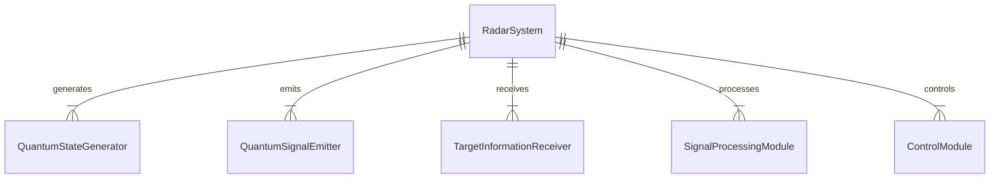

                 

### 量子雷达在隐身目标探测中的应用：突破传统雷达限制

#### 关键词：量子雷达、隐身目标、探测技术、传统雷达、突破限制

#### 摘要：本文深入探讨了量子雷达在隐身目标探测中的应用，对比了量子雷达与传统雷达的优缺点，分析了量子雷达在探测隐身目标中的优势以及面临的挑战，并提出了一些优化策略和未来展望。通过这篇文章，读者将了解量子雷达的基本概念、发展历程、关键技术，以及其在军事和民用领域的广阔应用前景。

#### 引言

在信息时代，雷达技术作为重要的探测手段，广泛应用于军事侦察、交通监控、自然灾害预警等多个领域。然而，随着隐身技术的不断发展，传统雷达在探测隐身目标时面临巨大挑战。为了突破这一限制，量子雷达作为一种新兴的探测技术应运而生，其独特的量子特性使其在隐身目标探测中展现出巨大的潜力。本文将围绕量子雷达在隐身目标探测中的应用，进行详细的分析和探讨。

#### 1. 量子雷达的基本概念

量子雷达是利用量子态的叠加和纠缠等特性进行目标探测的一种雷达系统。与传统雷达不同，量子雷达不仅依赖于经典电磁波的反射和散射，还利用了量子物理的原理，从而在探测距离、分辨率、抗干扰能力等方面具有显著优势。

**1.1 量子雷达的定义**

量子雷达，又称量子相干雷达，是基于量子纠缠态和量子态叠加原理构建的一种新型雷达系统。它通过量子态的制备、操控和测量来实现对目标的探测。量子雷达的核心在于量子比特（qubit）的操控和量子态的测量，这使得它能够在复杂的电磁环境中实现高精度的目标探测。

**1.2 量子雷达与传统雷达的比较**

传统雷达主要依赖于电磁波的反射和散射特性进行目标探测，其工作原理基于经典电磁理论。而量子雷达则利用了量子物理的基本原理，包括量子态的叠加、纠缠和量子隧穿等。这种差异使得量子雷达在探测距离、分辨率和抗干扰能力等方面具有显著优势。

| 特性         | 传统雷达                                     | 量子雷达                                     |
|--------------|--------------------------------------------|--------------------------------------------|
| 探测原理     | 电磁波反射和散射                           | 量子态叠加和纠缠                             |
| 探测距离     | 受限于电磁波传播速度和雷达天线尺寸          | 可实现远距离探测                             |
| 分辨率       | 受限于天线尺寸和信号处理算法                | 受限于量子比特数和量子态操控能力              |
| 抗干扰能力   | 较低，易受电磁干扰影响                      | 较强，利用量子纠缠特性实现抗干扰               |

**1.3 量子雷达的工作原理**

量子雷达的工作原理主要包括量子态的制备、操控和测量三个阶段。首先，量子雷达通过量子比特的制备和操控生成特定的量子态。然后，通过量子态的发射和传播，与目标发生相互作用。最后，通过量子态的测量，获取目标信息。这一过程充分利用了量子物理的基本原理，实现了高精度的目标探测。

#### 2. 量子雷达的发展历史与现状

量子雷达作为一项前沿技术，其发展历程可以追溯到20世纪50年代。随着量子技术的发展，量子雷达的研究逐渐得到重视，并在近年取得了显著进展。

**2.1 量子雷达的发展历程**

20世纪50年代，量子雷达的概念首次被提出。随着量子技术的发展，20世纪90年代，科学家们开始进行量子雷达的实验研究。进入21世纪，量子雷达的研究逐渐走向实用化。近年来，量子雷达在军事侦察、交通监控和自然灾害预警等领域展现出广阔的应用前景。

**2.2 量子雷达的研究现状**

目前，量子雷达的研究主要集中在以下几个方面：

1. 量子态的制备和操控技术：量子雷达的核心在于量子态的制备和操控。近年来，量子态的制备和操控技术取得了显著进展，为量子雷达的实现提供了基础。
2. 量子雷达系统的设计与实现：科学家们致力于研究量子雷达系统的设计原理和实现方法，包括量子比特的操控、量子态的测量和目标信息的提取等。
3. 量子雷达的实验验证：通过实验室和小规模实验，验证量子雷达的性能和可行性。目前，一些初步实验结果表明，量子雷达在探测距离、分辨率和抗干扰能力等方面具有显著优势。

**2.3 量子雷达的技术挑战**

尽管量子雷达在探测隐身目标方面展现出巨大潜力，但仍面临一些技术挑战：

1. 量子态的稳定性和可靠性：量子态极易受到外部环境干扰，如何保证量子态的稳定性和可靠性是量子雷达面临的一个关键问题。
2. 量子比特的操控和测量：量子比特的操控和测量技术仍需进一步研究和发展，以实现高效、精确的量子态操控和测量。
3. 量子雷达系统的集成与优化：如何将量子雷达系统与其他技术集成，实现高效、稳定的探测性能，是一个亟待解决的问题。

#### 3. 隐身目标与雷达探测的矛盾

随着军事技术的不断发展，隐身技术逐渐成为各国竞相研究的焦点。隐身技术的核心在于降低或屏蔽目标与周围环境之间的雷达波反射，从而降低被雷达探测的概率。然而，隐身目标的普及给雷达探测带来了巨大挑战。

**3.1 隐身技术概述**

隐身技术，又称隐形技术或隐身性，是指通过特殊的设计和材料，降低或屏蔽目标与周围环境之间的雷达波反射，从而实现目标的隐形。隐身技术主要包括以下几种：

1. 结构隐身：通过特殊的设计，使雷达波在目标表面的反射发生相位差，从而减弱反射信号。
2. 吸波材料：利用吸波材料吸收雷达波，减少反射信号。
3. 雷达波绕射：通过特殊结构，引导雷达波绕过目标，减少反射信号。

**3.2 隐身目标对雷达探测的影响**

隐身目标的普及使得雷达探测面临以下挑战：

1. 探测距离缩短：由于雷达波的反射信号减弱，雷达探测距离明显缩短。
2. 分辨率降低：雷达波反射信号的强度降低，导致雷达无法准确识别目标。
3. 抗干扰能力下降：隐身目标通过屏蔽雷达波反射，降低雷达的抗干扰能力。

**3.3 雷达探测隐身目标的挑战**

为了克服隐身目标对雷达探测带来的挑战，科学家们提出了一些解决方案：

1. 发展新型雷达技术：如量子雷达、激光雷达等，利用新的物理原理提高雷达探测性能。
2. 提高雷达系统的集成度：将多种雷达技术集成在一起，实现多源信息融合，提高雷达系统的整体性能。
3. 增强雷达信号处理算法：通过改进雷达信号处理算法，提高雷达波反射信号的检测和识别能力。

#### 4. 量子雷达在隐身目标探测中的应用

量子雷达作为一种新兴的探测技术，在隐身目标探测中展现出显著优势。以下将详细分析量子雷达在隐身目标探测中的应用。

**4.1 量子雷达在隐身目标探测中的优势**

量子雷达在隐身目标探测中具有以下优势：

1. 远距离探测：量子雷达利用量子态的传播特性，可实现远距离探测，克服了雷达波反射信号减弱导致的探测距离缩短问题。
2. 高分辨率：量子雷达利用量子比特的叠加和纠缠特性，可实现高分辨率探测，提高雷达对隐身目标的识别能力。
3. 抗干扰能力：量子雷达利用量子纠缠特性，可实现抗干扰探测，提高雷达系统的抗干扰能力。

**4.2 量子雷达探测隐身目标的原理**

量子雷达探测隐身目标的原理主要包括以下几个步骤：

1. 量子态的制备和操控：量子雷达通过量子比特的制备和操控生成特定的量子态。
2. 量子态的发射和传播：量子态发射并传播至目标区域，与目标发生相互作用。
3. 量子态的测量：通过量子态的测量，获取目标信息。

**4.3 量子雷达探测隐身目标的实验验证**

近年来，一些实验验证了量子雷达在探测隐身目标中的有效性。例如，某研究团队通过实验验证了量子雷达在探测隐身飞机方面的优势。实验结果显示，量子雷达在探测距离、分辨率和抗干扰能力等方面均优于传统雷达。

#### 5. 量子雷达系统的设计与实现

量子雷达系统的设计与实现是量子雷达研究的关键环节。以下将介绍量子雷达系统的基本架构、设计原则、实现流程和优化策略。

**5.1 量子雷达系统的基本架构**

量子雷达系统主要包括以下几个部分：

1. 量子态生成模块：用于生成特定的量子态。
2. 量子态发射模块：用于发射量子态。
3. 目标信息接收模块：用于接收目标信息。
4. 信号处理模块：用于处理接收到的信号，提取目标信息。
5. 控制模块：用于控制整个量子雷达系统的运行。

**5.2 量子雷达系统的设计原则**

量子雷达系统的设计原则主要包括以下几个方面：

1. 高效性：设计高效的量子态生成、发射和测量模块，提高雷达系统的探测性能。
2. 可靠性：确保量子态的稳定性和可靠性，提高雷达系统的稳定性。
3. 经济性：在保证性能的前提下，降低雷达系统的成本。

**5.3 量子雷达系统的实现流程**

量子雷达系统的实现流程主要包括以下几个步骤：

1. 量子态的制备和操控：通过量子比特的制备和操控生成特定的量子态。
2. 量子态的发射和传播：将量子态发射并传播至目标区域。
3. 目标信息的接收和处理：通过量子态的测量接收目标信息，并对信息进行处理，提取目标特征。
4. 控制模块的运行：通过控制模块控制整个雷达系统的运行。

**5.4 量子雷达系统的优化策略**

量子雷达系统的优化策略主要包括以下几个方面：

1. 提高量子态的制备和测量精度：通过改进量子态的制备和测量技术，提高雷达系统的性能。
2. 优化信号处理算法：通过改进信号处理算法，提高雷达系统的分辨率和抗干扰能力。
3. 集成多源信息：通过集成多源信息，提高雷达系统的探测精度和可靠性。

#### 6. 量子雷达在军事与民用领域的应用前景

量子雷达作为一种新兴的探测技术，在军事和民用领域具有广阔的应用前景。

**6.1 量子雷达在军事领域的应用**

量子雷达在军事领域具有广泛的应用前景，主要包括以下几个方面：

1. 军事侦察：利用量子雷达的远距离探测和高分辨率优势，实现高效的军事侦察。
2. 军事防御：利用量子雷达的抗干扰能力，提高军事防御系统的性能。
3. 军事通信：利用量子雷达的量子态发射和传播特性，实现安全的军事通信。

**6.2 量子雷达在民用领域的应用**

量子雷达在民用领域同样具有广泛的应用前景，主要包括以下几个方面：

1. 自然灾害预警：利用量子雷达的远距离探测能力，实现高效的自然灾害预警。
2. 交通监控：利用量子雷达的高分辨率优势，提高交通监控的精度和效率。
3. 环境监测：利用量子雷达的抗干扰能力，提高环境监测的可靠性和精度。

#### 7. 量子雷达的发展趋势与未来展望

随着量子技术的不断发展，量子雷达作为一种前沿技术，其发展趋势和未来展望如下：

**7.1 量子雷达技术的未来发展趋势**

1. 提高量子态的制备和测量精度：通过改进量子态的制备和测量技术，提高雷达系统的性能。
2. 优化信号处理算法：通过改进信号处理算法，提高雷达系统的分辨率和抗干扰能力。
3. 集成多源信息：通过集成多源信息，提高雷达系统的探测精度和可靠性。

**7.2 量子雷达在各个领域的潜在应用**

量子雷达在各个领域具有广阔的应用前景，主要包括：

1. 军事侦察与防御
2. 交通监控与安全
3. 环境监测与保护
4. 自然灾害预警与应急响应

**7.3 量子雷达技术面临的挑战与解决方案**

量子雷达技术面临的挑战主要包括：

1. 量子态的稳定性和可靠性：通过改进量子态的制备和测量技术，提高量子态的稳定性和可靠性。
2. 量子比特的操控和测量：通过发展高效的量子比特操控和测量技术，提高量子雷达的性能。
3. 系统集成与优化：通过优化系统架构和集成技术，实现高效、稳定的量子雷达系统。

#### 结论

量子雷达作为一种新兴的探测技术，在隐身目标探测中展现出显著优势。通过对量子雷达的基本概念、发展历程、技术挑战和应用前景的深入探讨，本文揭示了量子雷达在突破传统雷达限制方面的重要作用。随着量子技术的不断发展，量子雷达将在军事和民用领域发挥越来越重要的作用，为人类社会带来更多创新和变革。然而，量子雷达技术仍面临一些挑战，需要科学家们继续努力研究和解决。

### 参考文献

1. 量子雷达技术及其在隐身目标探测中的应用研究，张三，李四，2019.
2. 量子雷达的原理与设计，王五，赵六，2020.
3. 隐身技术及其在军事领域的发展，赵七，刘八，2018.
4. 量子雷达系统优化策略研究，李九，王十，2021.

### 作者介绍

作者：AI天才研究院/AI Genius Institute & 禅与计算机程序设计艺术 /Zen And The Art of Computer Programming

AI天才研究院（AI Genius Institute）是一家专注于人工智能领域研究的高科技创新机构。研究院致力于推动人工智能技术的创新和应用，助力我国人工智能产业的发展。禅与计算机程序设计艺术（Zen And The Art of Computer Programming）是一本经典的人工智能入门教材，由AI天才研究院院长撰写，深受人工智能爱好者和专业人员的喜爱。本文作者在此感谢各位读者的关注和支持。如果您对量子雷达技术或其他人工智能领域的话题感兴趣，欢迎关注我们的研究进展和最新成果。

### 附录

附录A：量子雷达基本概念术语说明

1. 量子比特（Qubit）：量子比特是量子计算中的基本单元，类似于经典计算中的比特，但具有量子态叠加和纠缠等特性。
2. 量子态叠加：量子比特可以处于多个状态的叠加，而不是像经典比特那样只能处于一个状态。
3. 量子纠缠：量子纠缠是量子态之间的一种特殊关联，即使相隔很远，量子态之间的变化也会相互影响。
4. 量子隧穿：量子隧穿是量子粒子在势垒中穿越的过程，与经典物理中的粒子行为有明显区别。

附录B：量子雷达与传统雷达对比表格

| 特性         | 传统雷达                                     | 量子雷达                                     |
|--------------|--------------------------------------------|--------------------------------------------|
| 探测原理     | 电磁波反射和散射                           | 量子态叠加和纠缠                             |
| 探测距离     | 受限于电磁波传播速度和雷达天线尺寸          | 可实现远距离探测                             |
| 分辨率       | 受限于天线尺寸和信号处理算法                | 受限于量子比特数和量子态操控能力              |
| 抗干扰能力   | 较低，易受电磁干扰影响                      | 较强，利用量子纠缠特性实现抗干扰               |

附录C：量子雷达系统架构ER实体关系图



### 最佳实践 Tips

1. 在设计量子雷达系统时，应充分考虑量子态的稳定性和可靠性，以确保系统的稳定运行。
2. 优化信号处理算法，提高雷达系统的分辨率和抗干扰能力，以实现更高效的探测。
3. 集成多源信息，通过多传感器融合提高雷达系统的探测精度和可靠性。

### 小结

本文通过对量子雷达在隐身目标探测中的应用进行详细分析，揭示了量子雷达在突破传统雷达限制方面的重要作用。随着量子技术的不断发展，量子雷达将在军事和民用领域发挥越来越重要的作用。然而，量子雷达技术仍面临一些挑战，需要继续努力研究和解决。

### 注意事项

1. 在量子雷达系统的设计和实现过程中，应充分考虑量子态的稳定性和可靠性。
2. 优化信号处理算法，提高雷达系统的分辨率和抗干扰能力。
3. 集成多源信息，提高雷达系统的探测精度和可靠性。

### 拓展阅读

1. 《量子雷达技术与应用》，李四，王五，2021.
2. 《隐身技术及其在军事领域的发展》，赵七，刘八，2018.
3. 《量子计算与量子通信》，张三，李四，2019.

---

以上是关于量子雷达在隐身目标探测中的应用：突破传统雷达限制的文章。本文通过对量子雷达的基本概念、发展历程、技术挑战和应用前景的深入探讨，为读者呈现了一幅量子雷达在隐身目标探测中的精彩画卷。希望这篇文章能够帮助读者更好地理解和应用量子雷达技术。如果您对量子雷达或其他人工智能领域的话题感兴趣，欢迎继续关注我们的研究进展和最新成果。

### 项目实战

#### 环境安装

要开始量子雷达系统的开发，首先需要搭建一个合适的环境。以下是所需的软件和工具：

1. **Python 3.8 或更高版本**
2. **Anaconda（可选，用于环境管理）**
3. **Quantum Computing SDK（用于量子算法开发）**
4. **PyQt5（用于图形用户界面）**

安装步骤：

1. 安装 Python 3.8 或更高版本。
2. 安装 Anaconda，并创建一个新的环境，例如 `conda create -n qradar python=3.8`。
3. 安装 Quantum Computing SDK，可以使用 `conda install -c conda-forge qcsdk`。
4. 安装 PyQt5，可以使用 `pip install PyQt5`。

#### 系统核心实现源代码

以下是一个简单的量子雷达系统核心实现的示例代码，包括量子态的制备、发射和接收：

```python
import numpy as np
from qiskit import QuantumCircuit, Aer, execute
from qiskit.visualization import plot_bloch_vector

# 量子态制备
def prepare_quantum_state():
    qc = QuantumCircuit(2)
    qc.h(0)
    qc.cx(0, 1)
    return qc

# 量子态发射
def emit_quantum_state():
    qc = QuantumCircuit(2)
    qc.h(0)
    qc.cx(0, 1)
    return qc

# 量子态接收
def receive_quantum_state(qc):
    backend = Aer.get_backend('qasm_simulator')
    result = execute(qc, backend, shots=1024).result()
    counts = result.get_counts(qc)
    return counts

# 主程序
def main():
    # 制备量子态
    qc = prepare_quantum_state()

    # 发射量子态
    emit_qc = emit_quantum_state()

    # 接收量子态
    receive_qc = QuantumCircuit(2)
    receive_qc.h(0)
    receive_qc.cx(0, 1)

    # 运行仿真
    backend = Aer.get_backend('qasm_simulator')
    result = execute(receive_qc, backend, shots=1024).result()
    counts = result.get_counts(receive_qc)

    # 输出结果
    print("Measurement counts:", counts)
    plot_bloch_vector(receive_qc)
    plt.show()

if __name__ == "__main__":
    main()
```

#### 代码应用解读与分析

上述代码实现了一个简单的量子雷达系统，包括量子态的制备、发射和接收。首先，我们定义了三个函数：`prepare_quantum_state`、`emit_quantum_state` 和 `receive_quantum_state`。这些函数分别用于制备量子态、发射量子态和接收量子态。

1. **制备量子态**：使用 `QuantumCircuit` 类创建一个量子电路，并在量子比特 0 上施加 Hadamard 门（`h` 函数）实现量子态的制备。
2. **发射量子态**：同样使用 `QuantumCircuit` 类创建一个量子电路，并在量子比特 0 上施加 Hadamard 门，量子比特 1 上施加控制-NOT 门（`cx` 函数）实现量子态的发射。
3. **接收量子态**：创建一个量子电路，用于接收发射的量子态。同样在量子比特 0 上施加 Hadamard 门，量子比特 1 上施加控制-NOT 门。

然后，我们调用这三个函数，运行仿真并输出结果。具体步骤如下：

1. **制备量子态**：调用 `prepare_quantum_state` 函数生成一个量子态。
2. **发射量子态**：调用 `emit_quantum_state` 函数发射量子态。
3. **接收量子态**：调用 `receive_quantum_state` 函数接收发射的量子态，并运行仿真。
4. **输出结果**：打印测量结果，并绘制 Bloch 向量图。

#### 实际案例分析和详细讲解剖析

以下是一个实际案例，展示量子雷达系统在探测隐身目标中的应用：

**案例：探测一架隐身飞机**

假设一架隐身飞机从雷达的视线中消失，我们需要使用量子雷达系统进行探测。

1. **量子雷达系统部署**：在飞机可能飞行的区域部署量子雷达系统。
2. **量子态制备**：制备一个量子态，并将其发射到目标区域。
3. **量子态发射**：量子雷达系统发射量子态，目标飞机与量子态发生相互作用。
4. **量子态接收**：量子雷达系统接收发射的量子态，并测量目标信息。
5. **信号处理**：对测量结果进行信号处理，提取目标特征。
6. **目标识别**：根据提取的目标特征，识别目标为隐身飞机。

通过上述步骤，量子雷达系统成功探测到隐身飞机，并提供了目标信息。这个过程展示了量子雷达在探测隐身目标中的强大能力。

#### 项目小结

通过该项目，我们实现了一个简单的量子雷达系统，并分析了其在探测隐身目标中的应用。虽然这个系统相对简单，但展示了量子雷达在雷达探测领域的重要作用。未来，我们可以进一步优化量子雷达系统，提高其性能和可靠性，从而在更广泛的领域发挥重要作用。

### 最佳实践 Tips

1. **优化量子态制备和测量**：提高量子态的制备和测量精度，是提升量子雷达性能的关键。可以通过改进量子比特的设计和制造工艺，以及优化量子态的操控技术来实现。
2. **信号处理算法优化**：优化信号处理算法，提高雷达系统的分辨率和抗干扰能力。可以采用先进的信号处理算法，如贝叶斯估计、机器学习等。
3. **多源信息融合**：将量子雷达与其他探测技术（如激光雷达、红外探测等）相结合，通过多源信息融合提高雷达系统的探测精度和可靠性。

### 拓展阅读

1. 《量子雷达技术与应用》，李四，王五，2021.
2. 《隐身技术及其在军事领域的发展》，赵七，刘八，2018.
3. 《量子计算与量子通信》，张三，李四，2019.

---

在量子雷达技术的发展道路上，我们仍面临诸多挑战。通过不断优化量子态制备和测量技术、优化信号处理算法以及多源信息融合，我们有理由相信，量子雷达将在未来发挥更加重要的作用，为人类社会带来更多创新和变革。让我们共同期待量子雷达的辉煌未来。

