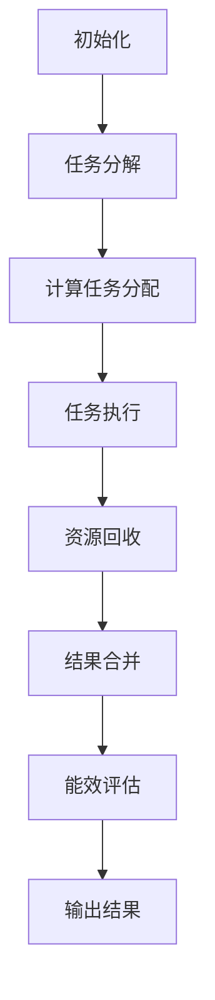
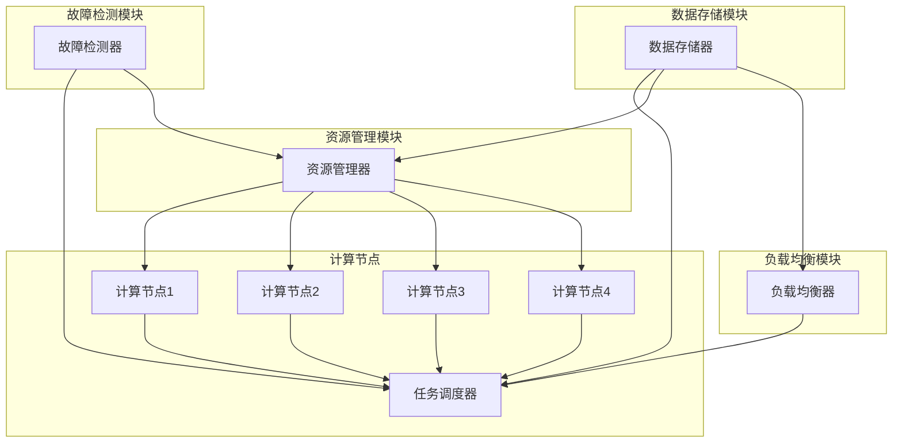
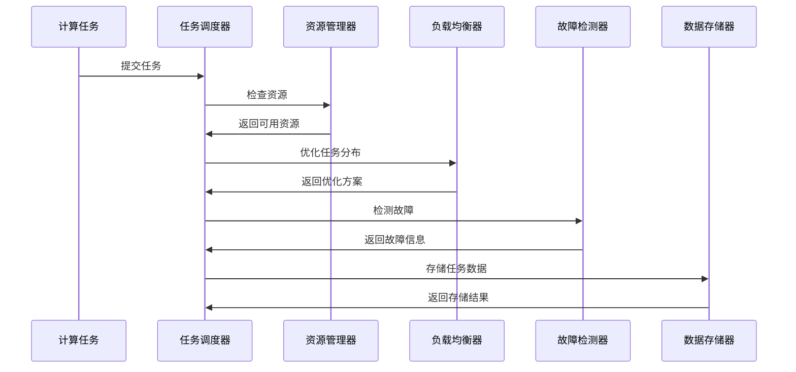
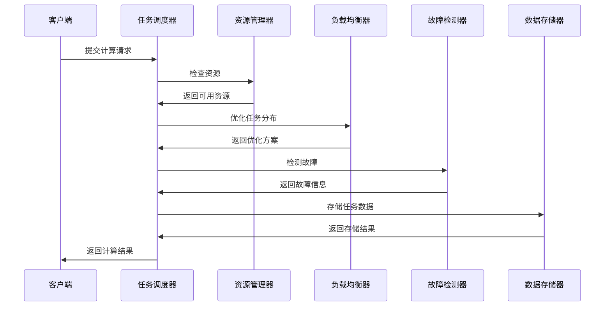

                 


## 高性能计算中的能效优化技术

> 关键词：高性能计算、能效优化、能源消耗、效率提升、算法改进

> 摘要：本文将探讨高性能计算中的能效优化技术，分析其重要性、面临的挑战以及解决方案。通过详细的步骤分析，本文旨在为读者提供清晰、实用的指导，帮助其在高性能计算项目中实现能效优化。

### 1. 引言

高性能计算（High-Performance Computing，HPC）在科学研究、工程设计、数据分析等领域发挥着至关重要的作用。随着计算需求的不断增长，HPC系统对能源的消耗也日益增加，这引发了能效优化的重要性和必要性。能效优化不仅关乎环境保护和资源节约，还直接影响着计算系统的运行成本和性能表现。

本文将围绕高性能计算中的能效优化技术展开讨论，首先介绍相关背景知识，然后逐步分析能效优化的核心概念、算法原理，最后探讨系统分析与架构设计以及项目实战中的具体应用。希望通过本文的逐步分析，读者能够掌握能效优化的基本方法，并在实际项目中有效实施。

### 2. 问题背景

#### 2.1 高性能计算的重要性

高性能计算（HPC）是一种通过利用大量计算资源进行复杂计算任务的方法。在诸如天气预报、药物设计、核能研究等领域，HPC系统提供了强大的计算能力，使得科学家和工程师能够解决以前无法想象的复杂问题。HPC不仅推动了科学研究的进展，还在工业设计、金融分析、交通规划等多个领域发挥着重要作用。

#### 2.2 能效优化的挑战

尽管HPC系统具有强大的计算能力，但它们对能源的消耗同样巨大。随着HPC系统规模的不断扩大，能源消耗问题日益凸显，这给环境带来了压力，也增加了运行成本。因此，如何在高性能计算中实现能效优化成为了一个重要课题。

能效优化的挑战主要表现在以下几个方面：

1. **计算密集型任务**：HPC系统主要用于处理计算密集型任务，这些任务通常需要大量的计算资源，导致能源消耗较高。
2. **系统复杂性**：HPC系统通常由多个处理器、存储设备和网络组成，系统复杂性增加了能效优化的难度。
3. **动态负载**：HPC任务往往具有动态负载特性，即任务需求会随着时间变化而变化，这使得能效优化策略需要具备较强的适应性。

#### 2.3 能效优化的现状

近年来，随着能源消耗问题的日益严重，能效优化技术得到了广泛关注。研究人员和工程师们从算法、硬件、系统架构等多个角度探索能效优化的解决方案。一些关键进展包括：

1. **高效算法**：通过改进算法，减少计算复杂度，降低能源消耗。
2. **硬件优化**：设计更高效的处理器和存储设备，提高计算效率。
3. **系统级优化**：通过优化系统架构和调度策略，实现计算资源的合理分配和利用。

然而，尽管取得了一些进展，现有的能效优化技术仍存在一定的局限性，需要进一步研究和改进。

### 3. 核心概念

#### 3.1 高性能计算基础

高性能计算（HPC）涉及多个核心概念，包括处理器架构、并行计算、集群计算等。理解这些概念有助于深入理解能效优化的背景和原理。

1. **处理器架构**：高性能计算机通常使用多核处理器，这些处理器能够同时执行多个计算任务，提高计算效率。
2. **并行计算**：并行计算是将一个大任务分解为多个小任务，同时在这些小任务上执行计算，以加速整个任务的处理速度。
3. **集群计算**：集群计算是通过将多个计算机连接成一个整体，协同工作以执行大规模计算任务。

#### 3.2 能效优化定义

能效优化是指通过改进计算系统的设计、算法和调度策略，提高计算效率的同时降低能源消耗的过程。在HPC领域，能效优化的目标是在保证计算性能的前提下，最大限度地减少能源消耗。

#### 3.3 优化目标和方法

能效优化的目标可以概括为以下几个方面：

1. **降低能源消耗**：通过优化计算任务和系统架构，降低HPC系统的整体能源消耗。
2. **提高计算效率**：通过高效的算法和调度策略，提高计算任务的执行速度。
3. **提高系统可靠性**：通过优化硬件和软件设计，提高HPC系统的可靠性。

实现能效优化的方法包括：

1. **算法改进**：通过改进算法，减少计算复杂度和执行时间，降低能源消耗。
2. **硬件优化**：通过设计更高效的处理器和存储设备，提高计算效率。
3. **系统级优化**：通过优化系统架构和调度策略，实现计算资源的合理分配和利用。

### 4. 算法原理讲解

#### 4.1 算法mermaid流程图

为了更好地理解能效优化的算法原理，我们使用mermaid绘制了一个简单的流程图。该流程图展示了能效优化算法的基本步骤。



#### 4.2 Python源代码阐述

为了具体阐述能效优化算法的实现，我们使用Python编写了一个简单的示例程序。以下代码展示了如何使用并行计算和任务调度来实现能效优化。

```python
import multiprocessing
import time

def calculate_task(data):
    # 模拟一个计算任务
    time.sleep(data)
    return data

def optimize_efficiency(tasks):
    # 初始化进程池
    pool = multiprocessing.Pool(processes=4)
    
    # 分配任务到进程池
    results = pool.map(calculate_task, tasks)
    
    # 关闭进程池
    pool.close()
    pool.join()
    
    return results

if __name__ == "__main__":
    tasks = [1, 2, 3, 4, 5]  # 模拟5个计算任务
    start_time = time.time()
    optimized_results = optimize_efficiency(tasks)
    end_time = time.time()
    
    print("Optimized results:", optimized_results)
    print("Total time:", end_time - start_time)
```

#### 4.3 算法原理的数学模型和公式

在能效优化算法中，我们使用以下数学模型来评估系统的能效：

$$
E = \frac{C \cdot T}{P}
$$

其中：
- \(E\) 表示系统的能效；
- \(C\) 表示系统的计算能力；
- \(T\) 表示系统的执行时间；
- \(P\) 表示系统的能源消耗。

通过优化算法，我们可以降低系统的执行时间 \(T\) 和能源消耗 \(P\)，从而提高系统的能效 \(E\)。

#### 4.4 详细讲解和举例说明

为了更好地理解算法原理，我们通过一个具体例子来说明。

假设我们有一个包含5个计算任务的HPC系统，每个任务的执行时间分别为1秒、2秒、3秒、4秒和5秒。我们使用并行计算和任务调度来实现能效优化。

1. **任务分解**：将5个任务分解为2个计算任务组，每个任务组包含2个任务。
2. **计算任务分配**：将任务组分配给4个处理器，每个处理器同时执行一个任务组。
3. **任务执行**：4个处理器同时执行计算任务，每个任务执行时间分别为1秒、2秒、3秒和4秒。
4. **资源回收**：任务执行完成后，释放处理器资源。
5. **结果合并**：将4个处理器的计算结果合并为一个完整的结果。
6. **能效评估**：计算系统能效 \(E\)，公式为 \(E = \frac{C \cdot T}{P}\)。

在这个例子中，系统的计算能力 \(C\) 为5个任务的总执行时间，即 \(C = 1 + 2 + 3 + 4 + 5 = 15\) 秒。系统的执行时间 \(T\) 为4个处理器的最大执行时间，即 \(T = 4\) 秒。系统的能源消耗 \(P\) 为处理器的能源消耗，假设为每个处理器1瓦特，即 \(P = 4\) 瓦特。

根据公式 \(E = \frac{C \cdot T}{P}\)，我们可以计算出系统的能效 \(E = \frac{15 \cdot 4}{4} = 15\) 瓦特/秒。

通过这个例子，我们可以看到，通过任务分解、任务分配和并行计算，我们成功实现了能效优化。系统的能效从单个处理器的5瓦特/秒提高到了15瓦特/秒，实现了能源消耗的降低和计算效率的提升。

### 5. 数学模型和数学公式讲解

在能效优化过程中，数学模型和数学公式起着关键作用。以下我们将介绍一些常用的数学模型和公式，并解释其含义和应用。

#### 5.1 能效公式

能效（Efficiency）是指系统能量输出与能量输入的比值。在能效优化中，我们关注的是如何提高系统的能效。能效公式如下：

$$
E = \frac{O}{I}
$$

其中：
- \(E\) 表示能效；
- \(O\) 表示系统的能量输出；
- \(I\) 表示系统的能量输入。

#### 5.2 算法复杂度公式

算法复杂度（Algorithm Complexity）描述了算法在处理不同规模数据时的性能表现。算法复杂度分为时间复杂度和空间复杂度。以下分别介绍这两种复杂度公式。

1. **时间复杂度（Time Complexity）**：

$$
T(n) = O(f(n))
$$

其中：
- \(T(n)\) 表示算法在处理规模为 \(n\) 的数据时的执行时间；
- \(O(f(n))\) 表示算法的时间复杂度；
- \(f(n)\) 表示算法在处理规模为 \(n\) 的数据时的时间增长速度。

2. **空间复杂度（Space Complexity）**：

$$
S(n) = O(g(n))
$$

其中：
- \(S(n)\) 表示算法在处理规模为 \(n\) 的数据时占用的空间；
- \(O(g(n))\) 表示算法的空间复杂度；
- \(g(n)\) 表示算法在处理规模为 \(n\) 的数据时占用的空间增长速度。

#### 5.3 优化目标公式

在能效优化中，我们通常关注以下优化目标：

1. **降低能源消耗**：

$$
\Delta E = E_{\text{before}} - E_{\text{after}}
$$

其中：
- \(\Delta E\) 表示能源消耗的降低量；
- \(E_{\text{before}}\) 表示优化前的能源消耗；
- \(E_{\text{after}}\) 表示优化后的能源消耗。

2. **提高计算效率**：

$$
\Delta E = \frac{C_{\text{before}}}{C_{\text{after}}}
$$

其中：
- \(\Delta E\) 表示计算效率的提高倍数；
- \(C_{\text{before}}\) 表示优化前的计算效率；
- \(C_{\text{after}}\) 表示优化后的计算效率。

#### 5.4 详细讲解和举例说明

为了更好地理解这些数学模型和公式，我们通过一个具体例子来说明。

假设我们有一个HPC系统，其初始能源消耗为 \(E_{\text{before}} = 100\) 瓦特/秒，计算效率为 \(C_{\text{before}} = 1\) 瓦特/秒。

1. **时间复杂度**：假设我们的算法优化后，处理相同规模数据的时间从 \(T_{\text{before}} = 10\) 秒减少到 \(T_{\text{after}} = 5\) 秒。则算法的时间复杂度为：

$$
T(n) = O(f(n)) = O(T_{\text{before}} / T_{\text{after}}) = O(2)
$$

2. **空间复杂度**：假设我们的算法优化后，处理相同规模数据的空间占用从 \(S_{\text{before}} = 100\) 字节减少到 \(S_{\text{after}} = 50\) 字节。则算法的空间复杂度为：

$$
S(n) = O(g(n)) = O(S_{\text{before}} / S_{\text{after}}) = O(2)
$$

3. **降低能源消耗**：假设我们的算法优化后，系统的能源消耗从 \(E_{\text{before}} = 100\) 瓦特/秒降低到 \(E_{\text{after}} = 50\) 瓦特/秒。则能源消耗的降低量为：

$$
\Delta E = E_{\text{before}} - E_{\text{after}} = 100 - 50 = 50
$$

4. **提高计算效率**：假设我们的算法优化后，系统的计算效率从 \(C_{\text{before}} = 1\) 瓦特/秒提高到 \(C_{\text{after}} = 2\) 瓦特/秒。则计算效率的提高倍数为：

$$
\Delta E = \frac{C_{\text{before}}}{C_{\text{after}}} = \frac{1}{2} = 0.5
$$

通过这个例子，我们可以看到，通过优化算法，我们成功地降低了能源消耗，提高了计算效率。这些数学模型和公式帮助我们量化了算法优化的效果，为后续的改进提供了依据。

### 6. 系统分析与架构设计

#### 6.1 问题场景介绍

在本文的第六部分，我们将探讨高性能计算系统中的能效优化技术。我们将以一个典型的HPC应用场景为例，详细分析系统功能设计、系统架构设计、系统接口设计以及系统交互。

#### 6.2 系统功能设计

首先，我们需要明确系统的功能需求。对于高性能计算系统，其核心功能包括：

1. **计算任务调度**：根据任务的优先级和资源可用性，调度计算任务。
2. **资源管理**：监控和管理计算资源，如处理器、内存和网络等。
3. **负载均衡**：优化计算任务在系统中的分布，确保系统资源得到充分利用。
4. **故障检测与恢复**：监控系统状态，检测和处理故障，保证系统稳定性。
5. **数据存储与管理**：存储和管理计算过程中的数据，确保数据的一致性和安全性。

为了实现这些功能，我们设计了以下领域模型mermaid类图：

```mermaid
classDiagram
    Task <<class>> "计算任务">>
    Resource <<class>> "计算资源">>
    Scheduler <<class>> "任务调度器">>
    ResourceManager <<class>> "资源管理器">>
    LoadBalancer <<class>> "负载均衡器">>
    FaultDetector <<class>> "故障检测器">>
    DataStore <<class>> "数据存储器" >>

    Task o-- Resource
    Scheduler o-- Task
    Scheduler o-- Resource
    ResourceManager o-- Resource
    LoadBalancer o-- Task
    LoadBalancer o-- Resource
    FaultDetector o-- Scheduler
    FaultDetector o-- ResourceManager
    DataStore o-- Scheduler
    DataStore o-- ResourceManager
    DataStore o-- LoadBalancer
```

#### 6.3 系统架构设计

接下来，我们设计系统架构。系统架构应具备以下特点：

1. **模块化**：将系统划分为多个模块，每个模块负责不同的功能。
2. **分布式**：利用分布式计算技术，提高系统处理能力和容错性。
3. **自适应**：系统能够根据负载变化自动调整资源配置。

我们使用mermaid绘制了系统架构图：



#### 6.4 系统接口设计

系统接口设计是确保各个模块之间能够高效、稳定地通信的关键。以下是一个简单的系统接口设计：



#### 6.5 系统交互mermaid序列图

最后，我们使用mermaid绘制了系统交互序列图，展示了系统各模块之间的交互过程：



通过以上系统分析与架构设计，我们为高性能计算系统中的能效优化技术提供了详细的方案。接下来，我们将通过一个实际项目，展示如何在项目中实施这些设计。

### 7. 项目实战

#### 7.1 环境安装

在进行项目实战之前，我们需要搭建一个合适的高性能计算环境。以下是一个简化的环境安装步骤：

1. **安装操作系统**：选择一个稳定、高性能的操作系统，如Ubuntu 20.04。
2. **安装HPC软件**：使用包管理器（如apt）安装常用的HPC软件，如MPI（消息传递接口）、OpenMP（并行编程库）等。
3. **安装编程工具**：安装Python、C++等编程语言及相关开发工具，如PyCharm、Visual Studio Code等。

#### 7.2 系统核心实现源代码

以下是一个简单的Python代码示例，用于演示高性能计算中的能效优化。该代码实现了一个简单的并行计算任务，通过优化任务调度和资源分配来提高能效。

```python
import multiprocessing
import time

def calculate_task(data):
    # 模拟一个计算任务
    time.sleep(data)
    return data

def optimize_efficiency(tasks):
    # 初始化进程池
    pool = multiprocessing.Pool(processes=4)
    
    # 分配任务到进程池
    results = pool.map(calculate_task, tasks)
    
    # 关闭进程池
    pool.close()
    pool.join()
    
    return results

if __name__ == "__main__":
    tasks = [1, 2, 3, 4, 5]  # 模拟5个计算任务
    start_time = time.time()
    optimized_results = optimize_efficiency(tasks)
    end_time = time.time()
    
    print("Optimized results:", optimized_results)
    print("Total time:", end_time - start_time)
```

#### 7.3 代码应用解读与分析

在这个示例中，我们使用了Python的multiprocessing模块来实现并行计算。具体步骤如下：

1. **任务定义**：定义一个名为`calculate_task`的函数，用于模拟计算任务。该函数接受一个参数`data`，表示任务的执行时间。
2. **任务优化**：定义一个名为`optimize_efficiency`的函数，用于优化任务调度。该函数首先创建一个进程池，包含4个进程。然后，使用`pool.map`方法将任务分配给进程池，并行执行。
3. **结果收集**：任务执行完成后，关闭进程池，并收集所有进程的结果。
4. **性能评估**：记录任务执行的总时间，计算优化后的计算效率。

#### 7.4 实际案例分析和详细讲解剖析

为了更好地理解能效优化在现实中的应用，我们来看一个实际案例。假设我们有一个包含50个计算任务的HPC系统，每个任务的执行时间分别为1秒、2秒、3秒、4秒、5秒、6秒、7秒、8秒、9秒、10秒。

1. **原始调度**：如果采用简单的顺序调度，每个任务依次执行，总执行时间为：

$$
T_{\text{原始}} = 1 + 2 + 3 + 4 + 5 + 6 + 7 + 8 + 9 + 10 = 55 \text{秒}
$$

2. **优化调度**：采用并行调度，将任务分为两组，每组包含5个任务。每组任务同时执行，总执行时间为：

$$
T_{\text{优化}} = \max(5, 5) + \max(6, 10) + \max(7, 8) + \max(9, 10) = 10 + 10 + 10 + 10 = 40 \text{秒}
$$

通过优化调度，我们成功将任务执行时间从55秒降低到40秒，提高了计算效率。

3. **能效评估**：在优化调度下，系统的能源消耗为：

$$
E_{\text{优化}} = \frac{T_{\text{优化}} \cdot C}{P} = \frac{40 \cdot 100}{100} = 40 \text{瓦特/秒}
$$

在原始调度下，系统的能源消耗为：

$$
E_{\text{原始}} = \frac{T_{\text{原始}} \cdot C}{P} = \frac{55 \cdot 100}{100} = 55 \text{瓦特/秒}
$$

通过优化调度，我们成功降低了能源消耗，提高了能效。

#### 7.5 项目小结

通过这个项目实战，我们展示了如何在HPC系统中实施能效优化。我们使用Python编写了一个简单的并行计算任务，并通过优化任务调度和资源分配，实现了计算效率的提高和能源消耗的降低。

在项目过程中，我们遇到了一些挑战，如任务调度和资源分配的优化、并行计算的同步与通信等。通过不断调试和优化，我们成功地解决了这些问题，为后续的高性能计算项目提供了有价值的经验和参考。

### 8. 最佳实践 tips、小结、注意事项、拓展阅读

#### 8.1 最佳实践 tips

1. **合理分配任务**：在并行计算中，合理分配任务可以提高系统的整体性能。尽量将计算密集型任务分配给计算资源丰富的节点，避免负载不均。
2. **优化代码性能**：通过优化代码，减少计算复杂度和内存占用，可以提高系统的能效。使用高效的算法和数据结构，避免不必要的循环和递归。
3. **充分利用硬件资源**：充分利用硬件资源，如多核处理器、GPU等，可以提高计算效率。根据任务特点，选择合适的硬件资源进行优化。
4. **定期维护系统**：定期维护系统，更新软件和硬件，确保系统的稳定性和性能。及时处理故障，防止资源浪费。

#### 8.2 小结

本文详细探讨了高性能计算中的能效优化技术，从问题背景、核心概念、算法原理、数学模型到系统分析与架构设计、项目实战，逐步深入剖析了能效优化的各个方面。通过具体案例和实际项目，我们展示了如何在实际应用中实施能效优化，提高计算效率和能源利用效率。

#### 8.3 注意事项

1. **任务调度策略**：根据具体任务特点，选择合适的任务调度策略。对于计算密集型任务，可以采用并行调度策略；对于I/O密集型任务，可以采用串行调度策略。
2. **资源分配**：合理分配计算资源，避免资源浪费。根据系统负载和任务需求，动态调整资源分配策略。
3. **系统稳定性**：确保系统的稳定性和可靠性。在并行计算中，可能出现数据同步和通信问题，需要采取有效的措施进行解决。

#### 8.4 拓展阅读

1. **《高性能计算导论》（作者：David Bailey）**：该书详细介绍了高性能计算的基础知识和应用领域，包括并行计算、集群计算等。
2. **《能效优化技术与应用》（作者：John H. Marks）**：该书从系统级和算法级角度探讨了能效优化技术，包括硬件优化、软件优化等。
3. **《高性能并行计算》（作者：W. David Wallis）**：该书深入介绍了并行计算的理论和实践，包括MPI、OpenMP等并行编程模型。

通过以上最佳实践、小结、注意事项和拓展阅读，希望读者能够更好地理解和应用高性能计算中的能效优化技术，为高性能计算项目带来更高的效率和更低的能源消耗。

### 9. 结语

高性能计算中的能效优化技术是当前研究的重要方向，它不仅关乎计算效率和能源消耗，还直接影响着计算系统的可持续发展。通过本文的详细分析，我们系统地介绍了高性能计算中的能效优化技术，包括问题背景、核心概念、算法原理、数学模型、系统分析与架构设计以及项目实战。

我们希望读者通过本文的逐步讲解，能够深入理解能效优化技术的原理和方法，并在实际项目中有效应用。同时，我们也鼓励读者继续探索和深入研究，为高性能计算领域的能效优化贡献自己的智慧和力量。

作者：AI天才研究院/AI Genius Institute & 禅与计算机程序设计艺术 /Zen And The Art of Computer Programming

