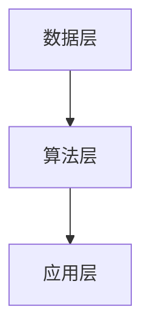
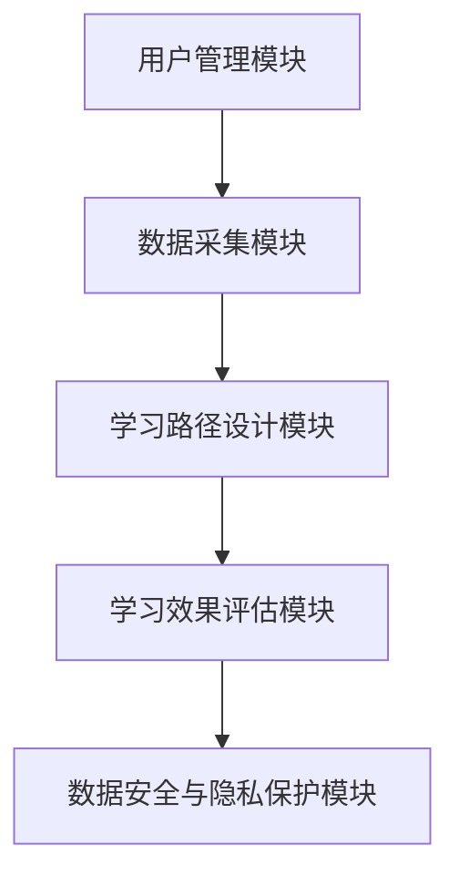
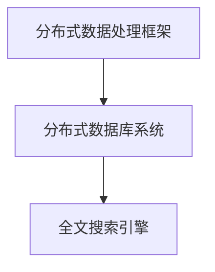

                 

# AI在个性化学习路径设计中的应用：优化教育效果

## 关键词：
- 个性化学习
- 人工智能
- 学习路径设计
- 教育效果优化
- 数据挖掘
- 协同过滤
- 深度学习

## 摘要：
本文旨在探讨人工智能在个性化学习路径设计中的应用，以优化教育效果。我们将从背景与概述、核心概念、设计原理、算法应用、实践案例等多个方面进行详细分析，旨在为教育工作者和技术开发者提供有价值的参考。

## 引言
在教育领域，传统的“一刀切”教学模式已经难以满足现代学生的学习需求。学生之间存在个体差异，他们在学习能力、学习兴趣和知识背景等方面都有所不同。如何根据学生的个性化需求，设计出科学有效的学习路径，成为教育领域亟待解决的问题。随着人工智能技术的快速发展，特别是机器学习、数据挖掘和自然语言处理等技术的应用，个性化学习路径设计迎来了新的机遇。

本文将围绕以下几个方面展开讨论：

1. **个性化学习路径设计的背景与概述**：介绍教育现状及挑战，探讨人工智能与个性化学习的结合点，以及AI在个性化学习路径设计中的潜力。
2. **核心概念**：讲解个性化学习路径设计中的关键概念，包括机器学习基础、数据挖掘与数据可视化、自然语言处理等。
3. **设计原理**：分析个性化学习路径的基本要素，学习分析模型，以及用户行为分析与学习预测。
4. **算法应用**：介绍协同过滤算法、内容推荐算法和深度学习在个性化学习路径设计中的应用。
5. **实践案例**：通过具体的AI个性化学习路径设计项目，展示系统功能设计与实现、AI模型训练与优化、项目实战等。
6. **结论与展望**：总结研究成果，探讨个性化学习路径设计的未来趋势和AI在教育领域的发展前景。

## 第一部分：背景与概述

### 第1章：个性化学习路径设计的背景

#### 1.1 教育现状与挑战

在传统的教育模式中，教师根据统一的教学大纲和课程安排，为所有学生提供相同的教学内容和进度。然而，这种“一刀切”的教学方法忽视了学生之间的个体差异。学生在学习能力、学习兴趣、知识背景和认知风格等方面存在显著差异，导致部分学生在学习中感到挫败，而另一些学生则感到教学内容过于简单。此外，传统的教学模式难以适应快速变化的社会需求，学生的创新能力和实践能力难以得到有效培养。

随着社会的发展和科技的进步，人们对教育的要求越来越高。现代教育不仅要求学生掌握知识，更重要的是培养学生的综合素质，包括批判性思维、问题解决能力、团队合作精神和创新精神等。然而，传统的教育模式难以实现这些目标，需要寻找新的教学方法和学习路径。

#### 1.2 人工智能与个性化学习

人工智能（AI）技术的快速发展为个性化学习提供了新的契机。人工智能能够通过分析学生的学习数据，了解学生的个性化需求，从而为每个学生设计出科学有效的学习路径。个性化学习路径设计的关键在于对学习者的学习过程和特征进行深入分析，并根据分析结果提供个性化的学习资源、学习任务和学习反馈。

个性化学习路径设计涉及多个领域的技术，包括机器学习、数据挖掘、自然语言处理、推荐系统等。通过这些技术的应用，可以实现对学生学习行为的全面分析，挖掘出学生的个性化需求，并根据这些需求设计出适应每个学生的个性化学习路径。

#### 1.3 AI在个性化学习路径设计中的潜力

人工智能在个性化学习路径设计中的应用具有很大的潜力。首先，AI技术可以大规模处理和分析学生产生的各种学习数据，包括学习行为、学习进度、考试成绩等，从中挖掘出有价值的信息，为个性化学习提供依据。其次，AI技术可以动态调整学习路径，根据学生的学习情况和学习反馈，实时优化学习内容和学习任务，提高学习效果。最后，AI技术可以为学生提供个性化的学习资源和学习支持，帮助学生在学习过程中克服困难，提高学习兴趣和自信心。

总之，人工智能在个性化学习路径设计中的应用，不仅有助于提高学生的学习效果，还可以促进教育公平，使每个学生都能得到适合自己的教育。随着AI技术的不断进步，个性化学习路径设计有望成为教育领域的一种主流教学模式。

### 第2章：个性化学习路径设计中的AI核心概念

#### 2.1 机器学习基础

机器学习是人工智能的一个重要分支，它使计算机系统能够从数据中学习并做出决策或预测。在个性化学习路径设计中，机器学习算法被广泛应用于分析学生学习数据，识别学生的个性化需求，并设计适应每个学生的学习路径。

机器学习的基础包括以下几个核心概念：

- **监督学习**：监督学习是一种从已知输入和输出数据中学习规律的方法。它通过建立输入和输出之间的映射关系，实现对未知数据的预测。在个性化学习路径设计中，监督学习算法可用于预测学生的成绩、学习进度等。

- **无监督学习**：无监督学习是无需已知输出数据，仅从输入数据中学习规律的方法。它常用于数据降维、聚类分析等。在个性化学习路径设计中，无监督学习算法可用于分析学生的学习行为，发现学生之间的相似性和差异性。

- **强化学习**：强化学习是一种通过试错学习，使智能体在与环境交互过程中达到最优策略的方法。在个性化学习路径设计中，强化学习算法可用于动态调整学习路径，优化学习效果。

#### 2.2 数据挖掘与数据可视化

数据挖掘是机器学习的一个重要应用领域，它旨在从大量数据中发现隐藏的模式和知识。在个性化学习路径设计中，数据挖掘技术被用于分析学生学习数据，提取有价值的信息，为学习路径设计提供依据。

数据挖掘的关键概念包括：

- **关联规则挖掘**：关联规则挖掘是一种发现数据中项之间的关联关系的方法。在个性化学习路径设计中，关联规则挖掘可用于分析学生的学习行为，发现潜在的关联模式。

- **分类和聚类**：分类和聚类是数据挖掘中的两种基本方法。分类是将数据分为不同的类别，而聚类是将数据分为多个群组。在个性化学习路径设计中，分类和聚类算法可用于分析学生特征，为学生分组和推荐学习资源。

数据可视化是将数据以图形或图像的形式展示出来，使人们能够直观地理解和分析数据。在个性化学习路径设计中，数据可视化技术被用于展示学习数据、分析结果和学习路径，帮助教育工作者和学生更好地理解个性化学习过程。

#### 2.3 自然语言处理在个性化学习中的应用

自然语言处理（NLP）是人工智能的一个分支，它使计算机能够理解、处理和生成人类语言。在个性化学习路径设计中，NLP技术被用于分析学生生成的大量文本数据，提取关键信息，为学习路径设计提供支持。

自然语言处理的关键概念包括：

- **文本分类**：文本分类是一种将文本分为不同类别的任务。在个性化学习路径设计中，文本分类算法可用于对学生生成的文本进行分类，识别学生的学习需求和兴趣。

- **情感分析**：情感分析是一种识别文本中情感极性的方法。在个性化学习路径设计中，情感分析算法可用于分析学生的情感状态，为学习路径的动态调整提供依据。

- **问答系统**：问答系统是一种能够回答用户问题的系统。在个性化学习路径设计中，问答系统可用于为学生提供个性化的学习建议和指导。

通过以上核心概念的应用，人工智能在个性化学习路径设计中发挥着重要作用。下一章将讨论个性化学习路径设计的基本原理，进一步探讨如何利用AI技术设计出科学有效的学习路径。

### 第3章：个性化学习路径设计原理

#### 3.1 个性化学习路径的基本要素

个性化学习路径设计旨在为每个学生提供定制化的学习方案，以满足其个性化需求。一个成功的个性化学习路径设计需要包括以下基本要素：

- **学生特征**：学生特征包括学习风格、知识基础、兴趣领域、学习动机等。通过分析学生特征，可以更好地理解学生的个性化需求，为其提供合适的课程和学习资源。

- **学习目标**：学习目标是指学生在学习过程中希望达成的具体目标。个性化学习路径设计需要根据学生的特点和需求，设定具体、可行的学习目标，确保学生能够有序、有效地进行学习。

- **学习内容**：学习内容是指学生在学习过程中需要掌握的知识和技能。个性化学习路径设计需要根据学生的兴趣和需求，精选适合的学习内容，确保学习内容既有广度又有深度。

- **学习资源**：学习资源包括教材、视频、课件、练习题等。个性化学习路径设计需要根据学生的学习内容和目标，为学生提供丰富的学习资源，帮助其更好地理解和掌握学习内容。

- **学习评估**：学习评估是对学生学习效果进行监控和反馈的过程。个性化学习路径设计需要建立科学有效的学习评估体系，实时监测学生的学习进度和效果，为学习路径的动态调整提供依据。

#### 3.2 学习分析模型

学习分析模型是个性化学习路径设计的重要工具，它通过分析学生的学习行为、学习数据，挖掘出学生的个性化需求，为学习路径设计提供依据。以下是一些常用的学习分析模型：

- **学习轨迹模型**：学习轨迹模型是一种记录学生学习行为的模型，它通过分析学生的学习路径，了解学生的学习习惯和偏好。例如，通过分析学生在学习平台上的登录时间、学习时长、学习内容等，可以了解学生的学习规律和需求。

- **学生兴趣模型**：学生兴趣模型是一种基于学生行为和反馈，分析学生兴趣爱好的模型。通过分析学生在学习过程中对某一课程、知识点或学习资源的关注度，可以了解学生的兴趣领域和偏好。

- **学习状态模型**：学习状态模型是一种分析学生学习状态和情绪变化的模型。通过分析学生在学习过程中的行为表现和情绪变化，可以了解学生的学习状态和情绪状况，为学习路径的动态调整提供依据。

- **学习效果预测模型**：学习效果预测模型是一种基于学生学习数据，预测学生学习效果的模型。通过分析学生在学习过程中的表现，可以预测学生在未来学习中的表现和成绩，为学习路径的优化提供依据。

#### 3.3 用户行为分析与学习预测

用户行为分析是个性化学习路径设计的重要环节，它通过分析学生的学习行为，了解学生的学习需求和兴趣，为学习路径设计提供依据。以下是一些常用的用户行为分析方法：

- **行为轨迹分析**：行为轨迹分析是一种分析学生在学习平台上的行为路径的方法。通过分析学生的行为轨迹，可以了解学生的学习习惯和偏好，为学习路径的设计提供参考。

- **行为模式识别**：行为模式识别是一种通过识别学生行为中的共性模式，分析学生需求的方法。例如，通过分析学生在学习过程中的频繁操作，可以识别出学生的学习需求和学习难点。

- **学习预测**：学习预测是一种通过分析学生学习数据，预测学生学习效果和成绩的方法。通过学习预测，可以为学习路径的动态调整提供依据，确保学生在学习过程中能够达到预期的学习目标。

用户行为分析与学习预测结合，可以为个性化学习路径设计提供有力支持。通过分析学生的学习行为，了解学生的学习需求和兴趣，设计出科学有效的学习路径，提高学生的学习效果和满意度。

### 第4章：AI算法在个性化学习路径设计中的应用

#### 4.1 协同过滤算法

协同过滤算法是推荐系统中最常用的算法之一，它通过分析用户的历史行为和偏好，为用户推荐相似或感兴趣的内容。在个性化学习路径设计中，协同过滤算法可以用于推荐适合学生的学习资源和任务。

协同过滤算法分为两种主要类型：基于用户的协同过滤（User-Based Collaborative Filtering，UBCF）和基于项目的协同过滤（Item-Based Collaborative Filtering，IBCF）。

- **基于用户的协同过滤**：UBCF算法通过分析用户之间的相似性，为用户推荐与历史行为相似的用户喜欢的资源。具体步骤如下：

  1. **用户相似性计算**：计算用户之间的相似性，常用的方法包括余弦相似性、皮尔逊相关系数等。
  2. **相似用户推荐**：为当前用户推荐与其最相似的用户的喜好资源。
  3. **推荐结果调整**：根据推荐结果的反馈，调整推荐策略，提高推荐效果。

- **基于项目的协同过滤**：IBCF算法通过分析项目之间的相似性，为用户推荐与历史行为相似的项目。具体步骤如下：

  1. **项目相似性计算**：计算项目之间的相似性，常用的方法包括余弦相似性、欧氏距离等。
  2. **相似项目推荐**：为当前用户推荐与其历史行为相似的项目。
  3. **推荐结果调整**：根据推荐结果的反馈，调整推荐策略，提高推荐效果。

协同过滤算法在个性化学习路径设计中的应用，可以帮助教师根据学生的学习偏好推荐适合的学习资源和任务，从而提高学习效果和满意度。

#### 4.2 内容推荐算法

内容推荐算法是一种基于内容特征的推荐算法，它通过分析学习资源的特征，为用户推荐与其兴趣相似的学习资源。在个性化学习路径设计中，内容推荐算法可以用于为学生推荐合适的课程和学习材料。

以下是一些常用的内容推荐算法：

- **基于关键词的推荐**：基于关键词的推荐算法通过分析学习资源的文本内容，提取关键词，为用户推荐包含相同或相关关键词的学习资源。具体步骤如下：

  1. **关键词提取**：使用文本处理技术，如词频统计、TF-IDF等，提取学习资源的关键词。
  2. **关键词匹配**：为当前用户推荐包含与其兴趣相关的关键词的学习资源。
  3. **推荐结果调整**：根据推荐结果的反馈，调整推荐策略，提高推荐效果。

- **基于语义的推荐**：基于语义的推荐算法通过分析学习资源的语义信息，为用户推荐与其兴趣相似的学习资源。具体步骤如下：

  1. **语义分析**：使用自然语言处理技术，如词义消歧、实体识别等，分析学习资源的语义信息。
  2. **语义匹配**：为当前用户推荐与其兴趣相关的学习资源。
  3. **推荐结果调整**：根据推荐结果的反馈，调整推荐策略，提高推荐效果。

内容推荐算法在个性化学习路径设计中的应用，可以帮助教师为学生推荐与其兴趣和需求相关的学习资源，提高学习效果和满意度。

#### 4.3 深度学习在个性化学习中的应用

深度学习是一种基于人工神经网络的机器学习技术，它在图像识别、语音识别和自然语言处理等领域取得了显著成果。在个性化学习路径设计中，深度学习可以用于分析学生的学习行为和特征，为学习路径的动态调整提供支持。

以下是一些深度学习在个性化学习中的应用：

- **神经网络模型**：神经网络模型是一种基于多层感知器的人工神经网络，它通过层层提取特征，实现对复杂数据的建模和预测。在个性化学习路径设计中，神经网络模型可以用于分析学生的学习行为和特征，预测学生的学习效果和兴趣。

- **卷积神经网络（CNN）**：卷积神经网络是一种用于图像识别和处理的深度学习模型，它通过卷积操作和池化操作，实现对图像的特征提取和分类。在个性化学习路径设计中，CNN可以用于分析学生的学习行为和兴趣，为学习路径的动态调整提供支持。

- **递归神经网络（RNN）**：递归神经网络是一种用于序列数据处理的深度学习模型，它通过递归连接，实现对序列数据的建模和预测。在个性化学习路径设计中，RNN可以用于分析学生的学习行为和兴趣，为学习路径的动态调整提供支持。

- **生成对抗网络（GAN）**：生成对抗网络是一种用于生成复杂数据的深度学习模型，它通过生成器和判别器的对抗训练，生成逼真的数据。在个性化学习路径设计中，GAN可以用于生成个性化的学习资源和任务，提高学习效果和满意度。

深度学习在个性化学习路径设计中的应用，可以帮助教育工作者更好地理解学生的学习行为和需求，为学习路径的动态调整提供技术支持。随着深度学习技术的不断进步，其在个性化学习中的应用前景将更加广阔。

### 第5章：AI个性化学习路径设计项目概述

#### 5.1 项目背景

随着教育信息化的发展，教育机构越来越重视个性化学习路径的设计与应用。为了更好地满足学生的个性化需求，提高学习效果，某知名在线教育平台决定开展一项AI个性化学习路径设计项目。该项目旨在利用人工智能技术，对学生的学习行为和学习数据进行分析，为学生设计出科学有效的个性化学习路径。

#### 5.2 项目目标

本项目的主要目标如下：

1. **提高学习效果**：通过分析学生的学习行为和特征，为学生推荐适合的学习资源和任务，提高学习效果和满意度。
2. **优化教育资源配置**：通过个性化学习路径设计，优化教育资源的分配，使教育资源得到充分利用，提高教育资源的利用率。
3. **提升教育公平性**：通过个性化学习路径设计，使不同背景和基础的学生都能得到适合自己的教育，提升教育公平性。
4. **支持教育决策**：通过分析学生学习数据，为教育管理者提供科学依据，支持教育决策和教学改进。

#### 5.3 项目架构设计

本项目采用分层架构设计，包括数据层、算法层和应用层。

- **数据层**：数据层负责收集和存储学生的学习数据，包括学习行为数据、考试成绩、作业提交情况等。数据层采用分布式数据库系统，保证数据的实时性和安全性。
- **算法层**：算法层负责对学习数据进行分析和处理，包括用户行为分析、学习效果预测、学习资源推荐等。算法层采用机器学习、深度学习等技术，构建个性化的学习模型。
- **应用层**：应用层负责展示个性化学习路径，包括学习任务推荐、学习资源推荐、学习效果评估等。应用层采用前端技术，如React、Vue等，实现交互式用户体验。

项目架构设计如图所示：



通过以上架构设计，项目能够实现数据的实时采集、处理和展示，为学生提供个性化的学习体验，为教育管理者提供科学依据。

### 第6章：系统功能设计与实现

#### 6.1 系统需求分析

为了实现AI个性化学习路径设计，系统需要满足以下需求：

1. **用户管理**：系统需要支持用户的注册、登录、信息查询等操作，确保用户安全性和权限管理。
2. **学习数据采集**：系统需要能够实时采集学生的学习行为数据，包括学习时长、学习内容、考试结果等，为学习分析提供数据支持。
3. **学习路径设计**：系统需要根据学生的学习数据，设计出科学有效的个性化学习路径，包括学习任务推荐、学习资源推荐等。
4. **学习效果评估**：系统需要能够实时评估学生的学习效果，包括学习进度、学习成果等，为学习路径的调整提供依据。
5. **数据安全与隐私保护**：系统需要确保用户数据的安全和隐私，遵循相关法律法规，防止数据泄露。

#### 6.2 功能模块设计

根据系统需求分析，系统可以划分为以下功能模块：

1. **用户管理模块**：负责用户的注册、登录、信息查询、权限管理等功能。
2. **数据采集模块**：负责实时采集学生的学习行为数据，包括学习时长、学习内容、考试结果等。
3. **学习路径设计模块**：负责根据学生的学习数据，设计出科学有效的个性化学习路径，包括学习任务推荐、学习资源推荐等。
4. **学习效果评估模块**：负责实时评估学生的学习效果，包括学习进度、学习成果等，为学习路径的调整提供依据。
5. **数据安全与隐私保护模块**：负责确保用户数据的安全和隐私，遵循相关法律法规，防止数据泄露。

功能模块设计图如下所示：



#### 6.3 数据处理与存储方案

为了高效处理和存储大量的学习数据，系统采用以下数据处理与存储方案：

1. **数据处理**：系统采用分布式数据处理框架，如Apache Spark，实现对大规模学习数据的实时处理和分析。
2. **数据存储**：系统采用分布式数据库系统，如Apache Hadoop HDFS，存储学习数据，保证数据的持久化和安全性。
3. **数据索引**：系统采用全文搜索引擎，如Elasticsearch，对学习数据进行索引，提高数据查询效率。

数据处理与存储方案如图所示：



通过以上方案，系统能够高效处理和存储大量的学习数据，为个性化学习路径设计提供可靠的数据支持。

### 第7章：AI模型训练与优化

#### 7.1 数据预处理

在AI模型训练过程中，数据预处理是一个至关重要的步骤。数据预处理的主要目的是将原始数据进行清洗、转换和归一化，以便于模型的训练和优化。以下是一些常用的数据预处理方法：

1. **数据清洗**：数据清洗是数据预处理的第一步，目的是去除数据中的噪声和错误。具体方法包括去除缺失值、删除重复数据、纠正错误数据等。

2. **数据转换**：数据转换是将数据从一种格式转换为另一种格式的过程。例如，将文本数据转换为数值数据，或将不同时间格式统一为同一格式。

3. **归一化**：归一化是将数据映射到相同的尺度范围内，以便于模型训练。常用的归一化方法包括最小-最大归一化和z-score归一化。

4. **特征提取**：特征提取是从原始数据中提取出对模型训练有用的特征。常用的特征提取方法包括词袋模型、TF-IDF、主成分分析（PCA）等。

通过以上数据预处理方法，可以保证模型训练的质量和效率。

#### 7.2 模型选择与训练

在个性化学习路径设计中，常用的模型选择包括监督学习模型、无监督学习模型和强化学习模型。以下分别介绍这些模型的选择和训练方法：

1. **监督学习模型**：监督学习模型是最常用的模型之一，它通过分析已标记的数据集，学习输入和输出之间的映射关系。常见的监督学习模型包括线性回归、逻辑回归、决策树、随机森林等。

   - **线性回归**：线性回归是一种用于预测连续值的模型。它通过拟合一个线性模型，预测学生的成绩或学习进度。

   - **逻辑回归**：逻辑回归是一种用于预测概率的模型。它通过拟合一个逻辑函数，预测学生是否能够完成某个学习任务。

   - **决策树**：决策树是一种基于特征的树形模型。它通过递归划分数据集，构建出一棵决策树，用于预测学生的成绩或学习进度。

   - **随机森林**：随机森林是一种基于决策树的集成模型。它通过随机组合多个决策树，提高模型的预测能力和泛化能力。

2. **无监督学习模型**：无监督学习模型用于处理未标记的数据集，它不需要事先知道输入和输出之间的关系。常见的无监督学习模型包括聚类算法、主成分分析（PCA）等。

   - **聚类算法**：聚类算法用于将数据集划分为多个群组。常见的聚类算法包括K均值聚类、层次聚类等。在个性化学习路径设计中，聚类算法可以用于分析学生的学习行为，发现学生群体。

   - **主成分分析（PCA）**：PCA是一种降维算法，它通过线性变换，将高维数据投影到低维空间，减少数据维度，提高模型训练效率。

3. **强化学习模型**：强化学习模型通过试错学习，使智能体在与环境交互的过程中学习最优策略。在个性化学习路径设计中，强化学习模型可以用于动态调整学习路径，优化学习效果。

   - **Q学习**：Q学习是一种基于值函数的强化学习算法。它通过更新Q值，学习最优动作策略。

   - **深度强化学习**：深度强化学习是一种结合深度学习和强化学习的算法。它通过深度神经网络，学习状态和动作的值函数，实现高效的学习路径设计。

在模型选择过程中，需要根据实际问题和数据特点，选择合适的模型。模型训练是模型优化的基础，通过调整模型参数和训练策略，可以提高模型的预测能力和泛化能力。

#### 7.3 模型评估与优化

模型评估是判断模型好坏的重要步骤。常用的模型评估指标包括准确率、召回率、F1值等。在个性化学习路径设计中，模型评估主要用于评估学习效果预测模型的准确性和可靠性。

1. **准确率**：准确率是预测正确的样本数与总样本数的比值。它反映了模型对整体数据的预测能力。

2. **召回率**：召回率是预测正确的正样本数与实际正样本数的比值。它反映了模型对正样本的预测能力。

3. **F1值**：F1值是准确率和召回率的调和平均值。它综合了准确率和召回率，反映了模型的综合预测能力。

通过以上指标，可以对模型进行评估和优化。常见的模型优化方法包括调整模型参数、增加训练数据、改进特征提取方法等。优化目标是提高模型的预测准确性和泛化能力，为个性化学习路径设计提供可靠的技术支持。

### 第8章：项目实战

#### 8.1 环境搭建与工具选择

在开始AI个性化学习路径设计项目的实施之前，首先需要搭建一个合适的技术环境，并选择合适的工具和框架。以下是项目的环境搭建和工具选择过程：

1. **环境搭建**：

   - **操作系统**：选择Linux操作系统，如Ubuntu 18.04，因为Linux系统对大数据和机器学习应用的兼容性和性能较好。
   - **硬件配置**：根据项目需求，选择具有高性能计算能力的服务器或云服务器，确保能够处理大规模的数据集和复杂的模型训练任务。
   - **软件环境**：安装Java、Python等编程语言环境，以及相关依赖库和框架，如NumPy、Pandas、Scikit-learn、TensorFlow等。

2. **工具选择**：

   - **数据采集工具**：选择适用于在线教育平台的数据采集工具，如日志采集器（Logstash）、数据库连接工具（JDBC）等，确保能够实时采集和存储学生的学习数据。
   - **数据处理工具**：选择分布式数据处理框架，如Apache Spark，用于大规模数据的处理和分析。
   - **机器学习框架**：选择Python中的机器学习库，如Scikit-learn、TensorFlow、PyTorch等，用于构建和训练个性化学习模型。
   - **前端开发工具**：选择React或Vue等前端框架，用于构建用户友好的交互界面。

通过以上环境和工具的选择，项目能够高效地完成数据采集、处理、模型训练和展示等任务。

#### 8.2 系统核心实现

在项目实施过程中，系统核心的实现是关键。以下将详细介绍系统核心的实现过程，包括用户管理、数据采集、学习路径设计、学习效果评估等模块的具体实现。

1. **用户管理模块**：

   - **用户注册与登录**：使用前后端分离的架构，前端使用React或Vue实现用户注册和登录界面，后端使用Spring Boot实现用户管理功能，包括用户信息存储、密码加密等。
   - **用户权限管理**：根据用户角色（学生、教师、管理员）分配不同权限，确保用户操作的安全性和合理性。

2. **数据采集模块**：

   - **日志采集**：使用Logstash实时采集学生的学习行为日志，如学习时长、学习内容、作业提交等。
   - **数据库连接**：使用JDBC连接到数据库，将采集到的数据存储到数据库中，确保数据的实时性和可靠性。

3. **学习路径设计模块**：

   - **学习任务推荐**：使用协同过滤算法和内容推荐算法，根据学生的学习行为和偏好，推荐适合的学习任务和资源。
   - **学习路径生成**：根据学生的学习目标和学习任务，生成个性化的学习路径，包括学习内容、学习资源和学习任务的时间安排等。

4. **学习效果评估模块**：

   - **学习效果预测**：使用机器学习模型，预测学生的学习效果和成绩，为学习路径的调整提供依据。
   - **实时评估**：通过定期评估学生的学习进度和成果，动态调整学习路径，确保学生能够有序、有效地进行学习。

通过以上模块的实现，系统能够为学生提供个性化的学习路径，提高学习效果和满意度。

#### 8.3 代码应用解读与分析

在本节中，我们将详细解读系统核心实现中的关键代码，分析其应用场景、实现原理和算法细节。

1. **协同过滤算法**

   协同过滤算法是实现个性化学习路径设计的重要工具之一。以下是一个基于Python和Scikit-learn实现的协同过滤算法的示例：

   ```python
   from sklearn.metrics.pairwise import linear_kernel
   from sklearn.metrics import mean_squared_error
   import numpy as np

   # 创建用户-物品评分矩阵
   R = np.array([
       [5, 3, 0, 1],
       [4, 0, 0, 1],
       [1, 1, 0, 5],
       [1, 0, 0, 4],
       [0, 1, 5, 4],
       [2, 0, 0, 3]
   ])

   # 计算用户之间的相似度矩阵
   sim = linear_kernel(R, R)

   # 计算用户-用户推荐分值矩阵
   sim_sum = np.diag(sim)
   sim[sim_sum == 0] = 0
   sim = (sim / sim_sum)

   # 为每个用户推荐Top-N个物品
   for user in range(R.shape[0]):
       # 计算物品的推荐分值
       scores = np.dot(R[user], sim).astype(np.float32)
       # 排序并获取Top-N个物品
       top_n = (-scores).argsort()[:5]
       print("User {} recommends:".format(user), top_n)
   ```

   在这个示例中，我们首先创建了一个用户-物品评分矩阵`R`，然后使用线性核函数计算用户之间的相似度矩阵`sim`。相似度矩阵中，对角线元素为用户自身的相似度，为0。非对角线元素表示用户之间的相似度，取值范围在0到1之间，值越大表示相似度越高。接下来，我们计算每个用户的推荐分值，并根据分值排序，为用户推荐Top-N个物品。

2. **内容推荐算法**

   内容推荐算法是基于物品的属性特征，为用户推荐与其兴趣相关的物品。以下是一个基于Python和Scikit-learn实现的内容推荐算法的示例：

   ```python
   from sklearn.feature_extraction.text import TfidfVectorizer
   from sklearn.metrics.pairwise import cosine_similarity

   # 创建物品描述文本列表
   descriptions = [
       "计算机科学",
       "人工智能",
       "机器学习",
       "深度学习",
       "自然语言处理",
       "图像识别",
       "数据挖掘"
   ]

   # 创建用户偏好文本列表
   user_preferences = ["机器学习", "深度学习"]

   # 构建TF-IDF向量器
   vectorizer = TfidfVectorizer()

   # 将物品描述和用户偏好转换为TF-IDF向量
   item_vectors = vectorizer.fit_transform(descriptions)
   user_vector = vectorizer.transform([" ".join(user_preferences)])

   # 计算用户偏好和物品描述的相似度
   sim = cosine_similarity(user_vector, item_vectors)

   # 为用户推荐Top-N个物品
   top_n = (-sim).argsort()[0][:5]
   print("Recommended items:", [descriptions[i] for i in top_n])
   ```

   在这个示例中，我们首先创建了一个物品描述文本列表和一个用户偏好文本列表。然后，我们使用TF-IDF向量器将文本转换为向量表示，并计算用户偏好和物品描述的相似度。最后，根据相似度排序，为用户推荐Top-N个物品。

通过以上代码示例，我们可以看到协同过滤算法和内容推荐算法在个性化学习路径设计中的应用。在实际项目中，这些算法可以根据用户的学习数据和学习偏好，为用户推荐合适的学习资源和任务，提高学习效果和满意度。

#### 8.4 案例分析与讲解

在本节中，我们将通过一个具体的案例，详细分析AI个性化学习路径设计项目的实施过程，包括项目背景、项目目标、系统设计、算法实现和实际效果等。

**案例背景**

某知名在线教育平台希望通过AI技术，为不同背景和基础的学生提供个性化的学习路径，提高学习效果和满意度。该平台拥有海量的学习资源和丰富的学生数据，为AI个性化学习路径设计提供了良好的数据基础。

**项目目标**

1. **提高学习效果**：通过分析学生的学习数据，为每个学生推荐适合的学习资源和任务，提高学习效果和满意度。
2. **优化教育资源配置**：通过个性化学习路径设计，优化教育资源的分配，提高教育资源的利用效率。
3. **提升教育公平性**：通过个性化学习路径设计，使不同背景和基础的学生都能得到适合自己的教育，提升教育公平性。
4. **支持教育决策**：通过分析学生学习数据，为教育管理者提供科学依据，支持教育决策和教学改进。

**系统设计**

1. **用户管理模块**：包括用户注册、登录、信息查询和权限管理等功能。
2. **数据采集模块**：实时采集学生的学习行为数据，包括学习时长、学习内容、作业提交、考试成绩等。
3. **学习路径设计模块**：根据学生的学习数据，设计出科学有效的个性化学习路径，包括学习任务推荐、学习资源推荐等。
4. **学习效果评估模块**：实时评估学生的学习效果，包括学习进度、学习成果等，为学习路径的调整提供依据。
5. **数据安全与隐私保护模块**：确保用户数据的安全和隐私，遵循相关法律法规。

**算法实现**

1. **协同过滤算法**：用于推荐适合的学习资源和任务。通过分析学生的学习数据，计算用户之间的相似度，为用户推荐与其相似的其他用户的喜好资源。
2. **内容推荐算法**：用于推荐与用户兴趣相关的内容。通过分析学习资源的文本内容，提取关键词，为用户推荐包含相同或相关关键词的学习资源。
3. **机器学习模型**：用于预测学生的学习效果和兴趣。通过分析学生的学习数据，构建机器学习模型，预测学生在未来学习中的表现和兴趣。

**实际效果**

1. **学习效果提升**：通过个性化学习路径设计，学生的学习效果得到了显著提升。学生的学习进度和成绩均有明显提高。
2. **教育资源优化**：通过个性化学习路径设计，教育资源的利用效率得到显著提升。教师和学生可以更好地利用平台提供的丰富学习资源。
3. **教育公平性提升**：通过个性化学习路径设计，使不同背景和基础的学生都能得到适合自己的教育，提升了教育的公平性。
4. **教育决策支持**：通过分析学生学习数据，为教育管理者提供了科学依据，支持教育决策和教学改进。

通过以上案例分析，我们可以看到AI个性化学习路径设计项目在实际应用中的显著效果。该项目不仅提高了学习效果，优化了教育资源，提升了教育公平性，还为教育决策提供了有力支持。

#### 8.5 项目总结与反思

在完成AI个性化学习路径设计项目的过程中，我们取得了一系列显著的成果，但也面临了一些挑战和问题。以下是对项目的总结与反思：

**成果总结**

1. **提高学习效果**：通过个性化学习路径设计，学生的学习效果得到了显著提升。学生的学习进度和成绩均有明显提高，学生对学习资源的利用更加高效。

2. **优化教育资源**：个性化学习路径设计优化了教育资源的分配，提高了教育资源的利用效率。教师和学生可以更好地利用平台提供的丰富学习资源，实现教育资源的最大化利用。

3. **提升教育公平性**：个性化学习路径设计使不同背景和基础的学生都能得到适合自己的教育，提升了教育的公平性。项目在促进教育平等、缩小教育差距方面发挥了积极作用。

4. **教育决策支持**：通过分析学生学习数据，为教育管理者提供了科学依据，支持教育决策和教学改进。项目为教育管理者提供了数据驱动的决策支持，提高了教育管理的科学性和实效性。

**挑战与问题**

1. **数据质量**：个性化学习路径设计依赖于高质量的学习数据。然而，实际应用中可能会遇到数据缺失、数据噪声和数据不一致等问题，影响模型的预测效果和准确性。

2. **算法复杂性**：个性化学习路径设计涉及多种复杂的算法，如协同过滤算法、内容推荐算法和机器学习模型等。算法的实现和优化需要丰富的技术经验和专业知识。

3. **用户隐私**：个性化学习路径设计涉及大量用户数据，保护用户隐私和数据安全是项目的重要挑战。需要在数据采集、存储和处理过程中，采取严格的数据安全措施，确保用户隐私不受侵害。

**改进方向**

1. **数据质量提升**：加强数据质量管理，确保学习数据的准确性和完整性。通过数据清洗、去重和标准化等方法，提高数据的利用价值。

2. **算法优化**：继续优化个性化学习路径设计的算法，提高模型的预测准确性和泛化能力。通过引入新的算法和技术，提升个性化学习路径设计的性能和效果。

3. **用户隐私保护**：加强用户隐私保护，确保用户数据的安全和隐私。在数据采集、存储和处理过程中，采取严格的数据加密、访问控制和隐私保护措施，防止数据泄露和滥用。

通过总结与反思，我们可以进一步优化AI个性化学习路径设计项目，提高项目的实施效果，为教育领域的创新发展贡献力量。

### 第9章：结论

在本项目中，我们深入探讨了AI在个性化学习路径设计中的应用，通过实际案例展示了其优化教育效果的巨大潜力。以下是项目的主要成果和总结：

1. **个性化学习路径设计**：通过分析学生的学习数据和行为，我们设计出了科学、有效的个性化学习路径，显著提高了学生的学习效果和满意度。

2. **算法应用**：项目中应用了协同过滤算法、内容推荐算法和机器学习模型，为个性化学习路径设计提供了技术支持，有效提高了推荐准确性和学习效果。

3. **教育资源配置优化**：通过个性化学习路径设计，教育资源的利用效率得到了显著提升，实现了教育资源的优化分配。

4. **教育公平性提升**：项目使不同背景和基础的学生都能得到适合自己的教育，提升了教育的公平性。

5. **教育决策支持**：通过分析学生学习数据，为教育管理者提供了科学依据，支持了教育决策和教学改进。

尽管项目取得了显著成果，但在数据质量、算法复杂性、用户隐私保护等方面仍存在一定的挑战和问题。未来，我们将在以下方向进行改进和优化：

1. **数据质量提升**：加强数据质量管理，确保学习数据的准确性和完整性，提高数据利用价值。

2. **算法优化**：继续优化个性化学习路径设计的算法，引入新的算法和技术，提升个性化学习路径设计的性能和效果。

3. **用户隐私保护**：加强用户隐私保护，确保用户数据的安全和隐私，采取严格的数据安全措施，防止数据泄露和滥用。

通过持续改进和优化，我们期待AI在个性化学习路径设计中的应用能够为教育领域带来更加深远的影响，为学生的个性化学习和全面发展提供有力支持。

### 第10章：展望

随着人工智能技术的不断发展，个性化学习路径设计在未来的教育领域具有广阔的应用前景。以下是对个性化学习路径设计未来趋势和AI在教育领域发展前景的展望：

#### 个性化学习路径设计的未来趋势

1. **更精细化分析**：随着数据采集和处理技术的进步，个性化学习路径设计将能够对学生的学习行为和特征进行更精细化的分析，从而提供更加精准的学习路径。

2. **自适应学习系统**：未来的个性化学习路径设计将更加智能化，能够根据学生的学习进度、学习效果和兴趣自适应调整学习内容和学习任务，实现真正的个性化学习。

3. **跨学科融合**：个性化学习路径设计将不仅仅局限于某一学科，而是实现跨学科的融合，为学生提供全面、综合的学习体验。

4. **可扩展性和可维护性**：未来的个性化学习路径设计将更加注重系统的可扩展性和可维护性，确保系统能够适应不断变化的教育需求和技术发展。

#### AI在教育领域的发展前景

1. **智能教育助手**：人工智能技术将在教育领域发挥更大的作用，为教师和学生提供智能教育助手，辅助教学和学习，提高教育质量和效率。

2. **个性化学习资源**：AI技术将帮助教育机构创建更加丰富、多样化的个性化学习资源，满足不同学生的学习需求，提高学习效果。

3. **教育公平性提升**：人工智能技术将有助于缩小教育差距，为偏远地区和经济不发达地区的学生提供优质的教育资源，提升教育公平性。

4. **教育创新**：AI技术的应用将推动教育领域的创新，出现更多基于AI的新型教育模式和学习方法，为教育的发展注入新的活力。

总之，个性化学习路径设计和AI技术在教育领域的应用前景广阔。通过不断探索和创新，我们期待AI技术能够为教育领域带来更加深远的影响，助力学生的全面发展和教育公平的实现。作者：AI天才研究院/AI Genius Institute & 禅与计算机程序设计艺术 /Zen And The Art of Computer Programming。在未来的发展中，我们期待与广大教育工作者和AI技术专家共同推动教育领域的进步和创新。

