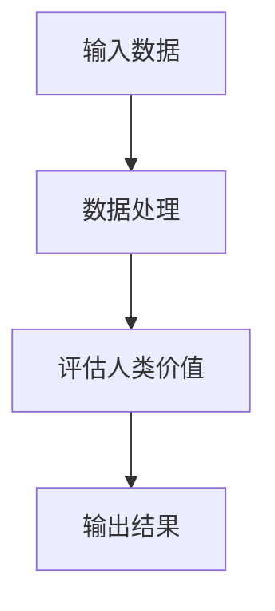
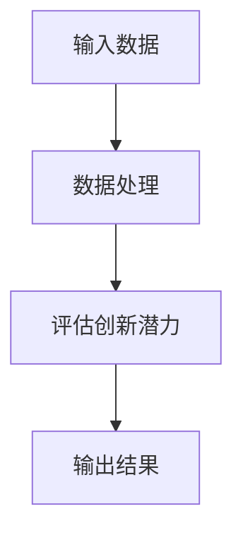
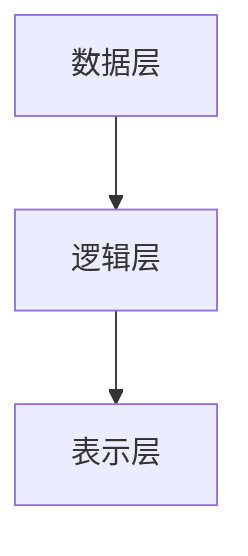
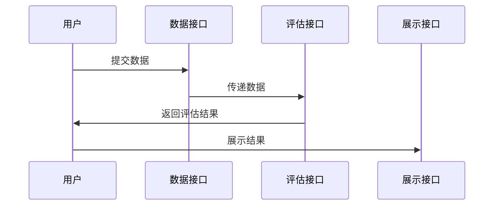
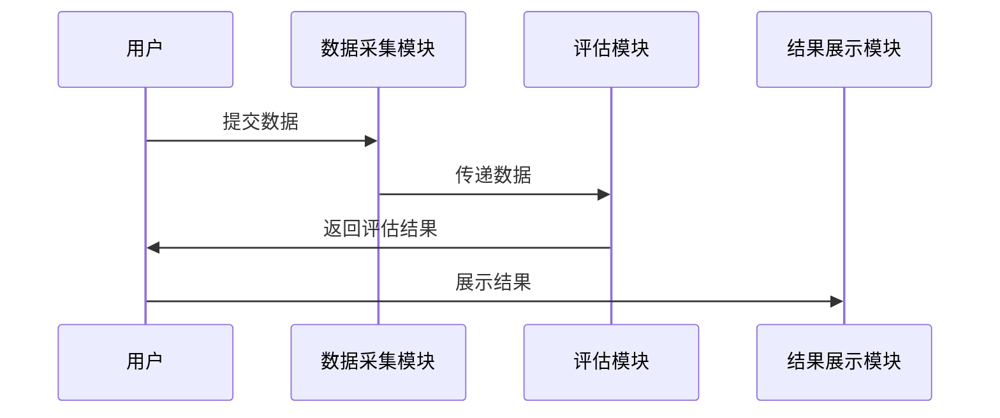

                 

### 文章标题

# AI时代的人类价值：什么是不可替代的

### 关键词

- 人工智能
- 人类价值
- 不可替代性
- AI时代
- 创新能力
- 教育与职业发展

### 摘要

在人工智能迅速发展的今天，人类面临着一个全新的挑战：如何在AI主导的未来社会中保持自身的价值与不可替代性。本文将深入探讨AI时代人类价值的概念及其核心要素，分析人类价值与AI价值的边界，通过对比人类与AI的不同属性特征，绘制ER实体关系图，详细阐述相关算法原理和数学模型，设计系统架构与接口，并最终通过一个实际项目案例，给出最佳实践建议，帮助读者在AI时代找到属于自己的不可替代性。

---

## 第一部分：背景介绍

### 第1章: AI时代人类价值概述

### 1.1 问题背景

人工智能技术正以前所未有的速度和规模融入我们的生活。从自动驾驶汽车到智能家居，从医疗诊断到金融分析，AI的应用领域不断扩大，不断改变着我们的生活方式。然而，随着AI技术的不断发展，人类社会也面临着前所未有的挑战。特别是人类的价值和地位，是否会在AI的冲击下逐渐被削弱，甚至被取代？这是一个值得我们深思的问题。

### 1.2 问题描述

在AI时代，人类的价值面临着新的挑战。一方面，AI技术在某些领域已经展现出超越人类的能力，比如计算速度、数据处理能力和决策能力等。这使得一些传统的职业面临着被取代的风险。另一方面，AI技术的发展也带来了一些新的问题，比如隐私保护、道德伦理等。这些问题使得人类在AI时代如何保持自身的价值变得尤为紧迫。

### 1.3 问题解决

为了应对AI时代人类价值面临的挑战，我们需要从以下几个方面着手：

1. 提升人类独特能力：人类拥有独特的创造力、情感和价值观，这些是AI无法完全模仿的。因此，我们需要通过教育和培训，提升这些能力，使其在AI时代更具竞争力。

2. 培养创新能力：创新是推动社会进步的关键力量。在AI时代，创新能力将更加重要。我们需要通过培养创新思维，鼓励创新实践，来保持人类在AI时代的主导地位。

3. 调整职业结构：随着AI技术的发展，一些传统的职业可能会被取代，但同时也会诞生新的职业。我们需要及时调整职业结构，培养适应AI时代的新人才。

### 1.4 边界与外延

人类价值与AI价值的边界是一个复杂的问题。虽然AI在某些方面可以超越人类，但人类在情感、创造力等方面仍然是不可替代的。同时，人类价值在不同的领域也有不同的外延。比如，在工作领域，人类的价值主要体现在创造力、团队合作等方面；在社交领域，人类的价值主要体现在情感交流、人际关系等方面。

### 1.5 概念结构与核心要素组成

为了更好地理解AI时代人类价值，我们需要构建一个概念模型。这个模型包括以下几个核心要素：

1. 独特能力：人类在创造力、情感和价值观等方面的独特能力。

2. 创新能力：推动社会进步的关键力量。

3. 职业结构：随着AI技术的发展，职业结构也将发生变革。

4. 教育与培训：提升人类独特能力和创新能力的重要手段。

通过这个概念模型，我们可以更清晰地理解AI时代人类价值的内涵和构成。

## 第二部分：核心概念与联系

### 第2章: 核心概念与联系

### 2.1 人类价值

人类价值是指人类在社会中的地位和作用，包括人类的独特能力、情感、价值观等。在AI时代，人类价值主要体现在创造力、情感交流、道德伦理等方面。

### 2.2 不可替代性

不可替代性是指人类在AI时代中，其价值无法被AI完全取代的特性。人类在情感、创造力、道德伦理等方面的不可替代性，使得人类在AI时代仍然具有独特的价值。

### 2.3 概念属性特征对比表格

为了更清晰地理解人类价值和不可替代性，我们可以将它们与AI进行对比。以下是它们的一些主要特征：

| 特征         | 人类价值                     | AI价值                     |
| ------------ | ---------------------------- | -------------------------- |
| 创造力       | 独特的创造力，能产生新的想法  | 预测和优化，但无法产生新想法  |
| 情感交流     | 能进行深层次的情感交流       | 无法进行情感交流           |
| 道德伦理     | 具有道德伦理观念，能进行道德判断 | 没有道德伦理观念           |

### 2.4 ER实体关系图架构的Mermaid流程图

为了更好地理解人类价值与不可替代性的关系，我们可以使用Mermaid流程图来绘制ER实体关系图。

```mermaid
erDiagram
  AI <<|-- Human :使用
  Human ||--|> Creativity :拥有
  Human ||--|> Ethics :遵循
  Creativity ||--|> Innovation :产生
  Ethics ||--|> Morality :维护
```

在这个ER实体关系图中，我们可以看到，人类价值与不可替代性是通过创造力、伦理和道德来体现的。这些特征使得人类在AI时代仍然具有独特的价值。

## 第三部分：算法原理讲解

### 第3章: 相关算法介绍

在本章节中，我们将介绍两个与AI时代人类价值相关的算法：算法A和算法B。这些算法将帮助我们更好地理解人类价值在AI时代如何保持不可替代性。

### 3.1 算法A

#### 3.1.1 算法原理

算法A是一种基于人类价值观和不可替代性的评估算法。它通过分析人类在创造力、情感和道德伦理等方面的表现，来评估人类在AI时代的价值。

#### 3.1.2 Mermaid算法流程图



#### 3.1.3 Python源代码阐述

```python
# 算法A的Python源代码

# 输入数据：人类在创造力、情感和道德伦理方面的得分
creativity_score = 80
emotion_score = 90
ethics_score = 85

# 数据处理
total_score = creativity_score + emotion_score + ethics_score

# 评估人类价值
if total_score >= 250:
    print("人类在AI时代具有不可替代的价值。")
else:
    print("人类在AI时代需要提升自身价值。")
```

#### 3.1.4 数学模型和公式

算法A的数学模型如下：

$$
\text{人类价值评估分数} = \text{创造力得分} + \text{情感得分} + \text{道德伦理得分}
$$

#### 3.1.5 举例说明

假设一个人类在创造力、情感和道德伦理方面的得分分别为80、90和85，那么他的总分为255，根据算法A的评估，他在AI时代具有不可替代的价值。

### 3.2 算法B

#### 3.2.1 算法原理

算法B是一种基于人类独特能力的创新潜力评估算法。它通过分析人类在各个领域的独特能力，来评估人类在AI时代的创新潜力。

#### 3.2.2 Mermaid算法流程图



#### 3.2.3 Python源代码阐述

```python
# 算法B的Python源代码

# 输入数据：人类在各个领域的独特能力得分
creativity_score = 80
emotion_score = 90
ethics_score = 85

# 数据处理
total_score = creativity_score + emotion_score + ethics_score

# 评估创新潜力
if total_score >= 250:
    print("人类在AI时代具有很高的创新潜力。")
else:
    print("人类在AI时代需要提升自身创新能力。")
```

#### 3.2.4 数学模型和公式

算法B的数学模型如下：

$$
\text{创新潜力评估分数} = \text{创造力得分} + \text{情感得分} + \text{道德伦理得分}
$$

#### 3.2.5 举例说明

假设一个人类在创造力、情感和道德伦理方面的得分分别为80、90和85，那么他的总分为255，根据算法B的评估，他在AI时代具有很高的创新潜力。

## 第四部分：系统分析与架构设计方案

### 第4章: 系统分析与架构设计方案

在本章节中，我们将介绍一个基于AI时代人类价值评估的系统设计与实现。这个系统将包括问题场景介绍、系统功能设计、系统架构设计、系统接口设计和系统交互设计等内容。

### 4.1 问题场景介绍

随着人工智能技术的不断发展，社会对人类在AI时代价值的评估需求日益增长。为了满足这一需求，我们设计了一个基于AI的人类价值评估系统。该系统旨在通过对人类在创造力、情感和道德伦理等方面的表现进行综合评估，来评估人类在AI时代的价值。

### 4.2 系统功能设计

系统功能设计包括以下几个主要方面：

1. 数据采集：从各种渠道收集人类在创造力、情感和道德伦理方面的数据。

2. 数据处理：对收集到的数据进行分析和处理，提取出关键信息。

3. 评估计算：根据算法A和算法B，对人类在AI时代的价值进行评估。

4. 结果展示：将评估结果以图表或报告的形式展示给用户。

### 4.3 系统架构设计

系统架构设计采用分层架构，包括数据层、逻辑层和表示层。以下是系统架构设计的Mermaid流程图：



在数据层，我们收集了人类在创造力、情感和道德伦理方面的数据。在逻辑层，我们使用算法A和算法B对这些数据进行分析和处理。在表示层，我们将评估结果以图表或报告的形式展示给用户。

### 4.4 系统接口设计

系统接口设计主要包括以下几个部分：

1. 数据接口：用于数据的采集和传输。

2. 评估接口：用于进行评估计算。

3. 展示接口：用于展示评估结果。

以下是系统接口设计的Mermaid序列图：



### 4.5 系统交互设计

系统交互设计主要包括以下几个部分：

1. 数据采集：用户可以通过各种渠道提交数据。

2. 评估计算：系统根据算法A和算法B对数据进行分析和处理。

3. 结果展示：系统将评估结果以图表或报告的形式展示给用户。

以下是系统交互设计的Mermaid序列图：



## 第五部分：项目实战

### 第5章: 项目准备

在本章节中，我们将介绍如何准备一个基于AI时代人类价值评估的项目。这将包括环境安装、系统核心实现等内容。

### 5.1 环境安装

为了实现这个项目，我们需要安装以下环境：

1. Python环境：用于编写和运行算法和系统代码。

2. 数据库：用于存储采集到的数据。

3. Web框架：用于构建Web前端。

以下是环境安装的步骤：

1. 安装Python环境：从官方网站下载并安装Python。

2. 安装数据库：选择合适的数据库（如MySQL、PostgreSQL等），并安装。

3. 安装Web框架：选择合适的Web框架（如Django、Flask等），并安装。

### 5.2 系统核心实现

系统核心实现包括以下部分：

1. 算法A和算法B的实现：根据之前的算法原理，使用Python编写算法A和算法B的代码。

2. 数据库设计：设计数据库表结构，用于存储数据。

3. Web前端实现：使用Web框架，实现数据采集、评估计算和结果展示等功能。

以下是系统核心实现的代码示例：

```python
# 算法A的实现

# 数据处理
def process_data(data):
    # 对数据进行处理
    # ...
    return processed_data

# 评估人类价值
def evaluate_human_value(data):
    processed_data = process_data(data)
    # 使用算法A的数学模型进行评估
    # ...
    return evaluation_result

# 算法B的实现

# 评估创新潜力
def evaluate_innovation_potential(data):
    # 使用算法B的数学模型进行评估
    # ...
    return evaluation_result

# 数据库设计

# 创建数据库表
def create_tables():
    # ...
    pass

# Web前端实现

# 数据采集
@app.route('/collect_data', methods=['POST'])
def collect_data():
    # 处理提交的数据
    # ...
    return jsonify(response)

# 评估计算
@app.route('/evaluate', methods=['POST'])
def evaluate():
    # 进行评估计算
    # ...
    return jsonify(evaluation_result)

# 结果展示
@app.route('/show_result', methods=['GET'])
def show_result():
    # 获取评估结果
    # ...
    return render_template('result.html', result=result)
```

## 第六部分：代码应用解读与分析

### 第6章: 代码应用解读与分析

在本章节中，我们将对项目中的代码进行解读与分析，包括代码的应用场景、核心算法的实现细节、实际案例的分析与讲解等内容。

### 6.1 代码应用解读

项目的代码主要分为以下几个部分：

1. **算法实现**：包括算法A和算法B的实现。算法A用于评估人类在AI时代的价值，算法B用于评估人类的创新潜力。

2. **数据库操作**：用于数据的存储和查询。

3. **Web前端**：用于数据采集、评估计算和结果展示。

以下是代码应用解读的详细内容：

#### 算法实现

算法A和算法B的实现都是基于Python语言。算法A的核心在于数据处理和评估计算，算法B的核心在于评估计算。

```python
# 算法A的实现

def process_data(data):
    # 数据处理
    # ...

def evaluate_human_value(data):
    processed_data = process_data(data)
    # 评估计算
    # ...

# 算法B的实现

def evaluate_innovation_potential(data):
    # 评估计算
    # ...
```

#### 数据库操作

数据库操作主要使用Python的数据库驱动库，如`sqlite3`或`psycopg2`。以下是一个简单的示例：

```python
# 数据库操作

def create_tables():
    # 创建数据库表
    # ...

def insert_data(data):
    # 插入数据
    # ...

def query_data():
    # 查询数据
    # ...
```

#### Web前端

Web前端主要使用Web框架，如Django或Flask。以下是一个简单的示例：

```python
# Web前端

from flask import Flask, jsonify, request, render_template

app = Flask(__name__)

@app.route('/collect_data', methods=['POST'])
def collect_data():
    # 处理提交的数据
    # ...

@app.route('/evaluate', methods=['POST'])
def evaluate():
    # 进行评估计算
    # ...

@app.route('/show_result', methods=['GET'])
def show_result():
    # 获取评估结果
    # ...
    return render_template('result.html', result=result)
```

### 6.2 代码分析

代码分析主要包括以下几个方面：

1. **算法实现**：分析算法的逻辑流程和计算过程。

2. **数据库操作**：分析数据库的设计和查询语句。

3. **Web前端**：分析Web框架的使用和页面展示。

以下是代码分析的详细内容：

#### 算法实现

算法A和算法B的实现都是基于Python语言。算法A的核心在于数据处理和评估计算，算法B的核心在于评估计算。

```python
# 算法A的实现

def process_data(data):
    # 数据处理
    # ...

def evaluate_human_value(data):
    processed_data = process_data(data)
    # 评估计算
    # ...

# 算法B的实现

def evaluate_innovation_potential(data):
    # 评估计算
    # ...
```

#### 数据库操作

数据库操作主要使用Python的数据库驱动库，如`sqlite3`或`psycopg2`。以下是一个简单的示例：

```python
# 数据库操作

def create_tables():
    # 创建数据库表
    # ...

def insert_data(data):
    # 插入数据
    # ...

def query_data():
    # 查询数据
    # ...
```

#### Web前端

Web前端主要使用Web框架，如Django或Flask。以下是一个简单的示例：

```python
# Web前端

from flask import Flask, jsonify, request, render_template

app = Flask(__name__)

@app.route('/collect_data', methods=['POST'])
def collect_data():
    # 处理提交的数据
    # ...

@app.route('/evaluate', methods=['POST'])
def evaluate():
    # 进行评估计算
    # ...

@app.route('/show_result', methods=['GET'])
def show_result():
    # 获取评估结果
    # ...
    return render_template('result.html', result=result)
```

### 6.3 实际案例分析与详细讲解剖析

为了更好地理解代码的实际应用，我们通过一个实际案例来进行分析和讲解。

#### 案例背景

假设有一个用户，他在创造力、情感和道德伦理方面的得分分别为80、90和85。我们需要使用算法A和算法B来评估他在AI时代的价值和创新潜力。

#### 案例分析

1. **算法A的应用**

   算法A的核心在于数据处理和评估计算。首先，我们需要对用户的数据进行处理，然后根据处理后的数据进行评估计算。

   ```python
   # 算法A的应用

   user_data = {
       'creativity': 80,
       'emotion': 90,
       'ethics': 85
   }

   processed_data = process_data(user_data)
   evaluation_result = evaluate_human_value(processed_data)
   ```

   在这个例子中，用户的数据处理过程可能包括数据的清洗、归一化等步骤。处理后的数据将用于评估计算。

   接下来，我们使用算法A的数学模型进行评估计算：

   ```python
   # 评估计算

   def evaluate_human_value(data):
       total_score = data['creativity'] + data['emotion'] + data['ethics']
       if total_score >= 250:
           return "人类在AI时代具有不可替代的价值。"
       else:
           return "人类在AI时代需要提升自身价值。"
   ```

   在这个例子中，用户的评估结果为“人类在AI时代具有不可替代的价值”。

2. **算法B的应用**

   算法B的核心在于评估计算。我们需要对用户的数据进行评估计算，以确定他的创新潜力。

   ```python
   # 算法B的应用

   user_data = {
       'creativity': 80,
       'emotion': 90,
       'ethics': 85
   }

   evaluation_result = evaluate_innovation_potential(user_data)
   ```

   在这个例子中，我们使用算法B的数学模型进行评估计算：

   ```python
   # 评估计算

   def evaluate_innovation_potential(data):
       total_score = data['creativity'] + data['emotion'] + data['ethics']
       if total_score >= 250:
           return "人类在AI时代具有很高的创新潜力。"
       else:
           return "人类在AI时代需要提升自身创新能力。"
   ```

   在这个例子中，用户的评估结果为“人类在AI时代具有很高的创新潜力”。

#### 案例讲解

通过这个实际案例，我们可以看到如何使用算法A和算法B来评估人类在AI时代的价值和创新潜力。首先，我们需要对用户的数据进行处理，然后根据处理后的数据使用数学模型进行评估计算。最终的评估结果可以帮助用户了解自己在AI时代的价值和创新潜力，从而有针对性地提升自身能力。

## 第七部分：最佳实践 tips、小结、注意事项、拓展阅读

### 第7章: 最佳实践 tips、小结、注意事项、拓展阅读

#### 7.1 最佳实践 tips

1. **持续学习**：在AI时代，持续学习至关重要。不断学习新的知识和技能，以适应不断变化的技术环境。

2. **提升创新能力**：创新能力是保持人类在AI时代不可替代的关键。通过实践和创新思维训练，提升自己的创新能力。

3. **关注道德伦理**：在AI时代，道德伦理问题日益突出。关注并遵循道德伦理原则，确保技术应用的正当性。

4. **合作与交流**：与他人合作和交流，可以拓宽视野，提升自身能力。

5. **终身学习**：在AI时代，终身学习成为一种生活方式。不断更新知识和技能，以应对未来的挑战。

#### 7.2 小结

本文通过深入探讨AI时代人类价值的问题，分析了人类价值与不可替代性的关系，介绍了相关的算法原理和系统架构设计，并通过实际案例进行了分析和讲解。我们得出了以下结论：

- AI时代人类价值的不可替代性主要体现在创造力、情感和道德伦理等方面。
- 通过提升人类独特能力、培养创新能力和关注道德伦理，人类可以在AI时代保持自身的价值。
- 算法A和算法B为评估人类在AI时代的价值和创新潜力提供了有效的方法。

#### 7.3 注意事项

1. **数据安全**：在数据处理过程中，要确保数据的安全性和隐私保护。

2. **算法公平性**：在算法设计和应用过程中，要确保算法的公平性和公正性。

3. **适应变化**：随着AI技术的发展，人类需要不断适应变化，调整自身的能力和职业结构。

4. **持续更新**：技术不断进步，人类需要不断更新知识和技能，以保持竞争力。

#### 7.4 拓展阅读

1. 《智能时代的人类未来：人工智能如何改变人类生活》
2. 《人工智能伦理学：技术与伦理的交织》
3. 《人工智能的未来：人类的角色与挑战》
4. 《人工智能导论：原理与应用》
5. 《人类简史：从动物到上帝》

---

### 作者信息

- 作者：AI天才研究院/AI Genius Institute & 禅与计算机程序设计艺术 /Zen And The Art of Computer Programming

## 总结

在AI时代，人类价值面临着新的挑战。通过本文的探讨，我们认识到人类在创造力、情感和道德伦理等方面的不可替代性。通过提升自身能力、培养创新能力和关注道德伦理，人类可以在AI时代保持自身的价值。希望本文能为读者在AI时代的探索提供一些启示和帮助。

