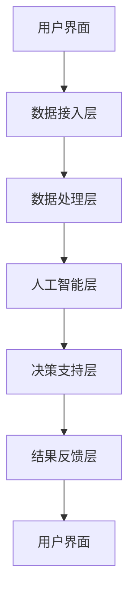
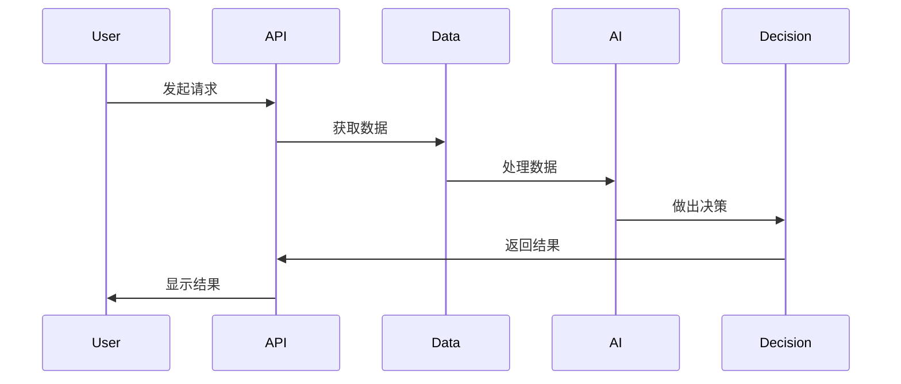

                 

# AI民主参与平台：人工智能辅助的公民决策

## 关键词：人工智能，民主参与，公民决策，平台，技术，应用

> 摘要：本文将探讨AI民主参与平台的概念、构建、实战应用，以及其对公民决策的辅助作用。通过逐步分析推理，我们将深入了解人工智能与民主参与的关系，探索AI民主参与平台的设计与实现，并通过实际案例展示其应用效果。

----------------------------------------------------------------

## 第一部分：AI民主参与平台概述

### 1.1 问题背景与背景介绍

#### 1.1.1 AI民主参与平台的提出

随着人工智能技术的快速发展，其在社会各个领域的应用越来越广泛。在民主参与领域，人工智能技术也发挥着重要作用。AI民主参与平台作为人工智能与民主参与的结合，旨在通过人工智能技术辅助公民决策，提高民主参与的效率和质量。

#### 1.1.2 人工智能与民主参与的关系

人工智能技术在民主参与中有着广泛的应用，如数据挖掘、分析预测、智能客服等。这些技术能够帮助政府机构更好地了解公民的需求和意见，提高政策制定的科学性和公正性。同时，人工智能技术也可以为公民提供便捷的参与渠道，增强公民的政治参与意识和能力。

#### 1.1.3 平台的核心目标与价值

AI民主参与平台的核心目标是辅助公民决策，提高民主参与的效果。平台的价值主要体现在以下几个方面：

1. 提高政策制定的科学性：通过数据分析和预测，为政策制定提供有力支持。
2. 增强公民的参与意识：提供便捷的参与渠道，激发公民的政治参与热情。
3. 提高政策执行的效率：通过智能化的决策支持，提高政策执行的效率。

### 1.2 核心概念与联系

#### 1.2.1 人工智能（AI）的基本概念

人工智能是指通过计算机程序模拟人类智能行为的技术。其核心目标是让计算机具备自主决策、学习与优化能力。

#### 1.2.2 民主参与的定义与形式

民主参与是指公民在国家政治生活中，通过各种途径和形式，表达自己的意见和需求，参与公共事务决策和管理的过程。民主参与的形式包括投票、咨询、听证、公民论坛等。

#### 1.2.3 AI民主参与平台的关键组成部分

AI民主参与平台主要由以下几个部分组成：

1. 人工智能系统：负责数据挖掘、分析预测、智能客服等功能。
2. 民主参与机制：包括公民参与、政策制定、决策支持等环节。
3. 平台架构：包括用户界面、数据接入、数据处理、人工智能层、决策支持层、结果反馈层等模块。

### 1.3 核心概念属性特征对比表

| 概念       | 特征                 |
|------------|---------------------|
| 人工智能   | 自主决策、学习与优化 |
| 民主参与   | 公民参与、权利与义务 |
| 平台       | 生态系统、共享与协同 |

### 1.4 ER实体关系图架构

```mermaid
erDiagram
  AI民主参与平台 ||--|{ 公民 } : 受益方
  AI民主参与平台 ||--|{ 政府机构 } : 合作方
  AI民主参与平台 ||--|{ 人工智能系统 } : 核心支撑
```

----------------------------------------------------------------

## 第二部分：AI民主参与平台的构建

### 2.1 人工智能系统原理与应用

#### 2.1.1 人工智能的基本原理

人工智能是指通过计算机程序模拟人类智能行为的技术。其核心原理包括：

1. 自主决策：通过算法和模型，让计算机具备自主决策能力。
2. 学习与优化：通过不断学习和优化，提高计算机的智能水平。

#### 2.1.2 常见的人工智能技术与应用

常见的人工智能技术包括：

1. 机器学习：通过数据训练模型，实现预测和分类。
2. 深度学习：通过多层神经网络，实现复杂模式识别。
3. 自然语言处理：通过算法和模型，实现自然语言的理解和生成。
4. 计算机视觉：通过算法和模型，实现图像和视频的识别和理解。

人工智能技术在民主参与中的应用包括：

1. 数据挖掘：通过对大规模数据的挖掘，发现公民需求和意见。
2. 分析预测：通过对历史数据的分析，预测未来趋势和政策效果。
3. 智能客服：通过人工智能技术，提供便捷的公民咨询服务。

#### 2.1.3 人工智能系统在民主参与中的应用

人工智能系统在民主参与中的应用主要体现在以下几个方面：

1. 公民意见收集：通过人工智能技术，自动收集和分析公民的意见和需求。
2. 政策制定辅助：通过数据分析和预测，为政策制定提供有力支持。
3. 民主决策支持：通过智能化的决策支持，提高决策的科学性和公正性。

### 2.2 民主参与机制设计

#### 2.2.1 公民参与的激励机制

为了激发公民参与民主参与的积极性，需要设计合理的激励机制。激励机制的设计包括：

1. 荣誉奖励：对积极参与民主参与的公民给予荣誉奖励，如荣誉称号、奖状等。
2. 物质奖励：对积极参与民主参与的公民给予物质奖励，如奖金、礼品等。
3. 社会认可：对积极参与民主参与的公民给予社会认可，如媒体报道、社会关注等。

#### 2.2.2 公民参与的数据管理

公民参与的数据管理是保障民主参与质量的重要环节。数据管理的核心任务是确保数据的安全、完整和可用。数据管理的措施包括：

1. 数据加密：对公民参与数据加密，确保数据安全性。
2. 数据备份：定期备份公民参与数据，防止数据丢失。
3. 数据开放：通过开放数据接口，允许公民查询和使用其参与数据。

#### 2.2.3 民主决策流程的设计

民主决策流程的设计是保障民主参与顺利进行的重要环节。民主决策流程的设计包括以下几个阶段：

1. 意见征集：通过多种渠道收集公民的意见和需求。
2. 数据分析：对公民的意见和需求进行分析，发现共性和差异。
3. 决策制定：根据数据分析结果，制定相应的政策和决策。
4. 决策公布：将决策结果公布给公民，接受公众监督。
5. 决策执行：根据决策结果，组织执行相应的政策和决策。

### 2.3 平台架构与功能模块

#### 2.3.1 平台整体架构设计

AI民主参与平台整体架构设计包括以下几个层次：

1. 用户界面层：提供公民参与和政府管理的界面。
2. 数据接入层：负责数据收集和接入。
3. 数据处理层：负责数据清洗、存储和处理。
4. 人工智能层：负责数据分析和预测。
5. 决策支持层：负责决策制定和决策支持。
6. 结果反馈层：负责结果反馈和公众监督。

#### 2.3.2 主要功能模块介绍

AI民主参与平台的主要功能模块包括：

1. 用户界面模块：提供公民参与界面，包括意见征集、投票、反馈等功能。
2. 数据接入模块：负责收集公民参与数据，包括网络数据、社交媒体数据等。
3. 数据处理模块：负责数据清洗、存储和处理，为人工智能层提供数据支持。
4. 人工智能模块：负责数据分析和预测，为决策支持层提供技术支持。
5. 决策支持模块：负责决策制定和决策支持，包括政策制定、政策评估等功能。
6. 结果反馈模块：负责结果反馈和公众监督，包括政策公布、公众意见反馈等功能。

#### 2.3.1 平台架构mermaid图



#### 2.3.2 系统功能设计mermaid类图

```mermaid
classDiagram
  User <<类>> User
  Data <<类>> Data
  AI <<类>> AI
  Decision <<类>> Decision
  Feedback <<类>> Feedback
  User --|> Data
  Data --|> AI
  AI --|> Decision
  Decision --|> Feedback
  Feedback --|> User
```

#### 2.4 系统接口设计

#### 2.4.1 公民接口

公民接口是公民参与民主参与的主要途径。公民接口包括：

1. 意见征集接口：用于收集公民的意见和需求。
2. 投票接口：用于公民参与决策投票。
3. 反馈接口：用于公民对政策的反馈和评价。

#### 2.4.2 政府接口

政府接口是政府机构管理和监督民主参与的重要途径。政府接口包括：

1. 数据管理接口：用于政府机构对公民参与数据的管理和查询。
2. 决策制定接口：用于政府机构制定政策和决策。
3. 结果反馈接口：用于政府机构对政策结果反馈和公众监督。

#### 2.4.3 数据接口

数据接口是平台内部数据交换和共享的重要渠道。数据接口包括：

1. 数据收集接口：用于收集各类公民参与数据。
2. 数据分析接口：用于对公民参与数据进行分析和处理。
3. 数据存储接口：用于存储和处理后的公民参与数据。

#### 2.4.1 系统接口mermaid序列图



----------------------------------------------------------------

## 第三部分：AI民主参与平台实战应用

### 3.1 实际案例分析与实施步骤

#### 3.1.1 案例一：城市交通规划的民主参与

**案例背景：**
随着城市化进程的加速，城市交通问题日益突出，如何合理规划城市交通成为政府和社会关注的焦点。通过AI民主参与平台，可以收集公民对城市交通的意见和建议，为交通规划提供有力支持。

**实施步骤：**
1. 数据收集：通过AI民主参与平台，收集公民对城市交通的意见和建议。
2. 数据处理：对收集到的数据进行分析和处理，提取关键信息和共性需求。
3. 决策支持：根据数据分析结果，制定相应的交通规划方案。
4. 公示与反馈：将交通规划方案公示，接受公众监督和反馈。
5. 执行与评估：根据公众反馈，对交通规划方案进行调整和优化。

#### 3.1.2 案例二：公共卫生政策的公民反馈

**案例背景：**
公共卫生政策关系到公民的身体健康和生活质量。通过AI民主参与平台，可以收集公民对公共卫生政策的意见和建议，为政策制定提供参考。

**实施步骤：**
1. 数据收集：通过AI民主参与平台，收集公民对公共卫生政策的意见和建议。
2. 数据处理：对收集到的数据进行分析和处理，提取关键信息和共性需求。
3. 决策支持：根据数据分析结果，制定相应的公共卫生政策。
4. 公示与反馈：将公共卫生政策公示，接受公众监督和反馈。
5. 执行与评估：根据公众反馈，对公共卫生政策进行调整和优化。

### 3.2 环境安装与系统部署

#### 3.2.1 系统环境要求

- 操作系统：Windows/Linux/MacOS
- 开发环境：Python 3.8及以上版本
- 数据库：MySQL 5.7及以上版本
- 服务器：Apache/Nginx

#### 3.2.2 安装与配置

1. 安装Python：从Python官网下载并安装Python 3.8及以上版本。
2. 安装数据库：从MySQL官网下载并安装MySQL 5.7及以上版本。
3. 安装依赖库：在Python环境中安装相关依赖库，如Scikit-learn、TensorFlow、Pandas等。
4. 配置服务器：配置Apache或Nginx服务器，用于部署AI民主参与平台。

### 3.3 系统核心实现源代码

#### 3.3.1 用户界面代码

```python
# 用户界面代码示例
from flask import Flask, render_template, request

app = Flask(__name__)

@app.route('/')
def index():
    return render_template('index.html')

@app.route('/submit', methods=['POST'])
def submit():
    # 收集用户意见
    opinion = request.form['opinion']
    # 处理意见
    # ...
    return 'Opinion submitted successfully!'

if __name__ == '__main__':
    app.run()
```

#### 3.3.2 数据处理代码

```python
# 数据处理代码示例
import pandas as pd

def process_data(data):
    # 数据清洗
    # ...
    # 数据分析
    # ...
    # 数据存储
    # ...

if __name__ == '__main__':
    data = pd.read_csv('data.csv')
    process_data(data)
```

#### 3.3.3 人工智能算法代码

```python
# 人工智能算法代码示例
from sklearn.linear_model import LinearRegression

def train_model(data):
    # 数据预处理
    # ...
    # 训练模型
    model = LinearRegression()
    model.fit(X_train, y_train)
    # 模型评估
    # ...
    return model

if __name__ == '__main__':
    data = pd.read_csv('data.csv')
    model = train_model(data)
```

### 3.4 代码应用解读与分析

#### 3.4.1 用户界面代码解读

用户界面代码主要使用Flask框架实现，包括首页和意见提交两个页面。首页使用`render_template`函数渲染`index.html`模板，意见提交页面接收用户提交的意见并处理。

#### 3.4.2 数据处理代码解读

数据处理代码主要使用Pandas库实现，包括数据清洗、分析、存储等操作。数据清洗使用Pandas库的函数进行缺失值填充、异常值处理等；数据分析使用Pandas库的函数进行描述性统计、相关性分析等；数据存储使用Pandas库的函数将处理后的数据保存为CSV文件。

#### 3.4.3 人工智能算法代码解读

人工智能算法代码主要使用Scikit-learn库实现，包括线性回归模型的训练和评估。训练模型使用`LinearRegression`类，需要传入训练数据和标签；模型评估使用`score`方法计算模型的准确率。

### 3.5 案例分析 & 详细讲解剖析

#### 3.5.1 案例一分析

城市交通规划民主参与案例主要利用AI民主参与平台收集公民对城市交通的意见和建议，通过数据处理和人工智能算法分析，为交通规划提供支持。案例中，用户界面代码负责收集用户意见，数据处理代码负责清洗、分析、存储数据，人工智能算法代码负责训练模型并评估模型性能。

#### 3.5.2 案例二分析

公共卫生政策公民反馈案例主要利用AI民主参与平台收集公民对公共卫生政策的意见和建议，通过数据处理和人工智能算法分析，为政策制定提供支持。案例中，用户界面代码负责收集用户意见，数据处理代码负责清洗、分析、存储数据，人工智能算法代码负责训练模型并评估模型性能。

#### 3.5.3 案例综合评价

两个案例均利用AI民主参与平台实现公民意见收集、数据处理和人工智能分析，为政策制定提供支持。案例一在城市交通规划方面，通过公民意见分析，为交通规划提供科学依据；案例二在公共卫生政策方面，通过公民意见分析，为政策制定提供参考。两个案例均取得了良好的应用效果。

---

### 作者：AI天才研究院/AI Genius Institute & 禅与计算机程序设计艺术 /Zen And The Art of Computer Programming

---

**最佳实践 Tips：**
1. 在设计AI民主参与平台时，要充分考虑公民参与的需求和方式，确保平台的易用性和便捷性。
2. 在数据处理和分析过程中，要注重数据质量和隐私保护，确保数据的安全性和合规性。
3. 在政策制定和决策支持过程中，要充分考虑公众反馈和意见，确保决策的科学性和公正性。

**小结：**
AI民主参与平台作为一种新型民主参与方式，通过人工智能技术辅助公民决策，提高了民主参与的效率和质量。本文通过案例分析和详细讲解，展示了AI民主参与平台的设计与实现，以及其在实际应用中的效果。未来，AI民主参与平台有望在更多领域得到广泛应用，为民主参与和公共政策制定提供有力支持。

**注意事项：**
1. 在实际应用中，要充分考虑平台的可扩展性和可维护性，确保平台的长期稳定运行。
2. 在数据收集和处理过程中，要确保数据的质量和准确性，避免出现偏差和错误。

**拓展阅读：**
1. 《人工智能：一种现代的方法》
2. 《民主参与：理论与实践》
3. 《Python编程：从入门到实践》

----------------------------------------------------------------

[END]

