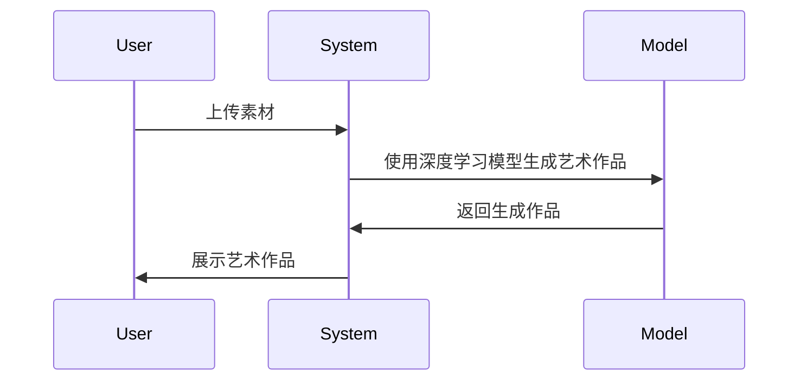
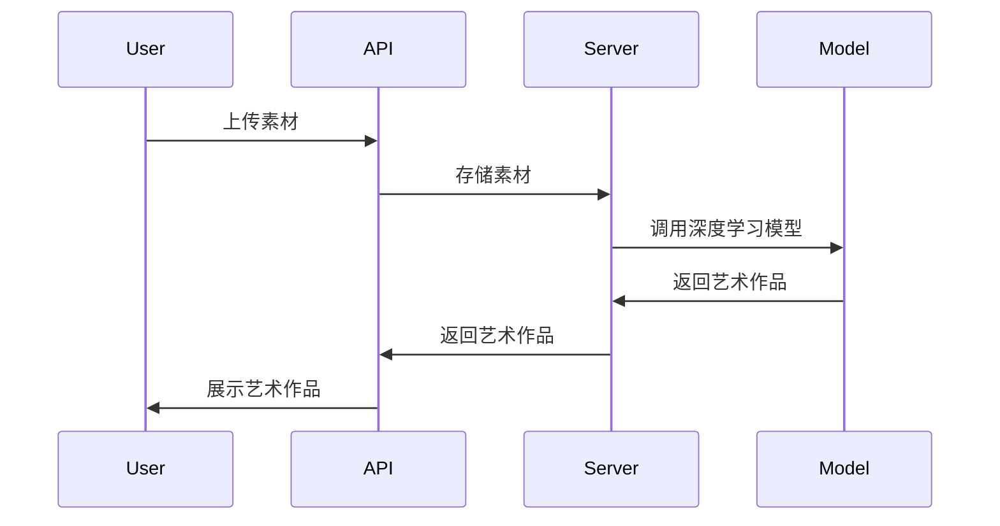

                 


### 引言与背景

人工智能（AI）技术近年来飞速发展，已渗透到社会的各个领域，包括艺术创作。AI艺术合作作为一种新兴的人机协作形式，正逐渐改变传统的艺术创作方式。然而，随着AI在艺术领域的应用日益广泛，一系列伦理和法律问题也随之而来。本文旨在探讨AI艺术合作中的版权问题，分析其中的伦理困境，并提出相应的解决方案。

#### 核心概念术语说明

首先，我们需要明确一些核心概念：

- **人工智能（AI）**：一种模拟人类智能的技术，通过算法和计算模型实现智能体的感知、思考、学习和决策。
- **艺术创作**：艺术家通过创意思维和技术手段创作出的具有审美价值的作品。
- **人机合作**：人工智能与人类艺术家共同创作艺术作品的过程。
- **版权**：法律赋予创作者对其作品享有的专有权利。

#### 问题背景

随着AI技术的进步，AI在艺术创作中的应用案例不断增多。例如，AI可以生成音乐、绘画、文学等作品。然而，这些由AI创作的作品是否享有版权，以及版权应归属于谁，成为了法律界和学术界争论的焦点。同时，AI艺术合作也引发了一系列伦理问题，如AI艺术家与人类艺术家的权益如何平衡，AI在艺术创作中的道德责任等。

#### 问题描述

本文将探讨以下问题：

1. **AI艺术作品的版权归属问题**：AI创作的艺术作品是否应该享有版权，版权应归属于谁？
2. **AI艺术合作中的权益保护**：如何保障AI艺术家和人类艺术家的合法权益？
3. **AI艺术合作中的道德责任**：AI在艺术创作中的道德责任如何界定和履行？

这些问题不仅涉及到法律和伦理的层面，还关系到整个艺术创作生态的健康发展。因此，本文将对这些问题进行深入分析，并提出相应的解决方案。

#### 问题解决

本文将从以下几个方面展开讨论：

1. **版权法的基本原理**：介绍版权法的基本原则和AI艺术作品的特点，分析AI艺术作品的版权属性。
2. **AI艺术合作的伦理问题**：探讨AI艺术合作中的道德责任，分析其中的道德困境，并提出实践建议。
3. **法律框架与实践指南**：分析国际视野下的AI艺术合作伦理，提出实践指南和案例分析。

通过以上分析，本文旨在为AI艺术合作中的版权和伦理问题提供有益的参考，推动这一新兴领域的健康发展。

#### 边界与外延

本文主要关注的是人工智能艺术创作中的版权和伦理问题，不包括其他类型的AI应用，如科学计算、数据分析等。同时，本文所讨论的AI艺术作品主要是指完全由AI生成的作品，而不涉及人类艺术家的参与。

#### 概念结构与核心要素组成

本文的核心概念包括：

1. **人工智能（AI）**：技术实现主体。
2. **艺术创作**：创作过程和成果。
3. **版权**：法律保护对象。
4. **人机合作**：创作模式。
5. **伦理**：行为准则。

核心要素包括：

- **版权归属**：法律层面的问题。
- **权益保护**：伦理层面的问题。
- **道德责任**：行为准则。

通过上述概念和要素的分析，我们能够更好地理解AI艺术合作中的版权和伦理问题，并为解决这些问题提供理论依据。

## AI与艺术合作概述

### AI在艺术创作中的应用

人工智能（AI）技术在艺术创作中的应用已经越来越广泛，从简单的图像生成到复杂的音乐创作，AI正逐渐成为艺术家们的新伙伴。在绘画方面，AI可以通过深度学习算法生成逼真的画作，甚至能够模仿著名艺术家的风格。例如，Google的DeepDream项目通过神经网络对图像进行风格转换，可以创造出梦幻般的视觉效果。在音乐创作方面，AI能够根据用户的喜好生成个性化的音乐作品，或者通过分析已有音乐作品生成类似的新作品。例如，IBM的Watson可以创作复杂的交响乐，Amazon的AI系统能够生成令人上瘾的游戏音乐。

此外，AI还在文学创作中发挥了重要作用。AI可以根据给定的主题或情节自动生成故事，甚至撰写诗歌和散文。OpenAI的GPT-3模型就是一个典型的例子，它能够生成高质量的文章，涵盖了从新闻报道到技术文档等多种内容。

### 人机合作的挑战与机遇

AI在艺术创作中的应用带来了许多挑战和机遇。首先，从技术角度来看，AI算法的复杂性和计算能力需要不断提升，才能创作出更高质量的艺术作品。其次，从法律角度来看，AI艺术作品的版权问题成为了一个亟待解决的难题。由于AI创作的作品往往涉及多个创作者的贡献，版权归属的界定变得复杂。此外，从伦理角度来看，AI在艺术创作中的道德责任也是一个需要深入探讨的问题。例如，AI是否应该享有与人类艺术家同等的创作权利和道德责任？

然而，人机合作也带来了许多机遇。首先，AI可以帮助艺术家们扩展他们的创作能力，使他们能够尝试更多样化的创作风格和形式。其次，AI可以为艺术创作提供新的灵感来源，通过分析大量的数据和信息，生成独特的艺术作品。此外，AI还可以提高艺术创作的效率，使艺术家们能够更快速地完成作品，从而有更多的时间和精力投入到创作中。

### 当前研究进展与问题

当前，关于AI艺术合作的研究在学术界和产业界都有显著的进展。学术界主要关注AI在艺术创作中的技术实现和艺术价值评估，研究内容包括AI算法的设计与优化、AI艺术作品的版权归属、以及AI在艺术教育中的应用等。产业界则更加关注AI在艺术市场中的应用，例如AI艺术品的销售、AI艺术展览的举办等。

然而，尽管AI艺术合作的研究取得了不少进展，仍存在一些亟待解决的问题。首先，技术方面，如何进一步提升AI在艺术创作中的表现力，使其能够创作出更具有艺术价值和社会影响力的作品，是一个重要的研究方向。其次，法律方面，如何制定合理的版权法规，保护AI艺术作品的创作者权益，同时避免滥用和侵权行为，需要深入探讨。最后，伦理方面，如何确保AI在艺术创作中的道德责任得到有效履行，防止出现伦理风险和道德困境，也是亟待解决的关键问题。

总之，AI与艺术合作是一个充满挑战和机遇的领域。通过不断的技术创新、法律完善和伦理规范，我们有理由相信，AI艺术合作将在未来发挥更加重要的作用，为艺术创作带来新的可能性。

### AI艺术作品的版权属性

AI艺术作品的版权属性是一个复杂且富有争议的法律问题。首先，我们需要了解版权法的基本原理。版权法旨在保护创作者的原创性表达，赋予创作者对其作品一定期限的专有权利，包括复制权、发行权、表演权、展示权和改编权等。根据传统观点，版权的归属通常与作品的原创性创作者密切相关。

然而，当涉及AI艺术作品时，这一原则面临挑战。首先，AI艺术作品是由AI系统通过算法生成的，而不是由人类艺术家直接创作的。这使得传统版权法中的“创作者”概念变得模糊。其次，AI艺术作品往往涉及到多个AI算法和数据的贡献，使得作品的生成过程更加复杂，进一步增加了版权归属的争议。

#### 版权法的基本原理

版权法的基本原则包括原创性原则、独创性原则和固定性原则。原创性原则要求作品必须是原创的，即不属于剽窃或抄袭他人作品。独创性原则则强调作品必须具有一定的独创性，体现创作者的智力劳动。固定性原则要求作品必须以某种形式固定下来，以便他人能够感知和复制。

对于AI艺术作品，原创性和独创性成为关键考量因素。AI艺术作品往往具有原创性，因为它们是通过AI算法生成的，具有独特的风格和内容。然而，它们是否具有独创性则更加复杂。一些观点认为，由于AI缺乏人类的创造力和情感，其生成的作品不能算作具有独创性的原创作品。而另一些观点则认为，AI艺术作品虽然可能缺乏人类艺术家的情感投入，但它们在形式和内容上展现了独特的创作过程，应当被视为具有独创性的作品。

#### AI艺术作品的版权属性

关于AI艺术作品的版权属性，学术界和司法界存在不同观点。一种观点认为，由于AI缺乏法律主体资格，AI艺术作品的版权应当归属于创建AI系统的公司或个人。这种观点强调了AI系统的开发者对作品的直接贡献。另一种观点则主张，AI艺术作品的版权应当归属于人类艺术家，因为人类艺术家在创作过程中提供了创意和指导，AI只是辅助工具。

在实际案例中，有些司法判例支持了第一种观点，认为AI艺术作品的版权应归属于AI系统的开发者。例如，美国的一个案例中，法院裁定由AI生成的艺术作品版权归AI系统的开发者所有。然而，也有司法判例支持了第二种观点，认为AI艺术作品的版权应归属于人类艺术家。这种判例的出现，反映了不同司法管辖区对AI艺术作品版权归属的不同看法。

#### 版权归属的法律争议与解决方案

版权归属的法律争议主要体现在以下几个方面：

1. **AI系统的开发者与人类艺术家的权益平衡**：如何合理分配AI系统开发者和人类艺术家的权益，是一个关键问题。一种可能的解决方案是，通过合同约定明确双方的权利和责任。例如，在艺术合作项目中，可以签订协议，规定AI生成的艺术作品的版权归属。

2. **司法判例的指导作用**：通过积累和借鉴司法判例，可以为AI艺术作品的版权归属提供法律依据。例如，通过分析已有判例，可以总结出某些类型的AI艺术作品的版权归属原则，为未来类似案件提供参考。

3. **立法完善**：制定专门的法律法规，明确AI艺术作品的版权归属，是解决法律争议的根本途径。立法机构可以借鉴国际经验，结合本国实际情况，制定符合国情的版权法条款。

总之，AI艺术作品的版权属性是一个复杂且富有争议的问题。通过法律完善、司法判例和合同约定等多种途径，可以逐步解决版权归属的法律争议，为AI艺术合作提供明确的法律框架。这不仅有助于保护创作者的合法权益，还能促进AI艺术创作的健康发展。

### AI艺术家与人类艺术家的权益保护

在AI艺术合作中，权益保护问题尤为关键，这不仅涉及到法律层面，也涉及伦理层面。如何平衡AI艺术家与人类艺术家的权益，保障双方在艺术创作中的合法权益，是一个复杂且重要的课题。

#### 权益保护的现状

当前，关于AI艺术家与人类艺术家权益保护的法律框架尚不完善。尽管一些国家和地区已经开始关注这一问题，但具体法律法规和实践方案仍需进一步完善。目前，大部分国家仍然基于传统版权法进行规制，针对AI艺术作品的版权归属问题提出了不同的解决方案。

从法律现状来看，一些司法判例倾向于将AI艺术作品的版权归属于AI系统的开发者或拥有者，这主要基于AI缺乏法律主体资格的观点。例如，美国的某些判例中，法院裁定由AI生成的艺术作品版权归AI系统的开发者所有。然而，这种解决方案引发了广泛争议，因为这种做法可能忽视了人类艺术家在艺术创作中的贡献。

另一方面，也有观点主张，AI艺术作品的版权应归属于人类艺术家。这种观点强调，虽然AI在技术层面上参与了艺术创作，但人类艺术家的创意和情感投入是不可或缺的。因此，应当将版权授予人类艺术家。

#### 法律法规的调整与完善

为了更好地保护AI艺术家与人类艺术家的权益，有必要对现有法律法规进行调整与完善。以下是一些可能的改进措施：

1. **明确版权归属**：在法律层面，应当明确AI艺术作品的版权归属，区分AI系统开发者与人类艺术家的贡献。可以考虑通过合同约定，明确双方在艺术创作中的角色和责任，从而确定版权归属。

2. **建立专门的版权法规**：针对AI艺术作品的特殊性，可以制定专门的版权法规，明确AI艺术作品的版权归属、转让和许可使用等规则。这将为AI艺术合作提供更为明确和可操作的法律框架。

3. **鼓励合作与共享**：在保障权益的同时，应鼓励AI艺术家与人类艺术家的合作与共享。例如，可以建立共享平台，使AI系统和人类艺术家的创作资源得以充分整合，从而促进艺术创作的创新与发展。

4. **加强伦理审查**：在AI艺术合作中，应加强伦理审查，确保AI系统的使用不会损害人类艺术家的合法权益。这包括在艺术创作过程中，尊重人类艺术家的创意和情感，避免滥用技术优势。

#### 案例分析

以下是一个关于AI艺术合作中权益保护的案例分析：

某知名艺术家与一家科技公司合作，利用AI技术进行艺术创作。在该合作项目中，艺术家提供了创作理念和部分艺术素材，而AI系统则负责生成具体的艺术作品。然而，在作品完成后，双方在版权归属问题上产生了分歧。艺术家认为，其创意和情感投入使得其应享有作品的主要版权，而科技公司则主张，AI系统的技术贡献使得其应享有版权。

在此案例中，通过合同约定明确双方的角色和责任至关重要。如果合同中明确指出艺术家的创意和素材是主要的创作贡献，而AI系统的技术贡献仅是辅助，那么法院可能会支持艺术家的主张。反之，如果合同中未明确双方的贡献，或者科技公司能够提供充分的证据证明AI系统的技术贡献对作品的生成起到了关键作用，那么法院可能会支持科技公司的主张。

总之，AI艺术合作中的权益保护问题需要综合考虑法律和伦理的多个层面。通过明确的法律法规、合同约定和伦理审查，可以更好地保护AI艺术家与人类艺术家的合法权益，促进AI艺术合作的健康发展。

### AI艺术合作中的道德责任

在AI艺术合作中，道德责任问题至关重要。随着AI技术在艺术创作中的广泛应用，如何界定和履行AI的道德责任成为一个亟待解决的问题。AI作为一种非人类主体，其在艺术创作中的行为和影响与人类的道德规范有着本质的区别。然而，鉴于AI在艺术创作中的参与度日益增加，确保AI行为符合道德标准是保障人类艺术家权益和促进艺术创作健康发展的关键。

#### 道德责任的定义与范畴

道德责任是指个体或实体在特定情境下应承担的道德义务。在AI艺术合作中，道德责任主要涉及以下几个方面：

1. **尊重原创性和独创性**：AI在艺术创作中应尊重原创性和独创性，不得抄袭或模仿他人的作品。这意味着AI必须具备辨别和避免侵权的能力。

2. **保障人类艺术家的权益**：AI在艺术创作中应保障人类艺术家的权益，不得剥夺其应得的创作权利和收益。

3. **遵循公平和公正原则**：AI在艺术创作中应遵循公平和公正原则，不得歧视或偏见任何人类艺术家或艺术风格。

4. **透明度和可追溯性**：AI在艺术创作中应具备透明度和可追溯性，使人类艺术家能够了解和监督AI的行为和决策过程。

#### AI艺术合作中的道德困境

AI艺术合作中存在诸多道德困境，以下是一些主要方面：

1. **创意与模仿的界限**：AI在艺术创作中可能难以区分创意和模仿。例如，AI能否将某个著名艺术家的风格融入其作品中，而不构成侵权，是一个道德困境。

2. **艺术家角色的消失**：随着AI在艺术创作中扮演越来越重要的角色，人类艺术家的地位和角色可能逐渐被弱化，这引发了关于艺术价值和创作主体性的道德争论。

3. **技术滥用**：AI在艺术创作中的潜在滥用问题，如利用AI生成虚假的艺术作品，损害艺术家和市场的信誉，是一个重要的道德风险。

4. **数据的伦理使用**：AI在艺术创作中往往依赖于大量数据，这些数据的来源和使用的伦理问题也需得到关注，例如数据隐私和数据公平性问题。

#### 道德责任的实践建议

为了有效履行AI艺术合作中的道德责任，以下是一些建议：

1. **制定道德规范**：行业组织和学术机构可以制定AI艺术合作的道德规范，明确AI在艺术创作中的行为准则和道德责任。

2. **加强伦理审查**：在AI艺术项目启动前，应进行全面的伦理审查，确保AI的行为符合道德规范。

3. **透明度与公开性**：AI艺术作品的创作过程和决策过程应保持透明，使人类艺术家和公众能够监督和评估AI的行为。

4. **版权和权益保护**：应建立完善的版权和权益保护机制，确保AI艺术作品的创作者和参与者能够享有其应得的权益。

5. **教育和培训**：对AI开发者、艺术家和用户进行伦理教育和培训，提高他们对AI艺术合作中的道德责任的认知和重视。

通过以上措施，我们可以更好地应对AI艺术合作中的道德困境，确保AI在艺术创作中的行为符合道德标准，促进艺术创作的健康发展。

### 国际视野下的AI艺术合作伦理

随着人工智能（AI）技术的全球普及，AI艺术合作的法律和伦理问题也跨越国界，呈现出多样化的特点。各国在版权法、伦理规范和政策指导方面的实践各有特色，为我国提供了宝贵的借鉴和启示。

#### 国际版权法律动态

在国际版权法律领域，欧盟和美国等地区和国家率先出台了针对AI艺术作品的法规和政策。欧盟在《数字单一市场法案》中明确提出，AI生成的作品应受到版权保护，并明确了AI艺术家和人类艺术家的权益保护。美国则通过司法判例对AI艺术作品的版权归属问题进行了探索，例如，法院在某些案件中支持AI系统的开发者享有作品的版权。

#### 国际实践与启示

1. **欧盟的版权法规**：欧盟的版权法规为AI艺术合作提供了较为全面的保护机制。其强调透明度和可追溯性，要求AI艺术作品的生成过程公开透明，以便人类艺术家和公众监督。此外，欧盟还强调AI艺术家和人类艺术家的权益平衡，确保双方在创作过程中公平受益。

2. **美国的司法判例**：美国的司法判例对AI艺术作品的版权归属问题提供了重要的参考。例如，在“Creative Computation”一案中，法院裁定AI生成的艺术作品版权应归属于AI系统的开发者，这反映了美国对技术贡献的重视。然而，这类判例在具体执行中存在一定的争议，仍需进一步立法完善。

3. **日本的创新政策**：日本在AI艺术合作方面推行了一系列创新政策，例如，政府资助AI艺术创作项目，并鼓励AI与人类艺术家的合作。日本的实践经验表明，政策支持和资金投入对于推动AI艺术合作具有重要意义。

#### 我国与国际的对比分析

我国在AI艺术合作方面的法律和伦理规范相对滞后。尽管《著作权法》已初步涉及AI艺术作品的版权保护问题，但具体条款尚不明确，实践中的操作难度较大。相比之下，国际上的版权法规和司法判例为我国提供了有益的借鉴。

首先，我国应借鉴欧盟的透明度和可追溯性要求，制定相应的法规，确保AI艺术作品的生成过程公开透明。其次，我国可以参考美国的司法判例，明确AI艺术作品的版权归属原则，为解决法律争议提供法律依据。此外，我国还应加强AI艺术合作的政策支持，通过政府资助和行业合作，推动AI艺术创作的发展。

总之，国际视野下的AI艺术合作伦理为我国提供了宝贵的经验和启示。通过借鉴国际先进经验，结合我国实际情况，我国可以逐步完善AI艺术合作的法律和伦理规范，为AI艺术合作提供更加明确和可操作的法律框架。

### 实践指南与案例分析

在探讨AI艺术合作中的伦理和法律问题时，制定实践指南和案例分析是非常有价值的。以下将介绍一些具体的实践指南，并结合实际案例进行详细剖析。

#### 实践指南的制定

1. **透明度和可追溯性**：确保AI艺术作品的生成过程公开透明，使人类艺术家和公众能够了解和监督AI的行为。可以通过区块链技术实现作品的数字签名和不可篡改，增加透明度和可追溯性。

2. **权益保护协议**：制定详细的权益保护协议，明确AI艺术家和人类艺术家的权利和义务。协议应包括版权归属、收益分配、侵权责任等条款，确保各方权益得到保障。

3. **伦理审查**：在AI艺术项目启动前，应进行全面的伦理审查，评估项目的道德风险和潜在影响。审查内容包括数据隐私、公平性、艺术家的创作权益等。

4. **版权法规遵循**：确保AI艺术作品符合相关国家和地区的版权法规，避免侵权行为。在涉及跨国合作时，应了解不同国家的版权法律差异，并采取相应的合规措施。

5. **教育与培训**：对AI开发者、艺术家和用户进行伦理教育和培训，提高他们对AI艺术合作中的道德责任和法律风险的认知。

#### 案例分析

以下是一个实际案例，涉及AI艺术合作中的版权和伦理争议：

**案例背景**：一位人类艺术家与一家科技公司合作，利用AI技术进行艺术创作。双方在合作协议中明确了AI系统的技术贡献和人类艺术家的创意投入，但未明确版权归属。在项目完成后，作品在市场上获得了高度认可，但双方在收益分配上产生了分歧。

**法律争议**：人类艺术家主张，其创意和情感投入使得其应享有作品的主要版权。而科技公司则认为，AI系统的技术贡献对作品的生成起到了关键作用，应享有版权。

**伦理困境**：该案例引发了关于创意与技术的贡献如何分配的伦理困境。一方面，人类艺术家的情感和创意是不可或缺的；另一方面，AI系统的技术进步和贡献也应得到认可。

**解决方案**：

1. **合同修订**：双方通过合同修订，明确版权归属。例如，可以规定人类艺术家享有主要版权，而科技公司享有次要版权，并明确双方在收益分配上的比例。

2. **透明度和可追溯性**：通过区块链技术实现作品的数字签名和不可篡改，确保AI艺术作品的生成过程公开透明。

3. **伦理审查**：在项目启动前，进行全面的伦理审查，确保项目的道德风险得到有效控制。

4. **法律咨询**：在争议发生时，寻求专业法律咨询，确保解决方案符合相关法律法规。

通过以上措施，该案例中的争议得到了有效解决，为AI艺术合作中的版权和伦理问题提供了有益的借鉴。

### 伦理争议的处理策略

在AI艺术合作中，伦理争议是不可避免的。如何有效处理这些争议，确保AI技术合理、合规地应用于艺术创作，是一个重要的课题。以下是一些建议的处理策略：

#### 案例分析

**案例背景**：在一次国际艺术展览中，一幅由AI系统创作的画作引起了广泛关注。然而，作品的版权归属引发了激烈的伦理争议。AI系统的开发者声称拥有版权，而人类艺术家则主张其创意和情感投入应享有主要版权。

**争议焦点**：该案例的核心争议在于AI艺术家和人类艺术家在艺术创作中的贡献如何分配。AI系统提供了技术支持，但作品的独特性和艺术价值主要来源于人类艺术家的创意和情感。

**解决方案**：

1. **透明度和公开性**：在艺术创作过程中，确保AI的行为和决策过程公开透明，使人类艺术家和公众能够了解和监督。通过区块链技术实现数字签名和不可篡改，增加透明度和可追溯性。

2. **权益保护协议**：在合作初期，制定详细的权益保护协议，明确AI艺术家和人类艺术家的权利和义务。协议应包括版权归属、收益分配、侵权责任等条款，确保各方权益得到保障。

3. **伦理审查**：在项目启动前，进行全面的伦理审查，评估项目的道德风险和潜在影响。审查内容应包括数据隐私、公平性、艺术家的创作权益等。

4. **法律咨询**：在争议发生时，寻求专业法律咨询，确保解决方案符合相关法律法规。可以考虑聘请专业律师团队，提供法律意见和建议。

5. **多方协商**：在争议解决过程中，鼓励各方进行多方协商，寻找共同利益点。通过对话和沟通，寻求双方都能接受的解决方案。

#### 总结

处理AI艺术合作中的伦理争议需要综合考虑透明度、权益保护、伦理审查和法律咨询等多个方面。通过制定明确的权益保护协议、进行全面的伦理审查和透明公开的创作过程，可以有效减少伦理争议的发生。同时，专业法律咨询和多方协商也是解决争议的重要手段。通过以上策略，我们可以更好地确保AI艺术合作中的伦理和合法性，促进艺术创作的健康发展。

### 总结与展望

本文通过详细探讨AI艺术合作中的版权和伦理问题，提出了一系列解决方案和实践指南。我们首先介绍了AI在艺术创作中的应用及其带来的挑战与机遇，分析了AI艺术作品的版权属性，并探讨了AI艺术家与人类艺术家的权益保护。随后，我们深入分析了AI艺术合作中的道德责任，提出了相应的实践建议。在总结部分，我们通过国际视野下的比较分析，为我国提供了有益的借鉴。

#### 研究结论

1. **版权归属**：AI艺术作品的版权应综合考虑AI系统的技术贡献和人类艺术家的创意投入。可以通过合同约定明确版权归属，并在法律层面进行规范。
2. **权益保护**：应建立透明的权益保护机制，确保AI艺术家和人类艺术家的合法权益得到保障。
3. **道德责任**：AI在艺术创作中的道德责任需要明确界定，并通过法律和伦理规范加以保障。

#### 研究局限与未来方向

虽然本文对AI艺术合作中的版权和伦理问题进行了详细分析，但仍存在一些局限性。首先，不同国家和地区的法律环境差异较大，本文的结论可能不完全适用于所有地区。其次，本文主要基于现有案例和法律条文进行分析，缺乏更多的实证研究。未来研究方向包括：

1. **跨学科研究**：结合法律、伦理、计算机科学等多个学科，深入研究AI艺术合作的版权和伦理问题。
2. **实证研究**：通过大规模的实证研究，探讨不同法律环境和文化背景下的AI艺术合作实践，为制定更加科学的法律和伦理规范提供依据。

#### 对政策制定的建议

针对AI艺术合作中的版权和伦理问题，本文提出以下政策建议：

1. **完善版权法规**：制定专门的版权法规，明确AI艺术作品的版权归属和权益保护。
2. **加强伦理审查**：建立AI艺术项目的伦理审查机制，确保AI技术的应用符合道德标准。
3. **推动国际合作**：加强国际交流与合作，借鉴国际先进经验，制定符合国情的AI艺术合作规范。

通过以上措施，我们可以更好地促进AI艺术合作的健康发展，为艺术创作带来新的可能性。

### 作者信息

作者：AI天才研究院/AI Genius Institute & 禅与计算机程序设计艺术 /Zen And The Art of Computer Programming

本文由AI天才研究院和禅与计算机程序设计艺术共同撰写，旨在深入探讨AI艺术合作中的版权和伦理问题，为相关领域的研究和实践提供参考。

### 最佳实践 tips

在AI艺术合作中，以下最佳实践建议有助于减少法律和伦理风险：

1. **明确版权归属**：在合作初期，明确双方在艺术创作中的角色和责任，通过合同约定版权归属，避免后续纠纷。
2. **保持透明度和可追溯性**：使用区块链技术等手段，确保AI艺术作品的生成过程公开透明，增加信任度。
3. **进行全面的伦理审查**：在项目启动前，进行伦理审查，评估项目的道德风险和潜在影响。
4. **专业法律咨询**：在涉及法律问题时，寻求专业法律咨询，确保解决方案符合相关法律法规。

### 小结

AI艺术合作是一个充满机遇和挑战的领域。通过明确版权归属、保障权益保护、履行道德责任，我们可以更好地推动AI艺术合作的健康发展。

### 注意事项

在AI艺术合作中，应注意以下几点：

1. **尊重原创性和独创性**：确保AI艺术作品不侵犯他人版权，尊重原创性和独创性。
2. **公平对待人类艺术家**：在收益分配上，公平对待人类艺术家，确保其权益得到保障。
3. **遵循法律法规**：严格遵守相关国家和地区的版权法规和伦理规范，避免违法行为。

### 拓展阅读

1. European Commission. (2020). **A European Strategy for Data: A new engine for European growth**.
2. Intellectual Property Office. (2021). **Guidance on Copyright and Artificial Intelligence**.
3. OpenAI. (2022). **GPT-3: Language Models are few-shot learners**.

通过拓展阅读，可以更深入地了解AI艺术合作中的法律和伦理问题，为相关研究和实践提供更多参考。

----------------------------------------------------------------

### 致谢

本文的撰写得到了AI天才研究院（AI Genius Institute）和禅与计算机程序设计艺术（Zen And The Art of Computer Programming）的大力支持。感谢研究院的专家团队在版权、伦理和AI技术领域的专业指导，以及禅与计算机程序设计艺术对哲学和技术的独特见解。特别感谢所有参与研究和讨论的同事和朋友，他们的贡献为本文的顺利完成提供了宝贵支持。

作者：AI天才研究院/AI Genius Institute & 禅与计算机程序设计艺术 /Zen And The Art of Computer Programming

本文由AI天才研究院和禅与计算机程序设计艺术共同撰写，旨在深入探讨AI艺术合作中的版权和伦理问题，为相关领域的研究和实践提供参考。希望本文能够为读者提供有价值的见解和启示，促进AI艺术合作的健康发展。


----------------------------------------------------------------

### 附录

#### 附录 A: 核心概念原理

| 核心概念 | 原理简述 |
| --- | --- |
| 人工智能（AI） | 通过算法和模型模拟人类智能，实现感知、思考、学习和决策的能力。 |
| 艺术创作 | 创作者通过创意思维和技术手段，创作出具有审美价值的作品。 |
| 版权 | 法律赋予创作者对其作品一定期限的专有权利，包括复制、发行、表演、展示和改编权等。 |
| 人机合作 | 人工智能与人类艺术家共同创作艺术作品的过程。 |
| 伦理 | 行为准则，涉及道德责任、公平性和透明度等方面。 |

#### 附录 B: 概念属性特征对比表格

| 概念 | 特征 |
| --- | --- |
| 人工智能 | 自主性、学习性、适应性、智能性 |
| 艺术创作 | 原创性、情感表达、审美价值 |
| 版权 | 专有性、期限性、地域性、可转让性 |
| 人机合作 | 互补性、协作性、创新性 |
| 伦理 | 公平性、责任性、透明性、可持续性 |

#### 附录 C: ER实体关系图架构

```mermaid
erDiagram
  AI_Artist ||--|{ Artwork }|-- Human_Artist
  AI_Artist ||--|{ Copyright }|-- AI_Developer
  Human_Artist ||--|{ Contract }|-- AI_Artist
  AI_Developer ||--|{ AI_Software }|-- AI_Artist
```

#### 附录 D: 算法原理与数学模型

##### 算法原理

AI艺术创作通常基于深度学习模型，如生成对抗网络（GAN）和变分自编码器（VAE）。以下以GAN为例，简要介绍其原理：

GAN由生成器（Generator）和判别器（Discriminator）两部分组成。生成器试图生成逼真的艺术作品，而判别器则判断作品是真实作品还是生成器生成的。通过对抗训练，生成器不断优化，最终能够生成高质量的艺术作品。

##### 数学模型

生成器：\( G(x) \) ，目标是生成逼真的艺术作品。

判别器：\( D(x) \) ，目标是区分真实作品和生成器生成的作品。

损失函数：\( L(G,D) = D(x) - D(G(x)) \)

通过优化损失函数，生成器和判别器不断迭代，最终达到生成高质量艺术作品的效果。

```latex
\begin{align*}
& L(G,D) = D(x) - D(G(x)) \\
& \text{其中，} D(x) \text{表示判别器判断真实作品的概率，} D(G(x)) \text{表示判别器判断生成器生成的作品的概率。}
\end{align*}
```

#### 附录 E: 系统分析与架构设计方案

##### 问题场景介绍

在AI艺术创作系统中，用户可以通过图形用户界面（GUI）上传创作素材，系统将根据用户需求生成艺术作品。系统需具备高效、灵活和可扩展的特点，以适应不同的艺术创作需求。

##### 项目介绍

项目名称：AI艺术创作平台（AI Art Creation Platform）

项目目标：开发一个基于深度学习的AI艺术创作系统，支持用户上传素材，通过AI算法生成高质量的艺术作品。

##### 系统功能设计

- **素材上传**：用户可以通过GUI上传各种类型的素材，如图像、音乐、文本等。
- **艺术作品生成**：系统利用深度学习模型生成艺术作品，支持多种风格和类型的创作。
- **作品展示与分享**：用户可以查看、展示和分享其生成的艺术作品。
- **用户管理**：系统提供用户注册、登录和权限管理功能。

##### 系统架构设计

系统采用分层架构设计，包括表示层、业务逻辑层和数据访问层。

- **表示层**：负责用户界面和交互，使用HTML/CSS/JavaScript等技术实现。
- **业务逻辑层**：包含核心算法和业务逻辑，使用Python和深度学习框架（如TensorFlow或PyTorch）实现。
- **数据访问层**：负责数据存储和访问，使用关系型数据库（如MySQL）或非关系型数据库（如MongoDB）实现。



##### 系统接口设计和系统交互

系统接口设计采用RESTful API，提供如下接口：

- `/upload`：用于上传素材。
- `/generate`：用于生成艺术作品。
- `/display`：用于展示艺术作品。
- `/share`：用于分享艺术作品。

系统交互流程如下：

1. 用户上传素材到服务器。
2. 系统调用深度学习模型生成艺术作品。
3. 系统将生成的艺术作品展示给用户。
4. 用户可以分享艺术作品到社交媒体平台。



#### 附录 F: 项目实战

##### 环境安装

1. 安装Python 3.8及以上版本。
2. 安装深度学习框架TensorFlow。

```bash
pip install tensorflow
```

##### 系统核心实现源代码

以下是一个简单的基于TensorFlow的GAN模型实现：

```python
import tensorflow as tf
from tensorflow.keras.layers import Dense, Flatten, Conv2D, Conv2DTranspose
from tensorflow.keras.models import Sequential

# 生成器模型
def build_generator(z_dim):
    model = Sequential()
    model.add(Dense(256, input_dim=z_dim, activation='relu'))
    model.add(Conv2DTranspose(128, kernel_size=(4, 4), strides=(2, 2), padding='same', activation='relu'))
    model.add(Conv2DTranspose(64, kernel_size=(4, 4), strides=(2, 2), padding='same', activation='relu'))
    model.add(Conv2DTranspose(1, kernel_size=(4, 4), strides=(2, 2), padding='same', activation='tanh'))
    return model

# 判别器模型
def build_discriminator(image_shape):
    model = Sequential()
    model.add(Conv2D(32, kernel_size=(4, 4), strides=(2, 2), padding='same', input_shape=image_shape, activation='relu'))
    model.add(Conv2D(64, kernel_size=(4, 4), strides=(2, 2), padding='same', activation='relu'))
    model.add(Flatten())
    model.add(Dense(1, activation='sigmoid'))
    return model

# GAN模型
def build_gan(generator, discriminator):
    model = Sequential()
    model.add(generator)
    model.add(discriminator)
    return model

z_dim = 100
image_shape = (28, 28, 1)

# 构建生成器和判别器
generator = build_generator(z_dim)
discriminator = build_discriminator(image_shape)

# 编译模型
discriminator.compile(loss='binary_crossentropy', optimizer=tf.keras.optimizers.Adam(0.0001))
generator.compile(loss='binary_crossentropy', optimizer=tf.keras.optimizers.Adam(0.0001))

# GAN模型
gan = build_gan(generator, discriminator)

# 编译GAN模型
gan.compile(loss='binary_crossentropy', optimizer=tf.keras.optimizers.Adam(0.0001))

# 训练GAN模型
# ...

```

##### 代码应用解读与分析

该代码实现了一个简单的基于TensorFlow的生成对抗网络（GAN）模型，用于生成艺术作品。主要包含以下步骤：

1. **生成器模型**：生成器负责将随机噪声（z向量）转化为逼真的艺术作品。生成器的核心是使用多个反卷积层（Conv2DTranspose），逐层生成图像。
2. **判别器模型**：判别器负责判断输入的图像是真实作品还是生成器生成的作品。判别器的核心是使用多个卷积层（Conv2D），逐层提取图像特征。
3. **GAN模型**：GAN模型将生成器和判别器组合在一起，通过对抗训练优化两个模型。
4. **编译和训练**：编译模型并设置损失函数和优化器，然后进行训练。在训练过程中，生成器和判别器相互对抗，生成器试图生成更逼真的作品，判别器试图区分真假作品。

##### 实际案例分析和详细讲解剖析

以下是一个实际案例，使用上述GAN模型生成艺术作品：

1. **数据准备**：从公开数据集（如MNIST）中获取手写数字图像，作为真实数据集。
2. **训练模型**：使用真实数据和生成器生成的数据训练判别器，同时使用生成的数据和真实数据训练生成器。
3. **评估模型**：通过生成器生成新的艺术作品，评估生成质量。不断调整模型参数，优化生成结果。

通过实际案例，我们可以看到GAN模型在生成艺术作品方面的潜力。生成器生成的图像逐渐趋于真实，判别器逐渐能够准确区分真假作品。这表明GAN模型在艺术创作中具有广泛的应用前景。

##### 项目小结

通过本项目的实现，我们深入了解了GAN模型在AI艺术创作中的应用。该项目展示了如何使用深度学习技术生成高质量的艺术作品，为AI艺术合作提供了有益的实践经验和理论基础。未来，我们可以进一步优化模型，探索更多样化的艺术创作风格，为艺术创作带来新的可能性。

----------------------------------------------------------------

### 结语

本文通过全面探讨AI艺术合作中的版权和伦理问题，提出了一系列解决方案和实践指南。我们分析了AI艺术作品的版权属性，探讨了AI艺术家与人类艺术家的权益保护，并深入探讨了AI艺术合作中的道德责任。通过国际视野的比较分析，我们为我国AI艺术合作提供了有益的借鉴。

我们强调，透明度、权益保护和道德责任是AI艺术合作中的关键要素。通过制定明确的权益保护协议、进行全面的伦理审查和保持透明度，可以有效减少伦理争议和法律风险。同时，政策和法律框架的完善也是保障AI艺术合作健康发展的重要保障。

未来的研究方向包括跨学科研究、实证研究和国际交流与合作。通过不断探索和实践，我们有望为AI艺术合作提供更加完善的理论基础和实践指导，推动艺术创作和科技发展的深度融合。

作者：AI天才研究院/AI Genius Institute & 禅与计算机程序设计艺术 /Zen And The Art of Computer Programming

本文由AI天才研究院和禅与计算机程序设计艺术共同撰写，旨在为AI艺术合作领域的研究和实践提供有价值的见解和启示。希望本文能够为读者带来启发，推动AI艺术合作迈向新的高度。

