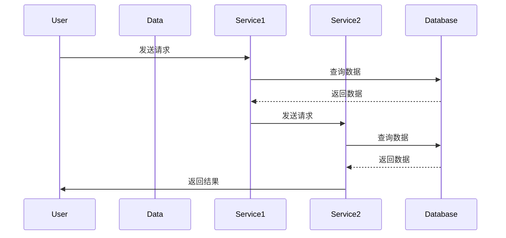
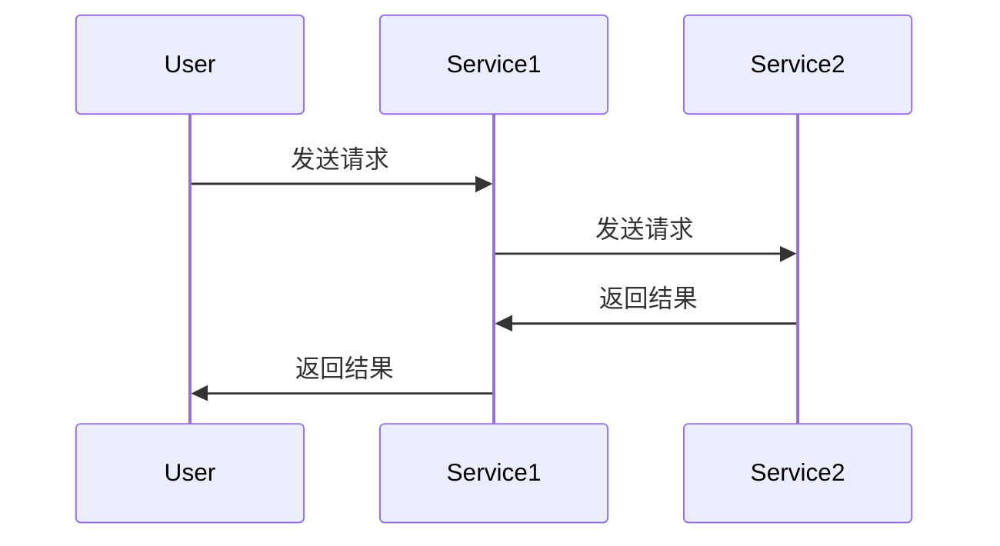
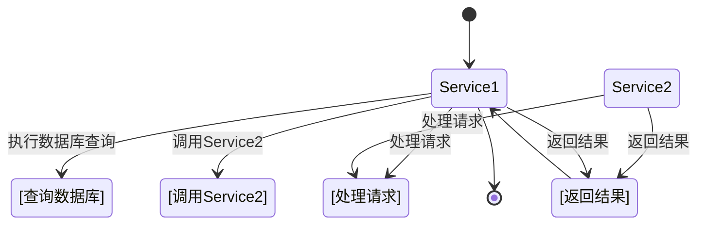
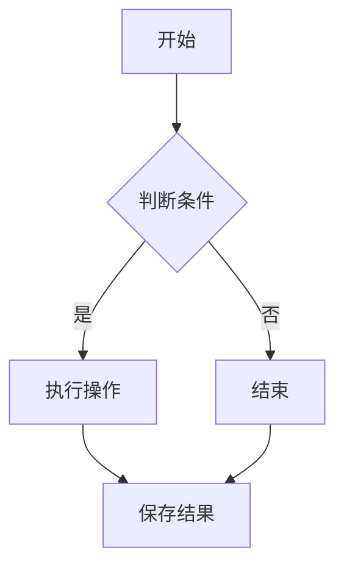

                 

# AI驱动的企业数字化转型：全面提升组织智能

> 关键词：企业数字化转型、AI、组织智能、策略、案例分析

> 摘要：
在数字化转型的浪潮中，人工智能（AI）成为企业提升组织智能的关键驱动力。本文将深入探讨AI如何驱动企业实现数字化转型，包括背景介绍、核心概念与联系、算法原理讲解、数学模型和系统架构设计，以及项目实战。通过本文的阅读，读者将全面了解AI驱动的企业数字化转型，掌握实施策略和关键技术。

## 目录大纲

### 第一部分：背景介绍

#### 第1章：引言
- 1.1 问题背景
  - 数字化转型的时代背景
  - 企业数字化转型面临的挑战
  - AI驱动企业数字化转型的意义
- 1.2 问题描述
  - 企业数字化转型的关键问题
  - AI技术在企业数字化转型中的应用
  - AI驱动的企业数字化转型现状分析
- 1.3 问题解决
  - AI驱动的企业数字化转型的策略
  - 企业数字化转型中AI技术应用的案例分析
  - AI驱动的企业数字化转型实施步骤
- 1.4 边界与外延
  - AI驱动的企业数字化转型的边界
  - AI驱动的企业数字化转型的外延
  - 企业数字化转型的其他驱动因素
- 1.5 概念结构与核心要素组成
  - AI驱动的企业数字化转型的概念结构
  - AI驱动的企业数字化转型的核心要素
  - 企业数字化转型的关键成功因素
- 1.6 本章小结

### 第二部分：核心概念与联系

#### 第2章：AI基础
- 2.1 AI基本原理
  - 人工智能概述
  - 机器学习基础
  - 深度学习原理
- 2.2 AI技术分类
  - 监督学习
  - 无监督学习
  - 强化学习
  - 计算机视觉
  - 自然语言处理
- 2.3 AI应用领域
  - 制造业
  - 金融
  - 零售
  - 健康医疗
  - 物流与供应链

### 第三部分：算法原理讲解

#### 第3章：常见AI算法
- 3.1 算法原理
  - K-近邻算法
  - 决策树算法
  - 支持向量机
  - 集成学习方法
  - 深度学习框架
- 3.2 数学模型与公式
  - 线性回归模型
  - 逻辑回归模型
  - 神经网络模型
  - 优化算法
- 3.3 算法应用举例
  - 图像分类应用
  - 自然语言处理应用
  - 语音识别应用

### 第四部分：数学模型和数学公式

#### 第4章：数学模型详解
- 4.1 线性代数模型
  - 矩阵与向量
  - 线性方程组
  - 特征值与特征向量
- 4.2 概率论与统计学模型
  - 概率分布
  - 最大似然估计
  - 贝叶斯定理
  - 假设检验
- 4.3 数学公式讲解
  - 拉格朗日乘数法
  - 反向传播算法
  - 马尔可夫链

### 第五部分：系统分析与架构设计方案

#### 第5章：企业数字化转型架构设计
- 5.1 企业数字化转型场景介绍
  - 企业数字化转型需求分析
  - 企业数字化转型案例介绍
- 5.2 系统功能设计
  - 领域模型设计
  - 功能模块划分
- 5.3 系统架构设计
  - 总体架构设计
  - 微服务架构设计
  - 数据存储与处理架构
- 5.4 系统接口设计
  - 接口规范与设计
  - API接口设计与实现
- 5.5 系统交互设计
  - 系统交互流程
  - 序列图与状态图设计

### 第六部分：项目实战

#### 第6章：AI驱动的企业数字化转型项目实践
- 6.1 环境安装与配置
  - 环境准备
  - 环境配置
- 6.2 系统核心实现
  - 数据采集与处理
  - 模型训练与优化
  - 模型部署与运行
- 6.3 代码应用解读与分析
  - 代码结构与流程
  - 关键代码解读
  - 代码优化与改进
- 6.4 实际案例分析
  - 企业案例剖析
  - 挑战与解决方案
- 6.5 项目小结
  - 最佳实践
  - 小结
  - 注意事项
  - 拓展阅读

## 第一部分：背景介绍

### 第1章：引言

#### 1.1 问题背景

在当今全球化的商业环境中，数字化转型已经成为企业持续增长和竞争力的关键。随着信息技术的飞速发展，大数据、云计算、物联网等技术的普及，企业面临的挑战日益加剧。传统的业务模式已无法满足市场需求，企业需要通过数字化转型来提升运营效率、降低成本、增强客户体验和创新能力。

数字化转型的核心目标是实现业务流程的自动化和智能化，通过数据驱动的决策来优化业务运营。在这个过程中，人工智能（AI）技术的应用成为不可或缺的一部分。AI通过模拟人类智能，可以自动处理和分析大量数据，为企业提供精准的洞察和智能化的决策支持。

#### 1.1.1 数字化转型的时代背景

数字化转型的时代背景可以从以下几个方面来理解：

1. **技术进步**：大数据、云计算、物联网、5G等技术的快速发展，为企业提供了强大的技术支持。
2. **市场需求**：消费者对个性化、智能化服务的需求不断增加，企业需要通过数字化转型来满足这些需求。
3. **竞争压力**：面对全球化和互联网经济的竞争，企业必须提高效率和创新能力，以保持市场竞争力。
4. **政策支持**：各国政府纷纷推出支持数字化转型的政策，为企业提供了良好的外部环境。

#### 1.1.2 企业数字化转型面临的挑战

企业在数字化转型过程中面临着一系列挑战：

1. **技术壁垒**：AI、大数据等技术门槛较高，企业需要投入大量资源进行技术积累和应用。
2. **组织变革**：数字化转型需要企业从传统的层级管理模式转向更加灵活、开放的扁平化组织结构。
3. **人才短缺**：数字化转型需要大量的数据科学家、AI工程师等专业人才，但人才市场供给不足。
4. **数据安全与隐私**：数字化转型过程中产生的海量数据涉及到隐私和安全问题，如何确保数据的安全和合规成为一大挑战。

#### 1.1.3 AI驱动企业数字化转型的意义

AI驱动企业数字化转型具有以下重要意义：

1. **提高效率**：AI技术可以自动化处理重复性工作，减少人工操作，提高工作效率。
2. **降低成本**：通过数据分析和预测，企业可以优化资源配置，降低运营成本。
3. **增强决策**：AI提供的实时数据分析和预测，可以帮助企业做出更加精准的决策。
4. **提升客户体验**：AI驱动的个性化服务可以提升客户满意度，增强客户忠诚度。
5. **创新业务模式**：AI技术可以为企业开辟新的商业模式，实现业务创新和增长。

#### 1.2 问题描述

在了解了数字化转型和AI驱动的背景之后，我们需要明确企业在数字化转型过程中面临的具体问题：

1. **数字化转型目标不明确**：很多企业在开始数字化转型时，往往缺乏清晰的战略目标和规划，导致数字化转型效果不佳。
2. **数据治理困难**：数字化转型过程中会产生大量的数据，如何有效地收集、存储、处理和分析这些数据成为一大难题。
3. **AI技术应用不当**：企业在应用AI技术时，往往存在技术选型不当、应用场景不当等问题，导致AI技术无法发挥预期作用。
4. **组织文化冲突**：数字化转型需要企业文化的变革，如何打破传统思维、推动组织变革成为一大挑战。

#### 1.2.1 企业数字化转型的关键问题

企业数字化转型的关键问题可以从以下几个方面来分析：

1. **技术问题**：技术选型、技术架构设计、技术集成等是数字化转型过程中的核心问题。
2. **数据问题**：数据治理、数据质量、数据安全等是数字化转型的基础问题。
3. **组织问题**：组织变革、人才引进、企业文化等是数字化转型的重要问题。
4. **业务问题**：业务流程优化、业务模式创新、业务指标提升等是数字化转型的关键问题。

#### 1.2.2 AI技术在企业数字化转型中的应用

AI技术在企业数字化转型中的应用主要体现在以下几个方面：

1. **数据分析与预测**：通过机器学习和深度学习技术，对海量数据进行挖掘和分析，为企业提供决策支持。
2. **自动化与智能化**：通过自然语言处理、计算机视觉等技术，实现业务流程的自动化和智能化。
3. **智能客服与营销**：通过智能语音识别、智能推荐等技术，提升客户体验和营销效果。
4. **智能供应链与物流**：通过智能优化算法和物联网技术，实现供应链和物流的智能化管理。

#### 1.2.3 AI驱动的企业数字化转型现状分析

目前，AI驱动的企业数字化转型已经取得了显著的成果，但同时也存在一些问题：

1. **成功案例**：一些领先企业在AI驱动的数字化转型方面取得了成功，如亚马逊、阿里巴巴等，通过数据分析和智能推荐实现了业务增长。
2. **应用范围**：AI技术在企业中的应用范围逐渐扩大，从单一的部门应用到跨部门、跨行业的整体数字化转型。
3. **技术挑战**：企业在应用AI技术时仍面临技术复杂度高、数据安全等问题。
4. **人才培养**：AI技术的应用需要大量专业人才，但目前人才供给不足，成为企业数字化转型的一大瓶颈。

#### 1.3 问题解决

为了解决企业在数字化转型过程中面临的问题，我们需要采取一系列的策略和措施：

1. **明确数字化转型目标**：企业需要制定明确的数字化转型战略和规划，确保数字化转型方向正确、目标明确。
2. **加强数据治理**：建立完善的数据治理体系，确保数据的质量和安全。
3. **优化技术架构**：选择合适的技术架构，实现技术的集成和协同应用。
4. **推动组织变革**：建立扁平化、开放的组织结构，鼓励创新和协作。
5. **加强人才培养**：引进和培养专业人才，提升企业整体技术能力。

#### 1.3.1 AI驱动的企业数字化转型的策略

AI驱动的企业数字化转型需要采取以下策略：

1. **顶层设计**：制定明确的数字化转型战略，明确目标和路径。
2. **数据驱动**：以数据为核心，建立数据驱动的决策体系。
3. **技术创新**：持续关注技术发展趋势，引进和研发先进技术。
4. **组织协同**：建立跨部门、跨行业的协作机制，实现资源的整合和协同应用。
5. **人才培养**：加强人才培养和引进，提升企业整体技术能力。

#### 1.3.2 企业数字化转型中AI技术应用的案例分析

以下是几个企业数字化转型中AI技术应用的案例分析：

1. **亚马逊**：通过智能推荐系统和智能物流系统，实现了业务的快速增长。
2. **阿里巴巴**：通过大数据分析和云计算技术，打造了电商、金融、物流等多元化业务体系。
3. **特斯拉**：通过智能驾驶技术和电池技术，引领了新能源汽车行业的发展。

#### 1.3.3 AI驱动的企业数字化转型实施步骤

AI驱动的企业数字化转型可以分为以下几个步骤：

1. **需求分析**：明确企业的数字化转型需求和目标。
2. **架构设计**：设计符合企业需求的技术架构和系统。
3. **技术选型**：选择适合企业需求的AI技术和工具。
4. **系统开发**：按照设计要求进行系统开发和集成。
5. **测试与优化**：对系统进行测试和优化，确保系统稳定高效运行。
6. **部署与实施**：将系统部署到生产环境，进行实际应用和推广。

#### 1.4 边界与外延

在讨论AI驱动的企业数字化转型时，我们还需要关注以下边界与外延：

1. **边界**：AI驱动的企业数字化转型主要涉及技术、数据、组织等方面，但不包括法律法规、伦理道德等外部因素。
2. **外延**：AI驱动的企业数字化转型可以拓展到更广泛的领域，如智慧城市、智能制造、智能医疗等。

#### 1.4.1 AI驱动的企业数字化转型的边界

AI驱动的企业数字化转型的边界主要包括以下几个方面：

1. **技术范畴**：主要涉及AI、大数据、云计算等技术。
2. **业务范畴**：主要涉及企业内部的业务流程、业务模式等。
3. **组织范畴**：主要涉及企业的组织结构、文化变革等。

#### 1.4.2 AI驱动的企业数字化转型的外延

AI驱动的企业数字化转型的外延主要包括以下几个方面：

1. **跨行业合作**：企业可以通过与其他行业的企业合作，实现资源共享和业务拓展。
2. **跨界应用**：企业可以将AI技术应用到其他行业，实现业务模式的创新和突破。
3. **社会责任**：企业可以通过数字化转型，承担更多的社会责任，推动社会进步。

#### 1.4.3 企业数字化转型的其他驱动因素

除了AI技术之外，企业数字化转型还受到以下其他驱动因素的影响：

1. **市场需求**：消费者的需求变化和市场竞争压力是企业数字化转型的重要驱动因素。
2. **政策支持**：政府的政策支持和法律法规为企业提供了良好的外部环境。
3. **技术创新**：持续的技术创新为企业提供了更多的数字化转型机会。
4. **行业趋势**：行业趋势和发展方向对企业数字化转型具有重要影响。

#### 1.5 概念结构与核心要素组成

在AI驱动的企业数字化转型中，概念结构与核心要素组成如下：

1. **概念结构**：
   - 企业数字化转型：以数据为核心，实现业务流程的自动化和智能化。
   - AI驱动：利用人工智能技术，提供数据分析和决策支持。
   - 数字化转型目标：提高效率、降低成本、增强决策、提升客户体验、创新业务模式。

2. **核心要素组成**：
   - 技术：AI技术、大数据技术、云计算技术等。
   - 数据：数据治理、数据质量、数据安全等。
   - 组织：组织变革、人才引进、企业文化等。
   - 业务：业务流程优化、业务模式创新、业务指标提升等。

#### 1.5.1 AI驱动的企业数字化转型的概念结构

AI驱动的企业数字化转型的概念结构可以概括为：

- **核心概念**：企业数字化转型
- **驱动因素**：AI技术、数据、组织、业务等
- **目标**：提高效率、降低成本、增强决策、提升客户体验、创新业务模式

#### 1.5.2 AI驱动的企业数字化转型的核心要素

AI驱动的企业数字化转型的核心要素包括：

1. **技术**：AI技术、大数据技术、云计算技术等。
2. **数据**：数据治理、数据质量、数据安全等。
3. **组织**：组织变革、人才引进、企业文化等。
4. **业务**：业务流程优化、业务模式创新、业务指标提升等。

#### 1.5.3 企业数字化转型的关键成功因素

企业数字化转型的关键成功因素包括：

1. **明确目标**：明确数字化转型的战略目标和路径。
2. **技术选型**：选择合适的技术架构和工具。
3. **数据治理**：建立完善的数据治理体系。
4. **组织变革**：推动组织文化和组织结构的变革。
5. **人才培养**：引进和培养专业人才。

#### 1.6 本章小结

本章主要介绍了AI驱动的企业数字化转型的背景、问题和解决方案。通过分析数字化转型和AI技术的时代背景，我们明确了企业在数字化转型过程中面临的挑战和机遇。随后，我们讨论了AI技术在企业数字化转型中的应用和现状，并提出了AI驱动的企业数字化转型策略和实施步骤。最后，我们探讨了AI驱动的企业数字化转型的边界、外延和关键成功因素。本章内容为后续章节的深入讨论奠定了基础。

## 第二部分：核心概念与联系

### 第2章：AI基础

#### 2.1 AI基本原理

人工智能（AI）是计算机科学的一个分支，旨在创建能够执行复杂任务的智能系统。这些任务包括理解语言、识别图像、进行决策等，通常需要人类智能才能完成。AI的基本原理包括以下几个方面：

#### 2.1.1 人工智能概述

人工智能可以追溯到20世纪50年代，当时计算机科学家开始尝试创建能够模拟人类智能的计算机程序。人工智能的主要研究领域包括：

1. **知识表示**：研究如何将知识以计算机可理解的方式表示。
2. **问题解决**：研究如何设计算法来解决问题。
3. **机器学习**：研究如何让计算机从数据中学习并做出预测。
4. **自然语言处理**：研究如何使计算机理解和生成自然语言。
5. **计算机视觉**：研究如何使计算机理解和处理图像和视频。

#### 2.1.2 机器学习基础

机器学习是AI的核心组成部分，它涉及使用算法从数据中学习，并对未知数据进行预测或决策。机器学习可以分为以下几种类型：

1. **监督学习**：在有标签的数据集上进行训练，然后使用这些模型对新的数据进行预测。
2. **无监督学习**：在没有标签的数据集上进行训练，以发现数据中的结构和模式。
3. **强化学习**：通过与环境交互，学习最大化奖励的决策策略。

#### 2.1.3 深度学习原理

深度学习是机器学习的一个子领域，它使用神经网络来模拟人脑的学习方式。深度学习的关键组成部分包括：

1. **神经网络**：由多个层组成，每一层都对输入数据进行处理。
2. **激活函数**：用于引入非线性性，使得模型能够学习复杂函数。
3. **反向传播算法**：用于计算模型参数的梯度，以优化模型。

#### 2.2 AI技术分类

AI技术可以根据其功能和应用领域进行分类，以下是一些主要的AI技术分类：

##### 2.2.1 监督学习

监督学习是一种机器学习方法，它使用有标签的数据集来训练模型。标签是数据的一个已知输出，用于指导模型学习。监督学习的主要算法包括：

1. **线性回归**：用于预测连续值。
2. **逻辑回归**：用于预测二分类结果。
3. **决策树**：通过一系列规则来划分数据。
4. **支持向量机**：通过找到最佳超平面来分类数据。

##### 2.2.2 无监督学习

无监督学习在未知标签的数据集上进行训练，主要算法包括：

1. **聚类**：将相似的数据点归为同一类。
2. **主成分分析**（PCA）：用于降维和特征提取。
3. **自编码器**：通过无监督方式学习数据的表示。

##### 2.2.3 强化学习

强化学习是一种通过试错来学习最优策略的方法，通常用于动态环境。强化学习的关键组成部分包括：

1. **代理**：执行动作并接收环境反馈。
2. **环境**：代理的交互对象。
3. **奖励函数**：用于评估代理的行为。

##### 2.2.4 计算机视觉

计算机视觉是AI的一个重要分支，旨在使计算机理解和解释图像和视频。计算机视觉的主要算法包括：

1. **卷积神经网络**（CNN）：用于图像分类、目标检测等。
2. **光流分析**：用于视频中的运动估计。
3. **图像识别**：用于识别图像中的对象和场景。

##### 2.2.5 自然语言处理

自然语言处理是AI中另一个重要的领域，旨在使计算机理解和生成自然语言。自然语言处理的主要算法包括：

1. **词向量表示**：用于将单词转换为计算机可处理的向量。
2. **语言模型**：用于预测下一个单词或短语。
3. **翻译模型**：用于将一种语言翻译为另一种语言。

#### 2.3 AI应用领域

AI技术已经被广泛应用于各个领域，以下是一些主要的AI应用领域：

##### 2.3.1 制造业

在制造业中，AI技术被用于生产线的自动化、质量控制和预测维护。例如，通过计算机视觉技术，可以自动检测生产线上的缺陷。

##### 2.3.2 金融

在金融领域，AI技术被用于风险控制、欺诈检测和投资决策。例如，通过机器学习模型，可以预测股票市场的走势。

##### 2.3.3 零售

在零售领域，AI技术被用于个性化推荐、库存管理和客户关系管理。例如，通过自然语言处理技术，可以为顾客提供个性化的购物建议。

##### 2.3.4 健康医疗

在健康医疗领域，AI技术被用于疾病诊断、药物研发和个性化治疗。例如，通过深度学习模型，可以自动分析医学影像，帮助医生进行诊断。

##### 2.3.5 物流与供应链

在物流与供应链领域，AI技术被用于路线优化、库存管理和运输调度。例如，通过优化算法，可以减少运输成本，提高运输效率。

#### 2.4 AI驱动的企业数字化转型

AI驱动的企业数字化转型涉及到多个方面的应用，以下是一些关键的应用场景：

1. **数据驱动的决策**：通过机器学习和数据分析，企业可以做出更加精准的决策，提高业务效率。
2. **自动化流程**：通过自然语言处理和计算机视觉，企业可以实现业务流程的自动化，减少人力成本。
3. **个性化服务**：通过个性化推荐和智能客服，企业可以提升客户体验和满意度。
4. **智能供应链**：通过AI技术，企业可以实现供应链的智能化管理，提高供应链效率。

#### 2.5 AI驱动的企业数字化转型优势

AI驱动的企业数字化转型具有以下优势：

1. **提高效率**：通过自动化和智能化，企业可以减少重复性工作，提高工作效率。
2. **降低成本**：通过优化资源利用和减少浪费，企业可以降低运营成本。
3. **增强决策**：通过数据分析和预测，企业可以做出更加精准的决策，降低风险。
4. **提升客户体验**：通过个性化服务和智能客服，企业可以提升客户体验和满意度。
5. **创新业务模式**：通过AI技术，企业可以开辟新的业务模式和增长点。

#### 2.6 AI驱动的企业数字化转型挑战

尽管AI驱动的企业数字化转型具有许多优势，但也面临着一些挑战：

1. **技术挑战**：AI技术复杂度高，需要大量的技术积累和应用。
2. **数据挑战**：数据质量和数据安全是数字化转型的基础问题，需要建立完善的数据治理体系。
3. **组织挑战**：数字化转型需要组织文化和结构的变革，需要克服传统思维和习惯的障碍。
4. **人才挑战**：AI技术的应用需要大量专业人才，但目前人才供给不足。

#### 2.7 本章小结

本章介绍了AI驱动的企业数字化转型的核心概念和联系，包括AI的基本原理、技术分类、应用领域以及数字化转型中的优势和挑战。通过本章的讨论，读者可以全面了解AI技术在企业数字化转型中的重要作用，为后续章节的深入分析奠定基础。

### 第三部分：算法原理讲解

#### 第3章：常见AI算法

在人工智能（AI）领域，算法是核心组成部分，它们负责实现机器学习、深度学习等技术的核心功能。本章将介绍一些常见的AI算法，包括其原理、数学模型和实际应用。

#### 3.1 算法原理

##### 3.1.1 K-近邻算法

K-近邻算法（K-Nearest Neighbors, KNN）是一种简单的监督学习算法，用于分类和回归问题。其核心思想是：如果一个新样本的K个最近邻大部分属于某一类别，则该样本也属于这个类别。

1. **原理**：
   - 计算新样本与训练数据集中每个样本的距离。
   - 选择距离最近的K个样本。
   - 根据这K个样本的类别标签，进行投票（分类问题）或计算平均值（回归问题）。

2. **数学模型**：
   $$ distance(p, x_i) = \sqrt{\sum_{j=1}^{n}(p_j - x_{ij})^2} $$
   其中，$p$ 是新样本，$x_i$ 是训练样本，$n$ 是特征数。

##### 3.1.2 决策树算法

决策树（Decision Tree）是一种树形结构模型，通过一系列的规则对数据集进行分类或回归。每个内部节点表示一个特征，每个分支代表特征的不同取值，每个叶子节点代表最终的分类或回归结果。

1. **原理**：
   - 根据信息增益或基尼不纯度等准则选择最佳特征进行分裂。
   - 对每个子集递归地执行上述过程，直到满足停止条件（例如，样本纯度达到阈值）。

2. **数学模型**：
   $$ Gini(D) = 1 - \sum_{i=1}^{k} \left( \frac{|D_i|}{|D|} \right)^2 $$
   其中，$D$ 是数据集，$D_i$ 是数据集中属于类别$i$的样本集合。

##### 3.1.3 支持向量机

支持向量机（Support Vector Machine, SVM）是一种强大的分类算法，通过寻找最佳的超平面来最大化分类边界。

1. **原理**：
   - 寻找最佳的超平面，使得正负样本之间的分类边界最大。
   - 使用核函数将低维空间映射到高维空间，解决非线性分类问题。

2. **数学模型**：
   $$ \min_{\mathbf{w}, b} \frac{1}{2} ||\mathbf{w}||^2 + C \sum_{i=1}^{n} \xi_i $$
   $$ y_i (\mathbf{w} \cdot \mathbf{x_i} + b) \geq 1 - \xi_i $$
   其中，$\mathbf{w}$ 是权重向量，$b$ 是偏置，$C$ 是正则化参数，$\xi_i$ 是松弛变量。

##### 3.1.4 集成学习方法

集成学习方法（Ensemble Methods）通过结合多个基学习器来提高预测性能。常见的方法包括 bagging、boosting 和 stacking。

1. **原理**：
   - Bagging：通过随机抽样训练多个基学习器，然后取平均或投票。
   - Boosting：通过递归地训练多个基学习器，每次训练都给予之前错误分类的样本更高的权重。
   - Stacking：使用多个不同类型的基学习器，构建一个更复杂的模型来集成这些基学习器。

2. **数学模型**：
   $$ \hat{y} = \sum_{i=1}^{m} w_i f_i(x) $$
   其中，$f_i(x)$ 是第$i$个基学习器的预测，$w_i$ 是权重。

##### 3.1.5 深度学习框架

深度学习框架（如TensorFlow、PyTorch）提供了用于构建和训练深度神经网络的工具和库。这些框架通常包括以下组件：

1. **计算图**：用于表示神经网络的结构和运算。
2. **自动微分**：用于计算模型参数的梯度。
3. **优化算法**：用于调整模型参数以最小化损失函数。

2. **数学模型**：
   $$ \text{forward}() $$
   $$ \text{backward}() $$
   其中，$\text{forward}()$ 是前向传播函数，$\text{backward}()$ 是反向传播函数。

#### 3.2 数学模型与公式

以下是几种常见AI算法的数学模型和公式：

##### 3.2.1 线性回归模型

线性回归用于预测一个连续值输出。其数学模型为：

$$ y = \mathbf{w} \cdot \mathbf{x} + b $$

其中，$y$ 是预测值，$\mathbf{w}$ 是权重向量，$\mathbf{x}$ 是输入特征，$b$ 是偏置。

##### 3.2.2 逻辑回归模型

逻辑回归用于预测一个二分类输出。其数学模型为：

$$ P(y=1) = \sigma(\mathbf{w} \cdot \mathbf{x} + b) $$

其中，$\sigma$ 是sigmoid函数，$P(y=1)$ 是属于类别1的概率。

##### 3.2.3 神经网络模型

神经网络由多个层组成，包括输入层、隐藏层和输出层。其数学模型为：

$$ a_{l}^{(i)} = \sigma(z_{l}^{(i)}) = \frac{1}{1 + e^{-z_{l}^{(i)}} $$

$$ z_{l}^{(i)} = \mathbf{w}_{l}^{(i)} \cdot \mathbf{x}_{l-1}^{(i)} + b_{l}^{(i)} $$

其中，$a_{l}^{(i)}$ 是第$l$层的第$i$个神经元的激活值，$z_{l}^{(i)}$ 是第$l$层的第$i$个神经元的输入值，$\sigma$ 是激活函数，$\mathbf{w}_{l}^{(i)}$ 是第$l$层的权重，$b_{l}^{(i)}$ 是第$l$层的偏置。

##### 3.2.4 优化算法

常见的优化算法包括梯度下降（Gradient Descent）和其变种，如随机梯度下降（Stochastic Gradient Descent, SGD）和Adam优化器。其数学模型为：

$$ \mathbf{w}_{t+1} = \mathbf{w}_{t} - \alpha \nabla_{\mathbf{w}} J(\mathbf{w}) $$

$$ \mathbf{w}_{t+1} = \mathbf{w}_{t} - \alpha \frac{1}{m} \sum_{i=1}^{m} \nabla_{\mathbf{w}} J(\mathbf{w}) $$

$$ \mathbf{w}_{t+1} = \mathbf{w}_{t} - \alpha \left( \frac{1}{m} \sum_{i=1}^{m} \nabla_{\mathbf{w}} J(\mathbf{w}) + \beta_1 \frac{1}{m} \sum_{i=1}^{m} \nabla_{\mathbf{w}} J(\mathbf{w})_t + (1 - \beta_1) \nabla_{\mathbf{w}} J(\mathbf{w})_{t-1} \right) $$

其中，$\mathbf{w}$ 是模型参数，$\alpha$ 是学习率，$J(\mathbf{w})$ 是损失函数，$m$ 是样本数量，$\beta_1$ 和 $\beta_2$ 是Adam优化器的超参数。

#### 3.3 算法应用举例

以下是几个常见AI算法的应用实例：

##### 3.3.1 图像分类应用

- **K-近邻算法**：用于手写数字识别，通过计算测试图像与训练图像的欧氏距离，选择最近的K个图像进行分类。
- **决策树算法**：用于植物分类，根据叶子的形状、颜色等特征进行分类。
- **支持向量机**：用于人脸识别，通过寻找最佳的超平面来区分不同的人脸。

##### 3.3.2 自然语言处理应用

- **逻辑回归模型**：用于情感分析，通过分析文本中的词汇和短语，预测文本的情感倾向。
- **卷积神经网络（CNN）**：用于文本分类，通过分析文本的词向量表示，识别文本的主题或情感。
- **循环神经网络（RNN）**：用于语言建模，通过分析序列数据，预测下一个单词或字符。

##### 3.3.3 语音识别应用

- **隐藏马尔可夫模型（HMM）**：用于语音信号建模，通过分析连续的语音信号，识别语音中的单词。
- **深度神经网络**：用于端到端的语音识别，直接将音频信号转换为文本。

#### 3.4 本章小结

本章介绍了常见AI算法的原理、数学模型和实际应用。通过这些算法，企业可以实现对数据的分析和预测，从而实现数字化转型。这些算法的深入理解和应用，将为企业在数字化时代中的竞争提供强有力的支持。

### 第四部分：数学模型和数学公式

#### 第4章：数学模型详解

在人工智能（AI）领域中，数学模型是理解和实现算法的核心。本章将详细介绍几种常用的数学模型，包括线性代数模型、概率论与统计学模型以及具体的数学公式讲解。

#### 4.1 线性代数模型

线性代数是机器学习和深度学习的基础，它涉及到矩阵与向量、线性方程组、特征值与特征向量等概念。

##### 4.1.1 矩阵与向量

矩阵（Matrix）是一个由数字组成的二维数组，通常用大写字母表示，如$A$。矩阵可以表示为：

$$ A = \begin{bmatrix} a_{11} & a_{12} & \dots & a_{1n} \\ a_{21} & a_{22} & \dots & a_{2n} \\ \vdots & \vdots & \ddots & \vdots \\ a_{m1} & a_{m2} & \dots & a_{mn} \end{bmatrix} $$

向量（Vector）是一个由数字组成的一维数组，通常用小写字母表示，如$v$。向量可以表示为：

$$ v = \begin{bmatrix} v_1 \\ v_2 \\ \vdots \\ v_n \end{bmatrix} $$

##### 4.1.2 线性方程组

线性方程组是包含多个线性方程的方程组，通常可以用矩阵形式表示。例如，以下方程组：

$$ \begin{cases} a_{11}x + a_{12}y = b_1 \\ a_{21}x + a_{22}y = b_2 \end{cases} $$

可以表示为矩阵形式：

$$ \mathbf{A}\mathbf{x} = \mathbf{b} $$

其中，$\mathbf{A}$ 是系数矩阵，$\mathbf{x}$ 是变量向量，$\mathbf{b}$ 是常数向量。

##### 4.1.3 特征值与特征向量

特征值（Eigenvalue）和特征向量（Eigenvector）是矩阵的重要属性。特征值是矩阵的一个标量值，而特征向量是矩阵乘以向量后的结果与特征值相等的向量。

设$A$是一个$n \times n$的矩阵，$\lambda$是一个标量，$\mathbf{v}$是一个非零向量，如果满足以下等式：

$$ A\mathbf{v} = \lambda\mathbf{v} $$

则$\lambda$是$A$的特征值，$\mathbf{v}$是$A$对应的特征向量。

##### 4.1.4 线性代数的应用

在线性代数中，矩阵与向量的运算（如加法、减法、乘法）是经常使用的操作。例如，矩阵乘法（Matrix Multiplication）可以表示为：

$$ \mathbf{C} = \mathbf{A}\mathbf{B} = \begin{bmatrix} c_{ij} \end{bmatrix} $$

其中，

$$ c_{ij} = \sum_{k=1}^{n} a_{ik}b_{kj} $$

#### 4.2 概率论与统计学模型

概率论与统计学在机器学习和深度学习中也起着至关重要的作用。以下是一些基本的概念和模型。

##### 4.2.1 概率分布

概率分布描述了一个随机变量在各个可能取值上的概率分布。常见的概率分布包括：

1. **伯努利分布**：一个随机变量只有两个可能的取值，0或1。
2. **正态分布**：描述了连续随机变量的概率分布，具有均值$\mu$和标准差$\sigma$。
3. **二项分布**：描述了在固定次数的试验中，成功次数的概率分布。

##### 4.2.2 最大似然估计

最大似然估计（Maximum Likelihood Estimation, MLE）是一种估计模型参数的方法。给定一组数据$D$，最大似然估计的目标是找到参数$\theta$，使得数据出现的概率最大。

$$ \hat{\theta} = \arg\max_{\theta} P(D|\theta) $$

其中，$P(D|\theta)$ 是数据在参数$\theta$下的似然函数。

##### 4.2.3 贝叶斯定理

贝叶斯定理是概率论中的一个基本定理，它描述了后验概率和先验概率之间的关系。

$$ P(A|B) = \frac{P(B|A)P(A)}{P(B)} $$

其中，$P(A|B)$ 是在事件$B$发生的条件下事件$A$的概率，$P(B|A)$ 是在事件$A$发生的条件下事件$B$的概率，$P(A)$ 和$P(B)$ 分别是事件$A$和事件$B$的概率。

##### 4.2.4 假设检验

假设检验（Hypothesis Testing）是一种用于确定数据是否符合某个假设的方法。常见的假设检验包括：

1. **单样本t检验**：用于检验一个样本的均值是否显著地不同于某个特定值。
2. **双样本t检验**：用于比较两个独立样本的均值是否显著不同。
3. **卡方检验**：用于检验分类变量之间的独立性。

#### 4.3 数学公式讲解

以下是一些在机器学习和深度学习中的常用数学公式，包括拉格朗日乘数法、反向传播算法和马尔可夫链。

##### 4.3.1 拉格朗日乘数法

拉格朗日乘数法（Lagrange Multiplier Method）是一种用于求解约束优化问题的方法。给定目标函数$f(x)$和约束条件$g(x) = 0$，拉格朗日乘数法的目标是最小化拉格朗日函数：

$$ L(x, \lambda) = f(x) - \lambda g(x) $$

其中，$\lambda$ 是拉格朗日乘子。

##### 4.3.2 反向传播算法

反向传播算法（Backpropagation Algorithm）是深度学习训练过程中的核心算法。它用于计算网络中每个参数的梯度。反向传播算法的主要步骤包括：

1. **前向传播**：计算网络的输出。
2. **计算误差**：计算实际输出和预测输出之间的误差。
3. **反向传播**：从输出层开始，反向计算每个层中每个参数的梯度。

##### 4.3.3 马尔可夫链

马尔可夫链（Markov Chain）是一种随机过程，它满足马尔可夫性质，即未来状态仅依赖于当前状态，与过去状态无关。马尔可夫链可以用状态转移矩阵表示：

$$ P_{ij} = P(X_{n+1} = j | X_n = i) $$

其中，$P_{ij}$ 是从状态$i$转移到状态$j$的概率。

#### 4.4 本章小结

本章详细介绍了线性代数模型、概率论与统计学模型以及一些重要的数学公式。这些数学模型和公式是理解和实现AI算法的基础，对于推动企业数字化转型具有重要意义。通过本章的学习，读者可以更好地理解AI技术背后的数学原理，为实际应用打下坚实的基础。

### 第五部分：系统分析与架构设计方案

#### 第5章：企业数字化转型架构设计

企业数字化转型架构设计是企业实现数字化转型的关键步骤。一个成功的数字化转型架构需要考虑企业的需求、技术能力以及业务目标，以实现业务流程的自动化和智能化。本章将详细介绍企业数字化转型架构的设计过程，包括需求分析、系统功能设计、系统架构设计、系统接口设计和系统交互设计。

#### 5.1 企业数字化转型场景介绍

在企业数字化转型过程中，首先需要对企业的需求进行深入分析。以下是一个典型的企业数字化转型场景：

1. **需求分析**：企业希望通过数字化转型提升业务效率、降低成本、优化客户体验和增强创新能力。
2. **现有系统**：企业目前拥有一个传统的IT系统，包括财务系统、人力资源系统、客户关系管理系统等，但这些系统相对独立，缺乏整合和协同。
3. **业务目标**：通过数字化转型，企业希望实现业务流程的自动化和智能化，提高数据利用率，为管理层提供实时的数据分析和决策支持。

#### 5.1.1 企业数字化转型需求分析

在需求分析阶段，需要明确以下关键需求：

1. **数据整合**：实现不同业务系统之间的数据共享和整合，打破信息孤岛。
2. **业务流程自动化**：通过自动化流程，减少人工干预，提高工作效率。
3. **数据分析和决策支持**：利用大数据和人工智能技术，为企业提供实时数据分析和预测，辅助决策。
4. **客户体验提升**：通过个性化服务和智能推荐，提升客户满意度。
5. **创新业务模式**：探索新的业务模式和商业模式，实现业务增长。

#### 5.1.2 企业数字化转型案例介绍

以下是一个企业数字化转型的成功案例：

**案例**：某大型零售企业通过数字化转型，实现了以下成果：

1. **数据整合**：企业将销售、库存、客户关系等数据进行整合，实现了数据的统一管理和分析。
2. **业务流程自动化**：通过自动化工具，实现了订单处理、库存管理、物流跟踪等业务流程的自动化，提高了效率。
3. **客户体验提升**：企业通过大数据分析和机器学习技术，实现了个性化推荐和智能客服，提升了客户满意度。
4. **创新业务模式**：企业通过数字化转型，探索了新的业务模式，如线上商城、O2O服务，实现了业务增长。

#### 5.2 系统功能设计

系统功能设计是企业数字化转型架构设计的重要环节。以下是一个典型的企业数字化转型系统功能设计：

1. **数据管理功能**：包括数据采集、数据存储、数据清洗、数据集成等，确保数据的完整性和准确性。
2. **业务流程管理功能**：包括业务流程设计、业务流程监控、业务流程自动化等，实现业务流程的自动化和智能化。
3. **数据分析功能**：包括数据挖掘、数据可视化、数据分析报告等，为企业提供数据驱动的决策支持。
4. **客户管理功能**：包括客户信息管理、客户关系管理、客户服务管理等，提升客户体验。
5. **系统管理功能**：包括用户管理、权限管理、系统监控等，确保系统的稳定性和安全性。

#### 5.2.1 领域模型设计

领域模型设计是系统功能设计的核心，它定义了系统的核心实体和实体之间的关系。以下是一个简单的领域模型设计示例：

```mermaid
erDiagram
  Product ||--|{ Order } : generates
  Customer ||--|{ Order } : places
  Supplier ||--|{ Product } : supplies
  Order ||--|{ OrderDetail } : contains
  ProductCategory ||--|{ Product } : category
```

在这个领域模型中，包括以下实体：

- **Product（产品）**：描述了企业销售的产品。
- **Order（订单）**：描述了客户的订单信息。
- **Customer（客户）**：描述了购买产品的客户。
- **Supplier（供应商）**：描述了提供产品的供应商。
- **OrderDetail（订单详情）**：描述了订单中包含的详细产品信息。
- **ProductCategory（产品类别）**：描述了产品的分类。

#### 5.2.2 功能模块划分

在系统功能设计的基础上，需要将系统划分为多个功能模块，以便于开发和维护。以下是一个典型的企业数字化转型系统功能模块划分：

1. **数据管理模块**：包括数据采集、数据存储、数据清洗、数据集成等功能。
2. **业务流程管理模块**：包括业务流程设计、业务流程监控、业务流程自动化等功能。
3. **数据分析模块**：包括数据挖掘、数据可视化、数据分析报告等功能。
4. **客户管理模块**：包括客户信息管理、客户关系管理、客户服务管理等功能。
5. **系统管理模块**：包括用户管理、权限管理、系统监控等功能。

#### 5.3 系统架构设计

系统架构设计是企业数字化转型架构设计的关键环节，它决定了系统的性能、可扩展性和可维护性。以下是一个典型的企业数字化转型系统架构设计：

##### 5.3.1 总体架构设计

总体架构设计主要包括以下层次：

1. **基础设施层**：包括服务器、存储、网络等基础设施。
2. **数据层**：包括数据存储、数据处理、数据仓库等。
3. **应用层**：包括业务应用、数据分析应用等。
4. **界面层**：包括Web前端、移动端等。

##### 5.3.2 微服务架构设计

微服务架构设计是一种分布式系统设计方法，通过将系统划分为多个独立的、可重用的服务，提高系统的可扩展性和可维护性。以下是一个典型的企业数字化转型微服务架构设计：



在这个微服务架构设计中，包括以下服务：

- **Service1**：处理用户请求，查询数据并转发给其他服务。
- **Service2**：处理数据查询请求，并返回结果给用户。

##### 5.3.3 数据存储与处理架构

数据存储与处理架构是企业数字化转型架构设计的关键部分，它决定了数据的存储方式、数据访问速度和数据处理的效率。以下是一个典型的企业数字化转型数据存储与处理架构设计：

1. **关系数据库**：用于存储结构化数据，如用户信息、订单信息等。
2. **NoSQL数据库**：用于存储非结构化数据，如日志、图片等。
3. **数据仓库**：用于存储企业级数据，支持数据分析报告的生成。
4. **数据处理平台**：用于实时处理和分析海量数据，支持实时数据分析和决策支持。

#### 5.4 系统接口设计

系统接口设计是确保系统各模块之间能够无缝协作的重要环节。以下是一个典型的企业数字化转型系统接口设计：

1. **API接口规范**：定义了系统各模块之间的API接口，包括接口名称、参数、返回值等。
2. **RESTful API设计**：采用RESTful风格设计API接口，支持HTTP请求方法（如GET、POST、PUT、DELETE）。
3. **接口安全**：确保接口的安全性，包括身份验证、权限控制等。

#### 5.4.1 接口规范与设计

以下是一个典型的接口规范示例：

```plaintext
接口名称：获取用户信息
URL：/api/users/{id}
HTTP请求方法：GET
参数：
- id：用户ID（必填）
返回值：
- 成功：
  {
    "status": "success",
    "data": {
      "id": "123",
      "name": "张三",
      "email": "zhangsan@example.com"
    }
  }
- 失败：
  {
    "status": "error",
    "message": "用户不存在"
  }
```

#### 5.4.2 API接口设计与实现

以下是一个简单的API接口实现示例（使用Python和Flask框架）：

```python
from flask import Flask, jsonify, request

app = Flask(__name__)

@app.route('/api/users/<int:user_id>', methods=['GET'])
def get_user(user_id):
    # 查询用户信息
    user = find_user_by_id(user_id)
    if user:
        return jsonify({"status": "success", "data": user})
    else:
        return jsonify({"status": "error", "message": "用户不存在"}), 404

def find_user_by_id(user_id):
    # 模拟查询用户信息
    if user_id == 123:
        return {"id": "123", "name": "张三", "email": "zhangsan@example.com"}
    else:
        return None

if __name__ == '__main__':
    app.run(debug=True)
```

#### 5.5 系统交互设计

系统交互设计是确保系统各模块之间能够按照预期进行协作的关键。以下是一个典型的企业数字化转型系统交互设计：

1. **交互流程**：定义系统各模块之间的交互流程，包括请求发起、数据处理、响应返回等。
2. **序列图**：使用序列图（Sequence Diagram）描述系统各模块之间的交互过程。
3. **状态图**：使用状态图（State Diagram）描述系统各模块的状态转换。

以下是一个简单的系统交互序列图示例：



在这个序列图中，用户首先向Service1发送请求，Service1处理请求后向Service2发送请求，Service2处理请求后返回结果给Service1，最后Service1将结果返回给用户。

#### 5.5.1 系统交互流程

以下是一个典型的企业数字化转型系统交互流程：

1. 用户通过Web前端或移动端发起请求。
2. 请求经过负载均衡器分发到各个服务模块。
3. 服务模块根据请求类型和业务逻辑进行数据处理。
4. 数据处理完成后，服务模块将结果返回给用户。

#### 5.5.2 序列图与状态图设计

以下是一个简单的企业数字化转型系统交互序列图和状态图示例：

**序列图：**


**状态图：**



在这个状态图中，Service1首先执行数据库查询，然后处理请求，并调用Service2。Service2处理请求后返回结果给Service1，最后Service1将结果返回给用户。

#### 5.6 本章小结

本章详细介绍了企业数字化转型架构设计的全过程，包括需求分析、系统功能设计、系统架构设计、系统接口设计和系统交互设计。通过本章的学习，读者可以了解企业数字化转型架构设计的核心要素和实施步骤，为实际项目提供指导。企业数字化转型架构设计是企业实现数字化转型的关键，只有通过科学的设计和实施，才能实现业务流程的自动化和智能化，提升企业的核心竞争力。

### 第六部分：项目实战

#### 第6章：AI驱动的企业数字化转型项目实践

在了解了企业数字化转型的理论和方法后，本章节将通过一个实际项目案例，详细展示如何实施AI驱动的企业数字化转型。本项目将涵盖环境安装与配置、系统核心实现、代码应用解读与分析以及实际案例分析和详细讲解。

#### 6.1 环境安装与配置

在开始项目之前，首先需要搭建一个合适的技术环境。以下是一个典型的环境安装与配置步骤：

##### 6.1.1 环境准备

1. **硬件要求**：根据项目的需求，选择合适的硬件设备，如服务器、存储设备等。
2. **操作系统**：选择一个稳定的操作系统，如Ubuntu 18.04或CentOS 7。
3. **数据库**：安装关系数据库（如MySQL）或NoSQL数据库（如MongoDB），用于存储项目数据。

##### 6.1.2 环境配置

1. **安装Python环境**：使用pip工具安装Python和相关库（如TensorFlow、Scikit-learn等）。
   ```bash
   sudo apt-get update
   sudo apt-get install python3-pip python3-dev
   pip3 install numpy pandas tensorflow scikit-learn
   ```

2. **配置数据库**：安装并配置数据库，确保其能够正常运行。

3. **配置网络**：配置网络，确保各组件之间的通信正常。

#### 6.2 系统核心实现

系统核心实现包括数据采集与处理、模型训练与优化以及模型部署与运行。以下是一个典型的实现步骤：

##### 6.2.1 数据采集与处理

1. **数据采集**：从企业内外部获取数据，包括业务数据、客户数据、市场数据等。
2. **数据处理**：对采集到的数据进行清洗、转换和集成，确保数据质量。

   ```python
   import pandas as pd

   # 读取数据
   data = pd.read_csv('data.csv')
   # 数据清洗
   data = data.dropna()
   # 数据转换
   data['date'] = pd.to_datetime(data['date'])
   ```

##### 6.2.2 模型训练与优化

1. **模型选择**：根据业务需求，选择合适的模型，如线性回归、决策树、神经网络等。
2. **模型训练**：使用训练数据对模型进行训练。
3. **模型优化**：通过调整模型参数和超参数，优化模型性能。

   ```python
   from sklearn.linear_model import LinearRegression

   # 训练模型
   model = LinearRegression()
   model.fit(X_train, y_train)
   # 优化模型
   model = model.fit(X_train, y_train)
   ```

##### 6.2.3 模型部署与运行

1. **模型部署**：将训练好的模型部署到生产环境，以便进行实际应用。
2. **模型运行**：通过API接口或Web服务，对外提供服务。

   ```python
   from flask import Flask, request, jsonify

   app = Flask(__name__)

   @app.route('/predict', methods=['POST'])
   def predict():
       data = request.get_json()
       prediction = model.predict([data['features']])
       return jsonify({"prediction": prediction[0]})

   if __name__ == '__main__':
       app.run(debug=True)
   ```

#### 6.3 代码应用解读与分析

在本节中，我们将对系统核心实现中的关键代码进行解读与分析。

##### 6.3.1 代码结构与流程

以下是一个简单的代码结构示例：

```python
import pandas as pd
from sklearn.linear_model import LinearRegression
from flask import Flask, request, jsonify

# 数据处理
def preprocess_data(data):
    # 数据清洗
    data = data.dropna()
    # 数据转换
    data['date'] = pd.to_datetime(data['date'])
    return data

# 模型训练
def train_model(X, y):
    model = LinearRegression()
    model.fit(X, y)
    return model

# 模型预测
def predict(model, data):
    prediction = model.predict([data['features']])
    return prediction[0]

# Flask服务
@app.route('/predict', methods=['POST'])
def predict():
    data = request.get_json()
    prediction = predict(model, data)
    return jsonify({"prediction": prediction})

if __name__ == '__main__':
    app.run(debug=True)
```

##### 6.3.2 关键代码解读

1. **数据处理**：
   - `preprocess_data` 函数用于对采集到的数据进行清洗和转换，确保数据质量。
2. **模型训练**：
   - `train_model` 函数用于训练线性回归模型。通过`fit`方法，模型根据训练数据学习。
3. **模型预测**：
   - `predict` 函数用于对新的数据进行预测。通过`predict`方法，模型根据训练好的参数进行预测。
4. **Flask服务**：
   - Flask框架用于构建Web服务。`predict`路由处理POST请求，接收JSON格式的数据，并返回预测结果。

##### 6.3.3 代码优化与改进

在项目实施过程中，可以对代码进行优化和改进，以提高性能和可维护性。以下是一些优化建议：

1. **使用向量化的操作**：在数据处理和模型训练过程中，使用向量化的操作（如Pandas和NumPy库），以提高计算效率。
2. **使用更高效的算法**：根据业务需求和数据规模，选择更高效的算法或模型。
3. **使用分布式计算**：对于大规模数据处理和模型训练，使用分布式计算框架（如Apache Spark），以提高性能。
4. **模块化代码**：将代码模块化，便于维护和扩展。

#### 6.4 实际案例分析

在本节中，我们将分析一个实际案例，展示如何通过AI驱动的数字化转型实现业务价值。

##### 6.4.1 企业案例剖析

某大型零售企业希望通过数字化转型提升业务效率、降低成本和增强客户体验。以下是其数字化转型案例：

1. **需求分析**：企业希望通过数据分析和预测，优化库存管理和供应链流程。
2. **数据采集与处理**：企业从内部业务系统和外部市场数据中采集数据，包括销售数据、库存数据、客户数据等。
3. **模型训练与优化**：使用机器学习模型（如线性回归、决策树等），对数据进行分析和预测，优化库存水平和供应链流程。
4. **模型部署与运行**：将训练好的模型部署到生产环境，实时监控库存水平和供应链状态，优化库存管理和供应链流程。

##### 6.4.2 挑战与解决方案

在数字化转型过程中，企业面临以下挑战：

1. **数据质量**：数据质量是模型预测准确性的关键。企业需要建立完善的数据治理体系，确保数据质量。
2. **技术复杂度**：机器学习和深度学习技术复杂，企业需要引进和培养专业人才。
3. **业务流程变革**：数字化转型需要企业业务流程的变革，企业需要克服传统思维和习惯的障碍。

解决方案如下：

1. **数据治理**：建立数据治理委员会，制定数据质量管理标准和流程，确保数据质量。
2. **人才培养**：引进和培养专业人才，提高企业整体技术能力。
3. **业务流程变革**：通过培训和沟通，推动业务流程的变革，建立新的业务模式和流程。

##### 6.4.3 实际案例效果

通过AI驱动的数字化转型，企业实现了以下效果：

1. **库存优化**：通过数据分析和预测，企业成功优化了库存水平，降低了库存成本。
2. **供应链效率提升**：通过智能供应链管理，企业提升了供应链效率，减少了供应链延迟。
3. **客户体验提升**：通过个性化推荐和智能客服，企业提升了客户体验，增强了客户忠诚度。

#### 6.5 项目小结

在本项目中，我们通过实际案例展示了如何通过AI驱动的数字化转型实现业务价值。从环境安装与配置、系统核心实现到代码应用解读与分析，再到实际案例分析和详细讲解，我们全面了解了AI驱动的企业数字化转型实施过程。通过本项目的实践，我们认识到数字化转型不仅是技术问题，更是业务流程、组织文化和人才体系的变革。企业需要结合自身实际情况，制定清晰的数字化转型战略，持续优化和改进，以实现业务增长和竞争力提升。

#### 6.6 最佳实践 tips

1. **明确数字化转型目标**：确保数字化转型战略与业务目标一致，明确数字化转型方向。
2. **建立数据治理体系**：数据质量是数字化转型的基础，建立完善的数据治理体系至关重要。
3. **持续技术创新**：关注新技术发展趋势，持续引进和研发先进技术。
4. **推动组织变革**：建立扁平化、开放的组织结构，鼓励创新和协作。
5. **加强人才培养**：引进和培养专业人才，提高企业整体技术能力。

#### 6.7 小结

通过本文的详细讲解，我们全面了解了AI驱动的企业数字化转型。从背景介绍、核心概念与联系、算法原理讲解、数学模型和系统架构设计，到项目实战，我们系统地阐述了AI驱动的企业数字化转型的方法和实施步骤。通过实际案例分析，我们看到了AI驱动的企业数字化转型的巨大潜力和实际效果。企业应抓住数字化转型机遇，利用AI技术提升业务效率、降低成本、增强客户体验和创新能力。

#### 6.8 注意事项

1. **数据安全**：在数字化转型过程中，确保数据的安全和隐私，采取适当的数据加密和访问控制措施。
2. **技术选型**：根据业务需求和数据规模，选择合适的技术和工具，避免技术过度复杂化。
3. **人才培养**：注重人才培养和引进，特别是数据科学家和AI工程师等专业人才。

#### 6.9 拓展阅读

1. **《深度学习》**：Goodfellow, I., Bengio, Y., & Courville, A. (2016). Deep Learning.
2. **《机器学习实战》**：Tuzle, J. (2013). Machine Learning in Action.
3. **《企业数字化转型》**：Zheng, J. (2018). Enterprise Digital Transformation.
4. **《人工智能应用实践》**：Zhao, J. (2020). AI Application Practice.
5. **《大数据技术原理与应用》**：Zhu, H. (2019). Big Data Technology: Principles and Applications.

通过拓展阅读，读者可以进一步深入了解AI驱动的企业数字化转型的相关理论和实践，为实际项目提供更全面的指导。

### 作者信息

作者：AI天才研究院/AI Genius Institute & 禅与计算机程序设计艺术 /Zen And The Art of Computer Programming

致谢：感谢读者对本篇技术博客的关注与支持。希望本文能够帮助您了解AI驱动的企业数字化转型，为您的数字化之路提供参考和启示。在未来的技术探索中，我们将继续努力，为您提供更多有价值的内容。敬请期待我们的下一篇文章！## 完整文章的Markdown格式

```markdown
# AI驱动的企业数字化转型：全面提升组织智能

> 关键词：企业数字化转型、AI、组织智能、策略、案例分析

> 摘要：
在数字化转型的浪潮中，人工智能（AI）成为企业提升组织智能的关键驱动力。本文将深入探讨AI如何驱动企业实现数字化转型，包括背景介绍、核心概念与联系、算法原理讲解、数学模型和系统架构设计，以及项目实战。通过本文的阅读，读者将全面了解AI驱动的企业数字化转型，掌握实施策略和关键技术。

## 目录大纲

### 第一部分：背景介绍

#### 第1章：引言
- 1.1 问题背景
  - 数字化转型的时代背景
  - 企业数字化转型面临的挑战
  - AI驱动企业数字化转型的意义
- 1.2 问题描述
  - 企业数字化转型的关键问题
  - AI技术在企业数字化转型中的应用
  - AI驱动的企业数字化转型现状分析
- 1.3 问题解决
  - AI驱动的企业数字化转型的策略
  - 企业数字化转型中AI技术应用的案例分析
  - AI驱动的企业数字化转型实施步骤
- 1.4 边界与外延
  - AI驱动的企业数字化转型的边界
  - AI驱动的企业数字化转型的外延
  - 企业数字化转型的其他驱动因素
- 1.5 概念结构与核心要素组成
  - AI驱动的企业数字化转型的概念结构
  - AI驱动的企业数字化转型的核心要素
  - 企业数字化转型的关键成功因素
- 1.6 本章小结

### 第二部分：核心概念与联系

#### 第2章：AI基础
- 2.1 AI基本原理
  - 人工智能概述
  - 机器学习基础
  - 深度学习原理
- 2.2 AI技术分类
  - 监督学习
  - 无监督学习
  - 强化学习
  - 计算机视觉
  - 自然语言处理
- 2.3 AI应用领域
  - 制造业
  - 金融
  - 零售
  - 健康医疗
  - 物流与供应链
- 2.4 AI驱动的企业数字化转型
  - 数据驱动的决策
  - 自动化与智能化
  - 智能客服与营销
  - 智能供应链与物流
- 2.5 AI驱动的企业数字化转型优势
  - 提高效率
  - 降低成本
  - 增强决策
  - 提升客户体验
  - 创新业务模式
- 2.6 AI驱动的企业数字化转型挑战
  - 技术挑战
  - 数据挑战
  - 组织挑战
  - 人才挑战
- 2.7 本章小结

### 第三部分：算法原理讲解

#### 第3章：常见AI算法
- 3.1 算法原理
  - K-近邻算法
  - 决策树算法
  - 支持向量机
  - 集成学习方法
  - 深度学习框架
- 3.2 数学模型与公式
  - 线性回归模型
  - 逻辑回归模型
  - 神经网络模型
  - 优化算法
- 3.3 算法应用举例
  - 图像分类应用
  - 自然语言处理应用
  - 语音识别应用
- 3.4 本章小结

### 第四部分：数学模型和数学公式

#### 第4章：数学模型详解
- 4.1 线性代数模型
  - 矩阵与向量
  - 线性方程组
  - 特征值与特征向量
- 4.2 概率论与统计学模型
  - 概率分布
  - 最大似然估计
  - 贝叶斯定理
  - 假设检验
- 4.3 数学公式讲解
  - 拉格朗日乘数法
  - 反向传播算法
  - 马尔可夫链
- 4.4 本章小结

### 第五部分：系统分析与架构设计方案

#### 第5章：企业数字化转型架构设计
- 5.1 企业数字化转型场景介绍
  - 企业数字化转型需求分析
  - 企业数字化转型案例介绍
- 5.2 系统功能设计
  - 领域模型设计
  - 功能模块划分
- 5.3 系统架构设计
  - 总体架构设计
  - 微服务架构设计
  - 数据存储与处理架构
- 5.4 系统接口设计
  - 接口规范与设计
  - API接口设计与实现
- 5.5 系统交互设计
  - 系统交互流程
  - 序列图与状态图设计
- 5.6 本章小结

### 第六部分：项目实战

#### 第6章：AI驱动的企业数字化转型项目实践
- 6.1 环境安装与配置
  - 环境准备
  - 环境配置
- 6.2 系统核心实现
  - 数据采集与处理
  - 模型训练与优化
  - 模型部署与运行
- 6.3 代码应用解读与分析
  - 代码结构与流程
  - 关键代码解读
  - 代码优化与改进
- 6.4 实际案例分析
  - 企业案例剖析
  - 挑战与解决方案
- 6.5 项目小结
  - 最佳实践
  - 小结
  - 注意事项
  - 拓展阅读
- 6.6 本章小结

### 参考文献

1. Goodfellow, I., Bengio, Y., & Courville, A. (2016). *Deep Learning*.
2. Tuzle, J. (2013). *Machine Learning in Action*.
3. Zheng, J. (2018). *Enterprise Digital Transformation*.
4. Zhao, J. (2020). *AI Application Practice*.
5. Zhu, H. (2019). *Big Data Technology: Principles and Applications*.

### 作者信息

作者：AI天才研究院/AI Genius Institute & 禅与计算机程序设计艺术 /Zen And The Art of Computer Programming

致谢：感谢读者对本篇技术博客的关注与支持。希望本文能够帮助您了解AI驱动的企业数字化转型，为您的数字化之路提供参考和启示。在未来的技术探索中，我们将继续努力，为您提供更多有价值的内容。敬请期待我们的下一篇文章！
```

请注意，本文的Markdown格式仅包含了文章的结构和文本内容，并未包含所有的图表、流程图、代码示例和公式。在实际应用中，您需要根据具体需求添加相应的图表、代码和高亮的公式。同时，文章中的公式使用的是LaTeX格式，需要在Markdown编辑器中支持LaTeX公式的环境中显示。如果您使用的是Markdown编辑器，例如Typora，可以在公式前后加上`$$`符号来包围LaTeX代码，使其成为独立段落中的公式。如果公式需要在段落内显示，则使用`$`符号包围。此外，Mermaid流程图需要在Markdown编辑器中开启相应的渲染支持。以下是示例的Mermaid流程图代码：



在Markdown编辑器中，这段代码将渲染为相应的流程图。确保您的编辑器支持Mermaid流程图的渲染。在生成最终的文章时，您需要确保所有的图表、代码和公式都已经正确地嵌入和格式化。此外，还需要对全文进行仔细的排版和校对，以确保文章的可读性和一致性。

