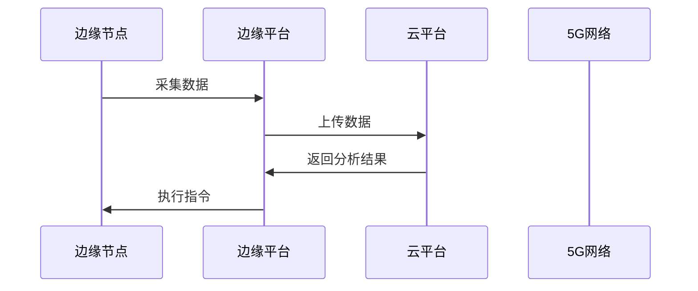
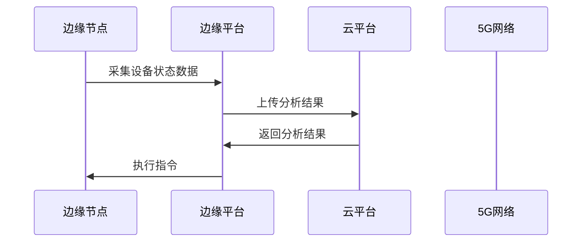

                 

### 《5G+边缘计算在智能制造中的协同：实现工业4.0》

#### 关键词：5G、边缘计算、智能制造、工业4.0、协同机制、案例分析

> 摘要：本文将深入探讨5G技术和边缘计算在智能制造领域的应用，分析其在实现工业4.0目标中的协同作用。通过逐步构建理论基础、应用分析、协同机制设计和实际案例分析，本文旨在为智能制造领域的从业人员提供宝贵的参考，推动工业4.0的实践与发展。

### 第一部分：5G与边缘计算基础理论

**第1章 5G技术概述**

#### 1.1 5G技术发展背景

在数字化的浪潮下，通信技术的革新成为推动社会进步的重要力量。5G（第五代移动通信技术）作为当前通信技术的前沿，其发展背景主要源于对更高通信速度、更低延迟和更大连接数的迫切需求。

**技术背景**

- **移动数据流量爆炸增长**：随着移动互联网的普及，移动数据流量呈指数级增长，用户对高速移动网络的需求日益增长。
- **物联网（IoT）的兴起**：万物互联的愿景需要强大的通信基础设施支持，物联网设备的连接数量迅速增加，对通信网络的容量和稳定性提出了更高的要求。
- **产业升级和数字化转型**：智能制造、智慧城市、远程医疗等新兴应用对通信技术提出了新的需求，要求通信系统能够支持大规模的数据传输和处理。

**发展历程**

- **5G标准制定**：国际电信联盟（ITU）于2015年启动了5G标准的制定工作，随后3GPP（第三代合作伙伴计划）完成了5G NR（新无线电）标准的核心部分。
- **5G试验和商用部署**：各国纷纷启动5G试验和商用部署，中国、美国、韩国等在5G领域竞争激烈，推动了5G技术的快速普及。

#### 1.2 5G关键技术

5G技术具备多项关键技术，这些技术共同构成了5G网络的高性能和高效能特性。

**关键技术**

- **高频率带宽**：5G采用了更高的频率带宽，包括Sub-6GHz频段和毫米波频段，实现了更高的数据传输速率和更大的网络容量。
- **MIMO（多输入多输出）技术**：通过使用多个天线发送和接收信号，提高了通信效率和网络容量。
- **网络切片技术**：将一个物理网络划分为多个虚拟网络，为不同应用提供定制化的网络服务。
- **边缘计算**：将计算任务分散到网络的边缘，降低了延迟，提高了响应速度。
- **SDN（软件定义网络）和NFV（网络功能虚拟化）**：通过软件定义网络和网络功能虚拟化技术，提高了网络的可编程性和灵活性。

**性能特点**

- **高速度**：5G网络的峰值下载速度可达10-20Gbps，是4G的数十倍。
- **低延迟**：5G网络的端到端延迟可低至1ms，显著提高了实时通信和物联网应用的性能。
- **大连接**：5G支持每平方米100万连接密度，能够连接海量设备，实现广泛的物联网应用。

#### 1.3 5G与智能制造的关系

5G技术为智能制造提供了强大的通信基础设施，推动了智能制造的数字化转型。

**关系分析**

- **高速数据传输**：5G技术提供了高速、稳定的通信网络，为智能制造中的大数据采集、分析和实时控制提供了有力支持。
- **低延迟通信**：5G的低延迟特性使得智能制造中的设备能够实现实时通信，提高生产线的自动化程度和响应速度。
- **网络切片和边缘计算**：5G网络切片技术能够为智能制造中的不同应用提供定制化的网络服务，边缘计算则能够实现数据处理和智能分析，优化生产流程。

**应用场景**

- **智能工厂**：5G技术支持智能工厂中的设备联网，实现全自动化生产，提高生产效率和产品质量。
- **远程监控**：5G技术使得远程监控设备能够实时传输数据，实现设备故障预测和维护。
- **协同制造**：5G技术支持远程协同制造，企业可以借助5G网络实现跨地域的协同设计和生产。

**总结**

5G技术的迅猛发展，为智能制造提供了全新的机遇。通过5G技术，智能制造可以实现更高效、更智能的生产模式，加速工业4.0的实践和推广。

---

**第2章 边缘计算基础**

#### 2.1 边缘计算的概念与架构

**概念介绍**

边缘计算是一种分布式计算架构，旨在将数据、处理能力和服务推到网络的边缘，即靠近数据源和用户的位置。通过在边缘设备上进行数据处理，边缘计算能够显著降低网络延迟，提高系统的响应速度和处理效率。

**架构分析**

边缘计算架构主要包括以下几个关键组件：

- **边缘节点**：包括传感器、路由器、网关等，负责收集、处理和存储数据。
- **边缘设备**：如智能终端、智能机器等，直接与用户交互，执行特定任务。
- **边缘平台**：提供数据处理、存储、分析和服务部署的能力，是实现边缘计算的核心。
- **云平台**：提供云计算服务，与边缘平台协同工作，共同完成复杂的数据处理任务。

**体系结构**

边缘计算体系结构通常分为三层：

1. **设备层**：包括各类边缘设备，如工业机器人、智能摄像头、传感器等。
2. **边缘层**：包括边缘节点和边缘平台，负责数据预处理、存储和初步分析。
3. **云层**：提供云服务，包括数据存储、高级分析和应用开发平台。

**特点与优势**

- **低延迟**：数据在边缘设备上直接处理，减少了传输到云端的时间，显著降低了网络延迟。
- **高效率**：边缘计算能够充分利用边缘设备的计算能力，提高数据处理效率。
- **高可靠性**：边缘计算能够实现数据的本地化存储和处理，减少了对云服务的依赖，提高了系统的可靠性。
- **灵活性强**：边缘计算能够根据不同的应用需求，灵活配置计算资源和网络带宽。

**应用领域**

- **智能制造**：边缘计算在智能制造中的应用，可以实现设备故障预测、生产优化和远程维护。
- **智慧城市**：边缘计算在智慧城市中可以用于智能交通管理、环境监测和公共安全监控。
- **远程医疗**：边缘计算可以支持远程医疗诊断、远程手术和医疗数据分析。

**总结**

边缘计算作为一种分布式计算架构，在降低网络延迟、提高数据处理效率和系统可靠性方面具有显著优势。随着5G技术的普及，边缘计算在智能制造等领域的应用前景将更加广阔。

---

**第3章 智能制造中的通信需求**

#### 3.1 智能制造通信需求分析

智能制造作为工业4.0的核心，对通信技术提出了更高的要求。首先，智能制造系统中存在大量的传感器和设备，这些设备需要实时收集生产数据，并通过网络传输到中央控制系统。其次，智能制造需要实现设备的远程监控和故障预测，这对通信网络的可靠性和低延迟提出了严格要求。此外，智能制造的数字化转型还依赖于大数据分析和云计算服务，这对通信网络的数据传输能力和安全性也提出了新的挑战。

**通信需求**

1. **高速度**：智能制造系统需要高速通信网络来支持海量数据传输，以满足实时数据处理和分析的需求。
2. **低延迟**：智能制造中的设备需要实时响应，低延迟通信对于生产线的自动化控制和故障预测至关重要。
3. **高可靠性**：智能制造系统的通信网络需要具备高可靠性，以确保数据的稳定传输和系统的连续运行。
4. **高安全性**：智能制造系统涉及大量的敏感数据，需要确保数据在传输和存储过程中的安全性。

**5G在智能制造中的应用场景**

1. **智能工厂**：5G技术支持智能工厂中的设备联网，实现全自动化生产，提高生产效率和产品质量。
2. **远程监控**：5G技术使得远程监控设备能够实时传输数据，实现设备故障预测和维护。
3. **协同制造**：5G技术支持远程协同制造，企业可以借助5G网络实现跨地域的协同设计和生产。
4. **设备互联**：5G技术可以实现智能设备之间的直接互联，实现设备间的智能协作和高效运营。

**边缘计算在智能制造通信中的角色**

边缘计算在智能制造通信中发挥着关键作用，主要表现在以下几个方面：

1. **数据处理**：边缘计算可以将数据在本地进行预处理，减少数据传输量，降低网络负载，提高数据处理的效率。
2. **实时分析**：边缘计算能够在本地实时分析数据，实现故障预测、生产优化等应用，提高生产线的自动化程度。
3. **网络安全**：边缘计算可以降低数据传输到云端的频率，减少数据泄露的风险，提高系统的安全性。
4. **网络优化**：边缘计算可以分担云计算的负载，优化网络资源的利用，提高网络的整体性能。

**总结**

5G和边缘计算在智能制造中的应用，为智能制造的数字化转型提供了强大的通信基础设施。通过满足高速度、低延迟、高可靠性和高安全性的通信需求，5G和边缘计算助力智能制造实现更高效、更智能的生产模式，推动工业4.0的全面实现。

---

**第4章 5G+边缘计算协同机制**

#### 4.1 5G+边缘计算协同架构设计

5G和边缘计算的协同机制是智能制造实现高效、实时和可靠通信的关键。为了充分发挥5G和边缘计算的优势，设计一个合理的协同架构至关重要。

**架构设计**

1. **网络层**：5G网络作为主干网，提供高速、大带宽的通信服务。边缘计算节点分布在智能制造现场，负责数据的本地处理和实时分析。
2. **数据层**：数据在边缘节点进行初步处理和过滤，然后通过5G网络传输到云端进行进一步分析和处理。
3. **应用层**：基于5G和边缘计算的协同机制，实现智能制造的各种应用，如智能监控、故障预测、生产优化等。

**架构组件**

- **边缘节点**：包括传感器、路由器和边缘计算设备，负责数据采集、预处理和实时分析。
- **边缘平台**：提供边缘计算服务，包括数据处理、存储和智能分析，支持边缘节点的协同工作。
- **云平台**：提供云计算服务，包括数据存储、高级分析和应用开发，与边缘平台协同工作。
- **5G网络**：提供高速、低延迟的通信服务，实现边缘节点与云平台的连接。

**协同机制**

1. **数据流管理**：通过合理的调度和管理，实现数据在边缘节点和云端之间的高效传输。
2. **任务分配**：根据应用需求和网络状况，动态分配计算任务到边缘节点和云端，实现负载均衡。
3. **边缘智能**：在边缘节点实现部分数据的实时分析，减少数据传输量，降低网络延迟。
4. **云端协作**：云端负责复杂的数据分析和处理，与边缘节点协同工作，实现更智能的生产管理。

**优化策略**

1. **边缘缓存**：在边缘节点部署缓存机制，减少数据传输量，提高数据访问速度。
2. **数据压缩**：采用高效的数据压缩算法，降低数据传输带宽需求。
3. **智能路由**：根据网络状况和任务需求，动态选择最优的数据传输路径。
4. **边缘计算优化**：优化边缘节点的计算资源分配，提高数据处理效率。

**总结**

5G+边缘计算协同机制的设计需要综合考虑网络层、数据层和应用层的架构组件，以及数据流管理、任务分配、边缘智能和云端协作等方面的协同机制。通过合理的架构设计和优化策略，实现5G和边缘计算的协同工作，为智能制造提供高效、实时和可靠的通信服务。

---

**第4章 5G+边缘计算协同机制**

#### 4.2 协同机制的实现与优化

在实现5G+边缘计算的协同机制时，需要解决多个关键问题，包括网络架构的搭建、协议的选择、资源管理以及数据流优化。以下将逐步分析这些问题的解决方案，并探讨实现和优化的策略。

**网络架构的搭建**

1. **边缘节点部署**：首先，需要合理规划边缘节点的部署位置，确保覆盖生产现场的关键区域。边缘节点应靠近数据源，以降低数据传输距离，减少网络延迟。
2. **5G网络接入**：边缘节点通过5G网络接入主干网，实现高速、稳定的通信连接。考虑到5G网络的建设成本，初期可以采用5G基站结合LTE网络的方式，逐步过渡到全5G网络。
3. **网络冗余设计**：为了提高网络的可靠性，应设计网络冗余机制，包括多路径传输、备份链路和容错机制。在网络故障时，能够自动切换到备用路径，确保数据传输的连续性。

**协议的选择**

1. **边缘计算协议**：边缘计算协议是边缘节点与云端通信的重要桥梁。常见的协议包括CoAP（Constrained Application Protocol）、MQTT（Message Queuing Telemetry Transport）等。这些协议具有轻量级、低延迟、高可靠性的特点，适用于边缘环境。
2. **5G网络协议**：5G网络支持多种网络协议，如IPSec（Internet Protocol Security）、TCP（Transmission Control Protocol）、UDP（User Datagram Protocol）等。在选择协议时，需要根据具体应用场景的通信需求进行选择，确保数据传输的高效性和安全性。

**资源管理**

1. **计算资源管理**：边缘节点通常计算资源有限，需要合理分配和调度计算任务。可以通过任务优先级调度、负载均衡和资源预留策略，确保关键任务得到及时处理。
2. **存储资源管理**：边缘节点和云端都需要进行数据存储。边缘节点应采用高效的数据压缩和去重算法，减少存储需求。云端则可以通过分布式存储和缓存机制，提高数据访问速度和存储容量。

**数据流优化**

1. **数据流管理**：数据流管理是协同机制实现的关键。可以通过数据流分析、数据流路由和数据流调度等技术，实现数据在边缘节点和云端之间的高效传输。
2. **边缘智能**：在边缘节点实现部分数据的实时分析，可以降低数据传输量，减少网络负载。边缘智能包括机器学习模型在边缘节点的部署和运行，需要考虑模型的压缩、传输和推理优化。
3. **数据压缩与加密**：在数据传输过程中，采用高效的数据压缩和加密算法，可以减少数据传输带宽需求，提高数据安全性。

**优化策略**

1. **缓存策略**：在边缘节点部署缓存机制，可以减少数据传输量，提高数据访问速度。缓存策略包括数据预取、本地缓存和远程缓存。
2. **智能路由**：根据网络状况和任务需求，动态选择最优的数据传输路径。智能路由可以通过网络质量监控和路由算法优化实现。
3. **边缘计算优化**：优化边缘节点的计算资源分配，提高数据处理效率。可以通过任务调度、资源预留和负载均衡等技术实现。
4. **协同算法**：开发协同算法，实现边缘节点和云端之间的数据共享和协同计算。协同算法包括分布式机器学习、边缘计算优化和协同数据处理等。

**总结**

实现和优化5G+边缘计算的协同机制，需要综合考虑网络架构的搭建、协议的选择、资源管理和数据流优化等多个方面。通过合理的规划和优化策略，可以充分发挥5G和边缘计算的优势，实现高效、实时和可靠的智能制造通信服务。

---

**第4章 5G+边缘计算协同机制**

#### 4.3 5G+边缘计算协同在实际应用中的挑战与解决方案

5G和边缘计算在智能制造中的协同应用虽然带来了巨大的潜力，但在实际应用中仍面临一系列挑战。以下将分析这些挑战，并提出相应的解决方案。

**挑战一：网络延迟**

**问题分析**：5G网络的低延迟特性为智能制造提供了有利条件，但在实际应用中，网络延迟问题仍然存在，特别是在大规模设备接入和复杂应用场景下。

**解决方案**：

- **优化网络架构**：通过设计优化的网络架构，减少数据传输路径，降低延迟。例如，采用网络切片技术，为不同应用提供定制化的网络服务。
- **边缘计算**：在边缘节点进行部分数据处理，减少数据传输量，降低网络延迟。边缘计算能够实现数据的本地处理和实时分析，提高响应速度。
- **缓存机制**：在边缘节点部署缓存机制，预加载部分数据，减少数据查询和传输时间。

**挑战二：数据安全与隐私保护**

**问题分析**：智能制造涉及大量的敏感数据，如生产参数、设备状态等，数据在传输和存储过程中的安全性和隐私保护成为关键挑战。

**解决方案**：

- **加密技术**：采用数据加密技术，确保数据在传输和存储过程中的安全性。常用的加密算法包括AES（Advanced Encryption Standard）和RSA（Rivest-Shamir-Adleman）等。
- **访问控制**：通过访问控制机制，限制对数据的访问权限，确保数据不被未授权用户访问。访问控制包括用户认证、权限管理和安全审计等。
- **数据脱敏**：对敏感数据进行脱敏处理，如采用数据掩码、数据随机化等技术，降低数据泄露的风险。

**挑战三：资源管理**

**问题分析**：边缘计算和5G网络的资源管理复杂，需要有效分配和调度计算资源、网络带宽和存储资源。

**解决方案**：

- **智能调度**：通过智能调度算法，实现资源的动态分配和调度。调度算法可以根据任务优先级、网络状况和资源利用率等因素，优化资源分配。
- **资源预留**：在任务高峰期，提前预留部分计算资源和网络带宽，确保关键任务得到及时处理。
- **边缘计算优化**：优化边缘节点的计算资源分配，提高数据处理效率。可以通过任务调度、资源预留和负载均衡等技术实现。

**挑战四：网络可靠性**

**问题分析**：智能制造系统对网络的可靠性要求较高，网络故障可能导致生产中断和数据丢失。

**解决方案**：

- **多路径传输**：采用多路径传输技术，通过多个路径同时传输数据，提高数据的传输可靠性和速度。
- **备份链路**：设计备份链路，在网络故障时自动切换到备用路径，确保数据传输的连续性。
- **容错机制**：在边缘节点和云端部署容错机制，包括数据备份、故障检测和恢复等，确保系统的稳定运行。

**总结**

5G+边缘计算在智能制造中的协同应用面临网络延迟、数据安全与隐私保护、资源管理和网络可靠性等一系列挑战。通过优化网络架构、采用加密技术、智能调度和容错机制等解决方案，可以克服这些挑战，实现高效、安全、可靠的智能制造通信服务。

---

**第5章 5G+边缘计算在智能制造中的案例研究**

#### 5.1 案例一：智能工厂5G网络部署与边缘计算应用

**项目介绍**

某大型制造企业为了实现智能制造，决定采用5G网络和边缘计算技术进行工厂网络的升级改造。项目的主要目标是提高生产线的自动化程度和效率，实现实时数据监控和远程故障诊断。

**系统功能设计**

1. **数据采集**：在生产现场部署传感器和智能设备，实时采集生产数据，如温度、湿度、设备状态等。
2. **边缘计算**：在边缘节点部署边缘计算设备，对采集到的数据进行初步处理和实时分析，实现故障预测和生产优化。
3. **远程监控**：通过5G网络，将处理后的数据传输到中央控制系统，实现远程监控和故障诊断。
4. **数据存储与分析**：在云端部署大数据分析平台，对生产数据进行存储和分析，为生产决策提供支持。

**系统架构设计**

- **边缘节点**：部署在生产线附近的边缘计算设备，负责数据的采集、预处理和实时分析。
- **边缘平台**：提供边缘计算服务，包括数据处理、存储和智能分析，支持边缘节点的协同工作。
- **5G网络**：作为主干网，提供高速、低延迟的通信服务，实现边缘节点与云平台的连接。
- **云平台**：提供云计算服务，包括数据存储、高级分析和应用开发，与边缘平台协同工作。

**系统接口设计**

- **边缘节点与边缘平台**：通过CoAP协议进行数据传输，实现边缘节点的协同工作。
- **边缘平台与云平台**：通过MQTT协议进行数据传输，实现边缘平台与云平台的协同工作。
- **远程监控与控制**：通过Web界面和API接口，实现远程监控和故障诊断。

**系统交互设计**

**实际案例分析**

- **故障预测**：通过边缘计算，实时分析设备运行数据，预测设备故障，提前进行维护，减少设备故障率。
- **生产优化**：根据实时数据分析和生产需求，动态调整生产参数，提高生产效率和产品质量。
- **远程监控**：通过5G网络，实时监控生产线设备状态，实现远程故障诊断和远程控制。

**项目小结**

通过5G网络和边缘计算技术的应用，该制造企业成功实现了生产线的智能化升级，提高了生产效率和产品质量，降低了运营成本。该案例展示了5G+边缘计算在智能制造中的应用前景，为其他制造企业提供借鉴和参考。

---

**第5章 5G+边缘计算在智能制造中的案例研究**

#### 5.2 案例二：智能制造设备远程监控与边缘智能分析

**项目介绍**

某智能制造企业为了提高设备运行效率和降低维护成本，决定采用5G网络和边缘计算技术进行设备远程监控和智能分析。项目的主要目标是实现设备状态的实时监控、故障预测和远程诊断。

**系统功能设计**

1. **设备状态监控**：通过安装在设备上的传感器，实时采集设备状态数据，如温度、振动、能耗等。
2. **边缘智能分析**：在边缘节点部署智能分析模块，对设备状态数据进行实时分析和处理，实现故障预测和生产优化。
3. **远程监控与诊断**：通过5G网络，将分析结果传输到远程监控中心，实现设备的远程监控和故障诊断。
4. **数据存储与分析**：在云端部署大数据分析平台，对设备运行数据进行存储和分析，为设备维护和生产决策提供支持。

**系统架构设计**

- **边缘节点**：部署在设备附近的边缘计算设备，负责数据采集、预处理和实时分析。
- **边缘平台**：提供边缘计算服务，包括数据处理、存储和智能分析，支持边缘节点的协同工作。
- **5G网络**：作为主干网，提供高速、低延迟的通信服务，实现边缘节点与云平台的连接。
- **云平台**：提供云计算服务，包括数据存储、高级分析和应用开发，与边缘平台协同工作。

**系统接口设计**

- **边缘节点与边缘平台**：通过CoAP协议进行数据传输，实现边缘节点的协同工作。
- **边缘平台与云平台**：通过MQTT协议进行数据传输，实现边缘平台与云平台的协同工作。
- **远程监控中心**：通过Web界面和API接口，实现远程监控和故障诊断。

**系统交互设计**

**实际案例分析**

- **实时监控**：通过5G网络，实时监控设备状态，及时发现异常情况，确保设备安全运行。
- **故障预测**：通过边缘智能分析，预测设备故障，提前进行维护，减少设备停机时间。
- **生产优化**：根据设备状态数据，动态调整生产参数，提高生产效率和产品质量。

**项目小结**

通过5G网络和边缘计算技术的应用，该智能制造企业成功实现了设备的远程监控和智能分析，提高了设备运行效率和降低了维护成本。该案例展示了5G+边缘计算在智能制造设备管理中的应用价值，为其他企业提供借鉴和参考。

---

**第5章 5G+边缘计算在智能制造中的案例研究**

#### 5.3 案例三：5G边缘计算在工业互联网平台中的应用

**项目介绍**

某工业互联网平台项目旨在构建一个智能化、高效的工业生产管理系统，通过5G网络和边缘计算技术实现设备联网、数据采集、实时监控和智能分析。项目的主要目标是提高生产效率、降低成本和提升产品质量。

**系统功能设计**

1. **设备联网**：通过5G网络，实现生产现场设备的联网，包括机床、机器人、传感器等。
2. **数据采集**：通过传感器和边缘计算设备，实时采集设备状态数据和生产数据。
3. **边缘智能分析**：在边缘节点部署智能分析模块，对采集到的数据进行分析和处理，实现故障预测、生产优化和能耗管理。
4. **数据传输与存储**：通过5G网络，将分析结果传输到云端，并在云端进行数据存储和分析。
5. **智能决策支持**：利用大数据分析和机器学习算法，为生产管理提供智能决策支持。

**系统架构设计**

- **边缘节点**：部署在设备附近的边缘计算设备，负责数据采集、预处理和实时分析。
- **边缘平台**：提供边缘计算服务，包括数据处理、存储和智能分析，支持边缘节点的协同工作。
- **5G网络**：作为主干网，提供高速、低延迟的通信服务，实现边缘节点与云平台的连接。
- **云平台**：提供云计算服务，包括数据存储、高级分析和应用开发，与边缘平台协同工作。

**系统接口设计**

- **边缘节点与边缘平台**：通过CoAP协议进行数据传输，实现边缘节点的协同工作。
- **边缘平台与云平台**：通过MQTT协议进行数据传输，实现边缘平台与云平台的协同工作。
- **生产管理系统**：通过Web界面和API接口，实现生产管理系统的功能。

**系统交互设计**

**实际案例分析**

- **设备联网**：通过5G网络，实现生产现场设备的全面联网，提高了设备管理效率。
- **实时监控**：通过边缘计算，实时监控设备状态和生产数据，及时发现异常情况，确保生产安全。
- **智能分析**：通过大数据分析和机器学习算法，实现生产优化、故障预测和能耗管理，提高了生产效率。
- **智能决策**：基于数据分析结果，为生产管理提供智能决策支持，降低了生产成本。

**项目小结**

通过5G网络和边缘计算技术的应用，该工业互联网平台项目成功实现了设备联网、数据采集、实时监控和智能分析，提高了生产效率、降低了成本和提升了产品质量。该案例展示了5G+边缘计算在工业互联网平台中的应用前景，为其他企业提供借鉴和参考。

---

**第6章 实现工业4.0的关键技术路径**

#### 6.1 5G+边缘计算在工业4.0中的战略意义

5G和边缘计算作为通信和计算技术的最新发展，在实现工业4.0目标中具有战略性的意义。首先，5G技术的高速度、低延迟和大连接特性，为工业互联网的快速发展提供了坚实的基础。通过5G网络，可以实现海量设备的快速连接和实时数据传输，为智能制造的设备互联和数据共享提供了强有力的支持。

其次，边缘计算技术能够将计算任务和数据存储推向网络的边缘，即靠近数据源和用户的位置。这使得数据处理更加实时、高效，降低了网络延迟，提高了系统的响应速度和处理效率。边缘计算在智能制造中的应用，可以实现对设备状态的实时监控、故障预测和生产优化，从而提高生产效率和产品质量。

**战略意义**

1. **提高生产效率**：通过5G和边缘计算技术，可以实现设备的实时监控和远程控制，提高生产线的自动化程度和响应速度，从而提高生产效率。
2. **降低运营成本**：边缘计算可以减少数据传输量，降低网络带宽需求和能耗，从而降低运营成本。
3. **提升产品质量**：通过实时数据分析和智能决策，可以优化生产过程，提高产品质量，减少生产过程中的不良品率。
4. **促进产业升级**：5G和边缘计算技术的应用，可以推动制造业向智能化、数字化和网联化方向发展，实现产业升级和转型。

**应用路径**

1. **基础设施部署**：首先，需要建设5G网络和边缘计算基础设施，包括基站、边缘计算节点和设备等。这是实现5G+边缘计算在工业4.0中应用的基础。
2. **设备联网与数据采集**：通过5G网络，实现生产设备的联网和数据采集，确保数据能够实时传输到边缘计算节点和云端。
3. **边缘智能分析**：在边缘计算节点进行数据的初步分析和处理，实现故障预测、生产优化和能耗管理等功能。
4. **数据传输与存储**：通过5G网络，将边缘计算节点处理后的数据传输到云端，进行进一步分析和存储。
5. **智能决策与优化**：利用大数据分析和机器学习算法，对生产过程进行实时监控和优化，实现智能决策。

**总结**

5G+边缘计算在实现工业4.0中具有重要的战略意义。通过构建高效、实时和可靠的通信基础设施，可以实现生产线的智能化升级，提高生产效率、降低成本和提升产品质量。同时，5G+边缘计算的应用，也为制造业的数字化转型和产业升级提供了强有力的支持。

---

**第6章 实现工业4.0的关键技术路径**

#### 6.2 工业大数据与边缘计算融合

工业大数据和边缘计算的融合是工业4.0实现智能化和自动化的关键路径。工业大数据来源于生产过程、设备状态、质量控制等多个方面，通过边缘计算的处理和分析，可以实现实时监控、故障预测和生产优化。以下是工业大数据与边缘计算融合的关键步骤和应用场景。

**融合步骤**

1. **数据采集与传输**：在生产现场部署传感器和智能设备，实时采集设备状态、生产参数和产品数据。通过5G网络，将这些数据传输到边缘计算节点。

2. **边缘数据处理**：在边缘计算节点，对采集到的数据进行分析和预处理，包括数据过滤、数据压缩和特征提取等。边缘计算能够实时处理数据，降低网络延迟。

3. **实时分析与预测**：利用机器学习和数据分析算法，在边缘计算节点进行实时分析和预测。例如，通过故障预测模型，提前发现设备故障，进行预防性维护。

4. **数据传输与存储**：将边缘计算节点处理后的数据，通过5G网络传输到云端进行进一步分析和存储。同时，部分重要数据可以在边缘节点进行本地存储，以提高数据访问速度。

**应用场景**

1. **设备健康监测**：通过边缘计算和工业大数据分析，实时监测设备状态，预测设备故障，实现设备的预防性维护，降低停机时间。

2. **生产过程优化**：利用边缘计算和工业大数据，实时分析生产过程数据，优化生产参数，提高生产效率和产品质量。

3. **能耗管理**：通过边缘计算和工业大数据分析，监测和优化生产过程中的能耗，降低能源消耗。

4. **质量控制**：在产品质量检测环节，通过边缘计算和工业大数据分析，实时监测产品质量，及时发现并解决质量问题。

**案例解析**

**案例一：设备故障预测**

在一个智能制造车间，边缘计算节点安装在生产设备附近，实时采集设备状态数据，如温度、振动、运行时长等。通过边缘计算，利用机器学习算法，对设备运行数据进行实时分析，建立故障预测模型。当模型预测到设备可能发生故障时，会及时通知维护人员，进行预防性维护，避免设备突发故障导致生产中断。

**案例二：生产过程优化**

在一条生产线上，通过边缘计算和工业大数据分析，实时监测生产过程中的各项参数，如生产速度、物料消耗等。根据分析结果，优化生产参数，调整生产节奏，提高生产效率和产品质量。例如，在包装环节，通过实时监测包装速度和包装质量，动态调整包装机器的运行速度，确保每个产品的包装质量和生产效率。

**总结**

工业大数据与边缘计算的融合，为工业4.0的实现提供了强大的技术支持。通过边缘计算，可以实现数据的实时处理和分析，提高生产线的自动化程度和响应速度，实现生产过程的优化和设备管理的高效化。同时，边缘计算和工业大数据的结合，也为企业提供了更加精准的生产决策支持，助力企业实现数字化转型和产业升级。

---

**第6章 实现工业4.0的关键技术路径**

#### 6.3 自动化与智能化升级路径

实现工业4.0的自动化与智能化升级，是制造业迈向高质量发展的关键路径。5G和边缘计算技术的应用，为自动化与智能化升级提供了技术保障和解决方案。以下是自动化与智能化升级的主要步骤和关键策略。

**自动化与智能化升级步骤**

1. **设备升级与联网**：首先，对生产设备进行升级，安装智能传感器和执行器，实现设备的联网和实时数据采集。通过5G网络，实现设备与边缘计算节点和云端的数据传输。

2. **边缘智能部署**：在边缘计算节点部署智能计算模块，实现对采集数据的实时分析和处理。边缘智能能够快速响应生产现场的需求，实现设备的智能监控、故障预测和生产优化。

3. **数据集成与分析**：通过边缘计算节点和云端的数据集成，构建统一的数据平台。利用大数据分析和机器学习算法，对生产过程和设备状态进行深度分析，实现生产过程的优化和设备的智能管理。

4. **智能决策与执行**：基于数据分析结果，实现智能决策和自动化执行。通过工业物联网（IIoT）和5G网络，实现设备间的协同工作和远程控制，提高生产效率和产品质量。

**关键策略**

1. **集成与协同**：实现设备、系统和平台的集成与协同，打破信息孤岛，构建统一的数据流和业务流。通过5G网络和边缘计算，实现实时数据传输和智能处理，提高系统的整体效率。

2. **自动化控制**：利用先进的自动化控制技术，如PLC（可编程逻辑控制器）、SCADA（监控和数据采集）系统等，实现生产过程的自动化控制。通过边缘计算，实时监控和控制设备状态，确保生产过程的稳定和高效。

3. **智能优化**：通过大数据分析和机器学习算法，对生产过程进行实时优化。例如，利用优化算法，调整生产参数，优化生产计划，提高生产效率和产品质量。

4. **安全与可靠性**：在自动化与智能化升级过程中，要重视系统的安全与可靠性。通过加密技术、访问控制和安全审计等手段，确保数据的安全性和系统的可靠性。

**实施案例**

**案例一：智能工厂建设**

某大型制造企业通过5G和边缘计算技术，对工厂进行智能化升级。首先，对生产设备进行升级，安装智能传感器和执行器，实现设备的联网和实时数据采集。其次，在边缘计算节点部署智能计算模块，实现对设备状态的实时监控和故障预测。通过5G网络，将数据传输到云端，利用大数据分析平台进行进一步分析和处理，实现生产过程的优化和设备的智能管理。

**案例二：自动化生产线的建设**

在某汽车制造厂，通过5G和边缘计算技术，建设了自动化生产线。首先，在生产线的关键设备上安装智能传感器和执行器，实现设备的联网和实时数据采集。其次，在边缘计算节点部署智能计算模块，实现设备状态的实时监控和故障预测。通过5G网络，将数据传输到云端，利用大数据分析平台进行进一步分析和处理，实现生产过程的优化和设备的智能管理。

**总结**

自动化与智能化升级路径是工业4.0实现的关键。通过5G和边缘计算技术的应用，可以实现生产设备的联网、实时数据采集和智能分析，提高生产线的自动化程度和响应速度。同时，通过大数据分析和智能优化，可以进一步提高生产效率和产品质量。自动化与智能化升级，将为制造业带来新的发展机遇，助力企业实现高质量发展。

---

**第7章 实现工业4.0的最佳实践案例**

#### 7.1 案例一：某大型制造企业5G+边缘计算落地实践

**项目背景**

某大型制造企业，为了提高生产效率、降低运营成本和提升产品质量，决定采用5G和边缘计算技术进行生产线的智能化升级。项目背景包括以下几个方面：

1. **生产规模庞大**：该企业拥有多个生产车间，设备数量众多，生产规模庞大。
2. **数据采集困难**：传统的有线网络难以覆盖所有设备，数据采集困难，数据传输速度慢。
3. **故障频发**：设备故障频繁，导致生产中断，影响生产效率和产品质量。
4. **成本高**：传统生产方式能耗高，运营成本高，需要寻找降低成本的方法。

**解决方案**

1. **5G网络建设**：在企业内部建设5G网络，实现设备之间的无线连接。5G网络具有高速度、低延迟和大连接特性，能够满足大量设备同时连接和数据传输的需求。
2. **边缘计算部署**：在生产线的关键位置部署边缘计算节点，负责数据的实时处理和分析。边缘计算能够降低数据传输量，提高数据处理效率，实现实时故障预测和生产优化。
3. **智能监控系统**：利用5G网络和边缘计算技术，建设智能监控系统，实现对生产设备的实时监控和故障预测。当设备发生故障时，能够及时通知维护人员，进行预防性维护，避免设备停机。
4. **大数据分析与优化**：在云端部署大数据分析平台，对生产数据进行存储和分析，实现生产过程的优化和能耗管理。通过大数据分析和机器学习算法，优化生产参数，降低能耗，提高生产效率和产品质量。

**实施步骤**

1. **需求分析与方案设计**：根据企业的生产需求，分析5G和边缘计算在生产线中的应用场景，设计合适的解决方案。
2. **网络建设**：建设5G网络，包括基站、无线接入点和边缘计算节点。确保5G网络的覆盖范围和稳定性。
3. **设备升级**：对生产线设备进行升级，安装智能传感器和执行器，实现设备的联网和实时数据采集。
4. **边缘计算部署**：在生产线的关键位置部署边缘计算节点，实现数据的实时处理和分析。
5. **智能监控系统建设**：建设智能监控系统，实现对生产设备的实时监控和故障预测。
6. **大数据平台搭建**：在云端搭建大数据分析平台，对生产数据进行存储和分析。
7. **系统优化与调整**：根据实际运行情况，对系统进行优化和调整，确保系统的稳定性和高效性。

**实施效果**

1. **生产效率提高**：通过5G和边缘计算技术的应用，实现了生产设备的实时监控和故障预测，减少了设备停机时间，提高了生产效率。
2. **运营成本降低**：边缘计算降低了数据传输量，减少了网络带宽需求和能耗，降低了运营成本。
3. **产品质量提升**：通过大数据分析和机器学习算法，实现了生产过程的优化和能耗管理，提高了产品质量，降低了不良品率。
4. **管理水平提升**：智能监控系统使得企业管理更加高效，生产数据的实时监控和分析为生产决策提供了有力支持。

**总结**

某大型制造企业通过5G+边缘计算技术的应用，实现了生产线的智能化升级，提高了生产效率、降低了运营成本和提升了产品质量。该案例展示了5G+边缘计算在实现工业4.0目标中的重要作用，为其他制造企业提供了宝贵的经验和参考。

---

**第7章 实现工业4.0的最佳实践案例**

#### 7.2 案例二：智能生产线5G边缘节点部署与运行

**项目背景**

某汽车制造公司为了提升生产线的智能化水平，决定在智能生产线上部署5G边缘节点，实现生产设备的实时监控和故障预测。该项目背景主要包括以下几个方面：

1. **生产效率要求高**：公司生产任务繁重，要求生产线具备高效率和稳定性。
2. **设备数量多**：生产线上安装有各种高精度设备，如机床、机器人等，需要高效的数据采集和传输。
3. **故障率高**：由于设备老化、维护不当等原因，设备故障频发，导致生产中断。
4. **数据安全要求高**：生产数据涉及到机密信息，需要确保数据在传输和存储过程中的安全性。

**解决方案**

1. **5G网络建设**：在工厂内部部署5G网络，实现设备之间的高速无线连接。5G网络具有高速度、低延迟和大连接特性，能够满足大量设备同时连接和数据传输的需求。
2. **边缘节点部署**：在生产线的关键位置部署5G边缘节点，负责数据的实时采集、预处理和传输。边缘节点靠近数据源，能够降低数据传输延迟，提高数据处理效率。
3. **智能监控系统**：利用5G边缘节点和智能监控软件，实现对生产设备的实时监控和故障预测。当设备出现异常时，系统能够自动报警，通知维护人员进行处理。
4. **数据安全防护**：采用加密技术和访问控制措施，确保生产数据在传输和存储过程中的安全性。通过安全审计，监控数据访问行为，防止数据泄露。

**实施步骤**

1. **需求分析与方案设计**：根据公司的生产需求和设备情况，分析5G边缘节点在生产线中的应用场景，设计合适的解决方案。
2. **5G网络建设**：在工厂内部建设5G网络，包括基站、无线接入点和边缘计算节点。确保5G网络的覆盖范围和稳定性。
3. **边缘节点部署**：在生产线的关键位置安装5G边缘节点，连接智能传感器和执行器，实现设备的实时数据采集和传输。
4. **智能监控系统搭建**：部署智能监控软件，连接边缘节点和云端平台，实现生产设备的实时监控和故障预测。
5. **数据安全防护**：采用加密技术和访问控制措施，确保生产数据在传输和存储过程中的安全性。
6. **系统测试与优化**：对系统进行测试和优化，确保系统的稳定性和高效性。

**实施效果**

1. **设备故障率降低**：通过5G边缘节点和智能监控系统的应用，实现了设备状态的实时监控和故障预测。设备故障率显著降低，生产中断时间减少。
2. **生产效率提高**：边缘节点和5G网络的应用，提高了数据采集和传输速度，减少了数据处理的延迟，提高了生产线的自动化程度和响应速度。
3. **运营成本降低**：通过实时监控和故障预测，减少了设备维修和停机时间，降低了维护成本和运营成本。
4. **数据安全性增强**：采用加密技术和访问控制措施，确保了生产数据的安全性和隐私性，提高了数据保护水平。

**总结**

通过5G边缘节点的部署与运行，某汽车制造公司成功实现了生产线的智能化升级，提高了生产效率和设备管理水平，降低了运营成本。该案例展示了5G+边缘计算在实现工业4.0目标中的重要作用，为其他制造企业提供了借鉴和参考。

---

**第7章 实现工业4.0的最佳实践案例**

#### 7.3 案例三：工业互联网平台边缘计算能力建设

**项目背景**

某工业互联网平台项目旨在打造一个智能化的工业生产管理系统，通过边缘计算技术实现设备联网、数据采集、实时监控和智能分析。该项目背景主要包括以下几个方面：

1. **工业互联网需求**：企业希望构建一个互联互通的工业互联网平台，实现生产设备的联网和数据共享。
2. **设备多样性**：生产现场设备种类繁多，包括机床、机器人、传感器等，需要统一的平台进行管理和监控。
3. **实时性要求高**：生产过程需要实时监控和数据分析，对数据传输和处理的速度要求较高。
4. **数据安全性**：生产数据涉及企业机密，需要确保数据在传输和存储过程中的安全性。

**解决方案**

1. **边缘计算节点部署**：在工厂的关键位置部署边缘计算节点，负责数据的实时采集、预处理和传输。边缘计算节点靠近数据源，能够降低数据传输延迟，提高数据处理效率。
2. **设备联网与数据采集**：通过物联网技术，将生产设备连接到边缘计算节点，实现设备状态的实时采集和传输。利用5G网络，确保数据传输的高速度和低延迟。
3. **智能监控与故障预测**：利用边缘计算和大数据分析技术，实现对生产设备的实时监控和故障预测。当设备出现异常时，系统能够自动报警，通知维护人员进行处理。
4. **数据安全防护**：采用加密技术和访问控制措施，确保生产数据在传输和存储过程中的安全性。通过安全审计，监控数据访问行为，防止数据泄露。

**实施步骤**

1. **需求分析与方案设计**：根据企业的生产需求和设备情况，分析边缘计算和5G网络在工业互联网平台中的应用场景，设计合适的解决方案。
2. **边缘计算节点部署**：在工厂的关键位置安装边缘计算节点，连接智能传感器和执行器，实现设备的实时数据采集和传输。
3. **设备联网与数据采集**：将生产设备连接到边缘计算节点，利用5G网络实现数据的高速传输。
4. **智能监控与故障预测系统搭建**：部署智能监控软件，连接边缘节点和云端平台，实现生产设备的实时监控和故障预测。
5. **数据安全防护**：采用加密技术和访问控制措施，确保生产数据的安全性和隐私性。
6. **系统测试与优化**：对系统进行测试和优化，确保系统的稳定性和高效性。

**实施效果**

1. **设备联网与数据共享**：通过边缘计算和5G网络，实现了生产设备的全面联网和数据共享，提高了设备管理效率。
2. **实时监控与故障预测**：边缘计算和大数据分析技术的应用，实现了生产设备的实时监控和故障预测，减少了设备故障率，提高了生产稳定性。
3. **生产效率提高**：通过实时监控和故障预测，及时调整生产参数，优化生产过程，提高了生产效率。
4. **运营成本降低**：通过实时监控和故障预测，减少了设备维修和停机时间，降低了运营成本。
5. **数据安全性增强**：采用加密技术和访问控制措施，确保了生产数据的安全性和隐私性，提高了数据保护水平。

**总结**

通过边缘计算和5G网络在工业互联网平台中的应用，某企业成功实现了生产设备的联网、实时监控和智能分析，提高了生产效率、降低了运营成本和提升了数据安全性。该案例展示了5G+边缘计算在实现工业4.0目标中的重要作用，为其他制造企业提供了宝贵的经验和参考。

---

**第8章 5G+边缘计算在智能制造中的未来趋势**

#### 8.1 技术发展趋势预测

随着5G和边缘计算技术的不断成熟，其在智能制造中的应用前景愈发广阔。以下是对5G+边缘计算在智能制造中技术发展趋势的预测：

**边缘计算节点多样性**

随着边缘计算技术的普及，边缘节点的类型和功能将更加多样化。除了传统的工业设备联网和实时数据采集，边缘节点还将具备更多功能，如智能决策、远程控制和安全防护等。这将使边缘计算节点成为智能制造中不可或缺的重要组成部分。

**低延迟高可靠网络**

5G网络的低延迟高可靠特性将在智能制造中得到更广泛的应用。未来，5G网络将进一步优化，实现更低延迟、更高带宽和更高可靠性，以满足智能制造对通信网络的高要求。这将推动更多实时性要求高的应用场景，如远程手术、智能交通和智能制造等。

**智能化数据处理**

边缘计算与大数据分析、人工智能等技术的结合，将实现更智能的数据处理和决策。边缘计算节点将具备更强大的计算能力和智能算法，能够在本地实时处理和分析海量数据，实现更智能的故障预测、生产优化和设备维护。

**边缘云融合**

边缘计算与云计算的结合，将形成边缘云融合架构。边缘云融合将实现计算资源和数据资源的优化分配，提高系统的整体性能和效率。未来，边缘计算节点将成为云计算的延伸，提供更加灵活、高效的服务。

**网络安全增强**

随着智能制造的不断发展，网络安全将成为一个重要的关注点。5G和边缘计算技术的应用，将推动网络安全技术的创新和发展。未来，网络安全技术将更加智能化和自适应，能够在边缘节点实时检测和应对网络威胁，确保智能制造系统的安全运行。

**总结**

5G+边缘计算在智能制造中的技术发展趋势，预示着智能制造将向更加智能化、自动化和高效化的方向发展。通过不断优化和融合，5G+边缘计算将为智能制造提供更加稳定、高效和安全的通信基础设施，推动工业4.0的全面实现。

---

**第8章 5G+边缘计算在智能制造中的未来趋势**

#### 8.2 政策与产业环境的影响

5G和边缘计算技术的发展离不开政策与产业环境的支持。以下分析政策与产业环境对5G+边缘计算在智能制造中应用的影响：

**政策支持**

1. **政府政策引导**：各国政府纷纷出台相关政策，推动5G和边缘计算技术的研发和应用。例如，中国政府在“十四五”规划中明确提出，要加快5G网络建设和边缘计算技术的推广。
2. **资金扶持**：政府通过资金扶持和科研资助，支持5G和边缘计算技术的研发和应用。这有助于企业降低研发成本，加快技术突破和应用推广。
3. **标准制定**：政府参与5G和边缘计算标准的制定，推动全球统一的技术标准，为产业链的协同发展提供保障。

**产业环境**

1. **产业链协同**：5G和边缘计算技术的应用，涉及多个产业环节，包括通信设备制造、网络运营、云计算服务、智能设备制造等。产业链的协同发展，有助于推动5G+边缘计算在智能制造中的应用。
2. **市场竞争**：国内外企业在5G和边缘计算领域展开激烈竞争，推动技术创新和产品升级。市场竞争将促进技术进步，为智能制造提供更多选择和更好的服务。
3. **技术应用推广**：随着5G和边缘计算技术的成熟，其在智能制造中的应用将逐渐普及。企业通过技术改造和升级，实现生产线的智能化和自动化，提高生产效率和产品质量。

**影响分析**

1. **政策推动**：政府政策的支持，有助于加快5G和边缘计算技术的研发和应用，推动智能制造的发展。政策引导和资金扶持，将降低企业研发和应用成本，加速技术落地。
2. **产业协同**：产业链的协同发展，将提高5G+边缘计算技术的整体竞争力，为智能制造提供更加完善的技术解决方案。
3. **市场竞争**：市场竞争将推动技术创新和产品升级，提高5G+边缘计算技术在智能制造中的应用水平。企业通过技术突破和产品创新，实现生产线的智能化升级。

**总结**

政策与产业环境对5G+边缘计算在智能制造中的应用具有重要影响。政府政策的支持和产业链的协同发展，将推动5G+边缘计算技术的广泛应用，为智能制造提供强有力的技术支撑，推动工业4.0的全面实现。

---

**第8章 5G+边缘计算在智能制造中的未来趋势**

#### 8.3 未来产业发展展望

5G+边缘计算在智能制造中的应用前景广阔，预计将在未来几年内带来一系列产业变革，推动智能制造向更高水平发展。

**一、产业规模持续扩大**

随着5G和边缘计算技术的逐步普及，智能制造领域的应用需求将持续增长。预计未来几年，5G+边缘计算在智能制造中的应用规模将不断扩大，产业链各环节的参与者将共同推动市场需求的增长。

**二、技术创新引领发展**

5G和边缘计算技术的不断进步，将推动智能制造领域的创新。未来，边缘计算节点将更加智能化，具备更高的计算能力和自学习能力；5G网络将实现更低延迟、更高带宽和更高可靠性，为智能制造提供更优质的通信服务。这些技术创新将为智能制造带来新的发展动力。

**三、产业生态逐步形成**

5G+边缘计算在智能制造中的应用，将带动产业链的协同发展，形成完善的产业生态。从通信设备制造、网络运营到云计算服务、智能设备制造，各环节的企业将携手合作，共同推动智能制造产业的发展。

**四、市场竞争加剧**

随着5G+边缘计算技术的普及，市场竞争将愈发激烈。企业将通过技术创新和产品升级，提高自身竞争力，争取在智能制造市场中占据更大的份额。市场竞争将推动技术进步，为智能制造带来更多创新应用。

**五、行业应用场景丰富**

5G+边缘计算在智能制造中的应用场景将更加丰富。从智能工厂、设备远程监控，到工业大数据分析、智能决策支持，5G+边缘计算将在更多领域得到应用，推动智能制造向全方位、全流程智能化发展。

**六、国际竞争与合作并存**

在全球范围内，各国企业将争夺5G+边缘计算在智能制造领域的竞争优势。同时，国际间的技术合作也将日益加强，通过跨国合作，共同推动5G+边缘计算技术的全球应用。

**总结**

未来，5G+边缘计算在智能制造中的应用将呈现规模扩大、技术创新、产业生态完善、市场竞争加剧、应用场景丰富和国际竞争与合作并存等特点。通过技术创新和产业协同，5G+边缘计算将为智能制造带来新的发展机遇，推动工业4.0的全面实现。

---

**第9章 结论与展望**

#### 9.1 本书主要观点回顾

本书从5G技术和边缘计算的基础理论出发，深入探讨了5G+边缘计算在智能制造中的协同机制和实际应用。主要观点包括：

1. **5G技术发展背景**：5G技术具有高速度、低延迟和大连接特性，为智能制造提供了强大的通信基础设施。
2. **边缘计算基础**：边缘计算通过将数据处理推向网络边缘，提高了智能制造系统的响应速度和处理效率。
3. **智能制造通信需求**：智能制造对通信网络的高速度、低延迟、高可靠性和高安全性提出了严格要求。
4. **5G+边缘计算协同机制**：5G+边缘计算协同机制能够实现高效、实时和可靠的智能制造通信服务。
5. **实际应用案例分析**：通过案例研究，展示了5G+边缘计算在智能制造中的成功应用。
6. **未来发展趋势**：5G+边缘计算在智能制造中的未来发展前景广阔，预计将推动智能制造向更高水平发展。

#### 9.2 未来研究方向与挑战

尽管5G+边缘计算在智能制造中的应用取得了显著成果，但未来仍面临一系列挑战和研究方向：

1. **网络延迟优化**：如何在更复杂的网络环境中进一步降低网络延迟，仍是一个重要的研究方向。
2. **数据安全与隐私保护**：随着数据量的增长，数据安全与隐私保护问题将更加严峻，需要研究更加安全、高效的数据保护机制。
3. **边缘智能计算**：如何提升边缘节点的计算能力，实现更智能的数据处理和决策，是未来研究的重点。
4. **跨平台协同**：5G+边缘计算与云计算、物联网等技术的跨平台协同，需要进一步研究优化。
5. **标准化与互操作**：实现不同厂商设备之间的互操作性，需要制定统一的技术标准和协议。
6. **商业模式创新**：如何通过商业模式创新，推动5G+边缘计算在智能制造中的广泛应用，是一个值得探讨的课题。

**总结**

5G+边缘计算在智能制造中的应用，为工业4.0的实现提供了强有力的技术支撑。未来，随着技术的不断进步和产业的协同发展，5G+边缘计算将在智能制造中发挥更加重要的作用，推动制造业向智能化、数字化和网联化方向发展。同时，面对未来的挑战，学术界和产业界需要共同努力，不断探索和创新，为智能制造的可持续发展贡献力量。

---

**作者：AI天才研究院/AI Genius Institute & 禅与计算机程序设计艺术 /Zen And The Art of Computer Programming**

